# Gopost — Application Development Master Plan

> **Version:** 1.0.0
> **Date:** February 23, 2026
> **Classification:** Internal — Engineering Reference
> **Audience:** Frontend, Backend, Native Engine, DevOps, QA, Security Teams

---

## Table of Contents

1. [Executive Summary](#1-executive-summary)
2. [High-Level System Architecture](#2-high-level-system-architecture)
3. [Frontend Architecture (Flutter)](#3-frontend-architecture-flutter)
4. [Backend Architecture (Go + Gin)](#4-backend-architecture-go--gin)
5. [Media Processing Engine (C/C++)](#5-media-processing-engine-cc)
6. [Secure Template System](#6-secure-template-system)
7. [Security Architecture (Full Stack)](#7-security-architecture-full-stack)
8. [Performance and Memory Strategy](#8-performance-and-memory-strategy)
9. [Infrastructure and DevOps](#9-infrastructure-and-devops)
10. [Development Methodology](#10-development-methodology)
11. [API Reference](#11-api-reference)
12. [Database Schema](#12-database-schema)
13. [Testing Strategy](#13-testing-strategy)
14. [Risk Assessment and Mitigation](#14-risk-assessment-and-mitigation)

---

## Architecture Diagrams Index

All architecture diagrams are available as Mermaid-based visual references in each documentation folder. Each diagram maps directly to the implementation documents.

| Area | Diagram File | Key Diagrams |
|------|-------------|--------------|
| **System Architecture** | [docs/architecture/ARCHITECTURE.md](docs/architecture/ARCHITECTURE.md) | C4 Context · Container · Frontend Modules · Backend Services · Platform Bridge · Template Lifecycle · Security Layers · Infrastructure · DB Schema · DR |
| **Video Editor Engine** | [docs/video-editor-engine/ARCHITECTURE.md](docs/video-editor-engine/ARCHITECTURE.md) | Module Dependency Graph · Threading · Timeline Data Model · Evaluation Pipeline · Composition Engine · GPU Pipeline · Effects · Audio · Media I/O · C API · Roadmap |
| **Image Editor Engine** | [docs/image-editor-engine/ARCHITECTURE.md](docs/image-editor-engine/ARCHITECTURE.md) | Module Dependency Graph · Shared vs IE-Only · Threading · Canvas Model · Tile Rendering · Composition Pipeline · Filters · Template System · Brush Engine · C API · Roadmap |
| **Design System** | [docs/design-system/ARCHITECTURE.md](docs/design-system/ARCHITECTURE.md) | Token Hierarchy · Component Library · Platform Adaptation |
| **Admin Portal** | [docs/admin-portal/ARCHITECTURE.md](docs/admin-portal/ARCHITECTURE.md) | Portal Architecture · Moderation State Machine · Dashboard Data Flow |
| **Monetization** | [docs/monetization/ARCHITECTURE.md](docs/monetization/ARCHITECTURE.md) | Subscription Architecture · Purchase Flow · Lifecycle State Machine |
| **Analytics** | [docs/analytics/ARCHITECTURE.md](docs/analytics/ARCHITECTURE.md) | Dual-Pipeline Architecture · Event Taxonomy |
| **Collaboration** | [docs/collaboration/ARCHITECTURE.md](docs/collaboration/ARCHITECTURE.md) | WebSocket/CRDT Architecture · Operation Flow · Session Lifecycle |
| **Notifications** | [docs/notifications/ARCHITECTURE.md](docs/notifications/ARCHITECTURE.md) | Push Architecture · Notification Types |
| **Marketplace** | [docs/marketplace/ARCHITECTURE.md](docs/marketplace/ARCHITECTURE.md) | Marketplace Architecture · Submission Flow · Revenue Flow |
| **Offline Caching** | [docs/offline-caching/ARCHITECTURE.md](docs/offline-caching/ARCHITECTURE.md) | Multi-Tier Cache · Offline Availability · Reconnect Protocol |
| **Localization** | [docs/localization/ARCHITECTURE.md](docs/localization/ARCHITECTURE.md) | L10n Architecture · Locale Data Flow · RTL Support |
| **Accessibility** | [docs/accessibility/ARCHITECTURE.md](docs/accessibility/ARCHITECTURE.md) | A11y Architecture · Per-Module Requirements |
| **Feature Flags** | [docs/feature-flags/ARCHITECTURE.md](docs/feature-flags/ARCHITECTURE.md) | Flag Architecture · Evaluation Flow · A/B Experiments |
| **App Store** | [docs/app-store/ARCHITECTURE.md](docs/app-store/ARCHITECTURE.md) | Release Pipeline · Forced Update · Platform Checklists |

---

## 1. Executive Summary

### 1.1 Purpose

Gopost is a cross-platform professional media editing application that unifies **video templates**, **image templates**, and **full-featured editors** into a single product. It delivers pre-edited, customizable templates (comparable to Videoleap, Mojo, StoryArt, SCRL) alongside professional-grade editing tools (comparable to CapCut, VN, PicsArt, Snapseed) — all within one secure, high-performance application.

### 1.2 Target Platforms

| Platform        | OS Versions          | Notes                          |
| --------------- | -------------------- | ------------------------------ |
| iOS             | 15.0+                | iPhone                         |
| iPadOS          | 15.0+                | iPad, iPad Pro                 |
| Android Mobile  | API 26+ (8.0 Oreo)   | ARM64 primary, ARMv7 fallback  |
| Android Tablets | API 26+              | Adaptive layouts               |
| Windows         | 10 (1903)+           | x64                            |
| macOS           | 12.0 Monterey+       | Apple Silicon + Intel (Universal) |
| Web             | Modern browsers      | Chrome 90+, Safari 15+, Firefox 90+, Edge 90+ |

### 1.3 Core Technical Stack

| Layer               | Technology           | Rationale                                           |
| ------------------- | -------------------- | --------------------------------------------------- |
| **UI / Frontend**   | Flutter 3.x (Dart)   | Single codebase, native performance, rich widget set |
| **Backend API**     | Go 1.22+ / Gin       | Low latency, high concurrency, small memory footprint |
| **Media Engine**    | C/C++ (C17 / C++20)  | Direct hardware access, GPU pipelines, memory control |
| **Database**        | PostgreSQL 16        | ACID, JSONB, full-text search, proven at scale       |
| **Cache**           | Redis 7              | Sub-ms reads, pub/sub, rate limiting                 |
| **Object Storage**  | S3-compatible (MinIO / AWS S3) | Encrypted blob storage for templates and media |
| **Search**          | Elasticsearch 8      | Full-text template search, faceted filtering         |
| **CDN**             | CloudFront / Cloudflare | Global edge delivery for template assets          |

### 1.4 Architectural Priorities (Ordered)

1. **High-speed performance** — 60 fps editing, sub-second template loads, < 2s cold start
2. **Security** — Encrypted templates, anti-reverse-engineering, zero plaintext on disk
3. **Memory efficiency** — 512 MB ceiling on mobile, pooled allocators in C++, no leaks
4. **Modularity** — Independent modules, clean interfaces, SOLID throughout
5. **Scalability** — Horizontal backend scaling, microservice-ready, CDN-first delivery

---

## 2. High-Level System Architecture

### 2.1 System Context Diagram (C4 Level 1)

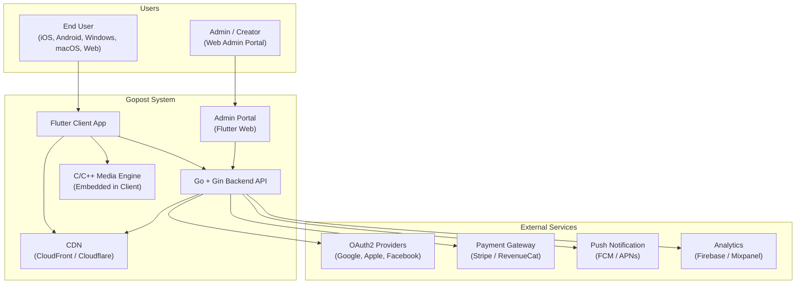

### 2.2 Container Diagram (C4 Level 2)

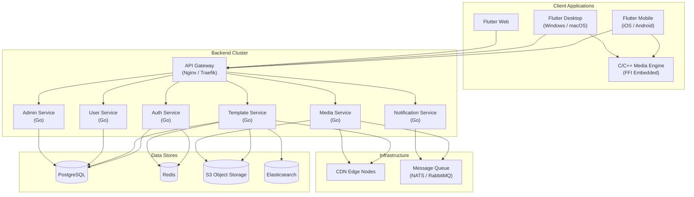

### 2.3 Data Flow — Template Lifecycle

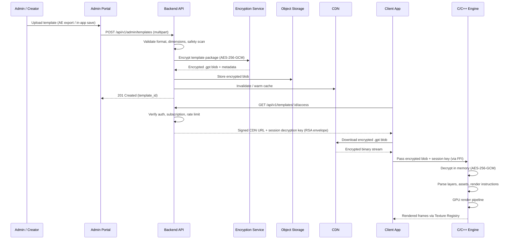

### 2.4 Platform Bridge Architecture

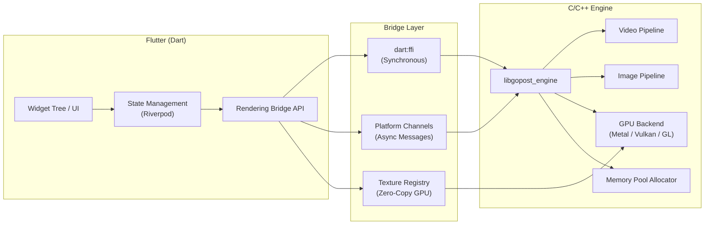

---

## 3. Frontend Architecture (Flutter)

### 3.1 Project Structure

```
gopost_app/
├── lib/
│   ├── main.dart
│   ├── app.dart
│   ├── core/
│   │   ├── di/                     # Dependency injection (Riverpod providers)
│   │   ├── network/                # HTTP client, interceptors, SSL pinning
│   │   ├── security/               # Secure storage, encryption helpers, integrity checks
│   │   ├── error/                  # Error types, failure handling, crash reporting
│   │   ├── theme/                  # App theme, typography, colors
│   │   ├── utils/                  # Extensions, formatters, validators
│   │   ├── constants/              # API endpoints, feature flags, dimensions
│   │   └── logging/                # Structured logging
│   ├── auth/
│   │   ├── data/
│   │   │   ├── datasources/        # Remote (API) and local (secure storage)
│   │   │   ├── models/             # DTO models (JSON serializable)
│   │   │   └── repositories/       # Repository implementations
│   │   ├── domain/
│   │   │   ├── entities/           # Auth entities (User, Token, Session)
│   │   │   ├── repositories/       # Repository interfaces (abstract)
│   │   │   └── usecases/           # Login, Register, RefreshToken, Logout
│   │   └── presentation/
│   │       ├── providers/          # Riverpod providers
│   │       ├── screens/            # LoginScreen, RegisterScreen, ForgotPasswordScreen
│   │       └── widgets/            # AuthForm, SocialLoginButtons, OTPInput
│   ├── template_browser/
│   │   ├── data/
│   │   ├── domain/
│   │   └── presentation/
│   │       ├── providers/
│   │       ├── screens/            # BrowseScreen, CategoryScreen, TemplateDetailScreen
│   │       └── widgets/            # TemplateCard, PreviewPlayer, FilterBar
│   ├── video_editor/
│   │   ├── data/
│   │   ├── domain/
│   │   │   ├── entities/           # Timeline, Track, Clip, Effect, Transition, Keyframe
│   │   │   └── usecases/           # ApplyEffect, ExportVideo, SaveAsTemplate
│   │   └── presentation/
│   │       ├── providers/
│   │       ├── screens/            # VideoEditorScreen
│   │       └── widgets/            # TimelineWidget, EffectPanel, LayerStack, AudioMixer
│   ├── image_editor/
│   │   ├── data/
│   │   ├── domain/
│   │   │   ├── entities/           # Canvas, Layer, Filter, TextElement, Sticker
│   │   │   └── usecases/           # ApplyFilter, ExportImage, SaveAsTemplate
│   │   └── presentation/
│   │       ├── providers/
│   │       ├── screens/            # ImageEditorScreen
│   │       └── widgets/            # CanvasWidget, LayerPanel, FilterGrid, ToolBar
│   ├── admin/
│   │   ├── data/
│   │   ├── domain/
│   │   └── presentation/
│   │       ├── providers/
│   │       ├── screens/            # DashboardScreen, UploadScreen, ModerationScreen
│   │       └── widgets/            # StatsCard, TemplateReviewCard, UserTable
│   └── rendering_bridge/
│       ├── ffi/                    # FFI bindings (generated via ffigen)
│       ├── channels/               # Platform channel definitions
│       ├── texture/                # Texture registry management
│       └── engine_api.dart         # Unified engine interface
├── native/
│   ├── gopost_engine/              # C/C++ source (see Section 5)
│   └── CMakeLists.txt
├── test/
│   ├── unit/
│   ├── widget/
│   └── integration/
├── ios/
├── android/
├── windows/
├── macos/
├── web/
└── pubspec.yaml
```

### 3.2 Module Dependency Graph

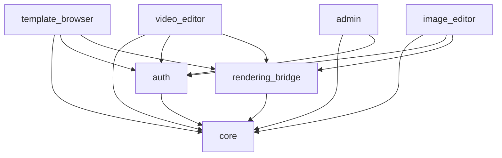

**Rule:** Modules may only depend downward. No circular dependencies. All cross-module communication happens through interfaces defined in `domain/` layers.

### 3.3 State Management (Riverpod)

Riverpod is chosen for its compile-time safety, testability, and provider scoping.

**Provider Dependency Flow:**

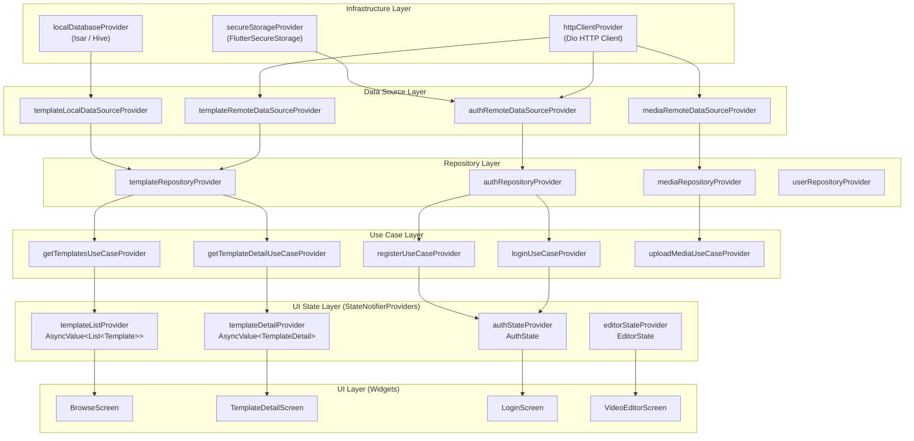

**Provider hierarchy per module:**

```dart
// Example: template_browser/presentation/providers/

// Data source provider
final templateRemoteDataSourceProvider = Provider<TemplateRemoteDataSource>((ref) {
  return TemplateRemoteDataSourceImpl(client: ref.watch(httpClientProvider));
});

// Repository provider
final templateRepositoryProvider = Provider<TemplateRepository>((ref) {
  return TemplateRepositoryImpl(
    remote: ref.watch(templateRemoteDataSourceProvider),
    cache: ref.watch(templateCacheProvider),
  );
});

// Use case provider
final getTemplatesUseCaseProvider = Provider<GetTemplates>((ref) {
  return GetTemplates(repository: ref.watch(templateRepositoryProvider));
});

// State notifier for UI
final templateListProvider =
    StateNotifierProvider<TemplateListNotifier, AsyncValue<List<Template>>>((ref) {
  return TemplateListNotifier(
    getTemplates: ref.watch(getTemplatesUseCaseProvider),
  );
});
```

### 3.4 Navigation (GoRouter)

**Application Route Tree:**

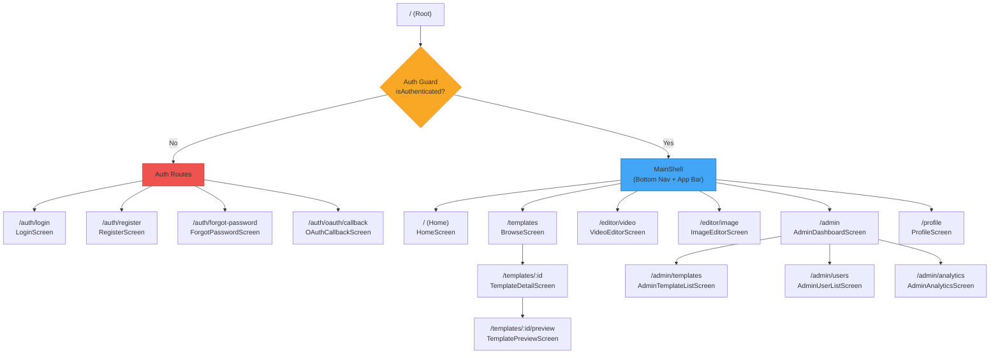

```dart
final routerProvider = Provider<GoRouter>((ref) {
  final authState = ref.watch(authStateProvider);

  return GoRouter(
    initialLocation: '/',
    redirect: (context, state) {
      final isAuthenticated = authState.isAuthenticated;
      final isAuthRoute = state.matchedLocation.startsWith('/auth');

      if (!isAuthenticated && !isAuthRoute) return '/auth/login';
      if (isAuthenticated && isAuthRoute) return '/';
      return null;
    },
    routes: [
      GoRoute(path: '/auth/login', builder: (_, __) => const LoginScreen()),
      GoRoute(path: '/auth/register', builder: (_, __) => const RegisterScreen()),
      ShellRoute(
        builder: (_, __, child) => MainShell(child: child),
        routes: [
          GoRoute(path: '/', builder: (_, __) => const HomeScreen()),
          GoRoute(path: '/templates', builder: (_, __) => const BrowseScreen()),
          GoRoute(path: '/templates/:id', builder: (_, state) =>
            TemplateDetailScreen(id: state.pathParameters['id']!)),
          GoRoute(path: '/editor/video', builder: (_, __) => const VideoEditorScreen()),
          GoRoute(path: '/editor/image', builder: (_, __) => const ImageEditorScreen()),
          GoRoute(path: '/admin', builder: (_, __) => const AdminDashboardScreen()),
        ],
      ),
    ],
  );
});
```

### 3.5 SOLID Principles Application

| Principle | Application |
|-----------|-------------|
| **Single Responsibility** | Each class has one reason to change. `TemplateRepository` handles data access; `TemplateListNotifier` handles UI state; `EncryptionService` handles crypto. |
| **Open/Closed** | New template types (video, image, audio) extend `BaseTemplate` without modifying existing code. Filter pipelines accept new filters via plugin registration. |
| **Liskov Substitution** | `TemplateRepository` interface is implemented by `TemplateRepositoryImpl` and `MockTemplateRepository` interchangeably. |
| **Interface Segregation** | `Renderable`, `Exportable`, `Editable` are separate interfaces rather than one monolithic `TemplateActions` interface. |
| **Dependency Inversion** | Use cases depend on abstract repository interfaces. Concrete implementations are injected via Riverpod providers. |

### 3.6 Key Flutter Packages

| Package | Purpose | Version Policy |
|---------|---------|----------------|
| `flutter_riverpod` | State management | Latest stable |
| `go_router` | Declarative routing | Latest stable |
| `dio` | HTTP client with interceptors | Latest stable |
| `ffi` / `ffigen` | C/C++ interop | SDK built-in |
| `flutter_secure_storage` | Keychain / Keystore access | Latest stable |
| `freezed` + `json_serializable` | Immutable models + JSON | Latest stable |
| `cached_network_image` | Image caching with placeholders | Latest stable |
| `shimmer` | Loading placeholders | Latest stable |
| `flutter_local_notifications` | Local push display | Latest stable |
| `device_info_plus` | Device fingerprinting | Latest stable |
| `package_info_plus` | App version info | Latest stable |

### 3.7 Rendering Bridge Module (Detail)

The `rendering_bridge` module is the critical interface between Flutter/Dart and the native C/C++ media engine.

```dart
// rendering_bridge/engine_api.dart

abstract class GopostEngine {
  Future<void> initialize();
  Future<void> dispose();

  // Template operations
  Future<TemplateMetadata> loadTemplate(Uint8List encryptedBlob, Uint8List sessionKey);
  Future<void> unloadTemplate(String templateId);

  // Video operations
  Future<int> createVideoTimeline(VideoTimelineConfig config);
  Future<void> addClipToTimeline(int timelineId, ClipDescriptor clip);
  Future<void> applyEffect(int timelineId, int trackId, EffectDescriptor effect);
  Future<void> seekTo(int timelineId, Duration position);
  Stream<RenderFrame> previewStream(int timelineId);
  Future<ExportResult> exportVideo(int timelineId, ExportConfig config);

  // Image operations
  Future<int> createCanvas(CanvasConfig config);
  Future<void> addLayer(int canvasId, LayerDescriptor layer);
  Future<void> applyFilter(int canvasId, int layerId, FilterDescriptor filter);
  Stream<RenderFrame> canvasPreviewStream(int canvasId);
  Future<ExportResult> exportImage(int canvasId, ExportConfig config);

  // GPU info
  Future<GpuCapabilities> queryGpuCapabilities();
}

class GopostEngineImpl implements GopostEngine {
  late final DynamicLibrary _nativeLib;
  late final NativeBindings _bindings;
  // FFI implementation delegates to libgopost_engine
}
```

**Texture delivery (zero-copy):**

```dart
// The engine registers a texture with Flutter's texture registry.
// Flutter renders it directly from GPU memory — no pixel copy.
class EngineTextureController {
  final int textureId;
  final TextureRegistry _registry;

  EngineTextureController(this._registry) :
    textureId = _registry.registerTexture(/* native texture handle */);

  Widget buildPreview() {
    return Texture(textureId: textureId);
  }
}
```

---

## 4. Backend Architecture (Go + Gin)

### 4.1 Project Structure

```
gopost-backend/
├── cmd/
│   └── server/
│       └── main.go                 # Entry point, DI wiring, graceful shutdown
├── internal/
│   ├── config/
│   │   └── config.go               # Env-based configuration (Viper)
│   ├── router/
│   │   ├── router.go               # Route registration
│   │   └── middleware/
│   │       ├── auth.go             # JWT validation middleware
│   │       ├── rbac.go             # Role-based access control
│   │       ├── ratelimit.go        # Token bucket rate limiter
│   │       ├── cors.go             # CORS configuration
│   │       ├── logging.go          # Request/response logging
│   │       └── recovery.go         # Panic recovery
│   ├── controller/
│   │   ├── auth_controller.go
│   │   ├── user_controller.go
│   │   ├── template_controller.go
│   │   ├── media_controller.go
│   │   ├── admin_controller.go
│   │   └── subscription_controller.go
│   ├── service/
│   │   ├── auth_service.go
│   │   ├── user_service.go
│   │   ├── template_service.go
│   │   ├── media_service.go
│   │   ├── admin_service.go
│   │   ├── subscription_service.go
│   │   ├── encryption_service.go
│   │   └── notification_service.go
│   ├── domain/
│   │   ├── entity/
│   │   │   ├── user.go
│   │   │   ├── template.go
│   │   │   ├── subscription.go
│   │   │   └── audit.go
│   │   ├── valueobject/
│   │   │   ├── email.go
│   │   │   ├── password.go
│   │   │   └── role.go
│   │   └── event/
│   │       ├── template_events.go
│   │       └── user_events.go
│   ├── repository/
│   │   ├── interfaces.go           # All repository interfaces
│   │   ├── postgres/
│   │   │   ├── user_repo.go
│   │   │   ├── template_repo.go
│   │   │   └── subscription_repo.go
│   │   ├── redis/
│   │   │   ├── session_repo.go
│   │   │   └── cache_repo.go
│   │   └── s3/
│   │       └── storage_repo.go
│   └── infrastructure/
│       ├── database/
│       │   ├── postgres.go         # Connection pool setup
│       │   └── migrations/         # SQL migration files
│       ├── cache/
│       │   └── redis.go            # Redis client setup
│       ├── storage/
│       │   └── s3.go               # S3 client setup
│       ├── search/
│       │   └── elasticsearch.go    # ES client setup
│       ├── messaging/
│       │   └── nats.go             # Message queue client
│       └── crypto/
│           ├── aes.go              # AES-256-GCM encrypt/decrypt
│           ├── rsa.go              # RSA key management
│           └── signing.go          # Template package signing
├── pkg/
│   ├── jwt/
│   │   └── jwt.go                  # JWT generation and validation
│   ├── validator/
│   │   └── validator.go            # Request validation helpers
│   ├── response/
│   │   └── response.go             # Standardized API response format
│   └── logger/
│       └── logger.go               # Structured logging (zerolog)
├── migrations/
│   ├── 000001_create_users.up.sql
│   ├── 000001_create_users.down.sql
│   └── ...
├── Dockerfile
├── docker-compose.yml
├── Makefile
├── go.mod
└── go.sum
```

### 4.2 Layer Architecture Diagram

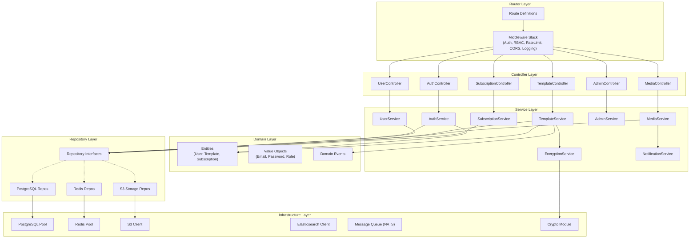

### 4.3 Dependency Injection

Go does not have a DI framework by convention. We use **constructor injection** via a central wiring function:

```go
// cmd/server/main.go

func main() {
    cfg := config.Load()

    // Infrastructure
    db := database.NewPostgresPool(cfg.Database)
    redis := cache.NewRedisClient(cfg.Redis)
    s3 := storage.NewS3Client(cfg.S3)
    es := search.NewESClient(cfg.Elasticsearch)

    // Repositories
    userRepo := postgres.NewUserRepository(db)
    templateRepo := postgres.NewTemplateRepository(db)
    sessionRepo := redisrepo.NewSessionRepository(redis)
    storageRepo := s3repo.NewStorageRepository(s3)

    // Services
    cryptoSvc := crypto.NewEncryptionService(cfg.Crypto)
    authSvc := service.NewAuthService(userRepo, sessionRepo, cfg.JWT)
    userSvc := service.NewUserService(userRepo)
    templateSvc := service.NewTemplateService(templateRepo, storageRepo, cryptoSvc, es)
    mediaSvc := service.NewMediaService(storageRepo)
    adminSvc := service.NewAdminService(templateRepo, userRepo)
    subSvc := service.NewSubscriptionService(userRepo)

    // Controllers
    authCtrl := controller.NewAuthController(authSvc)
    userCtrl := controller.NewUserController(userSvc)
    templateCtrl := controller.NewTemplateController(templateSvc)
    mediaCtrl := controller.NewMediaController(mediaSvc)
    adminCtrl := controller.NewAdminController(adminSvc)
    subCtrl := controller.NewSubscriptionController(subSvc)

    // Router
    r := router.Setup(cfg, authCtrl, userCtrl, templateCtrl, mediaCtrl, adminCtrl, subCtrl)

    // Graceful shutdown
    srv := &http.Server{Addr: cfg.Server.Addr, Handler: r}
    go func() { srv.ListenAndServe() }()

    quit := make(chan os.Signal, 1)
    signal.Notify(quit, syscall.SIGINT, syscall.SIGTERM)
    <-quit

    ctx, cancel := context.WithTimeout(context.Background(), 10*time.Second)
    defer cancel()
    srv.Shutdown(ctx)
}
```

### 4.4 Interface-Driven Repository Design

```go
// repository/interfaces.go

type UserRepository interface {
    Create(ctx context.Context, user *entity.User) error
    GetByID(ctx context.Context, id uuid.UUID) (*entity.User, error)
    GetByEmail(ctx context.Context, email string) (*entity.User, error)
    Update(ctx context.Context, user *entity.User) error
    Delete(ctx context.Context, id uuid.UUID) error
    List(ctx context.Context, filter UserFilter, page Pagination) ([]*entity.User, int64, error)
}

type TemplateRepository interface {
    Create(ctx context.Context, tmpl *entity.Template) error
    GetByID(ctx context.Context, id uuid.UUID) (*entity.Template, error)
    Update(ctx context.Context, tmpl *entity.Template) error
    Delete(ctx context.Context, id uuid.UUID) error
    List(ctx context.Context, filter TemplateFilter, page Pagination) ([]*entity.Template, int64, error)
    ListByCategory(ctx context.Context, categoryID uuid.UUID, page Pagination) ([]*entity.Template, int64, error)
    IncrementUsageCount(ctx context.Context, id uuid.UUID) error
}

type StorageRepository interface {
    Upload(ctx context.Context, key string, data io.Reader, contentType string) (string, error)
    Download(ctx context.Context, key string) (io.ReadCloser, error)
    Delete(ctx context.Context, key string) error
    GenerateSignedURL(ctx context.Context, key string, expiry time.Duration) (string, error)
}

type SessionRepository interface {
    Set(ctx context.Context, sessionID string, data []byte, ttl time.Duration) error
    Get(ctx context.Context, sessionID string) ([]byte, error)
    Delete(ctx context.Context, sessionID string) error
    Exists(ctx context.Context, sessionID string) (bool, error)
}

type CacheRepository interface {
    Set(ctx context.Context, key string, value interface{}, ttl time.Duration) error
    Get(ctx context.Context, key string, dest interface{}) error
    Delete(ctx context.Context, key string) error
    Invalidate(ctx context.Context, pattern string) error
}
```

### 4.5 Authentication and Authorization

**Authentication and Token Lifecycle:**

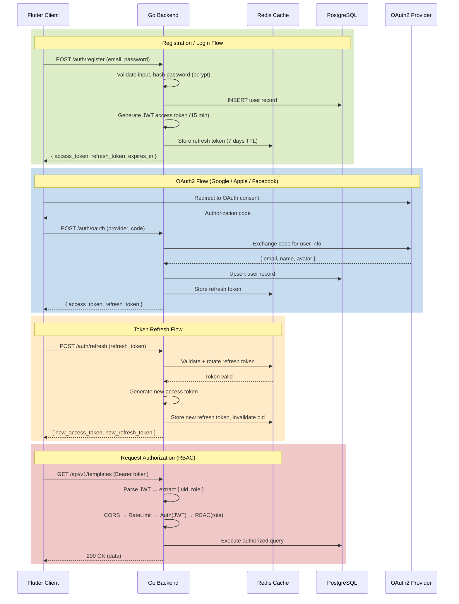

**RBAC Authorization Matrix:**

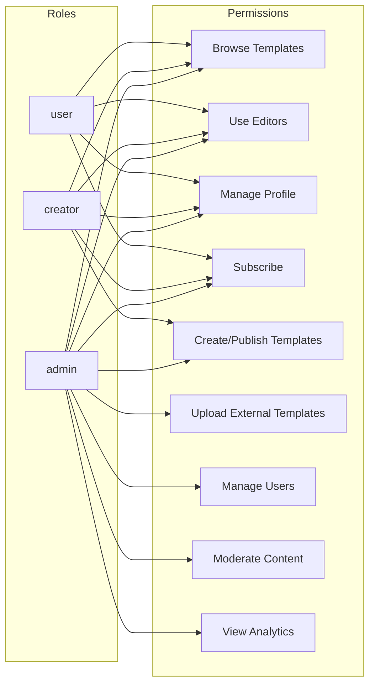

**JWT structure:**

```go
type TokenClaims struct {
    UserID uuid.UUID `json:"uid"`
    Role   string    `json:"role"`
    jwt.RegisteredClaims
}
```

| Token Type     | Expiry   | Storage        | Rotation                |
| -------------- | -------- | -------------- | ----------------------- |
| Access Token   | 15 min   | Client memory  | Re-issued on refresh    |
| Refresh Token  | 7 days   | Redis + Secure Storage | Rotated on each use |

**RBAC roles:**

| Role      | Capabilities |
| --------- | ------------ |
| `user`    | Browse templates, use editors, manage own profile, subscribe |
| `creator` | All `user` + create/publish templates via in-app editor |
| `admin`   | All `creator` + upload external templates, manage users, moderate content, access analytics |

**Middleware chain:**

```
Request -> CORS -> RateLimit -> Logging -> Auth(JWT) -> RBAC(role check) -> Controller
```

### 4.6 Rate Limiting

**Token Bucket Rate Limiting Flow:**

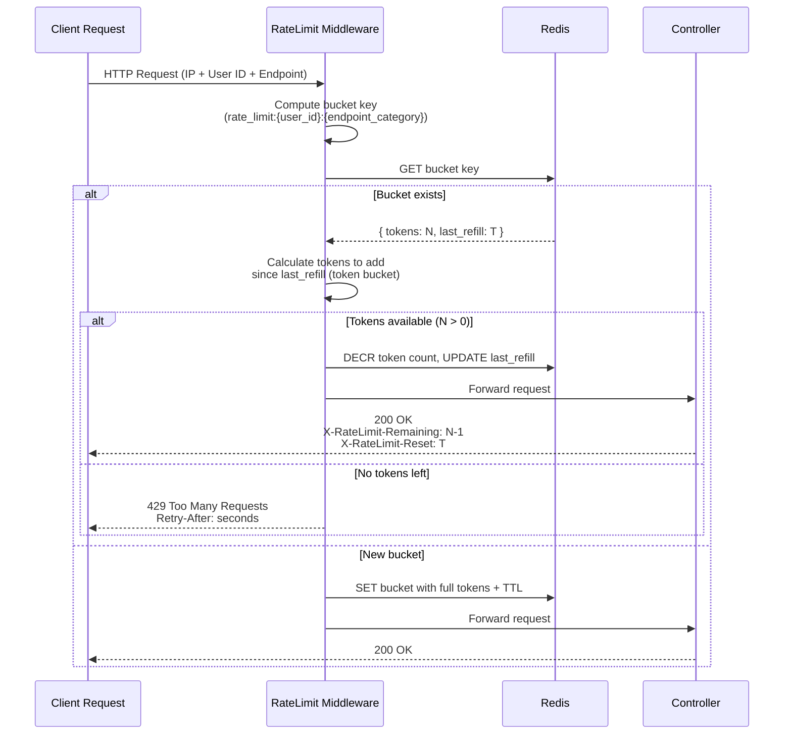

Token-bucket algorithm implemented with Redis:

| Endpoint Category | Requests/min (authenticated) | Requests/min (anonymous) |
| ----------------- | ---------------------------- | ------------------------ |
| Auth endpoints    | 10                           | 5                        |
| Template browsing | 120                          | 30                       |
| Template access   | 60                           | N/A                      |
| Media upload      | 20                           | N/A                      |
| Admin endpoints   | 300                          | N/A                      |

### 4.7 Standardized API Response

```go
// pkg/response/response.go

type APIResponse struct {
    Success bool        `json:"success"`
    Data    interface{} `json:"data,omitempty"`
    Error   *APIError   `json:"error,omitempty"`
    Meta    *Meta       `json:"meta,omitempty"`
}

type APIError struct {
    Code    string `json:"code"`
    Message string `json:"message"`
    Details []FieldError `json:"details,omitempty"`
}

type Meta struct {
    Page       int   `json:"page"`
    PerPage    int   `json:"per_page"`
    Total      int64 `json:"total"`
    TotalPages int   `json:"total_pages"`
}
```

---

## 5. Media Processing Engine (C/C++)

### 5.1 Engine Architecture

```
native/gopost_engine/
├── CMakeLists.txt                  # Cross-platform build system
├── include/
│   └── gopost/
│       ├── engine.h                # Public C API (FFI-compatible)
│       ├── types.h                 # Shared type definitions
│       ├── error.h                 # Error codes
│       └── version.h               # Version info
├── src/
│   ├── core/
│   │   ├── engine.cpp              # Engine lifecycle
│   │   ├── allocator.cpp           # Custom memory pool allocator
│   │   ├── thread_pool.cpp         # Worker thread pool
│   │   └── logger.cpp              # Native logging bridge
│   ├── crypto/
│   │   ├── aes_gcm.cpp             # AES-256-GCM decryption
│   │   ├── rsa.cpp                 # RSA key unwrapping
│   │   └── secure_memory.cpp       # mlock, guard pages, zeroing
│   ├── video/
│   │   ├── decoder.cpp             # FFmpeg-based decoder
│   │   ├── encoder.cpp             # FFmpeg-based encoder
│   │   ├── timeline.cpp            # Multi-track timeline logic
│   │   ├── compositor.cpp          # Layer composition
│   │   ├── effects/
│   │   │   ├── effect_registry.cpp
│   │   │   ├── color_effects.cpp
│   │   │   ├── blur_effects.cpp
│   │   │   ├── transition_effects.cpp
│   │   │   └── keyframe_interpolator.cpp
│   │   └── audio/
│   │       ├── mixer.cpp
│   │       └── audio_effects.cpp
│   ├── image/
│   │   ├── decoder.cpp             # Image format decoders (JPEG, PNG, WebP, HEIC)
│   │   ├── encoder.cpp             # Image format encoders
│   │   ├── canvas.cpp              # Multi-layer canvas
│   │   ├── compositor.cpp          # Layer blending modes
│   │   ├── filters/
│   │   │   ├── filter_registry.cpp
│   │   │   ├── color_filters.cpp
│   │   │   ├── blur_filters.cpp
│   │   │   └── artistic_filters.cpp
│   │   └── text/
│   │       └── text_renderer.cpp   # FreeType-based text rendering
│   ├── gpu/
│   │   ├── gpu_context.cpp         # Abstract GPU context
│   │   ├── metal/                  # Metal backend (iOS/macOS)
│   │   │   ├── metal_context.mm
│   │   │   ├── metal_pipeline.mm
│   │   │   └── metal_shaders.metal
│   │   ├── vulkan/                 # Vulkan backend (Android/Windows)
│   │   │   ├── vulkan_context.cpp
│   │   │   ├── vulkan_pipeline.cpp
│   │   │   └── shaders/
│   │   ├── gles/                   # OpenGL ES fallback
│   │   │   ├── gles_context.cpp
│   │   │   └── gles_pipeline.cpp
│   │   └── webgl/                  # WebGL via Emscripten (Web)
│   │       └── webgl_context.cpp
│   └── template/
│       ├── template_parser.cpp     # .gpt format parser
│       ├── template_renderer.cpp   # Render instruction executor
│       └── asset_resolver.cpp      # Resolve encrypted asset references
├── third_party/
│   ├── ffmpeg/                     # FFmpeg libs (pre-built per platform)
│   ├── openssl/                    # OpenSSL (crypto)
│   ├── freetype/                   # Text rendering
│   └── stb/                        # stb_image for lightweight decode
└── tests/
    ├── test_allocator.cpp
    ├── test_crypto.cpp
    ├── test_video_pipeline.cpp
    ├── test_image_pipeline.cpp
    └── test_template_parser.cpp
```

### 5.2 Public C API (FFI Boundary)

All Dart FFI calls go through a flat C API with opaque handles:

```c
// include/gopost/engine.h

#ifndef GOPOST_ENGINE_H
#define GOPOST_ENGINE_H

#include "gopost/types.h"
#include "gopost/error.h"

#ifdef __cplusplus
extern "C" {
#endif

// Engine lifecycle
GP_EXPORT GpError gp_engine_init(const GpEngineConfig* config, GpEngine** out_engine);
GP_EXPORT void    gp_engine_destroy(GpEngine* engine);
GP_EXPORT GpError gp_engine_query_gpu(GpEngine* engine, GpGpuInfo* out_info);

// Template operations
GP_EXPORT GpError gp_template_load(
    GpEngine* engine,
    const uint8_t* encrypted_data, size_t data_len,
    const uint8_t* session_key, size_t key_len,
    GpTemplate** out_template
);
GP_EXPORT void    gp_template_unload(GpTemplate* tmpl);
GP_EXPORT GpError gp_template_get_metadata(GpTemplate* tmpl, GpTemplateMetadata* out_meta);

// Video timeline
GP_EXPORT GpError gp_timeline_create(GpEngine* engine, const GpTimelineConfig* config,
                                      GpTimeline** out_timeline);
GP_EXPORT void    gp_timeline_destroy(GpTimeline* timeline);
GP_EXPORT GpError gp_timeline_add_clip(GpTimeline* timeline, const GpClipDescriptor* clip);
GP_EXPORT GpError gp_timeline_remove_clip(GpTimeline* timeline, int32_t clip_id);
GP_EXPORT GpError gp_timeline_apply_effect(GpTimeline* timeline, int32_t track_id,
                                            const GpEffectDescriptor* effect);
GP_EXPORT GpError gp_timeline_seek(GpTimeline* timeline, int64_t position_us);
GP_EXPORT GpError gp_timeline_render_frame(GpTimeline* timeline, GpFrame** out_frame);
GP_EXPORT GpError gp_timeline_export(GpTimeline* timeline, const GpExportConfig* config,
                                      GpExportCallback callback, void* user_data);

// Image canvas
GP_EXPORT GpError gp_canvas_create(GpEngine* engine, const GpCanvasConfig* config,
                                    GpCanvas** out_canvas);
GP_EXPORT void    gp_canvas_destroy(GpCanvas* canvas);
GP_EXPORT GpError gp_canvas_add_layer(GpCanvas* canvas, const GpLayerDescriptor* layer);
GP_EXPORT GpError gp_canvas_apply_filter(GpCanvas* canvas, int32_t layer_id,
                                          const GpFilterDescriptor* filter);
GP_EXPORT GpError gp_canvas_render(GpCanvas* canvas, GpFrame** out_frame);
GP_EXPORT GpError gp_canvas_export(GpCanvas* canvas, const GpExportConfig* config);

// Frame management
GP_EXPORT void    gp_frame_release(GpFrame* frame);
GP_EXPORT GpError gp_frame_get_texture_handle(GpFrame* frame, void** out_handle);

#ifdef __cplusplus
}
#endif

#endif // GOPOST_ENGINE_H
```

### 5.3 Video Processing Pipeline

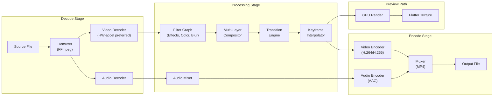

### 5.4 Image Processing Pipeline

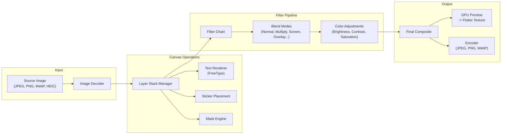

### 5.5 Memory Management

**Memory Pool Architecture and Lifecycle:**

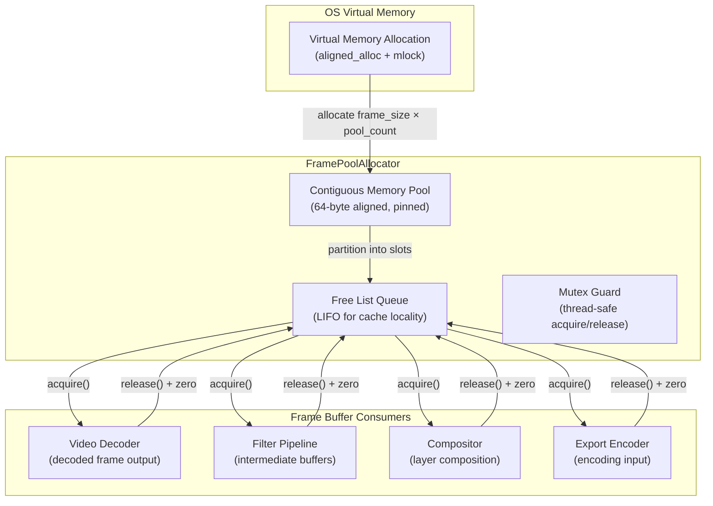

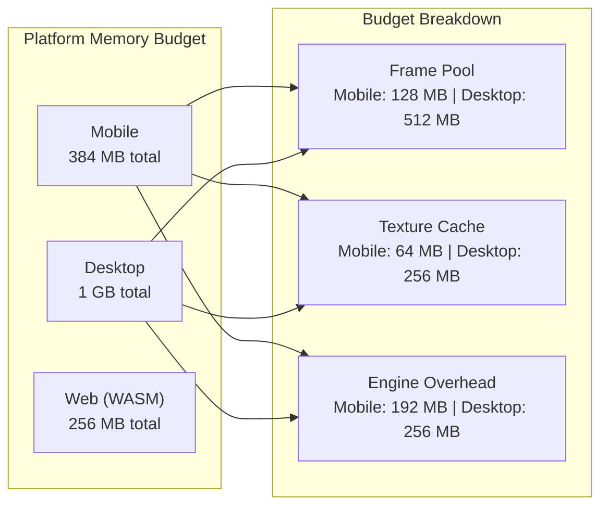

**Pool allocator design:**

```cpp
// Simplified pool allocator for frame buffers
class FramePoolAllocator {
public:
    explicit FramePoolAllocator(size_t frame_size, size_t pool_count)
        : frame_size_(frame_size), pool_count_(pool_count) {
        pool_ = static_cast<uint8_t*>(std::aligned_alloc(64, frame_size * pool_count));
        mlock(pool_, frame_size * pool_count);  // prevent swap
        for (size_t i = 0; i < pool_count; ++i) {
            free_list_.push(pool_ + i * frame_size);
        }
    }

    ~FramePoolAllocator() {
        munlock(pool_, frame_size_ * pool_count_);
        explicit_bzero(pool_, frame_size_ * pool_count_);  // zero before free
        std::free(pool_);
    }

    uint8_t* acquire() {
        std::lock_guard<std::mutex> lock(mutex_);
        if (free_list_.empty()) return nullptr;
        auto* ptr = free_list_.front();
        free_list_.pop();
        return ptr;
    }

    void release(uint8_t* ptr) {
        std::lock_guard<std::mutex> lock(mutex_);
        explicit_bzero(ptr, frame_size_);  // zero sensitive data
        free_list_.push(ptr);
    }

private:
    uint8_t* pool_;
    size_t frame_size_;
    size_t pool_count_;
    std::queue<uint8_t*> free_list_;
    std::mutex mutex_;
};
```

**Memory budget targets:**

| Platform       | Max Engine Memory | Frame Pool Size | Texture Cache |
| -------------- | ----------------- | --------------- | ------------- |
| iOS / Android  | 384 MB            | 128 MB          | 64 MB         |
| Desktop        | 1 GB              | 512 MB          | 256 MB        |
| Web (WASM)     | 256 MB            | 64 MB           | 32 MB         |

### 5.6 GPU Backend Abstraction

```cpp
// Abstract GPU context — each platform implements this interface
class IGpuContext {
public:
    virtual ~IGpuContext() = default;

    virtual bool initialize() = 0;
    virtual void shutdown() = 0;

    virtual GpuTextureHandle createTexture(int width, int height, PixelFormat format) = 0;
    virtual void destroyTexture(GpuTextureHandle handle) = 0;
    virtual void uploadToTexture(GpuTextureHandle handle, const uint8_t* data, size_t size) = 0;

    virtual GpuPipelineHandle createPipeline(const ShaderProgram& program) = 0;
    virtual void bindPipeline(GpuPipelineHandle handle) = 0;
    virtual void dispatch(int width, int height) = 0;

    virtual void* getNativeTextureHandle(GpuTextureHandle handle) = 0;

    static std::unique_ptr<IGpuContext> createForPlatform();
};
```

**Platform mapping:**

| Platform          | Primary GPU API | Fallback      |
| ----------------- | --------------- | ------------- |
| iOS / macOS       | Metal           | OpenGL ES 3.0 |
| Android           | Vulkan 1.1      | OpenGL ES 3.0 |
| Windows           | Vulkan 1.1      | OpenGL 4.5    |
| Web               | WebGL 2.0       | Software (Canvas 2D) |

### 5.7 Cross-Platform Build (CMake)

```cmake
cmake_minimum_required(VERSION 3.20)
project(gopost_engine VERSION 1.0.0 LANGUAGES C CXX)

set(CMAKE_CXX_STANDARD 20)
set(CMAKE_C_STANDARD 17)

option(GP_ENABLE_METAL "Enable Metal GPU backend" OFF)
option(GP_ENABLE_VULKAN "Enable Vulkan GPU backend" OFF)
option(GP_ENABLE_GLES "Enable OpenGL ES GPU backend" OFF)
option(GP_ENABLE_WEBGL "Enable WebGL GPU backend (Emscripten)" OFF)

# Platform detection
if(APPLE)
    set(GP_ENABLE_METAL ON)
    if(IOS)
        set(GP_PLATFORM "ios")
    else()
        set(GP_PLATFORM "macos")
    endif()
elseif(ANDROID)
    set(GP_ENABLE_VULKAN ON)
    set(GP_ENABLE_GLES ON)
    set(GP_PLATFORM "android")
elseif(WIN32)
    set(GP_ENABLE_VULKAN ON)
    set(GP_PLATFORM "windows")
elseif(EMSCRIPTEN)
    set(GP_ENABLE_WEBGL ON)
    set(GP_PLATFORM "web")
endif()

file(GLOB_RECURSE ENGINE_SOURCES "src/*.cpp" "src/*.c")

if(GP_ENABLE_METAL)
    file(GLOB_RECURSE METAL_SOURCES "src/gpu/metal/*.mm" "src/gpu/metal/*.metal")
    list(APPEND ENGINE_SOURCES ${METAL_SOURCES})
endif()

add_library(gopost_engine SHARED ${ENGINE_SOURCES})

target_include_directories(gopost_engine PUBLIC include)

# Link third-party libs (FFmpeg, OpenSSL, FreeType)
target_link_libraries(gopost_engine PRIVATE
    ffmpeg::avcodec ffmpeg::avformat ffmpeg::avutil ffmpeg::swscale ffmpeg::swresample
    OpenSSL::SSL OpenSSL::Crypto
    freetype
)
```

---

## 6. Secure Template System

### 6.1 Custom Template Format (.gpt)

The `.gpt` (Gopost Template) format is a custom encrypted binary container:

```
+--------------------------------------------------+
| GPT File Structure                                |
+--------------------------------------------------+
| Magic Bytes: "GOPT" (4 bytes)                     |
| Version: uint16 (2 bytes)                         |
| Flags: uint16 (2 bytes)                           |
| Template Type: uint8 (1 = video, 2 = image)       |
| Reserved: 7 bytes                                 |
+--------------------------------------------------+
| Encryption Header (64 bytes)                      |
|   Algorithm ID: uint8 (1 = AES-256-GCM)          |
|   IV / Nonce: 12 bytes                            |
|   Auth Tag: 16 bytes                              |
|   Key ID: 16 bytes (references server key)        |
|   Reserved: 19 bytes                              |
+--------------------------------------------------+
| Metadata Section (encrypted)                      |
|   Section Length: uint32                           |
|   JSON payload:                                   |
|     - template_id (UUID)                          |
|     - name, description                           |
|     - dimensions (width x height)                 |
|     - duration (video only)                       |
|     - layer_count                                 |
|     - tags, category                              |
|     - created_at, version                         |
+--------------------------------------------------+
| Layer Definitions (encrypted)                     |
|   Section Length: uint32                           |
|   Array of LayerDef:                              |
|     - layer_type (video, image, text, shape,      |
|       sticker, audio)                             |
|     - z_order                                     |
|     - transform (position, scale, rotation)       |
|     - opacity, blend_mode                         |
|     - keyframes[] (time -> property values)       |
|     - asset_ref (index into Asset Table)          |
|     - effects[] (effect_type, parameters)         |
+--------------------------------------------------+
| Asset Table (encrypted)                           |
|   Section Length: uint32                           |
|   Array of AssetEntry:                            |
|     - asset_id                                    |
|     - asset_type (embedded / cdn_ref)             |
|     - content_hash (SHA-256)                      |
|     - For embedded: offset + length in Blob Sect. |
|     - For cdn_ref: encrypted CDN URI              |
+--------------------------------------------------+
| Render Instructions (encrypted)                   |
|   Section Length: uint32                           |
|   - composition_order                             |
|   - transition_graph                              |
|   - timing_curves                                 |
|   - output_config (resolution, fps, codec)        |
+--------------------------------------------------+
| Blob Section (encrypted)                          |
|   Embedded asset binary data                      |
|   (thumbnails, small overlays, sticker PNGs)      |
+--------------------------------------------------+
| File Checksum: SHA-256 of everything above        |
+--------------------------------------------------+
```

### 6.2 Encryption Pipeline

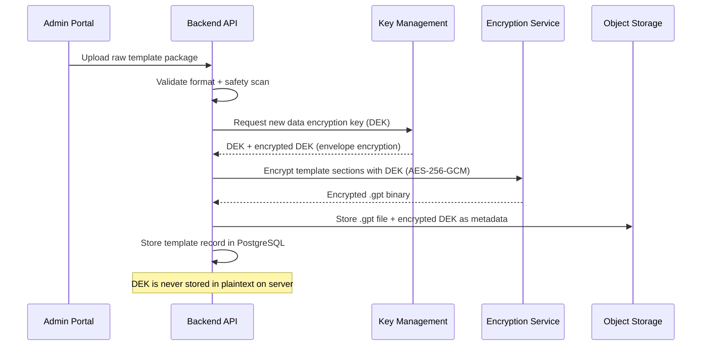

**Client-side decryption flow:**

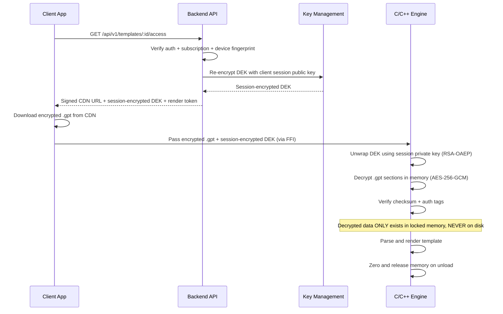

### 6.3 Anti-Extraction Measures

| Threat | Mitigation | Implementation |
|--------|------------|----------------|
| Disk forensics | Templates never written decrypted to disk | `mlock()` on all decrypted buffers; no temp files |
| Memory dump | Locked memory + immediate zeroing | `mlock()`, `madvise(MADV_DONTDUMP)`, `explicit_bzero()` on release |
| Swap extraction | Prevent swap of sensitive pages | `mlock()` / `VirtualLock()` on Windows |
| Debugger attach | Runtime debugger detection | `ptrace(PTRACE_TRACEME)` on Linux/Android, `sysctl` on iOS/macOS, `IsDebuggerPresent()` on Windows |
| Jailbreak/root | Device integrity checks | SafetyNet/Play Integrity (Android), DeviceCheck (iOS), custom root detection heuristics |
| Network interception | Certificate pinning | Pin leaf + intermediate certs; reject unknown CAs |
| Binary analysis | Code obfuscation | ProGuard/R8 (Android Dart), Bitcode (iOS), symbol stripping, control-flow flattening in C++ (LLVM obfuscator) |
| API replay | Time-limited render tokens | Server issues JWT render token valid for 5 minutes; engine validates before decryption |
| Template sharing | Device-bound session keys | Encryption keys tied to device fingerprint; non-transferable |

### 6.4 Admin Upload Flow

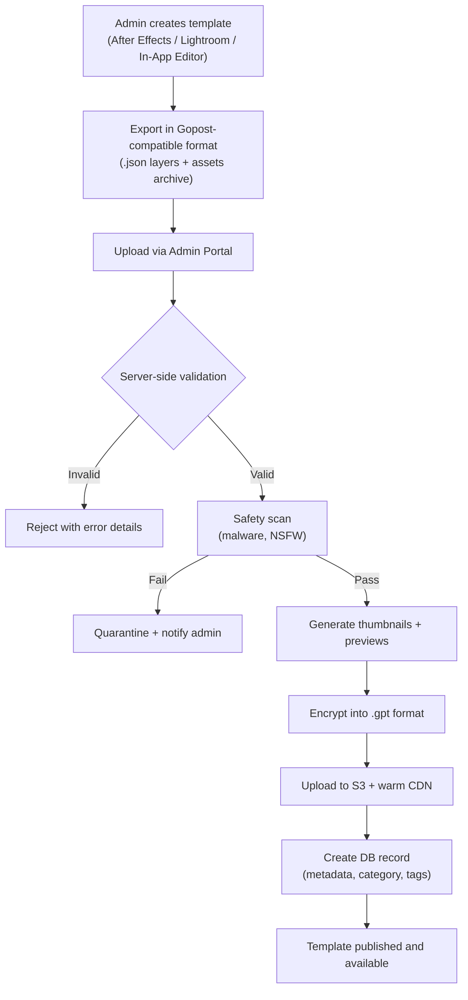

---

## 7. Security Architecture (Full Stack)

### 7.1 Security Layers Overview

```mermaid
graph TB
    subgraph clientSecurity ["Client Security"]
        SSLPin["SSL / Certificate Pinning"]
        CodeObf["Code Obfuscation"]
        SecureStore["Secure Storage<br/>(Keychain / Keystore)"]
        RuntimeCheck["Runtime Integrity Checks"]
        AntiTamper["Anti-Tampering<br/>(checksum verification)"]
        AntiDebug["Anti-Debug Detection"]
        JBDetect["Jailbreak / Root Detection"]
    end

    subgraph networkSecurity ["Network Security"]
        TLS13["TLS 1.3 Everywhere"]
        CertPin["Certificate Pinning"]
        ReqSign["Request Signing (HMAC)"]
    end

    subgraph apiSecurity ["API Security"]
        JWT["JWT Authentication"]
        RBAC["RBAC Authorization"]
        RateLimit["Rate Limiting"]
        InputVal["Input Validation"]
        CORS["CORS Policy"]
        CSP["CSP Headers"]
    end

    subgraph infraSecurity ["Infrastructure Security"]
        WAF["Web Application Firewall"]
        DDoS["DDoS Protection"]
        Vault["Secrets Management<br/>(HashiCorp Vault)"]
        AuditLog["Audit Logging"]
        Encrypt["Encryption at Rest"]
    end

    subgraph mediaSecurity ["Media / Template Security"]
        AES["AES-256-GCM Encryption"]
        RSA["RSA-2048 Key Exchange"]
        MemOnly["Memory-Only Decryption"]
        RenderToken["Server-Issued Render Tokens"]
        DeviceBind["Device-Bound Keys"]
    end

    clientSecurity --> networkSecurity
    networkSecurity --> apiSecurity
    apiSecurity --> infraSecurity
    infraSecurity --> mediaSecurity
```

### 7.2 Frontend Security Details

**SSL Pinning (Dio interceptor):**

```dart
class SSLPinningInterceptor extends Interceptor {
  static const _pinnedFingerprints = [
    'sha256/AAAAAAAAAAAAAAAAAAAAAAAAAAAAAAAAAAAAAAAAAAA=',  // Leaf cert
    'sha256/BBBBBBBBBBBBBBBBBBBBBBBBBBBBBBBBBBBBBBBBBBB=',  // Intermediate
  ];

  @override
  void onRequest(RequestOptions options, RequestInterceptorHandler handler) {
    (options.extra['dio.extra.httpClientAdapter'] as DefaultHttpClientAdapter?)
        ?.onHttpClientCreate = (client) {
      client.badCertificateCallback = (cert, host, port) => false;
      // Pinning is validated in the SecurityContext setup
    };
    handler.next(options);
  }
}
```

**Secure local storage strategy:**

| Data Type | Storage | Encryption |
|-----------|---------|------------|
| Access Token | In-memory only | N/A (never persisted) |
| Refresh Token | flutter_secure_storage (Keychain/Keystore) | Platform hardware-backed |
| Session Keys | In-memory only | N/A |
| User Preferences | SharedPreferences | Not sensitive |
| Cached Template Metadata | Encrypted SQLite (sqlcipher) | AES-256 |

**Runtime integrity checks:**

```dart
class IntegrityChecker {
  static Future<bool> verify() async {
    final checks = await Future.wait([
      _checkDebugMode(),
      _checkRootJailbreak(),
      _checkEmulator(),
      _checkAppSignature(),
      _checkHookingFrameworks(),
    ]);
    return checks.every((passed) => passed);
  }

  static Future<bool> _checkDebugMode() async {
    // kReleaseMode is compile-time constant in Flutter
    if (!kReleaseMode) return false;
    // Additional runtime checks via platform channel
    return await _channel.invokeMethod('checkDebugger');
  }

  // ... other checks
}
```

### 7.3 Backend Security Details

**JWT middleware:**

```go
func AuthMiddleware(jwtSecret string) gin.HandlerFunc {
    return func(c *gin.Context) {
        header := c.GetHeader("Authorization")
        if header == "" || !strings.HasPrefix(header, "Bearer ") {
            c.AbortWithStatusJSON(401, response.Error("UNAUTHORIZED", "Missing token"))
            return
        }

        token := strings.TrimPrefix(header, "Bearer ")
        claims, err := jwt.Validate(token, jwtSecret)
        if err != nil {
            c.AbortWithStatusJSON(401, response.Error("INVALID_TOKEN", "Token invalid or expired"))
            return
        }

        c.Set("user_id", claims.UserID)
        c.Set("user_role", claims.Role)
        c.Next()
    }
}
```

**RBAC middleware:**

```go
func RequireRole(roles ...string) gin.HandlerFunc {
    allowed := make(map[string]bool)
    for _, r := range roles {
        allowed[r] = true
    }
    return func(c *gin.Context) {
        role, exists := c.Get("user_role")
        if !exists || !allowed[role.(string)] {
            c.AbortWithStatusJSON(403, response.Error("FORBIDDEN", "Insufficient permissions"))
            return
        }
        c.Next()
    }
}
```

**Input validation (struct tags):**

```go
type CreateTemplateRequest struct {
    Name        string   `json:"name" binding:"required,min=1,max=100"`
    Description string   `json:"description" binding:"max=500"`
    CategoryID  string   `json:"category_id" binding:"required,uuid"`
    Type        string   `json:"type" binding:"required,oneof=video image"`
    Tags        []string `json:"tags" binding:"max=10,dive,min=1,max=30"`
}
```

### 7.4 Infrastructure Security

| Concern | Solution | Configuration |
|---------|----------|---------------|
| Secrets management | HashiCorp Vault | Dynamic secrets for DB, static for JWT signing keys |
| DDoS protection | Cloudflare / AWS Shield | Layer 3/4/7 protection, challenge pages |
| WAF | Cloudflare WAF / AWS WAF | OWASP Core Rule Set, custom rules for API |
| Encryption at rest | AWS KMS / self-managed | PostgreSQL TDE, S3 SSE-KMS, Redis encryption |
| Audit logging | Structured JSON logs -> Loki | All auth events, admin actions, template access |
| Vulnerability scanning | Trivy (containers), Snyk (dependencies) | CI/CD gate: block on critical CVEs |

### 7.5 GDPR and Compliance

| Requirement | Implementation |
|-------------|----------------|
| Right to access | `GET /api/v1/users/me/data-export` — returns all user data as JSON |
| Right to erasure | `DELETE /api/v1/users/me` — hard delete + cascade (30-day grace period) |
| Data minimization | Only collect necessary fields; no unnecessary analytics |
| Consent management | Explicit opt-in for analytics, marketing; stored in user preferences |
| Data portability | Export in standard JSON format |
| Breach notification | Automated alerting pipeline; 72-hour disclosure process documented |

---

## 8. Performance and Memory Strategy

**Full-Stack Performance Architecture:**

```mermaid
graph TB
    subgraph FlutterLayer ["Flutter Layer — UI Performance"]
        LazyLoad["Lazy Loading<br/>ListView.builder"]
        ConstWidgets["Const Constructors<br/>Minimize rebuilds"]
        RepaintBound["RepaintBoundary<br/>Isolate canvas repaints"]
        ShaderWarmup["Shader Warm-up<br/>Pre-compile at splash"]
        IsolateWork["Isolate Offloading<br/>JSON, encryption, thumbnails"]
        ImageCache["Image Caching<br/>200 MB disk / 50 MB memory"]
    end

    subgraph EngineLayer ["C/C++ Engine — Processing Performance"]
        MemPools["Memory Pools<br/>Zero malloc/free churn"]
        ZeroCopy["Zero-Copy Textures<br/>GPU ↔ Flutter direct"]
        StreamDecode["Streaming Decode<br/>On-demand frame decode"]
        ThreadPool["Thread Pool<br/>cores-1 parallel filters"]
        SIMD["SIMD Intrinsics<br/>NEON / SSE4 / AVX2"]
        GPUCompute["GPU Compute Shaders<br/>Color grading, blur, blend"]
        FrameRecycle["Frame Ring Buffer<br/>Pre-allocated preview frames"]
    end

    subgraph BackendLayer ["Backend — API Performance"]
        ConnPool["Connection Pool<br/>pgxpool min=10, max=100"]
        RedisCache["Redis Caching<br/>5–15 min TTL"]
        CDNFirst["CDN-First Delivery<br/>Edge-cached templates"]
        CursorPaging["Cursor Pagination<br/>No OFFSET queries"]
        AsyncQueue["Async Workers<br/>NATS message queue"]
        ReadReplica["Read Replicas<br/>Writes → primary only"]
        Compression["Response Compression<br/>gzip / brotli"]
    end

    FlutterLayer -->|"FFI Bridge"| EngineLayer
    FlutterLayer -->|"HTTPS"| BackendLayer
    EngineLayer -->|"Texture Widget"| FlutterLayer
```

### 8.1 Performance Targets

| Metric | Target | Measurement |
|--------|--------|-------------|
| App cold start | < 2 seconds | Time from tap to first frame on mid-range device |
| Template preview load | < 500 ms | Time from tap to first preview frame |
| Editor timeline FPS | 60 fps (preview) | Sustained during scrubbing/playback |
| Template browsing scroll | 60 fps | No jank during infinite scroll |
| API response (p95) | < 200 ms | Backend processing time (excluding network) |
| API response (p99) | < 500 ms | Including database queries |
| Video export (1080p, 30s) | < 60 seconds | On mid-range mobile device |
| Image export (4K) | < 3 seconds | On mid-range mobile device |
| Memory (mobile) | < 512 MB peak | During editing with 10+ layers |
| Memory (desktop) | < 1.5 GB peak | During editing with 20+ layers |

### 8.2 Flutter Performance Strategies

| Strategy | Implementation |
|----------|----------------|
| **Lazy loading** | `ListView.builder` for all scrollable lists; templates load on-demand |
| **Image caching** | `cached_network_image` with 200 MB disk cache, 50 MB memory cache |
| **Isolate offloading** | JSON parsing, encryption, thumbnail generation run in `Isolate.run()` |
| **Const constructors** | All stateless widgets use `const` where possible |
| **RepaintBoundary** | Wrap complex widgets (editor canvas, timeline) to isolate repaints |
| **Widget rebuild minimization** | `select()` on Riverpod providers to only watch needed fields |
| **Deferred loading** | Video/image editor modules loaded via deferred imports on Web |
| **Shader warm-up** | Pre-compile common shaders during splash screen |

### 8.3 C/C++ Engine Performance Strategies

| Strategy | Implementation |
|----------|----------------|
| **Memory pools** | Pre-allocated frame buffers (see Section 5.5) to eliminate malloc/free churn |
| **Zero-copy textures** | GPU textures shared directly with Flutter Texture widget — no CPU readback |
| **Streaming decode** | Video frames decoded on-demand, never full-file buffered |
| **Thread pool** | Fixed-size thread pool (core count - 1) for parallel filter execution |
| **SIMD** | Use NEON (ARM) / SSE4/AVX2 (x86) for pixel operations where GPU unavailable |
| **GPU compute shaders** | Color grading, blur, blend modes run as GPU compute pipelines |
| **Frame recycling** | Ring buffer of pre-allocated frames for preview playback |
| **Texture atlas** | Small stickers/icons packed into atlas to reduce draw calls |

### 8.4 Backend Performance Strategies

| Strategy | Implementation |
|----------|----------------|
| **Connection pooling** | `pgxpool` with min=10, max=100 connections |
| **Query optimization** | Indexes on all foreign keys + common query patterns; `EXPLAIN ANALYZE` in dev |
| **Redis caching** | Template metadata: 5-min TTL; category lists: 15-min TTL; user sessions: 7-day TTL |
| **Response compression** | gzip for JSON, brotli for static assets |
| **CDN-first delivery** | All template binaries and preview images served from CDN edge |
| **Pagination** | Cursor-based pagination for large lists (no OFFSET) |
| **Async processing** | Video transcoding, thumbnail generation via message queue (NATS) + worker pool |
| **Database read replicas** | Read traffic routed to replicas; writes to primary only |

---

## 9. Infrastructure and DevOps

### 9.1 Deployment Architecture

```mermaid
graph TB
    subgraph clientTier ["Client Tier"]
        iOS["iOS App"]
        Android["Android App"]
        Desktop["Desktop App"]
        Web["Web App"]
    end

    subgraph edgeTier ["Edge Tier"]
        CDN["CDN<br/>(CloudFront / Cloudflare)"]
        WAF["WAF + DDoS Protection"]
    end

    subgraph loadBalancer ["Load Balancer"]
        LB["Traefik / ALB"]
    end

    subgraph k8sCluster ["Kubernetes Cluster"]
        subgraph apiPods ["API Pods (Auto-scaled)"]
            API1["API Pod 1"]
            API2["API Pod 2"]
            API3["API Pod N"]
        end

        subgraph workerPods ["Worker Pods"]
            Worker1["Media Worker 1"]
            Worker2["Media Worker N"]
        end
    end

    subgraph dataTier ["Data Tier"]
        PGPrimary[("PostgreSQL Primary")]
        PGReplica[("PostgreSQL Replica")]
        Redis[("Redis Cluster")]
        S3[("S3 Object Storage")]
        ES[("Elasticsearch")]
        NATS["NATS<br/>(Message Queue)"]
    end

    subgraph observability ["Observability"]
        Prometheus["Prometheus"]
        Grafana["Grafana"]
        Loki["Loki"]
        Jaeger["Jaeger"]
    end

    clientTier --> edgeTier
    edgeTier --> loadBalancer
    loadBalancer --> apiPods

    API1 --> PGPrimary
    API1 --> PGReplica
    API1 --> Redis
    API1 --> S3
    API1 --> ES
    API1 --> NATS

    NATS --> workerPods
    Worker1 --> S3
    Worker1 --> PGPrimary

    apiPods --> Prometheus
    workerPods --> Prometheus
    Prometheus --> Grafana
    apiPods --> Loki
    apiPods --> Jaeger
```

### 9.2 Docker Configuration

**Backend Dockerfile (multi-stage):**

```dockerfile
# Build stage
FROM golang:1.22-alpine AS builder
WORKDIR /app
COPY go.mod go.sum ./
RUN go mod download
COPY . .
RUN CGO_ENABLED=0 GOOS=linux go build -ldflags="-s -w" -o server ./cmd/server

# Runtime stage
FROM alpine:3.19
RUN apk --no-cache add ca-certificates tzdata
WORKDIR /app
COPY --from=builder /app/server .
COPY --from=builder /app/migrations ./migrations
EXPOSE 8080
USER nobody:nobody
ENTRYPOINT ["./server"]
```

**docker-compose.yml (development):**

```yaml
version: "3.9"
services:
  api:
    build: .
    ports:
      - "8080:8080"
    environment:
      - DB_HOST=postgres
      - REDIS_HOST=redis
      - S3_ENDPOINT=http://minio:9000
    depends_on:
      postgres:
        condition: service_healthy
      redis:
        condition: service_healthy
      minio:
        condition: service_started

  postgres:
    image: postgres:16-alpine
    environment:
      POSTGRES_DB: gopost
      POSTGRES_USER: gopost
      POSTGRES_PASSWORD: dev_password
    volumes:
      - pgdata:/var/lib/postgresql/data
    healthcheck:
      test: ["CMD-SHELL", "pg_isready -U gopost"]
      interval: 5s
      timeout: 5s
      retries: 5

  redis:
    image: redis:7-alpine
    command: redis-server --appendonly yes
    volumes:
      - redisdata:/data
    healthcheck:
      test: ["CMD", "redis-cli", "ping"]
      interval: 5s
      timeout: 5s
      retries: 5

  minio:
    image: minio/minio
    command: server /data --console-address ":9001"
    environment:
      MINIO_ROOT_USER: minioadmin
      MINIO_ROOT_PASSWORD: minioadmin
    volumes:
      - miniodata:/data
    ports:
      - "9000:9000"
      - "9001:9001"

  elasticsearch:
    image: elasticsearch:8.12.0
    environment:
      - discovery.type=single-node
      - xpack.security.enabled=false
    volumes:
      - esdata:/usr/share/elasticsearch/data
    ports:
      - "9200:9200"

  nats:
    image: nats:2.10-alpine
    ports:
      - "4222:4222"

volumes:
  pgdata:
  redisdata:
  miniodata:
  esdata:
```

### 9.3 CI/CD Pipeline

```mermaid
graph LR
    subgraph trigger ["Trigger"]
        Push["Push / PR"]
    end

    subgraph lint ["Lint & Format"]
        FlutterLint["flutter analyze"]
        GoLint["golangci-lint run"]
        CppLint["clang-tidy"]
    end

    subgraph test ["Test"]
        FlutterTest["flutter test"]
        GoTest["go test ./..."]
        CppTest["ctest (Google Test)"]
    end

    subgraph build ["Build"]
        FlutterBuild["Flutter builds<br/>(iOS, Android, Web, Desktop)"]
        GoBuild["Docker build<br/>(backend image)"]
        CppBuild["CMake cross-compile<br/>(per-platform libs)"]
    end

    subgraph security ["Security Scan"]
        DepScan["Dependency audit<br/>(Snyk / Trivy)"]
        SAST["Static analysis<br/>(CodeQL / Semgrep)"]
    end

    subgraph deploy ["Deploy"]
        Staging["Deploy to Staging<br/>(K8s)"]
        E2E["E2E Tests"]
        Prod["Deploy to Production<br/>(K8s rolling update)"]
    end

    Push --> lint
    lint --> test
    test --> build
    build --> security
    security --> Staging
    Staging --> E2E
    E2E -->|"Pass"| Prod
```

**GitHub Actions workflow summary:**

| Workflow | Trigger | Steps |
|----------|---------|-------|
| `flutter-ci.yml` | PR / push to main | Lint -> Unit test -> Widget test -> Build (Android APK, iOS IPA, Web) |
| `backend-ci.yml` | PR / push to main | Lint -> Unit test -> Integration test (with test containers) -> Docker build -> Push to registry |
| `engine-ci.yml` | PR / push to main | clang-tidy -> Google Test -> CMake build (Linux, macOS, Android NDK) |
| `deploy-staging.yml` | Push to `develop` | Docker build -> Push -> Helm upgrade (staging namespace) |
| `deploy-production.yml` | Tag `v*` | Docker build -> Push -> Helm upgrade (production namespace, canary -> full rollout) |

### 9.4 Kubernetes Resources

| Resource | Replicas | CPU Request | Memory Request | HPA |
|----------|----------|-------------|----------------|-----|
| API Pods | 3–10 | 500m | 512 Mi | Scale at 70% CPU |
| Worker Pods | 2–8 | 1000m | 1 Gi | Scale on queue depth |
| PostgreSQL | 1 primary + 2 replicas | 2000m | 4 Gi | N/A (managed) |
| Redis | 3-node cluster | 500m | 1 Gi | N/A |
| Elasticsearch | 3 nodes | 1000m | 2 Gi | N/A |

### 9.5 Observability

| Tool | Purpose | Key Metrics / Data |
|------|---------|-------------------|
| **Prometheus** | Metrics collection | Request latency, error rates, CPU/memory, DB pool utilization, cache hit ratio |
| **Grafana** | Dashboards | API health, business metrics (template downloads, active editors), infrastructure |
| **Loki** | Log aggregation | Structured JSON logs from all services; indexed by service, level, trace_id |
| **Jaeger** | Distributed tracing | End-to-end request traces across API -> Service -> Repository -> DB |
| **AlertManager** | Alerting | P1: API error rate > 5%, P2: latency p99 > 1s, P3: disk usage > 80% |

---

## 10. Development Methodology

### 10.1 Agile Framework

| Aspect | Detail |
|--------|--------|
| Methodology | Scrum |
| Sprint length | 2 weeks |
| Ceremonies | Sprint Planning (Monday), Daily Standup (15 min), Sprint Review (Friday W2), Retrospective (Friday W2) |
| Backlog tool | Jira / Linear |
| Documentation | Confluence / Notion, synced with this architecture doc |
| Communication | Slack, daily async updates for remote team members |

### 10.2 Recommended Team Structure

| Role | Count | Responsibility |
|------|-------|---------------|
| Tech Lead / Architect | 1 | Architecture decisions, code review, cross-team coordination |
| Flutter Developer | 3 | UI modules, state management, platform integration |
| Go Backend Developer | 2 | API services, database, infrastructure |
| C/C++ Engine Developer | 2 | Media processing, GPU pipelines, memory management |
| DevOps Engineer | 1 | CI/CD, Kubernetes, monitoring, infrastructure-as-code |
| QA Engineer | 1 | Test strategy, automation, performance testing |
| Security Engineer | 1 (part-time/consultant) | Security review, penetration testing, compliance |
| UI/UX Designer | 1 | Design system, user flows, prototypes |
| Product Manager | 1 | Roadmap, priorities, stakeholder communication |

### 10.3 Sprint Roadmap

#### Phase 1: Foundation (Weeks 1–4, Sprints 1–2)

| Sprint | Deliverables |
|--------|-------------|
| Sprint 1 | Flutter project scaffolding with module structure; Go project scaffolding with clean architecture; CI/CD pipelines for all three codebases (Flutter, Go, C++); Development environment (docker-compose); Core module: networking layer, error handling, logging; Database migrations: users, roles, sessions |
| Sprint 2 | Auth module (Flutter): login, registration, forgot password screens; Auth service (Go): JWT issuance, refresh token rotation, OAuth2 (Google, Apple); RBAC middleware; Rate limiting middleware; Secure storage integration; SSL pinning setup |

#### Phase 2: Template Browser (Weeks 5–8, Sprints 3–4)

| Sprint | Deliverables |
|--------|-------------|
| Sprint 3 | Database migrations: templates, categories, tags; Template CRUD API endpoints; Template search with Elasticsearch; Admin Portal: basic template upload flow; Encryption service: AES-256-GCM encrypt/decrypt |
| Sprint 4 | Flutter template browser: browse screen, category filter, search; Template detail screen with preview; CDN integration for template delivery; Signed URL generation; Client-side encrypted template download flow |

#### Phase 3: Image Editor (Weeks 9–14, Sprints 5–7)

| Sprint | Deliverables |
|--------|-------------|
| Sprint 5 | C++ image engine: decoder, encoder, canvas, basic layer support; FFI bridge: Flutter <-> C++ for image operations; GPU context setup (Metal, Vulkan, GLES); Basic image editor screen with canvas widget |
| Sprint 6 | Layer management UI (add, remove, reorder, opacity, blend modes); Filter pipeline: brightness, contrast, saturation, color grading; Text tool with font selection and styling; Sticker placement with transform gestures |
| Sprint 7 | Masking tools; Advanced filters (artistic, blur, sharpen); Image export pipeline; Save-as-template flow (in-app creation); Image template .gpt format packing |

#### Phase 4: Video Editor (Weeks 15–22, Sprints 8–11)

| Sprint | Deliverables |
|--------|-------------|
| Sprint 8 | C++ video engine: FFmpeg decoder/encoder integration; Timeline data model (tracks, clips, transitions); FFI bridge for video operations; Basic video editor screen with timeline widget |
| Sprint 9 | Timeline UI: drag-and-drop clips, trimming, splitting; Multi-track support (video, audio, text overlay); Playback preview via Texture widget (zero-copy GPU); Seek and scrub functionality |
| Sprint 10 | Effects system: color grading, blur, speed adjustment; Transition engine: fade, slide, zoom, custom transitions; Keyframe animation: position, scale, rotation, opacity; Audio mixing: volume, fade, multiple audio tracks |
| Sprint 11 | Video export pipeline (H.264/H.265, AAC, MP4); Export progress UI with cancel support; Save-as-template flow for video; Video template .gpt format packing; Performance optimization pass |

#### Phase 5: Admin Portal (Weeks 23–26, Sprints 12–13)

| Sprint | Deliverables |
|--------|-------------|
| Sprint 12 | Admin dashboard: statistics, recent uploads, user counts; Template management: list, review, publish, unpublish, delete; External template upload: validation, format conversion, encryption pipeline; User management: list, roles, ban/unban |
| Sprint 13 | Content moderation tools; Analytics dashboard (template popularity, user engagement); Subscription management and payment integration (Stripe/RevenueCat); Push notification service; Audit log viewer |

#### Phase 6: Polish and Launch (Weeks 27–32, Sprints 14–16)

| Sprint | Deliverables |
|--------|-------------|
| Sprint 14 | Performance optimization: profiling all platforms, memory leak fixes; Security hardening: penetration testing, anti-debug, obfuscation; Anti-extraction final implementation and testing |
| Sprint 15 | End-to-end testing on all 7 platforms; Accessibility audit and fixes; Localization framework (i18n); App Store / Play Store metadata preparation; Beta testing program (TestFlight, Play Console internal track) |
| Sprint 16 | Bug fixes from beta feedback; Final security audit; Production infrastructure setup (Kubernetes, monitoring, alerting); App Store submission (iOS, macOS); Play Store submission (Android); Web deployment; Windows/macOS distribution (Microsoft Store / direct download) |

### 10.4 Code Quality Standards

| Standard | Tool | Policy |
|----------|------|--------|
| Dart formatting | `dart format` | Enforced in CI; auto-format on save |
| Dart analysis | `flutter analyze` | Zero warnings policy |
| Go formatting | `gofmt` / `goimports` | Enforced in CI |
| Go linting | `golangci-lint` | Config: errcheck, govet, staticcheck, gosec, revive |
| C++ formatting | `clang-format` | Google style, enforced in CI |
| C++ analysis | `clang-tidy` | modernize-*, performance-*, bugprone-* |
| Code review | GitHub PRs | 1 approval minimum; 2 for security-sensitive code |
| Commit messages | Conventional Commits | `feat:`, `fix:`, `refactor:`, `docs:`, `test:`, `chore:` |
| Branch strategy | Git Flow | `main`, `develop`, `feature/*`, `release/*`, `hotfix/*` |

---

## 11. API Reference

**API Endpoint Architecture Overview:**

```mermaid
graph TB
    subgraph Gateway ["API Gateway (Nginx / Traefik)"]
        APIGW["HTTPS Termination<br/>+ Route Matching"]
    end

    subgraph AuthEndpoints ["Authentication (/api/v1/auth)"]
        Register["POST /register"]
        Login["POST /login"]
        OAuthLogin["POST /oauth"]
        Refresh["POST /refresh"]
        Logout["POST /logout"]
    end

    subgraph UserEndpoints ["Users (/api/v1/users)"]
        GetProfile["GET /me"]
        UpdateProfile["PUT /me"]
        UploadAvatar["POST /me/avatar"]
        GetSubscription["GET /me/subscription"]
    end

    subgraph TemplateEndpoints ["Templates (/api/v1/templates)"]
        ListTemplates["GET /"]
        SearchTemplates["GET /search"]
        GetTemplate["GET /:id"]
        AccessTemplate["GET /:id/access"]
        FavoriteTemplate["POST /:id/favorite"]
    end

    subgraph AdminEndpoints ["Admin (/api/v1/admin)"]
        AdminUpload["POST /templates"]
        AdminManage["PUT/DELETE /templates/:id"]
        AdminUsers["GET /users"]
        AdminAnalytics["GET /analytics"]
    end

    subgraph SubscriptionEndpoints ["Subscriptions (/api/v1/subscriptions)"]
        GetPlans["GET /plans"]
        CreateSub["POST /"]
        VerifyReceipt["POST /verify"]
    end

    subgraph MediaEndpoints ["Media (/api/v1/media)"]
        UploadMedia["POST /upload"]
        GetMedia["GET /:id"]
    end

    APIGW --> AuthEndpoints
    APIGW --> UserEndpoints
    APIGW --> TemplateEndpoints
    APIGW --> AdminEndpoints
    APIGW --> SubscriptionEndpoints
    APIGW --> MediaEndpoints

    style AuthEndpoints fill:#e8f5e9,stroke:#2e7d32
    style UserEndpoints fill:#e3f2fd,stroke:#1565c0
    style TemplateEndpoints fill:#fff3e0,stroke:#e65100
    style AdminEndpoints fill:#fce4ec,stroke:#c62828
    style SubscriptionEndpoints fill:#f3e5f5,stroke:#6a1b9a
    style MediaEndpoints fill:#e0f7fa,stroke:#00695c
```

### 11.1 Authentication Endpoints

#### POST /api/v1/auth/register

Register a new user account.

**Request:**
```json
{
  "email": "user@example.com",
  "password": "SecureP@ssw0rd!",
  "name": "John Doe",
  "device_fingerprint": "abc123..."
}
```

**Response (201):**
```json
{
  "success": true,
  "data": {
    "user": {
      "id": "550e8400-e29b-41d4-a716-446655440000",
      "email": "user@example.com",
      "name": "John Doe",
      "role": "user",
      "created_at": "2026-02-23T10:00:00Z"
    },
    "access_token": "eyJhbGciOiJIUzI1NiIs...",
    "refresh_token": "dGhpcyBpcyBhIHJlZnJl...",
    "expires_in": 900
  }
}
```

**Errors:** `400 VALIDATION_ERROR`, `409 EMAIL_EXISTS`

---

#### POST /api/v1/auth/login

Authenticate and receive tokens.

**Request:**
```json
{
  "email": "user@example.com",
  "password": "SecureP@ssw0rd!",
  "device_fingerprint": "abc123..."
}
```

**Response (200):**
```json
{
  "success": true,
  "data": {
    "user": {
      "id": "550e8400-e29b-41d4-a716-446655440000",
      "email": "user@example.com",
      "name": "John Doe",
      "role": "user"
    },
    "access_token": "eyJhbGciOiJIUzI1NiIs...",
    "refresh_token": "dGhpcyBpcyBhIHJlZnJl...",
    "expires_in": 900
  }
}
```

**Errors:** `400 VALIDATION_ERROR`, `401 INVALID_CREDENTIALS`

---

#### POST /api/v1/auth/refresh

Refresh an expired access token.

**Request:**
```json
{
  "refresh_token": "dGhpcyBpcyBhIHJlZnJl..."
}
```

**Response (200):**
```json
{
  "success": true,
  "data": {
    "access_token": "eyJhbGciOiJIUzI1NiIs...",
    "refresh_token": "bmV3IHJlZnJlc2ggdG9r...",
    "expires_in": 900
  }
}
```

**Errors:** `401 INVALID_REFRESH_TOKEN`, `401 REFRESH_TOKEN_EXPIRED`

---

#### POST /api/v1/auth/logout

Invalidate current session.

**Headers:** `Authorization: Bearer <access_token>`

**Response (200):**
```json
{
  "success": true,
  "data": {
    "message": "Logged out successfully"
  }
}
```

---

#### POST /api/v1/auth/oauth/{provider}

OAuth2 authentication (Google, Apple, Facebook).

**Request:**
```json
{
  "id_token": "oauth_provider_id_token...",
  "device_fingerprint": "abc123..."
}
```

**Response:** Same as `/auth/login`.

---

### 11.2 User Endpoints

| Method | Path | Auth | Role | Description |
|--------|------|------|------|-------------|
| GET | `/api/v1/users/me` | Yes | Any | Get current user profile |
| PUT | `/api/v1/users/me` | Yes | Any | Update current user profile |
| DELETE | `/api/v1/users/me` | Yes | Any | Delete account (GDPR) |
| GET | `/api/v1/users/me/data-export` | Yes | Any | Export all user data (GDPR) |
| PUT | `/api/v1/users/me/password` | Yes | Any | Change password |
| GET | `/api/v1/users/me/subscriptions` | Yes | Any | Get subscription status |

---

### 11.3 Template Endpoints

#### GET /api/v1/templates

Browse templates with filtering and pagination.

**Query Parameters:**

| Param | Type | Default | Description |
|-------|------|---------|-------------|
| `type` | string | — | Filter by `video` or `image` |
| `category_id` | UUID | — | Filter by category |
| `tags` | string (comma-sep) | — | Filter by tags |
| `q` | string | — | Full-text search query |
| `sort` | string | `popular` | `popular`, `newest`, `trending` |
| `cursor` | string | — | Cursor for pagination |
| `limit` | int | 20 | Items per page (max 50) |

**Response (200):**
```json
{
  "success": true,
  "data": [
    {
      "id": "550e8400-e29b-41d4-a716-446655440000",
      "name": "Neon Story Pack",
      "type": "video",
      "thumbnail_url": "https://cdn.gopost.app/thumbs/550e8400.webp",
      "preview_url": "https://cdn.gopost.app/previews/550e8400.mp4",
      "category": { "id": "...", "name": "Stories" },
      "tags": ["neon", "dark", "modern"],
      "usage_count": 15420,
      "is_premium": true,
      "duration_ms": 15000,
      "dimensions": { "width": 1080, "height": 1920 },
      "created_at": "2026-02-20T12:00:00Z"
    }
  ],
  "meta": {
    "next_cursor": "eyJpZCI6...",
    "has_more": true,
    "total": 1523
  }
}
```

---

#### GET /api/v1/templates/:id

Get template details.

**Response (200):**
```json
{
  "success": true,
  "data": {
    "id": "550e8400-e29b-41d4-a716-446655440000",
    "name": "Neon Story Pack",
    "description": "A vibrant neon-themed story template pack with 5 customizable slides.",
    "type": "video",
    "thumbnail_url": "https://cdn.gopost.app/thumbs/550e8400.webp",
    "preview_url": "https://cdn.gopost.app/previews/550e8400.mp4",
    "category": { "id": "...", "name": "Stories" },
    "tags": ["neon", "dark", "modern"],
    "usage_count": 15420,
    "is_premium": true,
    "duration_ms": 15000,
    "dimensions": { "width": 1080, "height": 1920 },
    "layer_count": 8,
    "editable_fields": [
      { "field_id": "title_text", "type": "text", "label": "Title", "default": "Your Story" },
      { "field_id": "bg_image", "type": "image", "label": "Background" },
      { "field_id": "accent_color", "type": "color", "label": "Accent Color", "default": "#FF00FF" }
    ],
    "creator": { "id": "...", "name": "GoPost Team" },
    "version": 3,
    "created_at": "2026-02-20T12:00:00Z",
    "updated_at": "2026-02-22T08:30:00Z"
  }
}
```

---

#### POST /api/v1/templates/:id/access

Request access to download and render a template. Returns a time-limited signed CDN URL and a session decryption key.

**Headers:** `Authorization: Bearer <access_token>`

**Request:**
```json
{
  "device_fingerprint": "abc123...",
  "device_public_key": "MIIBIjANBgkqhki..."
}
```

**Response (200):**
```json
{
  "success": true,
  "data": {
    "download_url": "https://cdn.gopost.app/templates/550e8400.gpt?X-Amz-Signature=...",
    "download_url_expires_at": "2026-02-23T10:10:00Z",
    "session_key_encrypted": "base64_rsa_encrypted_aes_key...",
    "render_token": "eyJhbGciOiJIUzI1NiIs...",
    "render_token_expires_at": "2026-02-23T10:05:00Z"
  }
}
```

**Errors:** `401 UNAUTHORIZED`, `403 SUBSCRIPTION_REQUIRED`, `404 NOT_FOUND`, `429 RATE_LIMITED`

---

#### POST /api/v1/templates (Creator/Admin only)

Publish a new template created via the in-app editor.

**Headers:** `Authorization: Bearer <access_token>`

**Request:** `multipart/form-data`

| Field | Type | Description |
|-------|------|-------------|
| `metadata` | JSON | Name, description, category, tags, type |
| `template_package` | File | Exported .gpt file from in-app editor |
| `thumbnail` | File | Preview thumbnail (WebP, 400x400) |
| `preview` | File | Preview video/image |

**Response (201):**
```json
{
  "success": true,
  "data": {
    "id": "...",
    "status": "pending_review",
    "message": "Template submitted for review"
  }
}
```

---

### 11.4 Admin Endpoints

| Method | Path | Auth | Role | Description |
|--------|------|------|------|-------------|
| GET | `/api/v1/admin/dashboard` | Yes | Admin | Dashboard statistics |
| GET | `/api/v1/admin/templates` | Yes | Admin | List all templates (including pending) |
| PUT | `/api/v1/admin/templates/:id/publish` | Yes | Admin | Publish a pending template |
| PUT | `/api/v1/admin/templates/:id/reject` | Yes | Admin | Reject a pending template |
| DELETE | `/api/v1/admin/templates/:id` | Yes | Admin | Delete a template |
| POST | `/api/v1/admin/templates/upload` | Yes | Admin | Upload external template (AE/Lightroom export) |
| GET | `/api/v1/admin/users` | Yes | Admin | List users with filters |
| PUT | `/api/v1/admin/users/:id/role` | Yes | Admin | Change user role |
| PUT | `/api/v1/admin/users/:id/ban` | Yes | Admin | Ban/unban a user |
| GET | `/api/v1/admin/audit-logs` | Yes | Admin | View audit trail |

---

### 11.5 Subscription Endpoints

| Method | Path | Auth | Role | Description |
|--------|------|------|------|-------------|
| GET | `/api/v1/subscriptions/plans` | No | — | List available subscription plans |
| POST | `/api/v1/subscriptions/checkout` | Yes | Any | Create checkout session (Stripe) |
| POST | `/api/v1/subscriptions/webhook` | No | — | Stripe/RevenueCat webhook |
| POST | `/api/v1/subscriptions/verify` | Yes | Any | Verify purchase (App Store/Play Store receipt) |
| DELETE | `/api/v1/subscriptions/cancel` | Yes | Any | Cancel subscription |

---

### 11.6 Media Endpoints

| Method | Path | Auth | Role | Description |
|--------|------|------|------|-------------|
| POST | `/api/v1/media/upload` | Yes | Any | Upload user media (for editor usage) |
| GET | `/api/v1/media/:id` | Yes | Owner | Get media metadata |
| DELETE | `/api/v1/media/:id` | Yes | Owner | Delete user media |
| POST | `/api/v1/media/:id/export` | Yes | Owner | Export edited result |

---

### 11.7 Category and Tag Endpoints

| Method | Path | Auth | Role | Description |
|--------|------|------|------|-------------|
| GET | `/api/v1/categories` | No | — | List all categories |
| GET | `/api/v1/categories/:id/templates` | No | — | Templates in category |
| GET | `/api/v1/tags/popular` | No | — | Popular tags |
| GET | `/api/v1/tags/search?q=` | No | — | Search tags |

---

## 12. Database Schema

### 12.1 Entity-Relationship Diagram

```mermaid
erDiagram
    users {
        uuid id PK
        varchar email UK
        varchar password_hash
        varchar name
        varchar avatar_url
        varchar oauth_provider
        varchar oauth_id
        varchar device_fingerprint
        timestamp created_at
        timestamp updated_at
        timestamp deleted_at
    }

    roles {
        uuid id PK
        varchar name UK
        varchar description
    }

    user_roles {
        uuid id PK
        uuid user_id FK
        uuid role_id FK
        timestamp assigned_at
    }

    templates {
        uuid id PK
        varchar name
        text description
        varchar type
        uuid category_id FK
        uuid creator_id FK
        varchar status
        varchar storage_key
        varchar thumbnail_url
        varchar preview_url
        int width
        int height
        int duration_ms
        int layer_count
        jsonb editable_fields
        int usage_count
        boolean is_premium
        int version
        timestamp created_at
        timestamp updated_at
        timestamp published_at
    }

    template_versions {
        uuid id PK
        uuid template_id FK
        int version_number
        varchar storage_key
        varchar changelog
        timestamp created_at
    }

    template_assets {
        uuid id PK
        uuid template_id FK
        varchar asset_type
        varchar storage_key
        varchar content_hash
        bigint file_size
        timestamp created_at
    }

    categories {
        uuid id PK
        varchar name UK
        varchar slug UK
        varchar description
        varchar icon_url
        int sort_order
        boolean is_active
    }

    tags {
        uuid id PK
        varchar name UK
        varchar slug UK
    }

    template_tags {
        uuid template_id FK
        uuid tag_id FK
    }

    subscriptions {
        uuid id PK
        uuid user_id FK
        varchar plan_id
        varchar status
        varchar provider
        varchar provider_subscription_id
        timestamp current_period_start
        timestamp current_period_end
        timestamp cancelled_at
        timestamp created_at
    }

    payments {
        uuid id PK
        uuid user_id FK
        uuid subscription_id FK
        varchar provider
        varchar provider_payment_id
        int amount_cents
        varchar currency
        varchar status
        timestamp created_at
    }

    user_media {
        uuid id PK
        uuid user_id FK
        varchar media_type
        varchar storage_key
        varchar filename
        bigint file_size
        int width
        int height
        int duration_ms
        timestamp created_at
    }

    sessions {
        uuid id PK
        uuid user_id FK
        varchar refresh_token_hash
        varchar device_fingerprint
        varchar ip_address
        varchar user_agent
        timestamp expires_at
        timestamp created_at
    }

    audit_logs {
        uuid id PK
        uuid user_id FK
        varchar action
        varchar resource_type
        uuid resource_id
        jsonb metadata
        varchar ip_address
        timestamp created_at
    }

    users ||--o{ user_roles : has
    roles ||--o{ user_roles : assigned_to
    users ||--o{ templates : creates
    users ||--o{ subscriptions : subscribes
    users ||--o{ payments : makes
    users ||--o{ user_media : uploads
    users ||--o{ sessions : has
    users ||--o{ audit_logs : generates
    templates ||--o{ template_versions : versioned_as
    templates ||--o{ template_assets : contains
    templates ||--o{ template_tags : tagged_with
    tags ||--o{ template_tags : applied_to
    categories ||--o{ templates : groups
    subscriptions ||--o{ payments : charged_via
```

### 12.2 Key Indexes

```sql
-- Users
CREATE UNIQUE INDEX idx_users_email ON users(email) WHERE deleted_at IS NULL;
CREATE INDEX idx_users_oauth ON users(oauth_provider, oauth_id) WHERE oauth_provider IS NOT NULL;

-- Templates
CREATE INDEX idx_templates_type_status ON templates(type, status);
CREATE INDEX idx_templates_category ON templates(category_id);
CREATE INDEX idx_templates_creator ON templates(creator_id);
CREATE INDEX idx_templates_popular ON templates(usage_count DESC) WHERE status = 'published';
CREATE INDEX idx_templates_newest ON templates(published_at DESC) WHERE status = 'published';
CREATE INDEX idx_templates_search ON templates USING gin(to_tsvector('english', name || ' ' || description));

-- Subscriptions
CREATE INDEX idx_subscriptions_user_active ON subscriptions(user_id) WHERE status = 'active';
CREATE INDEX idx_subscriptions_provider ON subscriptions(provider, provider_subscription_id);

-- Sessions
CREATE INDEX idx_sessions_user ON sessions(user_id);
CREATE INDEX idx_sessions_refresh ON sessions(refresh_token_hash);
CREATE INDEX idx_sessions_expiry ON sessions(expires_at);

-- Audit Logs
CREATE INDEX idx_audit_logs_user ON audit_logs(user_id);
CREATE INDEX idx_audit_logs_resource ON audit_logs(resource_type, resource_id);
CREATE INDEX idx_audit_logs_time ON audit_logs(created_at DESC);

-- Template Tags (composite PK serves as index)
CREATE INDEX idx_template_tags_tag ON template_tags(tag_id);
```

### 12.3 Migration Strategy

- Tool: `golang-migrate` (SQL-based migrations)
- Naming: `NNNNNN_description.up.sql` / `NNNNNN_description.down.sql`
- Policy: Every migration must have a `down` counterpart
- CI: Migrations run automatically against a test database in CI
- Production: Migrations run as a Kubernetes init container before API pod startup
- Backward compatibility: New columns are added as nullable first; backfill and make NOT NULL in a subsequent migration

---

## 13. Testing Strategy

### 13.1 Testing Pyramid

```
         /‾‾‾‾‾‾‾‾‾‾\
        /   E2E (5%)   \
       /   (Integration  \
      /    Tests on Real  \
     /     Devices/CI)     \
    /‾‾‾‾‾‾‾‾‾‾‾‾‾‾‾‾‾‾‾‾‾\
   / Integration Tests (20%)  \
  / (API, DB, FFI bridge,     \
 /   service-to-service)       \
/‾‾‾‾‾‾‾‾‾‾‾‾‾‾‾‾‾‾‾‾‾‾‾‾‾‾‾‾\
/     Unit Tests (75%)           \
/ (Services, repos, widgets,     \
/  engine functions, utils)       \
‾‾‾‾‾‾‾‾‾‾‾‾‾‾‾‾‾‾‾‾‾‾‾‾‾‾‾‾‾‾‾
```

### 13.2 Unit Tests

**Flutter (Dart):**

| Target | Framework | Coverage Goal |
|--------|-----------|--------------|
| Use cases | `flutter_test` + `mockito` | 95% |
| Repositories | `flutter_test` + `mockito` | 90% |
| State notifiers | `flutter_test` + `riverpod_test` | 90% |
| Widgets | `flutter_test` (widget tests) | 80% |
| Utils/helpers | `flutter_test` | 95% |

Example:
```dart
@GenerateMocks([TemplateRepository])
void main() {
  late MockTemplateRepository mockRepo;
  late GetTemplates useCase;

  setUp(() {
    mockRepo = MockTemplateRepository();
    useCase = GetTemplates(repository: mockRepo);
  });

  test('returns paginated template list on success', () async {
    when(mockRepo.getTemplates(any, any))
        .thenAnswer((_) async => Right(templateListFixture));

    final result = await useCase(const TemplateFilter(), const Pagination());

    expect(result.isRight(), true);
    verify(mockRepo.getTemplates(any, any)).called(1);
  });
}
```

**Go (Backend):**

| Target | Framework | Coverage Goal |
|--------|-----------|--------------|
| Services | `testing` + `testify` + `mockery` | 90% |
| Repositories | `testing` + `testcontainers` | 85% |
| Controllers | `testing` + `httptest` | 85% |
| Middleware | `testing` + `httptest` | 90% |
| Crypto module | `testing` | 95% |

Example:
```go
func TestTemplateService_GetByID(t *testing.T) {
    mockRepo := new(mocks.TemplateRepository)
    svc := service.NewTemplateService(mockRepo, nil, nil, nil)

    expectedTemplate := &entity.Template{
        ID:   uuid.New(),
        Name: "Test Template",
        Type: "video",
    }
    mockRepo.On("GetByID", mock.Anything, expectedTemplate.ID).Return(expectedTemplate, nil)

    result, err := svc.GetByID(context.Background(), expectedTemplate.ID)

    assert.NoError(t, err)
    assert.Equal(t, expectedTemplate.Name, result.Name)
    mockRepo.AssertExpectations(t)
}
```

**C++ (Engine):**

| Target | Framework | Coverage Goal |
|--------|-----------|--------------|
| Memory allocator | Google Test | 95% |
| Crypto (AES/RSA) | Google Test | 95% |
| Template parser | Google Test | 90% |
| Filter pipeline | Google Test | 85% |
| Compositor | Google Test | 85% |

Example:
```cpp
TEST(FramePoolAllocatorTest, AcquireAndRelease) {
    constexpr size_t kFrameSize = 1920 * 1080 * 4;  // RGBA
    constexpr size_t kPoolCount = 4;

    FramePoolAllocator pool(kFrameSize, kPoolCount);

    std::vector<uint8_t*> frames;
    for (size_t i = 0; i < kPoolCount; ++i) {
        auto* frame = pool.acquire();
        ASSERT_NE(frame, nullptr);
        frames.push_back(frame);
    }

    // Pool exhausted
    ASSERT_EQ(pool.acquire(), nullptr);

    // Release and re-acquire
    pool.release(frames[0]);
    auto* reused = pool.acquire();
    ASSERT_NE(reused, nullptr);
    ASSERT_EQ(reused, frames[0]);
}
```

### 13.3 Integration Tests

| Scope | Tools | Description |
|-------|-------|-------------|
| API endpoints | `httptest` + real DB (testcontainers-go) | Full request -> controller -> service -> repository -> PostgreSQL round-trip |
| Redis integration | `testcontainers-go` | Session management, cache operations, rate limiting |
| S3 integration | MinIO testcontainer | File upload, download, signed URL generation |
| Elasticsearch | ES testcontainer | Template indexing, full-text search queries |
| FFI bridge | Flutter integration test + compiled engine | Dart -> FFI -> C++ -> render frame round-trip |
| Encryption pipeline | Integration test | Encrypt on server -> download -> decrypt in engine -> verify content integrity |

### 13.4 End-to-End Tests

| Platform | Tool | Scope |
|----------|------|-------|
| Android | Firebase Test Lab + Patrol | Full user flows: register -> browse -> open editor -> export |
| iOS | Xcode Test + Patrol | Same flows on multiple iPhone/iPad models |
| Web | Playwright | Browser-based testing of web deployment |
| Desktop | Flutter integration_test | Automated flows on macOS and Windows |

**Key E2E scenarios:**

1. New user registration -> email verification -> first template browse
2. Template preview -> subscribe -> download -> edit -> export
3. Admin login -> upload template -> review -> publish -> verify in client
4. In-app video editor -> create project -> add clips -> effects -> export
5. In-app image editor -> layers -> filters -> text -> export

### 13.5 Security Testing

| Test Type | Tool | Frequency |
|-----------|------|-----------|
| OWASP Top 10 | ZAP (DAST) | Every release |
| Dependency CVEs | Snyk / Trivy | Every CI run |
| API fuzzing | RESTler / Schemathesis | Weekly |
| Penetration testing | Manual (external firm) | Quarterly |
| Template extraction attempts | Custom test suite | Every release |
| Binary analysis resistance | Manual review | Quarterly |

**Security test checklist:**

- [ ] SQL injection via all input fields
- [ ] JWT manipulation (alg:none, expired tokens, forged tokens)
- [ ] RBAC bypass attempts (user accessing admin endpoints)
- [ ] Rate limit bypass (distributed requests)
- [ ] File upload validation (malicious files, oversized uploads)
- [ ] Template decryption key extraction (memory dump, debugger attach)
- [ ] SSL pinning bypass (proxy interception)
- [ ] OAuth token substitution
- [ ] CORS misconfiguration

### 13.6 Performance Testing

| Test Type | Tool | Metrics |
|-----------|------|---------|
| API load testing | k6 | RPS, latency (p50/p95/p99), error rate |
| Database benchmarks | pgbench | TPS, query latency under load |
| Mobile profiling | Xcode Instruments / Android Profiler | Memory, CPU, GPU, battery |
| Flutter rendering | DevTools performance overlay | Frame times, jank rate |
| Engine benchmarks | Custom C++ benchmark suite | Frame render time, memory usage, decode throughput |

**Load test targets:**

| Scenario | Target | Condition |
|----------|--------|-----------|
| Template browse | 10,000 RPS | p95 < 100ms |
| Template access | 2,000 RPS | p95 < 200ms |
| Auth endpoints | 1,000 RPS | p95 < 150ms |
| Media upload | 500 concurrent | All complete within 30s |
| Sustained load | 5,000 RPS | 0% errors over 1 hour |

---

## 14. Risk Assessment and Mitigation

### 14.1 Technical Risks

| Risk | Probability | Impact | Mitigation |
|------|-------------|--------|------------|
| **Cross-platform C++ compilation complexity** | High | High | Use CMake with well-tested toolchains; maintain CI builds for every platform; use platform abstraction layer from day 1; pre-build FFmpeg as static libraries per platform |
| **Flutter-C++ FFI instability** | Medium | High | Extensive integration tests; isolate FFI calls behind a stable Dart API; version-lock native libraries; test on every OS with every release |
| **GPU driver fragmentation (Android)** | High | Medium | Always implement OpenGL ES fallback; test on 20+ device profiles (Firebase Test Lab); graceful degradation to CPU rendering if GPU init fails |
| **Template format evolution** | Medium | Medium | Version field in .gpt header; backward-compatible parser; server-side migration tooling for template re-encryption |
| **FFmpeg licensing (LGPL/GPL)** | Low | High | Use LGPL-compliant dynamic linking; legal review of all codec configurations; document all third-party licenses; avoid GPL-only codecs |
| **WebAssembly performance ceiling** | Medium | Medium | Web platform gets reduced feature set (simpler effects, lower resolution); progressive enhancement based on device capabilities |

### 14.2 Security Risks

| Risk | Probability | Impact | Mitigation |
|------|-------------|--------|------------|
| **Template extraction via memory dump** | Medium | Critical | mlock all decrypted memory; debugger detection; obfuscation; accept that a determined attacker with physical access can always extract — focus on raising the bar significantly |
| **API key/token compromise** | Medium | High | Short-lived tokens (15 min); refresh rotation; device binding; anomaly detection; ability to revoke all sessions |
| **Supply chain attack (dependencies)** | Low | Critical | Pin all dependency versions; automated CVE scanning; vendor critical deps; code review third-party updates |
| **Insider threat (admin abuse)** | Low | High | Audit logging of all admin actions; principle of least privilege; two-person rule for template publishing in production |
| **App store rejection (obfuscation)** | Medium | Medium | Stay within platform guidelines; no runtime code generation; use Apple/Google-approved protection mechanisms; maintain relationship with app review teams |

### 14.3 Business Risks

| Risk | Probability | Impact | Mitigation |
|------|-------------|--------|------------|
| **Scope creep (video editor complexity)** | High | High | Strict MVP feature set for Phase 4; defer advanced features (3D effects, AR) to post-launch; time-box each sprint |
| **Performance on low-end devices** | Medium | High | Define minimum device specs; implement quality tiers (low/medium/high); test on budget devices early and often |
| **Content moderation at scale** | Medium | Medium | Automated NSFW/malware scanning; community reporting; admin moderation queue; clear content policy |
| **Subscription revenue dependency** | Medium | Medium | Offer freemium tier with limited templates; one-time purchase options; creator marketplace (revenue share) as secondary model |

### 14.4 Operational Risks

| Risk | Probability | Impact | Mitigation |
|------|-------------|--------|------------|
| **CDN outage** | Low | High | Multi-CDN strategy (CloudFront + Cloudflare); client-side fallback to direct S3 download; cache templates locally after first download |
| **Database failure** | Low | Critical | Automated backups (hourly); point-in-time recovery; read replicas with automatic failover; test disaster recovery quarterly |
| **Key management failure** | Low | Critical | HSM-backed key storage; key rotation schedule; emergency key revocation procedure; offline backup of root keys |
| **CI/CD pipeline compromise** | Low | Critical | Signed commits; protected branches; environment-specific deploy keys; audit CI/CD configuration changes |

---

## Appendix A: Glossary

| Term | Definition |
|------|-----------|
| **.gpt** | Gopost Template — custom encrypted binary format for template packages |
| **DEK** | Data Encryption Key — symmetric key used to encrypt template content |
| **FFI** | Foreign Function Interface — mechanism for Dart to call C/C++ functions |
| **HPA** | Horizontal Pod Autoscaler — Kubernetes resource for auto-scaling |
| **RBAC** | Role-Based Access Control — authorization model based on user roles |
| **Render Token** | Short-lived JWT issued by server authorizing client to decrypt and render a specific template |
| **Session Key** | Per-device, per-session RSA key pair used for secure key exchange |
| **Texture Registry** | Flutter mechanism to display GPU-rendered content without CPU-side pixel copies |

## Appendix B: Technology Decision Records

### B.1 Why Flutter over React Native / Native

- Single codebase for 7 platforms (including desktop and web)
- Dart AOT compilation delivers near-native performance
- Custom rendering engine (Skia/Impeller) ensures pixel-perfect consistency
- Strong FFI support for C/C++ interop — critical for media engine integration
- Growing ecosystem and Google backing

### B.2 Why Go over Node.js / Rust / Java

- Sub-millisecond goroutine scheduling for high-concurrency API workloads
- Extremely small memory footprint (10-20 MB per service instance)
- Fast compilation and simple deployment (single static binary)
- Strong standard library for HTTP, crypto, and JSON
- Easier hiring and onboarding compared to Rust
- Better performance characteristics than Node.js for CPU-bound crypto operations

### B.3 Why C/C++ over Rust for Media Engine

- Mature ecosystem for media processing (FFmpeg, OpenCV, FreeType)
- Better GPU API bindings (Metal, Vulkan, OpenGL)
- Flutter's FFI is designed for C calling convention
- Larger talent pool with media processing experience
- Consider Rust for new isolated components in the future (memory safety benefits)

### B.4 Why PostgreSQL over MongoDB / MySQL

- ACID compliance for financial transactions (subscriptions, payments)
- JSONB columns for flexible template metadata without schema migrations
- Built-in full-text search as fallback when Elasticsearch is unavailable
- Excellent performance with proper indexing
- Proven at scale (Instagram, Discord, Notion all use PostgreSQL)

---

## Appendix C: External Tool Template Export Specifications

### C.1 After Effects Export (Video Templates)

Supported export format for admin upload:

```
template_package/
├── manifest.json          # Template metadata, layer list, timing
├── composition.json       # Layer hierarchy, transforms, keyframes
├── assets/
│   ├── footage/           # Video clips (.mp4, .mov)
│   ├── images/            # Overlay images (.png, .webp)
│   ├── audio/             # Audio tracks (.aac, .mp3)
│   └── fonts/             # Embedded fonts (.ttf, .otf)
├── effects.json           # Effect definitions and parameters
└── thumbnail.webp         # Preview thumbnail
```

The admin upload API validates this structure, converts `composition.json` and `effects.json` into the internal .gpt layer/render format, encrypts everything, and produces the final `.gpt` file.

### C.2 Lightroom / Figma Export (Image Templates)

```
template_package/
├── manifest.json          # Template metadata, canvas dimensions
├── layers.json            # Layer definitions, transforms, blend modes
├── assets/
│   ├── backgrounds/       # Base images (.png, .webp)
│   ├── overlays/          # Overlay elements (.png with alpha)
│   ├── stickers/          # Sticker assets (.png, .svg)
│   └── fonts/             # Embedded fonts (.ttf, .otf)
├── filters.json           # Filter/adjustment definitions
└── thumbnail.webp         # Preview thumbnail
```

---

*This document is the canonical reference for all Gopost engineering decisions. It should be updated as the architecture evolves. All significant deviations from this plan require approval from the Tech Lead / Architect.*

---
---

# Gopost — Professional Video Editor Engine: Complete Technical Plan

> **Version:** 1.0.0
> **Date:** February 23, 2026
> **Classification:** Internal — Engine Engineering Reference
> **Scope:** Shared C/C++ core video editor engine targeting iOS, macOS, Android, and Windows
> **Comparable Products:** Adobe After Effects, Adobe Premiere Pro, CapCut, DaVinci Resolve, Final Cut Pro

---

## Table of Contents

1. [Vision and Scope](#ve-1-vision-and-scope)
2. [Engine Architecture Overview](#ve-2-engine-architecture-overview)
3. [Core Foundation Layer](#ve-3-core-foundation-layer)
4. [Timeline Engine (Premiere Pro-class NLE)](#ve-4-timeline-engine)
5. [Composition Engine (After Effects-class Compositor)](#ve-5-composition-engine)
6. [GPU Rendering Pipeline](#ve-6-gpu-rendering-pipeline)
7. [Effects and Filter System](#ve-7-effects-and-filter-system)
8. [Keyframe Animation Engine](#ve-8-keyframe-animation-engine)
9. [Motion Graphics and Shape Layer System](#ve-9-motion-graphics-and-shape-layer-system)
10. [Text and Typography Engine](#ve-10-text-and-typography-engine)
11. [Audio Engine](#ve-11-audio-engine)
12. [Transition System](#ve-12-transition-system)
13. [AI-Powered Features (CapCut-class)](#ve-13-ai-powered-features)
14. [Color Science and Grading Pipeline](#ve-14-color-science-and-grading-pipeline)
15. [Media I/O and Codec Layer](#ve-15-media-io-and-codec-layer)
16. [Project Format and Serialization](#ve-16-project-format-and-serialization)
17. [Plugin and Extension Architecture](#ve-17-plugin-and-extension-architecture)
18. [Platform Integration Layer](#ve-18-platform-integration-layer)
19. [Memory and Performance Architecture](#ve-19-memory-and-performance-architecture)
20. [Build System and Cross-Compilation](#ve-20-build-system-and-cross-compilation)
21. [Public C API (FFI Boundary — Extended)](#ve-21-public-c-api)
22. [Testing and Validation Strategy](#ve-22-testing-and-validation)
23. [Development Roadmap](#ve-23-development-roadmap)

---

## VE-1. Vision and Scope

### 1.1 Mission

Build a single shared C/C++ video editor engine (`libgopost_ve`) that provides After Effects-level compositing, Premiere Pro-level non-linear editing, and CapCut-level ease-of-use and AI features — deployed as a shared library across iOS, macOS, Android, and Windows via Flutter FFI.

### 1.2 Feature Parity Matrix

| Feature Domain | After Effects | Premiere Pro | CapCut | DaVinci Resolve | Gopost VE Target |
|---|---|---|---|---|---|
| **Multi-track NLE timeline** | — | Yes | Yes | Yes | Yes |
| **Layer-based compositing** | Yes | — | Partial | Yes (Fusion) | Yes |
| **Keyframe animation (bezier)** | Yes | Yes | Yes | Yes | Yes |
| **Expression / scripting engine** | Yes (JS) | — | — | — | Yes (Lua) |
| **Motion graphics / shape layers** | Yes | — | Partial | Yes | Yes |
| **Advanced text animation** | Yes | Partial | Yes | Partial | Yes |
| **3D camera and lighting** | Yes | — | — | Yes | Phase 2 |
| **Particle systems** | Yes (plugins) | — | Partial | Yes | Phase 2 |
| **Professional color grading** | Partial | Yes (Lumetri) | Partial | Yes (full) | Yes |
| **LUT support (3D LUT)** | Yes | Yes | Yes | Yes | Yes |
| **HDR pipeline** | Partial | Yes | — | Yes | Yes |
| **Audio multi-track mixing** | Basic | Yes | Yes | Yes (Fairlight) | Yes |
| **Audio effects (EQ, comp, reverb)** | — | Yes | Partial | Yes | Yes |
| **Speed ramping / time remapping** | Yes | Yes | Yes | Yes | Yes |
| **Masking (roto, feather)** | Yes | Yes | Partial | Yes | Yes |
| **Tracking (point, planar)** | Yes (Mocha) | Partial | — | Yes | Yes |
| **Chroma key (green screen)** | Yes | Yes | Yes | Yes | Yes |
| **AI background removal** | — | — | Yes | Yes (Magic Mask) | Yes |
| **AI auto-captions** | — | Yes | Yes | Yes | Yes |
| **AI scene detection** | — | Yes | Yes | Yes | Yes |
| **AI music generation** | — | — | Yes | — | Phase 2 |
| **Stabilization** | Yes (Warp) | Yes | Yes | Yes | Yes |
| **Lens correction** | Yes | Yes | — | Yes | Yes |
| **Noise reduction** | Partial | Yes | — | Yes (Temporal/Spatial) | Yes |
| **Multi-cam editing** | — | Yes | — | Yes | Phase 2 |
| **Proxy workflow** | — | Yes | — | Yes | Yes |
| **Hardware-accelerated export** | Yes | Yes | Yes | Yes | Yes |
| **GPU compute rendering** | Yes | Yes | Partial | Yes | Yes |

### 1.3 Platform Targets

| Platform | GPU API (Primary) | GPU API (Fallback) | HW Decode | HW Encode | Min OS |
|---|---|---|---|---|---|
| iOS | Metal 3 | Metal 2 | VideoToolbox | VideoToolbox | iOS 15.0+ |
| macOS | Metal 3 | Metal 2 | VideoToolbox | VideoToolbox | macOS 12.0+ |
| Android | Vulkan 1.1 | OpenGL ES 3.2 | MediaCodec | MediaCodec | API 26+ |
| Windows | Vulkan 1.2 | DirectX 12 / OpenGL 4.6 | NVDEC / D3D11VA / VAAPI | NVENC / AMF / QSV | Windows 10+ |

### 1.4 Non-Functional Requirements

| Requirement | Target |
|---|---|
| Preview playback | 60 fps at 1080p, 30 fps at 4K (desktop) |
| Timeline scrub latency | < 50 ms from seek to frame display |
| Effect preview | Real-time for ≤ 5 stacked effects on mid-range device |
| Export speed (1080p 60s, H.265) | ≤ 45 seconds on flagship mobile, ≤ 20 seconds on desktop |
| Cold engine init | < 300 ms |
| Memory ceiling (mobile) | 512 MB engine total |
| Memory ceiling (desktop) | 2 GB engine total |
| Crash rate | < 0.1% of editing sessions |
| Undo/redo depth | 200 operations minimum |
| Auto-save interval | Every 30 seconds during active editing |
| Max timeline duration | 4 hours |
| Max concurrent tracks | 32 video + 32 audio |
| Max layers per composition | 100 |

---

## VE-2. Engine Architecture Overview

### 2.1 High-Level Module Diagram

```
libgopost_ve/
├── core/                       # Foundation: memory, threading, math, logging
├── timeline/                   # NLE timeline engine (Premiere-class)
├── composition/                # Layer compositor (After Effects-class)
├── rendering/                  # GPU render pipeline + shader management
├── effects/                    # Effect graph, built-in effects, LUT engine
├── animation/                  # Keyframe engine, curves, expressions
├── motion/                     # Shape layers, motion graphics, path animation
├── text/                       # Advanced typography, text animations
├── audio/                      # Audio graph, mixing, effects, analysis
├── transitions/                # Transition engine with GPU shaders
├── ai/                         # ML inference: segmentation, detection, tracking
├── color/                      # Color science, grading, HDR, gamut mapping
├── media/                      # Codec layer: decode, encode, format I/O
├── tracking/                   # Point tracking, planar tracking, stabilization
├── masking/                    # Roto masks, bezier masks, feathering
├── project/                    # Project serialization, auto-save, undo/redo
├── plugin/                     # Plugin host, SDK, sandboxed execution
├── platform/                   # Platform abstraction (OS, GPU, HW accel)
├── cache/                      # Frame cache, thumbnail cache, waveform cache
└── api/                        # Public C API surface (FFI boundary)
```

### 2.2 Layer Dependency Diagram

```mermaid
graph TB
    subgraph foundation ["Foundation Layer"]
        Core["core/<br/>Memory, Threading, Math"]
        Platform["platform/<br/>OS, GPU, HW Abstraction"]
        Cache["cache/<br/>Frame + Thumbnail Cache"]
    end

    subgraph media_layer ["Media I/O Layer"]
        Media["media/<br/>Decode, Encode, Formats"]
    end

    subgraph processing ["Processing Layer"]
        Effects["effects/<br/>Effect Graph + Built-ins"]
        Color["color/<br/>Color Science + Grading"]
        Audio["audio/<br/>Audio Graph + Mixing"]
        Text["text/<br/>Typography + Animation"]
        Motion["motion/<br/>Shape Layers + Paths"]
        Animation["animation/<br/>Keyframes + Expressions"]
        Tracking["tracking/<br/>Point + Planar Track"]
        Masking["masking/<br/>Roto + Bezier Masks"]
        AI["ai/<br/>ML Inference Engine"]
        Transitions["transitions/<br/>Transition Shaders"]
    end

    subgraph composition_layer ["Composition Layer"]
        Composition["composition/<br/>Layer Compositor"]
        Timeline["timeline/<br/>NLE Timeline"]
        Rendering["rendering/<br/>GPU Pipeline"]
    end

    subgraph orchestration ["Orchestration Layer"]
        Project["project/<br/>Serialization + Undo"]
        Plugin["plugin/<br/>Plugin Host"]
        API["api/<br/>Public C API"]
    end

    Core --> Platform
    Platform --> Cache
    Platform --> Media

    Media --> Effects
    Media --> Audio
    Core --> Effects
    Core --> Color
    Core --> Audio
    Core --> Text
    Core --> Motion
    Core --> Animation
    Core --> Tracking
    Core --> Masking
    Core --> AI

    Effects --> Composition
    Color --> Composition
    Audio --> Timeline
    Text --> Composition
    Motion --> Composition
    Animation --> Composition
    Animation --> Timeline
    Tracking --> Composition
    Masking --> Composition
    AI --> Composition
    Transitions --> Composition

    Composition --> Rendering
    Timeline --> Rendering
    Rendering --> Platform

    Composition --> Project
    Timeline --> Project
    Plugin --> Effects
    Plugin --> Transitions

    Project --> API
    Timeline --> API
    Composition --> API
    Rendering --> API
```

### 2.3 Threading Architecture

```
┌─────────────────────────────────────────────────────────────┐
│                      Thread Architecture                     │
├─────────────────────────────────────────────────────────────┤
│                                                              │
│  [Main/UI Thread]  ◄─── FFI calls from Flutter/Dart         │
│       │                                                      │
│       ├──► [Command Queue] ──► [Engine Thread]               │
│       │         (lock-free SPSC ring buffer)                 │
│       │                           │                          │
│       │                           ├──► [Render Thread]       │
│       │                           │     (GPU submission)     │
│       │                           │                          │
│       │                           ├──► [Decode Thread Pool]  │
│       │                           │     (N = CPU cores / 2)  │
│       │                           │                          │
│       │                           ├──► [Audio Thread]        │
│       │                           │     (real-time priority) │
│       │                           │                          │
│       │                           ├──► [Export Thread]       │
│       │                           │     (encode pipeline)    │
│       │                           │                          │
│       │                           ├──► [AI Thread Pool]      │
│       │                           │     (ML inference)       │
│       │                           │                          │
│       │                           └──► [Cache Thread]        │
│       │                                 (async I/O)          │
│       │                                                      │
│       └──► [Result Queue] ◄── rendered frames, callbacks     │
│                 (lock-free SPMC ring buffer)                  │
│                                                              │
└─────────────────────────────────────────────────────────────┘
```

| Thread | Priority | Affinity | Purpose |
|---|---|---|---|
| Main/UI | Normal | Any | FFI entry, command dispatch |
| Engine | Above Normal | Big core | Timeline evaluation, composition graph |
| Render | High | Big core + GPU | GPU command buffer recording and submission |
| Decode Pool (N) | Normal | Any | Video/image decoding (HW or SW) |
| Audio | Real-time | Isolated core | Audio mixing, low-latency playback |
| Export | Below Normal | Any | Encode pipeline (background) |
| AI Pool | Low | Any | ML inference (background, interruptible) |
| Cache | Low | Any | Async disk I/O, thumbnail generation |

---

## VE-3. Core Foundation Layer

### 3.1 Custom Memory Allocator System

**Allocator Hierarchy and Relationships:**

```mermaid
graph TB
    subgraph AllocatorSystem ["AllocatorSystem (Singleton)"]
        direction TB
        BudgetMgr["Memory Budget Manager<br/>set_budget() / trim() / stats()"]

        subgraph FixedSize ["Fixed-Size Pool Allocators"]
            FramePool["FramePoolAllocator<br/>Lock-free O(1) acquire/release<br/>64-byte aligned, pinned pages<br/>RGBA / NV12 frame buffers"]
            TexturePool["TexturePoolAllocator<br/>GPU staging buffers<br/>Upload/readback transfers"]
        end

        subgraph VariableSize ["Variable-Size Allocators"]
            SlabAlloc["SlabAllocator<br/>Objects < 256 bytes<br/>Effects, nodes, params<br/>Size-class bins"]
            BuddyAlloc["BuddyAllocator<br/>General-purpose variable<br/>Power-of-2 splitting/merging"]
        end

        subgraph Ephemeral ["Ephemeral Allocators"]
            ArenaAlloc["ArenaAllocator<br/>Per-frame scratch memory<br/>O(1) reset (pointer bump)<br/>Zero-overhead deallocation"]
        end
    end

    BudgetMgr -->|"detect_budget()"| FramePool
    BudgetMgr -->|"detect_budget()"| TexturePool
    BudgetMgr -->|"detect_budget()"| SlabAlloc
    BudgetMgr -->|"detect_budget()"| BuddyAlloc
    BudgetMgr -->|"detect_budget()"| ArenaAlloc

    subgraph Consumers ["Consumer Subsystems"]
        Decoder["Video Decoder"]
        RenderPipeline["GPU Render Pipeline"]
        EffectSystem["Effect System"]
        Timeline["Timeline Engine"]
        Compositor["Compositor"]
    end

    FramePool --> Decoder
    TexturePool --> RenderPipeline
    SlabAlloc --> EffectSystem
    ArenaAlloc --> Compositor
    BuddyAlloc --> Timeline

    style FixedSize fill:#e8f5e9,stroke:#2e7d32
    style VariableSize fill:#e3f2fd,stroke:#1565c0
    style Ephemeral fill:#fff3e0,stroke:#e65100
```

```cpp
namespace gp::core {

// Tiered allocator hierarchy
class AllocatorSystem {
public:
    static AllocatorSystem& instance();

    PoolAllocator& frame_pool();       // Fixed-size frame buffers (RGBA, NV12)
    PoolAllocator& texture_pool();     // GPU texture staging buffers
    SlabAllocator& small_object();     // < 256 bytes (effects, nodes, params)
    ArenaAllocator& per_frame();       // Scratch memory reset each frame
    BuddyAllocator& general();        // General-purpose variable-size

    MemoryStats stats() const;
    void set_budget(size_t total_bytes);
    void trim();                       // Release unused pages back to OS

private:
    struct PlatformBudget {
        size_t frame_pool;
        size_t texture_pool;
        size_t small_object;
        size_t per_frame_arena;
        size_t general;
    };
    PlatformBudget detect_budget();
};

// Lock-free pool for hot path (frame buffers)
class FramePoolAllocator {
public:
    FramePoolAllocator(size_t frame_size, size_t count, size_t alignment = 64);
    ~FramePoolAllocator();

    uint8_t* acquire();           // O(1), lock-free
    void release(uint8_t* ptr);   // O(1), lock-free
    size_t available() const;
    size_t capacity() const;

    void prefault();              // Touch all pages to avoid first-access faults

private:
    alignas(64) std::atomic<uint64_t> head_;
    alignas(64) std::atomic<uint64_t> tail_;
    uint8_t* pool_;
    size_t frame_size_;
    size_t count_;
    std::vector<uint8_t*> slots_;
};

// Per-frame arena for scratch allocations (reset every frame)
class ArenaAllocator {
public:
    explicit ArenaAllocator(size_t capacity);

    void* allocate(size_t size, size_t alignment = 16);
    void reset();   // O(1) — just resets the offset pointer

    template<typename T, typename... Args>
    T* create(Args&&... args);

private:
    uint8_t* base_;
    size_t offset_;
    size_t capacity_;
};

} // namespace gp::core
```

### 3.2 Math Library (SIMD-accelerated)

```cpp
namespace gp::math {

// All math types are 16-byte aligned for SIMD
struct alignas(16) Vec2 { float x, y; };
struct alignas(16) Vec3 { float x, y, z; };
struct alignas(16) Vec4 { float x, y, z, w; };
struct alignas(16) Mat3 { float m[9]; };
struct alignas(16) Mat4 { float m[16]; };
struct alignas(16) Quat { float x, y, z, w; };

struct Rect { float x, y, w, h; };
struct Color4f { float r, g, b, a; };

// Bezier curve for animation/masking
struct CubicBezier {
    Vec2 p0, p1, p2, p3;
    float evaluate_at(float t) const;
    float solve_for_x(float x, float epsilon = 1e-6f) const;  // Newton-Raphson
};

// Transform stack used by compositor
struct Transform2D {
    Vec2 position;
    Vec2 anchor_point;
    Vec2 scale;
    float rotation;       // degrees
    float skew_x, skew_y;
    float opacity;

    Mat3 to_matrix() const;
    static Transform2D interpolate(const Transform2D& a, const Transform2D& b, float t);
};

struct Transform3D {
    Vec3 position;
    Vec3 anchor_point;
    Vec3 scale;
    Vec3 rotation;   // Euler XYZ degrees
    Quat orientation; // Alternative quaternion representation
    float opacity;

    Mat4 to_matrix() const;
    static Transform3D interpolate(const Transform3D& a, const Transform3D& b, float t);
};

// SIMD dispatch (compile-time + runtime)
namespace simd {
    void mat4_multiply(const float* a, const float* b, float* out);
    void vec4_transform(const float* mat, const float* vec, float* out);
    void blend_pixels_rgba(const uint8_t* src, const uint8_t* dst,
                           uint8_t* out, size_t count, float opacity,
                           BlendMode mode);
    void premultiply_alpha(uint8_t* pixels, size_t count);
    void unpremultiply_alpha(uint8_t* pixels, size_t count);
    void convert_nv12_to_rgba(const uint8_t* y, const uint8_t* uv,
                               uint8_t* rgba, int width, int height);
}

} // namespace gp::math
```

### 3.3 Thread Pool and Task System

**Task Scheduling and Work-Stealing Architecture:**

```mermaid
graph TB
    subgraph MainThread ["Main / UI Thread"]
        CommandQueue["SPSC Ring Buffer<br/>(Command Queue)"]
        UICallbacks["UI Callbacks<br/>(progress, state)"]
    end

    subgraph EngineThread ["Engine Thread (orchestrator)"]
        TaskScheduler["Task Scheduler<br/>(priority queue)"]
        TaskGraph["TaskGraph<br/>(dependency DAG)"]
    end

    subgraph WorkerPool ["Worker Thread Pool (cpu_cores - 1)"]
        W1["Worker 1<br/>Local Queue"]
        W2["Worker 2<br/>Local Queue"]
        W3["Worker 3<br/>Local Queue"]
        WN["Worker N<br/>Local Queue"]
        GlobalQ["Global Queue<br/>(work-stealing fallback)"]
    end

    subgraph TaskTypes ["Task Types (by priority)"]
        Critical["Critical<br/>Frame decode for playback"]
        High["High<br/>Effect processing"]
        Normal["Normal<br/>Thumbnail generation"]
        Low["Low<br/>Cache maintenance"]
        Background["Background<br/>Proxy generation, AI"]
    end

    CommandQueue -->|"commands"| EngineThread
    EngineThread -->|"callbacks"| UICallbacks
    TaskScheduler -->|"dispatch"| W1
    TaskScheduler -->|"dispatch"| W2
    TaskScheduler -->|"dispatch"| W3
    TaskScheduler -->|"dispatch"| WN
    TaskGraph --> TaskScheduler

    W1 -.->|"steal"| GlobalQ
    W2 -.->|"steal"| GlobalQ
    W3 -.->|"steal"| GlobalQ
    WN -.->|"steal"| GlobalQ

    Critical --> TaskGraph
    High --> TaskGraph
    Normal --> TaskGraph
    Low --> TaskGraph
    Background --> TaskGraph
```

```cpp
namespace gp::core {

enum class TaskPriority { Critical, High, Normal, Low, Background };

struct TaskHandle {
    uint64_t id;
    bool is_complete() const;
    void wait();
    void cancel();
};

class TaskGraph {
public:
    TaskHandle schedule(std::function<void()> fn, TaskPriority priority = TaskPriority::Normal);
    TaskHandle schedule_after(TaskHandle dependency, std::function<void()> fn);
    TaskHandle schedule_parallel(std::vector<std::function<void()>> tasks);
    void wait_all(const std::vector<TaskHandle>& handles);
    void cancel_all();

private:
    struct alignas(64) WorkerThread {
        std::thread thread;
        LockFreeQueue<Task> local_queue;
        std::atomic<bool> active;
    };
    std::vector<WorkerThread> workers_;
    LockFreeQueue<Task> global_queue_;   // Work-stealing fallback
};

// Lock-free SPSC ring buffer for main thread <-> engine thread communication
template<typename T, size_t Capacity>
class SPSCRingBuffer {
public:
    bool try_push(const T& item);
    bool try_pop(T& out);
    size_t size() const;
    bool empty() const;

private:
    alignas(64) std::atomic<size_t> head_{0};
    alignas(64) std::atomic<size_t> tail_{0};
    std::array<T, Capacity> buffer_;
};

} // namespace gp::core
```

### 3.4 Event and Signal System

```cpp
namespace gp::core {

// Type-safe signal/slot for internal engine events
template<typename... Args>
class Signal {
public:
    using SlotId = uint64_t;
    using SlotFn = std::function<void(Args...)>;

    SlotId connect(SlotFn fn);
    void disconnect(SlotId id);
    void emit(Args... args);
    void clear();

private:
    std::unordered_map<SlotId, SlotFn> slots_;
    std::shared_mutex mutex_;
    std::atomic<SlotId> next_id_{0};
};

// Engine-wide events
struct EngineEvents {
    Signal<int64_t>               on_playhead_changed;    // position_us
    Signal<int, int>              on_timeline_modified;    // track_id, clip_id
    Signal<float>                 on_export_progress;      // 0.0 - 1.0
    Signal<int, RenderFrame*>     on_frame_rendered;       // timeline_id, frame
    Signal<int, ErrorCode>        on_error;                // module_id, error
    Signal<>                      on_undo;
    Signal<>                      on_redo;
    Signal<const char*>           on_auto_save;            // path
};

} // namespace gp::core
```

---

## VE-4. Timeline Engine (Premiere Pro-class NLE)

### 4.1 Timeline Data Model

```cpp
namespace gp::timeline {

enum class TrackType {
    Video,
    Audio,
    Title,          // Text/title overlay track
    Effect,         // Adjustment layer track
    Subtitle,       // AI-generated subtitle track
};

enum class ClipType {
    MediaClip,      // Video/audio file reference
    StillImage,     // Image with configurable duration
    SolidColor,     // Colored rectangle
    Composition,    // Nested composition (After Effects pre-comp)
    Generator,      // Procedural content (bars, tone, countdown)
    Title,          // Text clip
    AdjustmentLayer // Transparent clip carrying effects
};

// Time representation: rational numbers for frame-accurate math
struct Rational {
    int64_t num;
    int64_t den;

    double to_seconds() const;
    int64_t to_microseconds() const;
    int64_t to_frame(const Rational& fps) const;
    static Rational from_frames(int64_t frame, const Rational& fps);
};

struct TimeRange {
    Rational start;
    Rational duration;

    Rational end() const { return {start.num * duration.den + duration.num * start.den, start.den * duration.den}; }
    bool contains(Rational time) const;
    bool overlaps(const TimeRange& other) const;
    TimeRange intersect(const TimeRange& other) const;
};

struct Track {
    int32_t id;
    TrackType type;
    std::string name;
    bool locked;
    bool visible;
    bool solo;
    bool muted;
    float volume;          // Audio tracks: 0.0 - 2.0
    float opacity;         // Video tracks: 0.0 - 1.0
    BlendMode blend_mode;  // Video tracks
    std::vector<std::unique_ptr<Clip>> clips;  // Sorted by start time

    int32_t insert_clip(std::unique_ptr<Clip> clip);
    void remove_clip(int32_t clip_id);
    Clip* clip_at_time(Rational time) const;
    std::vector<Clip*> clips_in_range(TimeRange range) const;
};

struct Clip {
    int32_t id;
    ClipType type;
    std::string name;

    // Timeline placement
    TimeRange timeline_range;     // Position and duration on timeline

    // Source reference
    int32_t media_ref_id;         // Reference to imported media asset
    Rational source_in;           // In-point in source media
    Rational source_out;          // Out-point in source media

    // Speed/time remapping
    float speed;                  // 0.01 - 100.0 (1.0 = normal)
    bool reverse;
    std::vector<TimeRemapKeyframe> time_remap;  // For variable speed / freeze frames

    // Properties
    float opacity;
    BlendMode blend_mode;
    Transform2D transform;
    bool enabled;

    // Attached data
    std::vector<EffectInstance> effects;
    std::vector<TransitionRef> transitions;  // In/out transitions
    std::vector<KeyframeTrack> keyframe_tracks;
    MaskGroup* mask;

    // Audio properties (if has audio)
    float volume;
    float pan;             // -1.0 (left) to 1.0 (right)
    bool audio_enabled;
    std::vector<AudioEffectInstance> audio_effects;

    // Computed
    Rational source_duration() const;
    Rational effective_duration() const;  // After speed change
};

struct TimeRemapKeyframe {
    Rational timeline_time;
    Rational source_time;
    CubicBezier interpolation;
    bool hold;              // Freeze frame
};

struct Timeline {
    int32_t id;
    std::string name;

    // Settings
    Rational frame_rate;          // e.g., {30000, 1001} for 29.97
    int32_t width;
    int32_t height;
    Rational pixel_aspect_ratio;  // 1:1 for square pixels
    ColorSpace color_space;       // Rec709, Rec2020, DCI-P3
    int32_t sample_rate;          // 44100 or 48000
    int32_t audio_channels;       // 1 (mono), 2 (stereo), 6 (5.1)

    // Tracks (ordered bottom-to-top for compositing)
    std::vector<std::unique_ptr<Track>> video_tracks;
    std::vector<std::unique_ptr<Track>> audio_tracks;

    // Markers
    std::vector<Marker> markers;

    // Duration computed from rightmost clip endpoint
    Rational duration() const;

    // Operations
    int32_t add_track(TrackType type, const std::string& name);
    void remove_track(int32_t track_id);
    void reorder_tracks(const std::vector<int32_t>& new_order);

    int32_t add_clip(int32_t track_id, std::unique_ptr<Clip> clip);
    void remove_clip(int32_t track_id, int32_t clip_id);
    void move_clip(int32_t clip_id, int32_t target_track_id, Rational target_time);
    void trim_clip_in(int32_t clip_id, Rational delta);
    void trim_clip_out(int32_t clip_id, Rational delta);
    void split_clip(int32_t clip_id, Rational split_point);
    void ripple_delete(int32_t track_id, TimeRange range);
    void insert_edit(int32_t track_id, Rational time, std::unique_ptr<Clip> clip);
    void overwrite_edit(int32_t track_id, Rational time, std::unique_ptr<Clip> clip);

    // Snapping
    std::vector<Rational> snap_points(Rational around, Rational threshold) const;
};

struct Marker {
    Rational time;
    std::string name;
    std::string comment;
    Color4f color;
    MarkerType type;   // Standard, Chapter, ToDo, Sync
};

} // namespace gp::timeline
```

### 4.2 Timeline Evaluation Pipeline

```mermaid
graph LR
    subgraph input ["Input"]
        Playhead["Playhead Position<br/>(Rational time)"]
    end

    subgraph gather ["Gather Phase"]
        ActiveClips["Find Active Clips<br/>(per track, at time)"]
        SourceMap["Map Timeline Time<br/>→ Source Time<br/>(speed, remap)"]
        FrameReq["Generate Frame<br/>Requests"]
    end

    subgraph decode ["Decode Phase"]
        CacheCheck["Check Frame Cache"]
        HWDecode["HW Decode<br/>(VideoToolbox / MediaCodec)"]
        SWDecode["SW Decode<br/>(FFmpeg libavcodec)"]
    end

    subgraph process ["Process Phase"]
        ClipFX["Apply Clip Effects<br/>(per-clip effect chain)"]
        TrackComp["Track Compositing<br/>(bottom → top)"]
        TrackFX["Apply Track Effects<br/>(adjustment layers)"]
        MasterFX["Apply Master Effects<br/>(timeline-level)"]
    end

    subgraph output ["Output"]
        Preview["Preview Texture<br/>(Flutter Texture)"]
        Export["Encode Pipeline"]
    end

    Playhead --> ActiveClips
    ActiveClips --> SourceMap
    SourceMap --> FrameReq
    FrameReq --> CacheCheck
    CacheCheck -->|miss| HWDecode
    CacheCheck -->|miss fallback| SWDecode
    CacheCheck -->|hit| ClipFX
    HWDecode --> ClipFX
    SWDecode --> ClipFX
    ClipFX --> TrackComp
    TrackComp --> TrackFX
    TrackFX --> MasterFX
    MasterFX --> Preview
    MasterFX --> Export
```

### 4.3 Edit Operations

| Operation | Behavior | Ripple Mode |
|---|---|---|
| **Insert** | Pushes all subsequent clips right to make room | Yes |
| **Overwrite** | Replaces content at target position, splits existing clips | No |
| **Ripple Delete** | Removes range and closes gap | Yes |
| **Lift** | Removes clips in range, leaves gap | No |
| **Razor/Split** | Cuts clip into two at playhead | N/A |
| **Trim In** | Adjust clip in-point (may ripple) | Configurable |
| **Trim Out** | Adjust clip out-point (may ripple) | Configurable |
| **Roll Edit** | Adjust shared edit point between two clips | No |
| **Slip** | Change source in/out without moving clip on timeline | No |
| **Slide** | Move clip between neighbors, adjusting their in/out | No |
| **Rate Stretch** | Change clip speed by trimming its timeline duration | No |
| **Duplicate** | Deep-copy clip to new position | Configurable |
| **Group** | Group multiple clips for synchronized operations | N/A |
| **Nest/Pre-comp** | Create a composition from selected clips | N/A |

### 4.4 Multi-Cam Support (Phase 2)

```cpp
struct MultiCamClip {
    int32_t id;
    std::string name;
    std::vector<CameraAngle> angles;   // Source clips synced by timecode/audio
    int32_t active_angle;               // Currently switched angle
    std::vector<CutPoint> cut_list;     // Timeline of angle switches

    void switch_angle(int32_t angle_id, Rational time);
    void flatten();   // Convert to regular clips on a track
};

struct CameraAngle {
    int32_t id;
    std::string name;
    int32_t media_ref_id;
    Rational sync_offset;   // Timecode or audio-sync derived offset
    Color4f label_color;
};
```

---

## VE-5. Composition Engine (After Effects-class Compositor)

### 5.1 Composition Data Model

```cpp
namespace gp::composition {

// A Composition is a self-contained scene with its own timeline and layers.
// Compositions can be nested (like AE pre-comps).
struct Composition {
    int32_t id;
    std::string name;

    int32_t width, height;
    Rational frame_rate;
    Rational duration;
    Color4f background_color;
    bool is_root;              // Top-level comp vs nested pre-comp

    std::vector<std::unique_ptr<Layer>> layers;  // Ordered bottom-to-top

    // Operations
    int32_t add_layer(std::unique_ptr<Layer> layer, int32_t index = -1);
    void remove_layer(int32_t layer_id);
    void reorder_layer(int32_t layer_id, int32_t new_index);
    Layer* find_layer(int32_t id) const;
    std::vector<Layer*> active_layers_at(Rational time) const;
};

enum class LayerType {
    Video,          // Video file or clip
    StillImage,     // Image
    SolidColor,     // Colored rectangle
    Text,           // Text layer with rich formatting
    Shape,          // Vector shape layer (After Effects shape layer)
    Null,           // Invisible parent for parenting hierarchy
    Camera,         // 3D camera (Phase 2)
    Light,          // 3D light (Phase 2)
    Adjustment,     // Transparent layer that applies effects to all below
    Audio,          // Audio-only layer
    Composition,    // Nested pre-comp reference
    Particle,       // Particle system (Phase 2)
};

struct Layer {
    int32_t id;
    int32_t parent_id;        // Parent layer for parenting hierarchy (-1 = none)
    LayerType type;
    std::string name;
    std::string label_color;

    // Timing
    Rational in_point;        // Layer start time in composition
    Rational out_point;       // Layer end time
    Rational start_time;      // Offset of source relative to comp start

    // Transform (all keyframeable)
    Transform2D transform_2d;
    Transform3D transform_3d;   // When 3D layer is enabled
    bool is_3d;

    // Properties
    float opacity;              // 0-100
    BlendMode blend_mode;
    bool visible;
    bool locked;
    bool shy;                   // Hidden from UI when shy mode active
    bool solo;
    bool collapse_transformations;  // Continuously rasterize / collapse
    bool motion_blur;

    // Content
    int32_t media_ref_id;       // For video/image layers
    int32_t comp_ref_id;        // For nested composition layers
    ShapeGroupData* shape_data; // For shape layers
    TextData* text_data;        // For text layers
    Color4f solid_color;        // For solid layers

    // Effects, masks, keyframes
    std::vector<EffectInstance> effects;
    MaskGroup masks;
    std::vector<KeyframeTrack> keyframe_tracks;

    // Track matte
    TrackMatteType matte_type;  // None, Alpha, InvertedAlpha, Luma, InvertedLuma
    int32_t matte_layer_id;     // Layer to use as matte (-1 = layer above)

    // Audio
    AudioProperties audio;
};

enum class BlendMode {
    Normal, Dissolve,
    // Darken group
    Darken, Multiply, ColorBurn, LinearBurn, DarkerColor,
    // Lighten group
    Lighten, Screen, ColorDodge, LinearDodge, LighterColor,
    // Contrast group
    Overlay, SoftLight, HardLight, VividLight, LinearLight, PinLight, HardMix,
    // Inversion group
    Difference, Exclusion, Subtract, Divide,
    // Component group
    Hue, Saturation, Color, Luminosity,
    // Additional
    Add, ClassicDifference, StencilAlpha, StencilLuma, SilhouetteAlpha, SilhouetteLuma,
    Count_  // sentinel
};

} // namespace gp::composition
```

### 5.2 Compositor Pipeline

```mermaid
graph TB
    subgraph evaluation ["Layer Evaluation (per frame)"]
        SortLayers["Sort Active Layers<br/>(bottom → top)"]
        ResolveParent["Resolve Parenting<br/>Hierarchy"]
        EvalKeyframes["Evaluate All<br/>Keyframe Tracks"]
        EvalExpressions["Evaluate<br/>Expressions"]
    end

    subgraph per_layer ["Per-Layer Processing"]
        DecodeContent["Decode Layer<br/>Content"]
        ApplyMasks["Apply Masks<br/>(bezier, roto)"]
        ApplyEffects["Apply Effect<br/>Chain"]
        ApplyTransform["Apply Transform<br/>(affine/3D)"]
        MotionBlur["Motion Blur<br/>(temporal sampling)"]
    end

    subgraph compositing ["Compositing"]
        BlendLayer["Blend onto Canvas<br/>(blend mode + opacity)"]
        TrackMatte["Apply Track Matte<br/>(alpha/luma)"]
        AdjustmentFX["Apply Adjustment<br/>Layer Effects"]
        Collapse["Collapse<br/>Transformations"]
    end

    subgraph final ["Final Output"]
        MasterEffects["Master Effects"]
        OutputFrame["Output Frame<br/>(GPU Texture)"]
    end

    SortLayers --> ResolveParent
    ResolveParent --> EvalKeyframes
    EvalKeyframes --> EvalExpressions

    EvalExpressions --> DecodeContent
    DecodeContent --> ApplyMasks
    ApplyMasks --> ApplyEffects
    ApplyEffects --> ApplyTransform
    ApplyTransform --> MotionBlur

    MotionBlur --> BlendLayer
    BlendLayer --> TrackMatte
    TrackMatte --> AdjustmentFX
    AdjustmentFX --> Collapse

    Collapse --> MasterEffects
    MasterEffects --> OutputFrame
```

### 5.3 Parenting and Hierarchy

The layer parenting system mirrors After Effects: child layers inherit the transform of their parent, evaluated recursively. A Null layer is commonly used as an invisible parent controller.

```cpp
// World matrix computation with parent chain
Mat4 compute_world_matrix(const Layer& layer, const Composition& comp, Rational time) {
    Mat4 local = evaluate_transform(layer, time);
    if (layer.parent_id >= 0) {
        const Layer* parent = comp.find_layer(layer.parent_id);
        if (parent) {
            Mat4 parent_world = compute_world_matrix(*parent, comp, time);
            return parent_world * local;
        }
    }
    return local;
}
```

### 5.4 Track Matte System

| Matte Type | Behavior |
|---|---|
| Alpha Matte | Use alpha channel of matte layer as visibility mask |
| Inverted Alpha Matte | Invert the alpha channel |
| Luma Matte | Use luminance of matte layer as mask |
| Inverted Luma Matte | Invert the luminance |

The matte layer is rendered to a temporary texture, then used as a mask during compositing. The matte layer itself is not visible in the final output.

---

## VE-6. GPU Rendering Pipeline

### 6.1 Render Graph Architecture

**Render Graph DAG — Per-Frame Compilation and Execution:**

```mermaid
graph LR
    subgraph Declaration ["Pass Declaration Phase"]
        direction TB
        DecodePass["Decode Pass<br/>(video frame → texture)"]
        EffectPassA["Effect Pass A<br/>(color grade)"]
        EffectPassB["Effect Pass B<br/>(blur)"]
        CompositePass["Composite Pass<br/>(layer blending)"]
        TransitionPass["Transition Pass<br/>(A→B dissolve)"]
        TextOverlay["Text Overlay Pass<br/>(text rasterization)"]
        FinalOutput["Final Output Pass<br/>(display / export)"]
    end

    subgraph Compilation ["Compile Phase"]
        direction TB
        TopoSort["Topological Sort<br/>(execution order)"]
        BarrierInsert["Barrier Insertion<br/>(GPU sync points)"]
        ResourceAlias["Resource Aliasing<br/>(transient texture reuse)"]
    end

    subgraph Execution ["GPU Execution"]
        direction TB
        CmdBuffer["GPU Command Buffer<br/>(Metal / Vulkan)"]
        Submit["Submit to GPU Queue"]
    end

    DecodePass -->|"texture T1"| EffectPassA
    DecodePass -->|"texture T1"| EffectPassB
    EffectPassA -->|"texture T2"| CompositePass
    EffectPassB -->|"texture T3"| CompositePass
    CompositePass -->|"texture T4"| TransitionPass
    TransitionPass -->|"texture T5"| TextOverlay
    TextOverlay -->|"texture T6"| FinalOutput

    Declaration --> TopoSort
    TopoSort --> BarrierInsert
    BarrierInsert --> ResourceAlias
    ResourceAlias --> CmdBuffer
    CmdBuffer --> Submit
```

```mermaid
graph TB
    subgraph ResourceAliasing ["Transient Texture Aliasing"]
        T1["T1: Decoded Frame<br/>(1920×1080 RGBA)"]
        T2["T2: Color Graded<br/>(reuses T1 memory)"]
        T3["T3: Blurred<br/>(new allocation)"]
        T4["T4: Composited<br/>(reuses T3 memory)"]
        T5["T5: Transition Out<br/>(reuses T1 memory)"]
        T6["T6: Final + Text<br/>(reuses T3 memory)"]
    end

    T1 -.->|"aliased"| T2
    T3 -.->|"aliased"| T4
    T1 -.->|"aliased"| T5
    T3 -.->|"aliased"| T6

    style T1 fill:#e8f5e9
    style T2 fill:#e8f5e9
    style T5 fill:#e8f5e9
    style T3 fill:#e3f2fd
    style T4 fill:#e3f2fd
    style T6 fill:#e3f2fd
```

```cpp
namespace gp::rendering {

// Render graph: DAG of render passes compiled each frame
class RenderGraph {
public:
    struct TextureResource {
        int32_t id;
        int width, height;
        PixelFormat format;
        bool is_transient;      // Can be aliased and recycled
    };

    struct RenderPass {
        int32_t id;
        std::string name;
        std::vector<int32_t> inputs;     // Texture resources read
        std::vector<int32_t> outputs;    // Texture resources written
        std::function<void(GpuCommandBuffer&)> execute;
    };

    int32_t create_texture(int w, int h, PixelFormat format, bool transient = true);
    int32_t add_pass(const std::string& name,
                     std::vector<int32_t> inputs,
                     std::vector<int32_t> outputs,
                     std::function<void(GpuCommandBuffer&)> execute_fn);

    void compile();    // Topological sort, barrier insertion, resource aliasing
    void execute(IGpuContext& gpu);

private:
    std::vector<TextureResource> textures_;
    std::vector<RenderPass> passes_;
    std::vector<int32_t> execution_order_;    // Compiled order
    ResourceAliasingTable aliasing_;          // Transient texture reuse
};

} // namespace gp::rendering
```

### 6.2 GPU Abstraction Layer

```cpp
namespace gp::rendering {

enum class ShaderStage { Vertex, Fragment, Compute };
enum class PixelFormat {
    RGBA8, RGBA16F, RGBA32F,   // Color
    R8, R16F, R32F,            // Single channel
    NV12, YUV420P,             // Video formats
    Depth32F, Depth24Stencil8  // Depth/stencil
};

struct ShaderModule {
    ShaderStage stage;
    std::vector<uint8_t> bytecode;   // SPIR-V for Vulkan, Metal IR, GLSL source
};

struct PipelineDescriptor {
    ShaderModule vertex;
    ShaderModule fragment;
    VertexLayout vertex_layout;
    BlendState blend_state;
    DepthStencilState depth_stencil;
    RasterizerState rasterizer;
    std::vector<BindGroupLayout> bind_groups;
};

struct ComputePipelineDescriptor {
    ShaderModule compute;
    std::vector<BindGroupLayout> bind_groups;
    Vec3i workgroup_size;
};

class IGpuContext {
public:
    virtual ~IGpuContext() = default;

    virtual bool initialize(void* native_window = nullptr) = 0;
    virtual void shutdown() = 0;
    virtual GpuBackend backend() const = 0;  // Metal, Vulkan, DX12, GL

    // Resource creation
    virtual GpuTexture create_texture(const TextureDescriptor& desc) = 0;
    virtual GpuBuffer create_buffer(const BufferDescriptor& desc) = 0;
    virtual GpuSampler create_sampler(const SamplerDescriptor& desc) = 0;
    virtual GpuPipeline create_pipeline(const PipelineDescriptor& desc) = 0;
    virtual GpuComputePipeline create_compute_pipeline(const ComputePipelineDescriptor& desc) = 0;

    // Command recording
    virtual GpuCommandBuffer begin_commands() = 0;
    virtual void submit(GpuCommandBuffer cmd) = 0;
    virtual void wait_idle() = 0;

    // Texture upload/readback
    virtual void upload_texture(GpuTexture tex, const void* data, size_t size) = 0;
    virtual void readback_texture(GpuTexture tex, void* data, size_t size) = 0;

    // Interop: get native handle for Flutter Texture Registry
    virtual void* native_texture_handle(GpuTexture tex) = 0;

    // Capabilities
    virtual GpuCapabilities capabilities() const = 0;

    static std::unique_ptr<IGpuContext> create_for_platform();
};

struct GpuCapabilities {
    GpuBackend backend;
    std::string device_name;
    size_t vram_bytes;
    int max_texture_size;
    bool supports_compute;
    bool supports_float16;
    bool supports_float32_filtering;
    bool supports_bc_compression;
    bool supports_astc_compression;
    int max_compute_workgroup_size;
    int max_color_attachments;
};

} // namespace gp::rendering
```

### 6.3 Shader Management and Cross-Compilation

```
Shader Source (.glsl / .hlsl / .metal)
        │
        ▼
┌─────────────────┐
│ Shader Compiler  │ (offline, during build)
│ (glslc / DXC /  │
│  metal compiler) │
└────────┬────────┘
         │
    ┌────┴────┐
    │ SPIR-V  │  (canonical intermediate)
    └────┬────┘
         │
    ┌────┴─────────────────────────┐
    │                              │
    ▼                              ▼
┌──────────┐  ┌──────────┐  ┌──────────┐
│ Metal IR │  │ SPIR-V   │  │  GLSL    │
│ (Apple)  │  │ (Vulkan) │  │ (OpenGL) │
└──────────┘  └──────────┘  └──────────┘
```

All shaders are authored in GLSL (Vulkan dialect), compiled to SPIR-V during the build, and cross-compiled to Metal IR (via SPIRV-Cross) and GLSL ES (for OpenGL fallback). This ensures a single shader source with platform-specific binaries.

### 6.4 Built-in Shader Library

| Shader Category | Shaders |
|---|---|
| **Compositing** | Alpha blend, premultiply/unpremultiply, all 30+ blend modes |
| **Color** | Brightness/contrast, hue/sat, levels, curves, channel mixer, LUT application |
| **Blur** | Gaussian (separable), box, radial, zoom, directional, lens blur (bokeh) |
| **Distortion** | Warp, bulge, twirl, ripple, displacement map, lens correction |
| **Sharpen** | Unsharp mask, high-pass sharpen |
| **Edge** | Edge detect (Sobel, Canny), emboss, glow |
| **Keying** | Chroma key (YCbCr), luma key, difference key, spill suppression |
| **Matte** | Matte cleanup, matte choker, simple choker, refine edge |
| **Generate** | Noise (Perlin, simplex), gradient, grid, checkerboard, fractal |
| **Transform** | Affine transform, perspective warp, mesh warp, corner pin |
| **Temporal** | Motion blur (directional, radial), echo/trails |
| **Transition** | Cross dissolve, wipe (directional, radial, linear), push, zoom, glitch |
| **Utility** | Format conversion (NV12→RGBA, YUV→RGB), tone mapping, gamma correction |

---

## VE-7. Effects and Filter System

### 7.1 Effect Graph Architecture

**Effect DAG — Complex Routing Example:**

```mermaid
graph LR
    subgraph InputLayer ["Input Sources"]
        VideoInput["Video Layer<br/>(decoded frame)"]
        MaskLayer["Mask Layer<br/>(alpha matte)"]
        DisplaceRef["Displacement Map<br/>(reference layer)"]
    end

    subgraph EffectDAG ["Effect Processing DAG"]
        ColorGrade["Color Grade<br/>(LUT + curves)"]
        GaussBlur["Gaussian Blur<br/>(radius: 12px)"]
        Sharpen["Sharpen<br/>(amount: 0.5)"]
        DisplaceMap["Displacement Map<br/>(ref: DisplaceRef)"]
        Blend["Blend (Screen)<br/>(mix: 0.7)"]
        MaskApply["Mask Apply<br/>(feather: 4px)"]
    end

    subgraph Output ["Output"]
        FinalFrame["Composited Frame<br/>(to render graph)"]
    end

    VideoInput --> ColorGrade
    ColorGrade --> GaussBlur
    ColorGrade --> Sharpen
    GaussBlur --> Blend
    Sharpen --> Blend
    DisplaceRef --> DisplaceMap
    Blend --> DisplaceMap
    DisplaceMap --> MaskApply
    MaskLayer --> MaskApply
    MaskApply --> FinalFrame
```

```mermaid
graph TB
    subgraph EffectSystem ["Effect System Architecture"]
        Registry["EffectRegistry<br/>(singleton)"]
        BuiltIn["Built-in Effects<br/>(blur, grade, stylize, etc.)"]
        Plugins["Plugin Effects<br/>(user GLSL shaders)"]
        
        Registry --> BuiltIn
        Registry --> Plugins

        subgraph Processing ["Per-Layer Processing"]
            Evaluate["evaluate_param()<br/>keyframe interpolation"]
            GPU["EffectProcessor.process()<br/>GPU shader dispatch"]
            DryWet["Dry/Wet Mix<br/>(0.0–1.0 blend)"]
        end

        BuiltIn --> Processing
        Plugins --> Processing
    end

    subgraph Categories ["Effect Categories"]
        BlurSharpen["Blur & Sharpen"]
        ColorCorrect["Color Correction"]
        Stylize["Stylize"]
        Distort["Distort"]
        Generate["Generate"]
        Keying["Keying"]
        Perspective["Perspective"]
        Time["Time"]
    end
```

```cpp
namespace gp::effects {

// Effects are structured as a directed acyclic graph (DAG), not a simple chain.
// This enables complex routing (split, merge, multi-input effects).

enum class ParameterType {
    Float, Vec2, Vec3, Vec4, Color, Int, Bool,
    Enum, Angle, Point2D, Point3D,
    Curve,          // Bezier curve (for Curves effect)
    Gradient,       // Color gradient
    LayerRef,       // Reference to another layer (for displacement maps)
    Image,          // Static image input (for textures, LUTs)
};

struct ParameterDef {
    std::string id;
    std::string display_name;
    ParameterType type;
    ParameterValue default_value;
    ParameterValue min_value;
    ParameterValue max_value;
    std::string group;          // UI grouping
    bool keyframeable;
};

struct EffectDefinition {
    std::string id;              // "gp.builtin.gaussian_blur"
    std::string display_name;    // "Gaussian Blur"
    std::string category;        // "Blur & Sharpen"
    std::string description;
    int32_t version;
    std::vector<ParameterDef> parameters;
    int32_t input_count;         // Number of input layers/textures
    bool gpu_accelerated;
    bool supports_compute;       // Can use compute shaders

    // Shader references
    std::string fragment_shader; // For render pipeline effects
    std::string compute_shader;  // For compute pipeline effects (preferred)
};

struct EffectInstance {
    int32_t id;
    std::string effect_def_id;
    bool enabled;
    float mix;                    // 0.0 - 1.0 (dry/wet blend)
    std::unordered_map<std::string, ParameterValue> parameters;
    std::unordered_map<std::string, KeyframeTrack> animated_params;
    MaskRef effect_mask;          // Optional mask to limit effect region

    ParameterValue evaluate_param(const std::string& param_id, Rational time) const;
};

// Effect processor: evaluates one effect on the GPU
class EffectProcessor {
public:
    virtual ~EffectProcessor() = default;

    virtual void prepare(IGpuContext& gpu, const EffectDefinition& def) = 0;
    virtual void process(IGpuContext& gpu,
                        GpuTexture input,
                        GpuTexture output,
                        const EffectInstance& instance,
                        Rational time,
                        const RenderContext& ctx) = 0;
    virtual void release(IGpuContext& gpu) = 0;
};

// Effect registry: all built-in and plugin effects
class EffectRegistry {
public:
    static EffectRegistry& instance();

    void register_effect(const EffectDefinition& def, std::unique_ptr<EffectProcessor> processor);
    const EffectDefinition* find(const std::string& id) const;
    std::vector<const EffectDefinition*> list_by_category(const std::string& category) const;
    std::vector<std::string> categories() const;

    EffectProcessor* get_processor(const std::string& id) const;
};

} // namespace gp::effects
```

### 7.2 Built-in Effects Catalog

#### 7.2.1 Color & Tone

| Effect | Parameters | GPU Shader |
|---|---|---|
| Brightness/Contrast | brightness (-150 to 150), contrast (-150 to 150), use_legacy | color_brightness_contrast.comp |
| Hue/Saturation | master_hue (-180 to 180), saturation (-100 to 100), lightness (-100 to 100), colorize, per-channel adjustments | color_hue_sat.comp |
| Levels | input_black, input_white, gamma, output_black, output_white (per channel + master) | color_levels.comp |
| Curves | RGB master curve + individual R, G, B curves (bezier spline, 256 LUT) | color_curves.comp |
| Color Balance | shadow/midtone/highlight tint (R, G, B offsets), preserve_luminosity | color_balance.comp |
| Channel Mixer | 3x3 matrix + constant offsets, monochrome mode | color_channel_mixer.comp |
| Selective Color | per-color adjustments (reds, yellows, greens, cyans, blues, magentas, whites, neutrals, blacks) | color_selective.comp |
| Vibrance | vibrance (-100 to 100) — intelligent saturation boost for undersaturated colors | color_vibrance.comp |
| Color Wheels (3-Way) | lift, gamma, gain wheels + master offset, temperature, tint | color_wheels.comp |
| Exposure | exposure (-5 to 5 EV), offset, gamma | color_exposure.comp |
| White Balance | temperature (2000K–10000K), tint (-150 to 150) | color_white_balance.comp |
| LUT (3D) | Load .cube / .3dl LUT files, intensity 0–100 | color_lut3d.comp |
| Film Grain | amount, size, roughness, color_amount, gaussian/uniform | generate_grain.comp |
| Vignette | amount, midpoint, roundness, feather | generate_vignette.comp |
| Posterize | levels (2–256) | color_posterize.comp |
| Threshold | threshold (0–255), smooth | color_threshold.comp |
| Invert | channels (RGB, R, G, B, A) | color_invert.comp |
| Tint | map_black_to, map_white_to, amount | color_tint.comp |

#### 7.2.2 Blur & Sharpen

| Effect | Parameters | Notes |
|---|---|---|
| Gaussian Blur | radius (0–250px), repeat_edge_pixels, blur_dimensions (H+V, H only, V only) | Two-pass separable |
| Box Blur | radius, iterations | Fast approximation |
| Directional Blur | angle, distance | Motion-style |
| Radial Blur | type (spin/zoom), amount, center | |
| Zoom Blur | center, amount | |
| Lens Blur (Bokeh) | radius, blade_count, blade_curvature, specular_brightness, specular_threshold, noise, depth_map | Physically-based |
| Bilateral Blur | radius, threshold | Edge-preserving |
| Compound Blur | blur_layer (reference), max_blur | Blur from luminance of another layer |
| Sharpen | amount (0–500) | Simple convolution |
| Unsharp Mask | amount, radius, threshold | Professional sharpening |
| Smart Sharpen | amount, radius, reduce_noise, remove (gaussian/lens/motion) | |

#### 7.2.3 Distort

| Effect | Parameters |
|---|---|
| Transform | position, scale, rotation, skew, anchor, opacity |
| Corner Pin | four corner positions (perspective warp) |
| Mesh Warp | grid_rows, grid_cols, vertex positions (free-form deformation) |
| Bezier Warp | top/bottom/left/right bezier curves |
| Bulge | center, radius, height | 
| Twirl | angle, radius, center |
| Spherize | radius, center, type (horizontal/vertical/both) |
| Ripple | radius, wavelength, amplitude, phase |
| Wave Warp | wave_type (sine/square/triangle/sawtooth), height, width, direction, phase, speed |
| Displacement Map | map_layer, max_horizontal, max_vertical, map_channels |
| Turbulent Displace | amount, size, complexity, evolution, type |
| Optics Compensation | FOV, reverse_correction, center (lens distortion) |
| Polar Coordinates | interpolation, type (rect_to_polar, polar_to_rect) |

#### 7.2.4 Keying & Matte

| Effect | Parameters |
|---|---|
| Keylight (Chroma Key) | screen_colour, screen_gain, screen_balance, clip_black/white, screen_shrink/grow, despill | Industry-standard green/blue screen keyer |
| Luma Key | key_type (key_out_brighter/darker), threshold, tolerance, edge_feather |
| Color Difference Key | key_color, partial_A, partial_B |
| Difference Key | reference_frame, matching_tolerance |
| Spill Suppressor | key_color, suppression_amount, color_accuracy |
| Simple Choker | choke_matte (px, negative = spread) |
| Matte Choker | geometric_softness_1/2, grey_level_softness_1/2, choke |
| Refine Edge | smooth, feather, contrast, shift_edge, decontaminate |

#### 7.2.5 Generate

| Effect | Parameters |
|---|---|
| Solid Color | color, opacity |
| Gradient Ramp | start_point, start_color, end_point, end_color, ramp_shape (linear/radial), scatter |
| 4-Color Gradient | colors[4], positions[4], blend, jitter |
| Checkerboard | anchor, size, feather, color, opacity, blending_mode |
| Grid | anchor, corner, border, feather, color, opacity, blending_mode |
| Fractal Noise | fractal_type, noise_type, contrast, brightness, overflow, transform, complexity, evolution, sub-settings, opacity, blending_mode |
| Cell Pattern | cell_pattern, invert, contrast, overflow, disperse, size, offset, tiling_options, evolution |

#### 7.2.6 Stylize

| Effect | Parameters |
|---|---|
| Glow | threshold, radius, intensity, color, composite (over/behind/none) |
| Drop Shadow | color, opacity, direction, distance, softness |
| Emboss | direction, relief, contrast, blend_with_original |
| Find Edges | invert, blend_with_original |
| Mosaic | horizontal_blocks, vertical_blocks |
| Strobe Light | strobe_duration, strobe_period, type, random_phase, blend_with_original |
| Motion Tile | tile_center, tile_width, tile_height, output_width, output_height, mirror_edges, phase, horizontal_phase_shift |

---

## VE-8. Keyframe Animation Engine

### 8.1 Keyframe Data Model

```cpp
namespace gp::animation {

enum class InterpolationType {
    Hold,           // No interpolation (step/constant)
    Linear,         // Linear interpolation
    Bezier,         // Cubic bezier (After Effects-style)
    EaseIn,         // Preset ease-in
    EaseOut,        // Preset ease-out
    EaseInOut,      // Preset ease-in-out
    Spring,         // Physics-based spring
    Bounce,         // Bounce easing
    Elastic,        // Elastic easing
};

struct Keyframe {
    Rational time;
    ParameterValue value;

    // Bezier handles (in/out tangent for graph editor)
    // Temporal handles: X axis is time, Y axis is value influence
    Vec2 tangent_in;         // Left handle (incoming)
    Vec2 tangent_out;        // Right handle (outgoing)
    bool tangent_broken;     // Independent in/out tangents

    // Spatial interpolation for position properties
    Vec2 spatial_tangent_in;   // Spatial bezier incoming
    Vec2 spatial_tangent_out;  // Spatial bezier outgoing

    InterpolationType interpolation;
    bool roving;              // Auto-adjust time for even spatial speed
};

struct KeyframeTrack {
    std::string property_id;  // "transform.position.x", "effects.blur.radius"
    ParameterType value_type;
    std::vector<Keyframe> keyframes;   // Sorted by time

    ParameterValue evaluate(Rational time) const;
    void add_keyframe(Keyframe kf);
    void remove_keyframe(int32_t index);
    void smooth_keyframes(int32_t start, int32_t end);  // Auto-bezier
    void easy_ease(int32_t index);    // Apply ease-in-out preset
    void easy_ease_in(int32_t index);
    void easy_ease_out(int32_t index);

    // Motion path (for 2D/3D position)
    std::vector<Vec2> compute_motion_path(Rational start, Rational end, int samples) const;
};

// Graph editor data for UI
struct CurveView {
    std::string property_id;
    Color4f curve_color;
    std::vector<Vec2> sampled_points;   // For rendering the curve
    Rect bounds;                         // Value range

    void fit_to_view();
    void set_value_range(float min_val, float max_val);
};

} // namespace gp::animation
```

### 8.2 Interpolation Engine

```cpp
namespace gp::animation {

class Interpolator {
public:
    // Evaluate bezier interpolation between two keyframes
    static float bezier(float t,
                        float v0, const Vec2& out_tangent,
                        float v1, const Vec2& in_tangent);

    // Solve for parameter t given timeline position (Newton-Raphson)
    static float solve_bezier_t(float timeline_pos,
                                float t0, const Vec2& out_tangent,
                                float t1, const Vec2& in_tangent,
                                float epsilon = 1e-6f);

    // Spatial bezier (for position motion paths)
    static Vec2 spatial_bezier(float t,
                               Vec2 p0, Vec2 cp0,
                               Vec2 p1, Vec2 cp1);

    // Arc-length parameterization for uniform motion along path
    static float reparameterize_by_arc_length(float t,
                                              const std::vector<float>& arc_lengths);

    // Spring physics interpolation
    static float spring(float t, float damping, float stiffness, float mass);

    // Preset easing curves
    static float ease_in_cubic(float t);
    static float ease_out_cubic(float t);
    static float ease_in_out_cubic(float t);
    static float ease_in_back(float t);
    static float ease_out_bounce(float t);
    static float ease_out_elastic(float t);
};

} // namespace gp::animation
```

### 8.3 Expression Engine (Lua-based)

```cpp
namespace gp::animation {

// Expressions allow procedural animation via scripting.
// Based on Lua for safety, performance, and cross-platform support.

class ExpressionEngine {
public:
    ExpressionEngine();
    ~ExpressionEngine();

    // Compile expression string for a property
    ExpressionHandle compile(const std::string& source,
                             const std::string& property_path);

    // Evaluate expression at a given time
    ParameterValue evaluate(ExpressionHandle handle,
                            Rational time,
                            const ExpressionContext& ctx);

    // Validate expression without executing
    ValidationResult validate(const std::string& source);

    void set_timeout_ms(int ms);   // Safety timeout per evaluation

private:
    lua_State* L_;
};

struct ExpressionContext {
    Rational time;
    Rational comp_duration;
    int32_t comp_width, comp_height;
    Rational frame_rate;
    int32_t frame_number;

    // Access to other properties and layers
    std::function<ParameterValue(const std::string& path)> get_property;
    std::function<ParameterValue(int32_t layer_id, const std::string& path)> get_layer_property;
};

// Built-in expression functions (exposed to Lua)
// - time, frame, fps
// - value (current keyframe value)
// - wiggle(frequency, amplitude, octaves, amp_mult, t)
// - loopOut(type, numkeyframes) / loopIn(...)
// - linear(t, tMin, tMax, val1, val2)
// - ease(t, tMin, tMax, val1, val2)
// - clamp(value, min, max)
// - random(min, max), gaussRandom(min, max)
// - degreesToRadians(deg), radiansToDegrees(rad)
// - length(vec), normalize(vec), dot(a, b), cross(a, b)
// - lookAt(from, to) — returns rotation
// - comp("name") — reference another composition
// - thisLayer, thisComp, thisProperty

} // namespace gp::animation
```

### 8.4 Common Expression Examples

```lua
-- Wiggle: random oscillation
wiggle(5, 30)  -- 5x per second, amplitude 30

-- Loop keyframes
loopOut("cycle")

-- Time-based rotation (spinner)
time * 360   -- 360 degrees per second

-- Bounce expression
local n = 0
if (numKeys > 0) then
    n = nearestKey(time).index
    if (key(n).time > time) then n = n - 1 end
end
if (n == 0) then
    return value
end
local t = time - key(n).time
local amp = velocityAtTime(key(n).time - 0.001)
local freq = 3
local decay = 5
return value + amp * (math.sin(freq * t * 2 * math.pi) / math.exp(decay * t))

-- Linking to another layer's property
thisComp.layer("Controller").effect("Slider")("Slider")

-- Auto-orient along motion path
local v = position.velocityAtTime(time)
math.deg(math.atan2(v[2], v[1]))
```

---

## VE-9. Motion Graphics and Shape Layer System

### 9.1 Shape Layer Data Model

```cpp
namespace gp::motion {

// After Effects-style shape layer: groups of vector shapes with operators

enum class ShapeType {
    Group,
    Rectangle,
    Ellipse,
    Polystar,       // Star or polygon
    Path,           // Bezier path
    Text,           // Text on a path
};

enum class ShapeOperatorType {
    Fill,
    Stroke,
    GradientFill,
    GradientStroke,
    TrimPaths,
    MergePaths,
    OffsetPaths,
    PuckerBloat,
    Repeater,
    RoundCorners,
    Twist,
    Wiggle,         // Wiggle paths (random displacement)
    ZigZag,
};

struct BezierPath {
    std::vector<Vec2> vertices;
    std::vector<Vec2> in_tangents;
    std::vector<Vec2> out_tangents;
    bool closed;

    float path_length() const;
    Vec2 point_at_parameter(float t) const;
    Vec2 tangent_at_parameter(float t) const;
    BezierPath subdivide(float t) const;
};

struct ShapeRectangle {
    Vec2 position;      // Keyframeable
    Vec2 size;          // Keyframeable
    float roundness;    // Keyframeable
};

struct ShapeEllipse {
    Vec2 position;
    Vec2 size;
};

struct ShapePolystar {
    enum Type { Star, Polygon };
    Type type;
    Vec2 position;
    int points;           // Keyframeable (integer)
    float rotation;       // Keyframeable
    float outer_radius;   // Keyframeable
    float outer_roundness;
    float inner_radius;   // Star only, keyframeable
    float inner_roundness;
};

struct ShapeFill {
    Color4f color;        // Keyframeable
    float opacity;        // Keyframeable
    FillRule rule;        // EvenOdd, NonZero
    BlendMode blend_mode;
};

struct ShapeStroke {
    Color4f color;
    float opacity;
    float width;
    LineCap cap;          // Butt, Round, Square
    LineJoin join;        // Miter, Round, Bevel
    float miter_limit;
    std::vector<float> dash_pattern;   // Dash, gap, dash, gap...
    float dash_offset;
    BlendMode blend_mode;
};

struct ShapeGradientFill {
    GradientType type;    // Linear, Radial
    Vec2 start_point;
    Vec2 end_point;
    std::vector<GradientStop> colors;   // Keyframeable
    float opacity;
    float highlight_length; // Radial only
    float highlight_angle;  // Radial only
};

struct ShapeTrimPaths {
    float start;         // 0–100%, keyframeable
    float end;           // 0–100%, keyframeable
    float offset;        // Degrees, keyframeable
    TrimMode mode;       // Simultaneously, Individually
};

struct ShapeRepeater {
    int copies;           // Keyframeable
    float offset;         // Keyframeable
    Transform2D transform; // Applied progressively to each copy
    CompositeOrder order; // Above, Below
    float start_opacity;
    float end_opacity;
};

struct ShapeGroup {
    std::string name;
    std::vector<ShapeItem> items;  // Shapes + operators, ordered
    Transform2D transform;
    BlendMode blend_mode;
};

// Discriminated union: either a shape or an operator
using ShapeItem = std::variant<
    ShapeGroup, BezierPath, ShapeRectangle, ShapeEllipse, ShapePolystar,
    ShapeFill, ShapeStroke, ShapeGradientFill, ShapeGradientStroke,
    ShapeTrimPaths, ShapeMergePaths, ShapeOffsetPaths, ShapePuckerBloat,
    ShapeRepeater, ShapeRoundCorners, ShapeTwist, ShapeWiggle, ShapeZigZag
>;

} // namespace gp::motion
```

### 9.2 Shape Rendering Pipeline

```
ShapeGroup
    │
    ├─ Collect paths (Rectangle → Path, Ellipse → Path, etc.)
    │
    ├─ Apply path operators in order:
    │   ├─ Round Corners → modify vertex positions
    │   ├─ Wiggle Paths → randomize vertices
    │   ├─ Zig Zag → add vertices on segments
    │   ├─ Pucker & Bloat → scale tangent handles
    │   ├─ Trim Paths → compute sub-path by arc length
    │   ├─ Offset Paths → dilate/erode by distance
    │   ├─ Merge Paths → boolean operations (add, subtract, intersect, XOR)
    │   └─ Twist → rotate vertices based on distance from center
    │
    ├─ Repeater (if present):
    │   └─ Duplicate entire group N times with progressive transform
    │
    ├─ Tessellate paths → triangle mesh (for GPU fill)
    │
    ├─ Apply fills (solid, gradient) → GPU fragment shader
    │
    └─ Apply strokes → GPU stroke shader (or CPU-tessellated quads)
```

---

## VE-10. Text and Typography Engine

### 10.1 Text Data Model

```cpp
namespace gp::text {

struct TextData {
    std::string source_text;               // Raw text content, keyframeable
    std::vector<TextStyleRun> style_runs;  // Ranges of styled text

    ParagraphStyle paragraph;
    PathTextOptions* path_options;          // Text on a path (optional)
    TextAnimatorGroup* animators;           // Per-character animation
};

struct TextStyleRun {
    int32_t start_index;    // Character index range start (inclusive)
    int32_t end_index;      // Character index range end (exclusive)
    CharacterStyle style;
};

struct CharacterStyle {
    std::string font_family;
    std::string font_style;        // Regular, Bold, Italic, BoldItalic
    float font_size;               // Points
    float tracking;                // Letter spacing (1/1000 em)
    float leading;                 // Line spacing (auto or absolute)
    float baseline_shift;

    Color4f fill_color;
    bool fill_enabled;
    Color4f stroke_color;
    float stroke_width;
    bool stroke_enabled;
    StrokePosition stroke_position; // Over, Under

    bool all_caps;
    bool small_caps;
    bool superscript;
    bool subscript;

    float horizontal_scale;        // 100% = normal
    float vertical_scale;
};

struct ParagraphStyle {
    TextAlignment alignment;        // Left, Center, Right, Justify
    TextDirection direction;        // LTR, RTL, Auto
    float first_line_indent;
    float space_before;
    float space_after;

    // Box text (constrained to rectangle)
    bool is_box_text;
    float box_width;
    float box_height;
    TextOverflow overflow;          // Visible, Hidden, Scroll
};

struct PathTextOptions {
    int32_t path_layer_id;         // Mask path or shape path to follow
    int32_t path_index;            // Which path on the layer
    float first_margin;            // Start offset along path
    float last_margin;             // End offset
    bool perpendicular_to_path;
    bool force_alignment;
    PathTextReverse reverse;
};

} // namespace gp::text
```

### 10.2 Text Animators (Per-Character Animation)

After Effects-style text animators allow applying transform, color, and blur properties progressively across characters, words, or lines using a range selector:

```cpp
namespace gp::text {

struct TextAnimator {
    std::string name;
    std::vector<TextRangeSelector> selectors;
    TextAnimatorProperties properties;
};

struct TextRangeSelector {
    SelectorType type;              // Range, Wiggly, Expression

    // Range selector
    float start;                    // 0–100%, keyframeable
    float end;                      // 0–100%, keyframeable
    float offset;                   // Keyframeable
    RangeShape shape;               // Square, Ramp Up, Ramp Down, Triangle, Round, Smooth
    RangeUnits units;               // Percentage, Index
    RangeBasis basis;               // Characters, Characters Excluding Spaces, Words, Lines
    TextOrder order;                // Normal, Reverse (for cascading animations)

    // Wiggly selector
    float wiggly_max_amount;
    float wiggly_min_amount;
    float wiggly_speed;             // Wiggles per second
    WigglyCorrelation correlation;  // 0–100%
    WigglyMode mode;                // Add, Intersect, Min, Max, Difference

    // Expression selector
    std::string expression;

    // Evaluate: returns a weight (0–1) for each character at a given time
    std::vector<float> evaluate(int character_count, Rational time) const;
};

struct TextAnimatorProperties {
    // All optional, only set properties are animated
    std::optional<Vec2> position;
    std::optional<Vec2> anchor_point;
    std::optional<Vec2> scale;
    std::optional<float> rotation;
    std::optional<float> skew;
    std::optional<float> skew_axis;
    std::optional<float> opacity;
    std::optional<Color4f> fill_color;
    std::optional<Color4f> stroke_color;
    std::optional<float> stroke_width;
    std::optional<float> tracking;
    std::optional<float> line_anchor;
    std::optional<float> line_spacing;
    std::optional<float> character_offset;
    std::optional<float> blur;
};

struct TextAnimatorGroup {
    std::vector<TextAnimator> animators;

    // Evaluate all animators and produce per-character transforms
    std::vector<CharacterTransform> evaluate(int char_count, Rational time) const;
};

struct CharacterTransform {
    Vec2 position;
    Vec2 scale;
    float rotation;
    float opacity;
    Color4f fill_color;
    Color4f stroke_color;
    float blur;
};

} // namespace gp::text
```

### 10.3 Font Management

```cpp
namespace gp::text {

class FontManager {
public:
    static FontManager& instance();

    // Load fonts from bundled assets or system
    void register_font(const std::string& family, const std::string& style,
                       const uint8_t* data, size_t size);
    void load_system_fonts();

    // Font resolution
    FTFace* resolve(const std::string& family, const std::string& style) const;
    std::vector<std::string> available_families() const;
    std::vector<std::string> styles_for_family(const std::string& family) const;

    // Text layout (HarfBuzz + FreeType)
    TextLayout layout(const TextData& data, int comp_width, int comp_height) const;

    // Rasterize glyphs to GPU texture atlas
    GpuTexture rasterize_to_atlas(const TextLayout& layout, IGpuContext& gpu);

private:
    FT_Library ft_library_;
    hb_buffer_t* hb_buffer_;
    std::unordered_map<std::string, std::vector<FontEntry>> fonts_;
    GlyphAtlas glyph_atlas_;
};

struct TextLayout {
    std::vector<GlyphRun> runs;
    Rect bounding_box;
    std::vector<Vec2> character_positions;
    std::vector<float> character_advances;
    std::vector<int32_t> line_breaks;
};

} // namespace gp::text
```

---

## VE-11. Audio Engine

### 11.1 Audio Graph Architecture

**Audio Node Graph — Typical Multi-Track Mix:**

```mermaid
graph LR
    subgraph Sources ["Audio Sources (decoded)"]
        S1["Source: Voice Track<br/>(48kHz stereo)"]
        S2["Source: Music Track<br/>(48kHz stereo)"]
        S3["Source: SFX Track<br/>(48kHz mono)"]
    end

    subgraph VoiceChain ["Voice Processing Chain"]
        NoiseGate["Noise Gate<br/>(threshold: -40dB)"]
        EQ1["Parametric EQ<br/>(presence boost)"]
        Comp1["Compressor<br/>(ratio: 4:1)"]
        Gain1["Gain<br/>(-3dB)"]
    end

    subgraph MusicChain ["Music Processing Chain"]
        EQ2["Parametric EQ<br/>(cut low-mids)"]
        Gain2["Gain<br/>(-6dB)"]
        Pan2["Pan<br/>(center)"]
    end

    subgraph SFXChain ["SFX Processing Chain"]
        Reverb["Reverb<br/>(room, 30% wet)"]
        Gain3["Gain<br/>(-2dB)"]
        Pan3["Pan<br/>(L 30%)"]
    end

    subgraph MasterBus ["Master Bus"]
        Mixer["Mixer<br/>(sum all inputs)"]
        MasterEQ["Master EQ"]
        Limiter["Limiter<br/>(ceiling: -1dB)"]
        Meter["Level Meter<br/>(RMS + Peak + LUFS)"]
        Analyzer["Spectrum Analyzer<br/>(FFT 2048)"]
        Output["Output Bus<br/>(to DAC / encoder)"]
    end

    S1 --> NoiseGate --> EQ1 --> Comp1 --> Gain1
    S2 --> EQ2 --> Gain2 --> Pan2
    S3 --> Reverb --> Gain3 --> Pan3

    Gain1 --> Mixer
    Pan2 --> Mixer
    Pan3 --> Mixer

    Mixer --> MasterEQ --> Limiter
    Limiter --> Meter --> Output
    Limiter --> Analyzer
```

```cpp
namespace gp::audio {

// Audio processing uses a node-based graph similar to Web Audio API

enum class AudioNodeType {
    Source,         // Decoded audio from media
    Gain,           // Volume control
    Pan,            // Stereo panning
    Mixer,          // Mix multiple inputs to one output
    Equalizer,      // Parametric EQ
    Compressor,     // Dynamic range compression
    Reverb,         // Convolution/algorithmic reverb
    Delay,          // Delay/echo
    Limiter,        // Peak limiter
    NoiseGate,      // Noise gate
    Chorus,         // Chorus/flanger
    Distortion,     // Overdrive/distortion
    PitchShift,     // Pitch correction
    TimeStretch,    // Time stretch without pitch change
    Analyzer,       // FFT spectrum analyzer
    Meter,          // Level meter (RMS, peak, LUFS)
    Output,         // Final output bus
};

struct AudioBuffer {
    float* data;                // Interleaved or planar float samples
    int32_t channel_count;
    int32_t sample_count;
    int32_t sample_rate;
    bool planar;                // Planar (per-channel) vs interleaved

    float peak() const;
    float rms() const;
    void apply_gain(float gain);
    void mix_into(AudioBuffer& dest, float gain = 1.0f) const;
};

class AudioNode {
public:
    virtual ~AudioNode() = default;
    virtual AudioNodeType type() const = 0;
    virtual void process(const AudioBuffer& input, AudioBuffer& output,
                        int32_t sample_count, Rational time) = 0;
    virtual void reset() = 0;

    std::vector<AudioNode*> inputs;
    std::vector<std::pair<std::string, ParameterValue>> parameters;
};

class AudioGraph {
public:
    int32_t add_node(std::unique_ptr<AudioNode> node);
    void connect(int32_t from, int32_t to, int32_t output_channel = 0, int32_t input_channel = 0);
    void disconnect(int32_t from, int32_t to);
    void remove_node(int32_t id);

    void process(AudioBuffer& output, int32_t sample_count, Rational time);

    // Real-time analysis
    float get_peak_level(int32_t node_id, int channel) const;
    float get_rms_level(int32_t node_id, int channel) const;
    float get_lufs(int32_t node_id) const;
    std::vector<float> get_spectrum(int32_t node_id, int fft_size = 2048) const;
    std::vector<float> get_waveform(int32_t node_id, int sample_count) const;

private:
    std::vector<std::unique_ptr<AudioNode>> nodes_;
    std::vector<AudioConnection> connections_;
    std::vector<int32_t> processing_order_;   // Topological sort
};

} // namespace gp::audio
```

### 11.2 Audio Effects

| Effect | Parameters | Description |
|---|---|---|
| **Parametric EQ** | bands[8] (frequency, gain, Q, type: peak/shelf/notch/highpass/lowpass) | 8-band parametric equalizer |
| **Compressor** | threshold, ratio, attack, release, knee, makeup_gain | Dynamic range compression |
| **Limiter** | ceiling, release, lookahead | Brick-wall peak limiter |
| **Reverb** | room_size, damping, wet/dry, pre_delay, stereo_width | Algorithmic reverb |
| **Convolution Reverb** | impulse_response (media ref), wet/dry, pre_delay | IR-based reverb |
| **Delay** | delay_time, feedback, wet/dry, stereo, sync_to_tempo | Delay / echo |
| **Chorus** | rate, depth, mix, voices, stereo_width | Chorus / flanger |
| **Noise Gate** | threshold, attack, hold, release, range | Remove background noise |
| **Noise Reduction** | reduction_amount, sensitivity, frequency_smoothing | AI-assisted noise profile subtraction |
| **De-esser** | frequency, threshold, range | Reduce sibilance |
| **Pitch Shift** | semitones (-24 to +24), cents, preserve_formants | Pitch without speed change |
| **Time Stretch** | rate (0.25 to 4.0), preserve_pitch | Speed without pitch change (phase vocoder) |
| **Bass Boost** | frequency, amount | Low frequency enhancement |
| **Vocal Enhancer** | presence, clarity, warmth | AI-enhanced vocal processing |
| **Volume Envelope** | keyframe-based volume automation | Precise fade in/out control |

### 11.3 Waveform and Spectrum Visualization

```cpp
namespace gp::audio {

struct WaveformData {
    std::vector<float> min_samples;     // Per-pixel minimum amplitude
    std::vector<float> max_samples;     // Per-pixel maximum amplitude
    std::vector<float> rms_samples;     // Per-pixel RMS
    int samples_per_pixel;
    int source_sample_rate;

    static WaveformData generate(const AudioBuffer& buffer,
                                 int target_width,
                                 Rational visible_range_start,
                                 Rational visible_range_end);
};

struct SpectrumData {
    std::vector<float> magnitudes;   // dB values for each frequency bin
    int fft_size;
    float frequency_resolution;       // Hz per bin

    static SpectrumData compute(const AudioBuffer& buffer,
                                int fft_size = 2048,
                                WindowFunction window = WindowFunction::Hann);
};

} // namespace gp::audio
```

### 11.4 Audio Sync and Beat Detection

```cpp
namespace gp::audio {

struct BeatInfo {
    Rational time;
    float strength;    // 0–1 beat intensity
    BeatType type;     // Downbeat, Beat, SubBeat
};

class BeatDetector {
public:
    std::vector<BeatInfo> detect(const AudioBuffer& buffer, int sample_rate);
    float estimate_bpm(const AudioBuffer& buffer, int sample_rate);

    // Generate snap points from beats for timeline editing
    std::vector<Rational> beat_snap_points(float bpm, Rational offset,
                                           Rational range_start, Rational range_end);
};

} // namespace gp::audio
```

---

## VE-12. Transition System

### 12.1 Transition Architecture

**Transition Render Pipeline:**

```mermaid
sequenceDiagram
    participant TL as Timeline Engine
    participant TR as TransitionRenderer
    participant GPU as GPU Pipeline
    participant Out as Output Frame

    TL->>TL: Playhead enters transition region
    TL->>TL: Compute progress (0.0 → 1.0)<br/>based on playhead within overlap zone

    par Decode source frames
        TL->>GPU: Decode outgoing clip (Frame A)
        TL->>GPU: Decode incoming clip (Frame B)
    end

    TL->>TR: render(gpu, frameA, frameB, output, progress, instance)
    TR->>TR: Load transition shader<br/>(e.g. "gp.transition.cross_dissolve")
    TR->>GPU: Bind Frame A as texture sampler 0
    TR->>GPU: Bind Frame B as texture sampler 1
    TR->>GPU: Set uniforms { progress, direction, params }
    TR->>GPU: Dispatch fullscreen quad / compute shader
    GPU-->>Out: Blended transition frame

    Note over TL,Out: progress=0.0 → 100% Frame A<br/>progress=0.5 → 50/50 blend<br/>progress=1.0 → 100% Frame B
```

```mermaid
graph LR
    subgraph TransitionZone ["Transition Overlap Zone on Timeline"]
        direction LR
        ClipA["Clip A (outgoing)<br/>━━━━━━━━━━━┫"]
        Overlap["Overlap Region<br/>┣━━━ transition ━━━┫"]
        ClipB["┣━━━━━━━━━━━<br/>Clip B (incoming)"]
    end

    subgraph Alignment ["Alignment Modes"]
        Center["Center at Cut<br/>Equal overlap on both clips"]
        StartCut["Start at Cut<br/>Transition entirely in Clip B"]
        EndCut["End at Cut<br/>Transition entirely in Clip A"]
    end

    ClipA --> Overlap
    Overlap --> ClipB
```

```cpp
namespace gp::transitions {

enum class TransitionCategory {
    Dissolve,
    Wipe,
    Slide,
    Zoom,
    Glitch,
    Blur,
    Light,
    Color,
    Geometric,
    Custom,
};

struct TransitionDefinition {
    std::string id;                // "gp.transition.cross_dissolve"
    std::string display_name;
    TransitionCategory category;
    std::string thumbnail;
    int32_t default_duration_frames;
    bool supports_direction;       // Left/right/up/down
    bool supports_color;           // Dip to color
    std::vector<ParameterDef> parameters;
    std::string shader;            // GPU shader for the transition
};

struct TransitionInstance {
    std::string def_id;
    Rational duration;
    TransitionAlignment alignment;  // Center, StartAtCut, EndAtCut
    std::unordered_map<std::string, ParameterValue> parameters;
};

class TransitionRenderer {
public:
    void render(IGpuContext& gpu,
                GpuTexture outgoing_frame,    // Frame A (source)
                GpuTexture incoming_frame,    // Frame B (destination)
                GpuTexture output,
                float progress,               // 0.0 to 1.0
                const TransitionInstance& instance);
};

} // namespace gp::transitions
```

### 12.2 Built-in Transitions

| Category | Transitions |
|---|---|
| **Dissolve** | Cross Dissolve, Additive Dissolve, Dip to Black, Dip to White, Dip to Color, Film Dissolve |
| **Wipe** | Linear Wipe, Radial Wipe, Iris Wipe (circle, diamond, star), Clock Wipe, Band Wipe, Barn Door, Venetian Blinds, Checkerboard, Inset, Split |
| **Slide** | Push (L/R/U/D), Slide (L/R/U/D), Cover, Reveal, Swap |
| **Zoom** | Zoom In, Zoom Out, Zoom Through, Cross Zoom |
| **Blur** | Blur Dissolve, Directional Blur Wipe, Radial Blur Transition |
| **Glitch** | RGB Split, Pixel Sort, Block Glitch, VHS Distortion, Digital Noise |
| **Light** | Light Leak, Lens Flare Wipe, Flash White, Burn Away |
| **Color** | Luma Fade, Color Fade, Gradient Wipe (custom gradient map) |
| **Geometric** | Page Curl, Fold, Cube Rotate, Flip, Morph (shape interpolation) |
| **Custom** | User-provided GLSL shader (plugin API) |

---

## VE-13. AI-Powered Features (CapCut-class)

### 13.1 ML Inference Engine

```cpp
namespace gp::ai {

enum class InferenceBackend {
    CoreML,          // iOS / macOS (ANE acceleration)
    NNAPI,           // Android (NPU / GPU delegate)
    TensorRT,        // Windows / NVIDIA (CUDA)
    DirectML,        // Windows (any GPU via DirectX)
    OnnxRuntime,     // Cross-platform fallback
};

class InferenceEngine {
public:
    static std::unique_ptr<InferenceEngine> create_for_platform();

    bool load_model(const std::string& model_id, const uint8_t* data, size_t size);
    void unload_model(const std::string& model_id);

    // Synchronous inference (blocking)
    InferenceResult run(const std::string& model_id,
                        const std::vector<Tensor>& inputs);

    // Async inference (for video processing)
    TaskHandle run_async(const std::string& model_id,
                         const std::vector<Tensor>& inputs,
                         std::function<void(InferenceResult)> callback);

    InferenceBackend backend() const;
    std::vector<std::string> loaded_models() const;
    size_t model_memory_usage(const std::string& model_id) const;
};

struct Tensor {
    std::vector<int64_t> shape;
    TensorDataType dtype;     // Float32, Float16, Int8, UInt8
    void* data;
    size_t data_size;
};

} // namespace gp::ai
```

### 13.2 AI Features Catalog

| Feature | Model | Input | Output | Performance Target |
|---|---|---|---|---|
| **Background Removal** | Segment Anything variant / MODNet | Single frame RGBA | Alpha matte | < 30 ms per frame (mobile) |
| **Portrait Segmentation** | MediaPipe / custom | Single frame | Person mask (hair, body, background) | Real-time (60fps on mobile) |
| **Scene Detection** | TransNet V2 | Sequence of frames | List of cut timestamps | < 1s for 1 min of video |
| **Auto Captions (ASR)** | Whisper (small/medium) | Audio PCM | SRT/VTT subtitle data | Real-time factor < 0.5 |
| **Object Tracking** | SORT / DeepSORT | Bounding box + frames | Per-frame bounding boxes | Real-time |
| **Face Detection** | BlazeFace / RetinaFace | Single frame | Face bounding boxes + landmarks | < 10 ms |
| **Face Mesh** | MediaPipe Face Mesh | Cropped face | 468 landmark points | Real-time |
| **Body Pose** | MediaPipe Pose / MoveNet | Single frame | 33 body keypoints | Real-time |
| **Hand Tracking** | MediaPipe Hands | Single frame | 21 hand landmarks | Real-time |
| **Style Transfer** | AdaIN / arbitrary style | Content + style image | Stylized frame | < 100 ms (mobile) |
| **Super Resolution** | Real-ESRGAN (mobile-optimized) | Low-res frame | 2x/4x upscaled frame | < 200 ms per frame |
| **Noise Reduction** | NAFNet variant | Noisy frame | Denoised frame | < 50 ms per frame |
| **Sky Replacement** | Custom segmentation | Frame + sky image | Composited frame | < 50 ms |
| **Color Match** | Custom color histogram matching | Reference + target | Color-matched target | < 20 ms |
| **Auto Reframe** | Saliency + face detection | Full frame | Crop region for target aspect ratio | < 30 ms |
| **Smart Trim** | Scene detection + audio energy | Video file | Highlight timestamps | < 2s for 1 min |
| **Audio Noise Reduction** | RNNoise / DeepFilterNet | Audio PCM | Cleaned audio PCM | Real-time |
| **Voice Isolation** | Demucs variant | Mixed audio | Isolated voice track | Near-real-time |
| **Music Detection** | YAMNet / VGGish | Audio | Music vs speech segments | Real-time |

### 13.3 Background Removal Pipeline

```mermaid
graph LR
    Input["Input Frame<br/>(RGBA)"] --> Resize["Resize to<br/>Model Input"]
    Resize --> Inference["ML Inference<br/>(Segmentation)"]
    Inference --> Matte["Raw Alpha<br/>Matte"]
    Matte --> Refine["Guided Filter<br/>(Edge Refinement)"]
    Refine --> Temporal["Temporal<br/>Consistency Filter"]
    Temporal --> FullRes["Upscale to<br/>Full Resolution"]
    FullRes --> Apply["Apply Matte<br/>(Alpha Composite)"]
    Apply --> Output["Output Frame"]
```

### 13.4 Auto-Caption Pipeline

```mermaid
graph LR
    Audio["Extract Audio<br/>(PCM 16kHz)"] --> Chunk["Chunk into<br/>30s Segments"]
    Chunk --> ASR["Whisper Inference<br/>(with timestamps)"]
    ASR --> Words["Word-Level<br/>Timestamps"]
    Words --> Align["Force Alignment<br/>(sub-word timing)"]
    Align --> Group["Group into<br/>Subtitle Lines"]
    Group --> Style["Apply Text Style<br/>(karaoke/highlight)"]
    Style --> Subtitle["Create Subtitle<br/>Track on Timeline"]
```

### 13.5 Model Distribution

| Strategy | Description |
|---|---|
| **Bundled** | Small models (< 5 MB) bundled with app binary: face detection, body pose |
| **On-Demand Download** | Medium models (5–100 MB) downloaded on first use: background removal, ASR |
| **Cloud Inference** | Large models (> 100 MB) run on server: style transfer (high-quality), voice isolation |
| **Model Cache** | Downloaded models cached with LRU eviction; total cache budget 200 MB on mobile, 500 MB on desktop |
| **Quantization** | All on-device models quantized to INT8 or FP16 for mobile inference speed |
| **Platform-Optimized** | Separate model variants: CoreML (iOS/macOS), TFLite (Android), ONNX (Windows) |

---

## VE-14. Color Science and Grading Pipeline

### 14.1 Color Pipeline Architecture

```
Input Media
    │
    ▼
┌─────────────────────────┐
│ Decode to Linear Light  │  (Inverse OETF: sRGB, Rec.709, PQ, HLG)
│ (Scene-referred)        │
└────────┬────────────────┘
         │
         ▼
┌─────────────────────────┐
│ Input Color Space        │  (gamut conversion to working space)
│ Transform (via OCIO)     │  Source → ACEScg or Rec.2020 linear
└────────┬────────────────┘
         │
         ▼
┌─────────────────────────┐
│ Working Color Space      │  All processing here (linear light, wide gamut)
│ (ACEScg or Rec.2020)    │
│                          │
│  ┌─ Primary Grading ──┐ │  Lift/Gamma/Gain, Offset, CDL
│  ├─ Log Grading ──────┤ │  Log wheels (shadows/mids/highlights)
│  ├─ Curves ───────────┤ │  Per-channel bezier curves
│  ├─ Hue vs Hue ───────┤ │  Selective hue rotation
│  ├─ Hue vs Sat ───────┤ │  Selective saturation
│  ├─ Hue vs Lum ───────┤ │  Selective luminance
│  ├─ Sat vs Sat ───────┤ │
│  ├─ Lum vs Sat ───────┤ │
│  ├─ 3D LUT ──────────┤ │  .cube / .3dl / .mga
│  ├─ Color Match ──────┤ │  Match to reference frame
│  └─ Film Emulation ──┘ │  ACES Output Transforms / custom
│                          │
└────────┬────────────────┘
         │
         ▼
┌─────────────────────────┐
│ Output Color Space       │  Working → Output (Rec.709, sRGB, P3, etc.)
│ Transform               │
└────────┬────────────────┘
         │
         ▼
┌─────────────────────────┐
│ Display Transform        │  Apply OETF (gamma, PQ, HLG)
│ (OETF + tone mapping)   │  Tone map if HDR→SDR
└────────┬────────────────┘
         │
         ▼
    Output Frame
```

### 14.2 HDR Support

| Aspect | Implementation |
|---|---|
| **Working precision** | 16-bit float (RGBA16F) throughout GPU pipeline |
| **HDR input** | Decode HLG and PQ (HDR10, Dolby Vision Profile 5) via FFmpeg |
| **HDR preview** | EDR on Apple (CAMetalLayer.wantsExtendedDynamicRangeContent), HDR10 on Windows/Android |
| **Tone mapping** | ACES, Reinhard, Filmic, Hable, AgX |
| **HDR export** | H.265 Main 10 profile with HDR10 / HLG metadata |
| **SDR fallback** | Automatic tone mapping for SDR displays |
| **Color volume mapping** | BT.2446 for gamut/tone mapping between HDR standards |

### 14.3 LUT Engine

```cpp
namespace gp::color {

class LUT3D {
public:
    static LUT3D load_cube(const std::string& path);       // Adobe .cube
    static LUT3D load_3dl(const std::string& path);        // Lustre .3dl
    static LUT3D load_mga(const std::string& path);        // Pandora .mga
    static LUT3D from_identity(int size = 33);              // Generate identity LUT

    int size() const;   // Typically 33 or 65
    Color4f lookup(Color4f input) const;   // Trilinear interpolation

    // Upload to GPU as 3D texture for shader-based application
    GpuTexture upload(IGpuContext& gpu) const;

    // Combine two LUTs
    static LUT3D combine(const LUT3D& first, const LUT3D& second);

private:
    int size_;
    std::vector<Color4f> data_;   // size^3 entries
};

} // namespace gp::color
```

---

## VE-15. Media I/O and Codec Layer

### 15.1 Decoder Architecture

**Media Decoder Pipeline — Hardware vs Software Path:**

```mermaid
graph TB
    subgraph Input ["Media File Input"]
        MediaFile["Media File<br/>(MP4, MOV, MKV, WebM)"]
    end

    subgraph Demuxer ["Demuxer (FFmpeg AVFormat)"]
        ParseContainer["Parse Container<br/>(tracks, metadata)"]
        VideoPackets["Video Packets<br/>(compressed)"]
        AudioPackets["Audio Packets<br/>(compressed)"]
        SubPackets["Subtitle Packets"]
    end

    subgraph VideoDecoder ["Video Decode Path"]
        HWProbe["Probe HW Decoder<br/>Availability"]
        
        subgraph HWDecode ["Hardware Decode (preferred)"]
            VT["VideoToolbox<br/>(iOS / macOS)"]
            MC["MediaCodec<br/>(Android)"]
            NVDEC["NVDEC / D3D11VA<br/>(Windows)"]
        end

        subgraph SWDecode ["Software Decode (fallback)"]
            FFmpegSW["FFmpeg libavcodec<br/>(multi-threaded)"]
        end

        PixConvert["Pixel Format Conversion<br/>(NV12/YUV → RGBA)"]
    end

    subgraph AudioDecoder ["Audio Decode Path"]
        AAC["AAC Decoder"]
        Opus["Opus Decoder"]
        FLAC["FLAC Decoder"]
        Resample["Resampler<br/>(→ 48kHz float32)"]
    end

    subgraph Output ["Decoded Output"]
        VideoFrame["VideoFrame<br/>{data, linesize, width, height,<br/>format, pts, gpu_texture}"]
        AudioBuffer["AudioBuffer<br/>{float* data, channels,<br/>sample_count, sample_rate}"]
    end

    MediaFile --> ParseContainer
    ParseContainer --> VideoPackets
    ParseContainer --> AudioPackets
    ParseContainer --> SubPackets

    VideoPackets --> HWProbe
    HWProbe -->|"supported"| HWDecode
    HWProbe -->|"unsupported"| SWDecode
    HWDecode --> PixConvert
    SWDecode --> PixConvert
    PixConvert --> VideoFrame

    AudioPackets --> AAC
    AudioPackets --> Opus
    AudioPackets --> FLAC
    AAC --> Resample
    Opus --> Resample
    FLAC --> Resample
    Resample --> AudioBuffer
```

```cpp
namespace gp::media {

enum class DecoderType { Hardware, Software };

struct MediaInfo {
    // Container
    std::string format;          // "mp4", "mov", "mkv", "webm"
    Rational duration;
    int64_t file_size;

    // Video streams
    struct VideoStream {
        int index;
        std::string codec;       // "h264", "hevc", "vp9", "av1", "prores"
        int width, height;
        Rational frame_rate;
        Rational pixel_aspect;
        PixelFormat pixel_format;
        ColorSpace color_space;
        TransferFunction transfer;
        ColorPrimaries primaries;
        int bit_depth;           // 8, 10, 12
        int64_t bitrate;
        bool has_alpha;
        RotationAngle rotation;  // 0, 90, 180, 270 (mobile video)
    };

    // Audio streams
    struct AudioStream {
        int index;
        std::string codec;       // "aac", "opus", "flac", "pcm"
        int sample_rate;
        int channels;
        ChannelLayout layout;    // Mono, Stereo, 5.1, 7.1
        int bit_depth;
        int64_t bitrate;
    };

    std::vector<VideoStream> video_streams;
    std::vector<AudioStream> audio_streams;
    std::vector<SubtitleStream> subtitle_streams;
    std::unordered_map<std::string, std::string> metadata;   // Title, artist, etc.
};

class MediaDecoder {
public:
    static std::unique_ptr<MediaDecoder> open(const std::string& path, DecoderHints hints = {});

    MediaInfo info() const;

    // Video decode
    bool seek_video(Rational time);
    bool decode_video_frame(VideoFrame& out);
    bool decode_video_frame_at(Rational time, VideoFrame& out);  // Random access

    // Audio decode
    bool seek_audio(Rational time);
    bool decode_audio(AudioBuffer& out, int sample_count);

    // Thumbnail generation (fast seek + single frame decode)
    bool decode_thumbnail(Rational time, int max_width, VideoFrame& out);

    // Hardware acceleration status
    DecoderType active_decoder_type() const;
    std::string decoder_name() const;

private:
    AVFormatContext* fmt_ctx_;
    AVCodecContext* video_ctx_;
    AVCodecContext* audio_ctx_;
    HardwareAccelerator hw_accel_;
};

struct DecoderHints {
    bool prefer_hardware;          // Default true
    int thread_count;              // For software decode (0 = auto)
    PixelFormat output_format;     // RGBA8 or NV12
    bool enable_alpha;             // Decode alpha channel if available
};

struct VideoFrame {
    uint8_t* data[4];             // Plane pointers (RGBA or Y/UV planes)
    int linesize[4];              // Stride per plane
    int width, height;
    PixelFormat format;
    Rational pts;                  // Presentation timestamp
    bool keyframe;

    // GPU texture (if hardware-decoded)
    GpuTexture gpu_texture;
    bool is_on_gpu() const;
};

} // namespace gp::media
```

### 15.2 Hardware Acceleration Matrix

| Platform | HW Decode API | Codecs | HW Encode API | Codecs |
|---|---|---|---|---|
| iOS / macOS | VideoToolbox | H.264, HEVC, ProRes, VP9* | VideoToolbox | H.264, HEVC, ProRes |
| Android | MediaCodec | H.264, HEVC, VP9, AV1* | MediaCodec | H.264, HEVC |
| Windows (NVIDIA) | NVDEC (via FFmpeg) | H.264, HEVC, VP9, AV1 | NVENC | H.264, HEVC, AV1 |
| Windows (AMD) | D3D11VA | H.264, HEVC, VP9, AV1 | AMF | H.264, HEVC |
| Windows (Intel) | D3D11VA / QSV | H.264, HEVC, VP9, AV1 | QSV | H.264, HEVC, AV1 |

\* Device/OS version dependent

### 15.3 Encoder and Export Pipeline

**Export Pipeline — From Timeline to Output File:**

```mermaid
sequenceDiagram
    participant UI as Flutter UI
    participant ES as ExportSession
    participant TL as Timeline Engine
    participant Comp as Compositor
    participant VEnc as Video Encoder
    participant AEnc as Audio Encoder
    participant Mux as Muxer (FFmpeg)
    participant File as Output File

    UI->>ES: start(timeline, config, output_path)
    ES->>ES: Create encode_thread_
    
    loop For each frame in export_range
        ES->>TL: Evaluate frame at time T
        TL->>TL: Gather active clips
        TL->>Comp: Composite all layers
        Comp-->>ES: Rendered VideoFrame (GPU)
        ES->>VEnc: encode_video_frame(frame)
        
        alt Hardware Encode
            VEnc->>VEnc: VideoToolbox / MediaCodec / NVENC
        else Software Encode
            VEnc->>VEnc: libx264 / libx265 / libvpx
        end
        
        VEnc->>Mux: Write encoded video packet
        ES->>ES: Update progress (frame / total_frames)
        ES-->>UI: on_progress(0.0 → 1.0)
    end

    ES->>AEnc: Encode mixed audio track
    AEnc->>Mux: Write encoded audio packets
    ES->>Mux: write_trailer()
    Mux->>File: Finalize container (MP4 / MOV / MKV)
    ES-->>UI: on_complete()

    Note over UI,File: Supports pause/resume/cancel<br/>Progress includes ETA estimation
```

```cpp
namespace gp::media {

struct ExportConfig {
    // Video
    std::string video_codec;       // "h264", "hevc", "prores", "vp9"
    int width, height;
    Rational frame_rate;
    int64_t video_bitrate;         // bps (0 = auto/CRF)
    int crf;                       // Constant Rate Factor (0–51, lower = better)
    std::string profile;           // "high", "main", "baseline"
    PixelFormat pixel_format;      // yuv420p, yuv422p10le, etc.
    bool hardware_encode;

    // Audio
    std::string audio_codec;       // "aac", "opus", "flac", "pcm_s16le"
    int sample_rate;
    int audio_channels;
    int64_t audio_bitrate;

    // Container
    std::string container;         // "mp4", "mov", "mkv", "webm"

    // HDR metadata (if applicable)
    HDRMetadata* hdr_metadata;

    // Range
    TimeRange export_range;        // Full timeline or sub-range
};

// Preset system
struct ExportPreset {
    std::string id;
    std::string name;
    std::string description;
    ExportConfig config;
};

// Built-in presets
const std::vector<ExportPreset> BUILT_IN_PRESETS = {
    {"social_instagram_reel",   "Instagram Reel",        "1080x1920, H.264, 30fps", {...}},
    {"social_instagram_post",   "Instagram Post",        "1080x1080, H.264, 30fps", {...}},
    {"social_tiktok",           "TikTok",                "1080x1920, H.264, 60fps", {...}},
    {"social_youtube_1080",     "YouTube 1080p",         "1920x1080, H.264, 30fps", {...}},
    {"social_youtube_4k",       "YouTube 4K",            "3840x2160, HEVC, 30fps",  {...}},
    {"social_twitter",          "Twitter/X",             "1280x720, H.264, 30fps",  {...}},
    {"social_facebook",         "Facebook",              "1280x720, H.264, 30fps",  {...}},
    {"pro_prores_422",          "ProRes 422",            "Source res, ProRes, source fps", {...}},
    {"pro_prores_4444",         "ProRes 4444",           "Source res, ProRes, source fps", {...}},
    {"pro_dnxhd",               "DNxHD",                 "1920x1080, DNxHD, 30fps",  {...}},
    {"web_h264_high",           "Web H.264 High",        "1920x1080, H.264, CRF 18", {...}},
    {"web_h265_high",           "Web H.265 High",        "1920x1080, HEVC, CRF 20",  {...}},
    {"mobile_efficient",        "Mobile-Friendly",       "720x1280, H.264, CRF 23",  {...}},
    {"gif_animated",            "Animated GIF",          "480px max, 15fps, 256 colors", {...}},
    {"audio_only_aac",          "Audio Only (AAC)",      "AAC 256kbps",               {...}},
    {"audio_only_wav",          "Audio Only (WAV)",      "PCM 16-bit 48kHz",         {...}},
};

class ExportSession {
public:
    ExportSession(Timeline& timeline, const ExportConfig& config, const std::string& output_path);

    void start();
    void pause();
    void resume();
    void cancel();

    float progress() const;           // 0.0 – 1.0
    Rational current_time() const;
    int64_t estimated_remaining_ms() const;
    int64_t output_file_size() const;
    ExportState state() const;         // Idle, Encoding, Paused, Complete, Error, Cancelled

    // Callbacks
    Signal<float> on_progress;
    Signal<> on_complete;
    Signal<ErrorCode, std::string> on_error;

private:
    void encode_loop();
    void encode_video_frame(const VideoFrame& frame);
    void encode_audio_chunk(const AudioBuffer& buffer);
    void write_trailer();

    AVFormatContext* output_ctx_;
    AVCodecContext* video_enc_ctx_;
    AVCodecContext* audio_enc_ctx_;
    HardwareAccelerator hw_accel_;
    std::atomic<ExportState> state_;
    std::atomic<float> progress_;
    std::thread encode_thread_;
};

} // namespace gp::media
```

---

## VE-16. Project Format and Serialization

### 16.1 Project File Format (.gpproj)

```
.gpproj structure (MessagePack binary + optional embedded assets):

┌──────────────────────────────────────┐
│ Header                                │
│   Magic: "GPVE" (4 bytes)            │
│   Version: uint32                     │
│   Flags: uint32                       │
│   Created: int64 (unix timestamp)     │
│   Modified: int64                     │
│   Engine Version: string              │
└──────────────────────────────────────┘
│ Project Data (MessagePack)            │
│   ├─ timeline_settings               │
│   ├─ tracks[]                        │
│   │   ├─ clips[]                     │
│   │   │   ├─ media_ref               │
│   │   │   ├─ effects[]               │
│   │   │   ├─ keyframes[]             │
│   │   │   ├─ masks[]                 │
│   │   │   └─ transitions[]           │
│   │   └─ track_effects[]             │
│   ├─ compositions[]                  │
│   │   └─ layers[]                    │
│   ├─ media_pool[]                    │
│   │   ├─ path / uri                  │
│   │   ├─ proxy_path                  │
│   │   ├─ media_info cache            │
│   │   └─ thumbnail cache ref         │
│   ├─ master_effects[]                │
│   ├─ markers[]                       │
│   └─ project_settings                │
└──────────────────────────────────────┘
│ Thumbnail Cache (optional embedded)   │
│   WebP thumbnails for media pool     │
└──────────────────────────────────────┘
│ Waveform Cache (optional embedded)    │
│   Pre-computed waveform data          │
└──────────────────────────────────────┘
```

### 16.2 Undo/Redo System

**Command Pattern — Undo/Redo Stack Flow:**

```mermaid
graph TB
    subgraph UserAction ["User Action"]
        Action["User edits<br/>(trim clip, add effect, move layer, etc.)"]
    end

    subgraph CommandSystem ["Command System"]
        CreateCmd["Create Command<br/>(e.g. TrimClipCommand)"]
        Execute["cmd.execute()"]
        Coalesce{"Can merge with<br/>previous command?"}
        MergeCmd["Merge into previous<br/>(e.g. continuous drag)"]
        PushUndo["Push to Undo Stack"]
        ClearRedo["Clear Redo Stack"]
    end

    subgraph Stacks ["Undo / Redo Stacks"]
        UndoStack["Undo Stack<br/>(max depth: 200)<br/>┌──────────────────┐<br/>│ ModifyTransform   │<br/>│ AddEffect         │<br/>│ TrimClip          │<br/>│ SplitClip         │<br/>│ AddClip           │<br/>│ ...               │<br/>└──────────────────┘"]
        RedoStack["Redo Stack<br/>┌──────────────────┐<br/>│ (populated on     │<br/>│  undo action)     │<br/>└──────────────────┘"]
    end

    subgraph UndoAction ["Undo Action"]
        PopUndo["Pop from Undo Stack"]
        CmdUndo["cmd.undo()"]
        PushRedo["Push to Redo Stack"]
    end

    subgraph RedoAction ["Redo Action"]
        PopRedo["Pop from Redo Stack"]
        CmdRedo["cmd.execute()"]
        PushBackUndo["Push to Undo Stack"]
    end

    Action --> CreateCmd --> Execute
    Execute --> Coalesce
    Coalesce -->|"yes"| MergeCmd --> UndoStack
    Coalesce -->|"no"| PushUndo --> UndoStack
    PushUndo --> ClearRedo

    UndoStack -->|"Ctrl+Z"| PopUndo --> CmdUndo --> PushRedo --> RedoStack
    RedoStack -->|"Ctrl+Shift+Z"| PopRedo --> CmdRedo --> PushBackUndo --> UndoStack
```

```mermaid
graph LR
    subgraph CompoundCommand ["Compound Command (single undo step)"]
        C1["AddTrackCommand"]
        C2["AddClipCommand"]
        C3["AddEffectCommand"]
        C4["ModifyTransformCommand"]
    end

    subgraph SavePoint ["Save Point Tracking"]
        SaveMarker["mark_save_point()"]
        DirtyCheck["is_at_save_point()?"]
        UnsavedDot["● Unsaved indicator in UI"]
    end

    C1 --> C2 --> C3 --> C4
    SaveMarker --> DirtyCheck
    DirtyCheck -->|"no"| UnsavedDot
```

```cpp
namespace gp::project {

// Command pattern for undo/redo
class Command {
public:
    virtual ~Command() = default;
    virtual void execute() = 0;
    virtual void undo() = 0;
    virtual std::string description() const = 0;
    virtual size_t memory_cost() const = 0;

    // Coalescing: merge with previous command of same type
    virtual bool can_merge(const Command& other) const { return false; }
    virtual void merge(const Command& other) {}
};

class UndoStack {
public:
    void push(std::unique_ptr<Command> cmd);    // Execute + push to undo stack
    void undo();
    void redo();

    bool can_undo() const;
    bool can_redo() const;
    std::string undo_description() const;
    std::string redo_description() const;
    std::vector<std::string> undo_history(int max_count = 50) const;

    void set_max_depth(int depth);     // Default 200
    void clear();

    // Save point tracking for "unsaved changes" detection
    void mark_save_point();
    bool is_at_save_point() const;

private:
    std::deque<std::unique_ptr<Command>> undo_stack_;
    std::deque<std::unique_ptr<Command>> redo_stack_;
    int max_depth_ = 200;
    int save_point_ = -1;
};

// Concrete commands
class AddClipCommand : public Command { /* ... */ };
class RemoveClipCommand : public Command { /* ... */ };
class MoveClipCommand : public Command { /* ... */ };
class TrimClipCommand : public Command { /* ... */ };
class SplitClipCommand : public Command { /* ... */ };
class AddEffectCommand : public Command { /* ... */ };
class RemoveEffectCommand : public Command { /* ... */ };
class ModifyEffectParamCommand : public Command { /* ... */ };
class AddKeyframeCommand : public Command { /* ... */ };
class RemoveKeyframeCommand : public Command { /* ... */ };
class ModifyKeyframeCommand : public Command { /* ... */ };
class AddTrackCommand : public Command { /* ... */ };
class RemoveTrackCommand : public Command { /* ... */ };
class ReorderLayerCommand : public Command { /* ... */ };
class ModifyTransformCommand : public Command { /* ... */ };
class AddTransitionCommand : public Command { /* ... */ };
class ModifyTextCommand : public Command { /* ... */ };
class ModifyMaskCommand : public Command { /* ... */ };

// Compound command: group multiple commands as one undo step
class CompoundCommand : public Command {
    std::vector<std::unique_ptr<Command>> children_;
    /* ... */
};

} // namespace gp::project
```

### 16.3 Auto-Save System

```cpp
namespace gp::project {

class AutoSaveManager {
public:
    AutoSaveManager(ProjectSerializer& serializer);

    void enable(int interval_seconds = 30);
    void disable();
    void force_save();

    // Recovery
    bool has_recovery_data(const std::string& project_path) const;
    bool recover(const std::string& project_path);
    void discard_recovery(const std::string& project_path);

    // Auto-save runs in background thread, serializes project
    // to a recovery file alongside the main project file
    // Format: <project_name>.gpproj.recovery

private:
    void auto_save_loop();
    std::thread save_thread_;
    std::atomic<bool> active_;
    std::atomic<bool> dirty_;   // Set on any project modification
    int interval_seconds_;
};

} // namespace gp::project
```

### 16.4 Proxy Workflow

```cpp
namespace gp::project {

struct ProxyConfig {
    int max_width;          // 1280 for half-res proxy
    int max_height;
    std::string codec;      // "h264" (fast decode)
    int crf;                // 23 (lighter quality OK for proxy)
    Rational frame_rate;    // Match source or halved
};

class ProxyManager {
public:
    // Generate proxy for a media asset (async, returns task handle)
    TaskHandle generate_proxy(int32_t media_ref_id, const ProxyConfig& config);

    // Check if proxy exists and is up-to-date
    bool has_proxy(int32_t media_ref_id) const;

    // Switch between original and proxy for all media
    void enable_proxies(bool enabled);
    bool proxies_enabled() const;

    // Get path to proxy file
    std::string proxy_path(int32_t media_ref_id) const;

    // Cleanup unused proxies
    void cleanup_unused(const std::vector<int32_t>& active_media_refs);
};

} // namespace gp::project
```

---

## VE-17. Plugin and Extension Architecture

### 17.1 Plugin SDK

**Plugin Lifecycle and Host Architecture:**

```mermaid
graph TB
    subgraph PluginDiscovery ["Plugin Discovery & Loading"]
        ScanDir["scan_plugins()<br/>Scan plugin directory"]
        Manifest["Read PluginManifest<br/>{id, name, version, type,<br/>platform_support}"]
        Validate["Validate Compatibility<br/>(engine version, platform)"]
        LoadDSO["Load Dynamic Library<br/>(dlopen / LoadLibrary)"]
    end

    subgraph PluginLifecycle ["Plugin Lifecycle"]
        Init["plugin.initialize(host_api)<br/>Receive sandboxed host API"]
        Register["Register with engine<br/>(EffectRegistry / TransitionRegistry)"]
        Active["Active — process() called<br/>per frame on demand"]
        Shutdown["plugin.shutdown()<br/>Release resources"]
        Unload["unload_plugin()<br/>dlclose / FreeLibrary"]
    end

    subgraph HostAPI ["Sandboxed PluginHostAPI"]
        Log["log(level, message)"]
        Alloc["allocate(size) / deallocate(ptr)"]
        TempTex["create_temp_texture()<br/>release_temp_texture()"]
        ShaderComp["compile_shader(source, stage)"]
    end

    subgraph PluginTypes ["Plugin Types"]
        EffectPlugin["IEffectPlugin<br/>(GPU video/image effects)"]
        TransitionPlugin["ITransitionPlugin<br/>(custom transitions)"]
        GeneratorPlugin["IGeneratorPlugin<br/>(procedural content)"]
        AudioPlugin["IAudioPlugin<br/>(audio processing)"]
        ImportPlugin["IImportPlugin<br/>(custom format readers)"]
        ExportPlugin["IExportPlugin<br/>(custom format writers)"]
        AIPlugin["IAIModelPlugin<br/>(custom ML models)"]
    end

    ScanDir --> Manifest --> Validate --> LoadDSO
    LoadDSO --> Init --> Register --> Active
    Active --> Shutdown --> Unload

    Init -.->|"receives"| HostAPI
    Active -.->|"uses"| HostAPI

    PluginTypes --> Register
```

```cpp
namespace gp::plugin {

// Plugin types
enum class PluginType {
    Effect,         // Video/image effect (GPU shader + parameters)
    Transition,     // Custom transition
    Generator,      // Procedural content generator
    AudioEffect,    // Audio processing effect
    ImportFormat,   // Custom media format importer
    ExportFormat,   // Custom media format exporter
    AIModel,        // Custom AI model for processing
};

struct PluginManifest {
    std::string id;              // "com.developer.plugin_name"
    std::string name;
    std::string version;
    std::string author;
    std::string description;
    PluginType type;
    std::string min_engine_version;
    std::vector<std::string> platform_support; // "ios", "macos", "android", "windows"
};

// Plugin interface that all plugins implement
class IPlugin {
public:
    virtual ~IPlugin() = default;
    virtual const PluginManifest& manifest() const = 0;
    virtual bool initialize(const PluginHostAPI& host) = 0;
    virtual void shutdown() = 0;
};

// Effect plugin interface
class IEffectPlugin : public IPlugin {
public:
    virtual EffectDefinition definition() const = 0;
    virtual void process(IGpuContext& gpu,
                        GpuTexture input,
                        GpuTexture output,
                        const ParameterMap& params,
                        Rational time,
                        const RenderContext& ctx) = 0;
};

// Host API exposed to plugins (sandboxed)
struct PluginHostAPI {
    void (*log)(LogLevel level, const char* message);
    void* (*allocate)(size_t size);
    void (*deallocate)(void* ptr);
    GpuTexture (*create_temp_texture)(int width, int height, PixelFormat format);
    void (*release_temp_texture)(GpuTexture tex);
    bool (*compile_shader)(const char* source, ShaderStage stage, ShaderModule* out);
};

class PluginManager {
public:
    void scan_plugins(const std::string& plugin_directory);
    bool load_plugin(const std::string& plugin_id);
    void unload_plugin(const std::string& plugin_id);
    std::vector<PluginManifest> available_plugins() const;
    IPlugin* get_plugin(const std::string& plugin_id) const;
};

} // namespace gp::plugin
```

### 17.2 Custom Shader Effects (User-Created)

Users and developers can create custom GPU effects using a simplified GLSL dialect:

```glsl
// Example: Custom RGB Split effect
#pragma gopost_effect
#pragma name "RGB Split"
#pragma category "Stylize"
#pragma param float split_amount 10.0 0.0 100.0 "Split Amount"
#pragma param float angle 0.0 -180.0 180.0 "Angle"

uniform sampler2D u_input;
uniform vec2 u_resolution;
uniform float split_amount;
uniform float angle;

vec4 effect(vec2 uv) {
    float rad = radians(angle);
    vec2 dir = vec2(cos(rad), sin(rad)) * split_amount / u_resolution;
    float r = texture(u_input, uv + dir).r;
    float g = texture(u_input, uv).g;
    float b = texture(u_input, uv - dir).b;
    float a = texture(u_input, uv).a;
    return vec4(r, g, b, a);
}
```

---

## VE-18. Platform Integration Layer

### 18.1 Platform Abstraction

**Platform Abstraction Layer — Interface and Implementations:**

```mermaid
graph TB
    subgraph Engine ["Engine Core (Platform-Agnostic)"]
        RenderPipeline["Render Pipeline"]
        MediaIO["Media I/O"]
        AudioEngine["Audio Engine"]
        MLInference["ML Inference"]
        FileOps["File Operations"]
    end

    subgraph IPlatform ["IPlatform Interface"]
        GPU["create_gpu_context()"]
        HWDec["create_hw_decoder()"]
        HWEnc["create_hw_encoder()"]
        FS["temp/cache/documents_directory()"]
        DevInfo["device_model() / cpu_cores / memory"]
        MLEngine["create_inference_engine()"]
        Haptic["haptic_light/medium/heavy()"]
        Thermal["thermal_state()"]
    end

    subgraph iOS ["iOS / macOS Implementation"]
        MetalCtx["MetalContext<br/>(MTLDevice, MTLCommandQueue)"]
        VTDecode["VideoToolbox Decode<br/>(VTDecompressionSession)"]
        VTEncode["VideoToolbox Encode<br/>(VTCompressionSession)"]
        CoreML["Core ML<br/>(.mlmodelc → ANE/GPU)"]
        AVAudio["AVAudioEngine"]
        IOSurface["IOSurface Texture Interop"]
    end

    subgraph Android ["Android Implementation"]
        VulkanCtx["VulkanContext<br/>(VkDevice, VkQueue)"]
        MediaCodecDec["AMediaCodec Decode"]
        MediaCodecEnc["AMediaCodec Encode"]
        TFLite["TFLite + NNAPI"]
        Oboe["Oboe / AAudio"]
        AHWBuffer["AHardwareBuffer Interop"]
    end

    subgraph Windows ["Windows Implementation"]
        VulkanDX["Vulkan / DX12 Context"]
        NVDEC["NVDEC / D3D11VA"]
        NVENC["NVENC / AMF / QSV"]
        ONNX["ONNX Runtime + DirectML"]
        WASAPI["WASAPI Audio"]
        DXInterop["D3D12 Texture Interop"]
    end

    Engine --> IPlatform
    IPlatform --> iOS
    IPlatform --> Android
    IPlatform --> Windows

    style Engine fill:#fff3e0,stroke:#e65100
    style IPlatform fill:#e0f7fa,stroke:#00695c
    style iOS fill:#e8f5e9,stroke:#2e7d32
    style Android fill:#e3f2fd,stroke:#1565c0
    style Windows fill:#f3e5f5,stroke:#6a1b9a
```

```cpp
namespace gp::platform {

// Abstract interface implemented per platform
class IPlatform {
public:
    virtual ~IPlatform() = default;

    // GPU
    virtual std::unique_ptr<IGpuContext> create_gpu_context() = 0;

    // Hardware decode/encode
    virtual std::unique_ptr<IHardwareDecoder> create_hw_decoder(const std::string& codec) = 0;
    virtual std::unique_ptr<IHardwareEncoder> create_hw_encoder(const std::string& codec) = 0;
    virtual std::vector<std::string> supported_hw_decoders() const = 0;
    virtual std::vector<std::string> supported_hw_encoders() const = 0;

    // File system
    virtual std::string temp_directory() const = 0;
    virtual std::string cache_directory() const = 0;
    virtual std::string documents_directory() const = 0;
    virtual int64_t available_disk_space() const = 0;

    // Device info
    virtual std::string device_model() const = 0;
    virtual std::string os_version() const = 0;
    virtual int cpu_core_count() const = 0;
    virtual int64_t total_memory() const = 0;
    virtual int64_t available_memory() const = 0;
    virtual bool is_low_power_mode() const = 0;
    virtual ThermalState thermal_state() const = 0;

    // ML inference
    virtual std::unique_ptr<InferenceEngine> create_inference_engine() = 0;

    // Haptic feedback
    virtual void haptic_light() = 0;
    virtual void haptic_medium() = 0;
    virtual void haptic_heavy() = 0;

    static std::unique_ptr<IPlatform> create();
};

} // namespace gp::platform
```

### 18.2 Platform-Specific Implementations

| Component | iOS / macOS | Android | Windows |
|---|---|---|---|
| **GPU Context** | `MetalContext` — `MTLDevice`, `MTLCommandQueue`, `CAMetalLayer` | `VulkanContext` — `VkDevice`, `VkQueue`, `VkSwapchain` | `VulkanContext` or `DX12Context` |
| **Shader Compile** | Metal Shading Language (pre-compiled `.metallib`) | SPIR-V (pre-compiled) | SPIR-V or DXIL |
| **HW Decode** | `VTDecompressionSession` (VideoToolbox) | `AMediaCodec` (NDK) | NVDEC via FFmpeg / D3D11VA |
| **HW Encode** | `VTCompressionSession` (VideoToolbox) | `AMediaCodec` (NDK) | NVENC / AMF / QSV via FFmpeg |
| **ML Inference** | Core ML (`.mlmodelc`) → ANE/GPU/CPU | TFLite + NNAPI delegate | ONNX Runtime + DirectML |
| **Audio Output** | `AVAudioEngine` / Core Audio | `AAudio` / `Oboe` | WASAPI |
| **File Picker** | `UIDocumentPickerViewController` / `NSOpenPanel` | Storage Access Framework | `IFileOpenDialog` (COM) |
| **Camera Capture** | `AVCaptureSession` | `Camera2` API | `MediaFoundation` |
| **Texture Interop** | `MTLTexture` → Flutter `IOSurface` | `VkImage` → `AHardwareBuffer` → Flutter | `ID3D12Resource` / `VkImage` → Flutter |

### 18.3 Thermal Throttling

```cpp
namespace gp::platform {

// Adapt processing quality based on device thermal state
class ThermalThrottler {
public:
    void update(ThermalState state);

    // Query current limits
    int max_decode_threads() const;
    int max_effect_stack_depth() const;
    ResolutionScale preview_scale() const;   // 1.0, 0.75, 0.5, 0.25
    bool gpu_compute_allowed() const;
    int target_preview_fps() const;

private:
    ThermalState current_state_;

    // Throttling tiers
    // Nominal: full quality
    // Fair: reduce preview to 3/4, limit decode threads
    // Serious: reduce preview to 1/2, disable heavy effects, limit to 30fps
    // Critical: reduce preview to 1/4, minimal effects, 15fps, warn user
};

} // namespace gp::platform
```

---

## VE-19. Memory and Performance Architecture

### 19.1 Frame Cache System

**Multi-Level Frame Cache with LRU Eviction:**

```mermaid
graph TB
    subgraph Request ["Cache Lookup Request"]
        Playhead["Playhead Position<br/>(timeline_id + time)"]
    end

    subgraph CacheLevels ["Cache Levels"]
        L1["L1: GPU Frame Cache<br/>(rendered frames in VRAM)<br/>Fastest — zero transfer cost"]
        L2["L2: CPU Frame Cache<br/>(decoded frames in RAM)<br/>Requires GPU upload"]
        L3["L3: Thumbnail Disk Cache<br/>(JPEG thumbnails on disk)<br/>Requires decode + resize"]
        Miss["Cache Miss<br/>(full decode pipeline)"]
    end

    subgraph Eviction ["LRU Eviction Strategy"]
        Priority["Priority Score =<br/>1 / distance_from_playhead"]
        LRU["LRU + Priority Eviction<br/>(evict lowest priority first)"]
        BudgetCheck["Budget Check<br/>Mobile: 64 MB | Desktop: 256 MB"]
    end

    subgraph Invalidation ["Cache Invalidation Triggers"]
        EditOp["Edit Operation<br/>(trim, effect change)"]
        TrackChange["Track Modification<br/>(add/remove layer)"]
        FullClear["Project Close /<br/>Memory Pressure"]
    end

    Playhead --> L1
    L1 -->|"HIT"| Return1["Return GPU Texture"]
    L1 -->|"MISS"| L2
    L2 -->|"HIT"| Upload["Upload to GPU"] --> Return1
    L2 -->|"MISS"| L3
    L3 -->|"HIT"| Decode["Decode + Resize"] --> Upload
    L3 -->|"MISS"| Miss
    Miss --> FullDecode["Full Decode Pipeline<br/>(demux → decode → process)"]
    FullDecode --> Store["Store in L1 + L2"]

    EditOp --> Invalidation
    TrackChange --> Invalidation
    FullClear --> Invalidation
    Invalidation -->|"invalidate_range()"| L1
    Invalidation -->|"invalidate_track()"| L2

    L1 --> BudgetCheck
    L2 --> BudgetCheck
    BudgetCheck -->|"over budget"| LRU
```

```mermaid
graph LR
    subgraph Predictive ["Predictive Caching (Playback)"]
        direction LR
        Behind2["Frame T-2<br/>(in cache)"]
        Behind1["Frame T-1<br/>(in cache)"]
        Current["Frame T<br/>(displaying)"]
        Ahead1["Frame T+1<br/>(pre-decoded)"]
        Ahead2["Frame T+2<br/>(pre-decoded)"]
        Ahead3["Frame T+3<br/>(decoding...)"]
        Ahead4["Frame T+4<br/>(queued)"]
        Ahead5["Frame T+5<br/>(queued)"]
    end

    Current -.->|"playback direction →"| Ahead1
    Ahead1 -.-> Ahead2
    Ahead2 -.-> Ahead3

    style Behind2 fill:#e0e0e0
    style Behind1 fill:#e0e0e0
    style Current fill:#4caf50,color:#fff
    style Ahead1 fill:#81c784
    style Ahead2 fill:#81c784
    style Ahead3 fill:#fff9c4
    style Ahead4 fill:#fff9c4
    style Ahead5 fill:#fff9c4
```

```cpp
namespace gp::cache {

// Multi-level frame cache for timeline scrubbing
class FrameCache {
public:
    FrameCache(size_t memory_budget);

    // Cache a rendered frame at a timeline position
    void put(int32_t timeline_id, Rational time, GpuTexture frame);

    // Retrieve a cached frame (null if miss)
    GpuTexture get(int32_t timeline_id, Rational time) const;

    // Invalidation
    void invalidate(int32_t timeline_id);                      // Entire timeline
    void invalidate_range(int32_t timeline_id, TimeRange range); // Partial
    void invalidate_track(int32_t timeline_id, int32_t track_id);
    void clear();

    // Stats
    size_t used_bytes() const;
    size_t budget_bytes() const;
    float hit_rate() const;

private:
    // LRU eviction with priority based on distance from playhead
    struct CacheEntry {
        GpuTexture texture;
        int32_t timeline_id;
        Rational time;
        int64_t last_access;
        int priority;          // Higher = more important to keep
    };
    std::list<CacheEntry> entries_;
    size_t used_;
    size_t budget_;
};

// Thumbnail cache for timeline scrubbing and media browser
class ThumbnailCache {
public:
    ThumbnailCache(const std::string& cache_dir, size_t memory_budget);

    // Get thumbnail (from memory, then disk, then generate on demand)
    GpuTexture get(int32_t media_ref_id, Rational time, int max_width);

    // Pre-generate thumbnails for a clip (async)
    TaskHandle pregenerate(int32_t media_ref_id, int count, int max_width);

    // Waveform data (cached to disk)
    WaveformData get_waveform(int32_t media_ref_id, int target_width);
    TaskHandle pregenerate_waveform(int32_t media_ref_id);

private:
    std::string cache_dir_;
    LRUCache<std::string, GpuTexture> memory_cache_;
};

} // namespace gp::cache
```

### 19.2 Memory Budget Allocation

| Component | Mobile (512 MB) | Desktop (2 GB) |
|---|---|---|
| Frame pool (decoded frames) | 128 MB (16x 1080p RGBA) | 512 MB (8x 4K RGBA) |
| GPU textures (render targets) | 96 MB | 384 MB |
| Frame cache (rendered frames) | 64 MB | 256 MB |
| Thumbnail cache | 32 MB | 64 MB |
| Audio buffers | 32 MB | 64 MB |
| Waveform cache | 16 MB | 32 MB |
| ML model inference | 64 MB | 128 MB |
| Effect parameters / project | 16 MB | 32 MB |
| General / overhead | 64 MB | 256 MB |
| **Total** | **512 MB** | **1,728 MB** |

### 19.3 Performance Optimization Strategies

| Strategy | Description |
|---|---|
| **Predictive decode** | When playing forward, pre-decode 3–5 frames ahead in a ring buffer |
| **Quality tiers** | Preview at 1/2 or 1/4 resolution; full res only for export and paused preview |
| **Effect chain batching** | Multiple simple effects merged into a single compute shader dispatch |
| **Lazy evaluation** | Only recompute layers that changed since last frame |
| **Dirty rectangles** | For static compositions, only re-render changed regions |
| **GPU double-buffering** | Render frame N+1 while displaying frame N |
| **Async readback** | GPU→CPU readback for export uses async copy to avoid stalls |
| **SIMD pixel ops** | NEON (ARM) and AVX2 (x86) for CPU-side pixel format conversions |
| **Texture atlas** | Pack small images (stickers, icons) into a single GPU texture |
| **Shader precompilation** | All shaders compiled during engine init (pipeline cache for Vulkan/Metal) |
| **Memory-mapped I/O** | Large media files accessed via mmap where beneficial (random seek) |

---

## VE-20. Build System and Cross-Compilation

### 20.1 CMake Project Structure

```cmake
cmake_minimum_required(VERSION 3.22)
project(gopost_ve VERSION 1.0.0 LANGUAGES C CXX OBJC OBJCXX)

set(CMAKE_CXX_STANDARD 20)
set(CMAKE_C_STANDARD 17)
set(CMAKE_CXX_STANDARD_REQUIRED ON)

# ─── Platform Detection ─────────────────────────
if(CMAKE_SYSTEM_NAME STREQUAL "iOS")
    set(GP_PLATFORM "ios")
    set(GP_GPU_BACKEND "metal")
elseif(CMAKE_SYSTEM_NAME STREQUAL "Darwin")
    set(GP_PLATFORM "macos")
    set(GP_GPU_BACKEND "metal")
elseif(CMAKE_SYSTEM_NAME STREQUAL "Android")
    set(GP_PLATFORM "android")
    set(GP_GPU_BACKEND "vulkan")
elseif(CMAKE_SYSTEM_NAME STREQUAL "Windows")
    set(GP_PLATFORM "windows")
    set(GP_GPU_BACKEND "vulkan")
endif()

# ─── Options ────────────────────────────────────
option(GP_ENABLE_METAL "Enable Metal GPU backend" OFF)
option(GP_ENABLE_VULKAN "Enable Vulkan GPU backend" OFF)
option(GP_ENABLE_GLES "Enable OpenGL ES fallback" OFF)
option(GP_ENABLE_DX12 "Enable DirectX 12 backend" OFF)
option(GP_ENABLE_AI "Enable AI/ML features" ON)
option(GP_ENABLE_EXPRESSIONS "Enable Lua expression engine" ON)
option(GP_ENABLE_PLUGINS "Enable plugin system" ON)
option(GP_BUILD_TESTS "Build unit tests" OFF)
option(GP_BUILD_BENCHMARKS "Build benchmarks" OFF)
option(GP_ASAN "Enable AddressSanitizer" OFF)

# ─── Source Files ───────────────────────────────
file(GLOB_RECURSE CORE_SOURCES     "src/core/*.cpp")
file(GLOB_RECURSE TIMELINE_SOURCES "src/timeline/*.cpp")
file(GLOB_RECURSE COMP_SOURCES     "src/composition/*.cpp")
file(GLOB_RECURSE RENDER_SOURCES   "src/rendering/*.cpp")
file(GLOB_RECURSE EFFECTS_SOURCES  "src/effects/*.cpp")
file(GLOB_RECURSE ANIM_SOURCES     "src/animation/*.cpp")
file(GLOB_RECURSE MOTION_SOURCES   "src/motion/*.cpp")
file(GLOB_RECURSE TEXT_SOURCES     "src/text/*.cpp")
file(GLOB_RECURSE AUDIO_SOURCES    "src/audio/*.cpp")
file(GLOB_RECURSE TRANS_SOURCES    "src/transitions/*.cpp")
file(GLOB_RECURSE COLOR_SOURCES    "src/color/*.cpp")
file(GLOB_RECURSE MEDIA_SOURCES    "src/media/*.cpp")
file(GLOB_RECURSE TRACK_SOURCES    "src/tracking/*.cpp")
file(GLOB_RECURSE MASK_SOURCES     "src/masking/*.cpp")
file(GLOB_RECURSE PROJECT_SOURCES  "src/project/*.cpp")
file(GLOB_RECURSE CACHE_SOURCES    "src/cache/*.cpp")
file(GLOB_RECURSE API_SOURCES      "src/api/*.cpp")

set(ALL_SOURCES
    ${CORE_SOURCES} ${TIMELINE_SOURCES} ${COMP_SOURCES} ${RENDER_SOURCES}
    ${EFFECTS_SOURCES} ${ANIM_SOURCES} ${MOTION_SOURCES} ${TEXT_SOURCES}
    ${AUDIO_SOURCES} ${TRANS_SOURCES} ${COLOR_SOURCES} ${MEDIA_SOURCES}
    ${TRACK_SOURCES} ${MASK_SOURCES} ${PROJECT_SOURCES} ${CACHE_SOURCES}
    ${API_SOURCES}
)

# ─── Platform-Specific Sources ──────────────────
if(GP_PLATFORM STREQUAL "ios" OR GP_PLATFORM STREQUAL "macos")
    file(GLOB_RECURSE METAL_SOURCES "src/rendering/metal/*.mm")
    file(GLOB_RECURSE APPLE_PLATFORM "src/platform/apple/*.mm")
    list(APPEND ALL_SOURCES ${METAL_SOURCES} ${APPLE_PLATFORM})
    set(GP_ENABLE_METAL ON)
elseif(GP_PLATFORM STREQUAL "android")
    file(GLOB_RECURSE VULKAN_SOURCES "src/rendering/vulkan/*.cpp")
    file(GLOB_RECURSE ANDROID_PLATFORM "src/platform/android/*.cpp")
    list(APPEND ALL_SOURCES ${VULKAN_SOURCES} ${ANDROID_PLATFORM})
    set(GP_ENABLE_VULKAN ON)
    set(GP_ENABLE_GLES ON)
elseif(GP_PLATFORM STREQUAL "windows")
    file(GLOB_RECURSE VULKAN_SOURCES "src/rendering/vulkan/*.cpp")
    file(GLOB_RECURSE WIN_PLATFORM "src/platform/windows/*.cpp")
    list(APPEND ALL_SOURCES ${VULKAN_SOURCES} ${WIN_PLATFORM})
    set(GP_ENABLE_VULKAN ON)
endif()

# ─── AI Module ──────────────────────────────────
if(GP_ENABLE_AI)
    file(GLOB_RECURSE AI_SOURCES "src/ai/*.cpp")
    list(APPEND ALL_SOURCES ${AI_SOURCES})
endif()

# ─── Plugin Module ──────────────────────────────
if(GP_ENABLE_PLUGINS)
    file(GLOB_RECURSE PLUGIN_SOURCES "src/plugin/*.cpp")
    list(APPEND ALL_SOURCES ${PLUGIN_SOURCES})
endif()

# ─── Library Target ─────────────────────────────
add_library(gopost_ve SHARED ${ALL_SOURCES})

target_include_directories(gopost_ve PUBLIC include)
target_include_directories(gopost_ve PRIVATE src)

target_compile_definitions(gopost_ve PRIVATE
    GP_PLATFORM_${GP_PLATFORM}
    $<$<BOOL:${GP_ENABLE_METAL}>:GP_GPU_METAL>
    $<$<BOOL:${GP_ENABLE_VULKAN}>:GP_GPU_VULKAN>
    $<$<BOOL:${GP_ENABLE_GLES}>:GP_GPU_GLES>
    $<$<BOOL:${GP_ENABLE_DX12}>:GP_GPU_DX12>
    $<$<BOOL:${GP_ENABLE_AI}>:GP_ENABLE_AI>
    $<$<BOOL:${GP_ENABLE_EXPRESSIONS}>:GP_ENABLE_EXPRESSIONS>
)

# ─── Third-Party Dependencies ───────────────────
# FFmpeg (pre-built per platform)
find_package(FFmpeg REQUIRED COMPONENTS avcodec avformat avutil swscale swresample avfilter)
target_link_libraries(gopost_ve PRIVATE FFmpeg::avcodec FFmpeg::avformat FFmpeg::avutil
                                        FFmpeg::swscale FFmpeg::swresample FFmpeg::avfilter)

# FreeType + HarfBuzz (text rendering)
find_package(Freetype REQUIRED)
find_package(HarfBuzz REQUIRED)
target_link_libraries(gopost_ve PRIVATE Freetype::Freetype HarfBuzz::HarfBuzz)

# Lua (expression engine)
if(GP_ENABLE_EXPRESSIONS)
    find_package(Lua REQUIRED)
    target_link_libraries(gopost_ve PRIVATE ${LUA_LIBRARIES})
endif()

# MessagePack (project serialization)
find_package(msgpack-cxx REQUIRED)
target_link_libraries(gopost_ve PRIVATE msgpack-cxx)

# Platform GPU frameworks
if(GP_ENABLE_METAL)
    find_library(METAL_FRAMEWORK Metal REQUIRED)
    find_library(METALKIT_FRAMEWORK MetalKit REQUIRED)
    find_library(QUARTZCORE_FRAMEWORK QuartzCore REQUIRED)
    target_link_libraries(gopost_ve PRIVATE ${METAL_FRAMEWORK} ${METALKIT_FRAMEWORK} ${QUARTZCORE_FRAMEWORK})
endif()

if(GP_ENABLE_VULKAN)
    find_package(Vulkan REQUIRED)
    target_link_libraries(gopost_ve PRIVATE Vulkan::Vulkan)
endif()

# Platform ML frameworks
if(GP_ENABLE_AI)
    if(GP_PLATFORM STREQUAL "ios" OR GP_PLATFORM STREQUAL "macos")
        find_library(COREML_FRAMEWORK CoreML REQUIRED)
        find_library(VISION_FRAMEWORK Vision REQUIRED)
        target_link_libraries(gopost_ve PRIVATE ${COREML_FRAMEWORK} ${VISION_FRAMEWORK})
    elseif(GP_PLATFORM STREQUAL "android")
        # TFLite linked via pre-built AAR
    elseif(GP_PLATFORM STREQUAL "windows")
        find_package(onnxruntime REQUIRED)
        target_link_libraries(gopost_ve PRIVATE onnxruntime::onnxruntime)
    endif()
endif()

# ─── Tests ──────────────────────────────────────
if(GP_BUILD_TESTS)
    enable_testing()
    find_package(GTest REQUIRED)
    add_subdirectory(tests)
endif()
```

### 20.2 Build Matrix

| Platform | Toolchain | Architecture | Build Command |
|---|---|---|---|
| iOS | Xcode + Apple Clang | arm64 | `cmake -GXcode -DCMAKE_SYSTEM_NAME=iOS -DCMAKE_OSX_ARCHITECTURES=arm64` |
| iOS Simulator | Xcode + Apple Clang | arm64, x86_64 | `cmake -GXcode -DCMAKE_SYSTEM_NAME=iOS -DCMAKE_OSX_SYSROOT=iphonesimulator` |
| macOS | Xcode + Apple Clang | arm64, x86_64 (Universal) | `cmake -GXcode -DCMAKE_OSX_ARCHITECTURES="arm64;x86_64"` |
| Android arm64 | NDK r26+ + Clang | arm64-v8a | `cmake -DCMAKE_TOOLCHAIN_FILE=$NDK/build/cmake/android.toolchain.cmake -DANDROID_ABI=arm64-v8a` |
| Android x86_64 | NDK r26+ + Clang | x86_64 | Same with `-DANDROID_ABI=x86_64` |
| Windows | MSVC 2022 / Clang-cl | x64 | `cmake -G"Visual Studio 17 2022" -A x64` |

---

## VE-21. Public C API (FFI Boundary — Extended)

### 21.1 Complete C API Header

```c
#ifndef GOPOST_VE_API_H
#define GOPOST_VE_API_H

#include <stdint.h>
#include <stddef.h>

#ifdef _WIN32
    #define GP_API __declspec(dllexport)
#else
    #define GP_API __attribute__((visibility("default")))
#endif

#ifdef __cplusplus
extern "C" {
#endif

typedef int32_t GpError;
typedef struct GpEngine GpEngine;
typedef struct GpTimeline GpTimeline;
typedef struct GpComposition GpComposition;
typedef struct GpExportSession GpExportSession;
typedef struct GpAISession GpAISession;

// ─── Error Codes ───────────────────────────────
#define GP_OK                    0
#define GP_ERR_INVALID_ARG      -1
#define GP_ERR_OUT_OF_MEMORY    -2
#define GP_ERR_GPU_ERROR        -3
#define GP_ERR_DECODE_ERROR     -4
#define GP_ERR_ENCODE_ERROR     -5
#define GP_ERR_FILE_NOT_FOUND   -6
#define GP_ERR_UNSUPPORTED      -7
#define GP_ERR_CANCELLED        -8
#define GP_ERR_INTERNAL         -99

GP_API const char* gp_error_string(GpError error);

// ─── Engine Lifecycle ──────────────────────────
typedef struct {
    int gpu_backend;          // 0=auto, 1=metal, 2=vulkan, 3=gles, 4=dx12
    int thread_count;         // 0=auto
    size_t memory_budget;     // bytes, 0=auto
    const char* cache_dir;
    const char* temp_dir;
    void* native_window;      // Platform window handle for GPU init
} GpEngineConfig;

GP_API GpError gp_engine_create(const GpEngineConfig* config, GpEngine** out);
GP_API void    gp_engine_destroy(GpEngine* engine);
GP_API GpError gp_engine_gpu_info(GpEngine* engine, char* out_json, size_t max_len);

// ─── Media Import ──────────────────────────────
GP_API GpError gp_media_import(GpEngine* engine, const char* path, int32_t* out_media_id);
GP_API GpError gp_media_info(GpEngine* engine, int32_t media_id, char* out_json, size_t max_len);
GP_API GpError gp_media_thumbnail(GpEngine* engine, int32_t media_id,
                                   int64_t time_us, int max_width,
                                   uint8_t* out_rgba, int* out_w, int* out_h);
GP_API void    gp_media_remove(GpEngine* engine, int32_t media_id);

// ─── Timeline ──────────────────────────────────
typedef struct {
    int width, height;
    int fps_num, fps_den;
    int sample_rate;
    int audio_channels;
} GpTimelineConfig;

GP_API GpError gp_timeline_create(GpEngine* engine, const GpTimelineConfig* config,
                                   GpTimeline** out);
GP_API void    gp_timeline_destroy(GpTimeline* tl);

// Track operations
GP_API GpError gp_timeline_add_track(GpTimeline* tl, int type, const char* name, int32_t* out_id);
GP_API GpError gp_timeline_remove_track(GpTimeline* tl, int32_t track_id);
GP_API GpError gp_timeline_set_track_visible(GpTimeline* tl, int32_t track_id, int visible);
GP_API GpError gp_timeline_set_track_muted(GpTimeline* tl, int32_t track_id, int muted);

// Clip operations
GP_API GpError gp_timeline_add_clip(GpTimeline* tl, int32_t track_id,
                                     const char* clip_json, int32_t* out_clip_id);
GP_API GpError gp_timeline_remove_clip(GpTimeline* tl, int32_t clip_id);
GP_API GpError gp_timeline_move_clip(GpTimeline* tl, int32_t clip_id,
                                      int32_t target_track, int64_t target_time_us);
GP_API GpError gp_timeline_trim_clip(GpTimeline* tl, int32_t clip_id,
                                      int64_t in_delta_us, int64_t out_delta_us);
GP_API GpError gp_timeline_split_clip(GpTimeline* tl, int32_t clip_id,
                                       int64_t split_time_us, int32_t* out_new_clip_id);
GP_API GpError gp_timeline_set_clip_speed(GpTimeline* tl, int32_t clip_id, float speed);

// Playback
GP_API GpError gp_timeline_play(GpTimeline* tl);
GP_API GpError gp_timeline_pause(GpTimeline* tl);
GP_API GpError gp_timeline_seek(GpTimeline* tl, int64_t time_us);
GP_API GpError gp_timeline_get_position(GpTimeline* tl, int64_t* out_time_us);
GP_API GpError gp_timeline_get_duration(GpTimeline* tl, int64_t* out_duration_us);

// Frame rendering (returns GPU texture handle for Flutter)
GP_API GpError gp_timeline_render_frame(GpTimeline* tl, void** out_texture_handle,
                                         int* out_width, int* out_height);

// ─── Effects ───────────────────────────────────
GP_API GpError gp_effect_list(GpEngine* engine, char* out_json, size_t max_len);
GP_API GpError gp_clip_add_effect(GpTimeline* tl, int32_t clip_id,
                                   const char* effect_id, int32_t* out_effect_instance_id);
GP_API GpError gp_clip_remove_effect(GpTimeline* tl, int32_t clip_id, int32_t effect_instance_id);
GP_API GpError gp_effect_set_param(GpTimeline* tl, int32_t clip_id,
                                    int32_t effect_instance_id,
                                    const char* param_id, const char* value_json);

// ─── Keyframes ─────────────────────────────────
GP_API GpError gp_keyframe_add(GpTimeline* tl, int32_t clip_id,
                                const char* property_path, const char* keyframe_json);
GP_API GpError gp_keyframe_remove(GpTimeline* tl, int32_t clip_id,
                                   const char* property_path, int32_t keyframe_index);
GP_API GpError gp_keyframe_modify(GpTimeline* tl, int32_t clip_id,
                                   const char* property_path, int32_t keyframe_index,
                                   const char* keyframe_json);

// ─── Transitions ───────────────────────────────
GP_API GpError gp_transition_list(GpEngine* engine, char* out_json, size_t max_len);
GP_API GpError gp_clip_add_transition(GpTimeline* tl, int32_t clip_id,
                                       int edge,  // 0=in, 1=out
                                       const char* transition_id,
                                       int64_t duration_us);
GP_API GpError gp_clip_remove_transition(GpTimeline* tl, int32_t clip_id, int edge);

// ─── Audio ─────────────────────────────────────
GP_API GpError gp_audio_get_waveform(GpEngine* engine, int32_t media_id,
                                      int target_width, float* out_min, float* out_max,
                                      int* out_count);
GP_API GpError gp_audio_get_levels(GpTimeline* tl, float* out_left, float* out_right);
GP_API GpError gp_clip_set_volume(GpTimeline* tl, int32_t clip_id, float volume);
GP_API GpError gp_clip_set_pan(GpTimeline* tl, int32_t clip_id, float pan);
GP_API GpError gp_clip_add_audio_effect(GpTimeline* tl, int32_t clip_id,
                                         const char* effect_id, int32_t* out_id);

// ─── Text ──────────────────────────────────────
GP_API GpError gp_text_create_clip(GpTimeline* tl, int32_t track_id,
                                    const char* text_json, int32_t* out_clip_id);
GP_API GpError gp_text_update(GpTimeline* tl, int32_t clip_id, const char* text_json);
GP_API GpError gp_font_list(GpEngine* engine, char* out_json, size_t max_len);
GP_API GpError gp_font_load(GpEngine* engine, const uint8_t* data, size_t size,
                             const char* family, const char* style);

// ─── AI Features ───────────────────────────────
GP_API GpError gp_ai_background_remove(GpEngine* engine, int32_t clip_id,
                                        GpAISession** out_session);
GP_API GpError gp_ai_auto_captions(GpEngine* engine, GpTimeline* tl,
                                     const char* language, GpAISession** out_session);
GP_API GpError gp_ai_scene_detect(GpEngine* engine, int32_t media_id,
                                    GpAISession** out_session);
GP_API GpError gp_ai_session_progress(GpAISession* session, float* out_progress);
GP_API GpError gp_ai_session_result(GpAISession* session, char* out_json, size_t max_len);
GP_API void    gp_ai_session_cancel(GpAISession* session);
GP_API void    gp_ai_session_destroy(GpAISession* session);

// ─── Export ────────────────────────────────────
GP_API GpError gp_export_presets(GpEngine* engine, char* out_json, size_t max_len);
GP_API GpError gp_export_start(GpTimeline* tl, const char* config_json,
                                const char* output_path, GpExportSession** out);
GP_API GpError gp_export_progress(GpExportSession* session, float* out_progress);
GP_API GpError gp_export_pause(GpExportSession* session);
GP_API GpError gp_export_resume(GpExportSession* session);
GP_API void    gp_export_cancel(GpExportSession* session);
GP_API void    gp_export_destroy(GpExportSession* session);

// ─── Project ───────────────────────────────────
GP_API GpError gp_project_save(GpTimeline* tl, const char* path);
GP_API GpError gp_project_load(GpEngine* engine, const char* path, GpTimeline** out);
GP_API GpError gp_project_has_recovery(const char* path, int* out_has);
GP_API GpError gp_project_recover(GpEngine* engine, const char* path, GpTimeline** out);

// ─── Undo/Redo ─────────────────────────────────
GP_API GpError gp_undo(GpTimeline* tl);
GP_API GpError gp_redo(GpTimeline* tl);
GP_API int     gp_can_undo(GpTimeline* tl);
GP_API int     gp_can_redo(GpTimeline* tl);
GP_API GpError gp_undo_description(GpTimeline* tl, char* out, size_t max_len);

// ─── Callbacks ─────────────────────────────────
typedef void (*GpFrameCallback)(void* user_data, void* texture_handle, int width, int height);
typedef void (*GpProgressCallback)(void* user_data, float progress);
typedef void (*GpErrorCallback)(void* user_data, GpError error, const char* message);

GP_API GpError gp_set_frame_callback(GpTimeline* tl, GpFrameCallback cb, void* user_data);
GP_API GpError gp_set_error_callback(GpEngine* engine, GpErrorCallback cb, void* user_data);

#ifdef __cplusplus
}
#endif

#endif // GOPOST_VE_API_H
```

---

## VE-22. Testing and Validation Strategy

### 22.1 Test Categories

| Category | Framework | Scope | Target Coverage |
|---|---|---|---|
| **Core unit tests** | Google Test | Allocators, math, containers, utilities | 95% |
| **Timeline unit tests** | Google Test | Clip operations, trim, split, ripple, snap | 90% |
| **Compositor unit tests** | Google Test | Layer evaluation, blend modes, parenting | 90% |
| **Effect unit tests** | Google Test | Parameter evaluation, keyframe interpolation | 85% |
| **Animation unit tests** | Google Test | Bezier, spring, expression evaluation | 90% |
| **Audio unit tests** | Google Test | Mixing, effects, waveform generation | 85% |
| **Codec integration** | Google Test + fixtures | Decode/encode round-trip for all supported formats | 85% |
| **GPU render tests** | Custom framework | Pixel-accurate comparison against reference images | 80% |
| **FFI integration** | Flutter integration tests | Dart → FFI → C++ → GPU → Flutter Texture round-trip | 75% |
| **Performance benchmarks** | Google Benchmark | Frame render time, decode throughput, effect latency | N/A (regression tracking) |
| **Memory leak tests** | ASan + custom tracker | Full editing session with all features exercised | 100% (zero leaks) |
| **Fuzz testing** | libFuzzer / AFL++ | Project file parser, media decoder, effect parameters | N/A (continuous) |

### 22.2 Reference Rendering

Pixel-accurate GPU rendering tests compare output frames against known-good reference images:

```cpp
TEST(CompositorTest, BlendModeMultiply) {
    auto engine = create_test_engine();
    auto comp = create_test_composition(1920, 1080);

    // Layer 1: solid red
    add_solid_layer(comp, Color4f{1, 0, 0, 1});
    // Layer 2: 50% grey, blend mode multiply
    add_solid_layer(comp, Color4f{0.5f, 0.5f, 0.5f, 1}, BlendMode::Multiply);

    auto frame = render_frame(engine, comp, Rational{0, 1});
    EXPECT_IMAGE_MATCH(frame, "references/blend_multiply_red_grey.png", /*tolerance=*/1);
}
```

---

## VE-23. Development Roadmap

### Phase 1: Core Engine Foundation (Weeks 1–6)

| Week | Deliverables |
|---|---|
| 1–2 | Memory system (pool, arena, slab allocators); Math library (SIMD Vec/Mat/Quat); Thread pool + task system; Platform abstraction (iOS, macOS, Android, Windows stubs); CMake build system for all 4 platforms |
| 3–4 | GPU abstraction layer (IGpuContext); Metal backend (iOS/macOS); Vulkan backend (Android/Windows); Shader cross-compilation pipeline (SPIR-V → Metal IR → GLSL); Basic render graph (texture creation, compute dispatch, compositing) |
| 5–6 | Media decoder (FFmpeg integration + HW accel per platform); Media encoder (FFmpeg + HW encode); Frame cache system; Thumbnail generator; FFI C API: engine lifecycle + media import; Flutter FFI bridge (Dart bindings via ffigen) |

### Phase 2: Timeline Engine (Weeks 7–12)

| Week | Deliverables |
|---|---|
| 7–8 | Timeline data model (tracks, clips, time ranges); Core edit operations (add, remove, move, trim, split); Playback engine (forward play with decoded frame pipeline); Seek (keyframe-accurate random access) |
| 9–10 | Multi-track video compositing (bottom-to-top, blend modes, opacity); Multi-track audio mixing; Clip speed control (constant speed, reverse); Timeline snap points; Undo/redo system (command pattern) |
| 11–12 | Ripple/insert/overwrite edits; Slip, slide, roll edit operations; Timeline rendering to Flutter Texture (zero-copy GPU); Audio waveform generation and visualization data; FFI API: all timeline operations; Project save/load (MessagePack) |

### Phase 3: Effects and Color (Weeks 13–18)

| Week | Deliverables |
|---|---|
| 13–14 | Effect graph architecture; Effect registry + processor system; Color effects: brightness, contrast, hue/sat, levels, curves; Blur effects: gaussian, directional, radial; Transform effects: scale, rotate, corner pin |
| 15–16 | Full 30+ blend mode library (GPU shaders); LUT engine (.cube, .3dl loading, 3D texture upload); Color wheels (lift/gamma/gain); HDR pipeline (RGBA16F working space, tone mapping); Keyframe animation engine (bezier interpolation, graph editor data) |
| 17–18 | Complete color grading pipeline (primary + secondary); Distortion effects (warp, bulge, twirl, displacement); Stylize effects (glow, shadow, emboss); Sharpen effects; Generate effects (noise, gradient, fractal); Effect masking (limit effect to mask region) |

### Phase 4: Transitions, Text, and Audio (Weeks 19–24)

| Week | Deliverables |
|---|---|
| 19–20 | Transition system: cross dissolve, wipe, slide, zoom; Transition renderer (A/B frame blending with GPU shaders); 40+ built-in transitions; Custom transition shader API; Transition UI data (parameters, duration, alignment) |
| 21–22 | Text engine: FreeType + HarfBuzz layout; Rich text styling (multi-run, colors, sizes); Text animation: per-character animators with range selectors; Font management (bundled + system fonts); Text-on-path |
| 23–24 | Audio engine: node-based graph (gain, pan, EQ, compressor, reverb, delay, limiter); Audio effects: full catalog; Beat detection and audio-sync editing; Audio level metering (RMS, peak, LUFS); Waveform + spectrum visualization |

### Phase 5: Motion Graphics and Advanced Features (Weeks 25–30)

| Week | Deliverables |
|---|---|
| 25–26 | Shape layer system (rectangle, ellipse, polystar, bezier paths); Shape operators (fill, stroke, trim, repeater, merge, round corners); Vector shape rendering (tessellation + GPU); Shape keyframe animation |
| 27–28 | Masking system (bezier masks, feathering, expansion); Track matte (alpha, luma, inverted); Chroma key (green screen) with spill suppression; Point tracking and motion stabilization; Parenting hierarchy and null layers |
| 29–30 | Expression engine (Lua): wiggle, loopOut, time-based, layer references; Proxy workflow (generate, switch, auto-detect); Time remapping (variable speed, freeze frames, speed ramp); Motion blur (temporal supersampling); Adjustment layers |

### Phase 6: AI Features (Weeks 31–36)

| Week | Deliverables |
|---|---|
| 31–32 | ML inference engine (CoreML/NNAPI/ONNX per platform); Background removal (real-time segmentation, temporal consistency); Portrait segmentation (hair, body, background); Face detection + face mesh; Model download + cache system |
| 33–34 | Auto-captions (Whisper ASR, word-level timestamps, subtitle track); Scene detection (auto-split clips at cuts); Auto-reframe (saliency-based crop for aspect ratio); Style transfer (artistic filters) |
| 35–36 | AI noise reduction (video + audio); Object tracking (bounding box persistence); Super resolution (upscale low-res footage); Voice isolation (separate voice from background); Smart trim (highlight detection) |

### Phase 7: Plugin System and Polish (Weeks 37–42)

| Week | Deliverables |
|---|---|
| 37–38 | Plugin SDK and host API; Custom shader effect loader; Plugin discovery and management; Third-party effect/transition support |
| 39–40 | Performance optimization pass (profiling all platforms); Memory optimization (leak hunting, budget tuning); GPU pipeline optimization (barrier reduction, resource aliasing); Thermal throttling system |
| 41–42 | Full test suite execution and bug fixing; Reference rendering validation; Fuzz testing (project parser, media decoder); Documentation: API reference, plugin SDK guide |

### Phase 8: Platform Hardening and Launch (Weeks 43–48)

| Week | Deliverables |
|---|---|
| 43–44 | iOS/macOS: Metal 3 optimization, VideoToolbox tuning, ANE inference; Android: Vulkan validation, MediaCodec edge cases, NNAPI tuning; Windows: DX12 backend (optional), NVENC/AMF/QSV validation |
| 45–46 | End-to-end integration testing (Flutter → FFI → Engine → GPU → Texture); Auto-save + crash recovery testing; Export quality validation (VMAF/SSIM against reference); Memory stress testing (long editing sessions, many tracks) |
| 47–48 | Final API freeze; Performance benchmarks published; Binary size optimization (LTO, dead code elimination, symbol stripping); Release candidate builds for all 4 platforms |

### Phase 2+ (Post-Launch)

| Feature | Target |
|---|---|
| 3D camera and lighting | Q3 post-launch |
| Particle systems | Q3 post-launch |
| Multi-cam editing | Q4 post-launch |
| AI music generation | Q4 post-launch |
| Collaborative editing (real-time) | 2027 |
| Cloud rendering | 2027 |

---

## VE-Appendix A: Third-Party Dependency Matrix

| Library | Version | License | Purpose | Platforms |
|---|---|---|---|---|
| FFmpeg | 7.0+ | LGPL 2.1 | Codec decode/encode, format I/O | All |
| FreeType | 2.13+ | FTL (BSD-like) | Font rasterization | All |
| HarfBuzz | 8.0+ | MIT | Text shaping and layout | All |
| Lua | 5.4 | MIT | Expression engine | All |
| msgpack-c | 6.0+ | BSL 1.0 | Project serialization | All |
| SPIRV-Cross | Latest | Apache 2.0 | Shader cross-compilation | Build-time only |
| glslc (shaderc) | Latest | Apache 2.0 | GLSL → SPIR-V compilation | Build-time only |
| Google Test | 1.14+ | BSD 3 | Unit testing | Build-time only |
| Google Benchmark | 1.8+ | Apache 2.0 | Performance benchmarking | Build-time only |
| stb_image | Latest | Public domain | Lightweight image decode | All |
| Vulkan SDK | 1.3+ | Apache 2.0 | Vulkan headers and validation | Android, Windows |
| Core ML | System | Apple | ML inference (iOS/macOS) | iOS, macOS |
| TensorFlow Lite | 2.16+ | Apache 2.0 | ML inference (Android) | Android |
| ONNX Runtime | 1.18+ | MIT | ML inference (Windows) | Windows |

## VE-Appendix B: Shader Source Organization

```
shaders/
├── compositing/
│   ├── alpha_blend.comp.glsl
│   ├── blend_modes.comp.glsl           # All 30+ modes in one compute shader
│   ├── premultiply.comp.glsl
│   └── track_matte.comp.glsl
├── color/
│   ├── brightness_contrast.comp.glsl
│   ├── hue_saturation.comp.glsl
│   ├── levels.comp.glsl
│   ├── curves.comp.glsl
│   ├── channel_mixer.comp.glsl
│   ├── color_balance.comp.glsl
│   ├── color_wheels.comp.glsl
│   ├── lut3d.comp.glsl
│   ├── exposure.comp.glsl
│   ├── white_balance.comp.glsl
│   ├── vibrance.comp.glsl
│   ├── selective_color.comp.glsl
│   ├── posterize.comp.glsl
│   ├── threshold.comp.glsl
│   ├── invert.comp.glsl
│   ├── tint.comp.glsl
│   └── tone_mapping.comp.glsl
├── blur/
│   ├── gaussian_h.comp.glsl
│   ├── gaussian_v.comp.glsl
│   ├── box_blur.comp.glsl
│   ├── directional_blur.comp.glsl
│   ├── radial_blur.comp.glsl
│   ├── zoom_blur.comp.glsl
│   ├── lens_blur.comp.glsl
│   └── bilateral_blur.comp.glsl
├── distort/
│   ├── transform.vert.glsl
│   ├── corner_pin.vert.glsl
│   ├── mesh_warp.vert.glsl
│   ├── bulge.comp.glsl
│   ├── twirl.comp.glsl
│   ├── ripple.comp.glsl
│   ├── wave_warp.comp.glsl
│   ├── displacement.comp.glsl
│   ├── turbulent_displace.comp.glsl
│   └── lens_correction.comp.glsl
├── keying/
│   ├── chroma_key.comp.glsl
│   ├── luma_key.comp.glsl
│   ├── difference_key.comp.glsl
│   ├── spill_suppress.comp.glsl
│   ├── matte_choker.comp.glsl
│   └── refine_edge.comp.glsl
├── generate/
│   ├── solid.comp.glsl
│   ├── gradient.comp.glsl
│   ├── noise.comp.glsl
│   ├── fractal_noise.comp.glsl
│   ├── grid.comp.glsl
│   ├── checkerboard.comp.glsl
│   ├── film_grain.comp.glsl
│   └── vignette.comp.glsl
├── stylize/
│   ├── glow.comp.glsl
│   ├── drop_shadow.comp.glsl
│   ├── emboss.comp.glsl
│   ├── find_edges.comp.glsl
│   ├── mosaic.comp.glsl
│   └── sharpen.comp.glsl
├── transitions/
│   ├── cross_dissolve.comp.glsl
│   ├── linear_wipe.comp.glsl
│   ├── radial_wipe.comp.glsl
│   ├── iris_wipe.comp.glsl
│   ├── push.comp.glsl
│   ├── slide.comp.glsl
│   ├── zoom.comp.glsl
│   ├── glitch.comp.glsl
│   ├── page_curl.comp.glsl
│   └── luma_fade.comp.glsl
├── utility/
│   ├── format_convert.comp.glsl        # NV12→RGBA, YUV→RGB
│   ├── resize.comp.glsl               # Bilinear / Lanczos
│   ├── gamma.comp.glsl
│   └── motion_blur.comp.glsl
└── text/
    ├── text_sdf.vert.glsl             # SDF text rendering
    ├── text_sdf.frag.glsl
    ├── text_outline.frag.glsl
    └── text_shadow.frag.glsl
```

---

*This video editor engine plan is the canonical reference for all Gopost VE engineering decisions. It extends and integrates with the main Gopost Application Architecture (Sections 1–14 above). All engine development must follow this plan; deviations require Tech Lead approval.*
