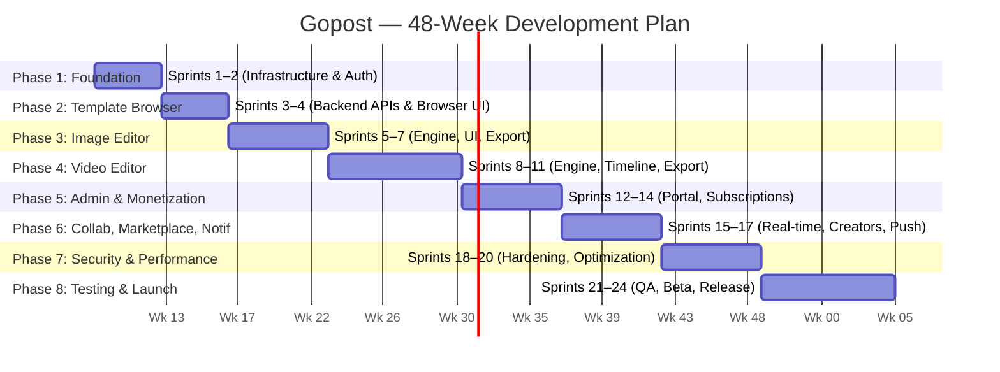

# Gopost — Agile Sprint Plan & Story Backlog

> **Version:** 1.0.0
> **Date:** February 24, 2026
> **Methodology:** Scrum (2-week sprints)
> **Total Duration:** 48 weeks (24 Sprints)
> **Team Size:** 13 members (see [Team Structure](#team-structure))

---

## Table of Contents

1. [Overview](#1-overview)
2. [Team Structure](#2-team-structure)
3. [Phase 1 — Foundation & Infrastructure](#phase-1--foundation--infrastructure)
4. [Phase 2 — Template Browser & Core Backend](#phase-2--template-browser--core-backend)
5. [Phase 3 — Image Editor Engine](#phase-3--image-editor-engine)
6. [Phase 4 — Video Editor Engine](#phase-4--video-editor-engine)
7. [Phase 5 — Admin Portal & Monetization](#phase-5--admin-portal--monetization)
8. [Phase 6 — Collaboration, Marketplace & Notifications](#phase-6--collaboration-marketplace--notifications)
9. [Phase 7 — Security Hardening, Performance & Polish](#phase-7--security-hardening-performance--polish)
10. [Phase 8 — Testing, Beta & Launch](#phase-8--testing-beta--launch)
11. [Release Milestones](#release-milestones)
12. [Risk Register](#risk-register)
13. [Definition of Done](#definition-of-done)

---

## 1. Overview

### Project Summary

Gopost is a cross-platform professional media editing application built with **Flutter** (frontend), **Go + Gin** (backend), and **C/C++** (native media engine). It targets iOS, Android, Windows, macOS, and Web.

### Sprint Cadence

| Aspect | Detail |
|--------|--------|
| Sprint Length | 2 weeks |
| Ceremonies | Sprint Planning (Mon W1), Daily Standup (15 min), Sprint Review (Fri W2), Retrospective (Fri W2) |
| Story Point Scale | Fibonacci (1, 2, 3, 5, 8, 13) |
| Target Velocity | 60–80 points per sprint (team-wide) |
| Priority Levels | P0 (Critical), P1 (High), P2 (Medium), P3 (Low) |

### Phase Overview

---

## 2. Team Structure

| Role | Count | Assigned Phases |
|------|-------|-----------------|
| Tech Lead / Architect | 1 | All phases |
| Flutter Developer | 3 | All phases (frontend) |
| Go Backend Developer | 2 | All phases (backend) |
| C/C++ Engine Developer | 2 | Phases 1, 3, 4, 7 (engine) |
| DevOps Engineer | 1 | Phases 1, 5, 7, 8 (infrastructure) |
| QA Engineer | 1 | All phases (testing) |
| Security Engineer | 1 (part-time) | Phases 1, 2, 7, 8 (security) |
| UI/UX Designer | 1 | Phases 1–6 (design) |
| Product Manager | 1 | All phases (planning) |

---

## Phase 1 — Foundation & Infrastructure

> **Duration:** Weeks 1–4 (Sprints 1–2)
> **Goal:** Establish project scaffolding, CI/CD pipelines, development environment, authentication, and core modules across all three codebases.

---

### Sprint 1 — Project Scaffolding & Core Infrastructure

> **Sprint Goal:** Set up all three codebases with clean architecture, CI/CD pipelines, Docker-based dev environment, and the foundational core module.
> **Dates:** March 2 – March 13, 2026
> **Capacity:** 70 points

| ID | Story | Description | Acceptance Criteria | Points | Priority | Owner |
|----|-------|-------------|---------------------|--------|----------|-------|
| S1-01 | Flutter project scaffolding | As a developer, I want the Flutter project initialized with the defined module structure (`core/`, `auth/`, `template_browser/`, `video_editor/`, `image_editor/`, `admin/`, `rendering_bridge/`) so that teams can work independently on modules. | - Project builds on iOS, Android, macOS, Windows, Web - All module directories created with placeholder files - `pubspec.yaml` with all required dependencies - `analysis_options.yaml` with strict lint rules | 5 | P0 | Flutter Lead |
| S1-02 | Go backend scaffolding | As a developer, I want the Go backend initialized with clean architecture layers (`controller/`, `service/`, `domain/`, `repository/`, `infrastructure/`) so that the backend follows a consistent pattern. | - Project compiles with `go build` - Gin router initialized with health check endpoint - Config loading via Viper (env-based) - Graceful shutdown implemented - Standard API response format (`pkg/response/`) | 5 | P0 | Backend Lead |
| S1-03 | C/C++ engine scaffolding | As a developer, I want the C/C++ engine project initialized with CMake build system and cross-platform compilation targets so that engine work can begin. | - CMake builds on macOS, Linux, Android NDK - Platform detection (Metal/Vulkan/GLES/WebGL flags) - Public C API header (`engine.h`) with stubs - Third-party libs linked (FFmpeg, OpenSSL, FreeType) - Google Test framework integrated | 8 | P0 | Engine Lead |
| S1-04 | CI/CD pipeline — Flutter | As a developer, I want a GitHub Actions workflow for Flutter that runs lint, test, and build on every PR so that code quality is enforced. | - `flutter-ci.yml` triggers on PR/push to main - Runs `flutter analyze` (zero warnings) - Runs `flutter test` (unit + widget) - Builds Android APK + Web artifacts - Status checks required for PR merge | 5 | P0 | DevOps |
| S1-05 | CI/CD pipeline — Go backend | As a developer, I want a GitHub Actions workflow for the Go backend that runs lint, test, and Docker build on every PR so that code quality is enforced. | - `backend-ci.yml` triggers on PR/push to main - Runs `golangci-lint` - Runs `go test ./...` - Builds Docker image - Pushes to container registry on main merge | 5 | P0 | DevOps |
| S1-06 | CI/CD pipeline — C++ engine | As a developer, I want a GitHub Actions workflow for the C++ engine that runs clang-tidy, Google Test, and CMake builds on every PR so that engine code quality is maintained. | - `engine-ci.yml` triggers on PR/push to main - Runs `clang-tidy` with modernize/performance/bugprone checks - Runs `ctest` (Google Test) - CMake builds for Linux and macOS targets | 5 | P0 | DevOps |
| S1-07 | Docker-based development environment | As a developer, I want a `docker-compose.yml` that spins up PostgreSQL, Redis, MinIO (S3), Elasticsearch, and NATS so that the full backend stack runs locally with one command. | - `docker-compose up` starts all services - PostgreSQL 16 with health check - Redis 7 with persistence - MinIO with default bucket - Elasticsearch 8 single-node - NATS 2.10 - Volumes for data persistence | 5 | P0 | DevOps |
| S1-08 | Core module — HTTP networking layer | As a Flutter developer, I want a centralized HTTP client (Dio) with interceptors for auth tokens, logging, and error handling so that all API calls follow a consistent pattern. | - `core/network/` with `HttpClient` wrapper - Auth token interceptor (auto-attach Bearer) - Error interceptor with structured error types - Request/response logging interceptor - Retry logic with exponential backoff - Base URL configuration per environment | 5 | P0 | Flutter |
| S1-09 | Core module — error handling & logging | As a Flutter developer, I want a unified error handling and logging framework so that errors are consistently captured and reported across the app. | - `core/error/` with `Failure` class hierarchy - `ServerFailure`, `NetworkFailure`, `CacheFailure`, `ValidationFailure` - `core/logging/` with structured logger - Log levels: debug, info, warning, error - Crash reporting integration point (Sentry/Firebase Crashlytics) | 3 | P0 | Flutter |
| S1-10 | Core module — theme & design tokens | As a Flutter developer, I want the design system tokens (colors, typography, spacing, radii) implemented so that UI components use a consistent visual language. | - `core/theme/` with `AppColors`, `AppTypography`, `AppSpacing`, `AppRadius` - Light and dark `ThemeData` objects - Material 3 integration - Responsive breakpoints (compact, medium, expanded, large, xlarge) | 3 | P1 | Flutter |
| S1-11 | Database migrations — users, roles, sessions | As a backend developer, I want the initial database schema for users, roles, and sessions so that authentication can be implemented. | - Migration `000001_create_users.up.sql` with users table - Migration `000002_create_roles.up.sql` with roles and user_roles tables - Migration `000003_create_sessions.up.sql` with sessions table - All migrations have corresponding `.down.sql` files - Indexes created as per schema spec | 5 | P0 | Backend |
| S1-12 | PostgreSQL connection pool setup | As a backend developer, I want the PostgreSQL connection pool configured with `pgxpool` so that the database layer is production-ready. | - `infrastructure/database/postgres.go` with pool config - Min 10, max 100 connections - Connection health check - Graceful pool shutdown - Migration runner (golang-migrate) | 3 | P0 | Backend |
| S1-13 | Redis client setup | As a backend developer, I want the Redis client configured for caching and session storage so that high-speed data access is available. | - `infrastructure/cache/redis.go` with connection setup - Connection pooling - Health check - Helper methods for common operations (Set/Get/Delete/Invalidate) | 3 | P0 | Backend |
| S1-14 | Structured logging (zerolog) | As a backend developer, I want structured JSON logging so that all API requests and errors are traceable in production. | - `pkg/logger/logger.go` with zerolog - Request/response logging middleware - Correlation ID (trace_id) propagation - Log levels configurable via environment | 3 | P1 | Backend |
| S1-15 | Engine — memory pool allocator | As an engine developer, I want a custom pool allocator for frame buffers so that memory allocation is fast and predictable with zero malloc/free churn. | - `FramePoolAllocator` with acquire/release - 64-byte aligned allocations - `mlock()` to prevent swap - Thread-safe (mutex-guarded) - `explicit_bzero()` on release - Unit tests with Google Test | 8 | P0 | Engine |
| S1-16 | Engine — thread pool foundation | As an engine developer, I want a worker thread pool so that decode, render, and filter operations can run in parallel. | - `ThreadPool` with configurable thread count (cores - 1) - Task queue with priority support - Lock-free command/result queues (SPSC/SPMC) - Thread priority assignment per thread role - Unit tests | 5 | P0 | Engine |

**Sprint 1 Total:** 76 points

---

### Sprint 2 — Authentication & Security Foundation

> **Sprint Goal:** Implement full authentication flow (registration, login, OAuth2, token refresh), RBAC middleware, rate limiting, and client-side security foundations.
> **Dates:** March 16 – March 27, 2026
> **Capacity:** 70 points

| ID | Story | Description | Acceptance Criteria | Points | Priority | Owner |
|----|-------|-------------|---------------------|--------|----------|-------|
| S2-01 | Auth service — registration & login | As a backend developer, I want the auth service with user registration and email/password login so that users can create accounts and authenticate. | - `POST /api/v1/auth/register` creates user with hashed password (bcrypt) - `POST /api/v1/auth/login` validates credentials - Returns JWT access token (15 min) + refresh token (7 days) - Input validation with struct tags - Error responses: `400`, `401`, `409` | 8 | P0 | Backend |
| S2-02 | Auth service — JWT issuance & validation | As a backend developer, I want JWT generation and validation with claims (user_id, role) so that stateless authentication is supported. | - `pkg/jwt/jwt.go` with Sign/Validate functions - Claims: `uid` (UUID), `role` (string), standard registered claims - HMAC-SHA256 signing - Expiry validation - Unit tests with valid, expired, and tampered tokens | 5 | P0 | Backend |
| S2-03 | Auth service — refresh token rotation | As a backend developer, I want refresh token rotation so that tokens are single-use and revocable for security. | - `POST /api/v1/auth/refresh` accepts refresh token - Validates against Redis-stored hash - Issues new access + refresh token pair - Invalidates old refresh token - Detects reuse of already-rotated tokens (revoke all sessions) | 5 | P0 | Backend |
| S2-04 | Auth service — OAuth2 (Google, Apple) | As a user, I want to sign in with Google or Apple so that I can use my existing accounts without creating a new password. | - `POST /api/v1/auth/oauth/{provider}` endpoint - Google: ID token validation via Google API - Apple: Sign In with Apple JWT validation - Upsert user record (create if new, link if existing email) - Returns same token pair as email login | 8 | P0 | Backend |
| S2-05 | Auth middleware — JWT & RBAC | As a backend developer, I want JWT authentication middleware and RBAC authorization middleware so that all protected endpoints enforce auth and role checks. | - `AuthMiddleware` extracts and validates JWT from Authorization header - Sets `user_id` and `user_role` in Gin context - `RequireRole(roles...)` middleware rejects insufficient permissions - Returns `401` for invalid/missing tokens, `403` for insufficient roles | 5 | P0 | Backend |
| S2-06 | Rate limiting middleware | As a backend developer, I want token-bucket rate limiting backed by Redis so that the API is protected from abuse. | - Rate limiter middleware with Redis backend - Per-endpoint-category limits (auth: 10/min, browsing: 120/min, upload: 20/min) - Anonymous vs authenticated rates - Returns `429` with `Retry-After` header - `X-RateLimit-Remaining` and `X-RateLimit-Reset` response headers | 5 | P1 | Backend |
| S2-07 | CORS middleware | As a backend developer, I want CORS middleware configured so that the Flutter Web client can communicate with the API. | - Allowed origins configurable per environment - Allowed methods: GET, POST, PUT, DELETE, OPTIONS - Allowed headers: Authorization, Content-Type - Credentials: true - Max age: 12 hours | 2 | P1 | Backend |
| S2-08 | Flutter auth module — login screen | As a user, I want a login screen with email/password fields and social login buttons so that I can authenticate into the app. | - `LoginScreen` with email and password fields - Form validation (email format, password min length) - Social login buttons (Google, Apple) - Loading state during authentication - Error display for invalid credentials - Navigation to RegisterScreen and ForgotPasswordScreen | 5 | P0 | Flutter |
| S2-09 | Flutter auth module — registration screen | As a new user, I want a registration screen so that I can create an account with my email and password. | - `RegisterScreen` with name, email, password, confirm password - Password strength indicator - Form validation - Success → navigate to home - Error handling for duplicate email | 5 | P0 | Flutter |
| S2-10 | Flutter auth module — state management | As a Flutter developer, I want Riverpod-based auth state management so that the app reactively handles authentication state. | - `authStateProvider` (StateNotifier) - States: `initial`, `authenticated`, `unauthenticated`, `loading`, `error` - `authRemoteDataSourceProvider` for API calls - `authRepositoryProvider` with interface - `loginUseCaseProvider`, `registerUseCaseProvider` | 5 | P0 | Flutter |
| S2-11 | Flutter auth module — token management | As a Flutter developer, I want automatic token refresh and secure token storage so that sessions persist across app restarts. | - Access token stored in-memory only - Refresh token stored in `flutter_secure_storage` - Dio interceptor auto-refreshes expired access tokens - Auto-logout on refresh token expiry - Token cleared on logout | 5 | P0 | Flutter |
| S2-12 | Flutter navigation — GoRouter setup | As a Flutter developer, I want GoRouter-based navigation with auth guards so that unauthenticated users are redirected to login. | - `routerProvider` with GoRouter - Auth guard redirect logic - Routes: `/auth/login`, `/auth/register`, `/`, `/templates`, `/editor/video`, `/editor/image`, `/admin`, `/profile` - `ShellRoute` with bottom navigation | 5 | P0 | Flutter |
| S2-13 | SSL certificate pinning | As a security engineer, I want SSL certificate pinning in the Flutter HTTP client so that man-in-the-middle attacks are prevented. | - Dio interceptor for certificate pinning - Pinned fingerprints for leaf + intermediate certs - Reject connections with unknown certificates - Configurable pin set (rotatable) | 3 | P1 | Flutter |
| S2-14 | Secure storage integration | As a Flutter developer, I want a unified secure storage service so that sensitive data is stored using platform-native encryption (Keychain/Keystore). | - `SecureStorageService` abstraction - iOS: Keychain - Android: Keystore - Desktop: encrypted file with OS keyring - Methods: read, write, delete, deleteAll | 3 | P1 | Flutter |
| S2-15 | Engine — GPU context abstraction | As an engine developer, I want an abstract GPU context interface (`IGpuContext`) so that rendering pipelines work across Metal, Vulkan, and OpenGL ES. | - `IGpuContext` abstract class with createTexture, createPipeline, dispatch - Metal backend stub (macOS/iOS) - OpenGL ES backend stub (fallback) - Platform factory: `IGpuContext::createForPlatform()` - Unit tests for factory selection | 8 | P0 | Engine |

**Sprint 2 Total:** 77 points

---

## Phase 2 — Template Browser & Core Backend

> **Duration:** Weeks 5–8 (Sprints 3–4)
> **Goal:** Build the template management backend (CRUD, search, encryption), CDN delivery pipeline, and the Flutter template browser with preview capabilities.

---

### Sprint 3 — Template Backend & Encryption Pipeline

> **Sprint Goal:** Implement template CRUD APIs, Elasticsearch integration, encryption service, and admin upload flow.
> **Dates:** March 30 – April 10, 2026
> **Capacity:** 70 points

| ID | Story | Description | Acceptance Criteria | Points | Priority | Owner |
|----|-------|-------------|---------------------|--------|----------|-------|
| S3-01 | Database migrations — templates, categories, tags | As a backend developer, I want the template-related database tables so that templates can be stored and organized. | - Migrations for `templates`, `template_versions`, `template_assets`, `categories`, `tags`, `template_tags` tables - All indexes created per schema spec - Seed data for initial categories (Stories, Reels, Posts, Thumbnails, etc.) | 5 | P0 | Backend |
| S3-02 | Template repository (PostgreSQL) | As a backend developer, I want the template repository implementing all CRUD operations so that templates can be persisted and queried. | - Implements `TemplateRepository` interface - Create, GetByID, Update, Delete, List, ListByCategory - IncrementUsageCount - Cursor-based pagination (no OFFSET) - Filtering by type, status, category | 8 | P0 | Backend |
| S3-03 | Template service — CRUD operations | As a backend developer, I want the template service with business logic for template management so that templates can be created, listed, and retrieved. | - `TemplateService` with all CRUD methods - Validation of template metadata - Category and tag association - Usage count tracking - Domain events for template lifecycle changes | 5 | P0 | Backend |
| S3-04 | Template controller — REST endpoints | As an API consumer, I want RESTful template endpoints so that clients can browse, search, and retrieve templates. | - `GET /api/v1/templates` with filters, sort, cursor pagination - `GET /api/v1/templates/:id` with full details - `GET /api/v1/templates/search?q=` full-text search - `GET /api/v1/categories` list all categories - `GET /api/v1/categories/:id/templates` templates by category | 5 | P0 | Backend |
| S3-05 | Elasticsearch integration — template search | As a user, I want full-text search across template names, descriptions, and tags so that I can quickly find templates. | - `infrastructure/search/elasticsearch.go` client setup - Template index mapping (name, description, tags, category) - Search with relevance scoring - Faceted filtering (type, category, premium/free) - Auto-sync on template create/update/delete | 8 | P1 | Backend |
| S3-06 | S3 storage repository | As a backend developer, I want the S3 storage repository so that template binaries and media can be stored and retrieved. | - Implements `StorageRepository` interface - Upload with content type detection - Download with streaming - Delete - Signed URL generation with configurable expiry - MinIO compatible for local development | 5 | P0 | Backend |
| S3-07 | Encryption service — AES-256-GCM | As a backend developer, I want the encryption service so that templates are encrypted before storage and decryption keys are managed securely. | - `EncryptionService` with encrypt/decrypt methods - AES-256-GCM encryption with random nonce - Envelope encryption: DEK encrypted with KEK - Key rotation support - `.gpt` file format packing (magic bytes, headers, encrypted sections) | 8 | P0 | Backend |
| S3-08 | Template access endpoint — signed URLs | As an API consumer, I want a template access endpoint that returns signed CDN URLs and session keys so that clients can securely download and decrypt templates. | - `POST /api/v1/templates/:id/access` - Auth + subscription verification - Device fingerprint validation - Generate session-encrypted DEK (RSA-OAEP) - Return signed CDN URL (10 min expiry) + wrapped DEK + render token (5 min) | 8 | P0 | Backend |
| S3-09 | CDN configuration & cache warming | As a DevOps engineer, I want CDN integration for template delivery so that assets are served from edge locations globally. | - CloudFront/Cloudflare distribution configured - Origin: S3 bucket - Cache policy: template binaries (7 days), thumbnails (30 days), previews (30 days) - Cache invalidation on template update/delete - Cache warming on new template publish | 5 | P1 | DevOps |
| S3-10 | Admin template upload endpoint | As an admin, I want an API endpoint to upload external templates so that After Effects/Lightroom exports can be ingested. | - `POST /api/v1/admin/templates/upload` (multipart) - Format validation (dimensions, layer count, file size limits) - Safety scan placeholder (NSFW, malware hooks) - Thumbnail + preview generation - Encrypt → S3 upload → DB record | 8 | P0 | Backend |
| S3-11 | Engine — AES-256-GCM decryption | As an engine developer, I want in-memory AES-256-GCM decryption so that the native engine can decrypt templates received from the server. | - `crypto/aes_gcm.cpp` with decrypt function - RSA-OAEP key unwrapping - Decrypted data in `mlock()`-ed memory only - Auth tag verification - `explicit_bzero()` on release - Unit tests with known test vectors | 5 | P0 | Engine |

**Sprint 3 Total:** 70 points

---

### Sprint 4 — Template Browser UI & Preview

> **Sprint Goal:** Build the Flutter template browser with browsing, searching, filtering, previewing, and encrypted template download flow.
> **Dates:** April 13 – April 24, 2026
> **Capacity:** 70 points

| ID | Story | Description | Acceptance Criteria | Points | Priority | Owner |
|----|-------|-------------|---------------------|--------|----------|-------|
| S4-01 | Template browser — browse screen | As a user, I want to browse templates organized by categories so that I can discover content easily. | - `BrowseScreen` with category tabs/chips - Masonry grid layout for templates - Template cards with thumbnail, name, premium badge - Pull-to-refresh - Shimmer loading placeholders - 60 fps scroll performance (ListView.builder) | 8 | P0 | Flutter |
| S4-02 | Template browser — search & filter | As a user, I want to search templates by keyword and filter by type/category so that I can find exactly what I need. | - Search bar with debounced input (300ms) - Full-text search via API - Filter chips: type (video/image), category, premium/free - Sort options: popular, newest, trending - Empty state for no results | 5 | P0 | Flutter |
| S4-03 | Template browser — infinite scroll pagination | As a user, I want templates to load continuously as I scroll so that I have a seamless browsing experience. | - Cursor-based pagination via API - Auto-fetch next page when scrolled to 80% - Loading indicator at bottom - No duplicate items - End-of-list indicator | 5 | P0 | Flutter |
| S4-04 | Template detail screen | As a user, I want to view template details including preview, description, editable fields, and creator info so that I can decide whether to use a template. | - `TemplateDetailScreen` with full metadata - Large preview (video autoplay / image zoom) - Editable fields listed (text, image, color placeholders) - Creator info - "Use Template" button (routes to editor) - Share button | 5 | P0 | Flutter |
| S4-05 | Template preview player | As a user, I want to preview video templates with playback controls so that I can see the template in action before using it. | - `PreviewPlayer` widget - Auto-play on screen entry - Play/pause toggle - Muted by default with sound toggle - Loop playback - Thumbnail poster frame on load | 5 | P1 | Flutter |
| S4-06 | Template browser — state management | As a Flutter developer, I want Riverpod providers for the template browser so that data flows reactively from API to UI. | - `templateRemoteDataSourceProvider` - `templateRepositoryProvider` - `getTemplatesUseCaseProvider` - `templateListProvider` (StateNotifier with AsyncValue) - `templateDetailProvider` (family provider by ID) - `templateSearchProvider` | 5 | P0 | Flutter |
| S4-07 | Encrypted template download flow | As a Flutter developer, I want the client-side template download flow so that templates are securely fetched from CDN and passed to the native engine. | - Request template access (API call → signed URL + session key) - Download encrypted `.gpt` blob from CDN - Progress tracking during download - Pass encrypted blob + session key to engine via FFI - Handle errors: auth failure, subscription required, rate limited | 8 | P0 | Flutter |
| S4-08 | FFI bridge — initial setup | As a Flutter developer, I want the rendering bridge initialized with `dart:ffi` bindings so that Flutter can call the C/C++ engine. | - `rendering_bridge/ffi/` with ffigen-generated bindings - `GopostEngine` abstract interface - `GopostEngineImpl` with DynamicLibrary loading - Engine init/destroy lifecycle - GPU capabilities query - Platform-specific library loading (`.dylib`, `.so`, `.dll`) | 8 | P0 | Flutter |
| S4-09 | FFI bridge — template load/unload | As a Flutter developer, I want FFI methods for template load and unload so that encrypted templates can be processed by the native engine. | - `loadTemplate(encryptedBlob, sessionKey)` → TemplateMetadata - `unloadTemplate(templateId)` - Error handling via result codes - Memory cleanup on unload - Unit test with mock data | 5 | P0 | Flutter |
| S4-10 | Engine — template parser | As an engine developer, I want the `.gpt` template parser so that encrypted template packages can be parsed into render instructions. | - `template_parser.cpp` parses .gpt format - Magic bytes validation ("GOPT") - Version check - Encrypted section decryption (AES-256-GCM) - Metadata extraction (JSON) - Layer definition parsing - Asset table parsing - Checksum (SHA-256) verification | 8 | P0 | Engine |
| S4-11 | Image caching layer | As a Flutter developer, I want an image caching layer for template thumbnails and previews so that browsing is fast and data-efficient. | - `cached_network_image` integration - Disk cache: 200 MB limit - Memory cache: 50 MB limit - WebP format preference - Placeholder shimmer during load - Error fallback image | 3 | P1 | Flutter |
| S4-12 | Home screen — featured & trending | As a user, I want a home screen showing featured templates and trending content so that I have a curated entry point to the app. | - `HomeScreen` with hero banner (featured) - Trending section (horizontal scroll) - Category quick-access chips - Recent templates section - Quick-create buttons (new video / new image) | 5 | P1 | Flutter |

**Sprint 4 Total:** 72 points

---

## Phase 3 — Image Editor Engine

> **Duration:** Weeks 9–14 (Sprints 5–7)
> **Goal:** Build the C/C++ image processing engine with canvas, layers, filters, text, masking, and export; integrate with Flutter UI for a full image editing experience.

---

### Sprint 5 — Image Engine Core & Basic Editor UI

> **Sprint Goal:** Implement C++ image decoder/encoder, canvas model, basic layer support, GPU pipeline, and the initial Flutter image editor screen.
> **Dates:** April 27 – May 8, 2026
> **Capacity:** 70 points

| ID | Story | Description | Acceptance Criteria | Points | Priority | Owner |
|----|-------|-------------|---------------------|--------|----------|-------|
| S5-01 | Engine — image decoder (multi-format) | As an engine developer, I want image decoders for JPEG, PNG, WebP, and HEIC so that the engine can load user photos and template assets. | - Decode JPEG (libjpeg-turbo), PNG (libpng), WebP (libwebp), HEIC (libheif) - Output: RGBA pixel buffer - EXIF orientation handling - Color space metadata extraction - Memory-efficient streaming decode for large images - Unit tests per format | 8 | P0 | Engine |
| S5-02 | Engine — image encoder (multi-format) | As an engine developer, I want image encoders for JPEG, PNG, and WebP so that edited images can be exported. | - Encode to JPEG (quality configurable), PNG (lossless), WebP (lossy/lossless) - Color profile embedding (sRGB) - Progressive JPEG option - Metadata preservation - Unit tests with decode→encode→decode roundtrip | 5 | P0 | Engine |
| S5-03 | Engine — canvas model & layer system | As an engine developer, I want the canvas data model with a layer tree so that multiple layers can be composited together. | - `Canvas` with settings (width, height, DPI, color space, background) - `Layer` with type, transform, opacity, blend mode, visibility, lock - Layer types: Image, SolidColor, Text, Shape, Group, Adjustment - Add, remove, reorder, duplicate layer operations - Layer tree with parent-child relationships | 8 | P0 | Engine |
| S5-04 | Engine — basic composition pipeline | As an engine developer, I want the composition pipeline so that layers are composited onto the canvas in the correct order with blend modes. | - Flatten layer tree → render order - Per-layer: decode content → apply transform → blend onto canvas - Blend modes: Normal, Multiply, Screen, Overlay (4 initial modes) - Opacity support (0.0–1.0) - Output: composited RGBA frame | 8 | P0 | Engine |
| S5-05 | Engine — GPU rendering pipeline (Metal) | As an engine developer, I want the Metal GPU rendering backend so that image composition runs on the GPU for 60 fps on Apple devices. | - Metal context implementation of `IGpuContext` - Texture creation/upload/destroy - Shader pipeline for blend modes - Fragment shader: composite two textures with blend mode - Texture output for Flutter Texture widget | 8 | P0 | Engine |
| S5-06 | Engine — tile-based rendering | As an engine developer, I want tile-based rendering so that large canvases (up to 16384x16384) render efficiently. | - Tile grid (2048x2048 tiles, 2px overlap) - Dirty region tracking with `invalidate_region(rect)` - Visible tile computation from viewport - Tile worker pool (parallel tile rendering) - Tile assembly into output texture | 8 | P1 | Engine |
| S5-07 | FFI bridge — image canvas operations | As a Flutter developer, I want FFI bindings for image canvas operations so that the Flutter UI can create canvases and manage layers. | - `createCanvas(config)` → canvas ID - `addLayer(canvasId, descriptor)` → layer ID - `removeLayer(canvasId, layerId)` - `reorderLayer(canvasId, layerId, newIndex)` - `renderCanvas(canvasId)` → frame texture handle - Canvas preview stream via Texture Registry | 5 | P0 | Flutter |
| S5-08 | Image editor screen — basic layout | As a user, I want the image editor screen with a canvas preview and basic toolbar so that I can start editing images. | - `ImageEditorScreen` with canvas preview (Texture widget) - Bottom toolbar with tool icons - Layer panel (side sheet) - Zoom and pan gestures on canvas - Undo/redo buttons (placeholder) - Back button with save prompt | 8 | P0 | Flutter |
| S5-09 | Image editor — photo import | As a user, I want to import photos from my device gallery so that I can start editing. | - Photo picker integration (image_picker / photo_manager) - Gallery grid view for selection - Multi-select support - Camera capture option - Import as new canvas or add as layer - Loading progress for large images | 5 | P0 | Flutter |
| S5-10 | Image editor — canvas preview with zero-copy texture | As a Flutter developer, I want the canvas preview rendered via Flutter's Texture widget using GPU textures so that there is no CPU pixel copy overhead. | - `EngineTextureController` registers texture with `TextureRegistry` - Engine renders canvas to GPU texture - Flutter `Texture(textureId:)` displays result - Frame update callback for re-render on edits - 60 fps interactive preview | 5 | P0 | Flutter |

**Sprint 5 Total:** 68 points

---

### Sprint 6 — Layers, Filters, Text & Stickers

> **Sprint Goal:** Implement layer management UI, filter pipeline, text tool, and sticker placement for a rich image editing experience.
> **Dates:** May 11 – May 22, 2026
> **Capacity:** 70 points

| ID | Story | Description | Acceptance Criteria | Points | Priority | Owner |
|----|-------|-------------|---------------------|--------|----------|-------|
| S6-01 | Image editor — layer management UI | As a user, I want a layer panel where I can add, remove, reorder, and adjust layer properties so that I have full control over my composition. | - Layer panel (bottom sheet or side panel) - Layer list with thumbnails and names - Drag-to-reorder - Visibility toggle per layer - Lock toggle per layer - Opacity slider per layer - Blend mode selector (dropdown) | 8 | P0 | Flutter |
| S6-02 | Engine — effect/filter system | As an engine developer, I want the effect and filter system with an effect registry so that filters can be applied non-destructively to layers. | - `EffectRegistry` with register, find, list_by_category - `EffectDefinition` (params, shader references) - `EffectInstance` (enabled, mix, animated flag) - `EffectProcessor` with prepare → process → release lifecycle - GPU shader-based processing | 8 | P0 | Engine |
| S6-03 | Engine — core adjustment filters | As an engine developer, I want core image adjustment filters so that users can adjust brightness, contrast, saturation, exposure, and temperature. | - Brightness (-100 to +100) - Contrast (-100 to +100) - Saturation (-100 to +100) - Exposure (-2.0 to +2.0 EV) - Temperature / White Balance - Highlights / Shadows recovery - All as GPU fragment shaders - Unit tests with reference images | 8 | P0 | Engine |
| S6-04 | Engine — preset filter library (40 initial) | As an engine developer, I want 40 preset filters (Natural, Portrait, Vintage, Cinematic, B&W categories) so that users can apply one-tap looks. | - 8 Natural (Daylight, Golden Hour, etc.) - 8 Portrait (Soft Skin, Studio, etc.) - 8 Vintage (Polaroid, Kodachrome, etc.) - 8 Cinematic (Teal & Orange, Noir, etc.) - 8 B&W (Classic, Selenium, etc.) - Each filter: LUT + parameter combination - Intensity slider (0–100%) | 8 | P1 | Engine |
| S6-05 | Image editor — filter UI | As a user, I want to browse and apply filters with a slider to control intensity so that I can quickly enhance my photos. | - Filter grid at bottom (horizontal scroll) - Thumbnail previews of each filter applied to current image - Tap to apply, tap again to deselect - Intensity slider (0–100%) - Before/after comparison (swipe gesture) - Category tabs (Natural, Portrait, Vintage, etc.) | 5 | P0 | Flutter |
| S6-06 | Image editor — adjustment controls | As a user, I want individual adjustment sliders for brightness, contrast, saturation, etc. so that I can fine-tune my photo. | - Adjustments panel with individual sliders - Brightness, Contrast, Saturation, Exposure, Temperature, Highlights, Shadows - Real-time preview as slider moves - Reset to default per slider - Reset all adjustments button | 5 | P0 | Flutter |
| S6-07 | Engine — text rendering (FreeType + HarfBuzz) | As an engine developer, I want GPU-accelerated text rendering with font support so that text layers display correctly on canvas. | - FreeType glyph rasterization - HarfBuzz text shaping (ligatures, kerning, RTL) - Font loading (system fonts + bundled fonts) - Text layout (single/multi-line, alignment) - Text as texture for GPU compositing - Anti-aliased rendering | 8 | P0 | Engine |
| S6-08 | Image editor — text tool | As a user, I want to add text to my image with font, size, color, and style options so that I can create designs with typography. | - "Add Text" tool in toolbar - Inline text editing on canvas - Font picker (30+ fonts) - Size, color, alignment controls - Bold, italic, underline toggles - Text shadow and outline options - Transform gestures (move, scale, rotate) | 8 | P0 | Flutter |
| S6-09 | Image editor — sticker tool | As a user, I want to add stickers to my image so that I can decorate my designs with emojis and graphic elements. | - Sticker picker (categorized grid) - Bundled sticker packs (50+ stickers) - Add sticker as new layer - Transform gestures (move, scale, rotate) - Opacity adjustment - Flip horizontal/vertical | 5 | P1 | Flutter |
| S6-10 | Engine — transform operations | As an engine developer, I want layer transform operations so that layers can be moved, scaled, rotated, and flipped. | - 2D affine transform: translate, scale, rotate - Flip horizontal/vertical - Transform applied in GPU shader - Pivot point support (center, corners) - Sub-pixel accuracy | 5 | P0 | Engine |
| S6-11 | Image editor — transform gestures | As a user, I want to move, scale, and rotate layers with touch/mouse gestures so that I can position elements freely on the canvas. | - Two-finger pinch to scale - Two-finger rotate - Single-finger drag to move - Snap to center/edges (guide lines) - Transform handle overlay (corners + rotation) - Works on all layer types | 5 | P0 | Flutter |

**Sprint 6 Total:** 73 points

---

### Sprint 7 — Masking, Advanced Filters & Export ✅ (In Progress)

> **Sprint Goal:** Implement masking tools, advanced artistic filters, image export pipeline, and save-as-template flow.
> **Dates:** May 25 – June 5, 2026
> **Capacity:** 70 points
> **Status:** S7-01, S7-02, S7-03, S7-04, S7-05, S7-06, S7-07, S7-08, S7-09, S7-10, S7-11, S7-12 — DONE (Sprint Complete)

| ID | Story | Description | Acceptance Criteria | Points | Priority | Owner |
|----|-------|-------------|---------------------|--------|----------|-------|
| S7-01 | Engine — layer mask system | As an engine developer, I want layer masking so that portions of a layer can be hidden non-destructively. | - Layer mask (grayscale: white = visible, black = hidden) - Vector mask (path-based clipping) - Clipping mask (clip to layer below) - Mask inversion - Mask applied during composition pipeline - GPU-accelerated mask blending | 8 | P0 | Engine |
| S7-02 | Engine — blur & sharpen filters | As an engine developer, I want blur and sharpen filters so that users can apply bokeh effects and enhance detail. | - Gaussian blur (radius 0–100) - Lens blur (bokeh simulation) - Radial blur (center + radius) - Tilt-shift blur - Unsharp mask (amount, radius, threshold) - All as GPU compute shaders | 5 | P1 | Engine |
| S7-03 | Engine — artistic filters | As an engine developer, I want artistic style filters so that users can transform photos into paintings, sketches, and other artistic styles. | - Oil paint effect - Watercolor effect - Pencil sketch - Pixelate/Mosaic - Halftone - Glitch effect - GPU shader-based processing | 5 | P2 | Engine |
| S7-04 | Engine — additional blend modes | As an engine developer, I want the complete set of blend modes so that advanced compositing is supported. | - Add remaining modes: Soft Light, Hard Light, Difference, Exclusion, Color Dodge, Color Burn, Luminosity, Color, Hue, Saturation, Darken, Lighten, Linear Burn, Linear Dodge, Pin Light, Vivid Light - Total: 27+ blend modes - GPU fragment shaders for each | 5 | P1 | Engine |
| S7-05 | Image editor — masking UI | As a user, I want to apply masks to layers so that I can selectively show/hide parts of my composition. | - Mask mode toggle on layer - Brush-based mask painting (white/black) - Eraser for mask editing - Mask opacity preview (red overlay) - Shape-based mask (rectangle, ellipse) - Invert mask button | 8 | P1 | Flutter |
| S7-06 | Engine — image export pipeline | As an engine developer, I want the export pipeline so that the final composited canvas can be saved as JPEG, PNG, or WebP at configurable quality and resolution. | - Export to JPEG (quality 1–100), PNG, WebP - Resolution options: original, 4K, 1080p, custom - Color profile embedding (sRGB) - DPI metadata for print - Progress callback - Cancel support - Batch export (multiple formats) | 8 | P0 | Engine |
| S7-07 | FFI bridge — image export | As a Flutter developer, I want FFI bindings for image export so that the Flutter UI can trigger exports and track progress. | - `exportImage(canvasId, config)` → Future<ExportResult> - ExportConfig: format, quality, resolution, output path - Progress stream (0–100%) - Cancel export - Result: file path, file size, dimensions | 3 | P0 | Flutter |
| S7-08 | Image editor — export screen | As a user, I want an export screen where I can choose format, quality, and resolution so that I can save my edited image. | - Export button in toolbar - Format picker: JPEG, PNG, WebP - Quality slider (JPEG/WebP) - Resolution options (original, 4K, 1080p, Instagram, custom) - File size estimate - Export progress bar - Save to gallery / share sheet | 5 | P0 | Flutter |
| S7-09 | Image editor — undo/redo system | As a user, I want undo and redo so that I can safely experiment with edits and reverse mistakes. | - Command pattern for all edit operations - Undo stack (50 levels) - Redo stack (cleared on new action) - Undo/redo buttons in toolbar - Keyboard shortcuts (Cmd+Z / Ctrl+Z, Cmd+Shift+Z / Ctrl+Shift+Z) - History panel showing action names | 8 | P0 | Flutter |
| S7-10 | Engine — project serialization (.gpimg) | As an engine developer, I want project serialization so that image editor projects can be saved and loaded. | - `.gpimg` format: canvas settings + layer tree + effect instances + asset references - Protobuf-based serialization - Auto-save every 30 seconds - Load from file → reconstruct canvas state - Backward-compatible versioning | 5 | P0 | Engine |
| S7-11 | Image editor — save-as-template flow | As a creator, I want to save my edited image as a template so that other users can customize it with their own content. | - "Save as Template" option in export/menu - Define placeholder regions (text, image, color) - Set template metadata (name, description, category, tags) - Pack into encrypted `.gpt` format - Upload to backend via API | 8 | P1 | Flutter |
| S7-12 | Image editor — template customization mode | As a user, I want to open an image template and customize the editable fields so that I can personalize the design. | - Load template → display canvas with placeholder markers - Tap placeholder → edit content (text input, photo picker, color picker) - Real-time preview of customizations - Reset to default per placeholder - Export customized result | 5 | P0 | Flutter |

**Sprint 7 Total:** 73 points

---

## Phase 4 — Video Editor Engine

> **Duration:** Weeks 15–22 (Sprints 8–11)
> **Goal:** Build the C/C++ video processing engine with timeline, multi-track editing, effects, transitions, audio mixing, and export; integrate with Flutter for a full video editing experience.

---

### Sprint 8 — Video Engine Core & Timeline Foundation

> **Sprint Goal:** Implement video decoder/encoder, timeline data model, basic composition, and the initial Flutter video editor screen.
> **Dates:** June 8 – June 19, 2026
> **Capacity:** 70 points

| ID | Story | Description | Acceptance Criteria | Points | Priority | Owner |
|----|-------|-------------|---------------------|--------|----------|-------|
| S8-01 | Engine — FFmpeg decoder integration | As an engine developer, I want video decoding via FFmpeg with hardware acceleration so that video files can be decoded efficiently. | - Demuxer for MP4, MOV, WebM, AVI - HW decode: VideoToolbox (Apple), MediaCodec (Android), NVDEC (desktop) stub - SW decode fallback (FFmpeg libavcodec) - Audio stream extraction - Seek-to-timestamp support - Frame output as GPU texture or CPU buffer | 8 | P0 | Engine |
| S8-02 | Engine — timeline data model | As an engine developer, I want the timeline data model with tracks and clips so that multi-track non-linear editing is supported. | - `Timeline` with frame_rate, dimensions, color_space - `Track` (Video, Audio, Title, Effect, Subtitle types) - `Clip` with timeline_range, source_in/out, speed, effects, keyframes - Track operations: add/remove/reorder - Clip operations: add/remove/trim/split/move | 8 | P0 | Engine |
| S8-03 | Engine — timeline evaluation pipeline | As an engine developer, I want the timeline evaluation pipeline so that the correct frame is rendered for any given playhead position. | - Gather active clips at playhead position - Cache check (hit → skip decode) - Decode requested frames (HW or SW) - Per-clip effects processing - Track compositing (bottom → top) - Master effects application - Output: preview texture or encode input | 8 | P0 | Engine |
| S8-04 | Engine — video composition engine | As an engine developer, I want the video compositor so that multiple tracks are blended together per-frame. | - Sort layers by track order - Per-layer: decode → effects → transform → blend - Blend modes (Normal, Multiply, Screen, Overlay, Add) - Opacity compositing - Track matte support (Alpha, Luma) | 8 | P0 | Engine |
| S8-05 | FFI bridge — video timeline operations | As a Flutter developer, I want FFI bindings for video timeline operations so that the Flutter UI can create timelines and manage clips. | - `createTimeline(config)` → timeline ID - `addClip(timelineId, clipDescriptor)` - `removeClip(timelineId, clipId)` - `seekTo(timelineId, position)` - `renderFrame(timelineId)` → frame texture - Preview stream via Texture Registry | 5 | P0 | Flutter |
| S8-06 | Video editor screen — basic layout | As a user, I want the video editor screen with a preview area and timeline strip so that I can start editing videos. | - `VideoEditorScreen` with preview area (Texture widget, 16:9) - Timeline strip at bottom (horizontal scroll) - Playback controls (play, pause, seek) - Toolbar with tool icons - Layer panel toggle - Time indicator (current position / total duration) | 8 | P0 | Flutter |
| S8-07 | Video editor — media import | As a user, I want to import videos and photos from my device so that I can add them to my project. | - Video picker from gallery - Photo picker for still images - Camera capture (video + photo) - Thumbnail preview of imported media - Import as clip on timeline - Support for MP4, MOV, WebM | 5 | P0 | Flutter |
| S8-08 | Video editor — playback preview | As a user, I want real-time video preview during editing so that I can see changes as I make them. | - 60 fps preview playback via Texture widget - Play/Pause button - Seek bar with scrubbing - Frame-accurate seeking - Preview resolution: viewport size (not export resolution) - Audio playback synced with video | 8 | P0 | Flutter |
| S8-09 | Engine — frame cache | As an engine developer, I want a frame cache so that recently decoded and rendered frames are reused without re-processing. | - LRU frame cache (configurable size) - Cache key: timeline position + clip ID + effect hash - Cache invalidation on edit operations - Thumbnail cache for timeline strip - Waveform cache for audio tracks | 5 | P1 | Engine |
| S8-10 | Engine — audio decoder & basic playback | As an engine developer, I want audio decoding and playback so that video clips play with synchronized audio. | - Audio decode (AAC, MP3, WAV, OPUS via FFmpeg) - Audio buffer output (PCM float 48kHz) - Audio-video sync via PTS - Platform audio output (CoreAudio/AAudio/WASAPI stubs) - Volume control per clip | 5 | P0 | Engine |

**Sprint 8 Total:** 68 points

---

### Sprint 9 — Timeline UI & Multi-Track Editing

> **Sprint Goal:** Build the interactive timeline UI with drag-and-drop, clip trimming, splitting, multi-track support, and smooth scrubbing.
> **Dates:** June 22 – July 3, 2026
> **Capacity:** 70 points

| ID | Story | Description | Acceptance Criteria | Points | Priority | Owner |
|----|-------|-------------|---------------------|--------|----------|-------|
| S9-01 | Video editor — timeline widget | As a user, I want an interactive timeline showing all tracks and clips so that I can visualize and navigate my project. | - `TimelineWidget` with horizontal scroll - Video tracks with clip thumbnails - Audio tracks with waveform visualization - Title tracks with text preview - Playhead indicator (draggable) - Zoom in/out (pinch gesture) - Time ruler with frame markers | 13 | P0 | Flutter |
| S9-02 | Video editor — clip drag-and-drop | As a user, I want to drag clips to reposition them on the timeline so that I can arrange my edit. | - Long-press to initiate drag - Visual feedback: clip lifts and follows finger - Snap to adjacent clip edges - Snap to playhead - Drop zone highlighting - Prevent overlapping clips on same track | 8 | P0 | Flutter |
| S9-03 | Video editor — clip trimming | As a user, I want to trim clips by dragging their edges so that I can select the portion of video to use. | - Left/right edge handles on selected clip - Drag handle to trim (shows source in/out points) - Preview updates in real-time during trim - Minimum clip duration enforcement - Ripple trim option (shifts subsequent clips) | 8 | P0 | Flutter |
| S9-04 | Video editor — clip splitting | As a user, I want to split a clip at the playhead position so that I can divide it into two separate clips for independent editing. | - Split button in toolbar (active when playhead is over a clip) - Splits clip at playhead → two clips with correct in/out points - Both clips retain effects from original - Undo support | 5 | P0 | Flutter |
| S9-05 | Video editor — multi-track support | As a user, I want multiple video and audio tracks so that I can layer content and create compositions. | - Add track button (video, audio, title) - Remove empty track - Track reordering (drag header) - Track mute/solo/lock toggles - Track volume slider (audio tracks) - Track opacity slider (video tracks) | 8 | P0 | Flutter |
| S9-06 | Video editor — clip speed adjustment | As a user, I want to change the playback speed of a clip so that I can create slow-motion or time-lapse effects. | - Speed option in clip properties - Presets: 0.25x, 0.5x, 1x, 1.5x, 2x, 4x - Custom speed input - Audio pitch compensation option - Clip duration adjusts proportionally on timeline | 5 | P1 | Flutter |
| S9-07 | Video editor — text overlay tool | As a user, I want to add text overlays to my video so that I can add titles, captions, and labels. | - "Add Text" tool - Text appears as clip on title track - Inline editing with font, size, color, alignment - Text position on canvas (draggable) - Duration editable via clip edges on timeline - Fade in/out animation options | 8 | P0 | Flutter |
| S9-08 | Video editor — state management | As a Flutter developer, I want Riverpod-based state management for the video editor so that timeline state is reactive and testable. | - `editorStateProvider` (StateNotifier) - Timeline state: tracks, clips, playhead position, playing/paused - Selected clip/track state - Undo/redo stack - Auto-save trigger every 30 seconds - Provider family for multi-project support | 8 | P0 | Flutter |
| S9-09 | Video editor — undo/redo | As a user, I want undo and redo for all timeline operations so that I can safely experiment with my edit. | - Command pattern for all edit operations - Operations: add/remove/move/trim/split clip, add/remove track, apply/remove effect - Undo stack (100 levels) - Keyboard shortcuts - History panel with operation names | 5 | P0 | Flutter |

**Sprint 9 Total:** 68 points

---

### Sprint 10 — Effects, Transitions & Audio

> **Sprint Goal:** Implement the effects system, transition engine, keyframe animation, and audio mixing for professional video editing capabilities.
> **Dates:** July 6 – July 17, 2026
> **Capacity:** 70 points

| ID | Story | Description | Acceptance Criteria | Points | Priority | Owner |
|----|-------|-------------|---------------------|--------|----------|-------|
| S10-01 | Engine — video effect system | As an engine developer, I want the video effect system with a registry and GPU-based processors so that effects can be applied to clips and tracks. | - `EffectRegistry` for video effects - Categories: Color & Tone, Blur & Sharpen, Distort, Stylize - Effect instance with enabled/disabled, mix (0–1), animated params - GPU shader pipeline per effect - Effect chain processing (ordered) | 8 | P0 | Engine |
| S10-02 | Engine — color grading effects | As an engine developer, I want color grading effects so that users can adjust the look and feel of their video. | - Brightness, Contrast, Saturation, Exposure - Color temperature / Tint - Curves (RGB + individual channels) - 3D LUT support (.cube files) - HSL adjustments - All as GPU compute shaders | 8 | P0 | Engine |
| S10-03 | Engine — transition system | As an engine developer, I want the transition system so that clips can have smooth visual transitions between them. | - `TransitionDefinition` with GPU shaders - 20 initial transitions: Fade, Dissolve, Slide (4 directions), Zoom, Wipe (4 directions), Push, Reveal, Iris, Clock, Morph, Glitch, Blur - Duration configurable (0.1s–3s) - Easing curves (linear, ease-in/out, cubic bezier) - Applied at clip junction on timeline | 8 | P0 | Engine |
| S10-04 | Engine — keyframe animation system | As an engine developer, I want keyframe interpolation for clip properties so that properties can be animated over time. | - `KeyframeTrack` for any animatable property - Properties: position, scale, rotation, opacity, volume, effect params - Interpolation: linear, bezier, hold, ease-in/out - Keyframe add/remove/move operations - Evaluation at any timeline position | 8 | P0 | Engine |
| S10-05 | Engine — audio mixing engine | As an engine developer, I want the audio mixing engine so that multiple audio tracks are mixed with volume, pan, and effects. | - Audio graph: source → gain → pan → EQ → compressor → mixer → output - Per-track volume and pan - Audio fade in/out per clip - Peak level metering - Sample-accurate mixing - Real-time audio output (platform audio APIs) | 8 | P0 | Engine |
| S10-06 | Video editor — effects panel | As a user, I want an effects panel where I can browse and apply visual effects to clips so that I can enhance my video. | - Effects panel (bottom sheet or side panel) - Effect categories with icons - Thumbnail preview of each effect - Apply to selected clip - Intensity/mix slider - Enable/disable toggle per effect - Remove effect | 5 | P0 | Flutter |
| S10-07 | Video editor — color grading controls | As a user, I want color grading controls so that I can adjust the color and tone of my video clips. | - Color panel with sliders - Brightness, Contrast, Saturation, Exposure, Temperature - Curves editor (RGB channels) - LUT browser (bundled LUTs) - Real-time preview during adjustment - Apply to clip or entire track | 5 | P0 | Flutter |
| S10-08 | Video editor — transition picker | As a user, I want to add transitions between clips so that cuts flow smoothly. | - Transition icon appears at clip junctions - Tap to open transition picker - Grid of available transitions with preview - Duration slider - Apply transition - Remove/change existing transition | 5 | P0 | Flutter |
| S10-09 | Video editor — keyframe editor | As a user, I want a keyframe editor so that I can animate clip properties over time (position, scale, rotation, opacity). | - Keyframe view below timeline for selected clip - Diamond markers at keyframe positions - Add keyframe at playhead (auto-key option) - Move/delete keyframes - Interpolation type selector per keyframe - Visual curves preview | 8 | P1 | Flutter |
| S10-10 | Video editor — audio controls | As a user, I want audio mixing controls so that I can adjust volume levels and fades across multiple audio tracks. | - Volume slider per audio clip - Audio waveform visualization on timeline - Fade in/out handles on clip edges - Mute/solo per track - Audio level meters (real-time) | 5 | P0 | Flutter |

**Sprint 10 Total:** 68 points

---

### Sprint 11 — Video Export & Template Creation

> **Sprint Goal:** Implement the video export pipeline, export UI, save-as-template flow, and video template playback.
> **Dates:** July 20 – July 31, 2026
> **Capacity:** 70 points

| ID | Story | Description | Acceptance Criteria | Points | Priority | Owner |
|----|-------|-------------|---------------------|--------|----------|-------|
| S11-01 | Engine — video encoder (H.264/H.265) | As an engine developer, I want video encoding via FFmpeg with HW acceleration so that edited timelines can be exported as video files. | - HW encode: VideoToolbox (Apple), MediaCodec (Android), NVENC (desktop) stub - SW encode fallback: x264 (H.264), x265 (H.265) - Configurable: bitrate, profile, preset - Frame input from composition pipeline - Progress callback - Cancel support | 8 | P0 | Engine |
| S11-02 | Engine — audio encoder (AAC) | As an engine developer, I want AAC audio encoding so that mixed audio is included in exported video files. | - AAC-LC encoding (FFmpeg libfdk_aac or built-in) - Configurable: bitrate (128–320 kbps), sample rate - Input: mixed PCM float buffers from audio engine - Audio-video sync during mux | 3 | P0 | Engine |
| S11-03 | Engine — muxer (MP4/MOV) | As an engine developer, I want video/audio muxing into MP4 and MOV containers so that the final export is a standard playable file. | - MP4 muxing (H.264/H.265 + AAC) - MOV muxing (ProRes option for desktop) - WebM muxing (VP9 + Opus for web) - Metadata embedding (duration, dimensions, creation date) - Fast-start (moov atom at beginning) for streaming | 5 | P0 | Engine |
| S11-04 | Engine — export presets | As an engine developer, I want predefined export presets so that users can quickly export for popular platforms. | - Instagram Reel (1080x1920, 30fps, H.264, 8 Mbps) - TikTok (1080x1920, 30fps, H.264, 6 Mbps) - YouTube 4K (3840x2160, 30fps, H.265, 40 Mbps) - YouTube 1080p (1920x1080, 30fps, H.264, 12 Mbps) - General HD (1920x1080, 30fps, H.264, 8 Mbps) - Custom (user-defined) | 5 | P1 | Engine |
| S11-05 | FFI bridge — video export | As a Flutter developer, I want FFI bindings for video export so that the Flutter UI can trigger exports and monitor progress. | - `exportVideo(timelineId, config)` → async result - ExportConfig: preset, resolution, format, output path - Progress stream (0–100% with ETA) - Cancel export - Result: file path, file size, duration, resolution | 3 | P0 | Flutter |
| S11-06 | Video editor — export screen | As a user, I want an export screen where I can choose resolution, format, and quality so that I can save my edited video. | - Export button triggers export screen - Platform preset picker (Instagram, TikTok, YouTube, etc.) - Resolution selector (4K, 1080p, 720p, custom) - Format selector (MP4, MOV, WebM) - Quality slider (file size vs quality) - Estimated file size and export time - Export progress with percentage and ETA - Cancel button - Save to gallery / share sheet on completion | 8 | P0 | Flutter |
| S11-07 | Engine — video project serialization | As an engine developer, I want video project serialization so that editor state can be saved and restored. | - Project file format: timeline config + tracks + clips + effects + keyframes + asset refs - Protobuf-based serialization - Auto-save every 30 seconds - Load from file → full timeline reconstruction - Versioned format for backward compatibility | 5 | P0 | Engine |
| S11-08 | Video editor — project save/load | As a user, I want to save my video project and continue editing later so that my work is not lost. | - Auto-save indicator in toolbar - Manual save button - "My Projects" screen listing saved projects - Thumbnail + name + last edited date - Open project → restore full editor state - Delete project | 5 | P0 | Flutter |
| S11-09 | Video editor — save-as-template flow | As a creator, I want to save my video project as a template so that other users can customize it. | - "Save as Template" in export/menu - Define placeholder regions (text fields, media slots, color controls) - Set template metadata (name, description, category, tags) - Pack into encrypted `.gpt` format - Upload to backend | 8 | P1 | Flutter |
| S11-10 | Video editor — template customization mode | As a user, I want to open a video template and replace placeholders with my content so that I can personalize the video. | - Load template → display timeline with placeholder markers - Tap placeholder → edit (text input, media picker, color picker) - Real-time preview with customized content - Reset per placeholder - Export customized video | 5 | P0 | Flutter |
| S11-11 | Performance optimization pass — editors | As a developer, I want a performance profiling and optimization pass for both editors so that they meet the 60 fps target. | - Profile both editors on mid-range devices (iOS + Android) - Identify and fix jank (dropped frames) - Optimize memory usage (check for leaks) - Ensure GPU texture delivery is zero-copy - Reduce shader compilation stalls - Document performance baselines | 8 | P1 | All |

**Sprint 11 Total:** 63 points

---

## Phase 5 — Admin Portal & Monetization

> **Duration:** Weeks 23–28 (Sprints 12–14)
> **Goal:** Build the admin portal for template management, user management, and analytics; implement the subscription/monetization system with IAP and Stripe.

---

### Sprint 12 — Admin Portal Core

> **Sprint Goal:** Build the admin dashboard, template management, and user management screens in the admin portal (Flutter Web).
> **Dates:** August 3 – August 14, 2026
> **Capacity:** 70 points

| ID | Story | Description | Acceptance Criteria | Points | Priority | Owner |
|----|-------|-------------|---------------------|--------|----------|-------|
| S12-01 | Admin portal — authentication (email + 2FA) | As an admin, I want a secure login with email/password and optional 2FA so that only authorized personnel can access the admin portal. | - Admin login screen (email + password) - 2FA via TOTP (Google Authenticator compatible) - Session management with JWT + Redis - RBAC: admin, super_admin roles - Auto-logout after 30 min inactivity | 5 | P0 | Flutter |
| S12-02 | Admin portal — dashboard screen | As an admin, I want a dashboard with KPI cards and charts so that I can monitor the platform's health at a glance. | - KPI cards: DAU, MAU, MRR, Total Templates, Pending Reviews - Charts: signups over time, revenue trend, template downloads - Activity feed: recent uploads, moderation actions, user registrations - Date range picker for all metrics - Auto-refresh every 60 seconds | 8 | P0 | Flutter |
| S12-03 | Admin backend — dashboard API | As an admin portal, I want dashboard API endpoints so that metrics and activity data can be fetched. | - `GET /api/v1/admin/dashboard` — KPI aggregation - `GET /api/v1/admin/analytics` — time-series charts - `GET /api/v1/admin/activity` — recent actions feed - Query optimization for large datasets - Redis caching for expensive aggregations (1 min TTL) | 5 | P0 | Backend |
| S12-04 | Admin portal — template list & review | As an admin, I want to list, filter, and review templates so that I can manage the template catalog. | - Template list with search, filter (type, status, category), sort - Table view with: thumbnail, name, type, status, creator, date, usage count - Status filter: draft, pending_review, approved, published, suspended, rejected - Bulk actions: publish, unpublish, delete | 8 | P0 | Flutter |
| S12-05 | Admin portal — template review workflow | As an admin, I want a review queue for pending templates so that I can approve or reject submissions with feedback. | - Review queue: list of pending templates - Review detail screen: full preview, metadata, safety scan results - Approve button → publishes template - Reject button → requires rejection reason - Notification sent to creator on decision | 8 | P0 | Flutter |
| S12-06 | Admin portal — external template upload | As an admin, I want to upload external templates (After Effects / Lightroom exports) via drag-and-drop so that professionally created content can be added to the catalog. | - Drag-and-drop upload zone - Format validation (check file structure, dimensions) - Progress bar with SSE (Server-Sent Events) - Safety scan (NSFW + malware) results display - Thumbnail/preview auto-generation - Encryption + S3 upload - Metadata form (name, description, category, tags, premium flag) | 8 | P0 | Flutter |
| S12-07 | Admin portal — user management | As an admin, I want to list and manage users so that I can handle support issues and enforce policies. | - User table with search, filter (role, status, registration date) - User detail: profile, subscription status, activity history - Actions: change role, ban/unban, delete account - Confirmation dialog for destructive actions | 5 | P0 | Flutter |
| S12-08 | Admin backend — moderation state machine | As a backend developer, I want the template moderation state machine so that templates follow the defined lifecycle from submission to publication. | - States: Draft, Submitted, PendingReview, Approved, Published, Suspended, Rejected, AutoRejected - Valid transitions enforced in service layer - Audit log entry on every state change - Webhook notifications on state change | 5 | P0 | Backend |
| S12-09 | Audit logging system | As a backend developer, I want comprehensive audit logging so that all admin actions are traceable. | - `audit_logs` table with user_id, action, resource_type, resource_id, metadata, ip_address - Automatic logging for: template publish/reject/delete, user role change, user ban - Admin portal: audit log viewer with filters - Structured JSON format for Loki ingestion | 5 | P1 | Backend |
| S12-10 | Admin portal — responsive layout | As an admin, I want the portal to work well on desktop and tablet screens so that I can manage the platform from any device. | - Responsive sidebar navigation (desktop: expanded, tablet: rail, mobile: drawer) - Multi-panel layouts on large screens - Data tables scroll horizontally on small screens - Consistent with design system tokens | 3 | P1 | Flutter |

**Sprint 12 Total:** 60 points

---

### Sprint 13 — Subscription System & Payment Integration

> **Sprint Goal:** Implement the subscription plans, IAP integration (StoreKit 2, Google Play Billing), Stripe integration, entitlement management, and the Flutter paywall screen.
> **Dates:** August 17 – August 28, 2026
> **Capacity:** 70 points

| ID | Story | Description | Acceptance Criteria | Points | Priority | Owner |
|----|-------|-------------|---------------------|--------|----------|-------|
| S13-01 | Database migrations — subscriptions & payments | As a backend developer, I want the subscription and payment database tables so that subscription state and payment history are persisted. | - Migrations for `subscriptions`, `payments` tables - Indexes per schema spec - Seed data for plans (Free, Pro, Creator) | 3 | P0 | Backend |
| S13-02 | Subscription service — plan management | As a backend developer, I want the subscription service with plan definitions and entitlement logic so that features are gated by plan. | - Plan definitions: Free (5 templates/month, watermark, 720p), Pro ($9.99/mo), Creator ($19.99/mo) - `EntitlementService` determines feature access from active plan - Feature gates: template limit, watermark, export resolution, collaboration, priority AI - Entitlement caching in Redis (15 min TTL) | 5 | P0 | Backend |
| S13-03 | Subscription lifecycle state machine | As a backend developer, I want the subscription lifecycle state machine so that subscriptions transition correctly through trial, active, grace period, cancelled, and expired states. | - States: Free → TrialActive → Active → GracePeriod → Cancelled → Expired → Refunded - Valid transitions enforced - Grace period: 7 days after failed payment - Auto-expire on cancellation period end - Entitlements updated on every state change | 5 | P0 | Backend |
| S13-04 | Stripe integration — checkout & webhooks | As a backend developer, I want Stripe integration for web/desktop subscriptions so that users can subscribe via credit card. | - `POST /api/v1/subscriptions/checkout` → Stripe Checkout Session - `POST /api/v1/subscriptions/webhook` → Stripe webhook handler - Handle events: checkout.session.completed, invoice.paid, invoice.payment_failed, customer.subscription.deleted - Update subscription state on each event - Signature verification for webhooks | 8 | P0 | Backend |
| S13-05 | IAP verification — Apple (StoreKit 2) | As a backend developer, I want server-side Apple receipt verification so that iOS/macOS in-app purchases are validated. | - `POST /api/v1/subscriptions/verify` with Apple receipt - Verify via Apple App Store Server API v2 - Extract transaction details (product_id, expiry) - Create/update subscription record - Handle renewal, cancellation, refund notifications (App Store Server Notifications v2) | 8 | P0 | Backend |
| S13-06 | IAP verification — Google (Play Billing) | As a backend developer, I want server-side Google Play receipt verification so that Android in-app purchases are validated. | - Verify via Google Play Developer API - Extract subscription details - Create/update subscription record - Handle real-time developer notifications (RTDN) for renewal, cancellation, refund | 8 | P0 | Backend |
| S13-07 | Flutter — paywall screen | As a user, I want a paywall screen showing subscription plans with features so that I can choose and purchase a plan. | - `PaywallScreen` with plan toggle (monthly/yearly) - Feature comparison matrix (Free vs Pro vs Creator) - Price display with savings for yearly - "Start Free Trial" / "Subscribe" button - Loading state during purchase - Success → refresh entitlements and dismiss | 8 | P0 | Flutter |
| S13-08 | Flutter — StoreKit 2 / Play Billing integration | As a Flutter developer, I want client-side IAP integration so that users can purchase subscriptions natively on iOS and Android. | - `in_app_purchase` or `purchases_flutter` (RevenueCat) integration - Fetch available products from stores - Initiate purchase flow - Send receipt to backend for verification - Handle purchase states: pending, completed, failed, restored - Restore purchases button | 8 | P0 | Flutter |
| S13-09 | Flutter — subscription guard (feature gating) | As a Flutter developer, I want a subscription guard so that premium features are locked for free users with an upgrade prompt. | - `SubscriptionGuard` widget wrapper - Checks entitlement for specific feature - Free users: show blurred/locked overlay + "Upgrade" button - Pro/Creator users: show full content - Entitlement state cached locally (refresh from API) - Watermark overlay on exports for free tier | 5 | P0 | Flutter |
| S13-10 | Flutter — subscription status screen | As a user, I want to view my subscription status and manage it so that I can see my plan, renewal date, and cancel if needed. | - Current plan display - Renewal date / expiry date - Payment history - Manage subscription button (links to App Store / Play Store settings) - Cancel subscription warning dialog | 3 | P1 | Flutter |
| S13-11 | Admin portal — subscription analytics | As an admin, I want subscription analytics so that I can track MRR, churn rate, and conversion funnel. | - MRR chart (Monthly Recurring Revenue) - Subscriber count by plan - Trial-to-paid conversion rate - Churn rate (monthly) - Payment failure rate - Revenue by platform (iOS, Android, Web) | 5 | P1 | Flutter |

**Sprint 13 Total:** 66 points

---

### Sprint 14 — Push Notifications & Feature Flags

> **Sprint Goal:** Implement the push notification system and feature flag framework for controlled rollouts and A/B testing.
> **Dates:** August 31 – September 11, 2026
> **Capacity:** 70 points

| ID | Story | Description | Acceptance Criteria | Points | Priority | Owner |
|----|-------|-------------|---------------------|--------|----------|-------|
| S14-01 | Notification service — backend | As a backend developer, I want a notification service so that push notifications can be sent to users via FCM and APNs. | - `NotificationService` with Send() and Schedule() methods - NATS queue for async delivery - `NotificationWorker` consuming from queue - FCM integration (Android + Web) - APNs integration (iOS + macOS) - Locale-aware message content - Notification types: template_available, subscription_expiring, export_complete, collab_invite, review_result | 8 | P0 | Backend |
| S14-02 | Database migrations — notifications & devices | As a backend developer, I want notification and device registration tables so that notification history and push tokens are stored. | - Migrations for `notifications`, `device_registrations` tables - Device registration: user_id, platform, push_token, last_active - Notification: user_id, type, title, body, data, read_at, delivered_at | 3 | P0 | Backend |
| S14-03 | Flutter — push notification integration | As a Flutter developer, I want push notification handling so that the app receives and displays notifications. | - `firebase_messaging` integration for token registration - Send device token to backend on login - `flutter_local_notifications` for notification display - Background message handler - Deep link routing from notification tap - Notification permission request flow | 8 | P0 | Flutter |
| S14-04 | Flutter — notification inbox | As a user, I want a notification inbox so that I can see all my notifications in one place. | - Notification bell icon in app bar (with unread badge) - Notification list screen with read/unread states - Tap notification → deep link to relevant screen - Mark as read on tap - "Mark all as read" action - Pull-to-refresh | 5 | P1 | Flutter |
| S14-05 | Feature flag service — backend | As a backend developer, I want a feature flag system so that features can be toggled remotely and A/B tested. | - `feature_flags` table: key, type (boolean/percentage/variant), value, enabled - `experiments` table: name, flag_id, variants, allocation - `experiment_assignments` table: user_id, experiment_id, variant - API: `GET /api/v1/flags` returns flags for authenticated user - Consistent assignment (same user always gets same variant) | 8 | P0 | Backend |
| S14-06 | Flutter — feature flag client | As a Flutter developer, I want a feature flag client so that UI features can be conditionally rendered based on server flags. | - `FeatureFlagService` fetching flags on app start - Local cache (fallback if offline) - `isEnabled(flagKey)` check method - `getVariant(flagKey)` for A/B experiments - Provider: `featureFlagProvider` - `FeatureGate` widget (conditionally renders child) | 5 | P0 | Flutter |
| S14-07 | Admin portal — feature flag management | As an admin, I want to manage feature flags from the portal so that I can toggle features and run experiments. | - Feature flag list screen - Create/edit flag: key, type, value, description - Toggle enable/disable - Percentage rollout slider - Create experiment: name, flag, variants, allocation % - View experiment results (if analytics connected) | 5 | P1 | Flutter |
| S14-08 | Offline caching — template metadata | As a Flutter developer, I want offline caching for template metadata so that the browse screen works with cached data when offline. | - Hive/Drift local DB for template metadata - Cache on API response - Serve from cache when offline - Stale-while-revalidate strategy - Delta sync on reconnect (`since` param) - Cache size limit with LRU eviction | 5 | P1 | Flutter |
| S14-09 | Offline caching — .gpt file cache | As a Flutter developer, I want LRU caching of downloaded .gpt template files so that previously used templates don't need re-downloading. | - Disk cache for .gpt files - LRU eviction (500 MB mobile, 2 GB desktop) - Cache key: template_id + version - Invalidate on template update notification - Cache size monitoring | 5 | P1 | Flutter |
| S14-10 | Offline caching — auto-save & reconnect | As a user, I want my editing work auto-saved locally so that nothing is lost if the app is closed or the network drops. | - Auto-save every 30 seconds to local storage - 5 snapshots per project (rotating) - Reconnect protocol: refresh token → sync entitlements → sync queued actions - `connectivity_plus` for network state monitoring - Offline indicator banner in app | 5 | P1 | Flutter |
| S14-11 | Localization framework setup | As a Flutter developer, I want the localization (i18n) framework initialized so that the app can support multiple languages. | - `flutter_localizations` + `intl` setup - ARB files for English (base) + Hindi, Spanish, French, German, Portuguese, Japanese, Korean, Arabic, Chinese - `AppLocalizations` with generated access - Locale selection in settings - RTL layout support for Arabic - All existing user-facing strings extracted | 8 | P1 | Flutter |

**Sprint 14 Total:** 65 points

---

## Phase 6 — Collaboration, Marketplace & Notifications

> **Duration:** Weeks 29–34 (Sprints 15–17)
> **Goal:** Build real-time collaboration, the creator marketplace with submission/review/revenue pipeline, and the analytics system.

---

### Sprint 15 — Real-Time Collaboration

> **Sprint Goal:** Implement WebSocket-based real-time collaboration with CRDT conflict resolution, presence system, and session management.
> **Dates:** September 14 – September 25, 2026
> **Capacity:** 70 points

| ID | Story | Description | Acceptance Criteria | Points | Priority | Owner |
|----|-------|-------------|---------------------|--------|----------|-------|
| S15-01 | Collaboration backend — WebSocket server | As a backend developer, I want a WebSocket server so that editors can communicate in real-time during collaboration sessions. | - WebSocket endpoint: `ws://api/v1/collab/:session_id` - JWT authentication on connection - Connection lifecycle: open, message, close, error - Redis Pub/Sub for cross-pod broadcast - Heartbeat/ping-pong for connection health - Graceful reconnect support | 8 | P0 | Backend |
| S15-02 | Collaboration backend — CRDT engine | As a backend developer, I want CRDT-based conflict resolution so that concurrent edits merge automatically without data loss. | - Hybrid Logical Clock (HLC) for causal ordering - LWW-Register for layer property updates (last-writer-wins) - LWW-Map for nested structures - OR-Set for layer add/remove operations - Merge function: resolve concurrent operations deterministically | 13 | P0 | Backend |
| S15-03 | Collaboration backend — session management | As a backend developer, I want collaboration session lifecycle management so that sessions are created, joined, and cleaned up properly. | - Database tables: `collab_sessions`, `collab_participants`, `collab_operations` - Create session (host invites) - Join session (via invite link/code) - Session states: Created → Active → Paused → Saving → Closing → Closed - Max participants per session (configurable, default 5) - Auto-pause on all idle (5 min) - Snapshot to S3 on close | 8 | P0 | Backend |
| S15-04 | Collaboration backend — presence system | As a backend developer, I want a presence system so that collaborators see each other's cursors, selections, and activity status. | - Cursor position broadcast (throttled, 100ms) - Layer selection highlights (color-coded per user) - Activity status: Active, Idle (1 min), Away (5 min) - Presence state via Redis with TTL - Broadcast to all session participants | 5 | P1 | Backend |
| S15-05 | Flutter — collaboration invite flow | As a user, I want to invite collaborators to my project so that we can edit together in real-time. | - "Invite" button in editor toolbar - Generate shareable invite link - Share sheet integration - Join session from deep link - Participant list overlay showing current collaborators - Host can remove participants | 5 | P0 | Flutter |
| S15-06 | Flutter — real-time sync integration | As a Flutter developer, I want WebSocket integration in the editor so that operations are sent and received in real-time. | - WebSocket connection on session join - Send local operations to server - Receive remote operations and apply to local state - CRDT merge on conflicting operations - Optimistic local updates with server confirmation - Reconnect with operation replay on disconnect | 8 | P0 | Flutter |
| S15-07 | Flutter — presence overlay | As a user, I want to see other collaborators' cursors and selections so that I know what they're working on. | - Color-coded cursor indicators per collaborator - Name label on cursor - Layer selection highlight matching collaborator color - Activity status indicators (active, idle, away) - Smooth cursor interpolation for remote users | 5 | P1 | Flutter |
| S15-08 | Flutter — collaboration permissions | As a host, I want permission controls so that I can restrict what collaborators can do. | - Permission levels: Viewer, Editor, Co-owner - Viewer: read-only, can comment - Editor: can edit layers, effects - Co-owner: full control + can invite others - Host can change permissions in-session - Permission enforcement on both client and server | 5 | P1 | Flutter |

**Sprint 15 Total:** 57 points

---

### Sprint 16 — Creator Marketplace

> **Sprint Goal:** Build the creator marketplace with submission pipeline, automated checks, review workflow, storefront browsing, and revenue sharing.
> **Dates:** September 28 – October 9, 2026
> **Capacity:** 70 points

| ID | Story | Description | Acceptance Criteria | Points | Priority | Owner |
|----|-------|-------------|---------------------|--------|----------|-------|
| S16-01 | Marketplace backend — submission pipeline | As a backend developer, I want the marketplace submission pipeline so that creators can submit templates for sale. | - `POST /api/v1/marketplace/submissions` endpoint - Automated checks: format validation, NSFW scan (AWS Rekognition), malware scan (ClamAV) - Queue for manual review on auto-pass - Auto-reject with reason on auto-fail - Notification to creator on result | 8 | P0 | Backend |
| S16-02 | Marketplace backend — storefront APIs | As a backend developer, I want marketplace browsing APIs so that users can discover and purchase creator templates. | - `GET /api/v1/marketplace` — storefront (featured, trending, new) - `GET /api/v1/marketplace/search` — full-text search - `GET /api/v1/marketplace/:id` — listing detail - `GET /api/v1/marketplace/:id/reviews` — ratings/reviews - `POST /api/v1/marketplace/:id/purchase` — purchase flow | 8 | P0 | Backend |
| S16-03 | Marketplace backend — revenue system | As a backend developer, I want the revenue sharing system so that creators earn from template sales. | - Database tables: `creator_profiles`, `marketplace_listings`, `creator_ledger` - 70/30 revenue split (creator/platform) - `creator_ledger` records every sale - Monthly payout aggregation - Stripe Connect integration for payouts - Minimum payout threshold ($25) | 8 | P0 | Backend |
| S16-04 | Flutter — marketplace storefront | As a user, I want a marketplace section where I can browse and purchase creator templates so that I have access to community content. | - Marketplace tab in main navigation - Featured banner section - Trending templates section - Category browsing - Search with filters - Template card with: creator name, price, rating, preview | 8 | P0 | Flutter |
| S16-05 | Flutter — marketplace listing detail | As a user, I want to view a marketplace listing with details, reviews, and purchase option so that I can decide whether to buy. | - Full preview (video/image) - Creator profile (name, avatar, total sales) - Description, tags, dimensions - Rating stars + review count - User reviews list - Price display + "Buy" button - Purchase flow → receipt → template unlocked | 5 | P0 | Flutter |
| S16-06 | Flutter — creator submission screen | As a creator, I want to submit my templates to the marketplace so that I can earn money from my designs. | - "Sell on Marketplace" option in export flow - Set price (range: $0.99–$49.99) - Description, category, tags - Preview upload (thumbnail + preview video/image) - Terms acceptance - Submission progress + confirmation - Status tracking (pending, approved, rejected) | 5 | P0 | Flutter |
| S16-07 | Flutter — creator dashboard | As a creator, I want a dashboard showing my earnings, sales, and submission status so that I can manage my marketplace presence. | - Creator profile settings (bio, links, payout info) - Earnings overview (total, this month, pending payout) - Sales chart (over time) - My listings with status indicators - Payout history - Analytics per listing (views, purchases, conversion rate) | 8 | P1 | Flutter |
| S16-08 | Flutter — ratings & reviews | As a user, I want to rate and review marketplace templates so that I can share my experience and help others decide. | - Star rating (1–5) on purchased templates - Written review (optional, max 500 chars) - Review submission to API - Review list on listing detail - Sort reviews by: newest, highest, lowest - Review moderation (admin can remove inappropriate reviews) | 5 | P1 | Flutter |
| S16-09 | Admin portal — marketplace moderation | As an admin, I want marketplace moderation tools so that I can review submissions and manage listings. | - Marketplace review queue in admin portal - Automated scan results display - Approve/reject with feedback - Suspend published listings - Creator analytics and payout oversight | 5 | P1 | Flutter |

**Sprint 16 Total:** 60 points

---

### Sprint 17 — Analytics & Design System Polish

> **Sprint Goal:** Implement the dual-pipeline analytics system and polish the design system components for consistency across the app.
> **Dates:** October 12 – October 23, 2026
> **Capacity:** 70 points

| ID | Story | Description | Acceptance Criteria | Points | Priority | Owner |
|----|-------|-------------|---------------------|--------|----------|-------|
| S17-01 | Analytics backend — event pipeline | As a backend developer, I want a dual-pipeline analytics system so that events flow to both Firebase (real-time) and ClickHouse (warehouse). | - Event ingestion endpoint: `POST /api/v1/analytics/events` - Batch event support - Firebase Analytics forwarding (real-time dashboards) - ClickHouse/BigQuery forwarding (long-term warehouse) - NATS queue for async processing - Event schema validation | 8 | P0 | Backend |
| S17-02 | Flutter — analytics event tracking | As a Flutter developer, I want analytics event tracking integrated throughout the app so that user behavior is measurable. | - `AnalyticsService` with `logEvent(name, params)` method - Events: app_open, template_view, template_download, template_customize, editor_open, editor_export, subscription_start, search_query, filter_apply, collaboration_start - User property tracking: plan, platform, app_version - Screen view tracking (automatic via GoRouter observer) | 5 | P0 | Flutter |
| S17-03 | Analytics — funnel tracking | As a product manager, I want funnel analytics so that conversion rates can be measured at each step. | - Funnels: Browse → Detail → Download → Customize → Export - Onboarding funnel: Install → Register → First Template → First Export - Subscription funnel: Paywall View → Checkout Start → Purchase Complete - Funnel visualization in admin analytics dashboard | 5 | P1 | Backend |
| S17-04 | Design system — GpButton component | As a Flutter developer, I want the `GpButton` component with all variants so that buttons are consistent throughout the app. | - Variants: primary, secondary, text, icon, destructive - States: default, hover, pressed, disabled, loading - Sizes: small, medium, large - Icon + label support - Follows design token system (colors, radii, spacing) - Widget tests | 3 | P1 | Flutter |
| S17-05 | Design system — GpTextField component | As a Flutter developer, I want the `GpTextField` component so that text input is consistent and accessible. | - Variants: standard, search, multiline, password - States: default, focused, error, disabled - Label, hint text, helper text, error text - Prefix/suffix icons - Clear button for search variant - Validation message display | 3 | P1 | Flutter |
| S17-06 | Design system — GpCard & GpDialog | As a Flutter developer, I want card and dialog components so that content containers are consistent. | - `GpCard` variants: template, stats, feature - Elevation, border radius per design tokens - `GpDialog` variants: alert, confirm, input - Actions: primary + secondary buttons - Dismissible backdrop | 3 | P1 | Flutter |
| S17-07 | Design system — bottom sheet & snackbar | As a Flutter developer, I want bottom sheet and snackbar components so that overlays and notifications are consistent. | - `GpBottomSheet`: modal + persistent, drag handle, snap points - `GpSnackbar`: info, success, warning, error variants - Auto-dismiss timer (5s default) - Action button support - Stack multiple snackbars | 3 | P1 | Flutter |
| S17-08 | Design system — navigation components | As a Flutter developer, I want adaptive navigation components so that the app navigation adapts to screen size. | - Mobile: `BottomNavigationBar` (5 tabs) - Tablet: `NavigationRail` (collapsed) - Desktop: `Drawer` with full labels - `ResponsiveNavigation` wrapper that selects correct variant - Active state, badge count support | 5 | P1 | Flutter |
| S17-09 | User profile screen | As a user, I want a profile screen where I can manage my account, preferences, and settings. | - Profile info display and edit (name, avatar, email) - Subscription status card - Theme toggle (light/dark/system) - Language selection - Notification preferences - Privacy settings (analytics opt-out) - Data export (GDPR) - Delete account (GDPR) | 5 | P0 | Flutter |
| S17-10 | GDPR compliance endpoints | As a backend developer, I want GDPR compliance endpoints so that users can export and delete their data. | - `GET /api/v1/users/me/data-export` — JSON export of all user data - `DELETE /api/v1/users/me` — hard delete with 30-day grace period - Cascade deletion: user data, subscriptions, media, sessions - Consent management: analytics opt-in/out stored in user preferences - Audit log entry for all GDPR actions | 5 | P0 | Backend |
| S17-11 | Accessibility foundations | As a Flutter developer, I want accessibility foundations so that the app meets WCAG 2.1 AA standards. | - Semantic labels on all interactive elements - `Semantics` widgets for screen readers - Sufficient color contrast (4.5:1 minimum) - Focus order management - Large text support - Reduced motion support (honor platform setting) - Keyboard navigation for desktop/web | 8 | P1 | Flutter |

**Sprint 17 Total:** 53 points

---

## Phase 7 — Security Hardening, Performance & Polish

> **Duration:** Weeks 35–40 (Sprints 18–20)
> **Goal:** Implement comprehensive security hardening, performance optimization across all layers, and UI/UX polish.

---

### Sprint 18 — Security Hardening

> **Sprint Goal:** Implement client-side security measures (anti-debug, integrity checks, obfuscation), backend security hardening, and infrastructure security.
> **Dates:** October 26 – November 6, 2026
> **Capacity:** 70 points

| ID | Story | Description | Acceptance Criteria | Points | Priority | Owner |
|----|-------|-------------|---------------------|--------|----------|-------|
| S18-01 | Flutter — runtime integrity checks | As a security engineer, I want runtime integrity checks so that the app detects and responds to tampering, jailbreak, root, and debugging. | - `IntegrityChecker` with checks: debug mode, jailbreak/root, emulator, app signature, hooking frameworks - Platform channel to native code for checks - Response: log event + degrade functionality (no template decryption) for tampered environments - Configurable via feature flag (soft/hard enforcement) | 8 | P0 | Flutter |
| S18-02 | Engine — anti-debug & anti-tamper | As an engine developer, I want anti-debug and anti-tamper measures in the native engine so that reverse engineering is deterred. | - `ptrace(PTRACE_TRACEME)` on Linux/Android - `sysctl` debug detection on iOS/macOS - `IsDebuggerPresent()` on Windows - Binary checksum verification (HMAC of text segment) - Refuse decryption if debugger detected - Symbol stripping in release builds | 8 | P0 | Engine |
| S18-03 | Code obfuscation configuration | As a DevOps engineer, I want code obfuscation configured for all platforms so that the distributed binaries are hardened. | - Flutter/Dart: `--obfuscate --split-debug-info` in release builds - Android: ProGuard/R8 rules for Dart AOT + native libs - iOS: Bitcode enabled, symbol stripping - C++: LLVM control-flow flattening, string encryption - Verify: decompile APK/IPA and confirm obfuscation | 5 | P0 | DevOps |
| S18-04 | Request signing (HMAC) | As a security engineer, I want request signing so that API requests are authenticated beyond just JWT tokens. | - Client generates HMAC-SHA256 of: method + path + timestamp + body hash - Header: `X-Signature`, `X-Timestamp` - Backend validates signature within 5-minute window - Prevents request replay and tampering - Key rotation mechanism | 5 | P1 | Backend |
| S18-05 | Backend — input validation hardening | As a backend developer, I want comprehensive input validation so that injection attacks and malformed data are rejected. | - All endpoints: struct tag validation (required, min/max, uuid, oneof, email) - SQL injection prevention (parameterized queries verified) - XSS prevention (HTML entity encoding for stored text) - File upload validation (MIME type, magic bytes, size limits) - Path traversal prevention | 5 | P0 | Backend |
| S18-06 | CSP & security headers | As a backend developer, I want security headers on all API responses so that web clients are protected against common attacks. | - Content-Security-Policy (strict CSP for admin portal) - X-Content-Type-Options: nosniff - X-Frame-Options: DENY - Strict-Transport-Security (HSTS) - X-XSS-Protection: 1; mode=block - Referrer-Policy: strict-origin-when-cross-origin | 3 | P1 | Backend |
| S18-07 | Infrastructure — WAF & DDoS protection | As a DevOps engineer, I want WAF and DDoS protection so that the platform is resilient against web attacks. | - Cloudflare/AWS WAF rules: OWASP Core Rule Set - Rate limiting at edge (before reaching backend) - Challenge pages for suspicious traffic - IP reputation blocking - DDoS protection (Layer 3/4/7) - Geo-blocking configuration (optional) | 5 | P1 | DevOps |
| S18-08 | Secrets management — HashiCorp Vault | As a DevOps engineer, I want Vault-based secrets management so that credentials are not stored in environment variables or code. | - Vault deployment in Kubernetes - Dynamic database credentials (PostgreSQL) - Static secrets: JWT signing keys, API keys, encryption keys - Kubernetes auth method for pod identity - Secret rotation policy - Vault agent sidecar for secret injection | 8 | P1 | DevOps |
| S18-09 | Engine — secure memory hardening | As an engine developer, I want comprehensive secure memory practices so that decrypted template data cannot leak. | - All decrypted buffers: `mlock()` + `madvise(MADV_DONTDUMP)` - Guard pages around sensitive allocations - `explicit_bzero()` on every release (not compiler-optimizable) - No temp file writes for decrypted data - Memory pressure handler (release non-critical caches first) | 5 | P0 | Engine |
| S18-10 | Security audit — automated scanning | As a DevOps engineer, I want automated security scanning in CI/CD so that vulnerabilities are caught before deployment. | - Trivy container scanning (block on critical CVEs) - Snyk dependency scanning (Dart, Go, C++ dependencies) - CodeQL/Semgrep static analysis - gitleaks for secret detection in commits - Security scan results in PR comments | 5 | P1 | DevOps |
| S18-11 | Penetration testing preparation | As a security engineer, I want a penetration testing checklist and scope document so that a formal pen test can be conducted. | - Document all API endpoints with auth requirements - Identify high-risk flows (auth, payment, template access) - Prepare test environment with production-like data - Checklist: OWASP Top 10 coverage - Schedule pen test engagement (external firm) | 3 | P1 | Security |

**Sprint 18 Total:** 60 points

---

### Sprint 19 — Performance Optimization

> **Sprint Goal:** Profile and optimize all layers (Flutter, C++ engine, Go backend) to meet performance targets.
> **Dates:** November 9 – November 20, 2026
> **Capacity:** 70 points

| ID | Story | Description | Acceptance Criteria | Points | Priority | Owner |
|----|-------|-------------|---------------------|--------|----------|-------|
| S19-01 | Flutter — performance profiling & fixes | As a Flutter developer, I want performance profiling on all major screens so that jank is eliminated. | - Profile with DevTools: BrowseScreen, editor screens, timeline - Fix all frames > 16ms (60 fps threshold) - Add `RepaintBoundary` to complex widgets (canvas, timeline) - Ensure all lists use `ListView.builder` - Minimize `Riverpod` provider rebuilds with `.select()` - Shader warm-up at splash screen | 8 | P0 | Flutter |
| S19-02 | Flutter — memory optimization | As a Flutter developer, I want memory usage optimized so that the app stays under 512 MB on mobile. | - Profile memory with DevTools - Fix memory leaks (dispose controllers, cancel subscriptions) - Image cache tuning (200 MB disk / 50 MB memory) - Release unused Riverpod providers - Deferred loading for editor modules (web) - Memory budget enforcement | 5 | P0 | Flutter |
| S19-03 | Engine — render pipeline optimization | As an engine developer, I want the render pipeline optimized so that both editors achieve 60 fps on mid-range devices. | - Profile GPU pipeline on target devices - Reduce GPU overdraw - Shader compilation optimization (pre-compiled shader variants) - Texture reuse pool (avoid create/destroy per frame) - SIMD optimization for CPU-side operations (NEON/SSE4) - Benchmark: 60 fps with 10+ layers | 8 | P0 | Engine |
| S19-04 | Engine — memory optimization | As an engine developer, I want engine memory usage optimized so that the 384 MB mobile budget is not exceeded. | - Memory profiling with Instruments (iOS) and Android Studio - Frame pool sizing tuned per platform - Texture cache eviction tuned - Zero-copy verify (no unnecessary CPU readbacks) - Memory pressure callback (release caches proactively) - Leak detection (Valgrind/ASAN) | 5 | P0 | Engine |
| S19-05 | Engine — export pipeline optimization | As an engine developer, I want export performance optimized so that 1080p/30s video exports in < 60 seconds on mobile. | - HW encoder preference verification per platform - Multi-threaded frame production pipeline - Async I/O for muxer output - Encode quality presets tuned for speed vs quality tradeoff - Benchmark on mid-range devices (iPhone 13, Pixel 7) | 5 | P1 | Engine |
| S19-06 | Backend — query optimization | As a backend developer, I want database query performance optimized so that API p95 latency is < 200ms. | - `EXPLAIN ANALYZE` on all critical queries - Add missing indexes - N+1 query elimination - Connection pool tuning (monitor utilization) - Slow query logging (> 100ms) - Template list query: < 50ms | 5 | P0 | Backend |
| S19-07 | Backend — caching optimization | As a backend developer, I want Redis caching optimized so that cache hit rates are above 90% for common queries. | - Template metadata: 5 min TTL - Category lists: 15 min TTL - User entitlements: 15 min TTL - Featured/trending: 5 min TTL - Cache invalidation on mutations - Monitor hit/miss ratio via Prometheus | 5 | P1 | Backend |
| S19-08 | Backend — response compression | As a backend developer, I want response compression enabled so that API payload sizes are minimized. | - gzip compression for JSON responses > 1KB - brotli for static assets (admin portal) - Content-Encoding header - Accept-Encoding negotiation - Benchmark compression ratio and CPU impact | 2 | P2 | Backend |
| S19-09 | Cold start optimization | As a Flutter developer, I want app cold start time under 2 seconds so that the app feels instant to launch. | - Profile cold start on target devices - Reduce splash screen to minimum (preload critical resources) - Defer non-critical initialization (analytics, notifications) - Minimize main() setup overhead - Native engine lazy initialization (init on first use) | 5 | P0 | Flutter |
| S19-10 | CDN performance tuning | As a DevOps engineer, I want CDN performance tuned so that template assets load in < 500ms globally. | - Cache headers optimized (long TTL for versioned assets) - Compression at edge - HTTP/2 multiplexing - Regional edge caching verified - Origin shield for reduced origin load - Latency monitoring per region | 3 | P1 | DevOps |

**Sprint 19 Total:** 51 points

---

### Sprint 20 — UI Polish & Platform Adaptation

> **Sprint Goal:** Polish the UI/UX across all screens, implement platform-specific adaptations, and complete remaining design system components.
> **Dates:** November 23 – December 4, 2026
> **Capacity:** 70 points

| ID | Story | Description | Acceptance Criteria | Points | Priority | Owner |
|----|-------|-------------|---------------------|--------|----------|-------|
| S20-01 | Responsive layout — tablet adaptation | As a tablet user, I want the app to use split-view and navigation rail layouts so that the larger screen is utilized effectively. | - Navigation rail on tablets (600–1200px width) - Split view: template list + detail side-by-side - Editor: larger preview + persistent tool panels - Bottom sheets → side panels on tablets - Test on iPad, Android tablets, Windows tablets | 8 | P1 | Flutter |
| S20-02 | Responsive layout — desktop adaptation | As a desktop user, I want multi-panel layouts and keyboard shortcuts so that the editing experience is professional. | - Sidebar navigation with full labels - Editor: multi-panel (timeline + preview + inspector) - Keyboard shortcuts: Cmd/Ctrl+Z (undo), Cmd/Ctrl+S (save), Space (play/pause), etc. - Right-click context menus - Mouse hover states and tooltips - Window resize handling | 8 | P1 | Flutter |
| S20-03 | Web-specific optimizations | As a web user, I want the web version optimized for browser delivery so that it loads fast and works with keyboard/mouse. | - Deferred module loading (editor loaded on demand) - Asset preloading for critical path - WebGL rendering verification - Keyboard navigation and focus management - URL routing matches app state (deep links work) - Browser back/forward navigation support | 5 | P1 | Flutter |
| S20-04 | Onboarding flow | As a new user, I want a guided onboarding flow so that I understand the app's features and get started quickly. | - 3–4 onboarding screens with illustrations - Feature highlights: templates, editors, collaboration - Permission requests: notifications, photos access - "Skip" option - Only shown on first launch - Smooth page transitions | 5 | P2 | Flutter |
| S20-05 | Splash screen & app icons | As a user, I want a polished splash screen and app icon so that the app makes a great first impression. | - Splash screen with Gopost logo animation - Platform-native splash screens (iOS, Android, macOS, Windows) - App icon for all platforms (iOS, Android, macOS, Windows, Web) - Adaptive icon (Android) - Favicon (Web) | 3 | P1 | Flutter |
| S20-06 | Error & empty state screens | As a user, I want friendly error and empty state screens so that I know what happened and what to do next. | - Network error screen with retry button - Server error screen with "try again later" message - Empty states: no templates found, no projects, no notifications - Illustrations for each state - Consistent style following design system | 3 | P2 | Flutter |
| S20-07 | Loading states & transitions | As a user, I want smooth loading states and screen transitions so that the app feels polished and responsive. | - Shimmer loading for template grids - Skeleton screens for detail pages - Smooth page transitions (Hero animations for template cards) - Pull-to-refresh animation - Export progress with animated indicator - No layout jumps when data loads | 5 | P2 | Flutter |
| S20-08 | Dark mode polish | As a user, I want dark mode to look polished across all screens so that I have a comfortable nighttime experience. | - Verify all screens in dark mode - Fix contrast issues - Dark mode thumbnails and placeholders - Editor canvas background adaptation - System theme auto-switching - Manual toggle in settings | 3 | P2 | Flutter |
| S20-09 | Haptic feedback & micro-interactions | As a user, I want subtle haptic feedback and micro-interactions so that the app feels tactile and premium. | - Haptic on: button press, slider snap, timeline clip snap, undo/redo - Animated transitions on: filter apply, effect toggle, layer add/remove - Long-press confirmation vibration - Honor "reduce motion" accessibility setting | 3 | P3 | Flutter |
| S20-10 | App Store metadata preparation | As a product manager, I want app store metadata prepared so that listings are ready for submission. | - App name, subtitle, keywords - Description (short + full) for all stores - Screenshots (5+ per platform, multiple device sizes) - Preview video (30s feature demo) - Privacy policy URL - Support URL - Category selection | 3 | P1 | PM |

**Sprint 20 Total:** 46 points

---

## Phase 8 — Testing, Beta & Launch

> **Duration:** Weeks 41–48 (Sprints 21–24)
> **Goal:** Comprehensive testing across all platforms, beta program, bug fixing, and final production launch.

---

### Sprint 21 — Automated Testing & Integration Tests

> **Sprint Goal:** Achieve target test coverage with unit tests, integration tests, and E2E test framework setup.
> **Dates:** December 7 – December 18, 2026
> **Capacity:** 70 points

| ID | Story | Description | Acceptance Criteria | Points | Priority | Owner |
|----|-------|-------------|---------------------|--------|----------|-------|
| S21-01 | Flutter — unit test coverage (target: 85%) | As a QA engineer, I want comprehensive unit test coverage for Flutter so that business logic is verified. | - Use cases: 95% coverage - Repositories: 90% coverage - State notifiers: 90% coverage - Utils/helpers: 95% coverage - All tests use mocks (mockito) - Tests run in CI (< 5 min) | 8 | P0 | QA + Flutter |
| S21-02 | Flutter — widget tests for key screens | As a QA engineer, I want widget tests for all major screens so that UI rendering is verified. | - LoginScreen, RegisterScreen - BrowseScreen, TemplateDetailScreen - ImageEditorScreen (basic interactions) - VideoEditorScreen (basic interactions) - PaywallScreen - AdminDashboardScreen - Target: 80% widget coverage | 8 | P0 | QA + Flutter |
| S21-03 | Go backend — unit test coverage (target: 85%) | As a QA engineer, I want comprehensive unit test coverage for the Go backend so that all services are verified. | - Services: 90% coverage (testify + mockery) - Controllers: 85% coverage (httptest) - Middleware: 90% coverage - Crypto module: 95% coverage - All tests use interface mocks - Tests run in CI (< 3 min) | 8 | P0 | QA + Backend |
| S21-04 | Go backend — integration tests | As a QA engineer, I want integration tests with real database and Redis so that the full stack is tested end-to-end. | - Testcontainers for PostgreSQL, Redis, MinIO - Auth flow: register → login → refresh → logout - Template flow: create → list → search → access → download - Subscription flow: checkout → verify → entitlement check - Admin flow: upload → review → publish | 8 | P0 | QA + Backend |
| S21-05 | C++ engine — test coverage (target: 80%) | As a QA engineer, I want comprehensive Google Test coverage for the C++ engine so that core functionality is verified. | - Memory allocator: 95% - Crypto (AES/RSA): 95% - Template parser: 90% - Filter pipeline: 85% - Compositor: 85% - Timeline evaluation: 85% - Reference image comparison tests | 8 | P0 | QA + Engine |
| S21-06 | E2E test framework setup | As a QA engineer, I want an E2E test framework so that critical user journeys can be tested on real devices. | - Integration test framework (`flutter_test` integration) - Test driver for iOS Simulator and Android Emulator - CI integration (GitHub Actions with device farm) - Screenshot comparison for visual regression - Test environment with seeded data | 5 | P0 | QA |
| S21-07 | E2E tests — critical user journeys | As a QA engineer, I want E2E tests for the top 5 critical user journeys so that they are regression-tested. | - Journey 1: Register → Browse → Open Template → Customize → Export - Journey 2: Login → Open Image Editor → Add Layers → Apply Filter → Export - Journey 3: Login → Open Video Editor → Add Clips → Add Transition → Export - Journey 4: Subscribe → Access Premium Template - Journey 5: Admin Login → Upload Template → Review → Publish | 8 | P0 | QA |
| S21-08 | Performance test suite | As a QA engineer, I want automated performance tests so that regressions in latency and throughput are caught. | - API load test: k6 scripts for critical endpoints - Targets: p95 < 200ms, p99 < 500ms under 100 concurrent users - Template download throughput test - Export performance benchmark (track over time) - CI integration (run on staging deploy) | 5 | P1 | QA |
| S21-09 | Accessibility testing | As a QA engineer, I want accessibility testing so that the app meets WCAG 2.1 AA standards. | - Screen reader testing (VoiceOver on iOS, TalkBack on Android) - Keyboard navigation testing (desktop/web) - Color contrast verification (automated tool) - Focus order verification - Fix all critical accessibility issues found | 5 | P1 | QA |

**Sprint 21 Total:** 63 points

---

### Sprint 22 — Beta Program & Cross-Platform Testing

> **Sprint Goal:** Launch internal and external beta programs, test on all 7 target platforms, and fix issues found.
> **Dates:** December 21, 2026 – January 1, 2027
> **Capacity:** 60 points (reduced for holidays)

| ID | Story | Description | Acceptance Criteria | Points | Priority | Owner |
|----|-------|-------------|---------------------|--------|----------|-------|
| S22-01 | Internal beta — iOS & Android | As a QA engineer, I want internal beta builds distributed to the team so that all team members can test on their devices. | - iOS: TestFlight build uploaded - Android: Play Console internal test track - 10+ internal testers across device types - Bug reporting tool integrated (Instabug / Shake) - Crash reporting active (Firebase Crashlytics) | 5 | P0 | DevOps |
| S22-02 | Internal beta — desktop & web | As a QA engineer, I want internal beta builds for desktop and web so that all platforms are tested. | - macOS: DMG distributed via TestFlight or direct - Windows: MSIX package distributed - Web: staging URL deployed - Test on: macOS 12+, Windows 10+, Chrome 90+, Safari 15+, Firefox 90+ | 5 | P0 | DevOps |
| S22-03 | Cross-platform testing matrix | As a QA engineer, I want systematic testing across all target platforms so that platform-specific issues are found. | - Test on: iPhone (iOS 15+), iPad, Android phone (API 26+), Android tablet, macOS (Apple Silicon + Intel), Windows 10, Web (Chrome, Safari, Firefox, Edge) - Verify: auth, browsing, image editor, video editor, export, subscription - Document issues per platform | 8 | P0 | QA |
| S22-04 | External beta program | As a product manager, I want an external beta program with real users so that we get authentic feedback before launch. | - TestFlight public link (iOS) - Play Console open testing (Android) - Web: beta URL with invitation - 50–100 external beta testers - Feedback survey / form - Weekly feedback triage | 5 | P0 | PM |
| S22-05 | Bug triage & fix — critical (P0) | As a developer, I want all critical bugs from beta fixed so that the app is stable for launch. | - All P0 crashes fixed - All P0 data loss issues fixed - All P0 security issues fixed - All P0 payment flow issues fixed - Crash-free rate > 99.5% | 13 | P0 | All |
| S22-06 | Bug triage & fix — high priority (P1) | As a developer, I want high priority bugs from beta fixed so that the user experience is polished. | - Fix P1 UI/UX issues - Fix P1 performance issues - Fix P1 platform-specific bugs - Fix P1 editor functionality bugs - All P1 issues closed or deferred with justification | 8 | P0 | All |
| S22-07 | Forced update mechanism | As a backend developer, I want a forced update mechanism so that users with outdated versions are prompted to upgrade. | - Version check API: `GET /api/v1/app/version` - Response: minimum_version, latest_version, update_url, force_update flag - Flutter: check on app launch - Blocking dialog for force update - Non-blocking banner for recommended update | 5 | P1 | Backend + Flutter |

**Sprint 22 Total:** 49 points

---

### Sprint 23 — Production Infrastructure & Final Hardening

> **Sprint Goal:** Set up production Kubernetes cluster, monitoring, alerting, disaster recovery, and perform final security audit.
> **Dates:** January 4 – January 15, 2027
> **Capacity:** 70 points

| ID | Story | Description | Acceptance Criteria | Points | Priority | Owner |
|----|-------|-------------|---------------------|--------|----------|-------|
| S23-01 | Production Kubernetes cluster | As a DevOps engineer, I want the production Kubernetes cluster provisioned so that the backend is ready for live traffic. | - Cluster provisioned (EKS/GKE/AKS) - API pods: 3 initial, HPA to 10 at 70% CPU - Worker pods: 2 initial, HPA to 8 on queue depth - Namespaces: production, staging - Resource limits configured - Network policies for pod isolation | 8 | P0 | DevOps |
| S23-02 | Production database setup | As a DevOps engineer, I want the production PostgreSQL cluster set up with replication so that the database is production-ready. | - PostgreSQL 16: 1 primary + 2 read replicas - Automated backups (daily, 30-day retention) - Point-in-time recovery tested - Connection pooling (PgBouncer or built-in) - Encryption at rest (TDE or SSE-KMS) - Monitoring: connections, query latency, replication lag | 8 | P0 | DevOps |
| S23-03 | Production Redis cluster | As a DevOps engineer, I want the production Redis cluster set up so that caching and sessions are production-ready. | - Redis 7: 3-node cluster with replication - Persistence (AOF + RDB snapshots) - Encryption in transit (TLS) - Password authentication - Max memory policy (allkeys-lru) - Monitoring: memory, hit/miss ratio, connections | 5 | P0 | DevOps |
| S23-04 | Observability stack deployment | As a DevOps engineer, I want the observability stack deployed so that the production system is fully monitored. | - Prometheus: scrape all pods + databases - Grafana: API health dashboard, business metrics dashboard, infrastructure dashboard - Loki: log aggregation from all services - Jaeger: distributed tracing - AlertManager: P1/P2/P3 alert rules configured - PagerDuty/Slack integration for alerts | 8 | P0 | DevOps |
| S23-05 | Production CI/CD pipeline | As a DevOps engineer, I want the production deployment pipeline so that releases can be safely rolled out. | - `deploy-production.yml`: triggered by version tags (v*) - Docker build → push → Helm upgrade - Canary deployment (10% → 50% → 100%) - Automated rollback on error rate spike - Database migration as init container - Deployment notification to Slack | 5 | P0 | DevOps |
| S23-06 | Disaster recovery setup | As a DevOps engineer, I want disaster recovery configured so that the platform can recover from region failures. | - DR region configured (us-west-2 or equivalent) - PostgreSQL streaming replication to DR - Redis replication to DR - S3 cross-region replication - Kubernetes standby cluster in DR - Failover runbook documented - DR test completed successfully | 8 | P0 | DevOps |
| S23-07 | Final security audit | As a security engineer, I want a final security audit so that all security measures are verified before launch. | - Penetration test results reviewed (all critical/high fixed) - OWASP Top 10 checklist completed - SSL/TLS configuration verified (SSL Labs A+ rating) - Certificate pinning verified on all platforms - Anti-debug/anti-tamper verified in release builds - Template encryption end-to-end test - GDPR compliance checklist completed | 8 | P0 | Security |
| S23-08 | Load testing — production readiness | As a QA engineer, I want load testing against the production infrastructure so that capacity is verified. | - k6 load tests against staging (production-like) - Scenario: 1000 concurrent users - Verify: API p95 < 200ms, p99 < 500ms - Template download: 500 concurrent - No errors under sustained load - Auto-scaling verified (pods scale up/down) | 5 | P0 | QA |
| S23-09 | Data seeding — production content | As a product manager, I want initial template content seeded in production so that the app has content at launch. | - 100+ video templates across categories - 100+ image templates across categories - All categories populated - Featured and trending content curated - Preview videos and thumbnails quality-checked - Pricing set (free vs premium) | 5 | P0 | PM |

**Sprint 23 Total:** 60 points

---

### Sprint 24 — Launch

> **Sprint Goal:** Submit to app stores, deploy web and desktop, execute launch plan, and set up post-launch monitoring.
> **Dates:** January 18 – January 29, 2027
> **Capacity:** 65 points

| ID | Story | Description | Acceptance Criteria | Points | Priority | Owner |
|----|-------|-------------|---------------------|--------|----------|-------|
| S24-01 | App Store submission — iOS & macOS | As a product manager, I want the iOS and macOS apps submitted to the App Store so that they are available for download. | - Archive build with all required signing - App Store Connect: screenshots, metadata, preview video - Privacy nutrition labels completed - App review notes prepared - Submitted for review - Respond to review feedback within 24 hours | 5 | P0 | PM + Flutter |
| S24-02 | Play Store submission — Android | As a product manager, I want the Android app submitted to the Play Store so that it is available for download. | - Signed release APK/AAB - Play Console: store listing, screenshots, metadata - Data safety section completed - Content rating questionnaire completed - Production release track (staged rollout: 10% → 50% → 100%) - Respond to review feedback | 5 | P0 | PM + Flutter |
| S24-03 | Web deployment — production | As a DevOps engineer, I want the web app deployed to production so that it is accessible via the main domain. | - Flutter Web build optimized (tree-shaking, deferred loading) - Deployed to CDN (CloudFront/Cloudflare Pages) - Domain configured with SSL - SEO metadata (meta tags, Open Graph) - Service worker for offline support - Performance: Lighthouse score > 90 | 5 | P0 | DevOps |
| S24-04 | Desktop distribution — Windows & macOS | As a product manager, I want desktop builds distributed so that users can install on Windows and macOS. | - macOS: notarized DMG + Mac App Store (optional) - Windows: MSIX package + Microsoft Store (optional) - Auto-updater configured (Sparkle for macOS, Squirrel for Windows) - Download page on website | 5 | P1 | DevOps |
| S24-05 | Production deployment — backend | As a DevOps engineer, I want the backend deployed to production so that all APIs are live. | - Helm upgrade to production namespace - Database migrations applied - Health check endpoints verified - CDN warm-up for template assets - SSL certificates valid - DNS cutover to production | 5 | P0 | DevOps |
| S24-06 | Post-launch monitoring setup | As a DevOps engineer, I want post-launch monitoring dashboards and alerting so that we can quickly detect and respond to issues. | - Real-time dashboard: request rate, error rate, latency - Business dashboard: downloads, registrations, template usage - Alert rules: error rate > 1% (P1), latency p99 > 1s (P2), pod restart (P1) - On-call rotation configured - Incident response runbook | 5 | P0 | DevOps |
| S24-07 | Launch day bug fix buffer | As a developer, I want time allocated for launch-day issues so that critical bugs can be fixed immediately. | - Team on standby for 48 hours post-launch - Hotfix branch ready - Fast-track CI/CD for hotfixes (skip staging) - Communication template for status updates - All P0 issues fixed within 4 hours | 13 | P0 | All |
| S24-08 | Post-launch analytics review | As a product manager, I want a post-launch analytics review so that we can measure launch success and plan next steps. | - Day 1, Day 7, Day 30 metrics review - KPIs: downloads, DAU, registrations, subscription conversion, crash-free rate - User feedback categorization - Hotspot identification (most used features, drop-off points) - Post-launch retrospective | 3 | P1 | PM |
| S24-09 | Sprint 24 retrospective & roadmap planning | As the tech lead, I want a comprehensive retrospective and next-phase planning so that learnings are captured and the future roadmap is informed. | - Team retrospective (what went well, what to improve) - Velocity analysis (planned vs delivered) - Technical debt inventory - Feature requests from beta + launch feedback - Q2 2027 roadmap draft (AI features, plugin system, advanced collaboration) | 3 | P1 | Tech Lead |

**Sprint 24 Total:** 49 points

---

## Release Milestones

| Milestone | Sprint | Target Date | Key Deliverables |
|-----------|--------|-------------|-----------------|
| **M1: Internal Alpha** | Sprint 7 | June 5, 2026 | Auth, template browser, basic image editor, encrypted templates |
| **M2: Feature Complete (Image)** | Sprint 7 | June 5, 2026 | Full image editor with filters, text, export |
| **M3: Feature Complete (Video)** | Sprint 11 | July 31, 2026 | Full video editor with timeline, effects, transitions, export |
| **M4: Admin & Monetization** | Sprint 14 | September 11, 2026 | Admin portal, subscriptions, notifications |
| **M5: Full Feature Complete** | Sprint 17 | October 23, 2026 | Collaboration, marketplace, analytics, all features |
| **M6: Security & Performance** | Sprint 20 | December 4, 2026 | Hardened, optimized, polished |
| **M7: Beta Release** | Sprint 22 | January 1, 2027 | External beta on all platforms |
| **M8: Production Launch** | Sprint 24 | January 29, 2027 | Public release on all stores and web |

---

## Risk Register

| ID | Risk | Probability | Impact | Mitigation |
|----|------|-------------|--------|------------|
| R1 | C++ engine development takes longer than estimated due to GPU cross-platform complexity | High | High | Start engine work in Sprint 1; prioritize Metal + OpenGL ES, defer Vulkan for post-launch |
| R2 | App Store review rejection (iOS/macOS) | Medium | High | Follow Apple HIG strictly; prepare review notes; plan 2-week buffer before launch |
| R3 | Video export performance below targets on low-end devices | Medium | High | Early benchmarking (Sprint 11); provide quality presets; leverage HW encoding |
| R4 | IAP integration complexity across 3 platforms | Medium | Medium | Use RevenueCat SDK to abstract IAP; server-side receipt verification as single source of truth |
| R5 | Security vulnerability discovered in template encryption | Low | Critical | Multiple encryption layers; regular security audits; bug bounty program post-launch |
| R6 | Team velocity lower than estimated | Medium | Medium | Buffer sprints (20, 23, 24); feature prioritization with MoSCoW; defer P3 items |
| R7 | Third-party API changes (Stripe, FCM, Apple/Google APIs) | Low | Medium | Abstract all integrations behind interfaces; pin API versions; monitor changelogs |

---

## Definition of Done

A story is considered **Done** when all of the following are met:

1. **Code complete** — Implementation matches acceptance criteria
2. **Tests pass** — Unit tests written and passing in CI (coverage meets targets)
3. **Lint clean** — No warnings from `flutter analyze`, `golangci-lint`, or `clang-tidy`
4. **Code reviewed** — PR approved by at least 1 reviewer (2 for security-sensitive code)
5. **Documentation** — API endpoints documented in OpenAPI spec; complex logic has inline comments
6. **No regressions** — Existing E2E tests pass
7. **Performance** — No measurable regression in build time, test time, or app performance
8. **Design verified** — UI matches approved designs (screenshot comparison)
9. **Merged** — PR merged to `develop` branch

---

> **Document maintained by:** Tech Lead / Product Manager
> **Last updated:** February 24, 2026
> **Next review:** Sprint 1 Planning (March 2, 2026)
