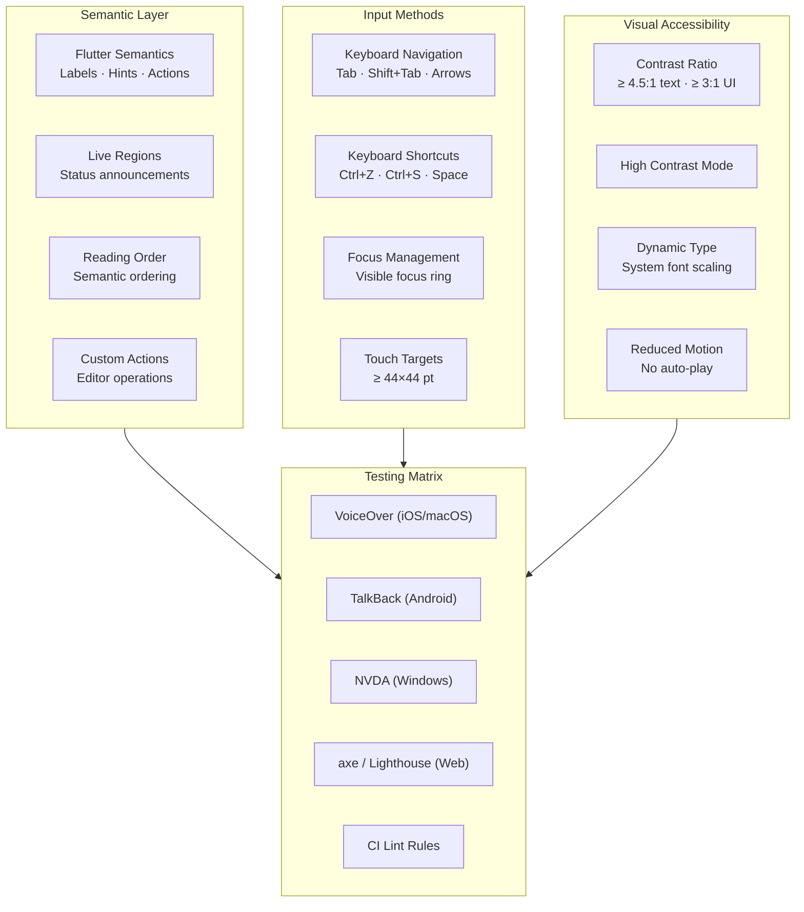
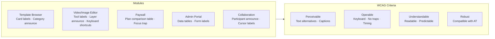

# Accessibility Standards — Architecture Diagram

> Maps to [01-accessibility-standards.md](01-accessibility-standards.md)

---

## Accessibility Architecture (WCAG 2.1 AA)

---

## Per-Module Accessibility Requirements

