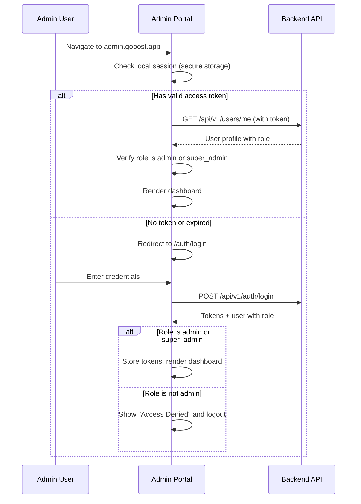
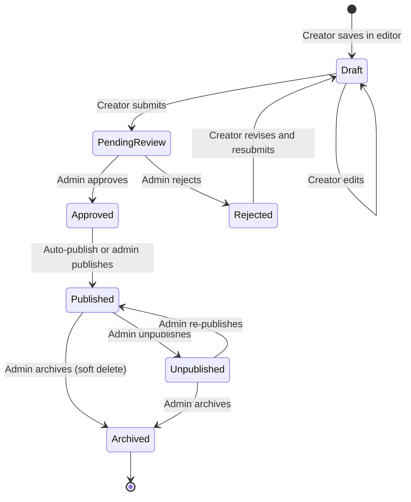
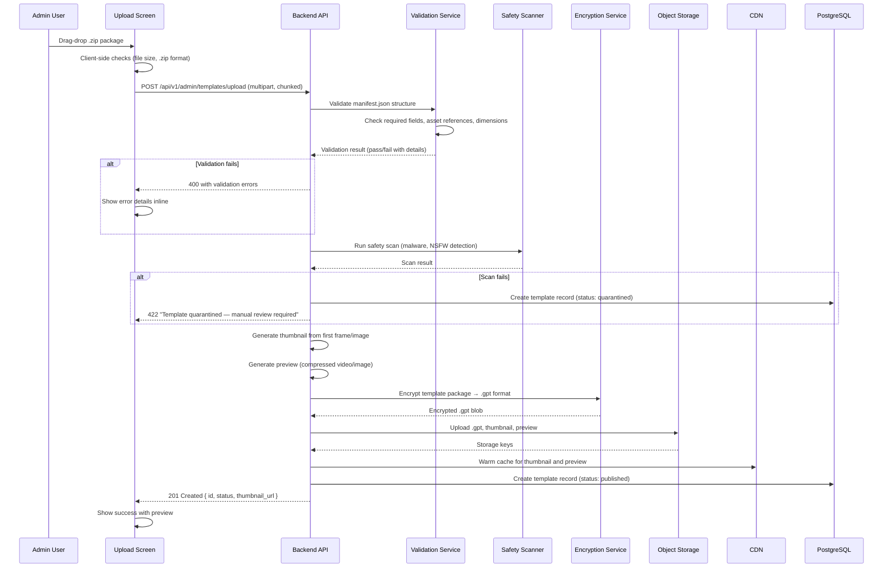

# Gopost — Admin Portal Architecture

> **Version:** 1.0.0
> **Date:** February 23, 2026
> **Classification:** Internal — Engineering Reference
> **Audience:** Flutter Engineers, Backend Engineers, Product Manager

---

## Table of Contents

1. [Overview](#1-overview)
2. [Access Control and Authentication](#2-access-control-and-authentication)
3. [Navigation and Layout](#3-navigation-and-layout)
4. [Screen Inventory](#4-screen-inventory)
5. [Template Moderation Workflow](#5-template-moderation-workflow)
6. [External Template Upload Pipeline](#6-external-template-upload-pipeline)
7. [Admin State Management](#7-admin-state-management)
8. [Real-Time Updates](#8-real-time-updates)
9. [Batch Operations](#9-batch-operations)
10. [API Mapping](#10-api-mapping)
11. [Sprint Stories](#11-sprint-stories)

---

## 1. Overview

The Admin Portal is a **Flutter Web** application (sharing the same codebase as the main app) that provides authorized administrators and the internal team with tools to manage templates, users, subscriptions, and content moderation. It runs as a separate deployment at `admin.gopost.app` but shares the `admin/` module within the monorepo.

### 1.1 Core Capabilities

| Capability | Description |
|-----------|-------------|
| **Dashboard** | Real-time KPIs: user counts, template counts, revenue, engagement |
| **Template Management** | Full CRUD lifecycle: upload, review, approve, reject, publish, unpublish, archive, delete |
| **External Upload** | Ingest templates created in After Effects, Lightroom, Figma via drag-and-drop upload with server-side validation and encryption |
| **User Management** | View/search users, assign roles, ban/unban, view user activity |
| **Content Moderation** | Review queue for pending templates with preview, approve/reject actions, flagged content |
| **Analytics** | Template popularity, user engagement, revenue metrics, retention funnels |
| **Audit Logs** | Searchable, filterable log of all admin actions with actor, action, resource, timestamp |
| **Settings** | System configuration, notification rules, content policies |

### 1.2 Target Platform

- **Primary:** Web (Chrome, Safari, Firefox, Edge — latest 2 versions)
- **Secondary:** macOS / Windows desktop app (same Flutter build, optional)
- **Not supported:** Mobile (admins use desktop/laptop)

---

## 2. Access Control and Authentication

### 2.1 Role Requirements

| Role | Portal Access | Capabilities |
|------|--------------|-------------|
| `user` | None | Cannot access admin portal |
| `creator` | None | Cannot access admin portal |
| `admin` | Full | All capabilities listed in Section 1.1 |
| `super_admin` | Full + Settings | All admin + system settings, role promotion to admin |

### 2.2 Auth Flow



### 2.3 Session Management

| Aspect | Policy |
|--------|--------|
| Access token TTL | 15 minutes |
| Refresh token TTL | 4 hours (shorter than mobile for security) |
| Idle timeout | 30 minutes without interaction triggers re-auth |
| Concurrent sessions | Max 2 admin sessions per account |
| IP restriction (optional) | Configurable allowlist of IP ranges |

---

## 3. Navigation and Layout

### 3.1 Shell Layout

```
┌─────────────────────────────────────────────────────────────────┐
│  [Logo]  GOPOST ADMIN                   🔔 Notifications  [AV] │  <- Top bar (64px)
├────────────────┬────────────────────────────────────────────────┤
│                │                                                │
│  Sidebar       │  Content Area                                  │
│  (240px)       │  (Flexible, min 800px)                        │
│                │                                                │
│  ── Overview   │  ┌──────────────────────────────────────────┐ │
│  📊 Dashboard  │  │                                          │ │
│  📈 Analytics  │  │  Active screen content                   │ │
│                │  │  rendered here                            │ │
│  ── Content    │  │                                          │ │
│  📄 Templates  │  │                                          │ │
│  ✅ Review     │  │                                          │ │
│  📤 Upload     │  │                                          │ │
│                │  │                                          │ │
│  ── Users      │  └──────────────────────────────────────────┘ │
│  👥 Users      │                                                │
│  🔑 Roles      │  ┌──────────────────────────────────────────┐ │
│                │  │  Pagination / Status Bar                 │ │
│  ── System     │  └──────────────────────────────────────────┘ │
│  📋 Audit Logs │                                                │
│  ⚙ Settings   │                                                │
│                │                                                │
└────────────────┴────────────────────────────────────────────────┘
```

### 3.2 Routing

```dart
// Admin routes nested under /admin shell route

GoRoute(
  path: '/admin',
  builder: (_, __) => const AdminShell(),
  routes: [
    GoRoute(path: 'dashboard',      builder: (_, __) => const DashboardScreen()),
    GoRoute(path: 'analytics',      builder: (_, __) => const AnalyticsScreen()),
    GoRoute(path: 'templates',      builder: (_, __) => const TemplateListScreen()),
    GoRoute(path: 'templates/:id',  builder: (_, s)  => TemplateDetailScreen(id: s.pathParameters['id']!)),
    GoRoute(path: 'review',         builder: (_, __) => const ReviewQueueScreen()),
    GoRoute(path: 'review/:id',     builder: (_, s)  => ReviewDetailScreen(id: s.pathParameters['id']!)),
    GoRoute(path: 'upload',         builder: (_, __) => const UploadScreen()),
    GoRoute(path: 'users',          builder: (_, __) => const UserListScreen()),
    GoRoute(path: 'users/:id',      builder: (_, s)  => UserDetailScreen(id: s.pathParameters['id']!)),
    GoRoute(path: 'roles',          builder: (_, __) => const RoleManagementScreen()),
    GoRoute(path: 'audit-logs',     builder: (_, __) => const AuditLogScreen()),
    GoRoute(path: 'settings',       builder: (_, __) => const SettingsScreen()),
  ],
),
```

---

## 4. Screen Inventory

### 4.1 Dashboard

**Route:** `/admin/dashboard`

**Purpose:** At-a-glance view of system health and key metrics.

**Layout:**

```
┌─────────────────────────────────────────────────────────────┐
│  KPI Cards (4-column grid)                                  │
│  ┌─────────┐ ┌─────────┐ ┌─────────┐ ┌─────────┐         │
│  │ Total   │ │ Total   │ │ Pending │ │ Revenue │          │
│  │ Users   │ │Templates│ │ Review  │ │  (MRR)  │          │
│  │ 24,512  │ │  1,847  │ │   23    │ │ $12.4K  │          │
│  │ ↑ 4.2%  │ │ ↑ 8.1%  │ │ ↓ 3    │ │ ↑ 12%  │          │
│  └─────────┘ └─────────┘ └─────────┘ └─────────┘          │
├─────────────────────────┬───────────────────────────────────┤
│  User Growth Chart      │  Template Usage Chart             │
│  (Line chart, 30 days)  │  (Bar chart, top 10)              │
│                         │                                   │
├─────────────────────────┴───────────────────────────────────┤
│  Recent Activity Feed                                       │
│  ┌───────────────────────────────────────────────────────┐ │
│  │ 🟢 Admin Alice published "Neon Story Pack"   2m ago  │ │
│  │ 🟡 New template pending review: "Summer Vibes" 5m ago│ │
│  │ 🔴 User john@example.com reported for spam   12m ago │ │
│  │ 🟢 Admin Bob approved "Minimal Portfolio"    15m ago │ │
│  └───────────────────────────────────────────────────────┘ │
└─────────────────────────────────────────────────────────────┘
```

**Data sources:**
- KPIs: `GET /api/v1/admin/dashboard` (cached, 60s TTL)
- Charts: `GET /api/v1/admin/analytics/users?period=30d` and `GET /api/v1/admin/analytics/templates?sort=usage&limit=10`
- Activity feed: `GET /api/v1/admin/audit-logs?limit=20&sort=newest`

### 4.2 Template Management

**Route:** `/admin/templates`

**Purpose:** Full lifecycle management of all templates.

**Layout:**

```
┌─────────────────────────────────────────────────────────────┐
│  Templates                                    [+ Upload]    │
│                                                             │
│  Filters: [Type ▼] [Status ▼] [Category ▼] [Search... 🔍] │
│                                                             │
│  ☐ Select All                        Showing 1-20 of 1,847 │
│  ┌──────────────────────────────────────────────────────┐  │
│  │ ☐ [Thumb] Neon Story Pack    video  Published  15.4K │  │
│  │ ☐ [Thumb] Minimal Portfolio  image  Published   8.2K │  │
│  │ ☐ [Thumb] Summer Vibes       video  Pending       -- │  │
│  │ ☐ [Thumb] Dark Mode UI Kit   image  Rejected      -- │  │
│  │ ☐ [Thumb] Travel Vlog Intro  video  Draft          0 │  │
│  └──────────────────────────────────────────────────────┘  │
│                                                             │
│  ☐ selected (0)  [Publish] [Unpublish] [Delete]            │
│  ◀ 1 2 3 ... 93 ▶                                          │
└─────────────────────────────────────────────────────────────┘
```

**Features:**
- Sortable columns: name, type, status, usage count, created date
- Bulk actions: publish, unpublish, delete (with confirmation dialog)
- Row click navigates to template detail screen
- Status badges with semantic colors: Published (green), Pending (yellow), Rejected (red), Draft (grey), Archived (grey outline)

**Data source:** `GET /api/v1/admin/templates?type=&status=&category_id=&q=&page=&limit=`

### 4.3 Template Review

**Route:** `/admin/review`

**Purpose:** Queue of templates awaiting moderation approval.

**Layout:**

```
┌─────────────────────────────────────────────────────────────┐
│  Review Queue (23 pending)                                  │
│                                                             │
│  Sort: [Oldest First ▼]                                     │
│  ┌──────────────────────────────────────────────────────┐  │
│  │ [Thumb] Summer Vibes          Submitted 2h ago       │  │
│  │         by creator@example.com  video · 1080x1920    │  │
│  │         [Review →]                                   │  │
│  ├──────────────────────────────────────────────────────┤  │
│  │ [Thumb] Pastel Collage Set    Submitted 5h ago       │  │
│  │         by artist@example.com   image · 1080x1080    │  │
│  │         [Review →]                                   │  │
│  └──────────────────────────────────────────────────────┘  │
└─────────────────────────────────────────────────────────────┘
```

**Review Detail Route:** `/admin/review/:id`

```
┌─────────────────────────────────────────────────────────────┐
│  ← Back to Queue                                            │
│                                                             │
│  ┌──────────────────────┬──────────────────────────────┐   │
│  │                      │  Metadata                    │   │
│  │  Template Preview    │  Name: Summer Vibes          │   │
│  │  (Full interactive   │  Type: Video                 │   │
│  │   preview player     │  Dimensions: 1080x1920      │   │
│  │   or image viewer)   │  Duration: 15s              │   │
│  │                      │  Layers: 8                   │   │
│  │                      │  Creator: creator@example.com│   │
│  │                      │  Submitted: Feb 23, 2026     │   │
│  │                      │  Category: Stories           │   │
│  │                      │  Tags: summer, beach, vlog   │   │
│  │                      │                              │   │
│  │                      │  Editable Fields:            │   │
│  │                      │  - Title (text)              │   │
│  │                      │  - Background (image)        │   │
│  │                      │  - Accent Color (color)      │   │
│  └──────────────────────┴──────────────────────────────┘   │
│                                                             │
│  Rejection Reason (shown if rejecting):                     │
│  [Optional note to creator...                           ]   │
│                                                             │
│  [Reject]                                      [Approve →]  │
└─────────────────────────────────────────────────────────────┘
```

**Data sources:**
- Queue: `GET /api/v1/admin/templates?status=pending_review&sort=oldest`
- Detail: `GET /api/v1/admin/templates/:id`
- Approve: `PUT /api/v1/admin/templates/:id/publish`
- Reject: `PUT /api/v1/admin/templates/:id/reject` with `{ "reason": "..." }`

### 4.4 Template Upload (External)

**Route:** `/admin/upload`

**Purpose:** Upload templates created in external tools (After Effects, Lightroom, Figma).

See **Section 6** for the full upload pipeline.

**Layout:**

```
┌─────────────────────────────────────────────────────────────┐
│  Upload Template                                            │
│                                                             │
│  Step 1: Upload Package                                     │
│  ┌───────────────────────────────────────────────────────┐ │
│  │                                                       │ │
│  │        📂 Drag and drop template package here         │ │
│  │           or [Browse Files]                           │ │
│  │                                                       │ │
│  │        Accepted: .zip containing manifest.json        │ │
│  │        Max size: 500 MB                               │ │
│  └───────────────────────────────────────────────────────┘ │
│                                                             │
│  Step 2: Validation (after upload)                          │
│  ┌───────────────────────────────────────────────────────┐ │
│  │  ✅ Manifest structure valid                          │ │
│  │  ✅ Asset files present and readable                  │ │
│  │  ✅ Dimensions: 1080x1920                             │ │
│  │  ⏳ Safety scan in progress...                        │ │
│  │  ◻ Encryption pending                                │ │
│  └───────────────────────────────────────────────────────┘ │
│                                                             │
│  Step 3: Metadata                                           │
│  Name:        [Summer Vibes                              ]  │
│  Description: [A vibrant summer-themed story template... ]  │
│  Type:        [Video ▼]                                     │
│  Category:    [Stories ▼]                                   │
│  Tags:        [summer] [beach] [+ Add Tag]                  │
│  Premium:     [✓] Requires subscription                     │
│                                                             │
│  Step 4: Review                                             │
│  Preview thumbnail and summary of validated package.        │
│                                                             │
│  [Cancel]                                  [Encrypt & Publish] │
└─────────────────────────────────────────────────────────────┘
```

### 4.5 User Management

**Route:** `/admin/users`

**Layout:**

```
┌─────────────────────────────────────────────────────────────┐
│  Users                                   Total: 24,512      │
│                                                             │
│  Filters: [Role ▼] [Status ▼] [Subscription ▼] [Search 🔍]│
│                                                             │
│  ┌──────────────────────────────────────────────────────┐  │
│  │ [AV] John Doe   john@example.com   user  Active Pro │  │
│  │ [AV] Jane Smith jane@smith.com     creator Active Free│ │
│  │ [AV] Bob Hacker bob@hack.com       user  Banned  --  │ │
│  └──────────────────────────────────────────────────────┘  │
│                                                             │
│  ◀ 1 2 3 ... 1226 ▶                                        │
└─────────────────────────────────────────────────────────────┘
```

**User Detail Route:** `/admin/users/:id`

| Section | Content |
|---------|---------|
| Profile | Avatar, name, email, role, subscription, join date, last active |
| Actions | Change role (dropdown), Ban/Unban (toggle with reason), Delete account |
| Activity | Recent templates used, templates created (if creator), last login |
| Subscription | Current plan, renewal date, payment history |

**Data sources:**
- List: `GET /api/v1/admin/users?role=&status=&q=&page=&limit=`
- Detail: `GET /api/v1/admin/users/:id` (extended admin view)
- Update role: `PUT /api/v1/admin/users/:id/role` `{ "role": "creator" }`
- Ban: `PUT /api/v1/admin/users/:id/ban` `{ "banned": true, "reason": "..." }`

### 4.6 Analytics

**Route:** `/admin/analytics`

**Layout:**

```
┌─────────────────────────────────────────────────────────────┐
│  Analytics                     Period: [Last 30 Days ▼]     │
│                                                             │
│  ┌─────────────────────────────────────────────────────┐   │
│  │  User Growth (Line Chart)                           │   │
│  │  New users / day over selected period               │   │
│  │  Total, active, churned segments                    │   │
│  └─────────────────────────────────────────────────────┘   │
│                                                             │
│  ┌──────────────────────┬──────────────────────────────┐   │
│  │  Top Templates       │  Revenue                     │   │
│  │  (Bar chart, top 10) │  (Line chart, MRR over time) │   │
│  │                      │                              │   │
│  │  1. Neon Story 15.4K │  MRR: $12,400               │   │
│  │  2. Minimal    8.2K  │  Churn: 3.2%                │   │
│  │  3. Travel     6.8K  │  LTV: $28.50                │   │
│  └──────────────────────┴──────────────────────────────┘   │
│                                                             │
│  ┌──────────────────────┬──────────────────────────────┐   │
│  │  Category Breakdown  │  Subscription Distribution   │   │
│  │  (Pie/donut chart)   │  (Pie chart)                 │   │
│  │                      │  Free: 68%                   │   │
│  │  Stories: 42%        │  Pro: 25%                    │   │
│  │  Social: 28%         │  Creator: 7%                 │   │
│  │  Business: 18%       │                              │   │
│  │  Other: 12%          │                              │   │
│  └──────────────────────┴──────────────────────────────┘   │
└─────────────────────────────────────────────────────────────┘
```

**Data sources:**
- `GET /api/v1/admin/analytics/users?period=30d&granularity=daily`
- `GET /api/v1/admin/analytics/templates?sort=usage&limit=10&period=30d`
- `GET /api/v1/admin/analytics/revenue?period=30d&granularity=daily`
- `GET /api/v1/admin/analytics/categories`
- `GET /api/v1/admin/analytics/subscriptions`

### 4.7 Audit Log Viewer

**Route:** `/admin/audit-logs`

**Layout:**

```
┌─────────────────────────────────────────────────────────────┐
│  Audit Logs                                                 │
│                                                             │
│  Filters: [Actor ▼] [Action ▼] [Resource ▼] [Date Range]   │
│                                                             │
│  ┌──────────────────────────────────────────────────────┐  │
│  │ 2026-02-23 10:42:15  admin@gopost.app                │  │
│  │ TEMPLATE_PUBLISHED   template/550e8400   →           │  │
│  ├──────────────────────────────────────────────────────┤  │
│  │ 2026-02-23 10:38:02  admin@gopost.app                │  │
│  │ TEMPLATE_REJECTED    template/661f9511   →           │  │
│  │   Reason: "Copyright violation — uses stock footage   │  │
│  │   without license"                                    │  │
│  ├──────────────────────────────────────────────────────┤  │
│  │ 2026-02-23 10:15:44  superadmin@gopost.app           │  │
│  │ USER_ROLE_CHANGED    user/7721a3b2                   │  │
│  │   Changed: user → creator                            │  │
│  └──────────────────────────────────────────────────────┘  │
│                                                             │
│  ◀ 1 2 3 ... 450 ▶                                         │
└─────────────────────────────────────────────────────────────┘
```

**Features:**
- Expandable rows showing full metadata JSON
- Export to CSV
- Filterable by actor, action type, resource type, date range
- Audit actions logged: `TEMPLATE_PUBLISHED`, `TEMPLATE_REJECTED`, `TEMPLATE_DELETED`, `TEMPLATE_UPLOADED`, `USER_ROLE_CHANGED`, `USER_BANNED`, `USER_UNBANNED`, `SETTINGS_CHANGED`

**Data source:** `GET /api/v1/admin/audit-logs?actor=&action=&resource_type=&from=&to=&page=&limit=`

### 4.8 Settings

**Route:** `/admin/settings` (super_admin only)

| Setting Group | Controls |
|--------------|----------|
| **General** | App name, support email, maintenance mode toggle |
| **Content Policy** | Max upload size, allowed file types, auto-reject keywords |
| **Notifications** | Email alerts for: new pending review, user reports, system errors |
| **Rate Limits** | Adjustable rate limits per endpoint category |
| **Feature Flags** | Toggle features: AI effects, creator program, promo codes |

---

## 5. Template Moderation Workflow

### 5.1 State Machine



### 5.2 Status Definitions

| Status | DB Value | Badge Color | Description |
|--------|---------|-------------|-------------|
| Draft | `draft` | Grey | Template saved but not submitted |
| Pending Review | `pending_review` | Yellow | Submitted, awaiting admin decision |
| Approved | `approved` | Blue | Passed review, ready to publish |
| Rejected | `rejected` | Red | Failed review, creator notified with reason |
| Published | `published` | Green | Live and visible to users |
| Unpublished | `unpublished` | Grey outline | Hidden from users but preserved |
| Archived | `archived` | Grey, strikethrough | Soft-deleted, recoverable by super_admin |

### 5.3 Moderation Rules

| Rule | Policy |
|------|--------|
| Auto-approve | Never. All templates require human review. |
| Review SLA | Pending templates should be reviewed within 24 hours. |
| Rejection requires reason | Admin must provide a reason (free text, min 10 chars). Reason is sent to creator via notification. |
| Re-submission | Rejected templates return to Draft status. Creator can edit and re-submit. |
| Escalation | If a template is flagged by > 5 users, it is auto-unpublished and moved to review queue. |

---

## 6. External Template Upload Pipeline

### 6.1 End-to-End Flow



### 6.2 Accepted Package Structure

**Video Template (.zip):**
```
template_package.zip/
├── manifest.json          # Required: name, type, dimensions, duration, layers
├── composition.json       # Required: layer hierarchy, transforms, keyframes
├── effects.json           # Optional: effect definitions and parameters
├── assets/
│   ├── footage/           # .mp4, .mov (H.264/H.265)
│   ├── images/            # .png, .webp, .jpg
│   ├── audio/             # .aac, .mp3
│   └── fonts/             # .ttf, .otf
└── thumbnail.webp         # Optional: custom thumbnail (auto-generated if missing)
```

**Image Template (.zip):**
```
template_package.zip/
├── manifest.json          # Required: name, type, dimensions, layers
├── layers.json            # Required: layer definitions, transforms, blend modes
├── filters.json           # Optional: filter/adjustment definitions
├── assets/
│   ├── backgrounds/       # .png, .webp, .jpg
│   ├── overlays/          # .png (alpha channel)
│   ├── stickers/          # .png, .svg
│   └── fonts/             # .ttf, .otf
└── thumbnail.webp         # Optional
```

### 6.3 Validation Checks

| Check | Rule | Error Code |
|-------|------|-----------|
| File size | Max 500 MB | `UPLOAD_TOO_LARGE` |
| Format | Must be .zip | `INVALID_FORMAT` |
| Manifest present | `manifest.json` must exist at root | `MISSING_MANIFEST` |
| Manifest schema | Must conform to JSON schema (name, type, dimensions required) | `INVALID_MANIFEST` |
| Asset integrity | All files referenced in composition/layers must exist in assets/ | `MISSING_ASSET` |
| Dimensions | Width and height within 100-7680 range | `INVALID_DIMENSIONS` |
| Duration (video) | 1 second to 5 minutes | `INVALID_DURATION` |
| Font licensing | Fonts must be in allowed list or marked as custom | `UNLICENSED_FONT` |
| Layer count | Max 50 layers | `TOO_MANY_LAYERS` |

### 6.4 Progress Tracking

The upload screen shows real-time progress via Server-Sent Events (SSE):

```
POST /api/v1/admin/templates/upload → returns { "upload_id": "..." }
GET /api/v1/admin/templates/upload/:upload_id/status (SSE stream)

Events:
  { "stage": "uploading", "progress": 0.45 }
  { "stage": "validating", "progress": 0.0 }
  { "stage": "validating", "progress": 1.0, "result": "passed" }
  { "stage": "scanning", "progress": 0.5 }
  { "stage": "scanning", "progress": 1.0, "result": "clean" }
  { "stage": "encrypting", "progress": 0.7 }
  { "stage": "encrypting", "progress": 1.0 }
  { "stage": "complete", "template_id": "550e8400-...", "thumbnail_url": "..." }
```

---

## 7. Admin State Management

### 7.1 Provider Architecture

```dart
// admin/presentation/providers/

// Dashboard
final dashboardStatsProvider = FutureProvider.autoDispose<DashboardStats>((ref) async {
  return ref.watch(adminServiceProvider).getDashboardStats();
});

// Template list with filters
final templateFilterProvider = StateProvider<AdminTemplateFilter>((ref) {
  return const AdminTemplateFilter(); // default: all types, all statuses
});

final adminTemplateListProvider = FutureProvider.autoDispose
    .family<PaginatedList<Template>, int>((ref, page) async {
  final filter = ref.watch(templateFilterProvider);
  return ref.watch(adminServiceProvider).getTemplates(filter: filter, page: page);
});

// Review queue
final reviewQueueProvider = FutureProvider.autoDispose<List<Template>>((ref) async {
  return ref.watch(adminServiceProvider).getPendingReviewTemplates();
});

// Selected items for bulk operations
final selectedTemplateIdsProvider = StateProvider<Set<String>>((ref) => {});

// Audit logs
final auditLogFilterProvider = StateProvider<AuditLogFilter>((ref) {
  return const AuditLogFilter();
});

final auditLogProvider = FutureProvider.autoDispose
    .family<PaginatedList<AuditLog>, int>((ref, page) async {
  final filter = ref.watch(auditLogFilterProvider);
  return ref.watch(adminServiceProvider).getAuditLogs(filter: filter, page: page);
});

// Upload progress
final uploadProgressProvider = StreamProvider.autoDispose
    .family<UploadProgress, String>((ref, uploadId) {
  return ref.watch(adminServiceProvider).watchUploadProgress(uploadId);
});
```

### 7.2 Data Models

```dart
@freezed
class AdminTemplateFilter with _$AdminTemplateFilter {
  const factory AdminTemplateFilter({
    String? type,
    String? status,
    String? categoryId,
    String? query,
    @Default('newest') String sort,
  }) = _AdminTemplateFilter;
}

@freezed
class AuditLogFilter with _$AuditLogFilter {
  const factory AuditLogFilter({
    String? actorId,
    String? action,
    String? resourceType,
    DateTime? from,
    DateTime? to,
  }) = _AuditLogFilter;
}

@freezed
class DashboardStats with _$DashboardStats {
  const factory DashboardStats({
    required int totalUsers,
    required double userGrowthPercent,
    required int totalTemplates,
    required double templateGrowthPercent,
    required int pendingReview,
    required int pendingReviewDelta,
    required int mrrCents,
    required double mrrGrowthPercent,
  }) = _DashboardStats;
}

@freezed
class UploadProgress with _$UploadProgress {
  const factory UploadProgress({
    required String stage,
    required double progress,
    String? result,
    String? templateId,
    String? thumbnailUrl,
    String? errorMessage,
  }) = _UploadProgress;
}
```

---

## 8. Real-Time Updates

### 8.1 Strategy

| Feature | Mechanism | Rationale |
|---------|-----------|-----------|
| Dashboard KPIs | Polling every 60s | Low frequency, simple; no WebSocket needed |
| Review queue count | Polling every 30s | Badge update on sidebar |
| Upload progress | Server-Sent Events (SSE) | Unidirectional, long-lived connection; simpler than WebSocket |
| Activity feed | Polling every 30s | Append new items to feed |

### 8.2 Future: WebSocket

For V2, consider upgrading to WebSocket for:
- Instant review queue notifications (push instead of poll)
- Multi-admin awareness (see who else is reviewing a template)
- Live dashboard counters

---

## 9. Batch Operations

### 9.1 Supported Operations

| Operation | Selection | Confirmation | API |
|-----------|-----------|-------------|-----|
| Bulk Publish | Checkbox multi-select | "Publish N templates?" dialog | `PUT /api/v1/admin/templates/bulk` `{ "ids": [...], "action": "publish" }` |
| Bulk Unpublish | Checkbox multi-select | "Unpublish N templates?" dialog | Same endpoint, `"action": "unpublish"` |
| Bulk Delete | Checkbox multi-select | "Permanently delete N templates? This cannot be undone." (red warning dialog) | Same endpoint, `"action": "delete"` |
| Bulk Export | Checkbox multi-select | Downloads .csv of template metadata | Client-side CSV generation from loaded data |

### 9.2 API Addition

```
PUT /api/v1/admin/templates/bulk
Authorization: Bearer <admin_token>

{
  "ids": ["uuid1", "uuid2", "uuid3"],
  "action": "publish" | "unpublish" | "delete"
}

Response (200):
{
  "success": true,
  "data": {
    "processed": 3,
    "failed": 0,
    "results": [
      { "id": "uuid1", "status": "published" },
      { "id": "uuid2", "status": "published" },
      { "id": "uuid3", "status": "published" }
    ]
  }
}
```

---

## 10. API Mapping

Summary of all backend endpoints consumed by the admin portal:

| Screen | Endpoint | Method | Auth | Purpose |
|--------|----------|--------|------|---------|
| Dashboard | `/api/v1/admin/dashboard` | GET | Admin | KPI stats |
| Dashboard | `/api/v1/admin/audit-logs?limit=20` | GET | Admin | Recent activity |
| Analytics | `/api/v1/admin/analytics/users` | GET | Admin | User growth data |
| Analytics | `/api/v1/admin/analytics/templates` | GET | Admin | Template usage data |
| Analytics | `/api/v1/admin/analytics/revenue` | GET | Admin | Revenue data |
| Analytics | `/api/v1/admin/analytics/categories` | GET | Admin | Category distribution |
| Analytics | `/api/v1/admin/analytics/subscriptions` | GET | Admin | Subscription breakdown |
| Templates | `/api/v1/admin/templates` | GET | Admin | Template list with filters |
| Templates | `/api/v1/admin/templates/:id` | GET | Admin | Template detail |
| Templates | `/api/v1/admin/templates/:id/publish` | PUT | Admin | Publish template |
| Templates | `/api/v1/admin/templates/:id/reject` | PUT | Admin | Reject template |
| Templates | `/api/v1/admin/templates/:id` | DELETE | Admin | Delete template |
| Templates | `/api/v1/admin/templates/bulk` | PUT | Admin | Bulk operations |
| Upload | `/api/v1/admin/templates/upload` | POST | Admin | Upload external template |
| Upload | `/api/v1/admin/templates/upload/:id/status` | GET (SSE) | Admin | Upload progress stream |
| Users | `/api/v1/admin/users` | GET | Admin | User list |
| Users | `/api/v1/admin/users/:id/role` | PUT | Admin | Change role |
| Users | `/api/v1/admin/users/:id/ban` | PUT | Admin | Ban/unban |
| Audit Logs | `/api/v1/admin/audit-logs` | GET | Admin | Filterable logs |
| Settings | `/api/v1/admin/settings` | GET/PUT | Super Admin | System configuration |

**New endpoints not in original API reference** (additions needed):
- `GET /api/v1/admin/analytics/*` (5 analytics endpoints)
- `PUT /api/v1/admin/templates/bulk` (batch operations)
- `GET /api/v1/admin/templates/upload/:id/status` (SSE progress)
- `GET/PUT /api/v1/admin/settings` (system settings)

---

## 11. Sprint Stories

### Sprint Assignment

| Attribute | Value |
|---|---|
| **Phase** | Phase 5: Admin Portal |
| **Sprint(s)** | Sprint 12-13 (Weeks 23-26) |
| **Team** | Flutter Engineers (2), Backend Engineers (1) |
| **Predecessor** | All Phase 1-4 complete |
| **Story Points Total** | 76 |

### Sprint 12 Stories

| ID | Story | Acceptance Criteria | Points | Priority |
|---|---|---|---|---|
| ADM-001 | As an admin, I want the admin shell layout with sidebar navigation so that I can navigate between admin screens. | - Admin shell with 240px sidebar, content area, top bar<br/>- Sidebar groups: Overview, Content, Users, System<br/>- Active route highlighted<br/>- Role gate: non-admin users see "Access Denied" | 5 | P0 |
| ADM-002 | As an admin, I want the dashboard screen with KPI cards so that I can see system health at a glance. | - 4 KPI cards: users, templates, pending reviews, MRR<br/>- Trend percentage with up/down indicator<br/>- Data from GET /admin/dashboard<br/>- Auto-refresh every 60s | 5 | P0 |
| ADM-003 | As an admin, I want user growth and template usage charts on the dashboard so that I can see trends. | - Line chart for user growth (30-day default)<br/>- Bar chart for top 10 templates by usage<br/>- Charts from analytics endpoints<br/>- Responsive: stacked on medium, side-by-side on large | 5 | P0 |
| ADM-004 | As an admin, I want the recent activity feed on the dashboard so that I can see latest admin actions. | - List of 20 most recent audit log entries<br/>- Color-coded by action type<br/>- Relative timestamps ("2m ago")<br/>- Click to expand details | 3 | P1 |
| ADM-005 | As an admin, I want the template management table with filters and sorting so that I can manage all templates. | - Table with columns: thumbnail, name, type, status, usage, date<br/>- Filters: type, status, category, search<br/>- Sortable columns<br/>- Pagination (20 per page) | 5 | P0 |
| ADM-006 | As an admin, I want template status badges with semantic colors so that I can quickly identify template state. | - Published: green, Pending: yellow, Rejected: red, Draft: grey, Archived: grey-outline<br/>- Badge component reusable across screens | 2 | P0 |
| ADM-007 | As an admin, I want the review queue screen so that I can see and act on pending templates. | - List of pending_review templates sorted oldest first<br/>- Each item shows thumbnail, name, creator, submission time<br/>- Click navigates to review detail | 3 | P0 |
| ADM-008 | As an admin, I want the review detail screen with side-by-side preview and metadata so that I can make approval decisions. | - Left: interactive preview (video player or image viewer)<br/>- Right: full metadata, editable fields, creator info<br/>- Approve and Reject buttons<br/>- Reject requires reason (min 10 chars) | 5 | P0 |
| ADM-009 | As an admin, I want the external template upload screen with drag-drop and step-by-step progress so that I can upload AE/Lightroom exports. | - Drag-drop zone accepting .zip<br/>- 4-step wizard: Upload → Validate → Metadata → Review<br/>- SSE progress for validation/encryption stages<br/>- Error display for validation failures | 8 | P0 |
| ADM-010 | As a backend engineer, I want POST /admin/templates/upload with validation, scanning, and encryption so that external templates are properly processed. | - Accepts multipart .zip upload<br/>- Validates manifest, assets, dimensions<br/>- Runs safety scan<br/>- Encrypts to .gpt format<br/>- Stores in S3 + creates DB record<br/>- Returns upload_id for progress tracking | 8 | P0 |

### Sprint 13 Stories

| ID | Story | Acceptance Criteria | Points | Priority |
|---|---|---|---|---|
| ADM-011 | As an admin, I want the user management table with filters, role editing, and ban controls. | - Searchable user table with role, status, subscription columns<br/>- Inline role dropdown to change roles<br/>- Ban/unban toggle with reason dialog<br/>- Confirmation before destructive actions | 5 | P0 |
| ADM-012 | As an admin, I want the analytics screen with user growth, revenue, and category charts. | - Period selector (7d, 30d, 90d, 1y)<br/>- User growth line chart, revenue line chart<br/>- Category pie chart, subscription pie chart<br/>- Top templates bar chart | 5 | P0 |
| ADM-013 | As an admin, I want the audit log viewer with filters and expandable entries. | - Filterable by actor, action, resource type, date range<br/>- Expandable rows showing full metadata<br/>- Export to CSV<br/>- Pagination | 5 | P0 |
| ADM-014 | As an admin, I want bulk operations (publish, unpublish, delete) on the template table so that I can manage templates efficiently. | - Checkbox selection on template rows<br/>- Select-all toggle<br/>- Bulk action bar appears when items selected<br/>- Confirmation dialog with count<br/>- PUT /admin/templates/bulk endpoint | 5 | P0 |
| ADM-015 | As a backend engineer, I want the 5 analytics endpoints so that the admin dashboard has data. | - /analytics/users, /analytics/templates, /analytics/revenue, /analytics/categories, /analytics/subscriptions<br/>- Period and granularity parameters<br/>- Cached with 5-min TTL | 5 | P0 |
| ADM-016 | As a super_admin, I want the settings screen so that I can configure system behavior. | - General, Content Policy, Notifications, Rate Limits, Feature Flags sections<br/>- GET/PUT /admin/settings<br/>- Only accessible to super_admin role<br/>- Changes logged to audit trail | 5 | P1 |

### Definition of Done

- [ ] All stories marked complete
- [ ] Code reviewed and merged to `develop`
- [ ] Unit and widget tests passing (>= 85% coverage)
- [ ] All screens verified at expanded breakpoint (desktop web)
- [ ] All API endpoints have integration tests
- [ ] Dark mode verified
- [ ] Sprint review demo completed
