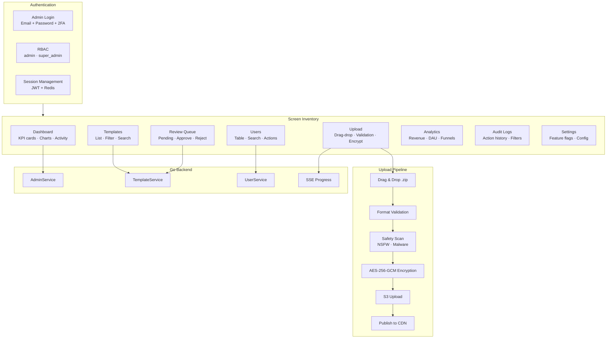
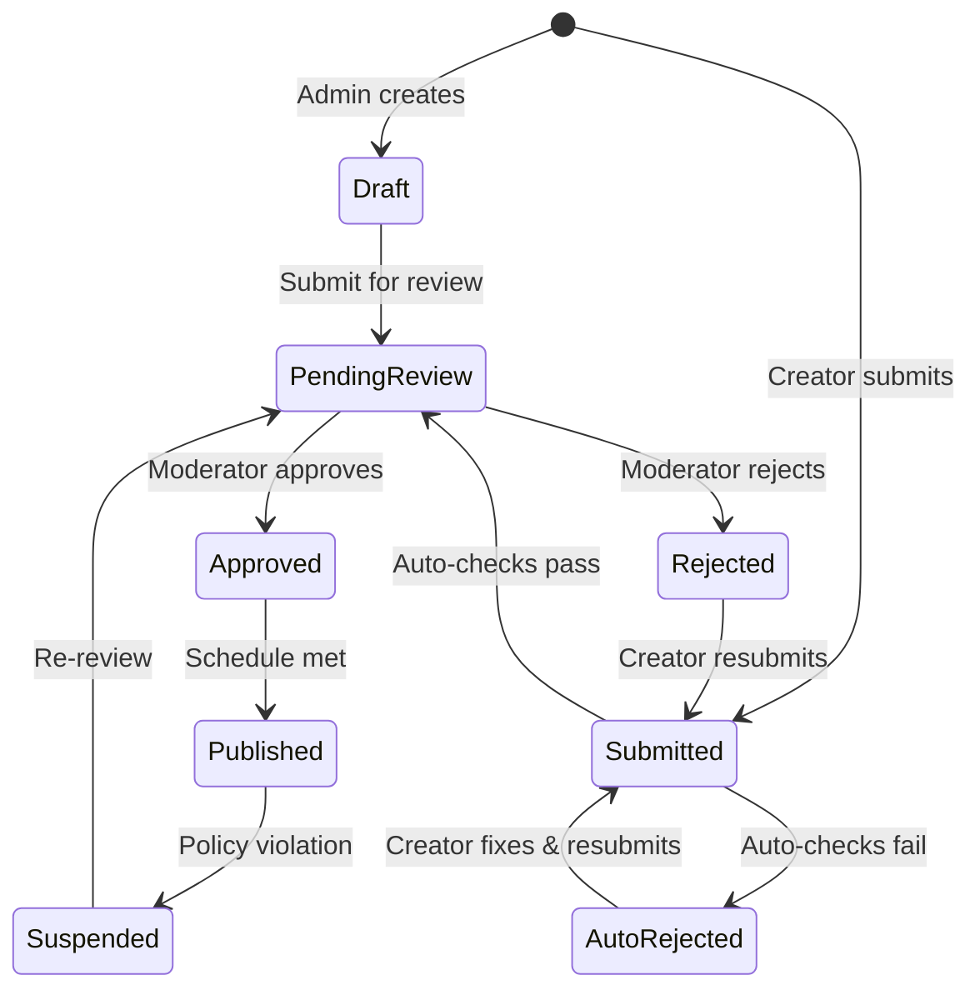
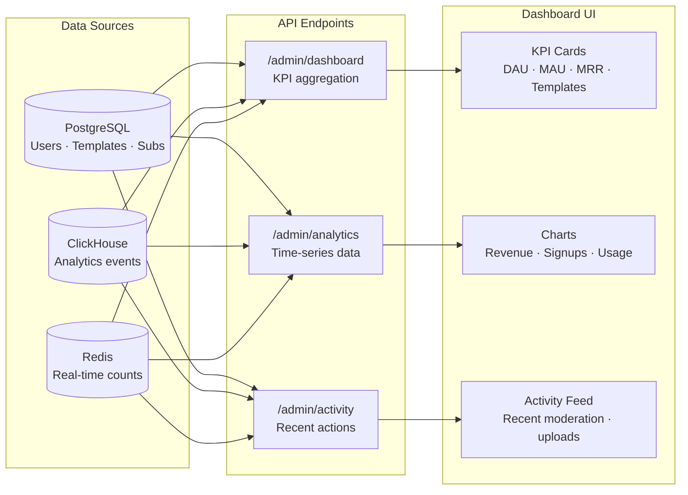

# Admin Portal — Architecture Diagram

> Maps to [01-admin-portal.md](01-admin-portal.md)

---

## Admin Portal Architecture

```mermaid
graph TB
    subgraph auth_admin ["Authentication"]
        LOGIN["Admin Login<br/>Email + Password + 2FA"]
        RBAC_A["RBAC<br/>admin · super_admin"]
        SESSION["Session Management<br/>JWT + Redis"]
    end

    subgraph screens ["Screen Inventory"]
        DASH["Dashboard<br/>KPI cards · Charts · Activity"]
        TMPL_M["Templates<br/>List · Filter · Search"]
        REVIEW["Review Queue<br/>Pending · Approve · Reject"]
        UPLOAD_A["Upload<br/>Drag-drop · Validation · Encrypt"]
        USERS_A["Users<br/>Table · Search · Actions"]
        ANALYTICS_A["Analytics<br/>Revenue · DAU · Funnels"]
        AUDIT["Audit Logs<br/>Action history · Filters"]
        SETTINGS["Settings<br/>Feature flags · Config"]
    end

    subgraph upload_pipeline ["Upload Pipeline"]
        DND["Drag & Drop .zip"]
        VALIDATE["Format Validation"]
        SCAN["Safety Scan<br/>NSFW · Malware"]
        ENCRYPT["AES-256-GCM Encryption"]
        STORE["S3 Upload"]
        PUBLISH["Publish to CDN"]
    end

    subgraph backend_admin ["Go Backend"]
        ADMIN_SVC["AdminService"]
        TMPL_SVC["TemplateService"]
        USER_SVC["UserService"]
        SSE_SVC["SSE Progress"]
    end

    auth_admin --> screens
    UPLOAD_A --> DND --> VALIDATE --> SCAN --> ENCRYPT --> STORE --> PUBLISH
    DASH --> ADMIN_SVC
    TMPL_M & REVIEW --> TMPL_SVC
    USERS_A --> USER_SVC
    UPLOAD_A --> SSE_SVC
```

---

## Moderation State Machine

```mermaid
stateDiagram-v2
    [*] --> Draft : Admin creates
    [*] --> Submitted : Creator submits
    Draft --> PendingReview : Submit for review
    Submitted --> PendingReview : Auto-checks pass
    Submitted --> AutoRejected : Auto-checks fail
    PendingReview --> Approved : Moderator approves
    PendingReview --> Rejected : Moderator rejects
    Approved --> Published : Schedule met
    Published --> Suspended : Policy violation
    Suspended --> PendingReview : Re-review
    Rejected --> Submitted : Creator resubmits
    AutoRejected --> Submitted : Creator fixes & resubmits
```

---

## Dashboard Data Flow

```mermaid
graph LR
    subgraph sources ["Data Sources"]
        PG_DASH[("PostgreSQL<br/>Users · Templates · Subs")]
        CH_DASH[("ClickHouse<br/>Analytics events")]
        RD_DASH[("Redis<br/>Real-time counts")]
    end

    subgraph api_dash ["API Endpoints"]
        STATS["/admin/dashboard<br/>KPI aggregation"]
        CHARTS["/admin/analytics<br/>Time-series data"]
        FEED["/admin/activity<br/>Recent actions"]
    end

    subgraph dashboard ["Dashboard UI"]
        KPI["KPI Cards<br/>DAU · MAU · MRR · Templates"]
        CHART["Charts<br/>Revenue · Signups · Usage"]
        ACTIVITY["Activity Feed<br/>Recent moderation · uploads"]
    end

    PG_DASH & CH_DASH & RD_DASH --> STATS & CHARTS & FEED
    STATS --> KPI
    CHARTS --> CHART
    FEED --> ACTIVITY
```
