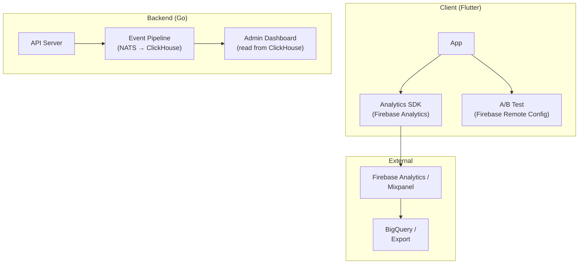
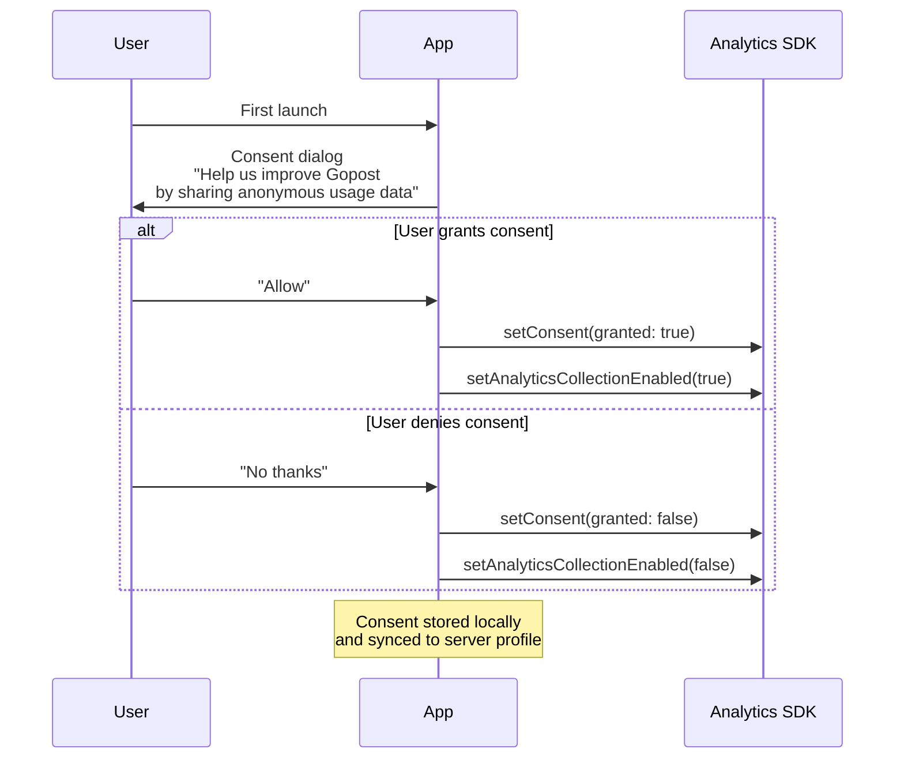

# Gopost — Analytics and Event Tracking Architecture

> **Version:** 1.0.0
> **Date:** February 23, 2026
> **Audience:** Flutter Engineers, Backend Engineers, Product/Growth Team
> **References:** [Security Architecture](../architecture/07-security-architecture.md), [Admin Portal](../admin-portal/01-admin-portal.md), [Monetization](../monetization/01-monetization-system.md)

---

## Table of Contents

1. [Goals and Principles](#1-goals-and-principles)
2. [Architecture Overview](#2-architecture-overview)
3. [Event Taxonomy](#3-event-taxonomy)
4. [Client-Side SDK Integration](#4-client-side-sdk-integration)
5. [Backend Event Pipeline](#5-backend-event-pipeline)
6. [Funnel Definitions](#6-funnel-definitions)
7. [User Properties](#7-user-properties)
8. [A/B Testing Framework](#8-ab-testing-framework)
9. [Privacy and Consent](#9-privacy-and-consent)
10. [Admin Analytics Dashboard](#10-admin-analytics-dashboard)
11. [Alerting and Anomaly Detection](#11-alerting-and-anomaly-detection)
12. [Implementation Guide](#12-implementation-guide)
13. [Sprint Stories](#13-sprint-stories)

---

## 1. Goals and Principles

| Goal | Description |
|------|-------------|
| **Product insight** | Understand how users discover, preview, edit, and export templates |
| **Conversion optimization** | Track free → trial → paid funnel; identify friction points |
| **Content intelligence** | Know which templates, categories, and styles drive engagement |
| **Performance monitoring** | Track client-side performance (load times, render FPS, export duration) |
| **Privacy-compliant** | GDPR/CCPA-compliant; consent-based tracking; no PII in analytics events |

### 1.1 Design Principles

| Principle | Meaning |
|-----------|---------|
| **Event, not page** | Track meaningful actions, not every page view |
| **Schema-first** | Every event has a defined schema; unregistered events are rejected |
| **Privacy by default** | No tracking until consent granted; user ID hashed; no PII in event properties |
| **Dual pipeline** | Client events → analytics provider (Firebase Analytics / Mixpanel); server events → own pipeline (for revenue, admin) |
| **Low overhead** | Analytics SDK must not impact app performance; events batched and sent asynchronously |

---

## 2. Architecture Overview



### 2.1 Two Pipelines

| Pipeline | Source | Destination | Purpose |
|----------|--------|-------------|---------|
| **Client analytics** | Flutter app | Firebase Analytics (primary) or Mixpanel | Product analytics: funnels, retention, engagement |
| **Server events** | Go API server | NATS → ClickHouse | Revenue analytics, admin dashboard KPIs, audit |

Client analytics feeds the product/growth team's dashboards. Server events feed the admin portal's analytics section and provide the source of truth for revenue metrics.

---

## 3. Event Taxonomy

### 3.1 Naming Convention

```
<object>_<action>
```

Examples: `template_viewed`, `editor_export_started`, `subscription_purchased`

### 3.2 Core Events

#### Authentication

| Event | Trigger | Properties |
|-------|---------|-----------|
| `auth_signup_started` | User taps "Create Account" | `method` (email, google, apple) |
| `auth_signup_completed` | Account created successfully | `method`, `time_to_complete_ms` |
| `auth_login_completed` | User logs in | `method` |
| `auth_logout` | User logs out | — |

#### Template Discovery

| Event | Trigger | Properties |
|-------|---------|-----------|
| `template_list_viewed` | Browse screen loaded | `type` (video/image), `category`, `source` (home, search, category) |
| `template_searched` | Search query submitted | `query`, `results_count`, `type` |
| `template_viewed` | Template detail opened | `template_id`, `template_type`, `tier` (free/pro/creator) |
| `template_preview_played` | Preview video/image viewed | `template_id`, `preview_duration_ms` |
| `template_favorited` | User favorites a template | `template_id` |
| `template_unfavorited` | User removes favorite | `template_id` |

#### Editor

| Event | Trigger | Properties |
|-------|---------|-----------|
| `editor_opened` | Editor screen loaded | `source` (template/blank), `template_id`, `editor_type` (video/image) |
| `editor_tool_used` | User applies a tool | `tool` (trim, filter, text, sticker, transition, etc.) |
| `editor_layer_added` | New layer created | `layer_type` (video, image, text, audio, sticker) |
| `editor_undo` | Undo action | — |
| `editor_redo` | Redo action | — |
| `editor_session_duration` | Editor closed | `duration_ms`, `layers_count`, `tools_used[]` |
| `editor_export_started` | Export initiated | `format` (mp4, png, jpg), `resolution`, `template_id` |
| `editor_export_completed` | Export finished | `duration_ms`, `file_size_bytes`, `resolution` |
| `editor_export_failed` | Export error | `error_type`, `template_id` |
| `editor_project_saved` | Project saved | `project_id`, `is_auto_save` |

#### Subscription

| Event | Trigger | Properties |
|-------|---------|-----------|
| `paywall_viewed` | Paywall screen shown | `trigger` (template_gate, settings, banner), `current_plan` |
| `paywall_plan_selected` | User selects a plan | `plan_id`, `price`, `period` (monthly/yearly) |
| `subscription_purchase_started` | Purchase flow initiated | `plan_id`, `store` (apple/google/stripe) |
| `subscription_purchased` | Purchase confirmed | `plan_id`, `price`, `currency`, `trial` (true/false) |
| `subscription_purchase_failed` | Purchase error | `error_type`, `plan_id` |
| `subscription_cancelled` | User cancels | `plan_id`, `reason` (if provided) |
| `subscription_restored` | Restore purchases | `plan_id` |
| `trial_started` | Trial begins | `plan_id`, `trial_days` |
| `trial_converted` | Trial → paid | `plan_id` |
| `trial_expired` | Trial ends without conversion | `plan_id` |

#### Notifications

| Event | Trigger | Properties |
|-------|---------|-----------|
| `notification_permission_requested` | OS permission dialog shown | — |
| `notification_permission_granted` | User grants permission | — |
| `notification_permission_denied` | User denies permission | — |
| `notification_received` | Push received (foreground) | `type`, `notification_id` |
| `notification_opened` | User taps notification | `type`, `notification_id`, `time_to_open_ms` |

#### App Lifecycle

| Event | Trigger | Properties |
|-------|---------|-----------|
| `app_opened` | App launched | `source` (cold/warm), `cold_start_ms` |
| `app_backgrounded` | App goes to background | `session_duration_ms` |
| `app_updated` | First launch after update | `previous_version`, `current_version` |
| `onboarding_step_viewed` | Onboarding screen shown | `step` (1, 2, 3, ...) |
| `onboarding_completed` | Onboarding finished | `steps_viewed`, `time_ms` |
| `onboarding_skipped` | User skips onboarding | `step_skipped_at` |

#### Performance (sampled)

| Event | Trigger | Properties |
|-------|---------|-----------|
| `perf_cold_start` | App first frame rendered | `duration_ms`, `device_model`, `os_version` |
| `perf_template_load` | Template detail loaded | `duration_ms`, `template_id` |
| `perf_preview_first_frame` | Preview starts playing | `duration_ms`, `template_id` |
| `perf_export` | Export completed | `duration_ms`, `resolution`, `layers_count` |
| `perf_editor_fps` | Periodic FPS sample (every 10s during editing) | `avg_fps`, `min_fps`, `dropped_frames` |

---

## 4. Client-Side SDK Integration

### 4.1 Analytics Service Abstraction

The app uses an abstraction layer so the analytics provider can be swapped:

```dart
// lib/core/analytics/analytics_service.dart

abstract class AnalyticsService {
  Future<void> initialize();
  Future<void> setUserId(String? hashedUserId);
  Future<void> setUserProperties(Map<String, String> properties);
  Future<void> logEvent(String name, {Map<String, Object>? parameters});
  Future<void> setConsent(bool granted);
}
```

### 4.2 Firebase Analytics Implementation

```dart
// lib/core/analytics/firebase_analytics_service.dart

class FirebaseAnalyticsService implements AnalyticsService {
  final FirebaseAnalytics _analytics;

  FirebaseAnalyticsService(this._analytics);

  @override
  Future<void> initialize() async {
    await _analytics.setAnalyticsCollectionEnabled(false);
  }

  @override
  Future<void> setConsent(bool granted) async {
    await _analytics.setConsent(
      analyticsStorage: granted
          ? ConsentStatus.granted
          : ConsentStatus.denied,
      adStorage: ConsentStatus.denied, // never for ads
    );
    await _analytics.setAnalyticsCollectionEnabled(granted);
  }

  @override
  Future<void> setUserId(String? hashedUserId) async {
    await _analytics.setUserId(id: hashedUserId);
  }

  @override
  Future<void> setUserProperties(Map<String, String> properties) async {
    for (final entry in properties.entries) {
      await _analytics.setUserProperty(
        name: entry.key,
        value: entry.value,
      );
    }
  }

  @override
  Future<void> logEvent(String name, {Map<String, Object>? parameters}) async {
    await _analytics.logEvent(name: name, parameters: parameters);
  }
}
```

### 4.3 Event Logging Pattern

```dart
// Usage throughout the app

final analytics = ref.read(analyticsProvider);

// Template viewed
analytics.logEvent('template_viewed', parameters: {
  'template_id': template.id,
  'template_type': template.type.name,
  'tier': template.tier.name,
});

// Export completed
analytics.logEvent('editor_export_completed', parameters: {
  'duration_ms': exportDuration.inMilliseconds,
  'file_size_bytes': fileSize,
  'resolution': resolution.name,
});
```

### 4.4 Automatic Screen Tracking

```dart
// GoRouter observer for screen tracking

class AnalyticsRouteObserver extends NavigatorObserver {
  final AnalyticsService _analytics;

  AnalyticsRouteObserver(this._analytics);

  @override
  void didPush(Route route, Route? previousRoute) {
    _logScreenView(route);
  }

  void _logScreenView(Route route) {
    final name = route.settings.name;
    if (name != null) {
      _analytics.logEvent('screen_view', parameters: {
        'screen_name': name,
      });
    }
  }
}
```

---

## 5. Backend Event Pipeline

### 5.1 Server-Side Events

The backend emits events for actions that are authoritative (purchases, subscription changes) and for admin analytics:

```go
// internal/analytics/event.go

type ServerEvent struct {
    Name       string            `json:"name"`
    UserID     string            `json:"user_id"`
    Properties map[string]any    `json:"properties"`
    Timestamp  time.Time         `json:"timestamp"`
    Source     string            `json:"source"` // "api", "worker", "webhook"
}
```

### 5.2 Event Emitter

```go
// internal/analytics/emitter.go

type EventEmitter struct {
    queue MessageQueue
}

func (e *EventEmitter) Emit(ctx context.Context, name string, userID string, props map[string]any) {
    event := ServerEvent{
        Name:       name,
        UserID:     userID,
        Properties: props,
        Timestamp:  time.Now(),
        Source:     "api",
    }
    e.queue.Publish("analytics.event", event)
}
```

### 5.3 Event Consumer (NATS → ClickHouse)

```go
// internal/worker/analytics_worker.go

func (w *AnalyticsWorker) HandleEvent(msg *nats.Msg) {
    var event ServerEvent
    json.Unmarshal(msg.Data, &event)

    w.clickhouse.Insert("events", map[string]any{
        "event_name":  event.Name,
        "user_id":     event.UserID,
        "properties":  event.Properties,
        "timestamp":   event.Timestamp,
        "source":      event.Source,
    })

    msg.Ack()
}
```

### 5.4 Server Events Catalog

| Event | Source | Properties |
|-------|--------|-----------|
| `user_registered` | Auth handler | `method` |
| `subscription_created` | Webhook handler | `plan_id`, `price`, `currency`, `store` |
| `subscription_renewed` | Webhook handler | `plan_id`, `period_end` |
| `subscription_cancelled` | Webhook handler | `plan_id`, `reason` |
| `subscription_expired` | Cron job | `plan_id` |
| `template_published` | Admin handler | `template_id`, `publisher_id` |
| `template_download` | Template handler | `template_id`, `user_id`, `tier` |
| `receipt_validated` | Receipt handler | `store`, `plan_id`, `valid` |
| `admin_action` | Admin handlers | `action`, `target_type`, `target_id`, `admin_id` |

---

## 6. Funnel Definitions

### 6.1 Activation Funnel

```
app_opened (first time)
    → onboarding_completed
    → auth_signup_completed
    → template_viewed (first)
    → editor_opened (first)
    → editor_export_completed (first)
```

**Target:** ≥ 30% of signups reach first export within 7 days

### 6.2 Template Usage Funnel

```
template_list_viewed
    → template_viewed
    → template_preview_played
    → editor_opened (from template)
    → editor_export_completed
```

**Target:** ≥ 15% list-to-export conversion

### 6.3 Subscription Conversion Funnel

```
paywall_viewed
    → paywall_plan_selected
    → subscription_purchase_started
    → subscription_purchased
```

**Target:** ≥ 5% paywall-to-purchase conversion

### 6.4 Trial Conversion Funnel

```
trial_started
    → editor_opened (during trial, ≥ 3 sessions)
    → editor_export_completed (during trial)
    → trial_converted
```

**Target:** ≥ 40% trial-to-paid conversion

### 6.5 Retention Cohorts

| Cohort | Definition |
|--------|-----------|
| D1 | % of users returning Day 1 after signup |
| D7 | % returning Day 7 |
| D30 | % returning Day 30 |
| Weekly active | Opened app ≥ 1 day in the week |
| Monthly active | Opened app ≥ 1 day in the month |

**Targets:** D1 ≥ 40%, D7 ≥ 25%, D30 ≥ 15%

---

## 7. User Properties

User properties are set once and updated when they change. They are attached to all subsequent events automatically:

| Property | Type | Example | Updated When |
|----------|------|---------|-------------|
| `subscription_plan` | String | "free", "pro", "creator" | On purchase, cancel, expire |
| `subscription_status` | String | "none", "trial", "active", "past_due" | On lifecycle change |
| `platform` | String | "ios", "android", "web", "macos", "windows" | On login |
| `app_version` | String | "1.2.0" | On app update |
| `locale` | String | "en", "ar", "es" | On locale change |
| `account_age_days` | Int | 45 | Computed on each session |
| `templates_exported_total` | Int | 12 | On export |
| `editor_type_preference` | String | "video", "image", "both" | Computed from usage |

```dart
// Set user properties after login / profile fetch

analytics.setUserProperties({
  'subscription_plan': user.plan.name,
  'subscription_status': user.subscriptionStatus.name,
  'platform': Platform.operatingSystem,
  'app_version': packageInfo.version,
  'locale': currentLocale.languageCode,
});
```

---

## 8. A/B Testing Framework

### 8.1 Provider

Firebase Remote Config is the primary A/B testing / feature flag system:

```dart
// lib/core/config/remote_config_service.dart

class RemoteConfigService {
  final FirebaseRemoteConfig _config;

  Future<void> initialize() async {
    await _config.setConfigSettings(RemoteConfigSettings(
      fetchTimeout: const Duration(seconds: 10),
      minimumFetchInterval: const Duration(hours: 1),
    ));
    await _config.fetchAndActivate();
  }

  bool getBool(String key) => _config.getBool(key);
  String getString(String key) => _config.getString(key);
  int getInt(String key) => _config.getInt(key);
}
```

### 8.2 Experiment Definition

Experiments are defined in Firebase Console and evaluated client-side:

| Experiment | Variants | Metric | Hypothesis |
|-----------|----------|--------|-----------|
| `paywall_layout` | A: single-page, B: comparison-table | `subscription_purchased` | Comparison table increases conversion |
| `onboarding_length` | A: 3 steps, B: 5 steps | `onboarding_completed`, `auth_signup_completed` | Shorter onboarding increases signup |
| `template_preview_autoplay` | A: auto-play, B: tap-to-play | `template_preview_played`, `editor_opened` | Auto-play increases editor opens |
| `export_quality_default` | A: 1080p, B: 720p | `editor_export_completed`, `editor_export_failed` | 720p default reduces export failures |
| `trial_length` | A: 3 days, B: 7 days | `trial_converted` | 7-day trial increases conversion |

### 8.3 Logging Experiment Exposure

```dart
final paywallLayout = ref.read(remoteConfigProvider).getString('paywall_layout');

analytics.logEvent('experiment_exposure', parameters: {
  'experiment': 'paywall_layout',
  'variant': paywallLayout,
});
```

### 8.4 Analysis

Experiment results are analyzed in Firebase A/B Testing console or exported to BigQuery for custom analysis. Minimum sample size and statistical significance thresholds:

| Parameter | Value |
|-----------|-------|
| Minimum sample per variant | 1,000 users |
| Minimum experiment duration | 14 days |
| Statistical significance | 95% confidence |
| Primary metric evaluation | After minimum duration + sample |

---

## 9. Privacy and Consent

### 9.1 Consent Flow



### 9.2 Data Rules

| Rule | Implementation |
|------|---------------|
| No PII in events | User ID is a SHA-256 hash of UUID; no email, name, phone in event properties |
| No tracking without consent | `setAnalyticsCollectionEnabled(false)` until consent granted |
| Consent revocable | Settings → Privacy → toggle "Usage analytics" |
| Data deletion | On account deletion, analytics user ID is deleted from Firebase; server-side events anonymized |
| IP anonymization | Firebase Analytics IP anonymization enabled |
| Data retention | Firebase: 14 months; ClickHouse server events: 24 months, then aggregated |

### 9.3 Consent Provider

```dart
// lib/core/analytics/consent_provider.dart

final analyticsConsentProvider = StateNotifierProvider<ConsentNotifier, bool>((ref) {
  return ConsentNotifier(ref.read(preferencesProvider));
});

class ConsentNotifier extends StateNotifier<bool> {
  final PreferencesService _prefs;

  ConsentNotifier(this._prefs) : super(false) {
    _load();
  }

  Future<void> _load() async {
    state = await _prefs.getBool('analytics_consent') ?? false;
  }

  Future<void> setConsent(bool granted) async {
    state = granted;
    await _prefs.setBool('analytics_consent', granted);
    final analytics = ProviderScope.containerOf(context).read(analyticsProvider);
    await analytics.setConsent(granted);
  }
}
```

### 9.4 GDPR Data Export

On user request, export all server-side events associated with their user ID:

| Endpoint | Method | Description |
|----------|--------|-------------|
| `/users/me/data-export` | POST | Initiates async data export |
| `/users/me/data-export/{id}` | GET | Downloads export (JSON) when ready |

---

## 10. Admin Analytics Dashboard

The admin portal's analytics section (see [Admin Portal](../admin-portal/01-admin-portal.md)) queries ClickHouse for server-side metrics and presents:

### 10.1 Dashboard Sections

| Section | Metrics | Source |
|---------|---------|--------|
| **Users** | DAU, WAU, MAU, new signups, churn | ClickHouse (user_registered, app_opened) |
| **Templates** | Top templates by usage, download count, category distribution | ClickHouse (template_download, template_published) |
| **Revenue** | MRR, ARR, new MRR, churned MRR, ARPU, LTV | ClickHouse (subscription_created/renewed/cancelled) |
| **Subscriptions** | Active subscribers, trial users, conversion rates, plan distribution | ClickHouse + PostgreSQL |
| **Engagement** | Avg session duration, exports per user, editor tool usage | ClickHouse (editor_session_duration, editor_export_completed) |

### 10.2 Real-Time vs Batch

| Metric | Freshness | Implementation |
|--------|-----------|---------------|
| Active users (DAU) | Real-time (~1 min) | ClickHouse materialized view |
| Revenue (MRR) | Near real-time (~5 min) | ClickHouse query, Redis cache 5-min TTL |
| Funnels | Hourly | ClickHouse scheduled query → materialized table |
| Retention cohorts | Daily | Nightly batch job → materialized table |

---

## 11. Alerting and Anomaly Detection

### 11.1 Alerts

| Alert | Condition | Channel |
|-------|-----------|---------|
| Export failure spike | `editor_export_failed` > 10% of exports in 1-hour window | Slack + PagerDuty |
| Purchase failure spike | `subscription_purchase_failed` > 20% in 1-hour window | Slack + PagerDuty |
| Cold start regression | `perf_cold_start` p95 > 3s for 1 hour | Slack |
| DAU drop | DAU < 70% of 7-day average | Slack |
| Signup drop | Signups < 50% of 7-day average for 6 hours | Slack |

### 11.2 Implementation

Alerts are implemented as Grafana alert rules querying ClickHouse:

```yaml
# grafana/alerts/export-failure.yaml (conceptual)

name: Export Failure Rate Spike
condition: >
  rate(count(editor_export_failed)[1h]) / 
  rate(count(editor_export_started)[1h]) > 0.10
for: 15m
notifications:
  - slack-engineering
  - pagerduty-on-call
```

---

## 12. Implementation Guide

### 12.1 Package Dependencies (Flutter)

| Package | Purpose |
|---------|---------|
| `firebase_analytics` | Firebase Analytics SDK |
| `firebase_remote_config` | A/B testing and feature flags |

### 12.2 Directory Structure

```
lib/core/
├── analytics/
│   ├── analytics_service.dart         # Abstract interface
│   ├── firebase_analytics_service.dart # Firebase implementation
│   ├── analytics_route_observer.dart   # Screen tracking
│   ├── consent_provider.dart           # Consent state management
│   └── event_names.dart               # String constants for all event names
├── config/
│   └── remote_config_service.dart     # Firebase Remote Config wrapper

backend/internal/
├── analytics/
│   ├── event.go                       # ServerEvent struct
│   ├── emitter.go                     # EventEmitter (NATS publisher)
│   └── constants.go                   # Event name constants
├── worker/
│   └── analytics_worker.go            # NATS → ClickHouse consumer
```

### 12.3 Event Name Constants

```dart
// lib/core/analytics/event_names.dart

abstract class AnalyticsEvents {
  // Auth
  static const authSignupStarted = 'auth_signup_started';
  static const authSignupCompleted = 'auth_signup_completed';
  static const authLoginCompleted = 'auth_login_completed';
  static const authLogout = 'auth_logout';

  // Template
  static const templateListViewed = 'template_list_viewed';
  static const templateSearched = 'template_searched';
  static const templateViewed = 'template_viewed';
  static const templatePreviewPlayed = 'template_preview_played';
  static const templateFavorited = 'template_favorited';

  // Editor
  static const editorOpened = 'editor_opened';
  static const editorToolUsed = 'editor_tool_used';
  static const editorExportStarted = 'editor_export_started';
  static const editorExportCompleted = 'editor_export_completed';
  static const editorExportFailed = 'editor_export_failed';
  static const editorSessionDuration = 'editor_session_duration';

  // Subscription
  static const paywallViewed = 'paywall_viewed';
  static const subscriptionPurchased = 'subscription_purchased';
  static const subscriptionCancelled = 'subscription_cancelled';
  static const trialStarted = 'trial_started';
  static const trialConverted = 'trial_converted';

  // Performance
  static const perfColdStart = 'perf_cold_start';
  static const perfTemplateLoad = 'perf_template_load';
  static const perfExport = 'perf_export';
  static const perfEditorFps = 'perf_editor_fps';
}
```

### 12.4 Developer Guidelines

| Guideline | Explanation |
|-----------|-------------|
| Use constants from `AnalyticsEvents` | No raw string event names |
| Keep parameter values low-cardinality | `template_type: "video"` not `template_type: "travel_vlog_cinematic_4k"` |
| Don't log PII | No email, name, phone, IP in event parameters |
| Check consent before logging | `AnalyticsService` internally gates on consent; caller doesn't need to check |
| Log events at the action site | Log in the widget/handler where the action happens, not in a parent |
| Test events with DebugView | Use Firebase DebugView during development |

---

## 13. Sprint Stories

### Sprint Assignment

| Attribute | Value |
|---|---|
| **Phase** | Phase 5: Subscription & Admin (server pipeline), Phase 6: Polish (client SDK, A/B testing) |
| **Sprint(s)** | Sprint 13 (server pipeline), Sprint 14 (client integration) |
| **Team** | Backend Engineers, Flutter Engineers, DevOps |
| **Predecessor** | Firebase project setup (Sprint 1), NATS (Sprint 3) |
| **Story Points Total** | 48 |

### Stories

| ID | Story | Acceptance Criteria | Points | Priority | Sprint |
|---|---|---|---|---|---|
| ANA-001 | Create `AnalyticsService` abstraction and `FirebaseAnalyticsService` implementation | Interface defined; Firebase implementation works; consent gating in place | 3 | P0 | 14 |
| ANA-002 | Implement consent flow (dialog, persistence, Firebase consent mode) | Consent dialog on first launch; consent stored; analytics disabled when denied; toggleable in Settings | 3 | P0 | 14 |
| ANA-003 | Define event name constants and implement auth events (signup, login, logout) | Constants file created; auth events fire correctly; visible in Firebase DebugView | 2 | P0 | 14 |
| ANA-004 | Implement template discovery events (list_viewed, searched, viewed, preview_played, favorited) | Events fire on correct triggers; parameters match schema; visible in DebugView | 3 | P0 | 14 |
| ANA-005 | Implement editor events (opened, tool_used, layer_added, session_duration, export_*) | All editor events fire; session duration calculated correctly; export timing accurate | 3 | P0 | 14 |
| ANA-006 | Implement subscription events (paywall_viewed, plan_selected, purchased, cancelled, trial_*) | Events fire at correct points in purchase flow; server-side confirmation events logged | 3 | P0 | 14 |
| ANA-007 | Implement performance events (cold_start, template_load, export, editor_fps) with sampling | Events sampled at 10%; durations measured accurately; no performance impact from measurement | 3 | P1 | 14 |
| ANA-008 | Implement `AnalyticsRouteObserver` for automatic screen tracking | Screen view logged on every route push; screen names match route names | 2 | P0 | 14 |
| ANA-009 | Set user properties (plan, status, platform, version, locale) on login and change | Properties set after login; updated on plan change and locale change | 2 | P0 | 14 |
| ANA-010 | Set up Firebase Remote Config + A/B testing wrapper | RemoteConfigService initialized; config fetched on startup; values accessible via provider | 3 | P0 | 14 |
| ANA-011 | Implement first A/B test (paywall_layout: single-page vs comparison-table) | Both variants implemented; experiment_exposure logged; variant from Remote Config | 3 | P1 | 14 |
| ANA-012 | Backend: Implement `EventEmitter` and NATS → ClickHouse analytics pipeline | Server events published to NATS; consumer writes to ClickHouse; events queryable | 5 | P0 | 13 |
| ANA-013 | Backend: Instrument all server-side events (user_registered, subscription_*, template_*, admin_action) | All server events from catalog logged; properties match schema | 3 | P0 | 13 |
| ANA-014 | Backend: ClickHouse schema and materialized views for DAU, revenue, funnels | Tables created; materialized views compute DAU and MRR; admin dashboard can query | 5 | P0 | 13 |
| ANA-015 | Set up Grafana alerts for export failure spike, purchase failure, cold start regression | Alerts configured; fire correctly on threshold breach; notifications reach Slack | 3 | P1 | 13 |
| ANA-016 | GDPR data export endpoint (POST /users/me/data-export) | Export job initiated; JSON file generated; download link returned | 2 | P1 | 14 |

### Definition of Done

- [ ] All stories marked complete
- [ ] All events visible in Firebase DebugView (client-side)
- [ ] Server events flowing to ClickHouse; admin dashboard queries working
- [ ] Consent flow tested (grant, deny, revoke)
- [ ] No PII in any event
- [ ] A/B test framework operational with one live experiment
- [ ] Grafana alerts firing on test thresholds
- [ ] Code reviewed and merged
