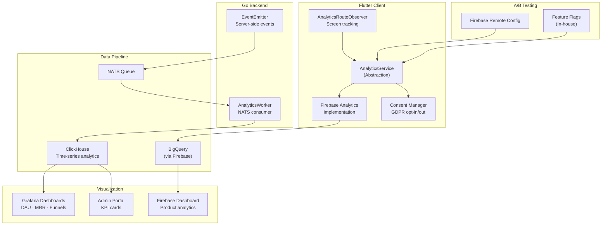

# Analytics & Event Tracking — Architecture Diagram

> Maps to [01-analytics-event-tracking.md](01-analytics-event-tracking.md)

---

## Dual-Pipeline Analytics Architecture

---

## Event Taxonomy (50+ Events)

```mermaid
graph LR
    subgraph categories ["Event Categories"]
        AUTH["Auth Events<br/>login · register · logout"]
        TMPL["Template Events<br/>view · preview · download · customize"]
        EDIT["Editor Events<br/>session_start · effect_applied · export"]
        SUB["Subscription Events<br/>paywall_shown · purchase · cancel"]
        PERF["Performance Events<br/>cold_start · frame_drop · crash"]
        ADMIN_E["Admin Events<br/>template_approved · user_banned"]
    end

    subgraph funnels ["Key Funnels"]
        ACT["Activation<br/>install → register → first_template"]
        USAGE["Template Usage<br/>browse → preview → customize → export"]
        CONV["Subscription<br/>paywall_shown → started → completed"]
        TRIAL["Trial<br/>trial_start → engagement → convert"]
    end

    categories --> funnels
```

