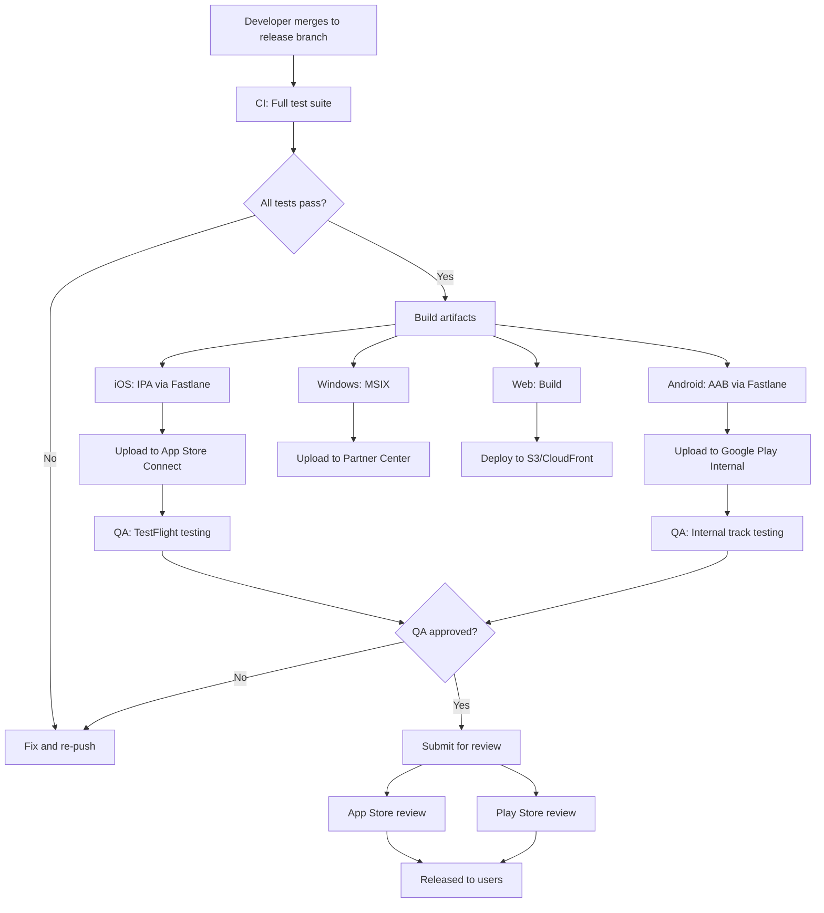

# Gopost — App Store Submission Playbook

> **Version:** 1.0.0
> **Date:** February 23, 2026
> **Classification:** Internal — Engineering + Product Reference
> **Audience:** Flutter Engineers, QA Engineers, Product Manager, DevOps

---

## Table of Contents

1. [Overview](#1-overview)
2. [Pre-Submission Checklist](#2-pre-submission-checklist)
3. [Apple App Store (iOS / macOS)](#3-apple-app-store-ios--macos)
4. [Google Play Store (Android)](#4-google-play-store-android)
5. [Microsoft Store (Windows)](#5-microsoft-store-windows)
6. [Web Deployment](#6-web-deployment)
7. [Screenshot and Media Specifications](#7-screenshot-and-media-specifications)
8. [Metadata and Localization](#8-metadata-and-localization)
9. [Common Rejection Reasons and Mitigations](#9-common-rejection-reasons-and-mitigations)
10. [Update Strategy](#10-update-strategy)
11. [CI/CD Integration](#11-cicd-integration)
12. [Sprint Stories](#12-sprint-stories)

---

## 1. Overview

This playbook provides step-by-step guidance for submitting Gopost to all target app stores, maintaining compliance with each platform's guidelines, and establishing a repeatable release process.

### 1.1 Target Platforms

| Platform | Store | Minimum OS | App Type |
|----------|-------|------------|----------|
| iOS | Apple App Store | iOS 15.0+ | Universal (iPhone + iPad) |
| macOS | Mac App Store | macOS 12.0+ | Flutter desktop |
| Android | Google Play Store | API 26 (Android 8.0+) | APK/AAB |
| Windows | Microsoft Store | Windows 10+ | MSIX package |
| Web | gopost.app | Chrome 90+, Safari 15+, Firefox 90+, Edge 90+ | PWA / SPA |

### 1.2 Release Cadence

| Release Type | Frequency | Scope |
|-------------|-----------|-------|
| Major release | Quarterly | New features, major UI changes |
| Minor release | Bi-weekly (sprint boundary) | Bug fixes, small features |
| Hotfix | As needed | Critical bug fixes, security patches |

---

## 2. Pre-Submission Checklist

### 2.1 Universal Checklist (All Platforms)

| # | Item | Owner | Status |
|---|------|-------|--------|
| 1 | All CI pipelines passing (lint, test, build) | DevOps | ☐ |
| 2 | No critical or high-severity bugs open | QA | ☐ |
| 3 | Release notes written (user-facing changelog) | PM | ☐ |
| 4 | Version number and build number incremented | DevOps | ☐ |
| 5 | Privacy policy URL accessible and up-to-date | Legal | ☐ |
| 6 | Terms of Service URL accessible | Legal | ☐ |
| 7 | Support URL / contact email configured | PM | ☐ |
| 8 | All third-party licenses documented (`LicenseRegistry`) | Dev | ☐ |
| 9 | Crash reporting (Sentry/Crashlytics) configured for release | DevOps | ☐ |
| 10 | Analytics events verified for key flows | Dev | ☐ |
| 11 | Accessibility audit passed (VoiceOver/TalkBack tested) | QA | ☐ |
| 12 | Localization strings reviewed for all supported languages | PM | ☐ |
| 13 | Performance benchmarks within acceptable range | QA | ☐ |
| 14 | Feature flags set correctly for this release (see `docs/feature-flags/01-feature-flag-system.md`) | Dev | ☐ |
| 15 | All subscription products created and approved in store dashboards | DevOps | ☐ |
| 16 | Push notification permission request justified in context (not on first launch) | Dev | ☐ |
| 17 | macOS: Separate App Privacy details reviewed for Mac App Store | PM | ☐ |
| 18 | Windows: Microsoft Store privacy statement URL configured | PM | ☐ |
| 19 | Web: GDPR cookie consent banner functional for EU users | Dev | ☐ |

### 2.2 Versioning Scheme

```
Major.Minor.Patch+BuildNumber
Example: 1.2.3+142

- Major: Breaking changes or major milestones (1.0 = launch)
- Minor: New features within a sprint
- Patch: Bug fixes and hotfixes
- BuildNumber: Auto-incremented by CI (unique per build)
```

**Flutter `pubspec.yaml`:**
```yaml
version: 1.2.3+142
```

**Mapping:**
- iOS: `CFBundleShortVersionString` = 1.2.3, `CFBundleVersion` = 142
- Android: `versionName` = 1.2.3, `versionCode` = 142
- Windows: MSIX version = 1.2.3.142

---

## 3. Apple App Store (iOS / macOS)

### 3.1 Account Requirements

| Requirement | Detail |
|-------------|--------|
| Apple Developer Program | $99/year enrollment |
| App Store Connect access | Admin or App Manager role |
| Signing certificates | Distribution certificate + provisioning profiles (managed via Xcode Cloud or Fastlane Match) |
| DUNS number | Required for organization account |

### 3.2 App Store Connect Configuration

| Field | Value |
|-------|-------|
| Bundle ID | `com.gopost.app` (iOS), `com.gopost.app.macos` (macOS) |
| Primary category | Photo & Video |
| Secondary category | Graphics & Design |
| Content rating | 4+ (no objectionable content) |
| Price | Free (with in-app purchases) |
| Availability | All territories (initially English-speaking, expand with localization) |

### 3.3 In-App Purchase Setup

| Product ID | Type | Reference Name |
|-----------|------|----------------|
| `com.gopost.pro.monthly` | Auto-renewable subscription | Pro Monthly |
| `com.gopost.pro.yearly` | Auto-renewable subscription | Pro Yearly |
| `com.gopost.creator.monthly` | Auto-renewable subscription | Creator Monthly |
| `com.gopost.creator.yearly` | Auto-renewable subscription | Creator Yearly |

**Subscription group:** "Gopost Subscription" (all 4 products in same group for upgrade/downgrade).

### 3.4 App Review Guidelines Compliance

| Guideline | Gopost Compliance |
|-----------|-------------------|
| **1.4.1 — Physical harm:** No user-generated content that could cause harm | Template moderation pipeline filters prohibited content |
| **2.1 — App completeness:** App must be fully functional for review | No demo modes; test account provided to reviewer |
| **2.3.3 — Screenshots:** Must reflect actual app experience | Screenshots from real app builds, no marketing mockups |
| **3.1.1 — In-App Purchase:** Digital content must use IAP | All subscriptions via StoreKit 2; no external payment links |
| **3.1.2 — Subscriptions:** Clear pricing, terms, trial info | Paywall shows price, duration, auto-renew disclosure, restore button |
| **3.2.2 — Unacceptable business model:** No bait-and-switch | Free tier genuinely functional; upgrade prompt non-aggressive |
| **4.0 — Design:** Native look and feel encouraged | Flutter app with platform-adaptive widgets; respects iOS conventions |
| **5.1.1 — Data collection:** Must declare all data collected | App Privacy details completed per Section 3.5 |
| **5.1.2 — Data use:** Must describe data use purposes | Privacy policy covers all data use |

### 3.5 App Privacy Details

| Data Type | Collected | Linked to Identity | Used for Tracking |
|-----------|-----------|-------------------|-------------------|
| Email address | Yes | Yes | No |
| Name | Yes | Yes | No |
| User ID | Yes | Yes | No |
| Purchase history | Yes | Yes | No |
| Photos/Videos (user uploads) | Yes | Yes | No |
| Usage data | Yes | Yes | No |
| Crash data | Yes | No | No |
| Performance data | Yes | No | No |

### 3.6 Review Notes Template

```
Test Account:
Email: reviewer@gopost-test.com
Password: [rotated per submission]

Test Instructions:
1. Log in with the test account (Pro plan activated)
2. Browse templates in the "Social Media" category
3. Open any template and use the image editor
4. Export an image (will use Pro features: 4K, no watermark)
5. Navigate to Settings > Subscription to view plan details

In-App Purchase Testing:
- Subscription products are in sandbox mode
- Use any sandbox Apple ID to test purchase flow

Notes:
- The app requires network access for template downloads
- Image/video editor works offline after template is cached
- C++ native engine is used for rendering (FFI, no JIT or dynamic code)
```

### 3.7 Build and Submission Commands

```bash
# Build iOS release
flutter build ipa --release --export-method app-store

# Upload to App Store Connect (via Fastlane)
fastlane deliver --ipa build/ios/ipa/Gopost.ipa \
  --skip_screenshots --skip_metadata

# Or via Xcode
# Open build/ios/archive/Runner.xcarchive in Xcode
# Organizer → Distribute App → App Store Connect
```

---

## 4. Google Play Store (Android)

### 4.1 Account Requirements

| Requirement | Detail |
|-------------|--------|
| Google Play Developer account | $25 one-time fee |
| Google Play Console access | Admin or Release Manager role |
| Signing key | App signing by Google Play (upload key managed locally) |

### 4.2 Play Console Configuration

| Field | Value |
|-------|-------|
| Package name | `com.gopost.app` |
| Category | Art & Design |
| Content rating | IARC: Everyone |
| Price | Free (with in-app purchases) |
| Target countries | All (initially English-speaking markets) |
| Target API level | Latest stable (API 35+) |

### 4.3 Play Billing Products

| Product ID | Type |
|-----------|------|
| `pro_monthly` | Subscription (base plan: monthly) |
| `pro_yearly` | Subscription (base plan: yearly) |
| `creator_monthly` | Subscription (base plan: monthly) |
| `creator_yearly` | Subscription (base plan: yearly) |

### 4.4 Google Play Policy Compliance

| Policy | Gopost Compliance |
|--------|-------------------|
| **Payments:** Digital content must use Play Billing | All subscriptions via Play Billing Library 6+ |
| **User Data:** Data Safety form required | Completed per Section 4.5 |
| **Ads:** Must declare ad SDKs | No ad SDKs (ad-free Pro/Creator; minimal prompts on Free) |
| **Target API level:** Must target latest | `targetSdkVersion` updated each release |
| **64-bit:** Required for all apps | Flutter builds arm64-v8a and x86_64 by default |
| **App Bundle:** AAB required | `flutter build appbundle` |
| **Deceptive behavior:** No misleading claims | Clear subscription terms, no dark patterns |

### 4.5 Data Safety Form

| Data Type | Collected | Shared | Purpose |
|-----------|-----------|--------|---------|
| Email | Yes | No | Account management |
| Name | Yes | No | Account management |
| User IDs | Yes | No | Account management |
| Photos/Videos | Yes | No | App functionality |
| Purchase history | Yes | No | App functionality |
| App interactions | Yes | No | Analytics |
| Crash logs | Yes | No | App functionality |
| Performance diagnostics | Yes | No | App functionality |

### 4.6 Build and Submission

```bash
# Build Android App Bundle
flutter build appbundle --release

# The AAB is at: build/app/outputs/bundle/release/app-release.aab

# Upload via Fastlane
fastlane supply --aab build/app/outputs/bundle/release/app-release.aab \
  --track internal  # internal → alpha → beta → production

# Or manually upload via Google Play Console
```

### 4.7 Release Tracks

| Track | Purpose | Audience |
|-------|---------|----------|
| Internal testing | Smoke test before wider release | Dev team (up to 100 testers) |
| Closed testing (Alpha) | Broader QA testing | QA team + selected beta users |
| Open testing (Beta) | Public beta | Anyone who opts in |
| Production | Live release | All users |
| Staged rollout | Gradual production release | 5% → 20% → 50% → 100% |

---

## 5. Microsoft Store (Windows)

### 5.1 Account Requirements

| Requirement | Detail |
|-------------|--------|
| Microsoft Partner Center account | $19 one-time (individual) or $99 (company) |
| Code signing certificate | Self-signed for dev; Store-signed for release |

### 5.2 MSIX Packaging

```yaml
# windows/runner/msix_config.yaml (or pubspec.yaml)
msix_config:
  display_name: Gopost
  publisher_display_name: Gopost Inc.
  identity_name: GopostInc.Gopost
  msix_version: 1.2.3.0
  publisher: CN=Gopost Inc., O=Gopost Inc., L=City, S=State, C=US
  logo_path: assets/icons/app_icon.png
  capabilities: internetClient, picturesLibrary, videosLibrary
  languages: en-us
```

```bash
# Build Windows MSIX
flutter pub run msix:create

# Output: build/windows/runner/Release/gopost.msix
# Upload via Partner Center
```

### 5.3 Store Listing

| Field | Value |
|-------|-------|
| Category | Photo & Video |
| Age rating | 3+ |
| System requirements | Windows 10 version 1903+, 4GB RAM, GPU with DirectX 11 |
| Pricing | Free (subscriptions via Stripe on web) |

---

## 6. Web Deployment

### 6.1 Build Configuration

```bash
# Build Flutter web (CanvasKit renderer for image/video editing)
flutter build web --release --web-renderer canvaskit

# Output: build/web/
```

### 6.2 Hosting

| Component | Service |
|-----------|---------|
| Static hosting | CloudFront + S3 (or Cloudflare Pages) |
| Domain | gopost.app |
| SSL | ACM certificate (auto-renewed) |
| CDN | CloudFront distribution |

### 6.3 Web Privacy and Compliance

| Requirement | Implementation |
|-------------|----------------|
| **GDPR cookie consent** | Cookie consent banner (EU users) using consent management platform (e.g., CookieBot or custom). Required before analytics cookies are set |
| **Privacy policy** | Link in footer and PWA manifest. Same privacy policy as mobile apps |
| **CCPA opt-out** | "Do Not Sell My Information" link in footer for California users |
| **WCAG 2.1 AA** | Web build must meet accessibility standards per `docs/accessibility/01-accessibility-standards.md` |
| **CSP headers** | Content Security Policy headers configured on CloudFront response headers policy |

### 6.4 PWA Configuration

```json
// web/manifest.json
{
  "name": "Gopost",
  "short_name": "Gopost",
  "start_url": "/",
  "display": "standalone",
  "background_color": "#FFFFFF",
  "theme_color": "#6C5CE7",
  "icons": [
    { "src": "icons/Icon-192.png", "sizes": "192x192", "type": "image/png" },
    { "src": "icons/Icon-512.png", "sizes": "512x512", "type": "image/png" },
    { "src": "icons/Icon-maskable-192.png", "sizes": "192x192", "type": "image/png", "purpose": "maskable" },
    { "src": "icons/Icon-maskable-512.png", "sizes": "512x512", "type": "image/png", "purpose": "maskable" }
  ]
}
```

### 6.4 Deployment Pipeline

```yaml
# .github/workflows/deploy-web.yml
name: Deploy Web
on:
  push:
    tags: ['v*']
    paths: ['lib/**', 'web/**', 'pubspec.yaml']

jobs:
  deploy:
    runs-on: ubuntu-latest
    steps:
      - uses: actions/checkout@v4
      - uses: subosito/flutter-action@v2
        with:
          flutter-version: '3.x'
      - run: flutter build web --release --web-renderer canvaskit
      - uses: aws-actions/configure-aws-credentials@v4
        with:
          role-to-assume: ${{ secrets.AWS_DEPLOY_ROLE }}
          aws-region: us-east-1
      - run: |
          aws s3 sync build/web/ s3://gopost-web-prod/ --delete
          aws cloudfront create-invalidation \
            --distribution-id ${{ secrets.CF_DISTRIBUTION_ID }} \
            --paths "/*"
```

---

## 7. Screenshot and Media Specifications

### 7.1 Apple App Store Screenshots

| Device | Size (pixels) | Required | Count |
|--------|--------------|----------|-------|
| iPhone 6.9" (iPhone 16 Pro Max) | 1320 × 2868 | Yes | 3–10 |
| iPhone 6.3" (iPhone 16 Pro) | 1206 × 2622 | Recommended | 3–10 |
| iPhone 6.7" (iPhone 15 Plus) | 1290 × 2796 | Optional | 3–10 |
| iPad Pro 13" | 2064 × 2752 | Yes (if iPad supported) | 3–10 |
| iPad Pro 11" | 1668 × 2388 | Optional | 3–10 |
| Mac | 2880 × 1800 (or 1280 × 800) | Yes (if Mac app) | 1–10 |

**App Preview (video):**
- Duration: 15–30 seconds
- Format: H.264, MOV or MP4
- Resolution: Same as screenshot sizes
- Audio: Optional (AAC)

### 7.2 Google Play Screenshots

| Device | Size (pixels) | Required | Count |
|--------|--------------|----------|-------|
| Phone | 1080 × 1920 (min 320px, max 3840px per side) | Yes | 2–8 |
| 7" Tablet | 1200 × 1920 | Recommended | 2–8 |
| 10" Tablet | 1600 × 2560 | Recommended | 2–8 |

**Promotional graphics:**
- Feature graphic: 1024 × 500 (required)
- Hi-res icon: 512 × 512 (required)
- Promo video: YouTube URL (optional)

### 7.3 Microsoft Store Screenshots

| Size | Required | Count |
|------|----------|-------|
| 1366 × 768 (minimum) | Yes | 1–10 |
| 2560 × 1440 (recommended) | Recommended | 1–10 |

### 7.4 Screenshot Content Plan

| Screenshot # | Content | All Platforms |
|-------------|---------|---------------|
| 1 | Hero: Template gallery with "Create stunning content" tagline | Yes |
| 2 | Image editor with template loaded, showing editing tools | Yes |
| 3 | Video editor timeline with effects panel | Yes |
| 4 | Template browsing by category with search | Yes |
| 5 | Export dialog showing quality options | Yes |
| 6 | Before/after split showing template customization | Yes |
| 7 | Subscription comparison (Free vs Pro vs Creator) | Yes |
| 8 | Marketplace with creator templates (post-launch) | Future |

### 7.5 Screenshot Generation Automation

```bash
# Using Fastlane Snapshot (iOS) + screengrab (Android)

# iOS
fastlane snapshot run --scheme "GopostUITests" \
  --devices "iPhone 16 Pro Max" "iPad Pro (13-inch) (M4)"

# Android
fastlane screengrab run --app_apk build/app/outputs/apk/debug/app-debug.apk \
  --tests_apk build/app/outputs/apk/androidTest/debug/app-debug-androidTest.apk
```

---

## 8. Metadata and Localization

### 8.1 App Name

| Platform | Field | Value | Character Limit |
|----------|-------|-------|-----------------|
| iOS | App Name | Gopost — Social Media Templates | 30 |
| iOS | Subtitle | Create. Edit. Post. | 30 |
| Android | App Name | Gopost — Social Media Templates | 30 |
| Android | Short Description | Create stunning social media content with professional templates | 80 |

### 8.2 Description (English)

```
Create stunning social media content in minutes with Gopost — the all-in-one 
template editor for Instagram, TikTok, YouTube, and more.

BROWSE THOUSANDS OF TEMPLATES
• Professional templates for stories, reels, posts, and thumbnails
• New templates added weekly by our design team and creator community
• Filter by category, style, or trending topics

POWERFUL IMAGE EDITOR
• Adjust colors, add filters, and apply effects
• Edit text, swap images, and customize every element
• Layer-based editing with professional precision
• Export in stunning 4K quality

FULL-FEATURED VIDEO EDITOR
• Multi-track timeline with up to 32 tracks
• Keyframe animations and motion graphics
• Professional transitions and effects
• Audio editing with waveform visualization

CREATOR TOOLS
• Publish your own templates to the marketplace
• Earn revenue from your designs
• Track downloads and earnings with analytics

PLANS
• Free: Basic editing with watermark
• Pro ($9.99/mo): Full features, 4K export, no watermark
• Creator ($19.99/mo): Everything in Pro + publish & earn

COLLABORATE IN REAL TIME (Coming Soon)
• Invite teammates to edit templates together
• See live cursors and selections
• Changes sync instantly across all devices

TEMPLATE MARKETPLACE (Coming Soon)
• Browse thousands of community-created templates
• Purchase premium templates from top creators
• Rate and review your favorites

Download Gopost and start creating today!
```

> **Note:** The "Coming Soon" sections should be added to the store listing when the corresponding features launch (Marketplace: Sprint 19, Collaboration: Sprint 23). Use feature flags (`docs/feature-flags/01-feature-flag-system.md`) to control when these features are visible in-app.

### 8.3 Keywords (iOS — 100 character limit)

```
templates,social media,instagram,tiktok,video editor,image editor,stories,reels,design,content
```

### 8.4 Localization Priority

| Phase | Languages | Markets |
|-------|-----------|---------|
| Launch | English (US), English (UK) | US, UK, CA, AU |
| Month 2 | Spanish, Portuguese | LATAM, Brazil, Spain, Portugal |
| Month 4 | French, German, Italian | EU |
| Month 6 | Japanese, Korean, Chinese (Simplified) | East Asia |
| Month 9 | Arabic, Hindi, Turkish | MENA, India, Turkey |

**Note:** Metadata (name, description, keywords, screenshots with text overlays) must be localized per language. Use the localization system from `docs/localization/01-localization-architecture.md`.

---

## 9. Common Rejection Reasons and Mitigations

### 9.1 Apple App Store Rejections

| Rejection Reason | Frequency | Mitigation |
|-----------------|-----------|------------|
| **Guideline 2.1 — Crashes/bugs during review** | Common | Pre-submission QA on same iOS version as review devices; provide test account that works |
| **Guideline 3.1.1 — Using non-IAP for digital goods** | Common | All digital content uses StoreKit 2; no links to external payment |
| **Guideline 3.1.2 — Subscription requirements** | Medium | Restore Purchases button visible; cancel instructions in App Store settings; clear pricing display |
| **Guideline 4.0 — Design/minimum functionality** | Medium | Ensure Free tier has genuine utility (not just a paywall gate) |
| **Guideline 5.1.1 — Privacy nutrition labels** | Common | Keep App Privacy details in sync with actual data collection |
| **Guideline 2.5.1 — Only public APIs** | Low | FFI to our own C++ engine; no private Apple APIs; no runtime code generation |
| **Guideline 4.2 — Minimum functionality** | Low | App provides significant editing functionality beyond template browsing |
| **Login/auth issues during review** | Common | Rotate test credentials before each submission; verify test account works |

### 9.2 Google Play Rejections

| Rejection Reason | Frequency | Mitigation |
|-----------------|-----------|------------|
| **Data Safety form inaccurate** | Common | Review before every submission; match actual SDKs |
| **Target API too low** | Medium | Always target latest stable API level |
| **Subscription cancel flow missing** | Medium | Deep link to Play Store subscription management |
| **Permissions not justified** | Medium | Only request permissions at point of use; explain in-context |
| **Ad policy (if ads added later)** | Low | Follow AdMob integration guide strictly |
| **Content policy** | Low | Template moderation catches prohibited content before publish |

### 9.3 Rejection Response Workflow

```
Rejection received → PM notified within 1 hour
→ Dev team analyzes rejection reason (same day)
→ Fix implemented and tested (1-2 days)
→ Resubmission with Resolution Center response
→ Expedited review requested if available
```

---

## 10. Update Strategy

### 10.1 Staged Rollout

| Platform | Staged Rollout Support | Strategy |
|----------|----------------------|----------|
| iOS | Phased release (7 days automatic) | Enable for all non-hotfix releases |
| Android | Staged rollout (percentage-based) | 5% → 20% → 50% → 100% over 4 days |
| Windows | N/A (all or nothing) | Monitor crash reports for 24h before promoting |
| Web | Instant | CDN cache invalidation; feature flags for gradual exposure |

### 10.2 Forced Update Mechanism

For critical security or compatibility updates:

```dart
// lib/core/update/update_checker.dart

class UpdateChecker {
  static const _minimumVersionKey = 'minimum_app_version';

  Future<UpdateStatus> check() async {
    final remoteConfig = await _fetchRemoteConfig();
    final minVersion = Version.parse(remoteConfig[_minimumVersionKey]);
    final currentVersion = Version.parse(packageInfo.version);

    if (currentVersion < minVersion) {
      return UpdateStatus.forceUpdate;
    }
    // optional: check for recommended update
    return UpdateStatus.upToDate;
  }
}
```

**Remote config** is fetched from `/api/v1/config/app` which returns:
```json
{
  "minimum_app_version": "1.0.0",
  "recommended_app_version": "1.2.0",
  "update_message": "Please update for the latest features and security fixes."
}
```

### 10.3 Hotfix Process

| Step | Action | Timeline |
|------|--------|----------|
| 1 | Critical bug confirmed | T+0 |
| 2 | Hotfix branch from `main` (`hotfix/1.2.1`) | T+1h |
| 3 | Fix implemented and tested | T+4h |
| 4 | Build and submit to all stores | T+5h |
| 5 | Apple: request expedited review | T+5h |
| 6 | Android: 100% rollout (no staging for hotfix) | T+6h (after review) |
| 7 | Web: deploy immediately | T+5h |
| 8 | Merge hotfix back to `develop` and `main` | T+6h |

---

## 11. CI/CD Integration

### 11.1 Release Pipeline Overview



### 11.2 Fastlane Configuration

```ruby
# fastlane/Fastfile

platform :ios do
  desc "Build and upload to TestFlight"
  lane :beta do
    setup_ci
    match(type: "appstore", readonly: true)
    build_flutter_app(target: "lib/main.dart")
    build_app(
      workspace: "ios/Runner.xcworkspace",
      scheme: "Runner",
      export_method: "app-store"
    )
    upload_to_testflight(
      skip_waiting_for_build_processing: true
    )
  end

  desc "Submit to App Store"
  lane :release do
    deliver(
      submit_for_review: true,
      automatic_release: false,
      phased_release: true,
      submission_information: {
        add_id_info_uses_idfa: false
      }
    )
  end
end

platform :android do
  desc "Build and upload to internal track"
  lane :beta do
    build_flutter_app(target: "lib/main.dart")
    upload_to_play_store(
      track: "internal",
      aab: "../build/app/outputs/bundle/release/app-release.aab"
    )
  end

  desc "Promote to production with staged rollout"
  lane :release do
    upload_to_play_store(
      track: "production",
      rollout: "0.05"
    )
  end
end
```

### 11.3 Version Bumping Automation

```yaml
# .github/workflows/release.yml (triggered by tag)
- name: Bump version
  run: |
    VERSION=${GITHUB_REF#refs/tags/v}
    BUILD_NUMBER=${{ github.run_number }}
    sed -i "s/^version:.*/version: ${VERSION}+${BUILD_NUMBER}/" pubspec.yaml
```

---

## 12. Sprint Stories

### Sprint Assignment

| Attribute | Value |
|---|---|
| **Phase** | Phase 6: Polish & Launch |
| **Sprint(s)** | Sprint 15–16 (2 sprints, 4 weeks) |
| **Team** | 1 Flutter Engineer, 1 DevOps Engineer, PM (part-time) |
| **Predecessor** | All feature development complete |
| **Story Points Total** | 52 |

### Sprint 15: Store Setup & Build Pipeline (28 pts)

| ID | Story | Acceptance Criteria | Points | Priority |
|---|---|---|---|---|
| ASP-001 | Apple Developer account setup and App Store Connect configuration | - Bundle ID registered<br/>- IAP products created and approved<br/>- App Privacy details completed<br/>- Signing managed via Fastlane Match | 5 | P0 |
| ASP-002 | Google Play Console setup and Billing products | - Package name registered<br/>- AAB signing key enrolled<br/>- Subscription products created<br/>- Data Safety form completed | 5 | P0 |
| ASP-003 | Fastlane iOS pipeline (build + TestFlight upload) | - `fastlane ios beta` builds and uploads IPA<br/>- Match manages signing certificates<br/>- Runs in GitHub Actions CI | 5 | P0 |
| ASP-004 | Fastlane Android pipeline (build + internal track upload) | - `fastlane android beta` builds AAB and uploads<br/>- Signing key managed via Gradle properties<br/>- Runs in GitHub Actions CI | 5 | P0 |
| ASP-005 | Windows MSIX build and Microsoft Store setup | - MSIX package builds successfully<br/>- Partner Center listing created<br/>- Manual upload process documented | 3 | P1 |
| ASP-006 | Web deployment pipeline (S3 + CloudFront) | - GitHub Actions deploys on tag push<br/>- CloudFront invalidation on deploy<br/>- Rollback process documented | 5 | P0 |

### Sprint 16: Screenshots, Metadata & Submission (24 pts)

| ID | Story | Acceptance Criteria | Points | Priority |
|---|---|---|---|---|
| ASP-007 | Automated screenshot generation (iOS + Android) | - Fastlane Snapshot/Screengrab configured<br/>- Screenshots for all required device sizes<br/>- Text overlays via Frameit or manual | 5 | P0 |
| ASP-008 | App Store metadata (all platforms) | - Title, description, keywords for iOS<br/>- Title, short/full description for Android<br/>- All metadata reviewed by PM | 3 | P0 |
| ASP-009 | App preview video (15–30s) | - Screen recording of key features<br/>- Meets Apple/Google spec (resolution, duration, format)<br/>- Uploaded to both stores | 3 | P1 |
| ASP-010 | Submit to Apple App Store for review | - All checklist items from Section 2.1 complete<br/>- Review notes with test account provided<br/>- Phased release enabled | 3 | P0 |
| ASP-011 | Submit to Google Play Store for review | - All checklist items complete<br/>- Staged rollout at 5%<br/>- Data Safety verified | 3 | P0 |
| ASP-012 | Forced update mechanism implementation | - Remote config endpoint returns min/recommended version<br/>- Client checks on app launch<br/>- Force update dialog blocks usage if below minimum | 5 | P0 |
| ASP-013 | Rejection response SOP documentation | - Document per Section 9.3<br/>- Test account rotation script<br/>- Escalation contacts for app review teams | 2 | P1 |

### Definition of Done

- [ ] All stories in this section marked complete
- [ ] CI/CD pipelines deploying to all stores
- [ ] Screenshots generated for all required sizes
- [ ] Metadata written and reviewed for English
- [ ] Both iOS and Android approved and live
- [ ] Windows and Web deployed
- [ ] Forced update mechanism tested
- [ ] Documentation updated
- [ ] Sprint review demo completed

---
