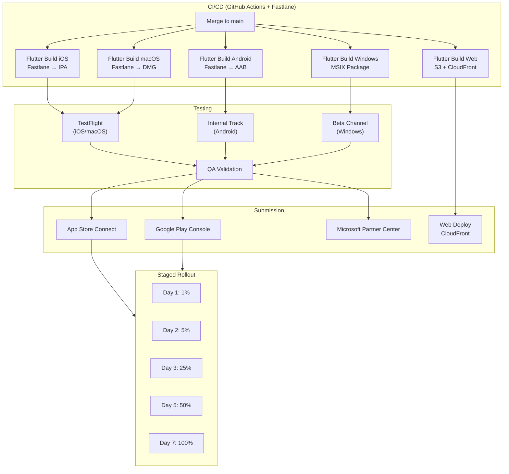
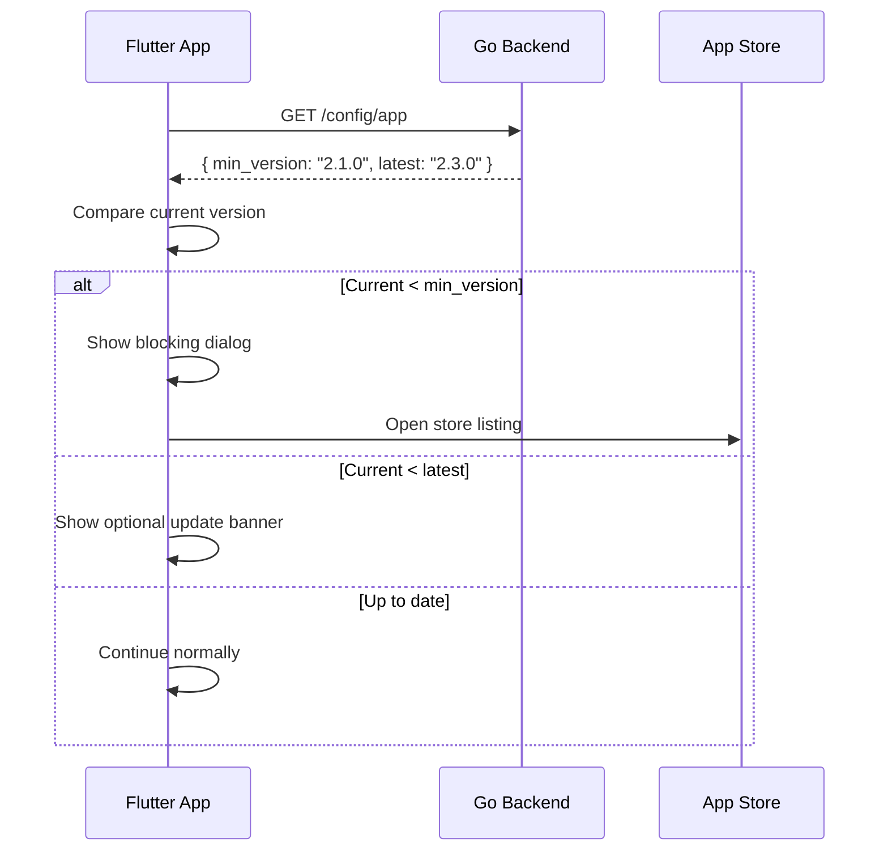
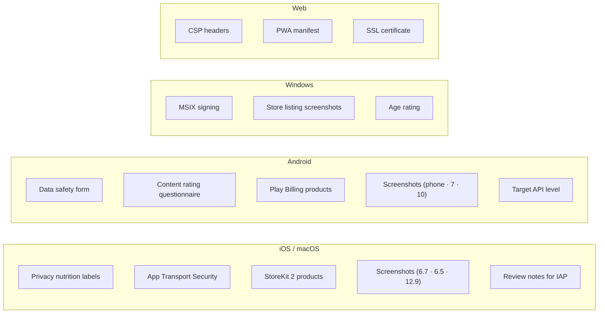

# App Store Submission — Architecture Diagram

> Maps to [01-app-store-submission-playbook.md](01-app-store-submission-playbook.md)

---

## Release Pipeline

---

## Forced Update Mechanism

---

## Platform Submission Checklist

