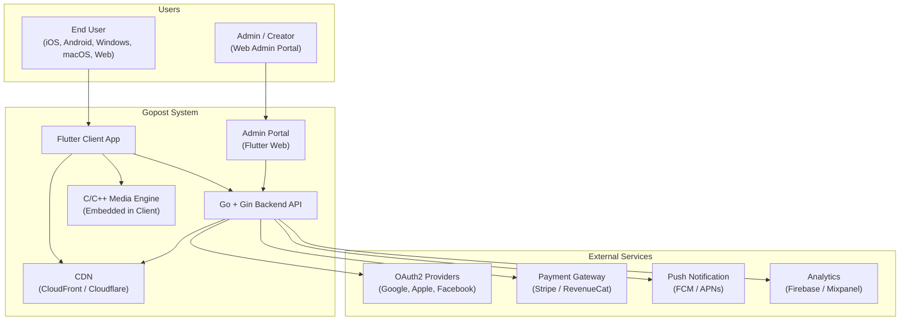
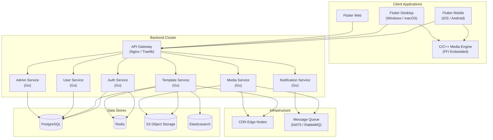
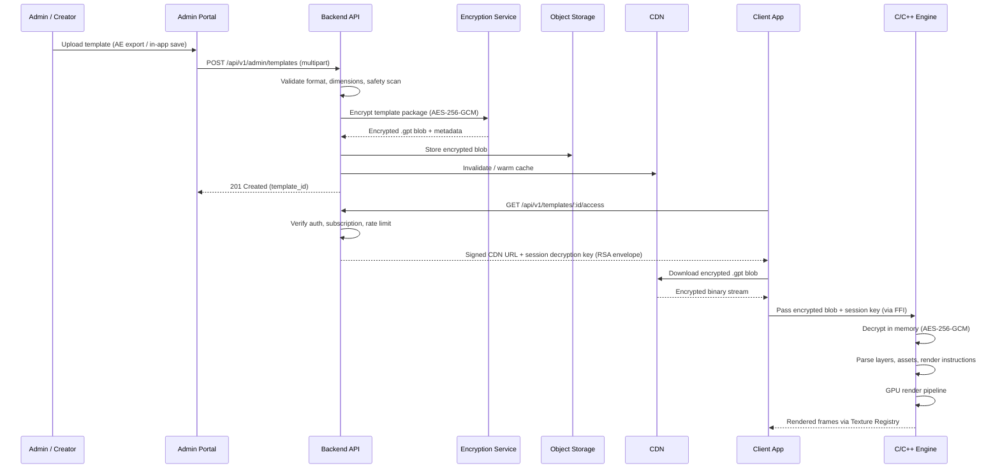
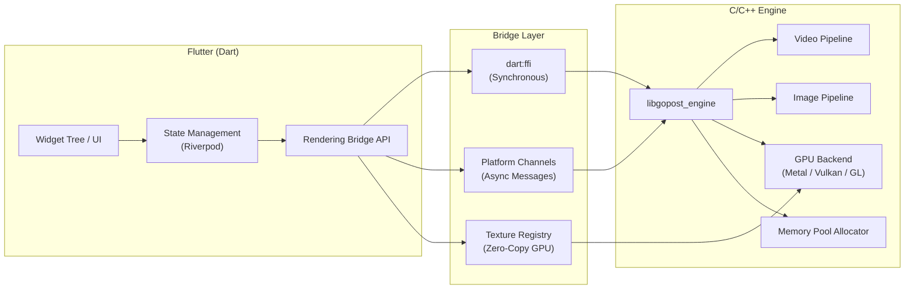

## 2. High-Level System Architecture

### 2.1 System Context Diagram (C4 Level 1)

### 2.2 Container Diagram (C4 Level 2)

### 2.3 Data Flow — Template Lifecycle

### 2.4 Platform Bridge Architecture

---

## Development Sprint Plan

### Sprint Assignment

| Attribute | Value |
|---|---|
| **Phase** | Phase 1: Foundation |
| **Sprint(s)** | Sprint 1 (Weeks 1-2) |
| **Team** | Backend, Frontend, Platform Engineers |
| **Predecessor** | [01-executive-summary.md](01-executive-summary.md) |
| **Successor** | [03-frontend-architecture.md](03-frontend-architecture.md) |
| **Story Points Total** | 35 |

### User Stories

| ID | Story | Acceptance Criteria | Points | Priority | Dependencies |
|---|---|---|---|---|---|
| APP-004 | As a Tech Lead, I want to validate the C4 system context diagram so that all actors and external systems are correctly represented. | - System context diagram reviewed against requirements - All user types (End User, Admin) and external services documented - Diagram sign-off obtained | 2 | P0 | APP-001, APP-002, APP-003 |
| APP-005 | As a Tech Lead, I want to validate the C4 container diagram so that all backend services and data stores are correctly modeled. | - Container diagram reviewed for completeness - API Gateway, Auth, Template, Media, User, Admin, Notification services validated - Diagram sign-off obtained | 2 | P0 | APP-004 |
| APP-006 | As a Platform Engineer, I want to design the template lifecycle data flow so that the end-to-end flow from admin upload to client render is documented. | - Sequence diagram for admin upload flow complete - Sequence diagram for client download and decryption flow complete - Data flow validated with security team | 3 | P0 | APP-004 |
| APP-007 | As a Platform Engineer, I want to design the platform bridge architecture so that Flutter and C++ engine integration is clearly specified. | - Bridge layer (FFI, Platform Channels, Texture Registry) documented - Data flow between Flutter and native engine defined - Architecture diagram approved | 3 | P0 | APP-005 |
| APP-008 | As a Platform Engineer, I want to validate the platform channel vs FFI decision so that the correct interop strategy is chosen per use case. | - Decision matrix for FFI vs Platform Channels documented - Synchronous vs async call patterns defined - Decision documented and approved | 2 | P1 | APP-007 |
| APP-009 | As a Platform Engineer, I want to build a Flutter↔C++ FFI bridge prototype so that we can validate the interop approach. | - Minimal C library with one exported function - Dart FFI bindings generated and invoked successfully - Round-trip call verified on at least one platform | 5 | P0 | APP-007 |
| APP-010 | As a Platform Engineer, I want to implement a texture registry proof-of-concept so that zero-copy GPU texture delivery to Flutter is validated. | - Native texture registered with Flutter texture registry - Texture displayed in Flutter widget tree - No CPU pixel copy in hot path | 5 | P0 | APP-009 |
| APP-011 | As a Backend Engineer, I want to document the system context diagram interactions so that API boundaries are clear. | - All API touchpoints between Flutter app and backend documented - CDN and external service interactions specified - Document reviewed | 2 | P1 | APP-004 |
| APP-012 | As a Tech Lead, I want to obtain sign-off on the system context and container diagrams so that implementation can proceed. | - Stakeholder review completed - All feedback addressed - Formal sign-off documented | 2 | P0 | APP-004, APP-005 |

### Definition of Done

- [ ] All stories in this section marked complete
- [ ] Code reviewed and merged to `develop`
- [ ] Unit tests passing (≥ 90% coverage for new code)
- [ ] Integration tests passing
- [ ] Documentation updated
- [ ] No critical or high-severity bugs open
- [ ] Sprint review demo completed
