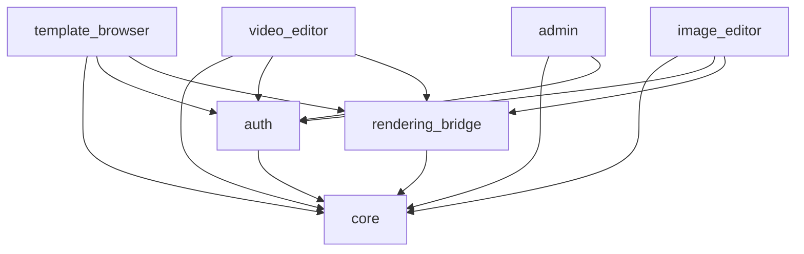

## 3. Frontend Architecture (Flutter)

### 3.1 Project Structure

```
gopost_app/
├── lib/
│   ├── main.dart
│   ├── app.dart
│   ├── core/
│   │   ├── di/                     # Dependency injection (Riverpod providers)
│   │   ├── network/                # HTTP client, interceptors, SSL pinning
│   │   ├── security/               # Secure storage, encryption helpers, integrity checks
│   │   ├── error/                  # Error types, failure handling, crash reporting
│   │   ├── theme/                  # App theme, typography, colors
│   │   ├── utils/                  # Extensions, formatters, validators
│   │   ├── constants/              # API endpoints, feature flags, dimensions
│   │   └── logging/                # Structured logging
│   ├── auth/
│   │   ├── data/
│   │   │   ├── datasources/        # Remote (API) and local (secure storage)
│   │   │   ├── models/             # DTO models (JSON serializable)
│   │   │   └── repositories/       # Repository implementations
│   │   ├── domain/
│   │   │   ├── entities/           # Auth entities (User, Token, Session)
│   │   │   ├── repositories/       # Repository interfaces (abstract)
│   │   │   └── usecases/           # Login, Register, RefreshToken, Logout
│   │   └── presentation/
│   │       ├── providers/          # Riverpod providers
│   │       ├── screens/            # LoginScreen, RegisterScreen, ForgotPasswordScreen
│   │       └── widgets/            # AuthForm, SocialLoginButtons, OTPInput
│   ├── template_browser/
│   │   ├── data/
│   │   ├── domain/
│   │   └── presentation/
│   │       ├── providers/
│   │       ├── screens/            # BrowseScreen, CategoryScreen, TemplateDetailScreen
│   │       └── widgets/            # TemplateCard, PreviewPlayer, FilterBar
│   ├── video_editor/
│   │   ├── data/
│   │   ├── domain/
│   │   │   ├── entities/           # Timeline, Track, Clip, Effect, Transition, Keyframe
│   │   │   └── usecases/           # ApplyEffect, ExportVideo, SaveAsTemplate
│   │   └── presentation/
│   │       ├── providers/
│   │       ├── screens/            # VideoEditorScreen
│   │       └── widgets/            # TimelineWidget, EffectPanel, LayerStack, AudioMixer
│   ├── image_editor/
│   │   ├── data/
│   │   ├── domain/
│   │   │   ├── entities/           # Canvas, Layer, Filter, TextElement, Sticker
│   │   │   └── usecases/           # ApplyFilter, ExportImage, SaveAsTemplate
│   │   └── presentation/
│   │       ├── providers/
│   │       ├── screens/            # ImageEditorScreen
│   │       └── widgets/            # CanvasWidget, LayerPanel, FilterGrid, ToolBar
│   ├── admin/
│   │   ├── data/
│   │   ├── domain/
│   │   └── presentation/
│   │       ├── providers/
│   │       ├── screens/            # DashboardScreen, UploadScreen, ModerationScreen
│   │       └── widgets/            # StatsCard, TemplateReviewCard, UserTable
│   └── rendering_bridge/
│       ├── ffi/                    # FFI bindings (generated via ffigen)
│       ├── channels/               # Platform channel definitions
│       ├── texture/                # Texture registry management
│       └── engine_api.dart         # Unified engine interface
├── native/
│   ├── gopost_engine/              # C/C++ source (see Section 5)
│   └── CMakeLists.txt
├── test/
│   ├── unit/
│   ├── widget/
│   └── integration/
├── ios/
├── android/
├── windows/
├── macos/
├── web/
└── pubspec.yaml
```

### 3.2 Module Dependency Graph



**Rule:** Modules may only depend downward. No circular dependencies. All cross-module communication happens through interfaces defined in `domain/` layers.

### 3.3 State Management (Riverpod)

Riverpod is chosen for its compile-time safety, testability, and provider scoping.

**Provider hierarchy per module:**

```dart
// Example: template_browser/presentation/providers/

// Data source provider
final templateRemoteDataSourceProvider = Provider<TemplateRemoteDataSource>((ref) {
  return TemplateRemoteDataSourceImpl(client: ref.watch(httpClientProvider));
});

// Repository provider
final templateRepositoryProvider = Provider<TemplateRepository>((ref) {
  return TemplateRepositoryImpl(
    remote: ref.watch(templateRemoteDataSourceProvider),
    cache: ref.watch(templateCacheProvider),
  );
});

// Use case provider
final getTemplatesUseCaseProvider = Provider<GetTemplates>((ref) {
  return GetTemplates(repository: ref.watch(templateRepositoryProvider));
});

// State notifier for UI
final templateListProvider =
    StateNotifierProvider<TemplateListNotifier, AsyncValue<List<Template>>>((ref) {
  return TemplateListNotifier(
    getTemplates: ref.watch(getTemplatesUseCaseProvider),
  );
});
```

### 3.4 Navigation (GoRouter)

```dart
final routerProvider = Provider<GoRouter>((ref) {
  final authState = ref.watch(authStateProvider);

  return GoRouter(
    initialLocation: '/',
    redirect: (context, state) {
      final isAuthenticated = authState.isAuthenticated;
      final isAuthRoute = state.matchedLocation.startsWith('/auth');

      if (!isAuthenticated && !isAuthRoute) return '/auth/login';
      if (isAuthenticated && isAuthRoute) return '/';
      return null;
    },
    routes: [
      GoRoute(path: '/auth/login', builder: (_, __) => const LoginScreen()),
      GoRoute(path: '/auth/register', builder: (_, __) => const RegisterScreen()),
      ShellRoute(
        builder: (_, __, child) => MainShell(child: child),
        routes: [
          GoRoute(path: '/', builder: (_, __) => const HomeScreen()),
          GoRoute(path: '/templates', builder: (_, __) => const BrowseScreen()),
          GoRoute(path: '/templates/:id', builder: (_, state) =>
            TemplateDetailScreen(id: state.pathParameters['id']!)),
          GoRoute(path: '/editor/video', builder: (_, __) => const VideoEditorScreen()),
          GoRoute(path: '/editor/image', builder: (_, __) => const ImageEditorScreen()),
          GoRoute(path: '/admin', builder: (_, __) => const AdminDashboardScreen()),
        ],
      ),
    ],
  );
});
```

### 3.5 SOLID Principles Application

| Principle | Application |
|-----------|-------------|
| **Single Responsibility** | Each class has one reason to change. `TemplateRepository` handles data access; `TemplateListNotifier` handles UI state; `EncryptionService` handles crypto. |
| **Open/Closed** | New template types (video, image, audio) extend `BaseTemplate` without modifying existing code. Filter pipelines accept new filters via plugin registration. |
| **Liskov Substitution** | `TemplateRepository` interface is implemented by `TemplateRepositoryImpl` and `MockTemplateRepository` interchangeably. |
| **Interface Segregation** | `Renderable`, `Exportable`, `Editable` are separate interfaces rather than one monolithic `TemplateActions` interface. |
| **Dependency Inversion** | Use cases depend on abstract repository interfaces. Concrete implementations are injected via Riverpod providers. |

### 3.6 Key Flutter Packages

| Package | Purpose | Version Policy |
|---------|---------|----------------|
| `flutter_riverpod` | State management | Latest stable |
| `go_router` | Declarative routing | Latest stable |
| `dio` | HTTP client with interceptors | Latest stable |
| `ffi` / `ffigen` | C/C++ interop | SDK built-in |
| `flutter_secure_storage` | Keychain / Keystore access | Latest stable |
| `freezed` + `json_serializable` | Immutable models + JSON | Latest stable |
| `cached_network_image` | Image caching with placeholders | Latest stable |
| `shimmer` | Loading placeholders | Latest stable |
| `flutter_local_notifications` | Local push display | Latest stable |
| `device_info_plus` | Device fingerprinting | Latest stable |
| `package_info_plus` | App version info | Latest stable |

### 3.7 Rendering Bridge Module (Detail)

The `rendering_bridge` module is the critical interface between Flutter/Dart and the native C/C++ media engine.

```dart
// rendering_bridge/engine_api.dart

abstract class GopostEngine {
  Future<void> initialize();
  Future<void> dispose();

  // Template operations
  Future<TemplateMetadata> loadTemplate(Uint8List encryptedBlob, Uint8List sessionKey);
  Future<void> unloadTemplate(String templateId);

  // Video operations
  Future<int> createVideoTimeline(VideoTimelineConfig config);
  Future<void> addClipToTimeline(int timelineId, ClipDescriptor clip);
  Future<void> applyEffect(int timelineId, int trackId, EffectDescriptor effect);
  Future<void> seekTo(int timelineId, Duration position);
  Stream<RenderFrame> previewStream(int timelineId);
  Future<ExportResult> exportVideo(int timelineId, ExportConfig config);

  // Image operations
  Future<int> createCanvas(CanvasConfig config);
  Future<void> addLayer(int canvasId, LayerDescriptor layer);
  Future<void> applyFilter(int canvasId, int layerId, FilterDescriptor filter);
  Stream<RenderFrame> canvasPreviewStream(int canvasId);
  Future<ExportResult> exportImage(int canvasId, ExportConfig config);

  // GPU info
  Future<GpuCapabilities> queryGpuCapabilities();
}

class GopostEngineImpl implements GopostEngine {
  late final DynamicLibrary _nativeLib;
  late final NativeBindings _bindings;
  // FFI implementation delegates to libgopost_engine
}
```

**Texture delivery (zero-copy):**

```dart
// The engine registers a texture with Flutter's texture registry.
// Flutter renders it directly from GPU memory — no pixel copy.
class EngineTextureController {
  final int textureId;
  final TextureRegistry _registry;

  EngineTextureController(this._registry) :
    textureId = _registry.registerTexture(/* native texture handle */);

  Widget buildPreview() {
    return Texture(textureId: textureId);
  }
}
```

---

## Development Sprint Plan

### Sprint Assignment

| Attribute | Value |
|---|---|
| **Phase** | Phase 1: Foundation |
| **Sprint(s)** | Sprint 1 (Weeks 1-2) |
| **Team** | Flutter Engineers, Platform Engineers |
| **Predecessor** | [02-system-architecture.md](02-system-architecture.md) |
| **Successor** | [04-backend-architecture.md](04-backend-architecture.md) |
| **Story Points Total** | 48 |

### User Stories

| ID | Story | Acceptance Criteria | Points | Priority | Dependencies |
|---|---|---|---|---|---|
| APP-013 | As a Flutter Engineer, I want to scaffold the Flutter project with the module structure so that the codebase follows the defined architecture. | - gopost_app created with lib/, native/, test/ structure<br/>- Feature modules (auth, template_browser, video_editor, image_editor, admin) created<br/>- core/ directory with subdirectories (di, network, security, error, theme, utils, constants, logging) | 3 | P0 | APP-009 |
| APP-014 | As a Flutter Engineer, I want to set up the Riverpod provider hierarchy so that state management is consistent across modules. | - flutter_riverpod added and configured<br/>- Provider scope established at app root<br/>- Example provider hierarchy documented per module | 3 | P0 | APP-013 |
| APP-015 | As a Flutter Engineer, I want to configure GoRouter with the navigation shell so that routing and auth-based redirects work. | - go_router integrated with Riverpod<br/>- ShellRoute with MainShell for authenticated routes<br/>- Auth redirect logic (unauthenticated → /auth/login) implemented | 3 | P0 | APP-014 |
| APP-016 | As a Flutter Engineer, I want to implement the core module (di, network, security, error, theme, utils, constants, logging) so that shared functionality is centralized. | - DI providers for HTTP client, config<br/>- Network module with Dio base setup<br/>- Theme, constants, utils, logging modules implemented<br/>- Error types and failure handling in place | 5 | P0 | APP-014 |
| APP-017 | As a Flutter Engineer, I want to create the rendering bridge module skeleton so that the engine interface is defined. | - rendering_bridge/ module with ffi/, channels/, texture/ subdirs<br/>- engine_api.dart with GopostEngine abstract interface<br/>- Stub implementation returning unimplemented | 3 | P0 | APP-010 |
| APP-018 | As a Platform Engineer, I want to generate FFI bindings via ffigen so that Dart can call the C engine API. | - ffigen configured in pubspec.yaml<br/>- Bindings generated for engine.h, types.h, error.h<br/>- Bindings compile and load on at least one platform | 5 | P0 | APP-009, APP-017 |
| APP-019 | As a Flutter Engineer, I want to integrate the texture registry with the rendering bridge so that GPU textures can be displayed in Flutter. | - EngineTextureController implemented<br/>- Texture registration and disposal working<br/>- Texture widget displays native texture | 5 | P0 | APP-010, APP-017 |
| APP-020 | As a Flutter Engineer, I want to enforce module dependency rules (no circular deps) so that the architecture remains maintainable. | - Dependency graph validated (core ← feature modules ← rendering_bridge)<br/>- custom_lint or analyzer rule to prevent circular imports<br/>- CI check for dependency violations | 3 | P1 | APP-013 |
| APP-021 | As a Flutter Engineer, I want to enforce SOLID principles per module so that each module has clear responsibilities. | - Single Responsibility: each class has one reason to change<br/>- Dependency Inversion: use cases depend on repository interfaces<br/>- Documented SOLID checklist for code review | 2 | P1 | APP-013 |
| APP-022 | As a Flutter Engineer, I want to integrate key Flutter packages (dio, freezed, cached_network_image, etc.) so that the app has required dependencies. | - dio, freezed, json_serializable, cached_network_image, shimmer, flutter_secure_storage, device_info_plus, package_info_plus added<br/>- Version policy documented in pubspec<br/>- No conflicting versions | 2 | P0 | APP-016 |
| APP-023 | As a Platform Engineer, I want to define platform channel contracts so that async native communication is specified. | - Channel names and method signatures documented<br/>- Message format (JSON) defined<br/>- Error handling contract specified | 2 | P1 | APP-017 |
| APP-024 | As a Flutter Engineer, I want to set up Dart unit test scaffolding so that tests can be written consistently. | - test/unit/, test/widget/, test/integration/ structure<br/>- Mockito or mocktail configured<br/>- Example unit test for one provider | 3 | P1 | APP-014 |
| APP-025 | As a Flutter Engineer, I want to implement the security module skeleton (secure storage strategy) so that sensitive data handling is prepared. | - flutter_secure_storage wrapper in core/security<br/>- Storage strategy documented (tokens, keys, preferences)<br/>- Interface for IntegrityChecker defined | 3 | P0 | APP-016 |

### Definition of Done

- [ ] All stories in this section marked complete
- [ ] Code reviewed and merged to `develop`
- [ ] Unit tests passing (≥ 90% coverage for new code)
- [ ] Integration tests passing
- [ ] Documentation updated
- [ ] No critical or high-severity bugs open
- [ ] Sprint review demo completed
