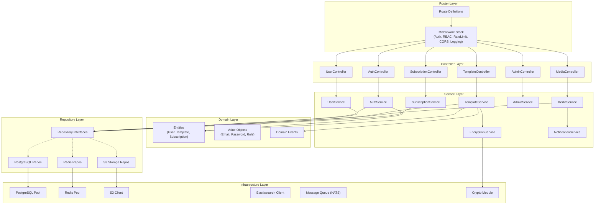

## 4. Backend Architecture (Go + Gin)

### 4.1 Project Structure

```
gopost-backend/
├── cmd/
│   └── server/
│       └── main.go                 # Entry point, DI wiring, graceful shutdown
├── internal/
│   ├── config/
│   │   └── config.go               # Env-based configuration (Viper)
│   ├── router/
│   │   ├── router.go               # Route registration
│   │   └── middleware/
│   │       ├── auth.go             # JWT validation middleware
│   │       ├── rbac.go             # Role-based access control
│   │       ├── ratelimit.go        # Token bucket rate limiter
│   │       ├── cors.go             # CORS configuration
│   │       ├── logging.go          # Request/response logging
│   │       └── recovery.go         # Panic recovery
│   ├── controller/
│   │   ├── auth_controller.go
│   │   ├── user_controller.go
│   │   ├── template_controller.go
│   │   ├── media_controller.go
│   │   ├── admin_controller.go
│   │   └── subscription_controller.go
│   ├── service/
│   │   ├── auth_service.go
│   │   ├── user_service.go
│   │   ├── template_service.go
│   │   ├── media_service.go
│   │   ├── admin_service.go
│   │   ├── subscription_service.go
│   │   ├── encryption_service.go
│   │   └── notification_service.go
│   ├── domain/
│   │   ├── entity/
│   │   │   ├── user.go
│   │   │   ├── template.go
│   │   │   ├── subscription.go
│   │   │   └── audit.go
│   │   ├── valueobject/
│   │   │   ├── email.go
│   │   │   ├── password.go
│   │   │   └── role.go
│   │   └── event/
│   │       ├── template_events.go
│   │       └── user_events.go
│   ├── repository/
│   │   ├── interfaces.go           # All repository interfaces
│   │   ├── postgres/
│   │   │   ├── user_repo.go
│   │   │   ├── template_repo.go
│   │   │   └── subscription_repo.go
│   │   ├── redis/
│   │   │   ├── session_repo.go
│   │   │   └── cache_repo.go
│   │   └── s3/
│   │       └── storage_repo.go
│   └── infrastructure/
│       ├── database/
│       │   ├── postgres.go         # Connection pool setup
│       │   └── migrations/         # SQL migration files
│       ├── cache/
│       │   └── redis.go            # Redis client setup
│       ├── storage/
│       │   └── s3.go               # S3 client setup
│       ├── search/
│       │   └── elasticsearch.go    # ES client setup
│       ├── messaging/
│       │   └── nats.go             # Message queue client
│       └── crypto/
│           ├── aes.go              # AES-256-GCM encrypt/decrypt
│           ├── rsa.go              # RSA key management
│           └── signing.go          # Template package signing
├── pkg/
│   ├── jwt/
│   │   └── jwt.go                  # JWT generation and validation
│   ├── validator/
│   │   └── validator.go            # Request validation helpers
│   ├── response/
│   │   └── response.go             # Standardized API response format
│   └── logger/
│       └── logger.go               # Structured logging (zerolog)
├── migrations/
│   ├── 000001_create_users.up.sql
│   ├── 000001_create_users.down.sql
│   └── ...
├── Dockerfile
├── docker-compose.yml
├── Makefile
├── go.mod
└── go.sum
```

### 4.2 Layer Architecture Diagram



### 4.3 Dependency Injection

Go does not have a DI framework by convention. We use **constructor injection** via a central wiring function:

```go
// cmd/server/main.go

func main() {
    cfg := config.Load()

    // Infrastructure
    db := database.NewPostgresPool(cfg.Database)
    redis := cache.NewRedisClient(cfg.Redis)
    s3 := storage.NewS3Client(cfg.S3)
    es := search.NewESClient(cfg.Elasticsearch)

    // Repositories
    userRepo := postgres.NewUserRepository(db)
    templateRepo := postgres.NewTemplateRepository(db)
    sessionRepo := redisrepo.NewSessionRepository(redis)
    storageRepo := s3repo.NewStorageRepository(s3)

    // Services
    cryptoSvc := crypto.NewEncryptionService(cfg.Crypto)
    authSvc := service.NewAuthService(userRepo, sessionRepo, cfg.JWT)
    userSvc := service.NewUserService(userRepo)
    templateSvc := service.NewTemplateService(templateRepo, storageRepo, cryptoSvc, es)
    mediaSvc := service.NewMediaService(storageRepo)
    adminSvc := service.NewAdminService(templateRepo, userRepo)
    subSvc := service.NewSubscriptionService(userRepo)

    // Controllers
    authCtrl := controller.NewAuthController(authSvc)
    userCtrl := controller.NewUserController(userSvc)
    templateCtrl := controller.NewTemplateController(templateSvc)
    mediaCtrl := controller.NewMediaController(mediaSvc)
    adminCtrl := controller.NewAdminController(adminSvc)
    subCtrl := controller.NewSubscriptionController(subSvc)

    // Router
    r := router.Setup(cfg, authCtrl, userCtrl, templateCtrl, mediaCtrl, adminCtrl, subCtrl)

    // Graceful shutdown
    srv := &http.Server{Addr: cfg.Server.Addr, Handler: r}
    go func() { srv.ListenAndServe() }()

    quit := make(chan os.Signal, 1)
    signal.Notify(quit, syscall.SIGINT, syscall.SIGTERM)
    <-quit

    ctx, cancel := context.WithTimeout(context.Background(), 10*time.Second)
    defer cancel()
    srv.Shutdown(ctx)
}
```

### 4.4 Interface-Driven Repository Design

```go
// repository/interfaces.go

type UserRepository interface {
    Create(ctx context.Context, user *entity.User) error
    GetByID(ctx context.Context, id uuid.UUID) (*entity.User, error)
    GetByEmail(ctx context.Context, email string) (*entity.User, error)
    Update(ctx context.Context, user *entity.User) error
    Delete(ctx context.Context, id uuid.UUID) error
    List(ctx context.Context, filter UserFilter, page Pagination) ([]*entity.User, int64, error)
}

type TemplateRepository interface {
    Create(ctx context.Context, tmpl *entity.Template) error
    GetByID(ctx context.Context, id uuid.UUID) (*entity.Template, error)
    Update(ctx context.Context, tmpl *entity.Template) error
    Delete(ctx context.Context, id uuid.UUID) error
    List(ctx context.Context, filter TemplateFilter, page Pagination) ([]*entity.Template, int64, error)
    ListByCategory(ctx context.Context, categoryID uuid.UUID, page Pagination) ([]*entity.Template, int64, error)
    IncrementUsageCount(ctx context.Context, id uuid.UUID) error
}

type StorageRepository interface {
    Upload(ctx context.Context, key string, data io.Reader, contentType string) (string, error)
    Download(ctx context.Context, key string) (io.ReadCloser, error)
    Delete(ctx context.Context, key string) error
    GenerateSignedURL(ctx context.Context, key string, expiry time.Duration) (string, error)
}

type SessionRepository interface {
    Set(ctx context.Context, sessionID string, data []byte, ttl time.Duration) error
    Get(ctx context.Context, sessionID string) ([]byte, error)
    Delete(ctx context.Context, sessionID string) error
    Exists(ctx context.Context, sessionID string) (bool, error)
}

type CacheRepository interface {
    Set(ctx context.Context, key string, value interface{}, ttl time.Duration) error
    Get(ctx context.Context, key string, dest interface{}) error
    Delete(ctx context.Context, key string) error
    Invalidate(ctx context.Context, pattern string) error
}
```

### 4.5 Authentication and Authorization

**JWT structure:**

```go
type TokenClaims struct {
    UserID uuid.UUID `json:"uid"`
    Role   string    `json:"role"`
    jwt.RegisteredClaims
}
```

| Token Type     | Expiry   | Storage        | Rotation                |
| -------------- | -------- | -------------- | ----------------------- |
| Access Token   | 15 min   | Client memory  | Re-issued on refresh    |
| Refresh Token  | 7 days   | Redis + Secure Storage | Rotated on each use |

**RBAC roles:**

| Role      | Capabilities |
| --------- | ------------ |
| `user`    | Browse templates, use editors, manage own profile, subscribe |
| `creator` | All `user` + create/publish templates via in-app editor |
| `admin`   | All `creator` + upload external templates, manage users, moderate content, access analytics |

**Middleware chain:**

```
Request -> CORS -> RateLimit -> Logging -> Auth(JWT) -> RBAC(role check) -> Controller
```

### 4.6 Rate Limiting

Token-bucket algorithm implemented with Redis:

| Endpoint Category | Requests/min (authenticated) | Requests/min (anonymous) |
| ----------------- | ---------------------------- | ------------------------ |
| Auth endpoints    | 10                           | 5                        |
| Template browsing | 120                          | 30                       |
| Template access   | 60                           | N/A                      |
| Media upload      | 20                           | N/A                      |
| Admin endpoints   | 300                          | N/A                      |

### 4.7 Standardized API Response

```go
// pkg/response/response.go

type APIResponse struct {
    Success bool        `json:"success"`
    Data    interface{} `json:"data,omitempty"`
    Error   *APIError   `json:"error,omitempty"`
    Meta    *Meta       `json:"meta,omitempty"`
}

type APIError struct {
    Code    string `json:"code"`
    Message string `json:"message"`
    Details []FieldError `json:"details,omitempty"`
}

type Meta struct {
    Page       int   `json:"page"`
    PerPage    int   `json:"per_page"`
    Total      int64 `json:"total"`
    TotalPages int   `json:"total_pages"`
}
```

---

## Development Sprint Plan

### Sprint Assignment

| Attribute | Value |
|---|---|
| **Phase** | Phase 1: Foundation |
| **Sprint(s)** | Sprint 1-2 (Weeks 1-4) |
| **Team** | Backend Engineers, DevOps |
| **Predecessor** | [03-frontend-architecture.md](03-frontend-architecture.md) |
| **Successor** | [05-media-processing-engine.md](05-media-processing-engine.md) |
| **Story Points Total** | 58 |

### User Stories

| ID | Story | Acceptance Criteria | Points | Priority | Dependencies |
|---|---|---|---|---|---|
| APP-026 | As a Backend Engineer, I want to scaffold the Go project with clean architecture so that the codebase is organized from the start. | - gopost-backend created with cmd/, internal/, pkg/, migrations/<br/>- internal/ has config, router, controller, service, domain, repository, infrastructure<br/>- go.mod initialized with Go 1.22+ | 3 | P0 | APP-012 |
| APP-027 | As a Backend Engineer, I want to implement cmd/server/main.go with DI wiring so that the application can start with all dependencies injected. | - main.go loads config and wires all layers<br/>- Constructor injection for repos, services, controllers<br/>- Server starts and responds to health check | 3 | P0 | APP-026 |
| APP-028 | As a Backend Engineer, I want to implement the config module with Viper env-based loading so that configuration is externalized. | - config.go loads from env vars and .env file<br/>- Database, Redis, S3, JWT, server config structs<br/>- Validation of required config on startup | 2 | P0 | APP-026 |
| APP-029 | As a Backend Engineer, I want to set up the router with the middleware chain so that all requests flow through the correct pipeline. | - Gin router configured with route groups<br/>- Middleware order: CORS → RateLimit → Logging → Auth → RBAC → Controller<br/>- Health and readiness endpoints | 3 | P0 | APP-027 |
| APP-030 | As a Backend Engineer, I want to implement auth middleware (JWT validation) so that protected routes require valid tokens. | - AuthMiddleware validates Bearer token<br/>- Claims (user_id, role) extracted and set in context<br/>- 401 returned for missing or invalid token | 3 | P0 | APP-029 |
| APP-031 | As a Backend Engineer, I want to implement RBAC middleware so that role-based access control is enforced. | - RequireRole(roles...) middleware implemented<br/>- Role checked against context user_role<br/>- 403 returned for insufficient permissions | 2 | P0 | APP-030 |
| APP-032 | As a Backend Engineer, I want to implement rate limiting middleware (Redis token bucket) so that API abuse is prevented. | - Token bucket algorithm with Redis backend<br/>- Per-endpoint limits (auth: 10/min, templates: 120/min, etc.)<br/>- 429 returned when limit exceeded | 5 | P0 | APP-029 |
| APP-033 | As a Backend Engineer, I want to implement CORS and logging middleware so that cross-origin requests and request logging work. | - CORS middleware allows configured origins<br/>- Logging middleware logs request/response with zerolog<br/>- Recovery middleware catches panics and returns 500 | 2 | P0 | APP-029 |
| APP-034 | As a Backend Engineer, I want to define controller/service/repository layer interfaces so that the domain is decoupled. | - Repository interfaces in repository/interfaces.go<br/>- UserRepository, TemplateRepository, StorageRepository, SessionRepository, CacheRepository<br/>- Service interfaces where needed | 3 | P0 | APP-026 |
| APP-035 | As a Backend Engineer, I want to set up PostgreSQL connection pool so that database access is efficient. | - pgxpool configured with min/max connections<br/>- Migrations run on startup or via Makefile<br/>- Connection health check in readiness probe | 3 | P0 | APP-028 |
| APP-036 | As a Backend Engineer, I want to set up Redis client so that caching and rate limiting work. | - Redis client configured with connection string<br/>- Ping on startup<br/>- Client available for session and cache repos | 2 | P0 | APP-028 |
| APP-037 | As a Backend Engineer, I want to set up S3 client so that object storage is available. | - S3-compatible client (MinIO/AWS) configured<br/>- Bucket creation or validation on startup<br/>- Upload, download, signed URL methods | 3 | P0 | APP-028 |
| APP-038 | As a Backend Engineer, I want to set up Elasticsearch client so that template search is available. | - Elasticsearch client configured<br/>- Index creation/validation<br/>- Client available for template service | 3 | P1 | APP-028 |
| APP-039 | As a Backend Engineer, I want to implement standardized API response format so that clients receive consistent responses. | - APIResponse struct with success, data, error, meta<br/>- Helper functions for success/error responses<br/>- Used in at least one controller | 2 | P0 | APP-027 |
| APP-040 | As a Backend Engineer, I want to implement graceful shutdown so that in-flight requests complete before exit. | - Signal handler for SIGINT, SIGTERM<br/>- Server.Shutdown with context timeout (10s)<br/>- DB and Redis connections closed | 3 | P0 | APP-027 |
| APP-041 | As a Backend Engineer, I want to implement PostgreSQL repository implementations so that user and template data can be persisted. | - UserRepository and TemplateRepository implementations<br/>- CRUD operations with pgx<br/>- Pagination support where required | 5 | P0 | APP-034, APP-035 |
| APP-042 | As a Backend Engineer, I want to implement Redis and S3 repository implementations so that sessions and storage work. | - SessionRepository (Redis) for session storage<br/>- StorageRepository (S3) for upload/download<br/>- CacheRepository (Redis) for template metadata cache | 5 | P0 | APP-036, APP-037 |

### Definition of Done

- [ ] All stories in this section marked complete
- [ ] Code reviewed and merged to `develop`
- [ ] Unit tests passing (≥ 90% coverage for new code)
- [ ] Integration tests passing
- [ ] Documentation updated
- [ ] No critical or high-severity bugs open
- [ ] Sprint review demo completed
