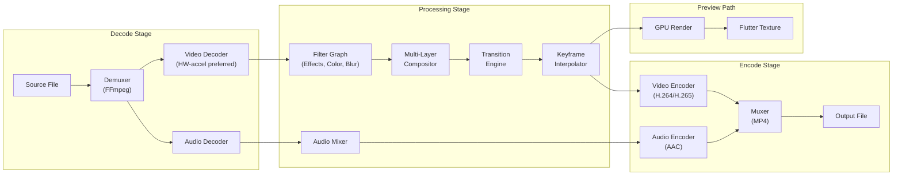
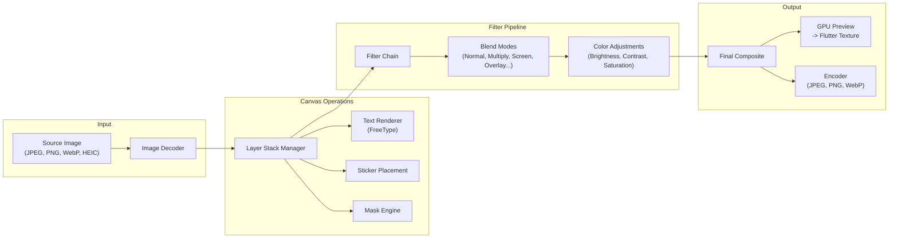

## 5. Media Processing Engine (C/C++)

### 5.1 Engine Architecture

```
native/gopost_engine/
├── CMakeLists.txt                  # Cross-platform build system
├── include/
│   └── gopost/
│       ├── engine.h                # Public C API (FFI-compatible)
│       ├── types.h                 # Shared type definitions
│       ├── error.h                 # Error codes
│       └── version.h               # Version info
├── src/
│   ├── core/
│   │   ├── engine.cpp              # Engine lifecycle
│   │   ├── allocator.cpp           # Custom memory pool allocator
│   │   ├── thread_pool.cpp         # Worker thread pool
│   │   └── logger.cpp              # Native logging bridge
│   ├── crypto/
│   │   ├── aes_gcm.cpp             # AES-256-GCM decryption
│   │   ├── rsa.cpp                 # RSA key unwrapping
│   │   └── secure_memory.cpp       # mlock, guard pages, zeroing
│   ├── video/
│   │   ├── decoder.cpp             # FFmpeg-based decoder
│   │   ├── encoder.cpp             # FFmpeg-based encoder
│   │   ├── timeline.cpp            # Multi-track timeline logic
│   │   ├── compositor.cpp          # Layer composition
│   │   ├── effects/
│   │   │   ├── effect_registry.cpp
│   │   │   ├── color_effects.cpp
│   │   │   ├── blur_effects.cpp
│   │   │   ├── transition_effects.cpp
│   │   │   └── keyframe_interpolator.cpp
│   │   └── audio/
│   │       ├── mixer.cpp
│   │       └── audio_effects.cpp
│   ├── image/
│   │   ├── decoder.cpp             # Image format decoders (JPEG, PNG, WebP, HEIC)
│   │   ├── encoder.cpp             # Image format encoders
│   │   ├── canvas.cpp              # Multi-layer canvas
│   │   ├── compositor.cpp          # Layer blending modes
│   │   ├── filters/
│   │   │   ├── filter_registry.cpp
│   │   │   ├── color_filters.cpp
│   │   │   ├── blur_filters.cpp
│   │   │   └── artistic_filters.cpp
│   │   └── text/
│   │       └── text_renderer.cpp   # FreeType-based text rendering
│   ├── gpu/
│   │   ├── gpu_context.cpp         # Abstract GPU context
│   │   ├── metal/                  # Metal backend (iOS/macOS)
│   │   │   ├── metal_context.mm
│   │   │   ├── metal_pipeline.mm
│   │   │   └── metal_shaders.metal
│   │   ├── vulkan/                 # Vulkan backend (Android/Windows)
│   │   │   ├── vulkan_context.cpp
│   │   │   ├── vulkan_pipeline.cpp
│   │   │   └── shaders/
│   │   ├── gles/                   # OpenGL ES fallback
│   │   │   ├── gles_context.cpp
│   │   │   └── gles_pipeline.cpp
│   │   └── webgl/                  # WebGL via Emscripten (Web)
│   │       └── webgl_context.cpp
│   └── template/
│       ├── template_parser.cpp     # .gpt format parser
│       ├── template_renderer.cpp   # Render instruction executor
│       └── asset_resolver.cpp      # Resolve encrypted asset references
├── third_party/
│   ├── ffmpeg/                     # FFmpeg libs (pre-built per platform)
│   ├── openssl/                    # OpenSSL (crypto)
│   ├── freetype/                   # Text rendering
│   └── stb/                        # stb_image for lightweight decode
└── tests/
    ├── test_allocator.cpp
    ├── test_crypto.cpp
    ├── test_video_pipeline.cpp
    ├── test_image_pipeline.cpp
    └── test_template_parser.cpp
```

### 5.2 Public C API (FFI Boundary)

All Dart FFI calls go through a flat C API with opaque handles:

```c
// include/gopost/engine.h

#ifndef GOPOST_ENGINE_H
#define GOPOST_ENGINE_H

#include "gopost/types.h"
#include "gopost/error.h"

#ifdef __cplusplus
extern "C" {
#endif

// Engine lifecycle
GP_EXPORT GpError gp_engine_init(const GpEngineConfig* config, GpEngine** out_engine);
GP_EXPORT void    gp_engine_destroy(GpEngine* engine);
GP_EXPORT GpError gp_engine_query_gpu(GpEngine* engine, GpGpuInfo* out_info);

// Template operations
GP_EXPORT GpError gp_template_load(
    GpEngine* engine,
    const uint8_t* encrypted_data, size_t data_len,
    const uint8_t* session_key, size_t key_len,
    GpTemplate** out_template
);
GP_EXPORT void    gp_template_unload(GpTemplate* tmpl);
GP_EXPORT GpError gp_template_get_metadata(GpTemplate* tmpl, GpTemplateMetadata* out_meta);

// Video timeline
GP_EXPORT GpError gp_timeline_create(GpEngine* engine, const GpTimelineConfig* config,
                                      GpTimeline** out_timeline);
GP_EXPORT void    gp_timeline_destroy(GpTimeline* timeline);
GP_EXPORT GpError gp_timeline_add_clip(GpTimeline* timeline, const GpClipDescriptor* clip);
GP_EXPORT GpError gp_timeline_remove_clip(GpTimeline* timeline, int32_t clip_id);
GP_EXPORT GpError gp_timeline_apply_effect(GpTimeline* timeline, int32_t track_id,
                                            const GpEffectDescriptor* effect);
GP_EXPORT GpError gp_timeline_seek(GpTimeline* timeline, int64_t position_us);
GP_EXPORT GpError gp_timeline_render_frame(GpTimeline* timeline, GpFrame** out_frame);
GP_EXPORT GpError gp_timeline_export(GpTimeline* timeline, const GpExportConfig* config,
                                      GpExportCallback callback, void* user_data);

// Image canvas
GP_EXPORT GpError gp_canvas_create(GpEngine* engine, const GpCanvasConfig* config,
                                    GpCanvas** out_canvas);
GP_EXPORT void    gp_canvas_destroy(GpCanvas* canvas);
GP_EXPORT GpError gp_canvas_add_layer(GpCanvas* canvas, const GpLayerDescriptor* layer);
GP_EXPORT GpError gp_canvas_apply_filter(GpCanvas* canvas, int32_t layer_id,
                                          const GpFilterDescriptor* filter);
GP_EXPORT GpError gp_canvas_render(GpCanvas* canvas, GpFrame** out_frame);
GP_EXPORT GpError gp_canvas_export(GpCanvas* canvas, const GpExportConfig* config);

// Frame management
GP_EXPORT void    gp_frame_release(GpFrame* frame);
GP_EXPORT GpError gp_frame_get_texture_handle(GpFrame* frame, void** out_handle);

#ifdef __cplusplus
}
#endif

#endif // GOPOST_ENGINE_H
```

### 5.3 Video Processing Pipeline



### 5.4 Image Processing Pipeline



### 5.5 Memory Management

**Pool allocator design:**

```cpp
// Simplified pool allocator for frame buffers
class FramePoolAllocator {
public:
    explicit FramePoolAllocator(size_t frame_size, size_t pool_count)
        : frame_size_(frame_size), pool_count_(pool_count) {
        pool_ = static_cast<uint8_t*>(std::aligned_alloc(64, frame_size * pool_count));
        mlock(pool_, frame_size * pool_count);  // prevent swap
        for (size_t i = 0; i < pool_count; ++i) {
            free_list_.push(pool_ + i * frame_size);
        }
    }

    ~FramePoolAllocator() {
        munlock(pool_, frame_size_ * pool_count_);
        explicit_bzero(pool_, frame_size_ * pool_count_);  // zero before free
        std::free(pool_);
    }

    uint8_t* acquire() {
        std::lock_guard<std::mutex> lock(mutex_);
        if (free_list_.empty()) return nullptr;
        auto* ptr = free_list_.front();
        free_list_.pop();
        return ptr;
    }

    void release(uint8_t* ptr) {
        std::lock_guard<std::mutex> lock(mutex_);
        explicit_bzero(ptr, frame_size_);  // zero sensitive data
        free_list_.push(ptr);
    }

private:
    uint8_t* pool_;
    size_t frame_size_;
    size_t pool_count_;
    std::queue<uint8_t*> free_list_;
    std::mutex mutex_;
};
```

**Memory budget targets:**

| Platform       | Max Engine Memory | Frame Pool Size | Texture Cache |
| -------------- | ----------------- | --------------- | ------------- |
| iOS / Android  | 384 MB            | 128 MB          | 64 MB         |
| Desktop        | 1 GB              | 512 MB          | 256 MB        |
| Web (WASM)     | 256 MB            | 64 MB           | 32 MB         |

### 5.6 GPU Backend Abstraction

```cpp
// Abstract GPU context — each platform implements this interface
class IGpuContext {
public:
    virtual ~IGpuContext() = default;

    virtual bool initialize() = 0;
    virtual void shutdown() = 0;

    virtual GpuTextureHandle createTexture(int width, int height, PixelFormat format) = 0;
    virtual void destroyTexture(GpuTextureHandle handle) = 0;
    virtual void uploadToTexture(GpuTextureHandle handle, const uint8_t* data, size_t size) = 0;

    virtual GpuPipelineHandle createPipeline(const ShaderProgram& program) = 0;
    virtual void bindPipeline(GpuPipelineHandle handle) = 0;
    virtual void dispatch(int width, int height) = 0;

    virtual void* getNativeTextureHandle(GpuTextureHandle handle) = 0;

    static std::unique_ptr<IGpuContext> createForPlatform();
};
```

**Platform mapping:**

| Platform          | Primary GPU API | Fallback      |
| ----------------- | --------------- | ------------- |
| iOS / macOS       | Metal           | OpenGL ES 3.0 |
| Android           | Vulkan 1.1      | OpenGL ES 3.0 |
| Windows           | Vulkan 1.1      | OpenGL 4.5    |
| Web               | WebGL 2.0       | Software (Canvas 2D) |

### 5.7 Cross-Platform Build (CMake)

```cmake
cmake_minimum_required(VERSION 3.20)
project(gopost_engine VERSION 1.0.0 LANGUAGES C CXX)

set(CMAKE_CXX_STANDARD 20)
set(CMAKE_C_STANDARD 17)

option(GP_ENABLE_METAL "Enable Metal GPU backend" OFF)
option(GP_ENABLE_VULKAN "Enable Vulkan GPU backend" OFF)
option(GP_ENABLE_GLES "Enable OpenGL ES GPU backend" OFF)
option(GP_ENABLE_WEBGL "Enable WebGL GPU backend (Emscripten)" OFF)

# Platform detection
if(APPLE)
    set(GP_ENABLE_METAL ON)
    if(IOS)
        set(GP_PLATFORM "ios")
    else()
        set(GP_PLATFORM "macos")
    endif()
elseif(ANDROID)
    set(GP_ENABLE_VULKAN ON)
    set(GP_ENABLE_GLES ON)
    set(GP_PLATFORM "android")
elseif(WIN32)
    set(GP_ENABLE_VULKAN ON)
    set(GP_PLATFORM "windows")
elseif(EMSCRIPTEN)
    set(GP_ENABLE_WEBGL ON)
    set(GP_PLATFORM "web")
endif()

file(GLOB_RECURSE ENGINE_SOURCES "src/*.cpp" "src/*.c")

if(GP_ENABLE_METAL)
    file(GLOB_RECURSE METAL_SOURCES "src/gpu/metal/*.mm" "src/gpu/metal/*.metal")
    list(APPEND ENGINE_SOURCES ${METAL_SOURCES})
endif()

add_library(gopost_engine SHARED ${ENGINE_SOURCES})

target_include_directories(gopost_engine PUBLIC include)

# Link third-party libs (FFmpeg, OpenSSL, FreeType)
target_link_libraries(gopost_engine PRIVATE
    ffmpeg::avcodec ffmpeg::avformat ffmpeg::avutil ffmpeg::swscale ffmpeg::swresample
    OpenSSL::SSL OpenSSL::Crypto
    freetype
)
```

---

## Development Sprint Plan

### Sprint Assignment

| Attribute | Value |
|---|---|
| **Phase** | Phase 3-4: Image & Video Editor |
| **Sprint(s)** | Sprint 5-8 (Weeks 9-16) |
| **Team** | Platform Engineers, C++ Engineers |
| **Predecessor** | [04-backend-architecture.md](04-backend-architecture.md) |
| **Successor** | [06-secure-template-system.md](06-secure-template-system.md) |
| **Story Points Total** | 88 |

### User Stories

| ID | Story | Acceptance Criteria | Points | Priority | Dependencies |
|---|---|---|---|---|---|
| APP-043 | As a Platform Engineer, I want to set up the engine directory structure so that the C/C++ codebase is organized. | - native/gopost_engine/ with include/, src/, third_party/, tests/<br/>- src/ has core, crypto, video, image, gpu, template subdirs<br/>- CMakeLists.txt at root | 3 | P0 | APP-018 |
| APP-044 | As a Platform Engineer, I want to define the public C API header (engine.h, types.h, error.h) so that the FFI boundary is stable. | - engine.h with extern "C" declarations<br/>- types.h with GpEngine, GpTimeline, GpCanvas, etc.<br/>- error.h with GpError codes | 5 | P0 | APP-043 |
| APP-045 | As a Platform Engineer, I want to implement engine lifecycle (init/destroy) so that the engine can be initialized and cleaned up. | - gp_engine_init and gp_engine_destroy implemented<br/>- Config struct passed to init<br/>- All resources released on destroy | 3 | P0 | APP-044 |
| APP-046 | As a Platform Engineer, I want to implement the GPU context factory (Metal/Vulkan/GLES) so that platform-specific GPU backends are available. | - IGpuContext interface and createForPlatform() factory<br/>- Metal backend for iOS/macOS<br/>- Vulkan backend for Android/Windows<br/>- GLES fallback | 8 | P0 | APP-045 |
| APP-047 | As a Platform Engineer, I want to implement the video decoder (FFmpeg + HW accel) so that video files can be decoded. | - FFmpeg demuxer and video decoder<br/>- Hardware acceleration (VideoToolbox, MediaCodec, VAAPI) where available<br/>- Frame output to pipeline | 8 | P0 | APP-045 |
| APP-048 | As a Platform Engineer, I want to implement the video encoder (FFmpeg + HW encode) so that video can be exported. | - FFmpeg video encoder (H.264/H.265)<br/>- Hardware encoding where available<br/>- Muxer for MP4 output | 8 | P0 | APP-047 |
| APP-049 | As a Platform Engineer, I want to implement image decoder and encoder so that image formats are supported. | - Decoder for JPEG, PNG, WebP, HEIC<br/>- Encoder for JPEG, PNG, WebP<br/>- Integration with canvas pipeline | 5 | P0 | APP-045 |
| APP-050 | As a Platform Engineer, I want to implement timeline creation and management API so that video editing is possible. | - gp_timeline_create, gp_timeline_destroy<br/>- gp_timeline_add_clip, gp_timeline_remove_clip<br/>- gp_timeline_seek, gp_timeline_render_frame | 5 | P0 | APP-047 |
| APP-051 | As a Platform Engineer, I want to implement canvas creation and management API so that image editing is possible. | - gp_canvas_create, gp_canvas_destroy<br/>- gp_canvas_add_layer, gp_canvas_apply_filter<br/>- gp_canvas_render, gp_canvas_export | 5 | P0 | APP-049 |
| APP-052 | As a Platform Engineer, I want to implement the effect registry and processor so that effects can be applied to video and image. | - Effect registry with pluggable effects<br/>- Color, blur, transition effects implemented<br/>- Keyframe interpolator for animated effects | 5 | P0 | APP-050, APP-051 |
| APP-053 | As a Platform Engineer, I want to implement the frame pool allocator so that memory churn is minimized. | - FramePoolAllocator with mlock for sensitive buffers<br/>- acquire/release with zeroing on release<br/>- Configurable pool size per platform | 5 | P0 | APP-045 |
| APP-054 | As a Platform Engineer, I want to implement memory budget management so that platform limits are enforced. | - Memory ceiling: 384MB mobile, 1GB desktop, 256MB Web<br/>- Frame pool and texture cache sized accordingly<br/>- OOM handling and graceful degradation | 3 | P0 | APP-053 |
| APP-055 | As a Platform Engineer, I want to set up cross-platform CMake build so that the engine builds on all targets. | - Platform detection (iOS, Android, Windows, macOS, Web)<br/>- GP_ENABLE_METAL, GP_ENABLE_VULKAN, etc. options<br/>- Flutter integration (CMake invoked from Flutter build) | 5 | P0 | APP-043 |
| APP-056 | As a Platform Engineer, I want to integrate FFmpeg static lib per platform so that video decode/encode works. | - FFmpeg pre-built or built from source per platform<br/>- CMake finds and links avcodec, avformat, avutil, swscale, swresample<br/>- Build succeeds on iOS, Android, Windows, macOS | 5 | P0 | APP-047, APP-048 |
| APP-057 | As a Platform Engineer, I want to integrate FreeType so that text rendering is supported. | - FreeType linked in CMake<br/>- Text renderer in image/text/ uses FreeType<br/>- Text layers render correctly in canvas | 3 | P0 | APP-051 |
| APP-058 | As a Platform Engineer, I want to implement texture delivery to Flutter so that rendered frames display without copy. | - gp_frame_get_texture_handle returns native texture handle<br/>- Flutter texture registry integration<br/>- Zero-copy path verified | 5 | P0 | APP-046, APP-019 |

### Definition of Done

- [ ] All stories in this section marked complete
- [ ] Code reviewed and merged to `develop`
- [ ] Unit tests passing (≥ 90% coverage for new code)
- [ ] Integration tests passing
- [ ] Documentation updated
- [ ] No critical or high-severity bugs open
- [ ] Sprint review demo completed
