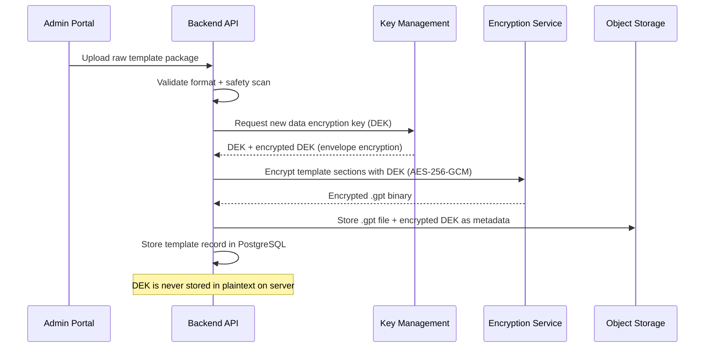
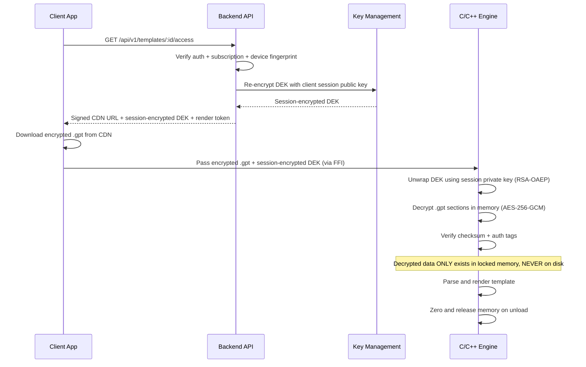
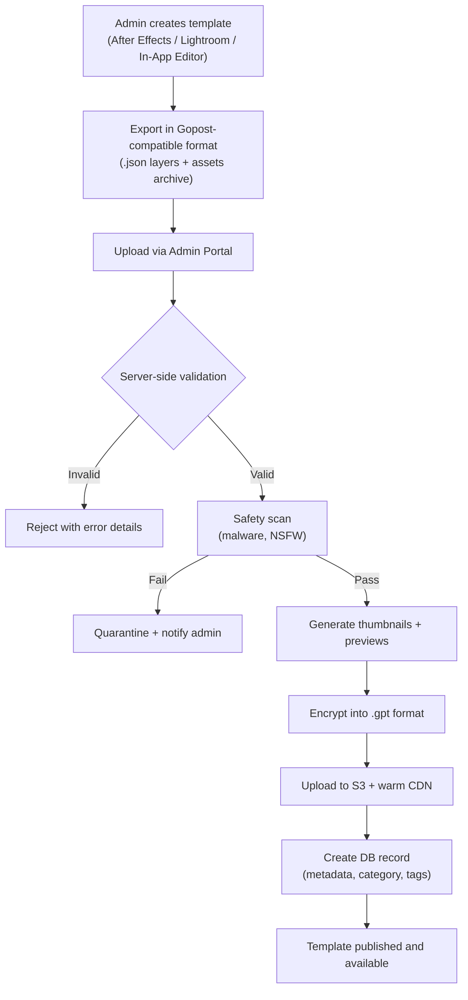

## 6. Secure Template System

### 6.1 Custom Template Format (.gpt)

The `.gpt` (Gopost Template) format is a custom encrypted binary container:

```
+--------------------------------------------------+
| GPT File Structure                                |
+--------------------------------------------------+
| Magic Bytes: "GOPT" (4 bytes)                     |
| Version: uint16 (2 bytes)                         |
| Flags: uint16 (2 bytes)                           |
| Template Type: uint8 (1 = video, 2 = image)       |
| Reserved: 7 bytes                                 |
+--------------------------------------------------+
| Encryption Header (64 bytes)                      |
|   Algorithm ID: uint8 (1 = AES-256-GCM)          |
|   IV / Nonce: 12 bytes                            |
|   Auth Tag: 16 bytes                              |
|   Key ID: 16 bytes (references server key)        |
|   Reserved: 19 bytes                              |
+--------------------------------------------------+
| Metadata Section (encrypted)                      |
|   Section Length: uint32                           |
|   JSON payload:                                   |
|     - template_id (UUID)                          |
|     - name, description                           |
|     - dimensions (width x height)                 |
|     - duration (video only)                       |
|     - layer_count                                 |
|     - tags, category                              |
|     - created_at, version                         |
+--------------------------------------------------+
| Layer Definitions (encrypted)                     |
|   Section Length: uint32                           |
|   Array of LayerDef:                              |
|     - layer_type (video, image, text, shape,      |
|       sticker, audio)                             |
|     - z_order                                     |
|     - transform (position, scale, rotation)       |
|     - opacity, blend_mode                         |
|     - keyframes[] (time -> property values)       |
|     - asset_ref (index into Asset Table)          |
|     - effects[] (effect_type, parameters)         |
+--------------------------------------------------+
| Asset Table (encrypted)                           |
|   Section Length: uint32                           |
|   Array of AssetEntry:                            |
|     - asset_id                                    |
|     - asset_type (embedded / cdn_ref)             |
|     - content_hash (SHA-256)                      |
|     - For embedded: offset + length in Blob Sect. |
|     - For cdn_ref: encrypted CDN URI              |
+--------------------------------------------------+
| Render Instructions (encrypted)                   |
|   Section Length: uint32                           |
|   - composition_order                             |
|   - transition_graph                              |
|   - timing_curves                                 |
|   - output_config (resolution, fps, codec)        |
+--------------------------------------------------+
| Blob Section (encrypted)                          |
|   Embedded asset binary data                      |
|   (thumbnails, small overlays, sticker PNGs)      |
+--------------------------------------------------+
| File Checksum: SHA-256 of everything above        |
+--------------------------------------------------+
```

### 6.2 Encryption Pipeline



**Client-side decryption flow:**



### 6.3 Anti-Extraction Measures

| Threat | Mitigation | Implementation |
|--------|------------|----------------|
| Disk forensics | Templates never written decrypted to disk | `mlock()` on all decrypted buffers; no temp files |
| Memory dump | Locked memory + immediate zeroing | `mlock()`, `madvise(MADV_DONTDUMP)`, `explicit_bzero()` on release |
| Swap extraction | Prevent swap of sensitive pages | `mlock()` / `VirtualLock()` on Windows |
| Debugger attach | Runtime debugger detection | `ptrace(PTRACE_TRACEME)` on Linux/Android, `sysctl` on iOS/macOS, `IsDebuggerPresent()` on Windows |
| Jailbreak/root | Device integrity checks | SafetyNet/Play Integrity (Android), DeviceCheck (iOS), custom root detection heuristics |
| Network interception | Certificate pinning | Pin leaf + intermediate certs; reject unknown CAs |
| Binary analysis | Code obfuscation | ProGuard/R8 (Android Dart), Bitcode (iOS), symbol stripping, control-flow flattening in C++ (LLVM obfuscator) |
| API replay | Time-limited render tokens | Server issues JWT render token valid for 5 minutes; engine validates before decryption |
| Template sharing | Device-bound session keys | Encryption keys tied to device fingerprint; non-transferable |

### 6.4 Admin Upload Flow



---

## Development Sprint Plan

### Sprint Assignment

| Attribute | Value |
|---|---|
| **Phase** | Phase 2: Template Browser |
| **Sprint(s)** | Sprint 3-4 (Weeks 5-8) |
| **Team** | Backend Engineers, Platform Engineers, Security |
| **Predecessor** | [04-backend-architecture.md](04-backend-architecture.md) (Sprint 2 complete) |
| **Successor** | [07-security-architecture.md](07-security-architecture.md) |
| **Story Points Total** | 68 |

### User Stories

| ID | Story | Acceptance Criteria | Points | Priority | Dependencies |
|---|---|---|---|---|---|
| APP-059 | As a Platform Engineer, I want to finalize the .gpt binary format specification so that parser implementation can begin. | - Magic bytes, version, flags, template type documented<br/>- Section layout (encryption header, metadata, layers, assets, render instructions, blob) specified<br/>- Checksum placement defined | 3 | P0 | APP-042 |
| APP-060 | As a Platform Engineer, I want to implement the .gpt parser (magic bytes, version, sections) so that .gpt files can be read. | - Parser validates magic "GOPT" and version<br/>- Section length parsing for each encrypted section<br/>- Parser returns structured in-memory representation | 5 | P0 | APP-059 |
| APP-061 | As a Platform Engineer, I want to implement encryption header parsing so that decryption parameters are extracted. | - Algorithm ID, IV/nonce, auth tag, key ID parsed<br/>- Support for AES-256-GCM (algorithm ID 1)<br/>- Invalid header returns error | 3 | P0 | APP-060 |
| APP-062 | As a Platform Engineer, I want to implement AES-256-GCM encryption/decryption of template sections so that templates are protected. | - Encrypt/decrypt with AES-256-GCM<br/>- IV/nonce and auth tag handling<br/>- Secure memory (mlock) for decrypted buffers | 5 | P0 | APP-061 |
| APP-063 | As a Platform Engineer, I want to implement metadata section JSON parsing so that template metadata is available. | - JSON parsing for template_id, name, description, dimensions, duration, layer_count, tags, category<br/>- Validation of required fields<br/>- Parse errors handled | 3 | P0 | APP-062 |
| APP-064 | As a Platform Engineer, I want to implement layer definition parsing so that layer structure is available for rendering. | - LayerDef parsing (layer_type, z_order, transform, opacity, blend_mode, keyframes, asset_ref, effects)<br/>- Array of layers parsed<br/>- Invalid layer data rejected | 5 | P0 | APP-063 |
| APP-065 | As a Platform Engineer, I want to implement asset table parsing with embedded/CDN refs so that assets can be resolved. | - AssetEntry parsing (asset_id, asset_type, content_hash)<br/>- Embedded: offset + length in blob section<br/>- CDN ref: encrypted CDN URI | 5 | P0 | APP-064 |
| APP-066 | As a Platform Engineer, I want to implement render instructions parsing so that composition order and output config are available. | - composition_order, transition_graph, timing_curves parsed<br/>- output_config (resolution, fps, codec) extracted<br/>- Used by template renderer | 3 | P0 | APP-065 |
| APP-067 | As a Platform Engineer, I want to implement blob section extraction so that embedded assets can be retrieved. | - Blob section decrypted and extracted<br/>- Offset/length from asset table used to slice blob<br/>- Thumbnails, overlays, stickers available | 3 | P0 | APP-065 |
| APP-068 | As a Platform Engineer, I want to implement file checksum (SHA-256) validation so that template integrity is verified. | - SHA-256 computed over file (excluding checksum bytes)<br/>- Compared against stored checksum<br/>- Mismatch returns error, template not loaded | 3 | P0 | APP-060 |
| APP-069 | As a Backend Engineer, I want to implement the admin upload flow (validate→scan→encrypt→store) so that templates can be published. | - Validate format, dimensions, safety scan<br/>- Encrypt with AES-256-GCM, generate .gpt<br/>- Store in S3, create DB record, warm CDN | 8 | P0 | APP-042, APP-059 |
| APP-070 | As a Platform Engineer, I want to implement the client-side decryption flow (FFI→decrypt→parse→render) so that templates can be used in the app. | - Encrypted blob + session key passed via FFI to engine<br/>- Engine decrypts, parses, renders<br/>- Memory zeroed on unload | 8 | P0 | APP-062, APP-060, APP-058 |

### Definition of Done

- [ ] All stories in this section marked complete
- [ ] Code reviewed and merged to `develop`
- [ ] Unit tests passing (≥ 90% coverage for new code)
- [ ] Integration tests passing
- [ ] Documentation updated
- [ ] No critical or high-severity bugs open
- [ ] Sprint review demo completed
