## 7. Security Architecture (Full Stack)

### 7.1 Security Layers Overview

```mermaid
graph TB
    subgraph clientSecurity ["Client Security"]
        SSLPin["SSL / Certificate Pinning"]
        CodeObf["Code Obfuscation"]
        SecureStore["Secure Storage<br/>(Keychain / Keystore)"]
        RuntimeCheck["Runtime Integrity Checks"]
        AntiTamper["Anti-Tampering<br/>(checksum verification)"]
        AntiDebug["Anti-Debug Detection"]
        JBDetect["Jailbreak / Root Detection"]
    end

    subgraph networkSecurity ["Network Security"]
        TLS13["TLS 1.3 Everywhere"]
        CertPin["Certificate Pinning"]
        ReqSign["Request Signing (HMAC)"]
    end

    subgraph apiSecurity ["API Security"]
        JWT["JWT Authentication"]
        RBAC["RBAC Authorization"]
        RateLimit["Rate Limiting"]
        InputVal["Input Validation"]
        CORS["CORS Policy"]
        CSP["CSP Headers"]
    end

    subgraph infraSecurity ["Infrastructure Security"]
        WAF["Web Application Firewall"]
        DDoS["DDoS Protection"]
        Vault["Secrets Management<br/>(HashiCorp Vault)"]
        AuditLog["Audit Logging"]
        Encrypt["Encryption at Rest"]
    end

    subgraph mediaSecurity ["Media / Template Security"]
        AES["AES-256-GCM Encryption"]
        RSA["RSA-2048 Key Exchange"]
        MemOnly["Memory-Only Decryption"]
        RenderToken["Server-Issued Render Tokens"]
        DeviceBind["Device-Bound Keys"]
    end

    clientSecurity --> networkSecurity
    networkSecurity --> apiSecurity
    apiSecurity --> infraSecurity
    infraSecurity --> mediaSecurity
```



### 7.2 Frontend Security Details

**SSL Pinning (Dio interceptor):**

```dart
class SSLPinningInterceptor extends Interceptor {
  static const _pinnedFingerprints = [
    'sha256/AAAAAAAAAAAAAAAAAAAAAAAAAAAAAAAAAAAAAAAAAAA=',  // Leaf cert
    'sha256/BBBBBBBBBBBBBBBBBBBBBBBBBBBBBBBBBBBBBBBBBBB=',  // Intermediate
  ];

  @override
  void onRequest(RequestOptions options, RequestInterceptorHandler handler) {
    (options.extra['dio.extra.httpClientAdapter'] as DefaultHttpClientAdapter?)
        ?.onHttpClientCreate = (client) {
      client.badCertificateCallback = (cert, host, port) => false;
      // Pinning is validated in the SecurityContext setup
    };
    handler.next(options);
  }
}
```

**Secure local storage strategy:**

| Data Type | Storage | Encryption |
|-----------|---------|------------|
| Access Token | In-memory only | N/A (never persisted) |
| Refresh Token | flutter_secure_storage (Keychain/Keystore) | Platform hardware-backed |
| Session Keys | In-memory only | N/A |
| User Preferences | SharedPreferences | Not sensitive |
| Cached Template Metadata | Encrypted SQLite (sqlcipher) | AES-256 |

**Runtime integrity checks:**

```dart
class IntegrityChecker {
  static Future<bool> verify() async {
    final checks = await Future.wait([
      _checkDebugMode(),
      _checkRootJailbreak(),
      _checkEmulator(),
      _checkAppSignature(),
      _checkHookingFrameworks(),
    ]);
    return checks.every((passed) => passed);
  }

  static Future<bool> _checkDebugMode() async {
    // kReleaseMode is compile-time constant in Flutter
    if (!kReleaseMode) return false;
    // Additional runtime checks via platform channel
    return await _channel.invokeMethod('checkDebugger');
  }

  // ... other checks
}
```

### 7.3 Backend Security Details

**JWT middleware:**

```go
func AuthMiddleware(jwtSecret string) gin.HandlerFunc {
    return func(c *gin.Context) {
        header := c.GetHeader("Authorization")
        if header == "" || !strings.HasPrefix(header, "Bearer ") {
            c.AbortWithStatusJSON(401, response.Error("UNAUTHORIZED", "Missing token"))
            return
        }

        token := strings.TrimPrefix(header, "Bearer ")
        claims, err := jwt.Validate(token, jwtSecret)
        if err != nil {
            c.AbortWithStatusJSON(401, response.Error("INVALID_TOKEN", "Token invalid or expired"))
            return
        }

        c.Set("user_id", claims.UserID)
        c.Set("user_role", claims.Role)
        c.Next()
    }
}
```

**RBAC middleware:**

```go
func RequireRole(roles ...string) gin.HandlerFunc {
    allowed := make(map[string]bool)
    for _, r := range roles {
        allowed[r] = true
    }
    return func(c *gin.Context) {
        role, exists := c.Get("user_role")
        if !exists || !allowed[role.(string)] {
            c.AbortWithStatusJSON(403, response.Error("FORBIDDEN", "Insufficient permissions"))
            return
        }
        c.Next()
    }
}
```

**Input validation (struct tags):**

```go
type CreateTemplateRequest struct {
    Name        string   `json:"name" binding:"required,min=1,max=100"`
    Description string   `json:"description" binding:"max=500"`
    CategoryID  string   `json:"category_id" binding:"required,uuid"`
    Type        string   `json:"type" binding:"required,oneof=video image"`
    Tags        []string `json:"tags" binding:"max=10,dive,min=1,max=30"`
}
```

### 7.4 Infrastructure Security

| Concern | Solution | Configuration |
|---------|----------|---------------|
| Secrets management | HashiCorp Vault | Dynamic secrets for DB, static for JWT signing keys |
| DDoS protection | Cloudflare / AWS Shield | Layer 3/4/7 protection, challenge pages |
| WAF | Cloudflare WAF / AWS WAF | OWASP Core Rule Set, custom rules for API |
| Encryption at rest | AWS KMS / self-managed | PostgreSQL TDE, S3 SSE-KMS, Redis encryption |
| Audit logging | Structured JSON logs -> Loki | All auth events, admin actions, template access |
| Vulnerability scanning | Trivy (containers), Snyk (dependencies) | CI/CD gate: block on critical CVEs |

### 7.5 GDPR and Compliance

| Requirement | Implementation |
|-------------|----------------|
| Right to access | `GET /api/v1/users/me/data-export` — returns all user data as JSON |
| Right to erasure | `DELETE /api/v1/users/me` — hard delete + cascade (30-day grace period) |
| Data minimization | Only collect necessary fields; no unnecessary analytics |
| Consent management | Explicit opt-in for analytics, marketing; stored in user preferences |
| Data portability | Export in standard JSON format |
| Breach notification | Automated alerting pipeline; 72-hour disclosure process documented |

---

## Development Sprint Plan

### Sprint Assignment

| Attribute | Value |
|---|---|
| **Phase** | Phase 1: Foundation + Phase 6: Polish & Launch |
| **Sprint(s)** | Sprint 2 (Weeks 3-4) + Sprint 14 (Weeks 27-28) |
| **Team** | Security, Backend, Frontend Engineers |
| **Predecessor** | [01-executive-summary.md](01-executive-summary.md) |
| **Successor** | [08-performance-memory-strategy.md](08-performance-memory-strategy.md) |
| **Story Points Total** | 58 |

### User Stories

| ID | Story | Acceptance Criteria | Points | Priority | Dependencies |
|---|---|---|---|---|---|
| APP-071 | As a Flutter Engineer, I want to implement SSL/certificate pinning (Dio interceptor) so that MITM attacks are prevented. | - SSLPinningInterceptor validates leaf and intermediate cert fingerprints<br/>- Dio configured with pinned SecurityContext<br/>- Connection fails if cert doesn't match | 3 | P0 | APP-016 |
| APP-072 | As a Flutter Engineer, I want to implement the secure storage strategy so that tokens and keys are stored safely. | - Access token in-memory only; refresh token in flutter_secure_storage<br/>- Session keys never persisted<br/>- Cached template metadata in encrypted SQLite (sqlcipher) if applicable | 3 | P0 | APP-025 |
| APP-073 | As a Flutter Engineer, I want to implement runtime integrity checks (debug, root, emulator, signature, hooking) so that compromised devices are detected. | - IntegrityChecker verifies: debug mode, root/jailbreak, emulator, app signature, hooking frameworks<br/>- Platform channel for native checks (ptrace, sysctl, IsDebuggerPresent)<br/>- Failed check blocks sensitive operations | 5 | P0 | APP-025 |
| APP-074 | As a Backend Engineer, I want to ensure JWT middleware is production-ready so that token validation is secure. | - JWT validated with proper secret, expiry, issuer<br/>- Invalid/expired tokens return 401<br/>- Claims correctly extracted for RBAC | 2 | P0 | APP-030 |
| APP-075 | As a Backend Engineer, I want to ensure RBAC middleware is production-ready so that role enforcement is correct. | - RequireRole applied to admin, creator, user routes<br/>- 403 for insufficient permissions<br/>- Role hierarchy respected | 2 | P0 | APP-031 |
| APP-076 | As a Backend Engineer, I want to implement input validation (struct tags) so that malformed requests are rejected. | - CreateTemplateRequest, CreateUserRequest, etc. with binding tags<br/>- required, min, max, uuid, oneof validation<br/>- Validation errors returned with field details | 3 | P0 | APP-041 |
| APP-077 | As a DevOps Engineer, I want to design secrets management (Vault integration) so that secrets are not in env. | - HashiCorp Vault integration design document<br/>- Dynamic secrets for DB, static for JWT signing keys<br/>- Migration path from env-based to Vault | 3 | P1 | APP-028 |
| APP-078 | As a DevOps Engineer, I want to set up DDoS protection so that the API is resilient to volumetric attacks. | - Cloudflare or AWS Shield configured<br/>- Layer 3/4/7 protection enabled<br/>- Challenge pages for suspicious traffic | 3 | P0 | — |
| APP-079 | As a DevOps Engineer, I want to configure WAF rules so that common web attacks are blocked. | - OWASP Core Rule Set enabled<br/>- Custom rules for API paths<br/>- Blocked requests logged | 3 | P0 | APP-078 |
| APP-080 | As a Backend Engineer, I want to ensure encryption at rest for all data stores so that data is protected. | - PostgreSQL TDE or disk encryption<br/>- S3 SSE-KMS for object storage<br/>- Redis encryption if applicable | 3 | P0 | APP-035, APP-037 |
| APP-081 | As a Backend Engineer, I want to implement the audit logging pipeline so that security events are traceable. | - All auth events (login, logout, token refresh) logged<br/>- Admin actions (template upload, user management) logged<br/>- Structured JSON logs to Loki or equivalent | 5 | P0 | APP-041 |
| APP-082 | As a Backend Engineer, I want to implement the GDPR data export endpoint so that users can access their data. | - GET /api/v1/users/me/data-export returns all user data as JSON<br/>- Includes profile, templates, subscriptions<br/>- Rate limited, auth required | 3 | P0 | APP-041 |
| APP-083 | As a Backend Engineer, I want to implement the GDPR deletion endpoint so that users can request erasure. | - DELETE /api/v1/users/me hard deletes user and cascades<br/>- 30-day grace period with confirmation<br/>- Data removed from all stores | 5 | P0 | APP-041 |
| APP-084 | As a Backend Engineer, I want to implement consent management so that user preferences are respected. | - User preferences for analytics, marketing opt-in<br/>- Stored in user record<br/>- API to update consent | 2 | P1 | APP-041 |
| APP-085 | As a Security Engineer, I want to conduct penetration testing (Sprint 14) so that vulnerabilities are identified before launch. | - External pen test of API and client<br/>- Report with findings and severity<br/>- Critical/high issues remediated | 5 | P0 | All Sprints 1-13 |
| APP-086 | As a Security Engineer, I want to perform a security hardening pass (Sprint 14) so that the app is launch-ready. | - Review all security controls<br/>- Obfuscation (ProGuard/R8, Bitcode) verified<br/>- Final security checklist signed off | 5 | P0 | APP-085 |

### Definition of Done

- [ ] All stories in this section marked complete
- [ ] Code reviewed and merged to `develop`
- [ ] Unit tests passing (≥ 90% coverage for new code)
- [ ] Integration tests passing
- [ ] Documentation updated
- [ ] No critical or high-severity bugs open
- [ ] Sprint review demo completed
