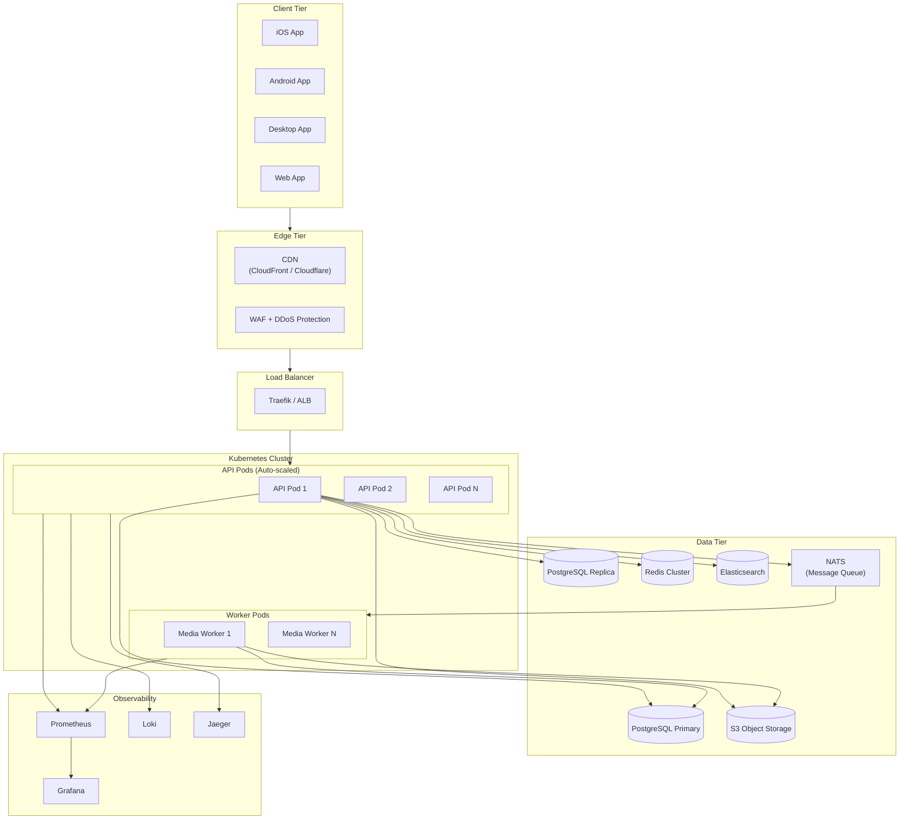

## 9. Infrastructure and DevOps

### 9.1 Deployment Architecture



### 9.2 Docker Configuration

**Backend Dockerfile (multi-stage):**

```dockerfile
# Build stage
FROM golang:1.22-alpine AS builder
WORKDIR /app
COPY go.mod go.sum ./
RUN go mod download
COPY . .
RUN CGO_ENABLED=0 GOOS=linux go build -ldflags="-s -w" -o server ./cmd/server

# Runtime stage
FROM alpine:3.19
RUN apk --no-cache add ca-certificates tzdata
WORKDIR /app
COPY --from=builder /app/server .
COPY --from=builder /app/migrations ./migrations
EXPOSE 8080
USER nobody:nobody
ENTRYPOINT ["./server"]
```

**docker-compose.yml (development):**

```yaml
version: "3.9"
services:
  api:
    build: .
    ports:
      - "8080:8080"
    environment:
      - DB_HOST=postgres
      - REDIS_HOST=redis
      - S3_ENDPOINT=http://minio:9000
    depends_on:
      postgres:
        condition: service_healthy
      redis:
        condition: service_healthy
      minio:
        condition: service_started

  postgres:
    image: postgres:16-alpine
    environment:
      POSTGRES_DB: gopost
      POSTGRES_USER: gopost
      POSTGRES_PASSWORD: dev_password
    volumes:
      - pgdata:/var/lib/postgresql/data
    healthcheck:
      test: ["CMD-SHELL", "pg_isready -U gopost"]
      interval: 5s
      timeout: 5s
      retries: 5

  redis:
    image: redis:7-alpine
    command: redis-server --appendonly yes
    volumes:
      - redisdata:/data
    healthcheck:
      test: ["CMD", "redis-cli", "ping"]
      interval: 5s
      timeout: 5s
      retries: 5

  minio:
    image: minio/minio
    command: server /data --console-address ":9001"
    environment:
      MINIO_ROOT_USER: minioadmin
      MINIO_ROOT_PASSWORD: minioadmin
    volumes:
      - miniodata:/data
    ports:
      - "9000:9000"
      - "9001:9001"

  elasticsearch:
    image: elasticsearch:8.12.0
    environment:
      - discovery.type=single-node
      - xpack.security.enabled=false
    volumes:
      - esdata:/usr/share/elasticsearch/data
    ports:
      - "9200:9200"

  nats:
    image: nats:2.10-alpine
    ports:
      - "4222:4222"

volumes:
  pgdata:
  redisdata:
  miniodata:
  esdata:
```

### 9.3 CI/CD Pipeline

```mermaid
graph LR
    subgraph trigger ["Trigger"]
        Push["Push / PR"]
    end

    subgraph lint ["Lint & Format"]
        FlutterLint["flutter analyze"]
        GoLint["golangci-lint run"]
        CppLint["clang-tidy"]
    end

    subgraph test ["Test"]
        FlutterTest["flutter test"]
        GoTest["go test ./..."]
        CppTest["ctest (Google Test)"]
    end

    subgraph build ["Build"]
        FlutterBuild["Flutter builds<br/>(iOS, Android, Web, Desktop)"]
        GoBuild["Docker build<br/>(backend image)"]
        CppBuild["CMake cross-compile<br/>(per-platform libs)"]
    end

    subgraph security ["Security Scan"]
        DepScan["Dependency audit<br/>(Snyk / Trivy)"]
        SAST["Static analysis<br/>(CodeQL / Semgrep)"]
    end

    subgraph deploy ["Deploy"]
        Staging["Deploy to Staging<br/>(K8s)"]
        E2E["E2E Tests"]
        Prod["Deploy to Production<br/>(K8s rolling update)"]
    end

    Push --> lint
    lint --> test
    test --> build
    build --> security
    security --> Staging
    Staging --> E2E
    E2E -->|"Pass"| Prod
```



**GitHub Actions workflow summary:**

| Workflow | Trigger | Steps |
|----------|---------|-------|
| `flutter-ci.yml` | PR / push to main | Lint -> Unit test -> Widget test -> Build (Android APK, iOS IPA, Web) |
| `backend-ci.yml` | PR / push to main | Lint -> Unit test -> Integration test (with test containers) -> Docker build -> Push to registry |
| `engine-ci.yml` | PR / push to main | clang-tidy -> Google Test -> CMake build (Linux, macOS, Android NDK) |
| `deploy-staging.yml` | Push to `develop` | Docker build -> Push -> Helm upgrade (staging namespace) |
| `deploy-production.yml` | Tag `v*` | Docker build -> Push -> Helm upgrade (production namespace, canary -> full rollout) |

### 9.4 Kubernetes Resources

| Resource | Replicas | CPU Request | Memory Request | HPA |
|----------|----------|-------------|----------------|-----|
| API Pods | 3–10 | 500m | 512 Mi | Scale at 70% CPU |
| Worker Pods | 2–8 | 1000m | 1 Gi | Scale on queue depth |
| PostgreSQL | 1 primary + 2 replicas | 2000m | 4 Gi | N/A (managed) |
| Redis | 3-node cluster | 500m | 1 Gi | N/A |
| Elasticsearch | 3 nodes | 1000m | 2 Gi | N/A |

### 9.5 Observability

| Tool | Purpose | Key Metrics / Data |
|------|---------|-------------------|
| **Prometheus** | Metrics collection | Request latency, error rates, CPU/memory, DB pool utilization, cache hit ratio |
| **Grafana** | Dashboards | API health, business metrics (template downloads, active editors), infrastructure |
| **Loki** | Log aggregation | Structured JSON logs from all services; indexed by service, level, trace_id |
| **Jaeger** | Distributed tracing | End-to-end request traces across API -> Service -> Repository -> DB |
| **AlertManager** | Alerting | P1: API error rate > 5%, P2: latency p99 > 1s, P3: disk usage > 80% |

---

## Development Sprint Plan

### Sprint Assignment

| Attribute | Value |
|---|---|
| **Phase** | Phase 1: Foundation + Phase 6: Polish & Launch |
| **Sprint(s)** | Sprint 1 (Weeks 1-2), Sprints 14-16 (Weeks 27-32) |
| **Team** | DevOps Engineer, Go Backend Developer |
| **Predecessor** | [08-performance-memory-strategy.md](08-performance-memory-strategy.md) |
| **Successor** | [10-development-methodology.md](10-development-methodology.md) |
| **Story Points Total** | 72 |

### User Stories

| ID | Story | Acceptance Criteria | Points | Priority | Dependencies |
|---|---|---|---|---|---|
| APP-099 | As a developer, I want a docker-compose dev environment so that I can run all services locally with one command | - docker-compose.yml defines api, postgres, redis, minio, elasticsearch, nats<br/>- `docker-compose up` starts all services<br/>- API connects to all dependencies on startup | 5 | P0 | — |
| APP-100 | As a developer, I want a PostgreSQL container with healthcheck so that the API waits for DB readiness before starting | - postgres:16-alpine image configured<br/>- Healthcheck uses pg_isready with 5s interval<br/>- API depends_on with condition: service_healthy | 2 | P0 | APP-099 |
| APP-101 | As a developer, I want a Redis container with healthcheck so that session and cache operations work in dev | - redis:7-alpine with appendonly persistence<br/>- Healthcheck uses redis-cli ping<br/>- API depends_on with condition: service_healthy | 2 | P0 | APP-099 |
| APP-102 | As a developer, I want a MinIO container for S3-compatible storage so that I can test uploads and signed URLs locally | - MinIO server on ports 9000/9001<br/>- Default credentials documented<br/>- API S3_ENDPOINT points to minio:9000 | 3 | P0 | APP-099 |
| APP-103 | As a developer, I want an Elasticsearch container so that template search can be tested locally | - elasticsearch:8.12.0 single-node<br/>- xpack.security.enabled=false for dev<br/>- Port 9200 exposed | 3 | P0 | APP-099 |
| APP-104 | As a developer, I want a NATS message queue container so that async worker jobs can be tested | - nats:2.10-alpine image<br/>- Port 4222 exposed for client connections<br/>- API and workers connect to nats | 2 | P0 | APP-099 |
| APP-105 | As a backend developer, I want a multi-stage backend Dockerfile so that production images are minimal and secure | - Build stage: golang:1.22-alpine, CGO_ENABLED=0<br/>- Runtime stage: alpine with ca-certificates, non-root user<br/>- Migrations copied to image | 5 | P0 | — |
| APP-106 | As a DevOps engineer, I want Kubernetes cluster setup for staging so that we can deploy and test in a production-like environment | - Staging namespace created<br/>- Helm chart or manifests for cluster resources<br/>- kubectl access configured for team | 8 | P0 | APP-105 |
| APP-107 | As a DevOps engineer, I want Kubernetes API pod deployment with HPA so that the API scales under load | - API Deployment with 3-10 replicas<br/>- HPA scaling at 70% CPU<br/>- Resource requests: 500m CPU, 512Mi memory | 5 | P0 | APP-106 |
| APP-108 | As a DevOps engineer, I want Kubernetes worker pod deployment so that media processing jobs run reliably | - Worker Deployment with 2-8 replicas<br/>- Scale on NATS queue depth<br/>- Resource requests: 1000m CPU, 1Gi memory | 5 | P0 | APP-106 |
| APP-109 | As a developer, I want CI/CD pipeline flutter-ci.yml so that Flutter code is linted, tested, and built on every PR | - Workflow triggers on PR/push to main<br/>- Steps: flutter analyze, flutter test, build (Android APK, iOS IPA, Web)<br/>- Status reported to PR | 5 | P0 | — |
| APP-110 | As a developer, I want CI/CD pipeline backend-ci.yml so that Go backend is validated on every PR | - Workflow: golangci-lint, go test, testcontainers integration tests<br/>- Docker build and push to registry on main<br/>- Fail fast on lint errors | 5 | P0 | APP-105 |
| APP-111 | As a developer, I want CI/CD pipeline engine-ci.yml so that C++ engine is validated on every PR | - Workflow: clang-tidy, Google Test, CMake build (Linux, macOS, Android NDK)<br/>- Artifacts published for downstream use<br/>- Cross-platform build matrix | 5 | P0 | — |
| APP-112 | As a DevOps engineer, I want Prometheus + Grafana monitoring so that we can observe API and worker metrics | - Prometheus scrapes API and worker /metrics endpoints<br/>- Grafana dashboards for request latency, error rates, CPU/memory<br/>- Data retention configured | 5 | P1 | APP-107 |
| APP-113 | As a DevOps engineer, I want Loki log aggregation so that structured logs are searchable by service and trace_id | - Loki deployed and configured<br/>- API and workers emit JSON logs with trace_id<br/>- Grafana Loki datasource for log exploration | 5 | P1 | APP-112 |
| APP-114 | As a DevOps engineer, I want Jaeger distributed tracing so that we can trace requests across API and services | - Jaeger collector and UI deployed<br/>- OpenTelemetry or Jaeger client in API<br/>- Trace propagation to workers | 5 | P1 | APP-107 |
| APP-115 | As a DevOps engineer, I want AlertManager alerting rules so that we are notified of critical issues | - P1: API error rate > 5%<br/>- P2: latency p99 > 1s<br/>- P3: disk usage > 80%<br/>- Slack/email notification channels configured | 5 | P1 | APP-112 |

### Definition of Done

- [ ] All stories in this section marked complete
- [ ] Code reviewed and merged to `develop`
- [ ] Unit tests passing (≥ 90% coverage for new code)
- [ ] Integration tests passing
- [ ] Documentation updated
- [ ] No critical or high-severity bugs open
- [ ] Sprint review demo completed

---
