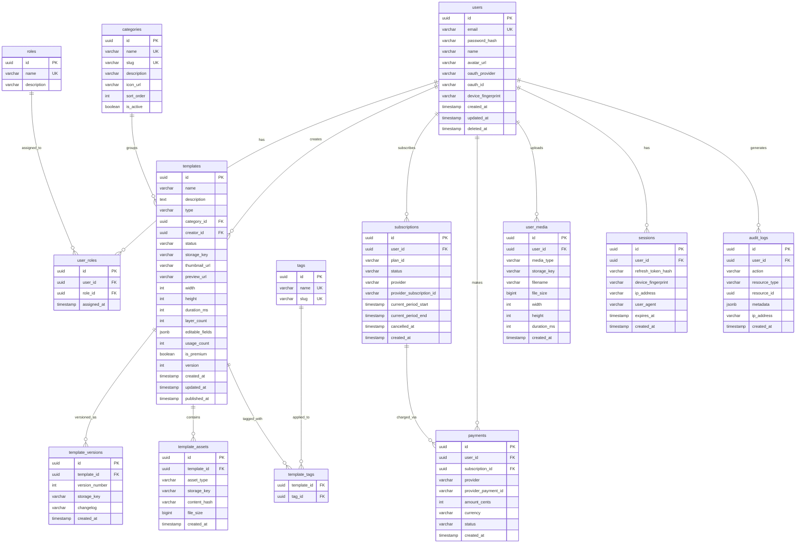

## 12. Database Schema

### 12.1 Entity-Relationship Diagram



### 12.2 Key Indexes

```sql
-- Users
CREATE UNIQUE INDEX idx_users_email ON users(email) WHERE deleted_at IS NULL;
CREATE INDEX idx_users_oauth ON users(oauth_provider, oauth_id) WHERE oauth_provider IS NOT NULL;

-- Templates
CREATE INDEX idx_templates_type_status ON templates(type, status);
CREATE INDEX idx_templates_category ON templates(category_id);
CREATE INDEX idx_templates_creator ON templates(creator_id);
CREATE INDEX idx_templates_popular ON templates(usage_count DESC) WHERE status = 'published';
CREATE INDEX idx_templates_newest ON templates(published_at DESC) WHERE status = 'published';
CREATE INDEX idx_templates_search ON templates USING gin(to_tsvector('english', name || ' ' || description));

-- Subscriptions
CREATE INDEX idx_subscriptions_user_active ON subscriptions(user_id) WHERE status = 'active';
CREATE INDEX idx_subscriptions_provider ON subscriptions(provider, provider_subscription_id);

-- Sessions
CREATE INDEX idx_sessions_user ON sessions(user_id);
CREATE INDEX idx_sessions_refresh ON sessions(refresh_token_hash);
CREATE INDEX idx_sessions_expiry ON sessions(expires_at);

-- Audit Logs
CREATE INDEX idx_audit_logs_user ON audit_logs(user_id);
CREATE INDEX idx_audit_logs_resource ON audit_logs(resource_type, resource_id);
CREATE INDEX idx_audit_logs_time ON audit_logs(created_at DESC);

-- Template Tags (composite PK serves as index)
CREATE INDEX idx_template_tags_tag ON template_tags(tag_id);
```

### 12.3 Migration Strategy

- Tool: `golang-migrate` (SQL-based migrations)
- Naming: `NNNNNN_description.up.sql` / `NNNNNN_description.down.sql`
- Policy: Every migration must have a `down` counterpart
- CI: Migrations run automatically against a test database in CI
- Production: Migrations run as a Kubernetes init container before API pod startup
- Backward compatibility: New columns are added as nullable first; backfill and make NOT NULL in a subsequent migration

---

## Development Sprint Plan

### Sprint Assignment

| Attribute | Value |
|---|---|
| **Phase** | Phase 1-2: Foundation and Template Browser |
| **Sprint(s)** | Sprint 1 (users/roles/sessions), Sprint 3 (templates/categories/tags) |
| **Team** | Go Backend Developer |
| **Predecessor** | [04-backend-architecture.md](04-backend-architecture.md) |
| **Successor** | [13-testing-strategy.md](13-testing-strategy.md) |
| **Story Points Total** | 52 |

### User Stories

| ID | Story | Acceptance Criteria | Points | Priority | Dependencies |
|---|---|---|---|---|---|
| APP-149 | As a backend developer, I want users table migration so that we can store user accounts | - Columns: id, email, password_hash, name, avatar_url, oauth_provider, oauth_id, device_fingerprint, created_at, updated_at, deleted_at<br/>- Unique index on email where deleted_at IS NULL<br/>- Up and down migrations | 3 | P0 | — |
| APP-150 | As a backend developer, I want roles table migration so that we can implement RBAC | - Columns: id, name, description<br/>- Unique index on name<br/>- Seed default roles (user, creator, admin) | 2 | P0 | — |
| APP-151 | As a backend developer, I want user_roles table migration so that we can assign roles to users | - Columns: id, user_id, role_id, assigned_at<br/>- Foreign keys to users and roles<br/>- Up and down migrations | 2 | P0 | APP-149, APP-150 |
| APP-152 | As a backend developer, I want sessions table migration so that we can track refresh tokens | - Columns: id, user_id, refresh_token_hash, device_fingerprint, ip_address, user_agent, expires_at, created_at<br/>- Indexes on user_id, refresh_token_hash, expires_at<br/>- Up and down migrations | 3 | P0 | APP-149 |
| APP-153 | As a backend developer, I want templates table migration so that we can store template metadata | - Columns per 12.1 ERD (name, description, type, category_id, creator_id, status, storage_key, thumbnail_url, preview_url, width, height, duration_ms, layer_count, editable_fields, usage_count, is_premium, version, timestamps)<br/>- Foreign keys to categories, users | 5 | P0 | APP-156, APP-149 |
| APP-154 | As a backend developer, I want template_versions table migration so that we can version templates | - Columns: id, template_id, version_number, storage_key, changelog, created_at<br/>- Foreign key to templates | 2 | P0 | APP-153 |
| APP-155 | As a backend developer, I want template_assets table migration so that we can track template assets | - Columns: id, template_id, asset_type, storage_key, content_hash, file_size, created_at<br/>- Foreign key to templates | 2 | P0 | APP-153 |
| APP-156 | As a backend developer, I want categories table migration so that we can organize templates | - Columns: id, name, slug, description, icon_url, sort_order, is_active<br/>- Unique indexes on name, slug | 2 | P0 | — |
| APP-157 | As a backend developer, I want tags and template_tags migration so that we can tag templates | - tags: id, name, slug with unique indexes<br/>- template_tags: template_id, tag_id (composite PK)<br/>- Index on tag_id for reverse lookup | 3 | P0 | APP-153 |
| APP-158 | As a backend developer, I want subscriptions table migration so that we can track user subscriptions | - Columns: id, user_id, plan_id, status, provider, provider_subscription_id, current_period_start, current_period_end, cancelled_at, created_at<br/>- Index on user_id where status=active, provider+provider_subscription_id | 3 | P0 | APP-149 |
| APP-159 | As a backend developer, I want payments table migration so that we can record payment history | - Columns: id, user_id, subscription_id, provider, provider_payment_id, amount_cents, currency, status, created_at<br/>- Foreign keys to users, subscriptions | 2 | P0 | APP-158 |
| APP-160 | As a backend developer, I want user_media table migration so that we can store user-uploaded media | - Columns: id, user_id, media_type, storage_key, filename, file_size, width, height, duration_ms, created_at<br/>- Foreign key to users | 2 | P0 | APP-149 |
| APP-161 | As a backend developer, I want audit_logs table migration so that we can track admin actions | - Columns: id, user_id, action, resource_type, resource_id, metadata, ip_address, created_at<br/>- Indexes on user_id, (resource_type, resource_id), created_at DESC | 3 | P0 | APP-149 |
| APP-162 | As a backend developer, I want all indexes created per 12.2 so that queries perform efficiently | - All indexes from 12.2 Key Indexes section applied<br/>- Partial indexes where specified (e.g., status=published)<br/>- GIN index for full-text search on templates | 5 | P0 | APP-149, APP-153, APP-152, APP-158, APP-161 |
| APP-163 | As a DevOps engineer, I want golang-migrate setup with up/down migrations so that schema changes are versioned and reversible | - golang-migrate CLI and library integrated<br/>- Naming: NNNNNN_description.up.sql / .down.sql<br/>- Migrations run in CI against test DB; init container in K8s for production | 5 | P0 | APP-099 |

### Definition of Done

- [ ] All stories in this section marked complete
- [ ] Code reviewed and merged to `develop`
- [ ] Unit tests passing (≥ 90% coverage for new code)
- [ ] Integration tests passing
- [ ] Documentation updated
- [ ] No critical or high-severity bugs open
- [ ] Sprint review demo completed

---
