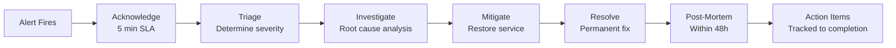

# Gopost — Disaster Recovery & Business Continuity

> **Version:** 1.0.0
> **Date:** February 23, 2026
> **Classification:** Internal — Engineering + Operations Reference
> **Audience:** DevOps Engineers, Backend Engineers, Tech Lead, CTO

---

## Table of Contents

1. [Overview](#1-overview)
2. [Service Tier Classification](#2-service-tier-classification)
3. [RTO/RPO Targets](#3-rtorpo-targets)
4. [Backup Strategy](#4-backup-strategy)
5. [Failover Procedures](#5-failover-procedures)
6. [Multi-Region Strategy](#6-multi-region-strategy)
7. [Incident Response](#7-incident-response)
8. [Runbooks](#8-runbooks)
9. [Testing and Verification](#9-testing-and-verification)
10. [Communication Plan](#10-communication-plan)
11. [Sprint Stories](#11-sprint-stories)

---

## 1. Overview

This document defines the disaster recovery (DR) and business continuity (BC) strategy for all Gopost infrastructure. It specifies recovery targets for each service component, backup procedures, failover mechanisms, and the incident response framework.

### 1.1 Guiding Principles

| Principle | Description |
|-----------|-------------|
| **Data durability above all** | User data (accounts, templates, purchases) must survive any single-region failure |
| **Graceful degradation** | Non-critical features may be unavailable during incidents; core editing must remain functional offline |
| **Automated recovery** | All failover for stateless services is automated; stateful services have documented manual steps with <15min execution time |
| **Regular testing** | DR procedures tested quarterly; backup restoration tested monthly |
| **Transparent communication** | Users informed of incidents within 15 minutes via status page |

### 1.2 Infrastructure Context

| Component | Technology | Hosting |
|-----------|-----------|---------|
| API Servers | Go / Kubernetes pods | AWS EKS (us-east-1 primary) |
| WebSocket Servers | Go / Kubernetes pods | AWS EKS |
| PostgreSQL | RDS PostgreSQL 16 | AWS RDS Multi-AZ |
| Redis | ElastiCache Redis 7 | AWS ElastiCache Multi-AZ |
| Object Storage | S3 | AWS S3 (cross-region replication) |
| Elasticsearch | OpenSearch Service | AWS OpenSearch |
| Message Queue | NATS | Kubernetes pods (JetStream persistence) |
| CDN | CloudFront + Cloudflare | Global edge |
| DNS | Route 53 | AWS |
| Monitoring | Prometheus + Grafana + Loki | Kubernetes pods |

---

## 2. Service Tier Classification

### 2.1 Tier Definitions

| Tier | Criticality | Impact of Outage | Examples |
|------|-------------|-----------------|----------|
| **Tier 0 — Critical** | Business-stopping | Users cannot log in, pay, or access templates | Auth service, PostgreSQL, S3 |
| **Tier 1 — High** | Core functionality degraded | Users can't search, export, or sync | Elasticsearch, media workers, CDN |
| **Tier 2 — Medium** | Non-core features unavailable | Analytics, admin portal, notifications delayed | Analytics pipeline, admin API, push notifications |
| **Tier 3 — Low** | Internal tooling impacted | Dev/ops tools unavailable | CI/CD, monitoring dashboards, log aggregation |

### 2.2 Service Classification

| Service | Tier | Justification |
|---------|------|---------------|
| PostgreSQL (primary) | 0 | All user data, templates, subscriptions |
| S3 (template/media storage) | 0 | Template assets required for editor |
| Auth API (`/api/v1/auth/*`) | 0 | Login, token refresh |
| API Server (core CRUD) | 0 | Template listing, user profiles |
| Redis (session cache) | 1 | Session validation; degraded performance without it |
| Elasticsearch | 1 | Search unavailable but browse-by-category still works |
| CDN (CloudFront) | 1 | Direct S3 fallback possible but slower |
| Media Worker Pods | 1 | Export queue backs up; users wait longer |
| NATS (message queue) | 1 | Async jobs queue in memory; temporary delay acceptable |
| Marketplace Storefront API | 1 | Browse/search degraded; purchases blocked if Stripe down |
| Creator Payout System (Stripe Connect) | 1 | Payouts delayed; ledger intact in PostgreSQL |
| WebSocket Server (Collaboration) | 2 | Collaboration sessions interrupted; templates auto-saved from snapshots |
| Admin Portal | 2 | Internal tool; manual processes as fallback |
| Push Notification Service | 2 | Notifications delayed, not lost |
| Feature Flag Service | 2 | Flags fall back to cached values on client; kill switches may be delayed |
| Prometheus / Grafana | 3 | Monitoring gap; alerts may be delayed |
| Loki (logs) | 3 | Log gap; not user-facing |
| CI/CD (GitHub Actions) | 3 | Deployments delayed |

---

## 3. RTO/RPO Targets

### 3.1 Definitions

| Term | Definition |
|------|-----------|
| **RTO (Recovery Time Objective)** | Maximum acceptable time from incident detection to service restoration |
| **RPO (Recovery Point Objective)** | Maximum acceptable data loss measured in time (e.g., RPO=1h means up to 1 hour of data may be lost) |

### 3.2 Targets by Tier

| Tier | RTO | RPO | Availability Target |
|------|-----|-----|---------------------|
| **Tier 0** | 15 minutes | 1 minute (near-zero) | 99.95% (≤22 min/month) |
| **Tier 1** | 30 minutes | 15 minutes | 99.9% (≤44 min/month) |
| **Tier 2** | 4 hours | 1 hour | 99.5% (≤3.6 hr/month) |
| **Tier 3** | 24 hours | 24 hours | 99.0% (≤7.3 hr/month) |

### 3.3 Component-Specific Targets

| Component | RTO | RPO | Recovery Method |
|-----------|-----|-----|-----------------|
| PostgreSQL | 5 min | ~0 (synchronous replication) | RDS Multi-AZ auto-failover |
| Redis | 10 min | ~0 (replica sync) | ElastiCache auto-failover |
| S3 | 0 min | 0 (11 9s durability) | Built-in; cross-region replication for DR |
| API Pods | 2 min | N/A (stateless) | K8s auto-restart + HPA |
| Elasticsearch | 30 min | 15 min | Snapshot restore from S3 |
| NATS | 10 min | 5 min (JetStream) | K8s restart with persistent volumes |
| CDN | 5 min | N/A | Failover to alternate CDN (Cloudflare ↔ CloudFront) |

---

## 4. Backup Strategy

### 4.1 Backup Matrix

| Component | Method | Frequency | Retention | Storage | Encryption |
|-----------|--------|-----------|-----------|---------|------------|
| PostgreSQL | RDS automated snapshots | Continuous (point-in-time) | 35 days | S3 (RDS-managed) | AES-256 |
| PostgreSQL | Manual snapshots | Daily at 03:00 UTC | 90 days | S3 (RDS-managed) | AES-256 |
| PostgreSQL | Cross-region snapshot copy | Daily | 30 days | S3 (us-west-2) | AES-256 |
| Redis | RDS snapshots | Every 6 hours | 7 days | S3 | AES-256 |
| S3 (templates) | Cross-region replication | Real-time | Indefinite | S3 (us-west-2) | SSE-S3 |
| S3 (user media) | Cross-region replication | Real-time | Indefinite | S3 (us-west-2) | SSE-S3 |
| Elasticsearch | Automated snapshots | Hourly | 14 days | S3 | AES-256 |
| NATS (JetStream) | Persistent volume snapshots | Hourly | 7 days | EBS snapshots | AES-256 |
| Kubernetes configs | GitOps (Helm charts in repo) | On every change | Git history | GitHub | N/A |
| Secrets | AWS Secrets Manager | Versioned | All versions | Secrets Manager | KMS |

### 4.2 Backup Verification

| Check | Frequency | Method | Owner |
|-------|-----------|--------|-------|
| PostgreSQL restore test | Monthly | Restore to test RDS instance, run integrity queries | DevOps |
| S3 object integrity | Weekly | Random sample checksum verification (100 objects) | Automated job |
| Elasticsearch restore test | Monthly | Restore snapshot to test cluster, run search queries | DevOps |
| Full DR simulation | Quarterly | Restore all Tier 0 services from backup in DR region | DevOps + Backend |
| Secrets rotation test | Monthly | Rotate test secret, verify application reconnects | DevOps |

### 4.3 Backup Monitoring

| Alert | Condition | Severity | Channel |
|-------|-----------|----------|---------|
| Backup job failed | Any scheduled backup misses its window | Critical | PagerDuty + Slack |
| Backup age exceeded | Latest backup older than 2× scheduled interval | High | Slack |
| Cross-region replication lag | S3 replication lag >1 hour | High | Slack |
| Snapshot storage exceeds budget | >2TB total backup storage | Warning | Email |

---

## 5. Failover Procedures

### 5.1 PostgreSQL Failover

**Scenario:** Primary database becomes unavailable.

| Step | Action | Automated? | Duration |
|------|--------|------------|----------|
| 1 | RDS Multi-AZ detects primary failure | Yes | ~30s |
| 2 | RDS promotes standby replica to primary | Yes | ~60s |
| 3 | DNS endpoint (`gopost-db.xxxxx.us-east-1.rds.amazonaws.com`) auto-updates | Yes | ~30s |
| 4 | Application connection pools reconnect | Yes (pgx pool auto-reconnect) | ~15s |
| 5 | Verify read/write operations via health check | Automated + manual verification | ~30s |
| **Total** | | | **~3 minutes** |

**Manual fallback (if Multi-AZ fails):**

1. Restore latest snapshot to new RDS instance (5–15 min depending on size)
2. Update Kubernetes secret with new endpoint
3. Rolling restart of API pods
4. Verify data integrity with checksum queries

### 5.2 Redis Failover

**Scenario:** Redis primary node failure.

| Step | Action | Automated? | Duration |
|------|--------|------------|----------|
| 1 | ElastiCache Sentinel detects failure | Yes | ~10s |
| 2 | Promote replica to primary | Yes | ~30s |
| 3 | Application reconnects via cluster endpoint | Yes | ~10s |
| **Total** | | | **~1 minute** |

**Impact during failover:** Session validation falls back to JWT signature check only (no revocation check for ~1 minute). Rate limiting briefly disabled.

### 5.3 API Server Failover

**Scenario:** Pod crash or node failure.

| Step | Action | Automated? | Duration |
|------|--------|------------|----------|
| 1 | Kubernetes detects unhealthy pod (liveness probe failure) | Yes | ~30s |
| 2 | Pod restarted or rescheduled to healthy node | Yes | ~30s |
| 3 | HPA scales up if sustained traffic | Yes | ~60s |
| **Total** | | | **~1 minute** |

**Zero-downtime:** With minimum 3 API replicas, traffic routes to remaining pods while failed pod recovers.

### 5.4 S3 Failover

**Scenario:** S3 regional outage (extremely rare, <0.01% annual probability).

| Step | Action | Automated? | Duration |
|------|--------|------------|----------|
| 1 | CloudFront begins returning errors for new template downloads | Detected by monitoring | ~1 min |
| 2 | Update CloudFront origin to us-west-2 replica bucket | Manual (Terraform apply) | ~5 min |
| 3 | Cache invalidation on CloudFront | Automated | ~5 min |
| **Total** | | | **~10 minutes** |

**Client resilience:** Templates cached locally after first download. Only new template fetches affected.

### 5.5 CDN Failover

**Scenario:** CloudFront degraded in a region.

| Step | Action | Automated? | Duration |
|------|--------|------------|----------|
| 1 | Route 53 health check detects CloudFront failure | Yes | ~60s |
| 2 | DNS failover to Cloudflare distribution | Yes (weighted routing) | ~60s TTL |
| **Total** | | | **~2 minutes** |

### 5.6 Elasticsearch Failover

**Scenario:** OpenSearch cluster failure.

| Step | Action | Automated? | Duration |
|------|--------|------------|----------|
| 1 | API falls back to PostgreSQL full-text search (degraded) | Automated (circuit breaker) | ~5s |
| 2 | OpenSearch Multi-AZ recovery or restore from snapshot | Auto/Manual | ~15–30 min |
| 3 | Re-index if needed | Manual trigger | ~30 min |
| **Total service impact** | | | **~5 seconds** (search degraded, not offline) |

### 5.7 Complete Region Failure

**Scenario:** AWS us-east-1 becomes unavailable.

| Step | Action | Duration |
|------|--------|----------|
| 1 | Activate DR runbook; assemble incident team | 5 min |
| 2 | Promote cross-region PostgreSQL read replica (us-west-2) | 10 min |
| 3 | Deploy API pods to us-west-2 EKS cluster (pre-provisioned, standby) | 10 min |
| 4 | Update Route 53 to point to us-west-2 load balancer | 5 min (60s TTL) |
| 5 | Update CloudFront origins to us-west-2 | 5 min |
| 6 | Verify all Tier 0 services operational | 10 min |
| **Total** | | **~45 minutes** |

**Pre-requisites for regional failover:**
- Cross-region PostgreSQL replica running in us-west-2 (continuous async replication)
- S3 cross-region replication active
- Standby EKS cluster in us-west-2 with pre-deployed Helm charts (scaled to zero, can scale up)
- Terraform/Helm configs in Git for us-west-2 deployment
- Secrets replicated to us-west-2 Secrets Manager

---

## 6. Multi-Region Strategy

### 6.1 Architecture (Active-Passive)

```
┌─────────────────────────────────────────────────────┐
│                   Route 53 (DNS)                     │
│            Primary: us-east-1                        │
│            Failover: us-west-2                       │
└────────────┬────────────────────────┬───────────────┘
             │ (active)               │ (standby)
┌────────────▼──────────────┐  ┌─────▼─────────────────┐
│   us-east-1 (Primary)     │  │  us-west-2 (DR)        │
│                            │  │                         │
│  EKS Cluster (active)     │  │  EKS Cluster (standby) │
│  RDS PostgreSQL (primary) │──│→ RDS PostgreSQL (replica)|
│  ElastiCache Redis        │  │  ElastiCache Redis (cold)|
│  S3 Buckets              │──│→ S3 Buckets (replicated) |
│  OpenSearch              │  │  OpenSearch (cold)       │
│  NATS Cluster            │  │  NATS (cold)             │
└───────────────────────────┘  └──────────────────────────┘
```

### 6.2 Replication Configuration

| Component | Replication Type | Lag Target | Cost Implication |
|-----------|-----------------|------------|------------------|
| PostgreSQL | Async cross-region replica | <1 minute | +$200–400/mo for replica instance |
| S3 | Cross-region replication (CRR) | <15 minutes | +$0.015/GB storage + transfer |
| Redis | Cold standby (snapshot restore) | 6 hours (snapshot age) | Minimal (only active during DR) |
| Elasticsearch | Cold standby (snapshot restore) | 1 hour (snapshot age) | Minimal |
| Kubernetes configs | GitOps (same repo) | Real-time | None |
| Secrets | AWS Secrets Manager replication | Real-time | Minimal |

### 6.3 Cost Estimate (DR Standby)

| Component | Monthly Cost (Standby) |
|-----------|----------------------|
| RDS cross-region replica (db.r6g.large) | ~$350 |
| S3 cross-region replication storage | ~$50 |
| S3 data transfer (cross-region) | ~$100 |
| EKS cluster (standby, minimal nodes) | ~$75 |
| Secrets Manager replication | ~$5 |
| **Total** | **~$580/month** |

---

## 7. Incident Response

### 7.1 Severity Levels

| Severity | Definition | Response Time | Escalation |
|----------|-----------|---------------|------------|
| **SEV-1** | Tier 0 service down, all users affected | 5 minutes | CTO + all on-call |
| **SEV-2** | Tier 1 service degraded, significant user impact | 15 minutes | Tech Lead + on-call |
| **SEV-3** | Tier 2 service degraded, minor user impact | 1 hour | On-call engineer |
| **SEV-4** | Tier 3 service degraded, no user impact | Next business day | Assigned engineer |

### 7.2 On-Call Rotation

| Role | Responsibility | Rotation |
|------|---------------|----------|
| **Primary On-Call** | First responder, initial triage, execute runbooks | Weekly rotation |
| **Secondary On-Call** | Escalation target, deep investigation | Weekly rotation (offset) |
| **Incident Commander** | Coordinates response for SEV-1/2, communicates to stakeholders | Tech Lead / CTO |

### 7.3 Incident Lifecycle



### 7.4 Incident Communication

| Audience | Channel | Timing |
|----------|---------|--------|
| Engineering team | Slack #incidents | Immediate |
| On-call | PagerDuty | Immediate |
| All staff | Slack #general | Within 15 min (SEV-1/2) |
| Users | status.gopost.app | Within 15 min (SEV-1/2) |
| Users | In-app banner | Within 30 min (SEV-1) |

---

## 8. Runbooks

### 8.1 Runbook Index

| ID | Title | Trigger |
|----|-------|---------|
| RB-001 | PostgreSQL Primary Failover | RDS primary unreachable |
| RB-002 | Redis Cluster Recovery | ElastiCache primary failure |
| RB-003 | API Pod Mass Restart | >50% pods unhealthy |
| RB-004 | S3 Regional Failover | S3 us-east-1 unavailable |
| RB-005 | CDN Failover (CloudFront → Cloudflare) | CloudFront latency >5s or errors >1% |
| RB-006 | Elasticsearch Cluster Recovery | OpenSearch red status |
| RB-007 | Full Regional Failover | us-east-1 region failure |
| RB-008 | Secret Rotation Emergency | Suspected credential compromise |
| RB-009 | DDoS Response | Abnormal traffic spike >10× baseline |
| RB-010 | Data Breach Response | Unauthorized data access detected |
| RB-011 | Stripe API Outage | Stripe status page reports incident or webhook failures >5min |
| RB-012 | WebSocket Server Recovery | >50% WS connections lost or WS pod crash loop |
| RB-013 | NATS Cluster Recovery | NATS JetStream unavailable or message backlog >10K |
| RB-014 | Marketplace Payout Failure | Batch payout job fails or Stripe Connect transfers rejected |

### 8.2 Runbook Template

Each runbook follows this structure:

```
## RB-XXX: [Title]

### Trigger
- What alert or condition triggers this runbook

### Pre-Conditions
- Required access, tools, and permissions

### Steps
1. [Step with exact commands]
2. [Step with expected output]
3. ...

### Verification
- How to verify recovery is complete

### Rollback
- Steps to rollback if recovery makes things worse

### Escalation
- When and who to escalate to

### Post-Recovery
- Cleanup steps, post-mortem trigger
```

### 8.3 Example Runbook: RB-001 — PostgreSQL Primary Failover

```
## RB-001: PostgreSQL Primary Failover

### Trigger
- Alert: "RDS Primary Unreachable" (Prometheus → PagerDuty)
- OR: Application logs show persistent "connection refused" to DB

### Pre-Conditions
- AWS CLI configured with production credentials
- kubectl access to production EKS cluster
- Access to AWS RDS console

### Steps

1. Verify the alert is genuine (not a monitoring false positive):
   $ aws rds describe-db-instances --db-instance-identifier gopost-prod-primary \
     --query 'DBInstances[0].DBInstanceStatus'
   Expected: "available" (false alarm) or "failed" / "rebooting" (real)

2. If Multi-AZ failover has NOT auto-triggered:
   $ aws rds reboot-db-instance --db-instance-identifier gopost-prod-primary \
     --force-failover
   Wait 3-5 minutes.

3. Verify new primary is accepting connections:
   $ psql -h gopost-prod-primary.xxxxx.us-east-1.rds.amazonaws.com \
     -U gopost_app -d gopost -c "SELECT 1;"
   Expected: returns 1

4. Verify application health:
   $ kubectl get pods -l app=gopost-api -n production
   Expected: all pods Running and Ready

5. Check for data integrity (compare last known write):
   $ psql -h ... -c "SELECT MAX(created_at) FROM audit_logs;"
   Compare with last known write timestamp from logs.

### Verification
- All API health checks returning 200
- No database connection errors in Loki logs (last 5 min)
- Grafana DB dashboard shows normal query latency

### Rollback
- If new primary has data issues, restore from point-in-time
  recovery to a new instance and update K8s secrets.

### Escalation
- If not resolved in 15 minutes → escalate to Tech Lead
- If data loss suspected → escalate to CTO

### Post-Recovery
- Trigger post-mortem
- Verify backup schedule resumed
- Check replication to cross-region replica
```

### 8.4 Runbook: RB-011 — Stripe API Outage

```
## RB-011: Stripe API Outage

### Trigger
- Alert: Stripe webhook delivery failures >5 minutes
- OR: Stripe status page (status.stripe.com) reports incident
- OR: Payment API calls returning 5xx errors

### Steps

1. Check Stripe status page:
   $ curl -s https://status.stripe.com/api/v2/status.json | jq '.status'

2. If Stripe is confirmed down:
   a. Activate kill switch `ks_stripe_payments` via admin dashboard
      (disables Stripe checkout for web/desktop purchases)
   b. App Store and Play Store IAP continues to work (not Stripe-dependent)
   c. Queue marketplace payout jobs — do NOT retry during outage

3. Display user-facing messaging:
   - Web/Desktop: "Card payments temporarily unavailable. 
     Please try again later or subscribe via the mobile app."
   - Admin dashboard: Banner "Stripe outage in progress — payouts paused"

4. Monitor Stripe recovery:
   $ watch -n 60 'curl -s https://status.stripe.com/api/v2/status.json | jq'

5. On recovery:
   a. Re-enable `ks_stripe_payments`
   b. Process queued payout jobs
   c. Verify webhook backlog is processing (check webhook dashboard)
   d. Reconcile any payments made during outage window

### Verification
- Test payment with Stripe test mode
- Verify webhook delivery resumed
- Check creator payout queue cleared

### Escalation
- If >4 hours → notify Finance team (payout SLA impact)
- If >24 hours → evaluate alternative payment processor
```

### 8.5 Runbook: RB-012 — WebSocket Server Recovery

```
## RB-012: WebSocket Server Recovery

### Trigger
- Alert: >50% WebSocket connections lost
- OR: WS pod CrashLoopBackOff
- OR: Redis Pub/Sub channel failures for collaboration

### Steps

1. Check WS pod status:
   $ kubectl get pods -l app=gopost-ws -n production

2. If pods are in CrashLoopBackOff:
   $ kubectl logs -l app=gopost-ws -n production --tail=100
   Fix root cause (OOM, config error, Redis connection) and restart.

3. If Redis Pub/Sub is the issue:
   → Execute RB-002 (Redis Cluster Recovery)

4. For active collaboration sessions:
   - Clients will auto-reconnect with exponential backoff
   - Late-joiner sync protocol resumes from last S3 snapshot
   - Sessions with no reconnection within 5 min → auto-close

5. Verify recovery:
   $ kubectl exec -it deploy/gopost-ws -n production -- \
     wget -qO- http://localhost:8080/health
   Expected: {"status":"ok","connections":<count>}

### Impact
- Collaboration sessions interrupted (Tier 2)
- No data loss: CRDT snapshots in S3 every 5 minutes
- Template editing continues offline on each client

### Escalation
- If not resolved in 30 minutes → escalate to Tech Lead
```

### 8.6 Runbook: RB-013 — NATS Cluster Recovery

```
## RB-013: NATS Cluster Recovery

### Trigger
- Alert: NATS JetStream unavailable
- OR: Message queue backlog >10,000 messages
- OR: Media worker pods idle despite pending jobs

### Steps

1. Check NATS cluster status:
   $ kubectl exec -it deploy/nats -n production -- nats server info

2. If JetStream storage is full:
   $ kubectl exec -it deploy/nats -n production -- nats stream info JOBS
   Purge acknowledged messages or increase storage limit.

3. If NATS pods are down:
   $ kubectl rollout restart statefulset/nats -n production
   Wait for pods to rejoin cluster.

4. Verify consumer groups are reconnected:
   $ kubectl exec -it deploy/nats -n production -- nats consumer info JOBS media-workers

5. Check media worker processing resumes:
   $ kubectl logs -l app=gopost-worker -n production --tail=20

### Impact
- Media export queue backs up (Tier 1)
- Marketplace automated checks delayed
- Creator payout jobs delayed
- No data loss (JetStream persists to disk)

### Escalation
- If not resolved in 30 minutes → escalate to DevOps lead
```

### 8.7 Runbook: RB-014 — Marketplace Payout Failure

```
## RB-014: Marketplace Payout Failure

### Trigger
- Alert: Monthly payout batch job failed
- OR: >10% of Stripe Connect transfers rejected
- OR: Creator complaint about missing payout

### Steps

1. Check payout job status:
   $ psql -h $DB_HOST -U gopost_app -d gopost -c \
     "SELECT status, COUNT(*) FROM creator_payouts 
      WHERE initiated_at > NOW() - INTERVAL '24 hours' 
      GROUP BY status;"

2. For failed transfers — check Stripe:
   $ curl https://api.stripe.com/v1/transfers?limit=10 \
     -u $STRIPE_SECRET_KEY: | jq '.data[] | {id, status, failure_message}'

3. Common failures:
   a. Invalid bank details → email creator, mark payout as 'failed'
   b. Insufficient Gopost balance → alert Finance, defer 24h
   c. Stripe API error → retry (max 3 attempts with backoff)

4. Manual retry for specific creators:
   POST /api/v1/admin/marketplace/payouts/{id}/retry (super_admin)

5. Verify ledger consistency:
   $ psql -c "SELECT creator_id, 
     SUM(CASE WHEN entry_type='earning' THEN amount_cents ELSE 0 END) as earned,
     SUM(CASE WHEN entry_type='payout' THEN amount_cents ELSE 0 END) as paid
     FROM creator_ledger GROUP BY creator_id HAVING SUM(amount_cents) < 0;"
   Expected: no negative balances.

### Escalation
- If >20% failures → escalate to Finance + CTO
- If ledger inconsistency detected → STOP all payouts, investigate
```

---

## 9. Testing and Verification

### 9.1 DR Test Schedule

| Test | Frequency | Scope | Duration | Owner |
|------|-----------|-------|----------|-------|
| Backup restore (PostgreSQL) | Monthly | Restore latest snapshot to test instance | 2 hours | DevOps |
| Backup restore (Elasticsearch) | Monthly | Restore snapshot, verify search results | 1 hour | DevOps |
| Redis failover drill | Quarterly | Force failover, verify auto-recovery | 30 min | DevOps |
| API pod failure simulation | Monthly | Kill 50% of pods, verify HPA recovery | 15 min | DevOps |
| CDN failover drill | Quarterly | Disable CloudFront, verify Cloudflare fallback | 30 min | DevOps |
| Full regional failover simulation | Quarterly | Execute RB-007 against staging | 4 hours | DevOps + Backend |
| Chaos engineering (random) | Monthly | Randomly kill services/pods in staging | 2 hours | DevOps |
| Secret rotation drill | Quarterly | Rotate database credentials, verify app reconnects | 1 hour | DevOps |

### 9.2 Chaos Engineering

Use **Chaos Mesh** (Kubernetes-native) for fault injection:

| Experiment | Target | Expected Outcome |
|-----------|--------|------------------|
| Pod kill | Random API pod | HPA replaces; no user-visible errors |
| Network delay | API → PostgreSQL (200ms added) | Queries slow but succeed; no timeouts |
| Network partition | API → Redis | Graceful degradation; cache miss fallback works |
| DNS failure | Internal DNS resolution | Circuit breaker activates; cached responses served |
| Disk fill | Worker pod persistent volume | Worker fails gracefully; alerts fire; other workers pick up |

### 9.3 DR Test Documentation

Every DR test produces a report:

| Field | Content |
|-------|---------|
| Date | When the test was conducted |
| Participants | Who was involved |
| Scenario | What failure was simulated |
| Expected RTO | Target time |
| Actual RTO | Measured time |
| Issues found | Any problems encountered |
| Action items | Improvements to make |
| Pass/Fail | Did actual RTO meet target? |

---

## 10. Communication Plan

### 10.1 Status Page (status.gopost.app)

| Component Shown | Maps To |
|-----------------|---------|
| App Login & Authentication | Auth API, PostgreSQL |
| Template Browsing | API Server, Elasticsearch, CDN |
| Image Editor | Client-side (always available) + S3 for templates |
| Video Editor | Client-side + S3 |
| Export & Rendering | Media Workers, S3 |
| Cloud Storage | S3 |
| Payments & Subscriptions | Stripe integration, API Server |
| Real-Time Collaboration | WebSocket Server |

### 10.2 Status Levels

| Level | Icon | Meaning |
|-------|------|---------|
| Operational | Green | All systems working normally |
| Degraded Performance | Yellow | Service is slow or partially impacted |
| Partial Outage | Orange | Some users or features affected |
| Major Outage | Red | Service unavailable for all users |
| Maintenance | Blue | Planned downtime |

### 10.3 Communication Templates

**Initial incident notification:**
```
[Investigating] We're investigating reports of [describe issue].
Some users may experience [impact description].
We'll provide updates every [15/30] minutes.
```

**Update during incident:**
```
[Identified] The issue has been identified as [brief cause].
Our team is working on a fix. Estimated resolution: [time].
```

**Resolution notification:**
```
[Resolved] The issue with [component] has been resolved.
All systems are operating normally.
Total duration: [X hours Y minutes].
We'll publish a post-mortem within 48 hours.
```

---

## 11. Sprint Stories

### Sprint Assignment

| Attribute | Value |
|---|---|
| **Phase** | Post-Launch / Parallel |
| **Sprint(s)** | Sprint 25–26 (2 sprints, 4 weeks) |
| **Team** | 1 DevOps Engineer, 1 Backend Engineer (part-time) |
| **Predecessor** | Infrastructure & DevOps (09-infrastructure-devops.md) |
| **Story Points Total** | 55 |

### Sprint 25: Backup, Monitoring & Failover Automation (30 pts)

| ID | Story | Acceptance Criteria | Points | Priority |
|---|---|---|---|---|
| DR-001 | Configure PostgreSQL automated + cross-region backups | - RDS automated snapshots (continuous PITR, 35-day retention)<br/>- Daily manual snapshot at 03:00 UTC (90-day retention)<br/>- Cross-region copy to us-west-2 (daily, 30-day retention)<br/>- Alert on backup failure | 5 | P0 |
| DR-002 | Configure S3 cross-region replication | - CRR enabled for template and user-media buckets<br/>- Replication to us-west-2<br/>- Monitoring: replication lag alert >1 hour | 3 | P0 |
| DR-003 | Configure Elasticsearch hourly snapshots | - Automated hourly snapshots to S3<br/>- 14-day retention<br/>- Alert on snapshot failure | 3 | P0 |
| DR-004 | Backup verification automation | - Monthly PostgreSQL restore test (automated script)<br/>- Weekly S3 integrity check (100 random objects)<br/>- Monthly Elasticsearch restore test<br/>- Results logged to Slack + stored in S3 | 5 | P0 |
| DR-005 | Status page deployment (status.gopost.app) | - Atlassian Statuspage or self-hosted Cachet<br/>- Components mapped per Section 10.1<br/>- API integration for automated status updates<br/>- Manual update capability for incident commander | 5 | P1 |
| DR-006 | CDN failover automation (CloudFront ↔ Cloudflare) | - Route 53 health checks on CloudFront<br/>- Automatic DNS failover to Cloudflare<br/>- Alert on failover trigger<br/>- Test: disable CloudFront health check, verify Cloudflare serves traffic | 5 | P1 |
| DR-007 | Monitoring and alerting for all backup jobs | - Prometheus metrics for backup age and status<br/>- Grafana dashboard: backup health overview<br/>- PagerDuty integration for critical backup failures<br/>- Slack integration for warnings | 4 | P0 |

### Sprint 26: DR Region, Runbooks & Testing (25 pts)

| ID | Story | Acceptance Criteria | Points | Priority |
|---|---|---|---|---|
| DR-008 | Standby EKS cluster in us-west-2 | - EKS cluster provisioned with Terraform<br/>- Helm charts deployed (scaled to zero)<br/>- Can scale up to serve traffic within 10 minutes<br/>- Secrets replicated via Secrets Manager | 8 | P0 |
| DR-009 | Cross-region PostgreSQL read replica | - RDS cross-region read replica in us-west-2<br/>- Async replication with <1 min lag<br/>- Promotable to standalone in <10 min<br/>- Monitoring: replication lag alert | 5 | P0 |
| DR-010 | Write and validate all 14 runbooks | - Runbooks RB-001 through RB-014 written per template<br/>- Includes Stripe outage (RB-011), WebSocket (RB-012), NATS (RB-013), marketplace payout (RB-014)<br/>- Each tested at least once in staging<br/>- Stored in docs repo and linked from incident channel topic | 7 | P0 |
| DR-011 | Chaos Mesh setup and initial experiments | - Chaos Mesh installed in staging EKS<br/>- 5 chaos experiments configured (per Section 9.2)<br/>- Run each once, document results<br/>- Schedule monthly automated runs | 5 | P1 |
| DR-012 | Full regional failover dry-run (staging) | - Execute RB-007 in staging environment<br/>- Measure actual RTO (target: <45 min)<br/>- Document issues and fixes<br/>- DR test report per Section 9.3 template | 2 | P1 |

### Definition of Done

- [ ] All stories in this section marked complete
- [ ] Backup verification scripts running on schedule
- [ ] Status page live and accessible
- [ ] All runbooks written and tested in staging
- [ ] Regional failover dry-run completed with passing RTO
- [ ] Code reviewed and merged to `develop`
- [ ] Documentation updated
- [ ] No critical or high-severity bugs open
- [ ] Sprint review demo completed

---
