# Gopost — System Architecture Diagrams

> Auto-generated architecture diagrams mapping to implementation documents in `docs/architecture/`.

---

## 1. System Context (C4 Level 1)

> Ref: [01-executive-summary.md](01-executive-summary.md), [02-system-architecture.md](02-system-architecture.md)

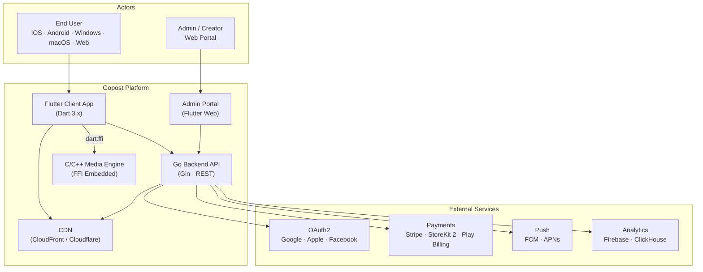

---

## 2. Container Diagram (C4 Level 2)

> Ref: [02-system-architecture.md](02-system-architecture.md), [04-backend-architecture.md](04-backend-architecture.md)

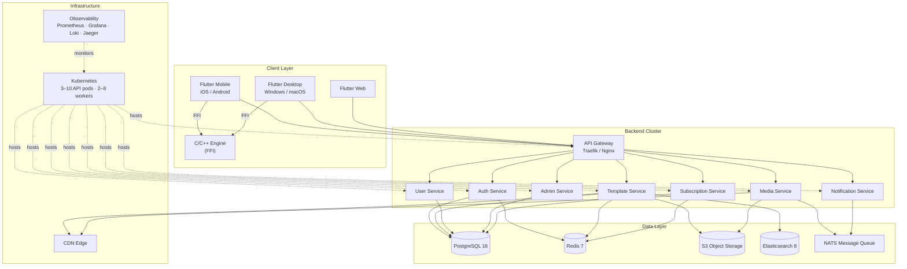

---

## 3. Frontend Module Dependency Graph

> Ref: [03-frontend-architecture.md](03-frontend-architecture.md)

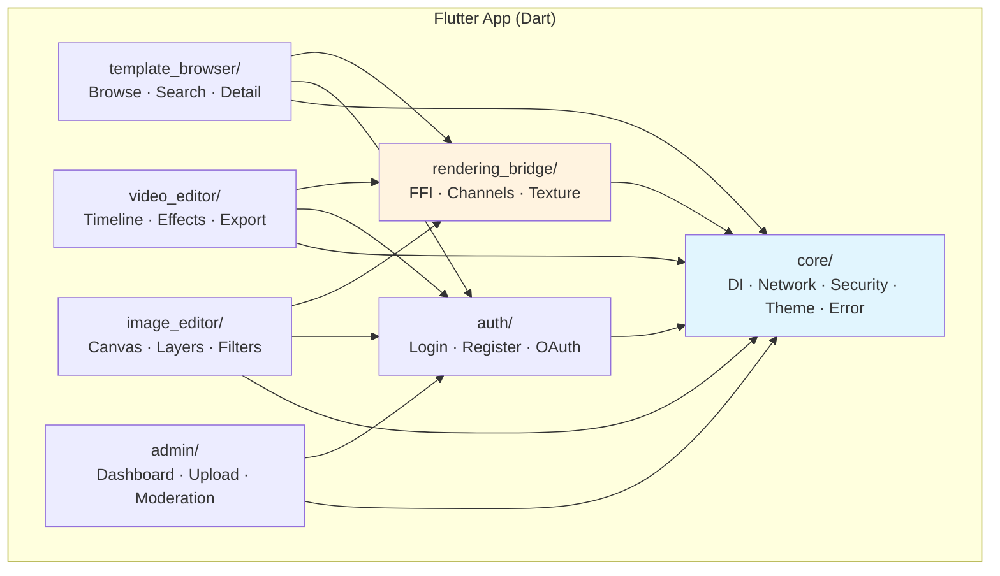

---

## 4. Backend Service Architecture

> Ref: [04-backend-architecture.md](04-backend-architecture.md)

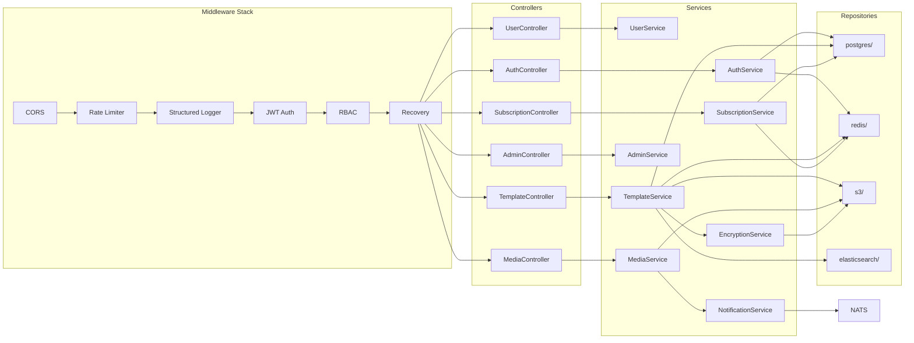

---

## 5. Platform Bridge (Flutter ↔ C/C++ Engine)

> Ref: [02-system-architecture.md](02-system-architecture.md), [03-frontend-architecture.md](03-frontend-architecture.md), [05-media-processing-engine.md](05-media-processing-engine.md)

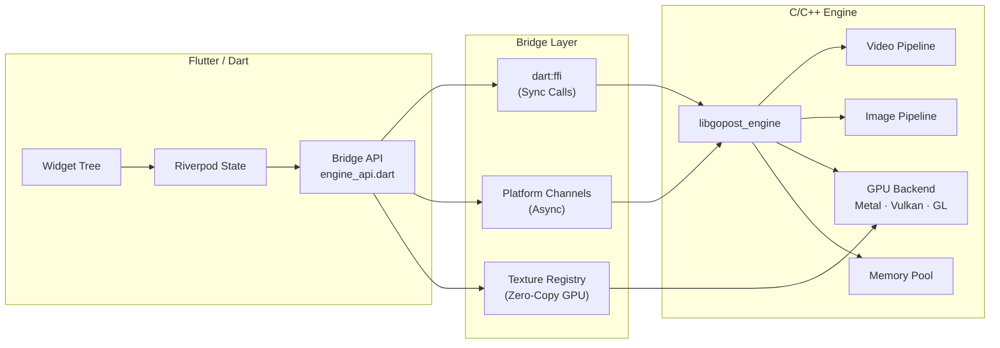

---

## 6. Template Lifecycle (End-to-End)

> Ref: [06-secure-template-system.md](06-secure-template-system.md)

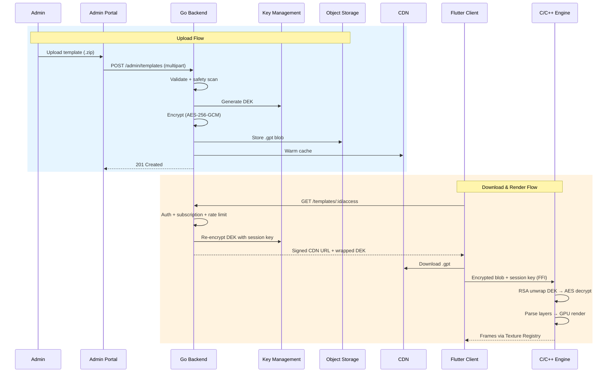

---

## 7. Security Architecture Layers

> Ref: [07-security-architecture.md](07-security-architecture.md)

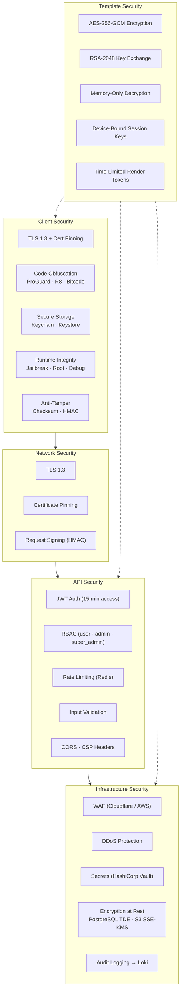

---

## 8. Infrastructure & DevOps

> Ref: [09-infrastructure-devops.md](09-infrastructure-devops.md)

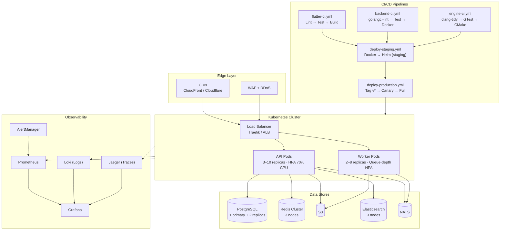

---

## 9. Database Schema (ER Overview)

> Ref: [12-database-schema.md](12-database-schema.md)

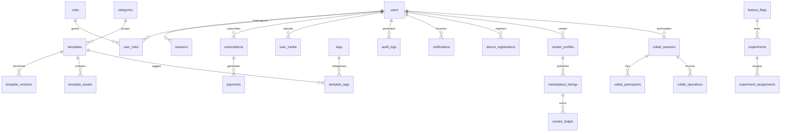

---

## 10. Performance Targets

> Ref: [08-performance-memory-strategy.md](08-performance-memory-strategy.md)

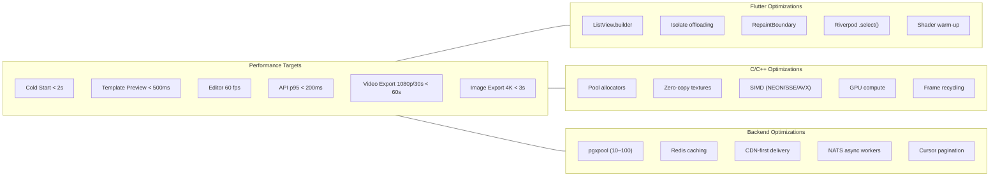

---

## 11. Disaster Recovery

> Ref: [16-disaster-recovery-business-continuity.md](16-disaster-recovery-business-continuity.md)

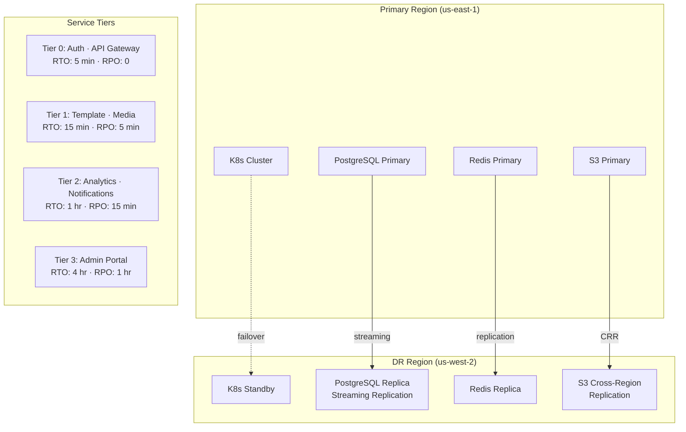

---

## Cross-Module Dependency Map

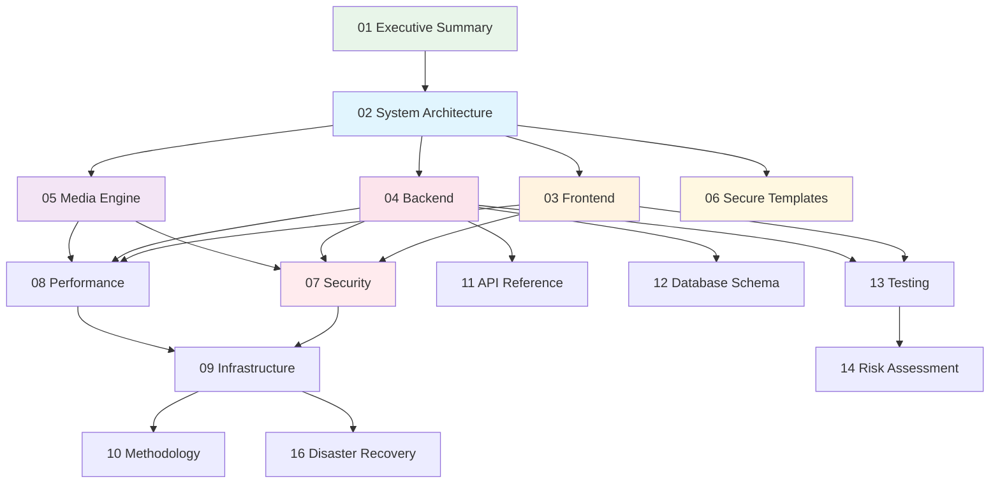
