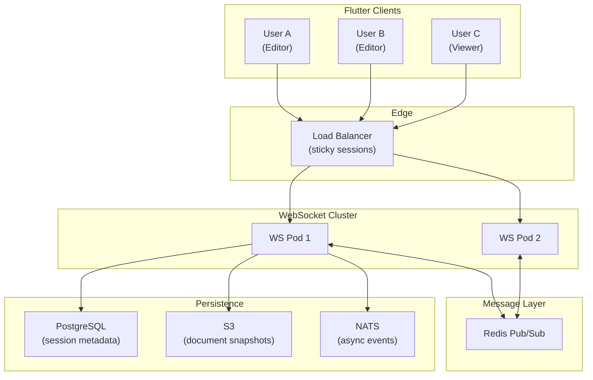
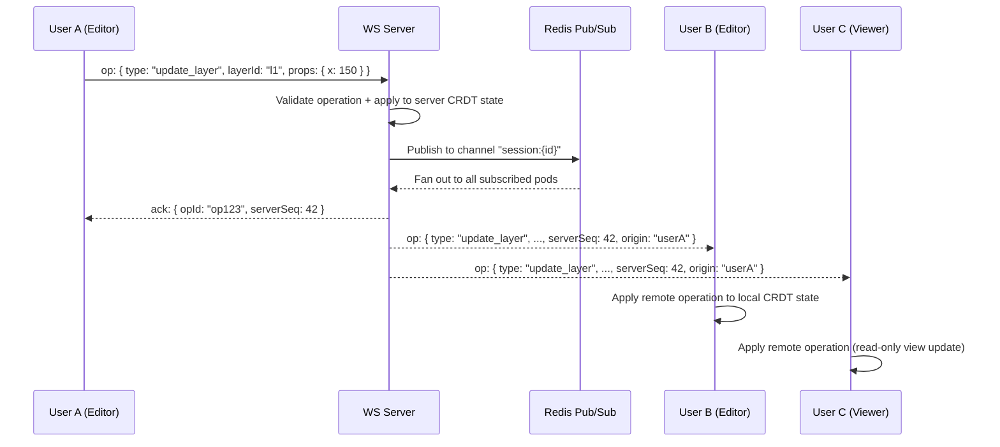
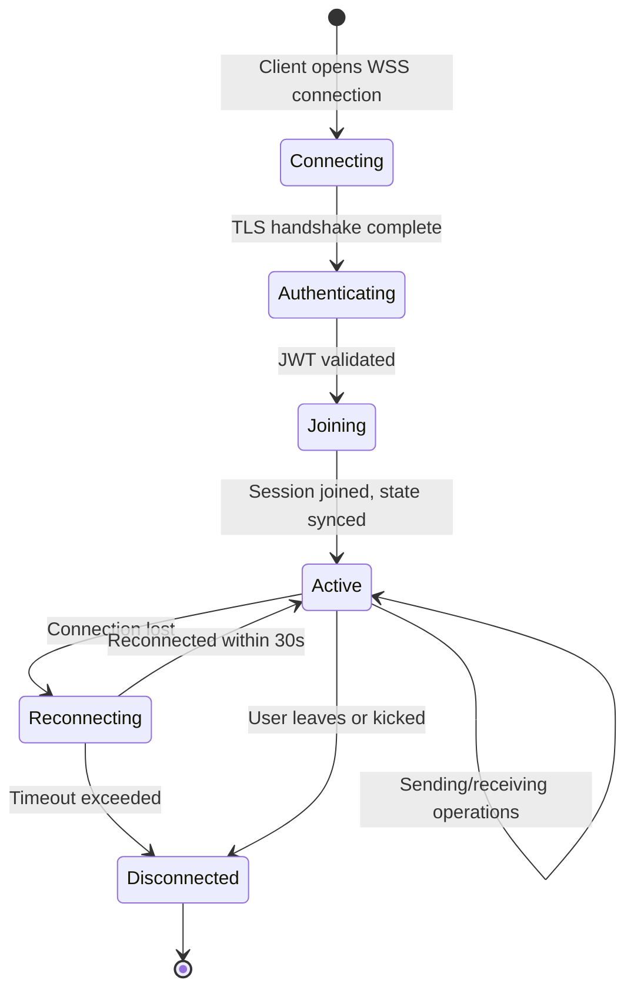
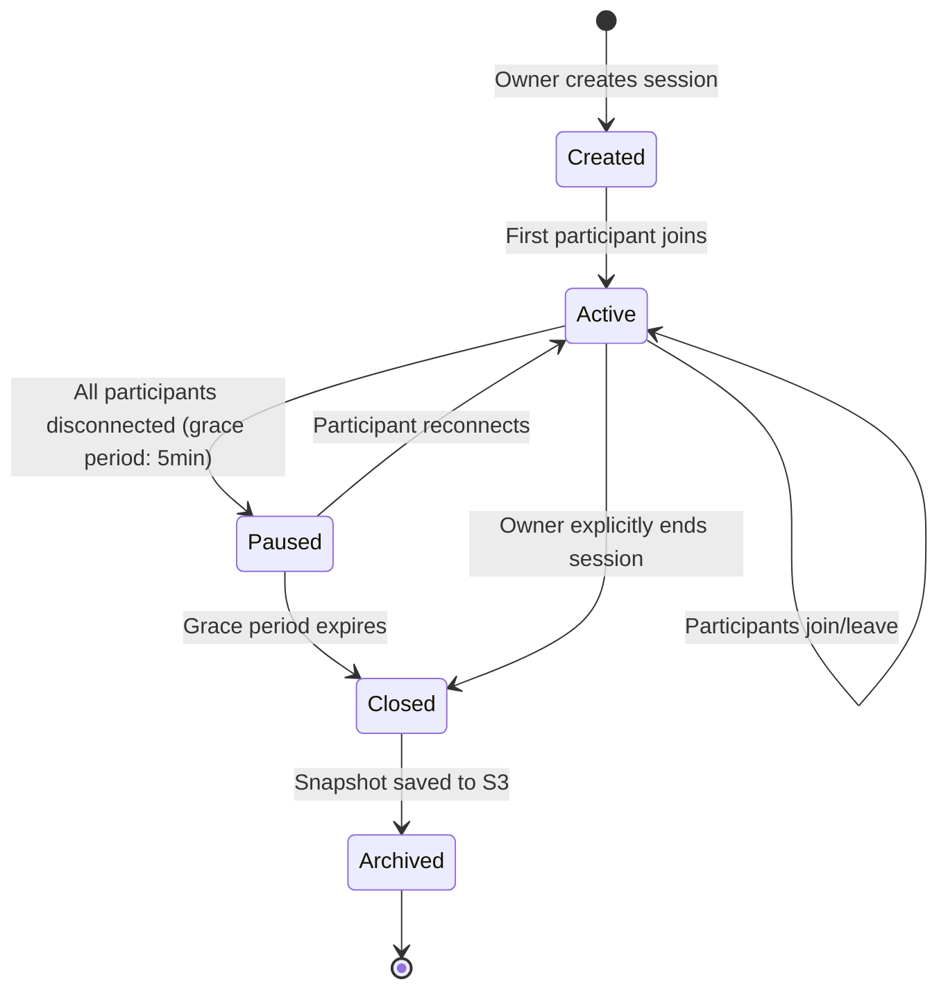
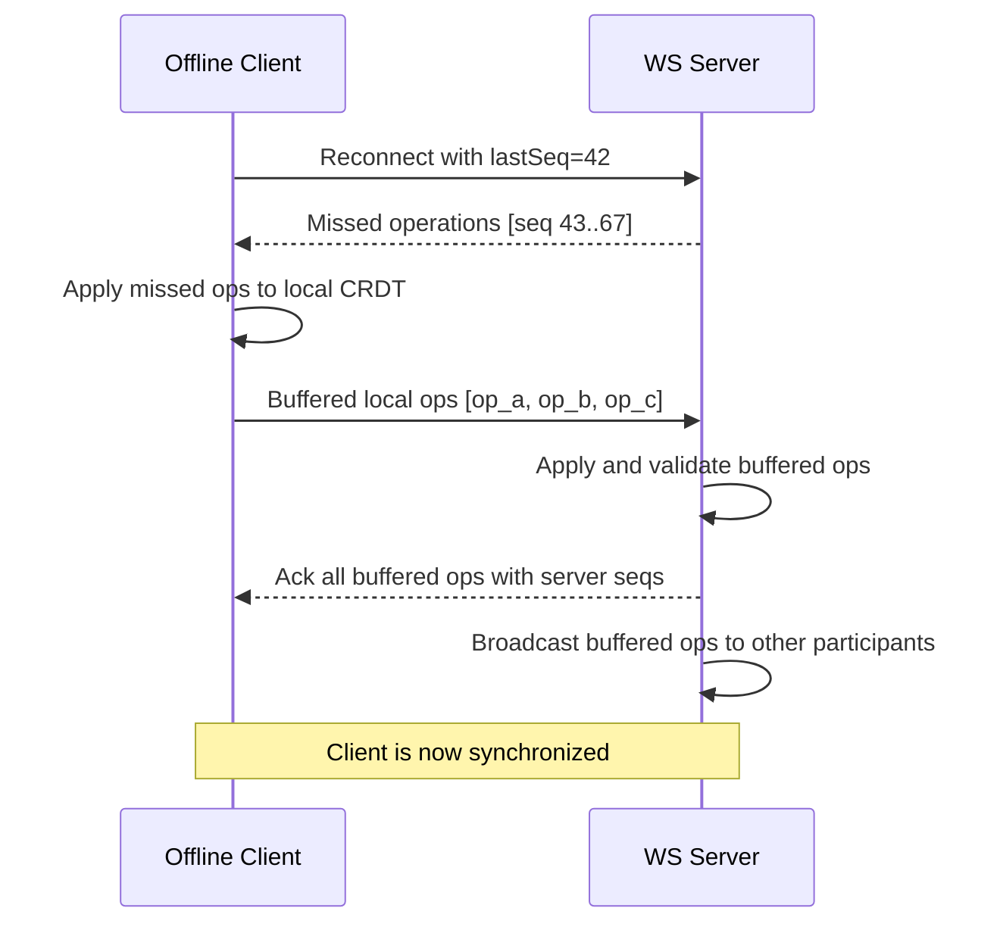

# Gopost — Real-Time Collaboration Architecture

> **Version:** 1.0.0
> **Date:** February 23, 2026
> **Classification:** Internal — Engineering Reference
> **Audience:** Flutter Engineers, Backend Engineers, C++ Engine Engineers

---

## Table of Contents

1. [Overview](#1-overview)
2. [Collaboration Model](#2-collaboration-model)
3. [WebSocket Infrastructure](#3-websocket-infrastructure)
4. [Conflict Resolution (CRDT)](#4-conflict-resolution-crdt)
5. [Presence System](#5-presence-system)
6. [Session Management](#6-session-management)
7. [Permission Model](#7-permission-model)
8. [Offline and Reconnection](#8-offline-and-reconnection)
9. [Performance and Scalability](#9-performance-and-scalability)
10. [Cross-System Integration](#10-cross-system-integration)
11. [Database Schema Extensions](#11-database-schema-extensions)
12. [API and WebSocket Protocol](#12-api-and-websocket-protocol)
13. [Sprint Stories](#13-sprint-stories)

---

## 1. Overview

Real-time collaboration allows multiple users to simultaneously edit the same template in both the image and video editors. This feature targets the Creator plan tier, enabling teams and collaborators to work together with live cursors, synchronized state, and conflict-free concurrent edits.

### 1.1 Goals

| Goal | Metric |
|------|--------|
| Sub-200ms edit propagation | p95 latency <200ms for operation broadcast |
| Support 2–8 concurrent editors per session | No degradation with 8 users |
| Zero data loss on concurrent edits | CRDT guarantees eventual consistency |
| Graceful offline handling | Edits queue locally, merge on reconnect |
| Minimal bandwidth | <5KB/s per idle participant, <50KB/s during active editing |

### 1.2 Scope (V1)

| In Scope | Out of Scope (V2+) |
|----------|-------------------|
| Image editor collaboration | Video editor timeline collaboration (V2) |
| Layer property edits (position, color, text content) | Simultaneous brush strokes on same layer (V2) |
| Presence indicators (cursors, selections) | Voice/video chat (V3) |
| Permission model (owner, editor, viewer) | Comments and annotations (V2) |
| Invite via link | Real-time chat sidebar (V2) |

### 1.3 Dependencies

| System | Dependency |
|--------|------------|
| WebSocket server | New Go service or extension of existing API |
| Image Editor Engine (`libgopost_ie`) | Operation-based state mutations via C API |
| Redis | Pub/Sub for cross-pod message fan-out |
| NATS | Session event bus for worker coordination |
| Subscription system | Creator plan entitlement check |

---

## 2. Collaboration Model

### 2.1 Architecture Overview



### 2.2 Operation Flow



### 2.3 Document Model

The collaborative document is a CRDT representation of the editor state:

```
CollaborativeDocument {
    sessionId: UUID
    templateId: UUID
    version: int64            // monotonically increasing server sequence
    layers: CRDTMap<LayerId, LayerState>
    canvasProperties: CRDTMap<string, Value>
    participants: Map<UserId, Participant>
}

LayerState {
    id: LayerId
    type: string              // "text", "image", "shape", "group"
    properties: CRDTMap<string, Value>  // x, y, width, height, rotation, opacity, ...
    content: CRDTRegister<Value>        // text content, image ref, etc.
    zIndex: CRDTCounter
    visible: CRDTRegister<bool>
    locked: CRDTRegister<bool>
    lockedBy: CRDTRegister<UserId?>     // soft-lock for editing
}
```

---

## 3. WebSocket Infrastructure

### 3.1 Server Architecture

| Component | Technology | Role |
|-----------|-----------|------|
| **WS Server** | Go + `gorilla/websocket` or `nhooyr.io/websocket` | Handle connections, message routing |
| **Connection Manager** | In-memory per pod | Track connections per session |
| **Redis Pub/Sub** | Redis 7 | Cross-pod message fan-out for horizontally scaled WS pods |
| **Session Store** | PostgreSQL + Redis cache | Session metadata, participant list, permissions |
| **Snapshot Store** | S3 | Periodic full-state snapshots for recovery and late-joiners |

### 3.2 Connection Lifecycle



### 3.3 Connection URL

```
wss://ws.gopost.app/v1/collaborate/{sessionId}?token={jwt}
```

### 3.4 Heartbeat Protocol

| Parameter | Value |
|-----------|-------|
| Ping interval | 15 seconds (server → client) |
| Pong timeout | 5 seconds |
| Missed pongs before disconnect | 2 consecutive |
| Client-side reconnection | Exponential backoff: 1s, 2s, 4s, 8s, 16s, max 30s |

### 3.5 Horizontal Scaling

```
Client A ──→ WS Pod 1 ──┐
                         ├──→ Redis Pub/Sub (channel: session:{id})
Client B ──→ WS Pod 2 ──┘

When Pod 1 receives an op from Client A:
1. Apply to local CRDT state
2. Publish to Redis channel
3. Pod 2 receives from Redis, forwards to Client B
```

| Scaling Parameter | Value |
|-------------------|-------|
| Max connections per pod | 10,000 |
| Target pods | 2–6 (HPA on connection count) |
| Redis Pub/Sub channels | 1 per active session |
| Sticky sessions | Required (IP hash or cookie-based at LB) |

---

## 4. Conflict Resolution (CRDT)

### 4.1 Why CRDT over OT

| Factor | OT (Operational Transform) | CRDT (Conflict-free Replicated Data Types) |
|--------|---------------------------|---------------------------------------------|
| Server requirement | Central transform server required | Decentralized, server optional |
| Complexity | Complex transform functions per operation type | Self-resolving data structures |
| Offline support | Difficult (requires server for transforms) | Native (merge on reconnect) |
| Correctness proof | Hard to prove for complex operations | Mathematically proven convergence |
| Bandwidth | Smaller operations | Slightly larger state, but operations are compact |

**Decision:** CRDT, specifically using an adapted **Automerge**-style approach for property maps and **Last-Writer-Wins Register (LWWRegister)** for atomic values.

### 4.2 CRDT Types Used

| CRDT Type | Used For | Conflict Resolution |
|-----------|----------|-------------------|
| **LWW-Register** | Scalar properties (x, y, width, rotation, text content, opacity) | Latest timestamp wins; ties broken by node ID |
| **LWW-Element-Map** | Layer properties map, canvas properties | Per-key LWW; keys independently resolvable |
| **OR-Set (Observed-Remove Set)** | Layer collection (add/remove layers) | Add wins over concurrent remove |
| **Counter** | z-index ordering | Increment only; deterministic ordering |

### 4.3 Operation Types

```go
// internal/collaboration/operations.go

type OperationType string

const (
    OpAddLayer       OperationType = "add_layer"
    OpRemoveLayer    OperationType = "remove_layer"
    OpUpdateProperty OperationType = "update_property"
    OpReorderLayer   OperationType = "reorder_layer"
    OpLockLayer      OperationType = "lock_layer"
    OpUnlockLayer    OperationType = "unlock_layer"
    OpUpdateCanvas   OperationType = "update_canvas"
    OpBatchUpdate    OperationType = "batch_update"
)

type Operation struct {
    ID         string            `json:"id"`
    Type       OperationType     `json:"type"`
    LayerID    string            `json:"layerId,omitempty"`
    Properties map[string]any    `json:"properties,omitempty"`
    Timestamp  HybridLogicalClock `json:"timestamp"`
    Origin     string            `json:"origin"`
    ServerSeq  int64             `json:"serverSeq,omitempty"`
}
```

### 4.4 Hybrid Logical Clock (HLC)

To order events across clients with potentially skewed wall clocks:

```go
type HybridLogicalClock struct {
    WallTime  int64  `json:"wall"`   // milliseconds since epoch
    Counter   uint32 `json:"counter"`
    NodeID    string `json:"node"`   // unique per client session
}
```

**Comparison:** `(wall, counter, nodeID)` — lexicographic ordering ensures total order even with clock skew up to ±5 seconds.

### 4.5 Conflict Scenarios and Resolution

| Scenario | Resolution |
|----------|------------|
| A moves layer to (100, 200), B moves same layer to (300, 400) simultaneously | LWW: later timestamp wins; both see final position |
| A changes text to "Hello", B changes same text to "World" | LWW: later timestamp wins; loser sees their text replaced |
| A deletes layer, B edits same layer simultaneously | OR-Set: add wins → layer persists with B's edits; A sees layer reappear |
| A adds layer at z-index 5, B adds layer at z-index 5 | Counter CRDT: deterministic ordering by nodeID as tiebreaker |
| A locks layer, B edits same layer | Soft-lock: B's edit is rejected client-side with "layer locked by A" indicator |

### 4.6 Soft Locking

Soft locks prevent editing conflicts at the UX level (not a CRDT requirement, but improves experience):

| Rule | Behavior |
|------|----------|
| Selecting a layer | Broadcasts `lock_layer` with 30s TTL |
| Deselecting a layer | Broadcasts `unlock_layer` |
| TTL expiry | Auto-unlocks if client disconnects or forgets |
| Override | Owner/admin can force-unlock |

---

## 5. Presence System

### 5.1 Presence Data

Each participant broadcasts their presence at regular intervals:

```json
{
    "type": "presence",
    "userId": "user_abc",
    "displayName": "Alice",
    "avatarUrl": "https://...",
    "cursor": { "x": 245.5, "y": 132.0, "visible": true },
    "selection": { "layerIds": ["layer_1", "layer_3"] },
    "viewport": { "x": 0, "y": 0, "zoom": 1.2 },
    "status": "active",
    "color": "#FF6B6B"
}
```

### 5.2 Presence Update Strategy

| Event | Broadcast Frequency | Payload |
|-------|---------------------|---------|
| Cursor move | Throttled to 20Hz (50ms intervals) | `{ cursor: { x, y } }` |
| Layer selection | Immediate | `{ selection: { layerIds } }` |
| Viewport change | Throttled to 5Hz (200ms) | `{ viewport: { x, y, zoom } }` |
| Status change | Immediate | `{ status: "active" | "idle" | "away" }` |
| Join/leave | Immediate | Full presence object |

### 5.3 Presence UI Elements

| Element | Description |
|---------|-------------|
| **Participant avatars** | Top-right corner, stacked avatars with count badge. Each avatar has colored ring matching cursor color |
| **Remote cursors** | Named cursors rendered on canvas with participant's assigned color and name label |
| **Selection indicators** | Colored border on layers selected by remote users, with name tooltip |
| **Activity status** | Green dot (active), yellow dot (idle >2min), grey dot (away >5min) |
| **Follow mode** | "Follow [User]" button: local viewport mirrors the followed user's viewport in real-time |

### 5.4 Color Assignment

Each participant is assigned a deterministic color from a palette of 8 high-contrast colors:

```dart
const collaboratorColors = [
  Color(0xFFFF6B6B), // Red
  Color(0xFF4ECDC4), // Teal
  Color(0xFFFFE66D), // Yellow
  Color(0xFF95E1D3), // Mint
  Color(0xFFF38181), // Coral
  Color(0xFF6C5CE7), // Purple
  Color(0xFF00B894), // Green
  Color(0xFFFD79A8), // Pink
];
// color = collaboratorColors[participantIndex % collaboratorColors.length]
```

---

## 6. Session Management

### 6.1 Session Lifecycle



### 6.2 Session Properties

| Property | Value |
|----------|-------|
| Max participants | 8 (configurable per plan) |
| Session timeout (no activity) | 30 minutes |
| Disconnect grace period | 5 minutes |
| Snapshot interval | Every 30 seconds during active editing |
| Max session duration | 24 hours (renewable) |
| State persistence | Full CRDT state in Redis; periodic snapshots to S3 |

### 6.3 Invite System

| Method | Flow |
|--------|------|
| **Share link** | Owner generates link: `gopost.app/collab/{sessionId}?invite={token}` → recipient opens in app → joins session |
| **In-app invite** | Owner searches by username/email → sends invite notification → recipient accepts → joins |
| **QR code** | Same as share link, encoded as QR for in-person collaboration |

### 6.4 Late Joiner Sync

When a new participant joins an active session:

1. Server sends latest snapshot (full CRDT state serialized as binary)
2. Server replays any operations after the snapshot's sequence number
3. Client applies snapshot + buffered operations
4. Client is now synchronized and begins receiving live operations
5. Full participant presence list is sent

---

## 7. Permission Model

### 7.1 Roles

| Role | Capabilities |
|------|-------------|
| **Owner** | All editor permissions + manage participants + end session + transfer ownership |
| **Editor** | Add/edit/delete layers, modify canvas properties, lock layers |
| **Viewer** | View canvas, see real-time updates, cursor presence. No edit operations |

### 7.2 Permission Enforcement

```go
// internal/collaboration/permissions.go

type SessionPermission string

const (
    PermEditLayers   SessionPermission = "edit_layers"
    PermDeleteLayers SessionPermission = "delete_layers"
    PermAddLayers    SessionPermission = "add_layers"
    PermLockLayers   SessionPermission = "lock_layers"
    PermEditCanvas   SessionPermission = "edit_canvas"
    PermManageUsers  SessionPermission = "manage_users"
    PermEndSession   SessionPermission = "end_session"
)

var RolePermissions = map[string][]SessionPermission{
    "owner":  {PermEditLayers, PermDeleteLayers, PermAddLayers, PermLockLayers, PermEditCanvas, PermManageUsers, PermEndSession},
    "editor": {PermEditLayers, PermDeleteLayers, PermAddLayers, PermLockLayers, PermEditCanvas},
    "viewer": {},
}
```

### 7.3 Runtime Enforcement

- **Server-side:** Every incoming operation is checked against the sender's role before application
- **Client-side:** UI disables edit controls for viewers; shows lock overlays for locked layers
- **Role changes:** Owner can promote/demote participants in real-time; changes broadcast immediately

---

## 8. Offline and Reconnection

### 8.1 Offline Editing

When a participant loses connectivity:

1. Local edits continue against the local CRDT state
2. Operations are queued in an ordered buffer (IndexedDB on web, SQLite on mobile/desktop)
3. Presence broadcasts stop; other participants see status change to "disconnected"

### 8.2 Reconnection Merge



### 8.3 Conflict-Free Merge Guarantee

Because all state is CRDT-based:
- Missed remote operations and local buffered operations can be applied in any order
- The resulting state converges to the same value on all clients
- No manual conflict resolution UI is needed

### 8.4 Edge Cases

| Case | Handling |
|------|----------|
| Offline >5 minutes (session grace expired) | Client creates a local fork; on reconnect, prompts user to rejoin or save locally |
| Offline edits on a layer deleted by another user | CRDT OR-Set: layer re-appears with offline user's edits |
| Simultaneous offline edits conflict | LWW resolves automatically; reconnecting user may see their edit overwritten if remote edit has later timestamp |

---

## 9. Performance and Scalability

### 9.1 Bandwidth Optimization

| Technique | Detail |
|-----------|--------|
| **Delta operations** | Only changed properties sent (not full layer state) |
| **Operation batching** | Rapid successive edits on same property batched into single op (50ms debounce) |
| **Presence throttling** | Cursor: 20Hz max; viewport: 5Hz max |
| **Binary protocol** | MessagePack encoding for operations (30–50% smaller than JSON) |
| **Compression** | WebSocket per-message deflate enabled |

### 9.2 Bandwidth Estimates

| Scenario | Estimated Bandwidth (per client) |
|----------|----------------------------------|
| Idle (heartbeat + presence only) | ~2 KB/s |
| Moderate editing (1 op/s) | ~5 KB/s |
| Heavy editing (10 ops/s, e.g., dragging) | ~20 KB/s |
| 8 participants, all active | ~50 KB/s (receiving 7 streams) |

### 9.3 Server Resource Estimates

| Metric | Value |
|--------|-------|
| Memory per session (CRDT state) | ~50KB–500KB depending on layer count |
| Memory per connection | ~8KB (goroutine + buffers) |
| Redis memory per session | ~1KB (Pub/Sub metadata) + state cache |
| Target concurrent sessions per pod | 2,000 |
| Target concurrent connections per pod | 10,000 |

### 9.4 Snapshot Strategy

| Trigger | Action |
|---------|--------|
| Every 30 seconds during active editing | Serialize CRDT state → store in Redis (overwrite) |
| Every 5 minutes | Persist Redis snapshot to S3 (versioned) |
| Session close | Final snapshot to S3; clean up Redis state |
| Participant join | Serve latest Redis snapshot for fast sync |

---

## 10. Cross-System Integration

### 10.1 Feature Flag and Kill Switch

Collaboration is gated by feature flags (see `docs/feature-flags/01-feature-flag-system.md`):

| Flag Key | Type | Purpose |
|----------|------|---------|
| `ks_collaboration` | Kill Switch | Emergency disable for all collaboration features |
| `collaboration_enabled` | Boolean | Gradual rollout of collaboration to Creator subscribers |
| `collab_max_participants` | Number | Override max participant count (for testing: 2, rollout: 4, full: 8) |

**Kill switch behavior when `ks_collaboration` is disabled:**
1. Server rejects new session creation with HTTP 503 + message "Collaboration temporarily unavailable"
2. Existing active sessions: server sends `session_ended` message with `reason: "service_maintenance"` to all participants
3. Client receives graceful disconnect → saves local state → shows banner "Collaboration is temporarily unavailable. Your work has been saved."
4. Collab entry points in UI (share button, invite) are hidden
5. Re-enabling the flag restores all entry points; sessions must be recreated

### 10.2 Template Encryption Interaction

Collaboration operates on decrypted template state. Integration with the secure template system (`docs/architecture/06-secure-template-system.md`):

| Concern | Resolution |
|---------|------------|
| **Template decryption** | Session owner's client decrypts the `.gpt` template on session creation. The CRDT state is built from the decrypted layer/asset data |
| **CRDT state storage** | CRDT snapshots in Redis and S3 are **encrypted at rest** (AES-256 via server-managed keys, not the per-template key) |
| **Asset references** | CRDT stores asset references (storage keys), not raw binary assets. Participants download assets separately via the existing authenticated CDN pipeline |
| **Session end** | On session close, the final CRDT state is serialized back to a `.gpt` template (re-encrypted with the template key) and saved |
| **No key sharing** | Template decryption keys are never shared over the WebSocket. Each participant fetches assets through the standard authenticated API |

### 10.3 Rate Limiting

| Scope | Rate Limit | Enforcement |
|-------|------------|-------------|
| Operations per user per session | 100 ops/second | Server-side; excess operations rejected with error `4006` |
| Presence updates per user | 30/second (cursor: 20Hz + selection/viewport: 10Hz) | Client-side throttle + server drop |
| Session creation per user | 5/hour | API rate limiter |
| Invite sending per session | 20/hour | API rate limiter |
| WebSocket connection attempts | 10/minute per IP | Load balancer |

### 10.4 Session Draining on Pod Shutdown

When a WebSocket pod receives a SIGTERM (Kubernetes rolling update or scale-down):

1. Pod stops accepting new WebSocket connections (removed from LB)
2. Pod sends `session_ended` with `reason: "server_maintenance"` to all connected clients
3. Clients auto-reconnect (exponential backoff) → routed to remaining healthy pods
4. Pod waits up to 30 seconds for graceful disconnect of all connections
5. If connections remain after 30s, force-close with WebSocket close frame
6. Pod publishes "session_migrated" event to Redis so other pods know to expect reconnections

**Kubernetes config:**
```yaml
terminationGracePeriodSeconds: 45
lifecycle:
  preStop:
    exec:
      command: ["/bin/sh", "-c", "sleep 5"]  # allow LB to drain
```

### 10.5 Invite Token Security

| Measure | Implementation |
|---------|---------------|
| Token format | Cryptographically random 64-character hex string (`crypto/rand`) |
| One-time use | Optional per invite; configurable by session owner |
| Revocation | Owner can revoke any pending invite (status → `expired`) |
| Abuse prevention | Max 20 invites per session; invite links expire after 24h (configurable) |
| Rate limiting | 5 invite link generations per minute per session |

### 10.6 Disaster Recovery

Collaboration sessions are classified as **Tier 2** in the DR plan (see `docs/architecture/16-disaster-recovery-business-continuity.md`):

| Scenario | Behavior |
|----------|----------|
| **WS pod failure** | Clients auto-reconnect to surviving pods; Redis Pub/Sub re-subscribed; in-progress operations may need replay from snapshot |
| **Redis failure** | Active sessions lose Pub/Sub fan-out. Single-pod sessions continue; multi-pod sessions degrade (users on same pod see each other, cross-pod sync paused until Redis recovers) |
| **Regional failover** | All collaboration sessions are terminated. Users are notified. Templates auto-saved from last snapshot. Sessions must be manually recreated in the DR region |
| **Data loss** | CRDT snapshots in S3 are cross-region replicated. Max data loss = 5 minutes (S3 snapshot interval) |

---

## 11. Database Schema Extensions

### 10.1 New Tables

```sql
-- Collaboration sessions
CREATE TABLE collab_sessions (
    id              UUID PRIMARY KEY DEFAULT gen_random_uuid(),
    template_id     UUID NOT NULL REFERENCES templates(id),
    owner_id        UUID NOT NULL REFERENCES users(id),
    status          VARCHAR(20) NOT NULL DEFAULT 'created'
        CHECK (status IN ('created', 'active', 'paused', 'closed', 'archived')),
    max_participants INT NOT NULL DEFAULT 8,
    invite_token    VARCHAR(64) NOT NULL UNIQUE,
    snapshot_key    VARCHAR(512),
    last_activity_at TIMESTAMP NOT NULL DEFAULT NOW(),
    created_at      TIMESTAMP NOT NULL DEFAULT NOW(),
    closed_at       TIMESTAMP
);

-- Session participants
CREATE TABLE collab_participants (
    id              UUID PRIMARY KEY DEFAULT gen_random_uuid(),
    session_id      UUID NOT NULL REFERENCES collab_sessions(id),
    user_id         UUID NOT NULL REFERENCES users(id),
    role            VARCHAR(10) NOT NULL DEFAULT 'editor'
        CHECK (role IN ('owner', 'editor', 'viewer')),
    color_index     INT NOT NULL,
    joined_at       TIMESTAMP NOT NULL DEFAULT NOW(),
    left_at         TIMESTAMP,
    UNIQUE(session_id, user_id)
);

-- Session operation log (append-only, for replay and audit)
CREATE TABLE collab_operations (
    id              UUID PRIMARY KEY DEFAULT gen_random_uuid(),
    session_id      UUID NOT NULL REFERENCES collab_sessions(id),
    user_id         UUID NOT NULL REFERENCES users(id),
    server_seq      BIGINT NOT NULL,
    operation_type  VARCHAR(30) NOT NULL,
    payload         JSONB NOT NULL,
    created_at      TIMESTAMP NOT NULL DEFAULT NOW(),
    UNIQUE(session_id, server_seq)
);

-- Session invites
CREATE TABLE collab_invites (
    id              UUID PRIMARY KEY DEFAULT gen_random_uuid(),
    session_id      UUID NOT NULL REFERENCES collab_sessions(id),
    inviter_id      UUID NOT NULL REFERENCES users(id),
    invitee_email   VARCHAR(255),
    invitee_user_id UUID REFERENCES users(id),
    role            VARCHAR(10) NOT NULL DEFAULT 'editor',
    status          VARCHAR(20) NOT NULL DEFAULT 'pending'
        CHECK (status IN ('pending', 'accepted', 'declined', 'expired')),
    expires_at      TIMESTAMP NOT NULL,
    created_at      TIMESTAMP NOT NULL DEFAULT NOW()
);
```

### 10.2 Indexes

```sql
CREATE INDEX idx_collab_sessions_template ON collab_sessions(template_id);
CREATE INDEX idx_collab_sessions_owner ON collab_sessions(owner_id);
CREATE INDEX idx_collab_sessions_status ON collab_sessions(status) WHERE status IN ('active', 'paused');
CREATE INDEX idx_collab_sessions_invite ON collab_sessions(invite_token);

CREATE INDEX idx_collab_participants_session ON collab_participants(session_id);
CREATE INDEX idx_collab_participants_user ON collab_participants(user_id);
CREATE INDEX idx_collab_participants_active ON collab_participants(session_id)
    WHERE left_at IS NULL;

CREATE INDEX idx_collab_operations_session_seq ON collab_operations(session_id, server_seq);
CREATE INDEX idx_collab_operations_session_time ON collab_operations(session_id, created_at);

CREATE INDEX idx_collab_invites_session ON collab_invites(session_id);
CREATE INDEX idx_collab_invites_invitee ON collab_invites(invitee_user_id);
CREATE INDEX idx_collab_invites_email ON collab_invites(invitee_email);
```

### 10.3 Partitioning Strategy

The `collab_operations` table will grow rapidly. Partition by `session_id` range or use time-based partitioning:

```sql
-- Time-based partitioning (monthly)
CREATE TABLE collab_operations (
    -- ... columns as above ...
) PARTITION BY RANGE (created_at);

CREATE TABLE collab_operations_2026_q1 PARTITION OF collab_operations
    FOR VALUES FROM ('2026-01-01') TO ('2026-04-01');
CREATE TABLE collab_operations_2026_q2 PARTITION OF collab_operations
    FOR VALUES FROM ('2026-04-01') TO ('2026-07-01');
-- ... and so on, auto-created by a cron job
```

---

## 11. API and WebSocket Protocol

### 11.1 REST API Endpoints

| Method | Path | Description | Auth |
|--------|------|-------------|------|
| `POST` | `/api/v1/collaborate/sessions` | Create collaboration session | Creator |
| `GET` | `/api/v1/collaborate/sessions/{id}` | Get session info | Participant |
| `POST` | `/api/v1/collaborate/sessions/{id}/invite` | Invite a user | Owner |
| `POST` | `/api/v1/collaborate/sessions/{id}/join` | Join via invite token | Authenticated |
| `POST` | `/api/v1/collaborate/sessions/{id}/leave` | Leave session | Participant |
| `POST` | `/api/v1/collaborate/sessions/{id}/end` | End session | Owner |
| `PATCH` | `/api/v1/collaborate/sessions/{id}/participants/{userId}` | Change participant role | Owner |
| `DELETE` | `/api/v1/collaborate/sessions/{id}/participants/{userId}` | Remove participant | Owner |
| `GET` | `/api/v1/collaborate/sessions/{id}/history` | Get operation history | Participant |

### 11.2 WebSocket Protocol

**Connection:** `wss://ws.gopost.app/v1/collaborate/{sessionId}?token={jwt}`

**Message envelope:**

```json
{
    "type": "op|ack|presence|error|sync|ping|pong",
    "payload": { ... },
    "timestamp": { "wall": 1708700000000, "counter": 1, "node": "client_abc" }
}
```

### 11.3 Message Types

| Type | Direction | Payload |
|------|-----------|---------|
| `op` | Client → Server | `{ opId, opType, layerId?, properties?, ... }` |
| `ack` | Server → Client | `{ opId, serverSeq, accepted: true }` |
| `op` | Server → Client | `{ opId, opType, ..., serverSeq, origin }` (broadcast) |
| `presence` | Bidirectional | `{ userId, cursor?, selection?, viewport?, status? }` |
| `sync` | Server → Client | `{ snapshot: <binary>, fromSeq, ops: [...] }` (on join/reconnect) |
| `error` | Server → Client | `{ code, message }` |
| `ping` | Server → Client | `{}` |
| `pong` | Client → Server | `{}` |
| `participant_joined` | Server → Client | `{ userId, displayName, role, color }` |
| `participant_left` | Server → Client | `{ userId }` |
| `role_changed` | Server → Client | `{ userId, newRole }` |
| `session_ended` | Server → Client | `{ reason }` |

### 11.4 Error Codes

| Code | Meaning | Client Action |
|------|---------|---------------|
| `4001` | Invalid session | Show error, return to template list |
| `4002` | Unauthorized | Re-authenticate |
| `4003` | Session full | Show "session full" message |
| `4004` | Permission denied | Show permission error |
| `4005` | Session closed | Show "session ended" message |
| `4006` | Rate limited | Back off, retry |
| `4007` | Invalid operation | Log and ignore |
| `4008` | Not a Creator subscriber | Show upgrade prompt |

---

## 12. Sprint Stories

### Sprint Assignment

| Attribute | Value |
|---|---|
| **Phase** | Post-Launch / Parallel V2 |
| **Sprint(s)** | Sprint 21–24 (4 sprints, 8 weeks) |
| **Team** | 1 Flutter Engineer, 1 Go Backend Engineer, 1 C++ Engine Engineer (part-time) |
| **Predecessor** | Image Editor Engine, WebSocket capability |
| **Story Points Total** | 108 |

### Sprint 21: WebSocket Infrastructure & Session Management (28 pts)

| ID | Story | Acceptance Criteria | Points | Priority |
|---|---|---|---|---|
| COL-001 | WebSocket server with connection lifecycle management | - Go WS server handling connect/auth/disconnect<br/>- Heartbeat (15s ping, 5s pong timeout)<br/>- Sticky session support at LB | 8 | P0 |
| COL-002 | Redis Pub/Sub integration for cross-pod message routing | - Publish/subscribe per session channel<br/>- Messages fan out to all pods with subscribers<br/>- Connection cleanup on pod shutdown | 5 | P0 |
| COL-003 | Collaboration session CRUD (REST API + DB migration) | - Migration for `collab_sessions`, `collab_participants`<br/>- Create/get/end session endpoints<br/>- Max participant enforcement | 5 | P0 |
| COL-004 | Invite system (link, in-app, QR) | - Generate invite token/link<br/>- Migration for `collab_invites`<br/>- Join via token endpoint<br/>- Invite expiry (24h default) | 5 | P0 |
| COL-005 | Permission model and server-side enforcement | - Role-based operation validation<br/>- Reject unauthorized operations with error code<br/>- Role change broadcast | 5 | P0 |

### Sprint 22: CRDT Engine & Operation Sync (30 pts)

| ID | Story | Acceptance Criteria | Points | Priority |
|---|---|---|---|---|
| COL-006 | CRDT state management (LWW-Register, LWW-Map, OR-Set) | - Go implementation of LWW-Register, LWW-Element-Map, OR-Set<br/>- Hybrid Logical Clock implementation<br/>- Property-level merge correctness tests | 13 | P0 |
| COL-007 | Operation log and replay (DB + API) | - Migration for `collab_operations` with partitioning<br/>- Append operations on apply<br/>- Replay API for late joiners and reconnection | 5 | P0 |
| COL-008 | Snapshot system (Redis + S3) | - Serialize CRDT state to binary (MessagePack)<br/>- Store in Redis every 30s, S3 every 5min<br/>- Serve snapshot on join | 5 | P0 |
| COL-009 | Late-joiner sync protocol | - Send snapshot + buffered ops since snapshot<br/>- Client applies and reaches consistent state<br/>- Test: join mid-session, verify state matches | 5 | P0 |
| COL-010 | MessagePack binary encoding for operations | - Encode/decode operations with MessagePack<br/>- Per-message deflate on WebSocket<br/>- Benchmark: 30–50% smaller than JSON | 2 | P1 |

### Sprint 23: Client Integration & Presence (27 pts)

| ID | Story | Acceptance Criteria | Points | Priority |
|---|---|---|---|---|
| COL-011 | Flutter WebSocket client with reconnection logic | - Connect/disconnect/reconnect handling<br/>- Exponential backoff reconnection<br/>- Offline operation buffer (SQLite/IndexedDB) | 8 | P0 |
| COL-012 | Flutter CRDT client-side merge and state application | - Mirror CRDT types in Dart<br/>- Apply remote operations to local state<br/>- Integrate with image editor state (Riverpod) | 8 | P0 |
| COL-013 | Presence system — cursors, selections, status indicators | - Render remote cursors on canvas (20Hz update)<br/>- Layer selection borders with user color<br/>- Participant avatars with status dots | 5 | P0 |
| COL-014 | Soft-lock UI for layer editing | - Lock indicator on layers being edited by others<br/>- 30s TTL auto-unlock<br/>- "Locked by [User]" tooltip | 3 | P1 |
| COL-015 | Follow mode (viewport mirroring) | - "Follow [User]" toggle in participant panel<br/>- Local viewport mirrors followed user's viewport<br/>- Auto-disable on local pan/zoom | 3 | P2 |

### Sprint 24: Offline Merge, Testing & Polish (23 pts)

| ID | Story | Acceptance Criteria | Points | Priority |
|---|---|---|---|---|
| COL-016 | Offline editing and reconnection merge | - Queue operations locally during disconnect<br/>- Merge buffered ops on reconnect<br/>- Handle session-expired edge case (local fork prompt) | 8 | P0 |
| COL-017 | Collaboration UI polish — invite flow, participant panel, session controls | - Invite dialog (link/search/QR)<br/>- Participant panel (avatars, roles, kick/promote)<br/>- "End Session" confirmation | 5 | P0 |
| COL-018 | Load testing — 8 concurrent editors | - Simulate 8 users editing simultaneously<br/>- p95 operation latency <200ms<br/>- No data loss after 1000 concurrent operations | 5 | P1 |
| COL-019 | Conflict resolution integration tests | - Test all conflict scenarios from Section 4.5<br/>- Verify CRDT convergence across 3+ clients<br/>- Offline merge scenarios | 3 | P1 |
| COL-020 | Monitoring and observability for WS infrastructure | - Prometheus metrics: connections, ops/sec, latency, errors<br/>- Grafana dashboard for collab sessions<br/>- Alerting: connection spike, high error rate | 2 | P1 |

### Definition of Done

- [ ] All stories in this section marked complete
- [ ] Code reviewed and merged to `develop`
- [ ] Unit tests passing (≥ 90% coverage for new code)
- [ ] CRDT convergence property tests passing (100+ randomized test cases)
- [ ] Load test: 8 concurrent users, p95 <200ms, zero data loss
- [ ] WebSocket reconnection tested across all platforms
- [ ] Documentation updated
- [ ] No critical or high-severity bugs open
- [ ] Sprint review demo completed

---
