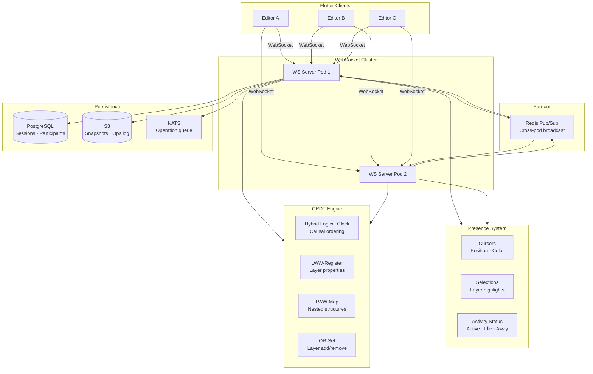
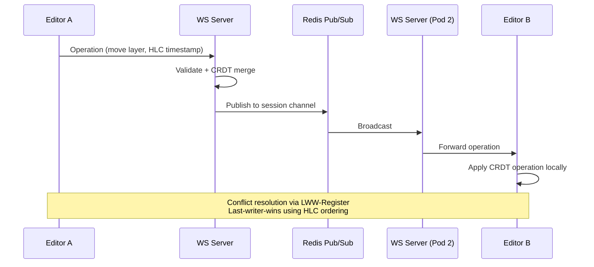
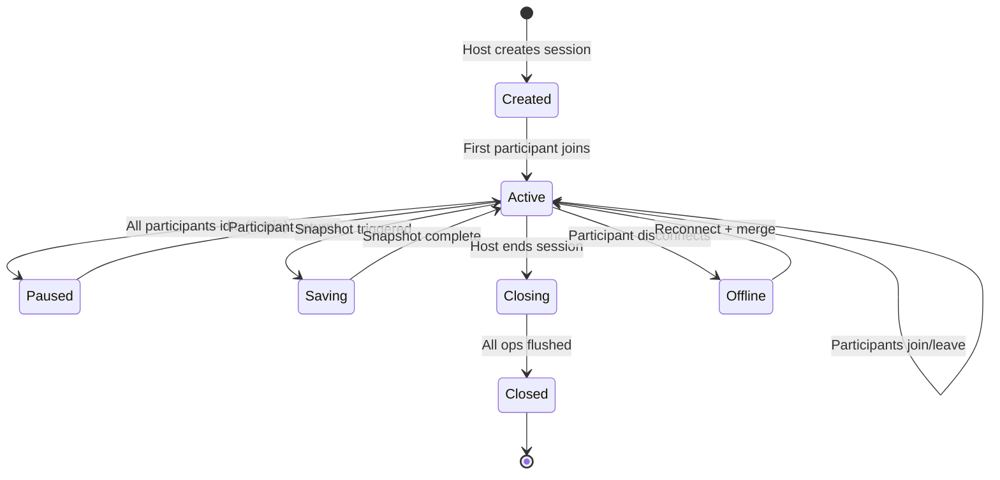

# Real-Time Collaboration — Architecture Diagram

> Maps to [01-real-time-collaboration.md](01-real-time-collaboration.md)

---

## Collaboration Architecture

---

## Operation Flow

---

## Session Lifecycle

