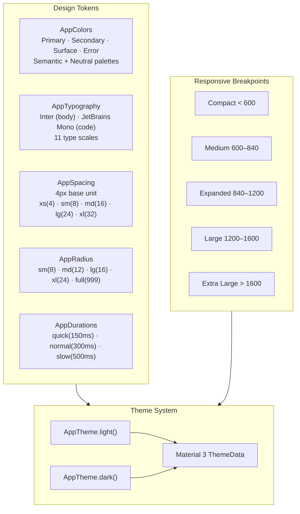
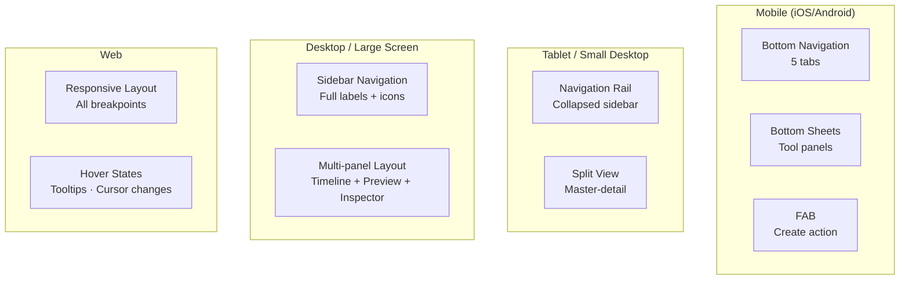

# Design System — Architecture Diagram

> Maps to [01-design-system.md](01-design-system.md)

---

## Design Token Hierarchy

```mermaid
graph TB
    subgraph tokens ["Design Tokens"]
        COLORS["AppColors<br/>Primary · Secondary · Surface · Error<br/>Semantic + Neutral palettes"]
        TYPO["AppTypography<br/>Inter (body) · JetBrains Mono (code)<br/>11 type scales"]
        SPACE["AppSpacing<br/>4px base unit<br/>xs(4) · sm(8) · md(16) · lg(24) · xl(32)"]
        RADIUS["AppRadius<br/>sm(8) · md(12) · lg(16) · xl(24) · full(999)"]
        DURATION["AppDurations<br/>quick(150ms) · normal(300ms) · slow(500ms)"]
    end

    subgraph breakpoints ["Responsive Breakpoints"]
        COMPACT["Compact < 600"]
        MEDIUM["Medium 600–840"]
        EXPANDED["Expanded 840–1200"]
        LARGE["Large 1200–1600"]
        XLARGE["Extra Large > 1600"]
    end

    subgraph theme ["Theme System"]
        LIGHT["AppTheme.light()"]
        DARK["AppTheme.dark()"]
        MAT3["Material 3 ThemeData"]
    end

    tokens --> theme
    breakpoints --> theme
    LIGHT & DARK --> MAT3
```

---

## Component Library

```mermaid
graph LR
    subgraph atoms ["Atoms"]
        BTN["GpButton<br/>primary · secondary · text · icon"]
        TF["GpTextField<br/>standard · search · multiline"]
        CHIP["GpChip<br/>filter · action · selection"]
        AVT["GpAvatar<br/>image · initials"]
        BADGE["GpBadge<br/>count · dot"]
    end

    subgraph molecules ["Molecules"]
        CARD["GpCard<br/>template · stats · feature"]
        DIALOG["GpDialog<br/>alert · confirm · input"]
        SHEET["GpBottomSheet<br/>modal · persistent"]
        SNACK["GpSnackbar<br/>info · success · error"]
    end

    subgraph organisms ["Organisms"]
        NAV["Navigation<br/>BottomNav · Rail · Drawer"]
        TOOLBAR["Toolbar<br/>Editor tools · Actions"]
        GRID2["TemplateGrid<br/>Masonry · Grid · List"]
    end

    subgraph templates_ds ["Templates"]
        BROWSE_T["Browse Layout"]
        EDITOR_T["Editor Layout"]
        ADMIN_T["Admin Layout"]
    end

    atoms --> molecules --> organisms --> templates_ds
```

---

## Platform Adaptation

```mermaid
graph TB
    subgraph mobile_ds ["Mobile (iOS/Android)"]
        M_NAV["Bottom Navigation<br/>5 tabs"]
        M_SHEET["Bottom Sheets<br/>Tool panels"]
        M_FAB["FAB<br/>Create action"]
    end

    subgraph tablet ["Tablet / Small Desktop"]
        T_NAV["Navigation Rail<br/>Collapsed sidebar"]
        T_SPLIT["Split View<br/>Master-detail"]
    end

    subgraph desktop_ds ["Desktop / Large Screen"]
        D_NAV["Sidebar Navigation<br/>Full labels + icons"]
        D_MULTI["Multi-panel Layout<br/>Timeline + Preview + Inspector"]
    end

    subgraph web_ds ["Web"]
        W_RESP["Responsive Layout<br/>All breakpoints"]
        W_HOVER["Hover States<br/>Tooltips · Cursor changes"]
    end
```
