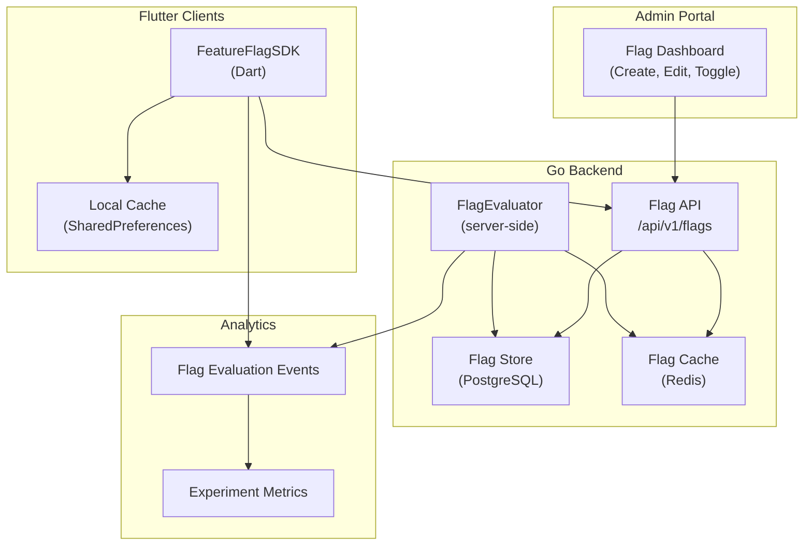
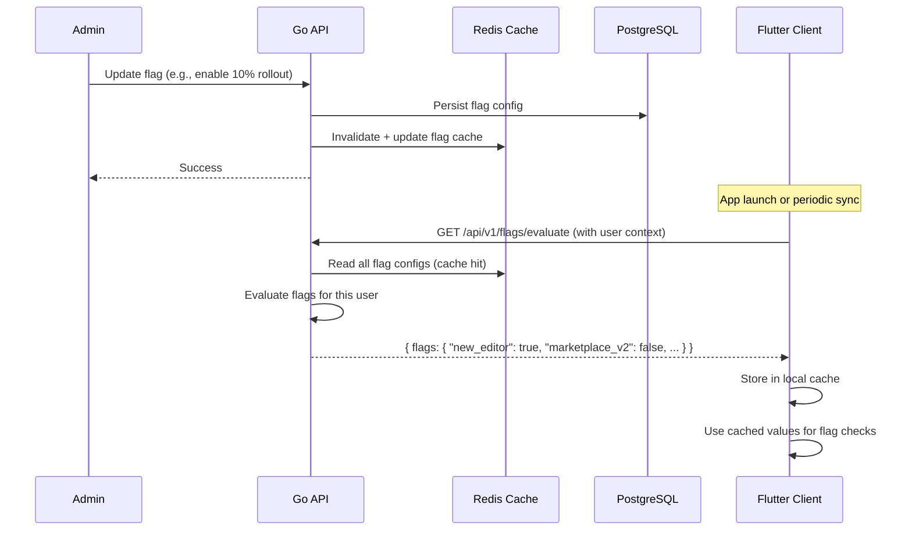
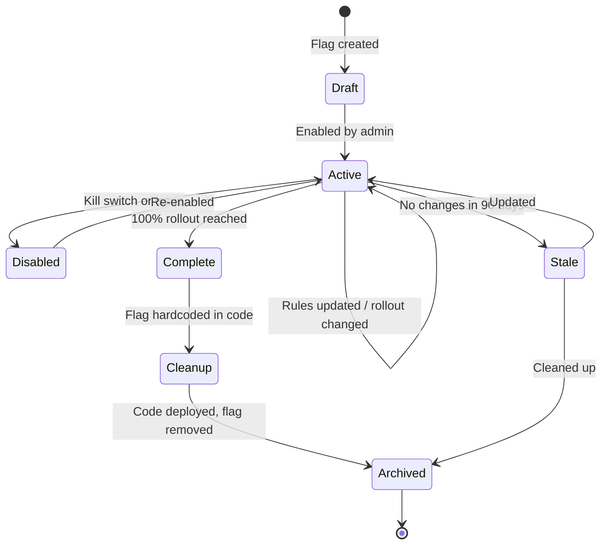

# Gopost — Feature Flag System Architecture

> **Version:** 1.0.0
> **Date:** February 23, 2026
> **Classification:** Internal — Engineering Reference
> **Audience:** Flutter Engineers, Backend Engineers, Product Manager

---

## Table of Contents

1. [Overview](#1-overview)
2. [Architecture](#2-architecture)
3. [Flag Types and Lifecycle](#3-flag-types-and-lifecycle)
4. [Gradual Rollout](#4-gradual-rollout)
5. [A/B Experiments](#5-ab-experiments)
6. [Kill Switches](#6-kill-switches)
7. [Analytics Integration](#7-analytics-integration)
8. [Client SDK (Flutter)](#8-client-sdk-flutter)
9. [Server SDK (Go)](#9-server-sdk-go)
10. [Admin Dashboard](#10-admin-dashboard)
11. [Database Schema](#11-database-schema)
12. [API Endpoints](#12-api-endpoints)
13. [Sprint Stories](#13-sprint-stories)

---

## 1. Overview

The feature flag system enables controlled feature rollout, A/B experimentation, and instant kill switches across all Gopost platforms without deploying new code. Flags are evaluated both server-side (Go API) and client-side (Flutter) with a synchronized configuration.

### 1.1 Goals

| Goal | Detail |
|------|--------|
| Zero-deployment feature control | Toggle features on/off from the admin dashboard without app releases |
| Gradual rollout | Roll out new features to 1% → 10% → 50% → 100% of users |
| A/B experimentation | Test multiple variants of a feature with measurable outcomes |
| Instant kill switch | Disable any feature immediately if it causes issues in production |
| Platform/version targeting | Enable features for specific platforms, app versions, or user segments |
| Audit trail | Complete history of who changed what flag and when |

### 1.2 Decision: Build vs Buy

| Option | Pros | Cons | Verdict |
|--------|------|------|---------|
| **Build in-house** | Full control, no vendor lock-in, no per-seat cost, integrates tightly with existing admin portal | Development effort, maintenance burden | **Selected for V1** |
| LaunchDarkly | Feature-rich, proven at scale | $10+/seat/mo, external dependency | Consider if scale exceeds in-house capacity |
| Unleash (self-hosted) | Open source, self-hosted | Operational overhead for separate service | Consider as replacement if in-house grows complex |

### 1.3 Design Principles

| Principle | Implementation |
|-----------|---------------|
| **Flags are temporary** | Every flag has a lifecycle; stale flags are cleaned up |
| **Server is source of truth** | Client caches flags but defers to server evaluation |
| **Fail-safe defaults** | If flag evaluation fails, the default (usually feature OFF) is used |
| **Fast evaluation** | Client-side evaluation from cache; <1ms per flag check |
| **Observable** | Flag evaluations are logged for analytics and debugging |

---

## 2. Architecture

### 2.1 System Overview



### 2.2 Data Flow



### 2.3 Evaluation Context

Every flag evaluation receives a context object containing user and device information:

```go
type EvaluationContext struct {
    UserID        string            `json:"userId"`
    Email         string            `json:"email"`
    Plan          string            `json:"plan"`         // "free", "pro", "creator"
    Role          string            `json:"role"`         // "user", "creator", "admin"
    Platform      string            `json:"platform"`     // "ios", "android", "web", "windows", "macos"
    AppVersion    string            `json:"appVersion"`   // "1.2.3"
    OSVersion     string            `json:"osVersion"`    // "iOS 17.2"
    DeviceModel   string            `json:"deviceModel"`  // "iPhone 16 Pro"
    Country       string            `json:"country"`      // ISO 3166-1 alpha-2
    Language      string            `json:"language"`     // "en"
    CreatedAt     time.Time         `json:"createdAt"`    // account creation date
    CustomAttrs   map[string]string `json:"customAttrs"`  // arbitrary key-value pairs
}
```

---

## 3. Flag Types and Lifecycle

### 3.1 Flag Types

| Type | Value | Use Case |
|------|-------|----------|
| **Boolean** | `true` / `false` | Simple feature on/off |
| **String** | Any string | Configuration values, variant names |
| **Number** | Integer or float | Numeric thresholds, limits |
| **JSON** | Arbitrary JSON object | Complex configuration bundles |

### 3.2 Flag Definition

```go
type FeatureFlag struct {
    Key             string          `json:"key"`             // unique, slug-style: "marketplace_v2"
    Name            string          `json:"name"`            // human-readable: "Marketplace V2"
    Description     string          `json:"description"`     // what this flag controls
    FlagType        FlagType        `json:"flagType"`        // boolean, string, number, json
    DefaultValue    any             `json:"defaultValue"`    // value when no rules match
    Enabled         bool            `json:"enabled"`         // master kill switch
    Rules           []TargetingRule `json:"rules"`           // ordered evaluation rules
    Tags            []string        `json:"tags"`            // "experiment", "rollout", "kill-switch"
    Owner           string          `json:"owner"`           // team or person responsible
    ExpiresAt       *time.Time      `json:"expiresAt"`       // optional expiry for cleanup
    CreatedAt       time.Time       `json:"createdAt"`
    UpdatedAt       time.Time       `json:"updatedAt"`
}
```

### 3.3 Targeting Rules

Rules are evaluated top-to-bottom; first match wins:

```go
type TargetingRule struct {
    ID          string        `json:"id"`
    Description string        `json:"description"`      // "Beta testers", "Pro users on iOS"
    Conditions  []Condition   `json:"conditions"`        // AND-combined
    Value       any           `json:"value"`             // value if rule matches
    Rollout     *Rollout      `json:"rollout,omitempty"` // percentage-based targeting
}

type Condition struct {
    Attribute string   `json:"attribute"` // context field: "plan", "platform", "country"
    Operator  string   `json:"operator"`  // "eq", "neq", "in", "nin", "gt", "lt", "gte", "lte", "semver_gt", "semver_lt", "regex"
    Values    []string `json:"values"`    // comparison values
}

type Rollout struct {
    Percentage  int    `json:"percentage"`  // 0-100
    BucketBy    string `json:"bucketBy"`    // context attribute for sticky hashing (default: "userId")
}
```

### 3.4 Evaluation Algorithm

```
For each flag:
  1. If flag.Enabled == false → return flag.DefaultValue
  2. For each rule in flag.Rules (ordered):
     a. Evaluate all rule.Conditions against context (AND logic)
     b. If all conditions match:
        - If rule.Rollout is set:
          hash = murmur3(flag.Key + context[rollout.BucketBy])
          bucket = hash % 100
          if bucket < rollout.Percentage → return rule.Value
          else → continue to next rule
        - Else → return rule.Value
  3. No rules matched → return flag.DefaultValue
```

**Sticky hashing:** Using `murmur3(flagKey + userId)` ensures the same user always gets the same evaluation for a given flag, even across devices and sessions.

### 3.5 Flag Lifecycle



### 3.6 Flag Hygiene

| Rule | Enforcement |
|------|-------------|
| Every flag must have an `owner` | Enforced on creation |
| Flags without `expiresAt` get a default 180-day warning | Weekly cron sends reminder to owner |
| Stale flags (>90 days unchanged, 100% rollout) | Weekly report to tech lead |
| Archived flags | Soft-deleted, queryable for audit but not evaluated |
| Maximum active flags | 200 (warning at 150) |

---

## 4. Gradual Rollout

### 4.1 Rollout Strategy

```
Step 1: Internal (employees only)           → rule: email ends with "@gopost.app"
Step 2: Canary (1% of users)                → rollout: 1%
Step 3: Early adopters (10%)                → rollout: 10%
Step 4: Broad (50%)                         → rollout: 50%
Step 5: Full (100%)                         → rollout: 100%
Step 6: Cleanup (remove flag, hardcode)     → code change + deploy
```

### 4.2 Rollout Configuration Example

```json
{
    "key": "new_image_editor_v2",
    "name": "New Image Editor V2",
    "flagType": "boolean",
    "defaultValue": false,
    "enabled": true,
    "rules": [
        {
            "id": "internal",
            "description": "Gopost employees",
            "conditions": [
                { "attribute": "email", "operator": "regex", "values": [".*@gopost\\.app$"] }
            ],
            "value": true
        },
        {
            "id": "rollout",
            "description": "Gradual rollout to all users",
            "conditions": [],
            "value": true,
            "rollout": { "percentage": 10, "bucketBy": "userId" }
        }
    ],
    "tags": ["rollout"],
    "owner": "image-editor-team"
}
```

### 4.3 Rollout Monitoring

For each rollout step, monitor:

| Metric | Threshold for Progression | Threshold for Rollback |
|--------|--------------------------|----------------------|
| Crash rate | <0.5% | >2% |
| Error rate (API) | <1% | >5% |
| Latency (p95) | <500ms | >2000ms |
| User complaints | <0.1% of affected users | >1% |
| Core metric regression | <5% regression | >10% regression |

### 4.4 Automatic Rollback

```go
// internal/flags/rollout_monitor.go

type RolloutGuard struct {
    FlagKey         string
    MetricThresholds map[string]float64
    CheckInterval   time.Duration
    RollbackAction  func(flagKey string) error
}

// Runs as a background goroutine for active rollouts
// Checks metrics every CheckInterval
// If any threshold breached → auto-disable flag + alert
```

---

## 5. A/B Experiments

### 5.1 Experiment Model

```go
type Experiment struct {
    ID              string          `json:"id"`
    FlagKey         string          `json:"flagKey"`         // linked feature flag
    Name            string          `json:"name"`
    Hypothesis      string          `json:"hypothesis"`      // "New paywall increases conversion by 15%"
    Variants        []Variant       `json:"variants"`
    TrafficPercent  int             `json:"trafficPercent"`  // % of eligible users in experiment
    SuccessMetric   string          `json:"successMetric"`   // "subscription_conversion"
    SecondaryMetrics []string       `json:"secondaryMetrics"`
    MinSampleSize   int             `json:"minSampleSize"`   // per variant
    Status          string          `json:"status"`          // "draft", "running", "paused", "completed"
    StartedAt       *time.Time      `json:"startedAt"`
    EndedAt         *time.Time      `json:"endedAt"`
    WinnerVariant   *string         `json:"winnerVariant"`
}

type Variant struct {
    Key         string  `json:"key"`         // "control", "variant_a", "variant_b"
    Name        string  `json:"name"`        // "Current Paywall", "New Paywall"
    Value       any     `json:"value"`       // flag value for this variant
    Weight      int     `json:"weight"`      // traffic split weight (e.g., 50/50 or 33/33/34)
}
```

### 5.2 Experiment Setup Example

```json
{
    "id": "exp_paywall_redesign_2026q1",
    "flagKey": "paywall_variant",
    "name": "Paywall Redesign Q1 2026",
    "hypothesis": "New paywall with social proof increases Pro conversion by 15%",
    "variants": [
        { "key": "control", "name": "Current Paywall", "value": "current", "weight": 50 },
        { "key": "variant_a", "name": "Social Proof Paywall", "value": "social_proof", "weight": 50 }
    ],
    "trafficPercent": 100,
    "successMetric": "pro_subscription_conversion_7d",
    "secondaryMetrics": ["paywall_dismiss_rate", "trial_start_rate"],
    "minSampleSize": 5000,
    "status": "running"
}
```

### 5.3 Experiment Evaluation

When a flag linked to an experiment is evaluated:

1. Check if user is already assigned to a variant (sticky assignment stored in DB)
2. If not assigned: hash `experimentId + userId`, check if within `trafficPercent`
3. If within traffic: assign variant based on weighted random (using hash for determinism)
4. Store assignment: `{ userId, experimentId, variantKey, assignedAt }`
5. Return variant's value as the flag value

### 5.4 Event Tracking

```dart
// lib/core/flags/experiment_tracker.dart

class ExperimentTracker {
  void trackExposure(String experimentId, String variantKey) {
    analytics.track('experiment_exposure', {
      'experiment_id': experimentId,
      'variant_key': variantKey,
      'timestamp': DateTime.now().toIso8601String(),
    });
  }

  void trackConversion(String experimentId, String metricName, double value) {
    analytics.track('experiment_conversion', {
      'experiment_id': experimentId,
      'metric_name': metricName,
      'value': value,
    });
  }
}
```

### 5.5 Statistical Analysis

| Method | Implementation |
|--------|---------------|
| **Significance test** | Two-proportion z-test for conversion rates |
| **Confidence level** | 95% (p < 0.05) |
| **Minimum sample** | Calculated per experiment (power analysis) |
| **Duration guard** | Experiment must run ≥7 days regardless of sample size (day-of-week effects) |
| **Multiple comparison correction** | Bonferroni correction for >2 variants |

Results available in admin dashboard with:
- Conversion rate per variant with confidence intervals
- Lift estimate with statistical significance indicator
- Sample size progress bar
- Recommendation: "Keep running", "Declare winner", "No significant difference"

---

## 6. Kill Switches

### 6.1 Kill Switch Flags

Kill switches are boolean flags with `enabled: true` and `defaultValue: true` (feature ON by default). Disabling the flag instantly disables the feature.

| Kill Switch | Controls | Default |
|-------------|----------|---------|
| `ks_video_export` | Video export pipeline | ON |
| `ks_image_export` | Image export pipeline | ON |
| `ks_template_download` | Template download from CDN | ON |
| `ks_marketplace_purchases` | Marketplace purchase flow | ON |
| `ks_collaboration` | Real-time collaboration | ON |
| `ks_push_notifications` | Push notification delivery | ON |
| `ks_stripe_payments` | Stripe payment processing | ON |
| `ks_registration` | New user registration | ON |

### 6.2 Kill Switch Response Time

| Component | Mechanism | Propagation Time |
|-----------|-----------|-----------------|
| **Server-side** | Redis cache invalidation on flag change | <1 second |
| **Client-side** | Periodic sync (default: every 5 minutes) | ≤5 minutes |
| **Client-side (urgent)** | Push notification trigger for immediate re-sync | <30 seconds |
| **Fallback** | App-level circuit breaker if API unreachable | Immediate (cached default) |

### 6.3 Kill Switch UI

Admin dashboard provides a dedicated "Kill Switches" panel:

```
┌─────────────────────────────────────────────────────────┐
│  🔴 KILL SWITCHES                                        │
│                                                           │
│  Video Export          ████████████ ON    [DISABLE]       │
│  Image Export          ████████████ ON    [DISABLE]       │
│  Template Download     ████████████ ON    [DISABLE]       │
│  Marketplace Purchases ████████████ ON    [DISABLE]       │
│  Collaboration         ████████████ ON    [DISABLE]       │
│  Push Notifications    ████████████ ON    [DISABLE]       │
│  Stripe Payments       ████████████ ON    [DISABLE]       │
│  Registration          ████████████ ON    [DISABLE]       │
│                                                           │
│  ⚠ Disabling a kill switch affects ALL users immediately  │
│  All changes are audit-logged with your admin ID.        │
└─────────────────────────────────────────────────────────┘
```

**Disable action** requires confirmation dialog with reason field (stored in audit log).

### 6.4 Kill Switch Cross-References

Each kill switch corresponds to a specific system with documented behavior on disable:

| Kill Switch | System Doc | Behavior When Disabled |
|-------------|-----------|----------------------|
| `ks_video_export` | `docs/video-editor-engine/15-media-io-codec.md` | Export button greyed out; "temporarily unavailable" message |
| `ks_image_export` | `docs/image-editor-engine/17-export-pipeline.md` | Same as above |
| `ks_template_download` | `docs/offline-caching/01-offline-caching-strategy.md` | Use cached templates only; "download unavailable" for new templates |
| `ks_marketplace_purchases` | `docs/marketplace/01-creator-marketplace-architecture.md` | Purchase buttons disabled; browsing still works; "purchases temporarily unavailable" |
| `ks_collaboration` | `docs/collaboration/01-real-time-collaboration.md` | Active sessions gracefully ended; invite/share buttons hidden |
| `ks_push_notifications` | `docs/notifications/01-push-notification-architecture.md` | Notifications queued server-side; delivered when re-enabled |
| `ks_stripe_payments` | `docs/monetization/01-monetization-system.md` | Web/desktop payments disabled; mobile IAP unaffected |
| `ks_registration` | `docs/architecture/04-backend-architecture.md` | Registration endpoint returns 503; login still works |

---

## 7. Analytics Integration

### 7.1 Relationship to Firebase Remote Config

The existing analytics system (`docs/analytics/01-analytics-event-tracking.md`) uses **Firebase Remote Config** for simple A/B tests. The in-house feature flag system serves a different purpose:

| Capability | Firebase Remote Config | In-House Feature Flags |
|-----------|----------------------|----------------------|
| **Primary use** | Simple client-side config values | Complex server+client feature gating |
| **Targeting** | Basic (country, app version, user property) | Full (plan, role, platform, version, custom attributes, percentage rollout) |
| **Kill switches** | Not designed for this | Purpose-built with <1s propagation |
| **Gradual rollout** | Percentage-based | Percentage-based with sticky hashing + multi-condition rules |
| **A/B experiments** | Firebase A/B Testing (limited variants) | Full experiment framework with custom metrics and statistical analysis |
| **Server-side evaluation** | No (client-only) | Yes (Go evaluator for API-level gating) |
| **Audit trail** | Limited | Full audit log with actor, reason, diff |

### 7.2 Usage Guidelines

| Scenario | Use |
|----------|-----|
| Simple UI tweak A/B test (button color, copy) | Firebase Remote Config |
| Feature rollout with server-side gating | In-house feature flags |
| Kill switch for any feature | In-house feature flags (always) |
| Complex targeting (plan + platform + version) | In-house feature flags |
| Experiment requiring custom server-side metrics | In-house experiments |
| Quick experiment on a single metric (conversion) | Firebase A/B Testing |

### 7.3 Event Routing

Experiment exposure and conversion events from the in-house system are also forwarded to the analytics pipeline:

```dart
class ExperimentTracker {
  final AnalyticsService _analytics; // from analytics doc

  void trackExposure(String experimentId, String variantKey) {
    // In-house tracking (experiment_events table)
    _api.post('/api/v1/experiments/events', body: {
      'experiment_id': experimentId,
      'event_type': 'exposure',
      'variant_key': variantKey,
    });

    // Firebase/analytics pipeline (for unified dashboards)
    _analytics.track('experiment_exposure', {
      'experiment_id': experimentId,
      'variant_key': variantKey,
    });
  }
}
```

### 7.4 Marketplace Rollout Strategy

The creator marketplace (`docs/marketplace/01-creator-marketplace-architecture.md`) uses these flags for phased launch:

| Phase | Sprint | Flag Configuration |
|-------|--------|-------------------|
| **Internal testing** | 17 | `marketplace_enabled`: rule targeting `email regex @gopost\.app$` → `true` |
| **Creator beta** | 18 | `marketplace_enabled`: add rule — `plan eq creator` + rollout 1% → `true` |
| **Creator full** | 19 | `marketplace_enabled`: `plan eq creator` + rollout 100% → `true` |
| **Public storefront** | 19 | `marketplace_enabled`: default → `true` (all users can browse) |
| **Purchases enabled** | 20 | `marketplace_purchases_enabled`: rollout 10% → 50% → 100% |

---

## 8. Client SDK (Flutter)

### 7.1 SDK Architecture

```dart
// lib/core/flags/feature_flag_client.dart

class FeatureFlagClient {
  final ApiClient _api;
  final SharedPreferences _prefs;
  Timer? _syncTimer;
  Map<String, dynamic> _cache = {};

  static const _syncInterval = Duration(minutes: 5);
  static const _cacheKey = 'feature_flags_cache';

  Future<void> initialize(EvaluationContext context) async {
    _loadFromLocalCache();
    await _syncFromServer(context);
    _startPeriodicSync(context);
  }

  bool getBool(String key, {bool defaultValue = false}) {
    return _cache[key] as bool? ?? defaultValue;
  }

  String getString(String key, {String defaultValue = ''}) {
    return _cache[key] as String? ?? defaultValue;
  }

  int getInt(String key, {int defaultValue = 0}) {
    return _cache[key] as int? ?? defaultValue;
  }

  Map<String, dynamic> getJson(String key, {Map<String, dynamic>? defaultValue}) {
    return _cache[key] as Map<String, dynamic>? ?? defaultValue ?? {};
  }

  Future<void> _syncFromServer(EvaluationContext context) async {
    try {
      final response = await _api.post('/api/v1/flags/evaluate', body: context.toJson());
      _cache = response['flags'] as Map<String, dynamic>;
      _saveToLocalCache();
    } catch (e) {
      // Fail silently; use cached values
    }
  }

  void _loadFromLocalCache() {
    final cached = _prefs.getString(_cacheKey);
    if (cached != null) {
      _cache = jsonDecode(cached) as Map<String, dynamic>;
    }
  }

  void _saveToLocalCache() {
    _prefs.setString(_cacheKey, jsonEncode(_cache));
  }

  void _startPeriodicSync(EvaluationContext context) {
    _syncTimer?.cancel();
    _syncTimer = Timer.periodic(_syncInterval, (_) => _syncFromServer(context));
  }

  void dispose() {
    _syncTimer?.cancel();
  }
}
```

### 7.2 Riverpod Integration

```dart
// lib/core/flags/feature_flag_providers.dart

final featureFlagClientProvider = Provider<FeatureFlagClient>((ref) {
  final client = FeatureFlagClient(
    api: ref.read(apiClientProvider),
    prefs: ref.read(sharedPreferencesProvider),
  );
  ref.onDispose(() => client.dispose());
  return client;
});

final featureFlagProvider = Provider.family<bool, String>((ref, flagKey) {
  return ref.read(featureFlagClientProvider).getBool(flagKey);
});
```

### 7.3 Usage in Flutter

```dart
// Conditional rendering
class EditorScreen extends ConsumerWidget {
  @override
  Widget build(BuildContext context, WidgetRef ref) {
    final showNewToolbar = ref.watch(featureFlagProvider('new_editor_toolbar'));

    return Scaffold(
      body: Column(
        children: [
          if (showNewToolbar) NewToolbar() else LegacyToolbar(),
          EditorCanvas(),
        ],
      ),
    );
  }
}

// Guard pattern
FeatureFlagGuard(
  flagKey: 'marketplace_v2',
  enabledChild: MarketplaceV2Screen(),
  disabledChild: MarketplaceV1Screen(),
)
```

### 7.4 FeatureFlagGuard Widget

```dart
class FeatureFlagGuard extends ConsumerWidget {
  final String flagKey;
  final Widget enabledChild;
  final Widget? disabledChild;

  const FeatureFlagGuard({
    super.key,
    required this.flagKey,
    required this.enabledChild,
    this.disabledChild,
  });

  @override
  Widget build(BuildContext context, WidgetRef ref) {
    final isEnabled = ref.watch(featureFlagProvider(flagKey));
    return isEnabled ? enabledChild : (disabledChild ?? const SizedBox.shrink());
  }
}
```

---

## 8. Server SDK (Go)

### 8.1 Evaluator

```go
// internal/flags/evaluator.go

type Evaluator struct {
    store  FlagStore
    cache  *redis.Client
    logger *slog.Logger
}

func (e *Evaluator) EvaluateBool(ctx context.Context, key string, evalCtx EvaluationContext, defaultVal bool) bool {
    flag, err := e.getFlag(ctx, key)
    if err != nil || flag == nil {
        return defaultVal
    }
    result := e.evaluate(flag, evalCtx)
    if result == nil {
        return defaultVal
    }
    val, ok := result.(bool)
    if !ok {
        return defaultVal
    }
    return val
}

func (e *Evaluator) EvaluateAll(ctx context.Context, evalCtx EvaluationContext) map[string]any {
    flags, _ := e.getAllFlags(ctx)
    results := make(map[string]any, len(flags))
    for _, flag := range flags {
        results[flag.Key] = e.evaluate(&flag, evalCtx)
    }
    return results
}
```

### 8.2 Usage in Go Handlers

```go
// internal/handler/export_handler.go

func (h *ExportHandler) StartExport(c *gin.Context) {
    evalCtx := buildEvalContext(c)

    if !h.flags.EvaluateBool(c, "ks_video_export", evalCtx, true) {
        c.JSON(http.StatusServiceUnavailable, gin.H{
            "error": "Video export is temporarily unavailable",
        })
        return
    }

    // ... proceed with export
}
```

### 8.3 Caching Strategy

| Layer | TTL | Invalidation |
|-------|-----|-------------|
| Redis | 5 minutes | Explicit invalidation on flag update |
| In-process (sync.Map) | 30 seconds | Periodic refresh |

**Cache invalidation flow:**
1. Admin updates flag via API
2. API writes to PostgreSQL
3. API publishes invalidation to Redis Pub/Sub channel `flag_updates`
4. All API pods subscribed to channel; clear in-process cache
5. Next evaluation reads from Redis (which was updated in step 2)

---

## 9. Admin Dashboard

### 9.1 Flag Management Screens

| Screen | Features |
|--------|----------|
| **Flag List** | Table: key, name, status, type, tags, owner, last updated. Filters: status, tag, owner. Search by key/name |
| **Flag Detail** | View/edit all flag properties, targeting rules, rollout percentage. Evaluation simulator |
| **Create Flag** | Form: key, name, description, type, default value, owner, tags, optional expiry |
| **Kill Switches** | Dedicated panel (Section 6.3) for quick toggle access |
| **Experiments** | List of active/completed experiments with status and results |
| **Experiment Detail** | Variants, traffic split, metrics, statistical results, declare winner action |
| **Audit Log** | All flag changes with timestamp, actor, old/new values |
| **Stale Flags Report** | Flags unchanged >90 days, 100% rollout flags, expired flags |

### 9.2 Evaluation Simulator

Allows admins to test flag evaluation without deploying:

```
┌─────────────────────────────────────────────────┐
│  Flag: new_image_editor_v2                       │
│                                                   │
│  Simulate evaluation for:                         │
│  User ID:    [user_123          ]                │
│  Plan:       [Pro           ▾]                   │
│  Platform:   [iOS           ▾]                   │
│  Version:    [1.2.3            ]                 │
│  Country:    [US            ▾]                   │
│                                                   │
│  [Evaluate]                                       │
│                                                   │
│  Result: true                                     │
│  Matched Rule: "Gradual rollout" (10%)           │
│  Bucket: 7 (hash of flag_key + user_id)          │
└─────────────────────────────────────────────────┘
```

---

## 10. Database Schema

### 10.1 Tables

```sql
-- Feature flags
CREATE TABLE feature_flags (
    id              UUID PRIMARY KEY DEFAULT gen_random_uuid(),
    key             VARCHAR(100) NOT NULL UNIQUE,
    name            VARCHAR(200) NOT NULL,
    description     TEXT,
    flag_type       VARCHAR(10) NOT NULL DEFAULT 'boolean'
        CHECK (flag_type IN ('boolean', 'string', 'number', 'json')),
    default_value   JSONB NOT NULL,
    enabled         BOOLEAN NOT NULL DEFAULT false,
    rules           JSONB NOT NULL DEFAULT '[]',
    tags            TEXT[] NOT NULL DEFAULT '{}',
    owner           VARCHAR(100),
    expires_at      TIMESTAMP,
    created_at      TIMESTAMP NOT NULL DEFAULT NOW(),
    updated_at      TIMESTAMP NOT NULL DEFAULT NOW()
);

-- Flag change audit log
CREATE TABLE flag_audit_log (
    id              UUID PRIMARY KEY DEFAULT gen_random_uuid(),
    flag_id         UUID NOT NULL REFERENCES feature_flags(id),
    flag_key        VARCHAR(100) NOT NULL,
    actor_id        UUID NOT NULL REFERENCES users(id),
    action          VARCHAR(20) NOT NULL
        CHECK (action IN ('created', 'updated', 'enabled', 'disabled', 'archived')),
    previous_value  JSONB,
    new_value       JSONB,
    reason          TEXT,
    created_at      TIMESTAMP NOT NULL DEFAULT NOW()
);

-- Experiments
CREATE TABLE experiments (
    id              UUID PRIMARY KEY DEFAULT gen_random_uuid(),
    flag_key        VARCHAR(100) NOT NULL REFERENCES feature_flags(key),
    name            VARCHAR(200) NOT NULL,
    hypothesis      TEXT,
    variants        JSONB NOT NULL,
    traffic_percent INT NOT NULL DEFAULT 100,
    success_metric  VARCHAR(100) NOT NULL,
    secondary_metrics TEXT[] DEFAULT '{}',
    min_sample_size INT NOT NULL DEFAULT 1000,
    status          VARCHAR(20) NOT NULL DEFAULT 'draft'
        CHECK (status IN ('draft', 'running', 'paused', 'completed', 'cancelled')),
    winner_variant  VARCHAR(50),
    started_at      TIMESTAMP,
    ended_at        TIMESTAMP,
    created_at      TIMESTAMP NOT NULL DEFAULT NOW(),
    updated_at      TIMESTAMP NOT NULL DEFAULT NOW()
);

-- Experiment assignments (user ↔ variant)
CREATE TABLE experiment_assignments (
    id              UUID PRIMARY KEY DEFAULT gen_random_uuid(),
    experiment_id   UUID NOT NULL REFERENCES experiments(id),
    user_id         UUID NOT NULL REFERENCES users(id),
    variant_key     VARCHAR(50) NOT NULL,
    assigned_at     TIMESTAMP NOT NULL DEFAULT NOW(),
    UNIQUE(experiment_id, user_id)
);

-- Experiment events (for conversion tracking)
CREATE TABLE experiment_events (
    id              UUID PRIMARY KEY DEFAULT gen_random_uuid(),
    experiment_id   UUID NOT NULL REFERENCES experiments(id),
    user_id         UUID NOT NULL REFERENCES users(id),
    event_type      VARCHAR(20) NOT NULL
        CHECK (event_type IN ('exposure', 'conversion')),
    metric_name     VARCHAR(100),
    metric_value    NUMERIC,
    created_at      TIMESTAMP NOT NULL DEFAULT NOW()
);
```

### 10.2 Indexes

```sql
CREATE INDEX idx_feature_flags_key ON feature_flags(key);
CREATE INDEX idx_feature_flags_enabled ON feature_flags(enabled) WHERE enabled = true;
CREATE INDEX idx_feature_flags_tags ON feature_flags USING gin(tags);
CREATE INDEX idx_feature_flags_owner ON feature_flags(owner);
CREATE INDEX idx_feature_flags_expires ON feature_flags(expires_at) WHERE expires_at IS NOT NULL;

CREATE INDEX idx_flag_audit_log_flag ON flag_audit_log(flag_id);
CREATE INDEX idx_flag_audit_log_actor ON flag_audit_log(actor_id);
CREATE INDEX idx_flag_audit_log_time ON flag_audit_log(created_at DESC);

CREATE INDEX idx_experiments_flag ON experiments(flag_key);
CREATE INDEX idx_experiments_status ON experiments(status) WHERE status = 'running';

CREATE INDEX idx_experiment_assignments_experiment ON experiment_assignments(experiment_id);
CREATE INDEX idx_experiment_assignments_user ON experiment_assignments(user_id);
CREATE INDEX idx_experiment_assignments_lookup ON experiment_assignments(experiment_id, user_id);

CREATE INDEX idx_experiment_events_experiment ON experiment_events(experiment_id);
CREATE INDEX idx_experiment_events_user ON experiment_events(experiment_id, user_id);
CREATE INDEX idx_experiment_events_time ON experiment_events(created_at DESC);
```

### 10.3 Partitioning

`experiment_events` is high-volume and should be partitioned:

```sql
CREATE TABLE experiment_events (
    -- columns as above
) PARTITION BY RANGE (created_at);

-- Quarterly partitions
CREATE TABLE experiment_events_2026_q1 PARTITION OF experiment_events
    FOR VALUES FROM ('2026-01-01') TO ('2026-04-01');
```

---

## 11. API Endpoints

### 11.1 Flag Evaluation (Client-Facing)

| Method | Path | Description | Auth |
|--------|------|-------------|------|
| `POST` | `/api/v1/flags/evaluate` | Evaluate all flags for user context | Authenticated |
| `GET` | `/api/v1/flags/evaluate/{key}` | Evaluate single flag | Authenticated |

### 11.2 Flag Management (Admin)

| Method | Path | Description | Auth |
|--------|------|-------------|------|
| `GET` | `/api/v1/admin/flags` | List all flags (filterable) | Admin |
| `POST` | `/api/v1/admin/flags` | Create flag | Admin |
| `GET` | `/api/v1/admin/flags/{key}` | Get flag detail | Admin |
| `PATCH` | `/api/v1/admin/flags/{key}` | Update flag | Admin |
| `POST` | `/api/v1/admin/flags/{key}/enable` | Enable flag | Admin |
| `POST` | `/api/v1/admin/flags/{key}/disable` | Disable flag (kill switch) | Admin |
| `DELETE` | `/api/v1/admin/flags/{key}` | Archive flag | Admin |
| `POST` | `/api/v1/admin/flags/{key}/evaluate-test` | Simulate evaluation | Admin |
| `GET` | `/api/v1/admin/flags/{key}/audit` | Get flag audit log | Admin |

### 11.3 Experiment Management (Admin)

| Method | Path | Description | Auth |
|--------|------|-------------|------|
| `GET` | `/api/v1/admin/experiments` | List experiments | Admin |
| `POST` | `/api/v1/admin/experiments` | Create experiment | Admin |
| `GET` | `/api/v1/admin/experiments/{id}` | Get experiment detail | Admin |
| `PATCH` | `/api/v1/admin/experiments/{id}` | Update experiment | Admin |
| `POST` | `/api/v1/admin/experiments/{id}/start` | Start experiment | Admin |
| `POST` | `/api/v1/admin/experiments/{id}/pause` | Pause experiment | Admin |
| `POST` | `/api/v1/admin/experiments/{id}/complete` | Complete and declare winner | Admin |
| `GET` | `/api/v1/admin/experiments/{id}/results` | Get statistical results | Admin |

### 11.4 Stale Flag Reports (Admin)

| Method | Path | Description | Auth |
|--------|------|-------------|------|
| `GET` | `/api/v1/admin/flags/stale` | Get stale flags report | Admin |
| `GET` | `/api/v1/admin/flags/expired` | Get expired flags | Admin |

---

## 12. Sprint Stories

### Sprint Assignment

| Attribute | Value |
|---|---|
| **Phase** | Post-Launch / Parallel |
| **Sprint(s)** | Sprint 27–28 (2 sprints, 4 weeks) |
| **Team** | 1 Flutter Engineer, 1 Go Backend Engineer |
| **Predecessor** | Backend Architecture, Admin Portal |
| **Story Points Total** | 62 |

### Sprint 27: Core Flag System (34 pts)

| ID | Story | Acceptance Criteria | Points | Priority |
|---|---|---|---|---|
| FF-001 | Feature flags database schema and migrations | - Migration for `feature_flags`, `flag_audit_log`<br/>- All indexes created<br/>- Seed kill switch flags (Section 6.1) | 3 | P0 |
| FF-002 | Flag CRUD API endpoints (admin) | - POST/GET/PATCH/DELETE endpoints<br/>- Validation: unique key, valid type, owner required<br/>- Audit log entry on every change | 5 | P0 |
| FF-003 | Flag evaluation engine (Go) with targeting rules | - Evaluate boolean/string/number/json flags<br/>- Condition operators: eq, neq, in, nin, gt, lt, regex, semver_gt/lt<br/>- Rollout percentage with murmur3 sticky hashing<br/>- First-match-wins rule evaluation | 8 | P0 |
| FF-004 | Redis caching layer with Pub/Sub invalidation | - Cache all flags in Redis (5 min TTL)<br/>- In-process cache (30s TTL)<br/>- Pub/Sub invalidation on flag update<br/>- Benchmark: <1ms evaluation from cache | 5 | P0 |
| FF-005 | Client evaluation endpoint (POST /api/v1/flags/evaluate) | - Accepts EvaluationContext<br/>- Returns all evaluated flags for user<br/>- Response cached on client for 5 minutes | 3 | P0 |
| FF-006 | Flutter FeatureFlagClient SDK | - Initialize with context<br/>- getBool/getString/getInt/getJson methods<br/>- Local cache in SharedPreferences<br/>- Periodic sync (5 min)<br/>- Riverpod providers | 5 | P0 |
| FF-007 | Kill switch panel in admin dashboard | - Dedicated panel with toggle switches<br/>- Confirmation dialog with reason field<br/>- Instant propagation via cache invalidation | 5 | P0 |

### Sprint 28: Experiments & Rollout (28 pts)

| ID | Story | Acceptance Criteria | Points | Priority |
|---|---|---|---|---|
| FF-008 | Experiments database schema and CRUD API | - Migration for `experiments`, `experiment_assignments`, `experiment_events`<br/>- Partitioning on experiment_events<br/>- CRUD endpoints for experiments | 5 | P0 |
| FF-009 | Experiment evaluation and variant assignment | - Sticky variant assignment via hash<br/>- Assignment stored in DB<br/>- Variant value returned as flag value<br/>- Traffic percentage enforcement | 5 | P0 |
| FF-010 | Experiment event tracking (exposure + conversion) | - Client tracks exposure events (Dart)<br/>- Backend records conversion events<br/>- Events stored in experiment_events table | 3 | P0 |
| FF-011 | Experiment results and statistical analysis | - Two-proportion z-test implementation<br/>- Confidence intervals per variant<br/>- Results API endpoint<br/>- Minimum sample size and duration checks | 5 | P1 |
| FF-012 | Admin experiment dashboard UI | - List/create/detail screens<br/>- Real-time results with charts<br/>- Declare winner action<br/>- Pause/resume controls | 5 | P1 |
| FF-013 | Evaluation simulator in admin dashboard | - Input: user context fields<br/>- Output: flag value + matched rule + bucket info<br/>- Works for all flag types | 3 | P1 |
| FF-014 | Stale flag detection and cleanup automation | - Weekly cron identifies stale flags (>90 days, 100% rollout)<br/>- Email/Slack report to flag owners<br/>- Expired flag auto-archive | 2 | P2 |

### Definition of Done

- [ ] All stories in this section marked complete
- [ ] Code reviewed and merged to `develop`
- [ ] Unit tests passing (≥ 90% coverage for new code)
- [ ] Evaluation engine fuzz-tested with 1000+ random contexts
- [ ] Kill switch propagation tested: <1s server-side, <30s client-side
- [ ] A/B experiment assignment verified as statistically uniform
- [ ] Documentation updated
- [ ] No critical or high-severity bugs open
- [ ] Sprint review demo completed

---
