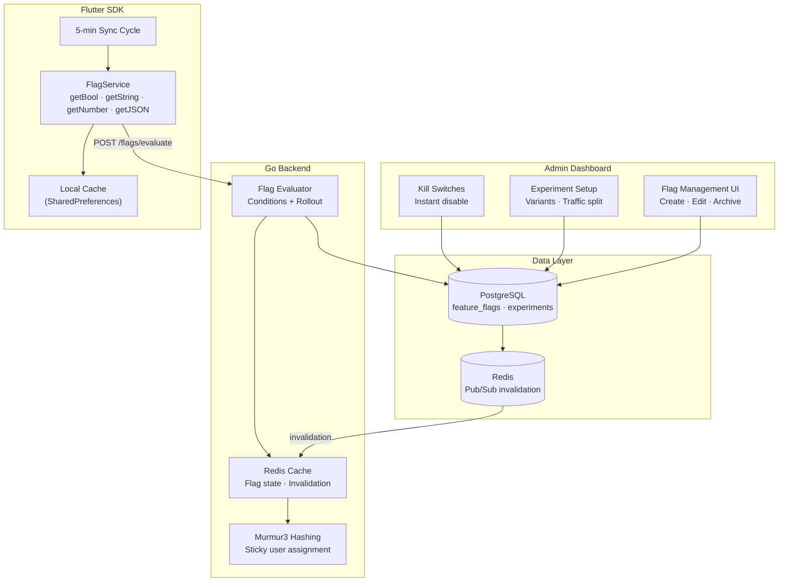
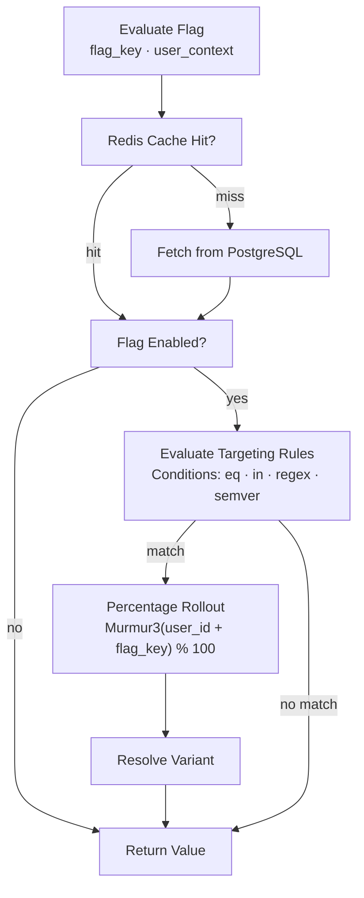
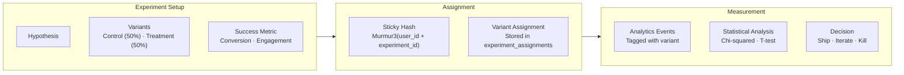

# Feature Flag System — Architecture Diagram

> Maps to [01-feature-flag-system.md](01-feature-flag-system.md)

---

## Feature Flag Architecture

---

## Flag Evaluation Flow

---

## A/B Experiment Framework

