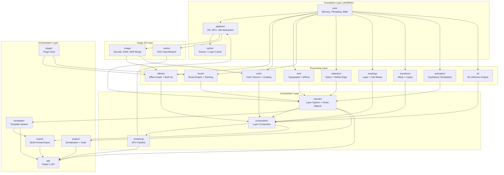

## IE-2. Engine Architecture Overview

### 2.1 High-Level Module Diagram

```
libgopost_ie/
├── core/                       # [SHARED] Foundation: memory, threading, math, logging
├── canvas/                     # Canvas data model, layer system, smart objects
├── composition/                # Layer compositor (Photoshop/AE-class blending)
├── rendering/                  # [SHARED] GPU render pipeline + shader management
├── effects/                    # [SHARED] Effect graph, built-in effects, LUT engine
├── image/                      # RAW decode, retouching, healing, clone, HDR merge
├── vector/                     # Shape layers, pen tool, boolean ops, SVG I/O
├── text/                       # [SHARED] Advanced typography, text effects
├── brush/                      # Brush engine, painting, drawing, stamp brushes
├── selection/                  # Selection tools, marching ants, AI selection
├── masking/                    # [SHARED] Bezier masks, layer masks, clipping masks
├── color/                      # [SHARED] Color science, grading, HDR, gamut mapping
├── animation/                  # [SHARED] Keyframe engine (for animated templates)
├── transform/                  # Perspective warp, mesh warp, liquify, content-aware scale
├── templates/                  # Template model, placeholders, element library, collage
├── ai/                         # [SHARED] ML inference: segmentation, object removal, upscale
├── export/                     # Multi-format export, batch, print profiles (CMYK, ICC)
├── project/                    # Project serialization (.gpimg), auto-save, undo/redo
├── plugin/                     # Plugin host, SDK, custom filter support
├── platform/                   # [SHARED] Platform abstraction (OS, GPU, HW accel)
├── cache/                      # [SHARED] Texture cache, layer cache, thumbnail cache
└── api/                        # Public C API surface (FFI boundary)
```

### 2.2 Layer Dependency Diagram



### 2.3 Threading Architecture

```
┌─────────────────────────────────────────────────────────────┐
│                      Thread Architecture                     │
├─────────────────────────────────────────────────────────────┤
│                                                              │
│  [Main/UI Thread]  ◄─── FFI calls from Flutter/Dart         │
│       │                                                      │
│       ├──► [Command Queue] ──► [Engine Thread]               │
│       │         (lock-free SPSC ring buffer)                 │
│       │                           │                          │
│       │                           ├──► [Render Thread]       │
│       │                           │     (GPU submission)     │
│       │                           │                          │
│       │                           ├──► [Tile Worker Pool]    │
│       │                           │     (N = CPU cores)      │
│       │                           │     Tile-based render    │
│       │                           │                          │
│       │                           ├──► [Decode Thread]       │
│       │                           │     (image loading)      │
│       │                           │                          │
│       │                           ├──► [AI Thread Pool]      │
│       │                           │     (ML inference)       │
│       │                           │                          │
│       │                           ├──► [Export Thread]       │
│       │                           │     (encode pipeline)    │
│       │                           │                          │
│       │                           └──► [Cache Thread]        │
│       │                                 (async I/O)          │
│       │                                                      │
│       └──► [Result Queue] ◄── rendered tiles, callbacks      │
│                 (lock-free SPMC ring buffer)                  │
│                                                              │
└─────────────────────────────────────────────────────────────┘
```

| Thread | Priority | Affinity | Purpose |
|---|---|---|---|
| Main/UI | Normal | Any | FFI entry, command dispatch |
| Engine | Above Normal | Big core | Canvas evaluation, composition graph |
| Render | High | Big core + GPU | GPU command buffer recording and submission |
| Tile Worker Pool (N) | Normal | Any | Parallel tile-based image processing |
| Decode | Normal | Any | Image loading (RAW decode, JPEG decode) |
| AI Pool | Low | Any | ML inference (background, interruptible) |
| Export | Below Normal | Any | Encode pipeline (background batch) |
| Cache | Low | Any | Async disk I/O, thumbnail generation |

### 2.4 Tile-Based Rendering Strategy

Unlike the video editor which processes complete frames, the image editor uses tile-based rendering for large canvases to stay within GPU texture size limits and memory budgets:

```
┌──────────────────────────────────────┐
│         Full Canvas (e.g. 8000x6000) │
│  ┌──────┬──────┬──────┬──────┐       │
│  │Tile  │Tile  │Tile  │Tile  │       │
│  │(0,0) │(1,0) │(2,0) │(3,0) │       │
│  ├──────┼──────┼──────┼──────┤       │
│  │Tile  │Tile  │Tile  │Tile  │       │
│  │(0,1) │(1,1) │(2,1) │(3,1) │       │
│  ├──────┼──────┼──────┼──────┤       │
│  │Tile  │Tile  │Tile  │Tile  │       │
│  │(0,2) │(1,2) │(2,2) │(3,2) │       │
│  └──────┴──────┴──────┴──────┘       │
└──────────────────────────────────────┘

Tile Size: 2048x2048 (configurable per GPU)
Processing: Each tile rendered independently → parallel
GPU Texture: Only visible tiles loaded to GPU at any time
LOD: Preview uses 1/4 res tiles, export uses full res
```

```cpp
namespace gp::canvas {

struct TileGrid {
    int tile_size;             // 2048 default
    int cols, rows;
    int overlap;               // 2px overlap for seamless filter borders

    struct Tile {
        int col, row;
        Rect region;           // Pixel coordinates in canvas
        bool dirty;            // Needs re-render
        GpuTexture gpu_cache;  // Cached GPU result (invalidated on change)
    };

    std::vector<Tile> tiles;

    void invalidate_region(Rect dirty_rect);  // Mark affected tiles dirty
    std::vector<Tile*> visible_tiles(Rect viewport, float zoom) const;
    std::vector<Tile*> dirty_tiles() const;
};

} // namespace gp::canvas
```

### 2.5 Preview vs Full-Quality Rendering

| Mode | Resolution | Processing | Use Case |
|---|---|---|---|
| Interactive Preview | Viewport-resolution (screen DPI) | Downsampled layers, simplified effects | Canvas manipulation, real-time editing |
| Cached Preview | 1/4 canvas resolution | Full effect chain, cached per-layer | Zoomed-out overview, layer panel thumbnails |
| Full Quality | Native canvas resolution | Full effect chain, tiled, 16-bit pipeline | Export, print, zoom to 100%+ |
| Proxy | Fixed max (2048px longest edge) | Full effect chain on proxy | Low-memory devices, fast interaction |

### 2.6 Sprint Planning

#### Sprint Assignment

| Sprint | Weeks | Stories | Focus |
|---|---|---|---|
| Sprint 1 | Wk 1–2 | IE-006 to IE-011, IE-013, IE-014 | CMake, shared core, GPU backends, thread pool, SPSC, FFI |
| Sprint 2 | Wk 3–4 | IE-012, IE-015 | Tile grid foundation, CI pipeline |

#### User Stories

| ID | Story | Acceptance Criteria | Story Points | Sprint | Dependencies |
|---|---|---|---|---|---|
| IE-006 | As a developer, I want CMake build configuration so that libgopost_ie compiles with correct dependencies | - CMake 3.18+ configures project<br/>- Finds shared core, rendering, effects<br/>- Platform-specific flags (Metal, Vulkan, GLES)<br/>- Generates Xcode/Visual Studio/Android Studio projects | 3 | Sprint 1 | IE-001 |
| IE-007 | As a developer, I want shared core linking so that IE uses allocators, task system, and utilities | - libgopost_ie links libgopost_core (or shared static lib)<br/>- AllocatorSystem, FramePoolAllocator, ArenaAllocator available<br/>- TaskGraph and SPSCRingBuffer compile and link<br/>- No duplicate symbols | 2 | Sprint 1 | IE-006 |
| IE-008 | As a developer, I want Metal GPU backend initialization so that IE runs on iOS and macOS | - IGpuContext Metal implementation initializes on iOS 15+ and macOS 12+<br/>- Metal 3 preferred, Metal 2 fallback<br/>- Shader compilation to Metal IR works<br/>- Basic clear/draw test passes | 5 | Sprint 1 | IE-006 |
| IE-009 | As a developer, I want Vulkan GPU backend initialization so that IE runs on Android and Windows | - IGpuContext Vulkan implementation initializes on Android API 26+ and Windows 10+<br/>- Vulkan 1.1 (Android) / 1.2 (Windows)<br/>- SPIR-V shaders compile and run<br/>- Basic clear/draw test passes | 5 | Sprint 1 | IE-006 |
| IE-010 | As a developer, I want OpenGL ES fallback so that IE runs on devices without Vulkan | - GLES 3.2 backend implements IGpuContext<br/>- Fallback when Vulkan unavailable on Android<br/>- GLSL shaders compile via ANGLE or native<br/>- Rendering matches Vulkan output | 5 | Sprint 1 | IE-009 |
| IE-011 | As a developer, I want thread pool setup so that tile workers and decode threads run correctly | - TaskGraph thread pool initialized with N = CPU cores<br/>- Tile worker pool for parallel tile rendering<br/>- Decode thread for image loading<br/>- Engine thread coordinates work | 3 | Sprint 1 | IE-007 |
| IE-012 | As a developer, I want tile grid foundation so that large canvases can be rendered in tiles | - TileGrid struct with configurable tile size (default 2048)<br/>- invalidate_region, visible_tiles, dirty_tiles implemented<br/>- Tile overlap (2px) for seamless filter borders<br/>- Integrates with canvas model | 5 | Sprint 2 | IE-007 |
| IE-013 | As a developer, I want SPSC ring buffer so that main thread and engine thread communicate lock-free | - SPSCRingBuffer for command queue (main → engine)<br/>- SPMC or SPSC for result queue (engine → main)<br/>- No blocking on enqueue/dequeue<br/>- Unit tests verify correctness | 2 | Sprint 1 | IE-007 |
| IE-014 | As a developer, I want FFI scaffolding so that Flutter can call the engine via C API | - api/ module exposes C API (no C++ in headers)<br/>- Engine init, shutdown, create/destroy canvas stubs<br/>- FFI bindings compile for Dart<br/>- Basic round-trip call works | 3 | Sprint 1 | IE-007 |
| IE-015 | As a developer, I want CI pipeline so that builds and tests run on every commit | - GitHub Actions or equivalent for iOS, macOS, Android, Windows<br/>- Build matrix covers all platforms<br/>- Unit tests run in CI<br/>- NFR benchmarks optional (nightly) | 3 | Sprint 2 | IE-006 |

---

## Development Sprint Plan

### Sprint Assignment

| Attribute | Value |
|---|---|
| **Phase** | Phase 1: Core Foundation |
| **Sprint(s)** | IE-Sprint 1 (Weeks 1-2) |
| **Team** | C/C++ Engine Developer (2), Tech Lead |
| **Predecessor** | [01-vision-and-scope](01-vision-and-scope.md) |
| **Successor** | [03-core-foundation](03-core-foundation.md) |
| **Story Points Total** | 48 |

### User Stories

| ID | Story | Acceptance Criteria | Points | Priority | Dependencies |
|---|---|---|---|---|---|
| IE-006 | As a C++ engine developer, I want module directory structure creation so that libgopost_ie has a clear layout | - All IE modules (canvas, composition, image, vector, etc.) have directories<br/>- api/ for public C API surface<br/>- CMakeLists.txt references all modules | 2 | P0 | IE-001 |
| IE-007 | As a C++ engine developer, I want dependency graph enforcement so that modules have correct build order | - Dependency graph documented and validated<br/>- No circular dependencies<br/>- Build fails on violation | 3 | P0 | IE-006 |
| IE-008 | As a C++ engine developer, I want threading architecture (main→engine→render→decode→brush→AI threads) so that work is properly parallelized | - Main, engine, render, decode, brush, AI thread roles defined<br/>- Thread affinity and priority documented<br/>- No blocking on main thread | 5 | P0 | IE-006 |
| IE-009 | As a C++ engine developer, I want tile-based rendering pipeline design so that large canvases can be rendered | - TileGrid design with configurable tile size<br/>- Dirty region tracking per tile<br/>- Pipeline stages documented | 5 | P0 | IE-007 |
| IE-010 | As a C++ engine developer, I want command queue (lock-free SPSC) so that main and engine threads communicate efficiently | - SPSCRingBuffer for main→engine commands<br/>- No blocking on enqueue/dequeue<br/>- Unit tests verify correctness | 3 | P0 | IE-008 |
| IE-011 | As a C++ engine developer, I want result queue for rendered tiles so that engine can return results to main | - SPMC or SPSC result queue for tiles<br/>- Callback or polling mechanism for results<br/>- Thread-safe delivery | 3 | P0 | IE-010 |
| IE-012 | As a C++ engine developer, I want engine thread lifecycle so that startup and shutdown are clean | - Engine thread starts on init, stops on shutdown<br/>- Graceful drain of command queue<br/>- No resource leaks | 3 | P0 | IE-008 |
| IE-013 | As a C++ engine developer, I want render thread tile submission so that tiles are rendered on GPU | - Render thread receives tile work from engine<br/>- GPU submission per tile<br/>- Completion signaled to result queue | 5 | P0 | IE-009, IE-011 |
| IE-014 | As a C++ engine developer, I want decode thread for async image loading so that image load doesn't block | - Dedicated decode thread for image loading<br/>- Async decode with completion callback<br/>- JPEG/PNG/WebP/RAW support | 5 | P0 | IE-008 |
| IE-015 | As a C++ engine developer, I want brush thread for real-time painting so that brush strokes are responsive | - Brush thread handles stroke input<br/>- <100ms latency for stroke application<br/>- Pressure and tilt support | 5 | P0 | IE-008 |
| IE-016 | As a C++ engine developer, I want cache thread for disk I/O so that thumbnails and assets load asynchronously | - Cache thread for async disk I/O<br/>- Thumbnail generation off main thread<br/>- LRU eviction policy | 3 | P1 | IE-008 |

### Definition of Done

- [ ] All stories in this section marked complete
- [ ] Code reviewed and merged to `develop`
- [ ] Unit tests passing (≥ 90% coverage for new code)
- [ ] Google Test suite green
- [ ] Memory leak check (ASan) passing
- [ ] Performance benchmark recorded (no regression)
- [ ] C API header updated if public interface changed
- [ ] Sprint review demo completed
