## IE-5. Composition Engine (Photoshop/AE-class Compositor)

### 5.1 Compositor Pipeline

```mermaid
graph TB
    subgraph evaluation ["Layer Tree Evaluation"]
        FlattenTree["Flatten Layer Tree<br/>(resolve groups, visibility)"]
        ResolveClipping["Resolve Clipping Masks<br/>(clip to layer below)"]
        EvalKeyframes["Evaluate Keyframes<br/>(for animated templates)"]
    end

    subgraph per_layer ["Per-Layer Processing"]
        DecodeContent["Decode / Rasterize<br/>Layer Content"]
        ApplyLayerMask["Apply Layer Mask<br/>(grayscale mask)"]
        ApplyVectorMask["Apply Vector Mask<br/>(bezier path clip)"]
        ApplyEffects["Apply Effect Chain<br/>(non-destructive)"]
        ApplyLayerStyle["Apply Layer Style<br/>(shadow, glow, stroke)"]
        ApplyTransform["Apply Transform<br/>(position, scale, rotation)"]
    end

    subgraph compositing ["Compositing"]
        BlendLayer["Blend onto Canvas<br/>(blend mode + opacity)"]
        ClipMask["Apply Clipping Mask<br/>(alpha from base layer)"]
        GroupComposite["Group Composite<br/>(isolated / pass-through)"]
        AdjustmentFX["Apply Adjustment Layer<br/>(non-destructive below)"]
    end

    subgraph final ["Final Output"]
        MasterEffects["Master Canvas Effects"]
        TileAssembly["Tile Assembly<br/>(if tiled rendering)"]
        OutputTexture["Output GPU Texture"]
    end

    FlattenTree --> ResolveClipping
    ResolveClipping --> EvalKeyframes

    EvalKeyframes --> DecodeContent
    DecodeContent --> ApplyLayerMask
    ApplyLayerMask --> ApplyVectorMask
    ApplyVectorMask --> ApplyEffects
    ApplyEffects --> ApplyLayerStyle
    ApplyLayerStyle --> ApplyTransform

    ApplyTransform --> BlendLayer
    BlendLayer --> ClipMask
    ClipMask --> GroupComposite
    GroupComposite --> AdjustmentFX

    AdjustmentFX --> MasterEffects
    MasterEffects --> TileAssembly
    TileAssembly --> OutputTexture
```



### 5.2 Compositor Implementation

```cpp
namespace gp::composition {

class ImageCompositor {
public:
    ImageCompositor(IGpuContext& gpu, const canvas::Canvas& canvas);

    // Render the full canvas composite to a GPU texture
    GpuTexture render_full(float quality = 1.0f);

    // Render a specific region (tile-based)
    GpuTexture render_region(Rect region, float quality = 1.0f);

    // Render a single layer (for layer thumbnail)
    GpuTexture render_layer(int32_t layer_id);

    // Render canvas at viewport resolution (for interactive preview)
    GpuTexture render_viewport(const ViewportState& viewport);

    // Invalidate cache for a specific layer (after edit)
    void invalidate_layer(int32_t layer_id);

    // Invalidate all caches
    void invalidate_all();

private:
    struct LayerCacheEntry {
        int32_t layer_id;
        uint64_t version;          // Incremented on edit
        GpuTexture cached_result;  // Layer + effects + mask composite
        Rect bounds;
    };

    // Layer evaluation order (bottom-to-top, respecting groups)
    struct EvalNode {
        canvas::Layer* layer;
        int32_t group_depth;
        bool is_group_start;
        bool is_group_end;
        bool is_clipped;           // Clipping mask target
        int32_t clip_base_id;      // Base layer for clipping group
    };

    std::vector<EvalNode> build_eval_order(const canvas::Canvas& canvas) const;
    GpuTexture render_single_layer(const EvalNode& node, Rect target_region, float quality);
    GpuTexture apply_layer_style(GpuTexture content, const canvas::LayerStyle& style,
                                  Rect bounds, float quality);
    GpuTexture apply_clipping_group(const std::vector<EvalNode>& group, Rect region, float quality);
    GpuTexture composite_group(const std::vector<EvalNode>& children,
                                bool pass_through, Rect region, float quality);

    IGpuContext& gpu_;
    const canvas::Canvas& canvas_;
    std::unordered_map<int32_t, LayerCacheEntry> layer_cache_;
};

} // namespace gp::composition
```

### 5.3 Blend Mode Processing

All 30+ blend modes from the video editor are shared. The image compositor adds support for:

```cpp
namespace gp::composition {

// Blend mode groups (matching Photoshop)
// All modes implemented as GPU compute shaders

// Blend a single layer onto the composite
void blend_layer(IGpuContext& gpu,
                 GpuTexture source,           // Layer content (premultiplied alpha)
                 GpuTexture destination,       // Current composite
                 GpuTexture output,
                 BlendMode mode,
                 float opacity,
                 Rect source_rect,             // Source region within layer
                 Mat3 transform,               // Layer transform matrix
                 GpuTexture mask = {},          // Optional layer mask
                 GpuTexture clip_mask = {});    // Optional clipping mask

// Group compositing modes
enum class GroupBlendMode {
    PassThrough,    // Layers in group blend directly with layers below group
    Isolated,       // Group is composited onto transparent, then blended as one unit
};

} // namespace gp::composition
```

### 5.4 Clipping Mask System

```cpp
namespace gp::composition {

// Clipping masks: consecutive layers clipped to the base layer's alpha.
// Layers with clipping_mask=true are clipped to the nearest layer below
// that has clipping_mask=false (the "base" layer).

struct ClippingGroup {
    canvas::Layer* base_layer;                   // The layer that defines the clip shape
    std::vector<canvas::Layer*> clipped_layers;  // Layers clipped to base alpha

    // Rendering: render base → for each clipped layer, composite using base alpha as mask
    GpuTexture render(IGpuContext& gpu, Rect region, float quality) const;
};

// Identify clipping groups in layer stack
std::vector<ClippingGroup> find_clipping_groups(const std::vector<canvas::Layer*>& layers);

} // namespace gp::composition
```

### 5.5 Layer Mask Rendering

```cpp
namespace gp::composition {

struct LayerMask {
    int32_t width, height;
    std::vector<uint8_t> data;     // Grayscale mask (0=transparent, 255=opaque)
    bool enabled;
    bool inverted;
    float density;                  // 0-100 (reduces mask effect)
    float feather;                  // Global feather in pixels
    Vec2 offset;                    // Mask offset from layer
    bool linked;                    // Linked to layer transform

    GpuTexture upload(IGpuContext& gpu) const;
    void apply_brush(Vec2 center, float radius, float hardness,
                     float opacity, bool erase);  // Paint on mask
};

struct VectorMask {
    BezierPath path;
    bool enabled;
    bool inverted;
    float feather;

    GpuTexture rasterize(IGpuContext& gpu, int width, int height) const;
};

// Combined mask: layer_mask AND vector_mask
GpuTexture combine_masks(IGpuContext& gpu,
                          const LayerMask* layer_mask,
                          const VectorMask* vector_mask,
                          int width, int height);

} // namespace gp::composition
```

### 5.6 Adjustment Layer Processing

```cpp
namespace gp::composition {

// Adjustment layers apply their effect to ALL visible layers below them
// (within their group scope). They are non-destructive.

class AdjustmentLayerProcessor {
public:
    // Apply adjustment to the composite of all layers below
    GpuTexture process(IGpuContext& gpu,
                       GpuTexture layers_below_composite,
                       const canvas::AdjustmentData& adjustment,
                       const canvas::LayerMask* mask,      // Optional mask
                       float opacity,
                       BlendMode blend_mode);

    // Supported adjustment types → mapped to shared effect processors
    static const EffectDefinition* get_effect_for_adjustment(canvas::AdjustmentType type);
};

// Adjustment layer rendering:
// 1. Composite all layers below adjustment layer → temp texture A
// 2. Apply adjustment effect to temp texture A → temp texture B
// 3. If mask exists, blend A and B using mask as weight
// 4. Continue compositing layers above onto result

} // namespace gp::composition
```

### 5.7 Sprint Planning

#### Sprint Assignment

| Sprint | Weeks | Stories | Focus |
|---|---|---|---|
| Sprint 5 | Wk 8–9 | IE-039 to IE-045 | Compositor pipeline, layer evaluation, blend modes, group compositing, clipping, adjustment layers |
| Sprint 6 | Wk 10 | IE-046 to IE-050 | Layer mask, vector mask, mask combine, layer cache invalidation, performance benchmarks |

#### User Stories

| ID | Story | Acceptance Criteria | Story Points | Sprint | Dependencies |
|---|---|---|---|---|---|
| IE-039 | As a developer, I want compositor pipeline so that layers are composited into a final image | - ImageCompositor with render_full, render_region, render_layer, render_viewport<br/>- Pipeline: decode → mask → effects → style → transform → blend<br/>- Tile-based render_region for large canvases<br/>- Output to GpuTexture | 8 | Sprint 5 | IE-038, IE-051 |
| IE-040 | As a developer, I want layer evaluation order so that layers composite bottom-to-top correctly | - build_eval_order produces ordered EvalNode list<br/>- Respects group nesting and visibility<br/>- Clipping groups identified (clip_base_id, is_clipped)<br/>- Adjustment layers apply to layers below | 3 | Sprint 5 | IE-039 |
| IE-041 | As a developer, I want blend mode shaders (30+) so that Photoshop-class blending is supported | - All 30+ blend modes as GPU compute shaders<br/>- Normal, Multiply, Screen, Overlay, Soft Light, Hard Light, etc.<br/>- blend_layer() with opacity, mask, clip_mask<br/>- Matches reference blend results | 8 | Sprint 5 | IE-039 |
| IE-042 | As a developer, I want layer group compositing (pass-through) so that groups blend through to below | - GroupBlendMode::PassThrough implemented<br/>- Layers in group blend directly with layers below group<br/>- No intermediate composite of group<br/>- composite_group(children, pass_through=true) | 3 | Sprint 5 | IE-039, IE-040 |
| IE-043 | As a developer, I want layer group compositing (isolated) so that groups composite as a unit | - GroupBlendMode::Isolated implemented<br/>- Group composited onto transparent, then blended as one<br/>- composite_group(children, pass_through=false)<br/>- Correct alpha and blend behavior | 3 | Sprint 5 | IE-039, IE-040 |
| IE-044 | As a developer, I want clipping mask system so that layers can be clipped to layer below | - find_clipping_groups identifies base + clipped layers<br/>- ClippingGroup.render() uses base alpha as mask<br/>- Consecutive clipped layers share same base<br/>- Clipping mask toggle on Layer | 5 | Sprint 5 | IE-039, IE-040 |
| IE-045 | As a developer, I want adjustment layer processing so that non-destructive adjustments apply to below | - AdjustmentLayerProcessor.process() applies effect to composite<br/>- Maps AdjustmentType to shared effect processors<br/>- Optional mask and opacity<br/>- Supported types: BrightnessContrast, Levels, Curves, HueSaturation, etc. | 5 | Sprint 5 | IE-039, IE-061 |
| IE-046 | As a developer, I want layer mask (grayscale) so that brush-painted masks control visibility | - LayerMask with data, enabled, inverted, density, feather, offset<br/>- upload() to GpuTexture for compositor<br/>- apply_brush() for painting on mask<br/>- Linked to layer transform when linked=true | 5 | Sprint 6 | IE-039 |
| IE-047 | As a developer, I want vector mask (bezier) so that path-based masks can be used | - VectorMask with BezierPath, enabled, inverted, feather<br/>- rasterize() produces grayscale texture<br/>- Uses shared BezierPath from core<br/>- Anti-aliased edge | 5 | Sprint 6 | IE-020, IE-039 |
| IE-048 | As a developer, I want mask combine so that layer mask and vector mask work together | - combine_masks() ANDs layer_mask and vector_mask<br/>- Handles enabled, inverted for each<br/>- Single combined texture passed to compositor<br/>- Feather applied to combined result | 2 | Sprint 6 | IE-046, IE-047 |
| IE-049 | As a developer, I want layer cache invalidation so that edits trigger correct re-renders | - invalidate_layer(layer_id) marks layer and dependents dirty<br/>- invalidate_all() clears all caches<br/>- LayerCacheEntry version incremented on edit<br/>- Dirty tiles identified for incremental render | 3 | Sprint 6 | IE-039 |
| IE-050 | As a developer, I want compositor performance benchmarks so that we meet NFR targets | - Benchmark: 60 fps for ≤50 layers on mid-range device<br/>- Benchmark: <3 s for 4K full-quality composite<br/>- Benchmark: real-time preview for ≤5 stacked effects<br/>- Benchmarks run in CI (optional) | 3 | Sprint 6 | IE-039 |

---

## Development Sprint Plan

### Sprint Assignment

| Attribute | Value |
|---|---|
| **Phase** | Phase 2: Layer System & Compositing |
| **Sprint(s)** | IE-Sprint 4-5 (Weeks 6-9) |
| **Team** | C/C++ Engine Developer (2), Tech Lead |
| **Predecessor** | [04-canvas-engine](04-canvas-engine.md) |
| **Successor** | [06-gpu-rendering-pipeline](06-gpu-rendering-pipeline.md) |
| **Story Points Total** | 95 |

### User Stories

| ID | Story | Acceptance Criteria | Points | Priority | Dependencies |
|---|---|---|---|---|---|
| IE-043 | As a C++ engine developer, I want layer compositor pipeline (bottom-to-top evaluation) so that layers composite correctly | - ImageCompositor evaluates layers bottom-to-top<br/>- build_eval_order produces correct EvalNode list<br/>- render_full, render_region, render_viewport work | 8 | P0 | IE-042 |
| IE-044 | As a C++ engine developer, I want all 30+ blend modes (shared GPU shaders from VE) so that Photoshop-class blending is supported | - All 30+ blend modes as GPU compute shaders<br/>- blend_layer() with opacity, mask, clip_mask<br/>- Normal, Multiply, Screen, Overlay, Soft Light, etc. | 8 | P0 | IE-043 |
| IE-045 | As a C++ engine developer, I want layer opacity compositing so that layer transparency is applied | - Opacity 0.0-1.0 per layer<br/>- Premultiplied alpha compositing<br/>- Correct alpha blend with layers below | 2 | P0 | IE-043 |
| IE-046 | As a C++ engine developer, I want layer visibility toggle so that layers can be hidden | - visible flag on Layer<br/>- Hidden layers excluded from eval order<br/>- No render cost for hidden layers | 2 | P0 | IE-043 |
| IE-047 | As a C++ engine developer, I want clipping mask (clip to layer below) so that layers can be clipped | - find_clipping_groups identifies base + clipped layers<br/>- ClippingGroup.render() uses base alpha as mask<br/>- clipping_mask toggle on Layer | 5 | P0 | IE-043 |
| IE-048 | As a C++ engine developer, I want layer group blending (pass-through vs isolated) so that groups composite correctly | - GroupBlendMode::PassThrough and Isolated<br/>- composite_group() with pass_through param<br/>- Correct alpha and blend behavior | 5 | P0 | IE-043 |
| IE-049 | As a C++ engine developer, I want adjustment layer (applies to all below) so that non-destructive adjustments work | - AdjustmentLayerProcessor.process()<br/>- Maps AdjustmentType to shared effect processors<br/>- Applies to composite of layers below | 5 | P0 | IE-043 |
| IE-050 | As a designer, I want layer style: drop shadow so that layers can have drop shadows | - DropShadow in LayerStyle with color, opacity, angle, distance, spread, size<br/>- apply_layer_style() renders drop shadow<br/>- Contour and noise support | 5 | P0 | IE-043 |
| IE-051 | As a designer, I want layer style: inner shadow so that layers can have inner shadows | - InnerShadow with choke, size, contour<br/>- Renders inside layer bounds<br/>- use_global_light support | 3 | P0 | IE-050 |
| IE-052 | As a designer, I want layer style: outer glow so that layers can have outer glow | - OuterGlow with color/gradient source, technique, spread, size<br/>- GlowTechnique: Softer, Precise<br/>- Contour and range support | 5 | P0 | IE-050 |
| IE-053 | As a designer, I want layer style: inner glow so that layers can have inner glow | - InnerGlow with Center/Edge source<br/>- choke, size, contour<br/>- Renders inside layer bounds | 3 | P0 | IE-052 |
| IE-054 | As a designer, I want layer style: bevel/emboss so that layers can have 3D effect | - BevelEmboss with style, technique, depth, size, soften<br/>- Highlight and shadow colors, opacity, blend modes<br/>- gloss_contour, contour | 5 | P0 | IE-050 |
| IE-055 | As a designer, I want layer style: stroke so that layers can have outlines | - Stroke with size, position, fill type (color/gradient/pattern)<br/>- StrokePosition: Outside, Inside, Center<br/>- Blend mode and opacity | 3 | P0 | IE-050 |
| IE-056 | As a designer, I want layer style: color/gradient/pattern overlay so that layers can have overlays | - ColorOverlay, GradientOverlay, PatternOverlay<br/>- Blend mode and opacity per overlay<br/>- Correct render order | 5 | P0 | IE-050 |
| IE-057 | As a designer, I want layer style: satin so that layers can have satin effect | - Satin with color, opacity, angle, distance, size<br/>- Contour curve for falloff<br/>- Invert option | 3 | P0 | IE-050 |
| IE-058 | As a C++ engine developer, I want layer mask (grayscale, brush-painted) so that visibility can be painted | - LayerMask with data, enabled, inverted, density, feather<br/>- apply_brush() for painting on mask<br/>- upload() to GpuTexture | 5 | P0 | IE-043 |
| IE-059 | As a C++ engine developer, I want vector mask (bezier path clipping) so that path-based masks work | - VectorMask with BezierPath, enabled, inverted, feather<br/>- rasterize() produces grayscale texture<br/>- Anti-aliased edge | 5 | P0 | IE-058 |
| IE-060 | As a C++ engine developer, I want smart object (non-destructive scaling) so that embedded content scales without quality loss | - SmartObjectData preserves original<br/>- Non-destructive transform application<br/>- needs_update for linked sources | 5 | P0 | IE-035 |

### Definition of Done

- [ ] All stories in this section marked complete
- [ ] Code reviewed and merged to `develop`
- [ ] Unit tests passing (≥ 90% coverage for new code)
- [ ] Google Test suite green
- [ ] Memory leak check (ASan) passing
- [ ] Performance benchmark recorded (no regression)
- [ ] C API header updated if public interface changed
- [ ] Sprint review demo completed
