# Image Editor Engine — Architecture Diagrams

> Architecture diagrams for `libgopost_ie`, the shared C/C++ image editor engine.
> Maps to implementation documents in `docs/image-editor-engine/`.

---

## 1. Module Layout & Dependency Graph

> Ref: [02-engine-architecture.md](02-engine-architecture.md)

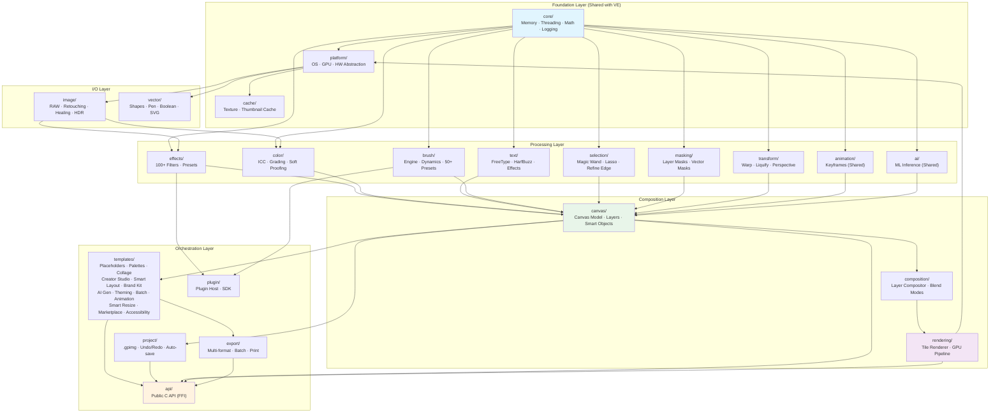

---

## 2. Shared vs IE-Only Modules

> Ref: [01-vision-and-scope.md](01-vision-and-scope.md), [02-engine-architecture.md](02-engine-architecture.md)

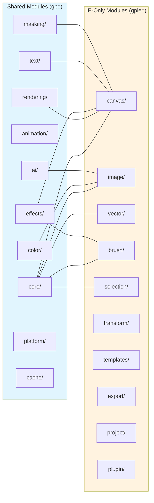

---

## 3. Threading Architecture

> Ref: [02-engine-architecture.md](02-engine-architecture.md)

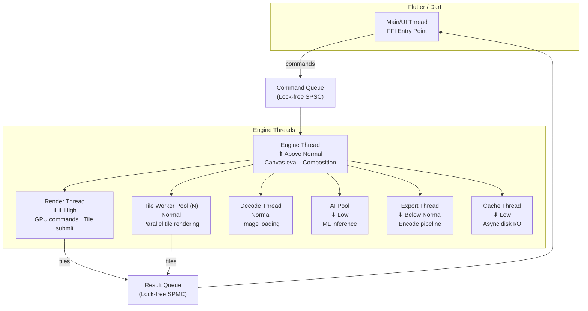

---

## 4. Canvas Data Model

> Ref: [04-canvas-engine.md](04-canvas-engine.md)

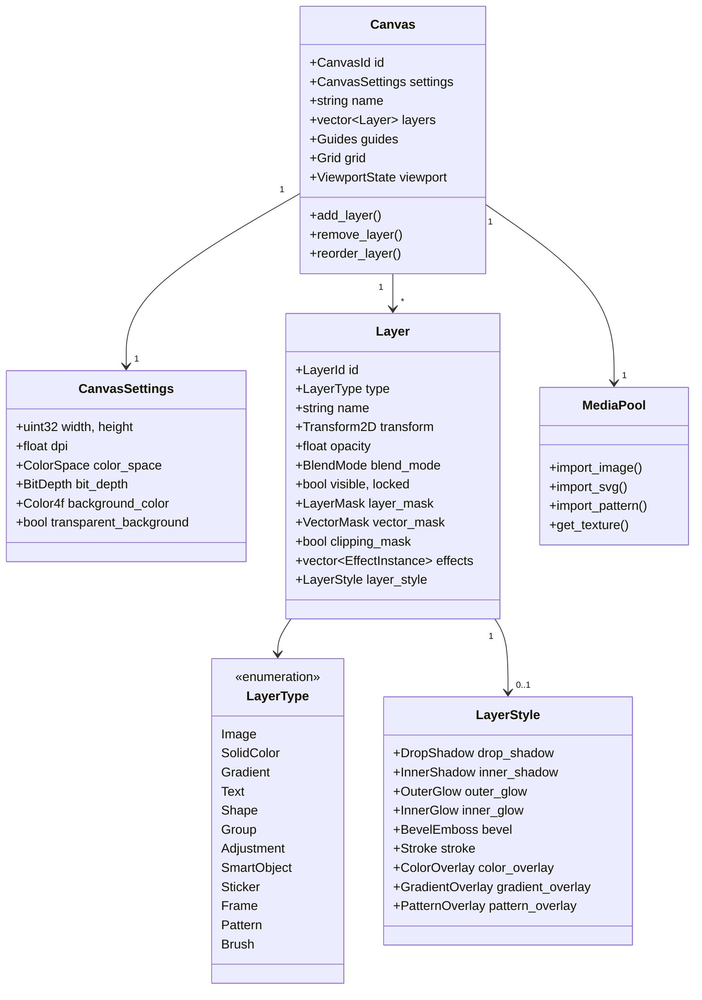

---

## 5. Tile-Based Rendering

> Ref: [02-engine-architecture.md](02-engine-architecture.md), [06-gpu-rendering-pipeline.md](06-gpu-rendering-pipeline.md)

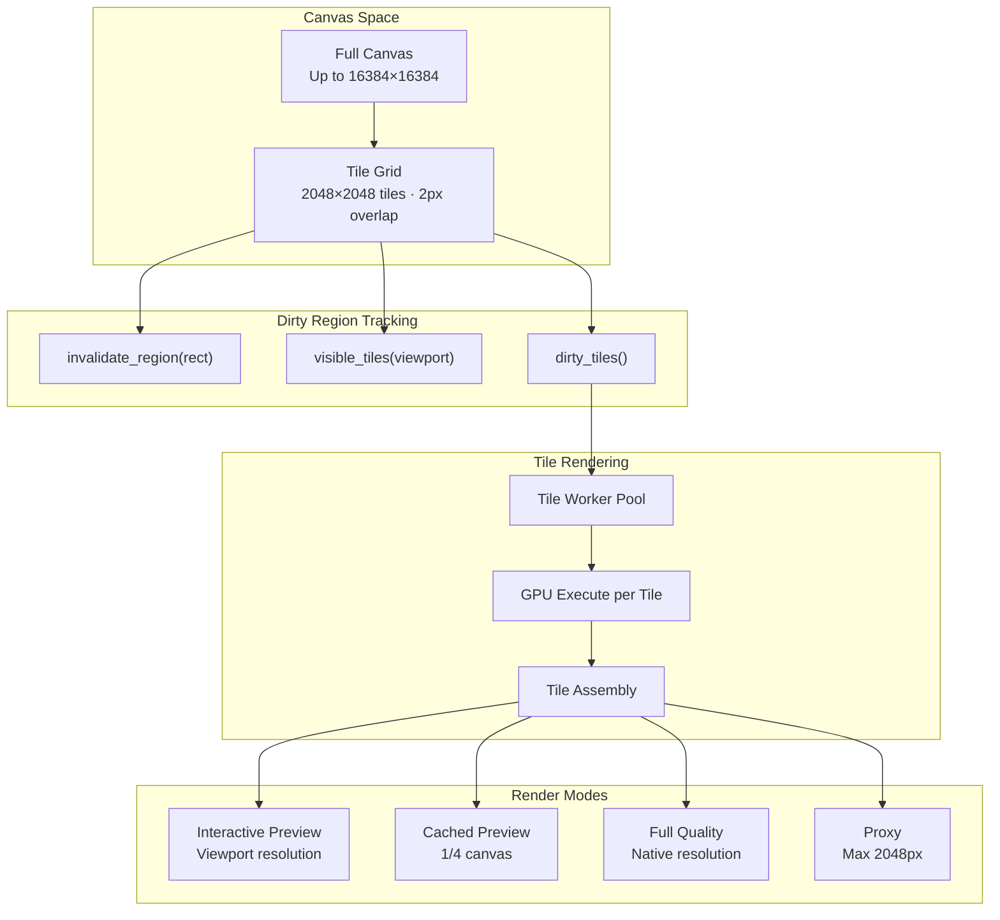

---

## 6. Composition Pipeline

> Ref: [05-composition-engine.md](05-composition-engine.md)

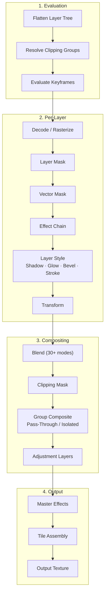

---

## 7. Effects & Filter System (100+ Filters)

> Ref: [07-effects-filter-system.md](07-effects-filter-system.md)

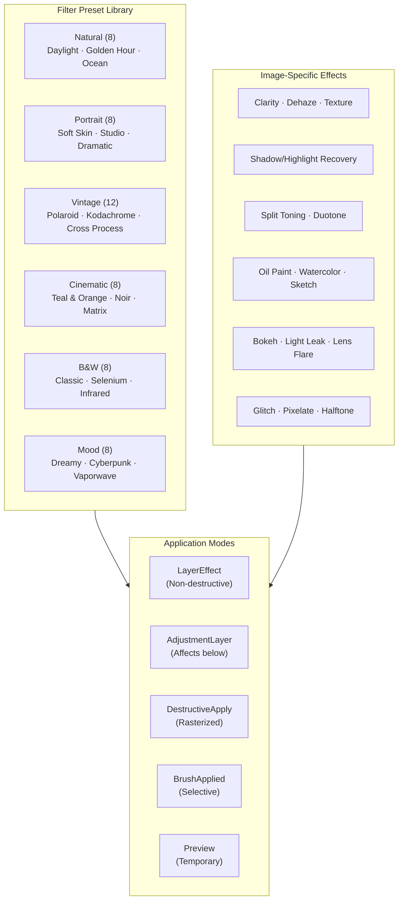

---

## 8. Template System

> Ref: [11-template-system.md](11-template-system.md)

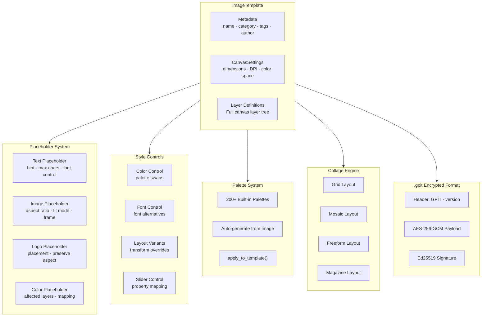

### 8b. Extended Template Subsystems

> Ref: [11-template-system.md](11-template-system.md) — Sections 11.8–11.19

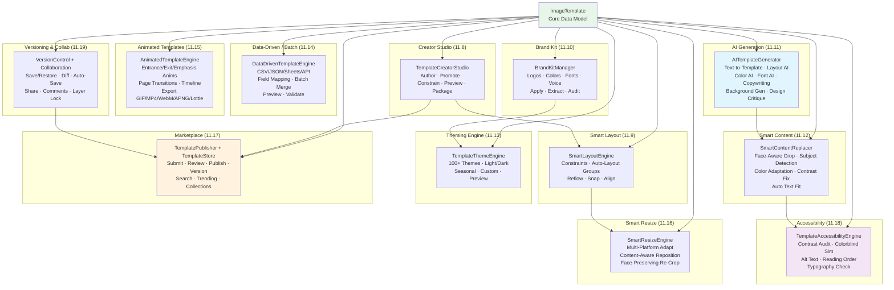

---

## 9. Brush Engine

> Ref: [16-brush-engine.md](16-brush-engine.md)

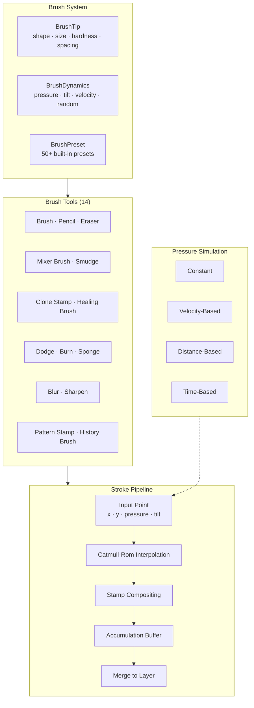

---

## 10. Public C API (FFI Boundary)

> Ref: [23-public-c-api.md](23-public-c-api.md)

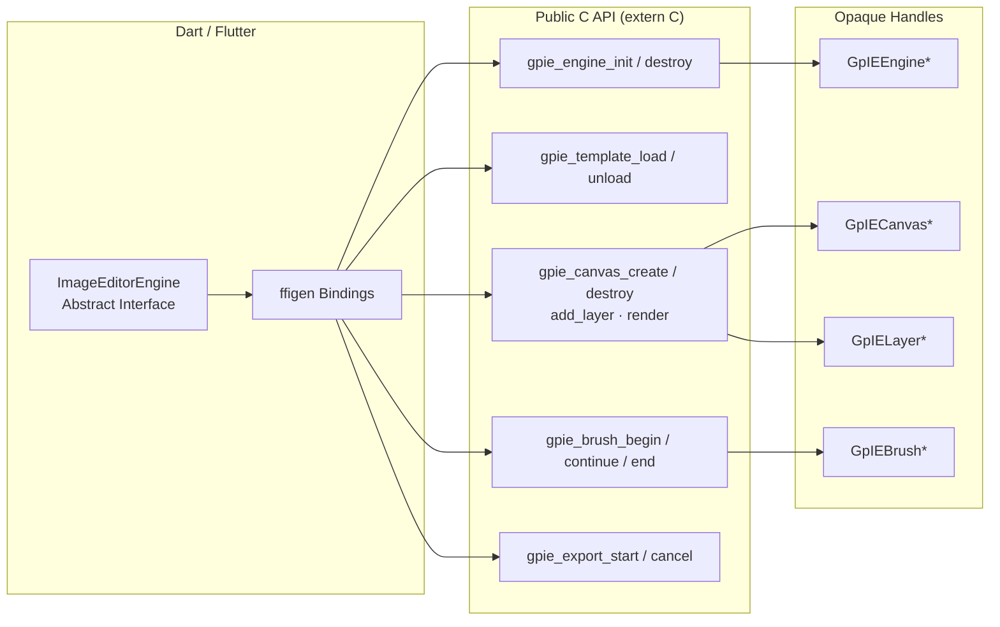

---

## 11. Development Roadmap (48 Weeks)

> Ref: [25-development-roadmap.md](25-development-roadmap.md)

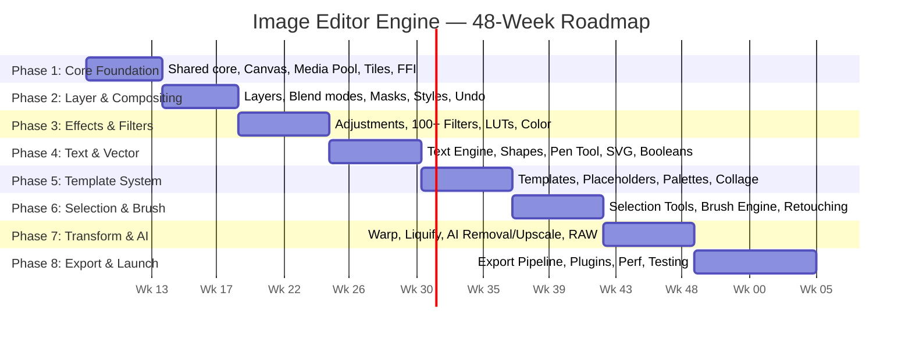

---

## Module Cross-Reference

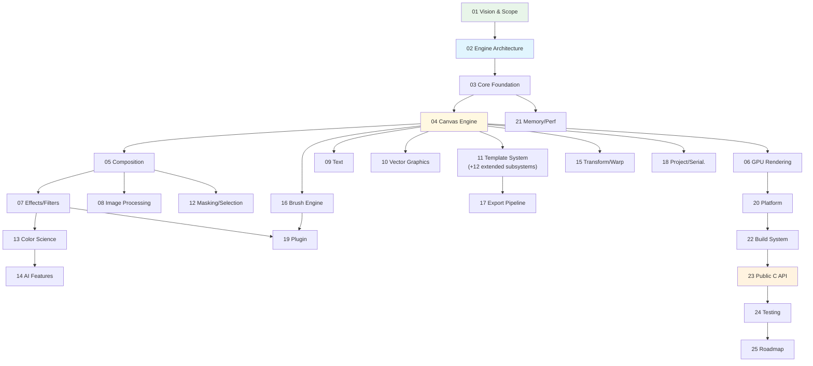
