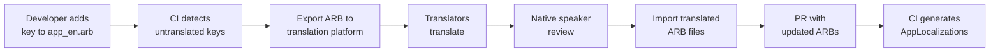

# Gopost — Localization and Internationalization Architecture

> **Version:** 1.0.0
> **Date:** February 23, 2026
> **Audience:** Flutter Engineers, Backend Engineers, Content/Translation Team

---

## Table of Contents

1. [Goals and Scope](#1-goals-and-scope)
2. [Supported Locales](#2-supported-locales)
3. [Flutter i18n Framework](#3-flutter-i18n-framework)
4. [ARB File Structure](#4-arb-file-structure)
5. [Pluralization and Gender](#5-pluralization-and-gender)
6. [Right-to-Left (RTL) Support](#6-right-to-left-rtl-support)
7. [Dynamic Locale Switching](#7-dynamic-locale-switching)
8. [Backend Localization](#8-backend-localization)
9. [Template and Content Localization](#9-template-and-content-localization)
10. [Number, Date, and Currency Formatting](#10-number-date-and-currency-formatting)
11. [Translation Workflow](#11-translation-workflow)
12. [Testing Strategy](#12-testing-strategy)
13. [Implementation Guide](#13-implementation-guide)
14. [Sprint Stories](#14-sprint-stories)

---

## 1. Goals and Scope

| Goal | Description |
|------|-------------|
| **Day-1 locale** | English (en) ships as the default and fallback locale |
| **Launch locales** | Arabic (ar), Hindi (hi), Spanish (es), French (fr), Portuguese (pt) — added before public launch |
| **Post-launch expansion** | Locale additions without code changes — drop a new `.arb` file + rebuild |
| **RTL-first design** | Arabic is a launch locale; the entire UI must support bidirectional layout from Sprint 1 |
| **Server-aware locale** | Backend error messages and push notifications are locale-aware |
| **Locale persistence** | User's chosen locale is stored locally and synced to their server profile |

---

## 2. Supported Locales

### 2.1 Launch Locales

| Code | Language | Script Direction | Plural Rules | Date Format |
|------|----------|-----------------|-------------|-------------|
| `en` | English | LTR | one / other | MM/dd/yyyy |
| `ar` | Arabic | RTL | zero / one / two / few / many / other | dd/MM/yyyy |
| `hi` | Hindi | LTR | one / other | dd/MM/yyyy |
| `es` | Spanish | LTR | one / many / other | dd/MM/yyyy |
| `fr` | French | LTR | one / many / other | dd/MM/yyyy |
| `pt` | Portuguese | LTR | one / other | dd/MM/yyyy |

### 2.2 Locale Fallback Chain

```
User locale → Language match (e.g., es_MX → es) → English (en)
```

If a key is missing in `ar`, the system falls back to `en` rather than showing a raw key.

---

## 3. Flutter i18n Framework

Gopost uses Flutter's built-in `gen_l10n` tool (no third-party i18n packages):

### 3.1 Configuration

```yaml
# l10n.yaml (project root)

arb-dir: lib/l10n
template-arb-file: app_en.arb
output-localization-file: app_localizations.dart
output-class: AppLocalizations
nullable-getter: false
untranslated-messages-file: untranslated.txt
```

### 3.2 MaterialApp Setup

```dart
// lib/app.dart

MaterialApp.router(
  localizationsDelegates: const [
    AppLocalizations.delegate,
    GlobalMaterialLocalizations.delegate,
    GlobalWidgetsLocalizations.delegate,
    GlobalCupertinoLocalizations.delegate,
  ],
  supportedLocales: AppLocalizations.supportedLocales,
  locale: ref.watch(localeProvider),
  // ...
)
```

### 3.3 Usage in Widgets

```dart
// Accessing localized strings
final l10n = AppLocalizations.of(context);
Text(l10n.templateBrowseTitle);
Text(l10n.templateCount(count));
```

---

## 4. ARB File Structure

### 4.1 Directory Layout

```
lib/l10n/
├── app_en.arb          # Template file (source of truth)
├── app_ar.arb
├── app_hi.arb
├── app_es.arb
├── app_fr.arb
└── app_pt.arb
```

### 4.2 ARB Key Naming Convention

Keys follow a `module_screen_element` convention:

```json
{
  "@@locale": "en",

  "common_appName": "Gopost",
  "@common_appName": { "description": "Application name — do not translate" },

  "common_ok": "OK",
  "common_cancel": "Cancel",
  "common_retry": "Retry",
  "common_offline": "You are offline",
  "common_offlineBanner": "Some features require an internet connection",

  "auth_loginTitle": "Sign In",
  "auth_loginEmail": "Email address",
  "auth_loginPassword": "Password",
  "auth_loginButton": "Sign In",
  "auth_loginForgot": "Forgot password?",
  "auth_registerTitle": "Create Account",
  "auth_registerButton": "Create Account",

  "home_browseTitle": "Browse Templates",
  "home_searchHint": "Search templates...",

  "template_detailTitle": "Template Details",
  "template_useButton": "Use Template",
  "template_previewButton": "Preview",

  "editor_saveButton": "Save",
  "editor_exportButton": "Export",
  "editor_undoButton": "Undo",
  "editor_redoButton": "Redo",
  "editor_autoSaved": "Auto-saved {time}",
  "@editor_autoSaved": {
    "placeholders": {
      "time": { "type": "String", "example": "2 minutes ago" }
    }
  },

  "subscription_upgradeTitle": "Upgrade to Pro",
  "subscription_currentPlan": "Current plan: {plan}",
  "@subscription_currentPlan": {
    "placeholders": {
      "plan": { "type": "String", "example": "Free" }
    }
  },

  "settings_title": "Settings",
  "settings_language": "Language",
  "settings_clearCache": "Clear Cache"
}
```

### 4.3 Module Prefixes

| Prefix | Module |
|--------|--------|
| `common_` | Shared strings (buttons, states, banners) |
| `auth_` | Login, registration, password reset |
| `home_` | Home / browse screens |
| `template_` | Template detail, actions |
| `editor_` | Video and image editor |
| `subscription_` | Paywall, subscription management |
| `settings_` | Settings screens |
| `admin_` | Admin portal |
| `notification_` | Push notification titles and bodies |
| `error_` | Error messages |

---

## 5. Pluralization and Gender

### 5.1 Plurals

Flutter's ICU message format handles pluralization natively:

```json
{
  "template_count": "{count, plural, =0{No templates} =1{1 template} other{{count} templates}}",
  "@template_count": {
    "placeholders": {
      "count": { "type": "int" }
    }
  },
  "template_countArabic": "{count, plural, =0{لا قوالب} =1{قالب واحد} =2{قالبان} few{{count} قوالب} many{{count} قالبًا} other{{count} قالب}}"
}
```

### 5.2 Gender

Used for personalized messages where gender is known:

```json
{
  "profile_welcomeBack": "{gender, select, male{Welcome back, {name}!} female{Welcome back, {name}!} other{Welcome back, {name}!}}",
  "@profile_welcomeBack": {
    "placeholders": {
      "gender": { "type": "String" },
      "name": { "type": "String" }
    }
  }
}
```

### 5.3 Arabic-Specific Plural Rules

Arabic has 6 plural forms. The template ARB (`app_en.arb`) defines the ICU pattern; `app_ar.arb` provides all 6 forms:

| Plural Category | Arabic Example (templates) |
|----------------|--------------------------|
| zero | لا قوالب |
| one | قالب واحد |
| two | قالبان |
| few (3-10) | {count} قوالب |
| many (11-99) | {count} قالبًا |
| other (100+) | {count} قالب |

---

## 6. Right-to-Left (RTL) Support

### 6.1 Layout Rules

| Rule | Implementation |
|------|---------------|
| **Auto-direction** | `Directionality` widget is set by `MaterialApp` based on locale |
| **Use logical properties** | `EdgeInsetsDirectional.only(start: 16)` instead of `EdgeInsets.only(left: 16)` |
| **Logical alignment** | `AlignmentDirectional.centerStart` instead of `Alignment.centerLeft` |
| **Icon mirroring** | Navigation icons (back arrow, forward) auto-flip; symmetric icons (home, settings) do not flip |
| **Text alignment** | `TextAlign.start` / `TextAlign.end` rather than `left` / `right` |
| **Timeline direction** | Video/image editor timeline flows RTL when locale is RTL |
| **Numeric display** | Numbers use Western Arabic numerals by default; Eastern Arabic optional for `ar` |

### 6.2 RTL Lint Rules

Custom lint rules to catch LTR-hardcoded values:

```yaml
# analysis_options.yaml additions

linter:
  rules:
    # Custom team conventions enforced via code review:
    # - No EdgeInsets.only(left/right) → use EdgeInsetsDirectional
    # - No Alignment.centerLeft/Right → use AlignmentDirectional
    # - No TextAlign.left/right → use TextAlign.start/end
```

### 6.3 Components Requiring RTL Testing

| Component | RTL Behavior |
|-----------|-------------|
| Navigation (bottom nav, drawer) | Items order unchanged; icons may flip |
| Template grid | Cards flow from right-to-left |
| Template detail | Text right-aligned, images remain |
| Video editor timeline | Timeline ruler flows RTL; layers panel RTL |
| Video editor toolbar | Tool icons flow RTL |
| Text editor | Input is RTL-native; cursor on right side |
| Subscription paywall | Plan cards RTL; price alignment adjusted |
| Admin portal tables | Column order unchanged; text alignment RTL |

---

## 7. Dynamic Locale Switching

### 7.1 Locale Provider

```dart
// lib/core/l10n/locale_provider.dart

final localeProvider = StateNotifierProvider<LocaleNotifier, Locale?>((ref) {
  return LocaleNotifier(ref.read(preferencesProvider));
});

class LocaleNotifier extends StateNotifier<Locale?> {
  final PreferencesService _prefs;

  LocaleNotifier(this._prefs) : super(null) {
    _load();
  }

  Future<void> _load() async {
    final saved = await _prefs.getString('locale');
    if (saved != null) {
      state = Locale(saved);
    }
    // null → system locale via MaterialApp default
  }

  Future<void> setLocale(Locale locale) async {
    state = locale;
    await _prefs.setString('locale', locale.languageCode);
    // Sync to server profile for notification locale
    // (handled by a listener elsewhere)
  }

  Future<void> useSystemLocale() async {
    state = null;
    await _prefs.remove('locale');
  }
}
```

### 7.2 Language Picker UI

```dart
// Settings → Language screen

class LanguageSettingsScreen extends ConsumerWidget {
  static const supportedLocales = [
    _LocaleOption('en', 'English'),
    _LocaleOption('ar', 'العربية'),
    _LocaleOption('hi', 'हिन्दी'),
    _LocaleOption('es', 'Español'),
    _LocaleOption('fr', 'Français'),
    _LocaleOption('pt', 'Português'),
  ];

  @override
  Widget build(BuildContext context, WidgetRef ref) {
    final current = ref.watch(localeProvider);
    return ListView(
      children: [
        RadioListTile<Locale?>(
          title: Text(AppLocalizations.of(context).settings_systemDefault),
          value: null,
          groupValue: current,
          onChanged: (_) => ref.read(localeProvider.notifier).useSystemLocale(),
        ),
        for (final option in supportedLocales)
          RadioListTile<Locale>(
            title: Text(option.nativeName),
            subtitle: Text(option.code),
            value: Locale(option.code),
            groupValue: current,
            onChanged: (v) => ref.read(localeProvider.notifier).setLocale(v!),
          ),
      ],
    );
  }
}
```

### 7.3 Hot-Reload Behavior

Changing locale via `localeProvider` triggers a full rebuild of the widget tree through `MaterialApp.locale`. No app restart is needed.

---

## 8. Backend Localization

### 8.1 Accept-Language Header

All API responses that contain user-facing text respect the `Accept-Language` header:

```
Accept-Language: ar, en;q=0.5
```

### 8.2 Localized Error Messages

```go
// internal/i18n/messages.go

type Messages struct {
    locale string
    bundle map[string]string
}

var bundles = map[string]*Messages{
    "en": loadBundle("en"),
    "ar": loadBundle("ar"),
    "hi": loadBundle("hi"),
    "es": loadBundle("es"),
    "fr": loadBundle("fr"),
    "pt": loadBundle("pt"),
}

func Translate(locale, key string, args ...interface{}) string {
    b, ok := bundles[locale]
    if !ok {
        b = bundles["en"]
    }
    msg, ok := b.bundle[key]
    if !ok {
        msg = bundles["en"].bundle[key]
    }
    if len(args) > 0 {
        return fmt.Sprintf(msg, args...)
    }
    return msg
}
```

### 8.3 Localized Responses

The middleware extracts locale from `Accept-Language` and stores it in the Gin context:

```go
// internal/middleware/locale.go

func LocaleMiddleware() gin.HandlerFunc {
    return func(c *gin.Context) {
        locale := parseAcceptLanguage(c.GetHeader("Accept-Language"))
        if !isSupported(locale) {
            locale = "en"
        }
        c.Set("locale", locale)
        c.Next()
    }
}
```

### 8.4 Push Notification Locale

The user's preferred locale is stored in their profile and used when formatting push notifications server-side:

```go
// internal/service/notification.go

func (s *NotificationService) Send(userID string, key string, args ...string) error {
    user, _ := s.userRepo.GetByID(userID)
    title := i18n.Translate(user.Locale, key+".title", args...)
    body := i18n.Translate(user.Locale, key+".body", args...)
    return s.fcm.Send(user.FCMToken, title, body)
}
```

---

## 9. Template and Content Localization

### 9.1 Template Metadata

Template names, descriptions, and tags are authored in English and optionally translated:

```json
{
  "id": "tpl_001",
  "name": {
    "en": "Travel Vlog Opener",
    "ar": "مقدمة مدونة سفر",
    "es": "Intro de Vlog de Viajes"
  },
  "description": {
    "en": "A cinematic opener for travel vlogs...",
    "ar": "مقدمة سينمائية لمدونات السفر..."
  },
  "tags": {
    "en": ["travel", "vlog", "cinematic"],
    "ar": ["سفر", "مدونة", "سينمائي"]
  }
}
```

### 9.2 Category Names

Category names are localized in the same manner. Backend returns the localized name based on `Accept-Language`:

```go
func (r *CategoryRepo) GetAll(locale string) ([]Category, error) {
    rows, err := r.db.Query(`
        SELECT id, 
               COALESCE(name->>$1, name->>'en') AS name, 
               icon
        FROM categories 
        ORDER BY sort_order
    `, locale)
    // ...
}
```

### 9.3 Database Schema

Template and category name fields use JSONB columns for multilingual support:

```sql
ALTER TABLE templates
    ALTER COLUMN name TYPE jsonb USING jsonb_build_object('en', name),
    ALTER COLUMN description TYPE jsonb USING jsonb_build_object('en', description);

ALTER TABLE categories
    ALTER COLUMN name TYPE jsonb USING jsonb_build_object('en', name);

CREATE INDEX idx_templates_name_en ON templates ((name->>'en'));
CREATE INDEX idx_templates_name_ar ON templates ((name->>'ar'));
```

---

## 10. Number, Date, and Currency Formatting

### 10.1 Number Formatting

```dart
import 'package:intl/intl.dart';

// Uses locale from context
final formatted = NumberFormat.decimalPattern(locale).format(15234);
// en: "15,234"
// ar: "١٥٬٢٣٤" (if Eastern Arabic numerals enabled)
// hi: "15,234"
```

### 10.2 Date Formatting

```dart
final formatted = DateFormat.yMMMd(locale).format(date);
// en: "Feb 23, 2026"
// ar: "٢٣ فبراير ٢٠٢٦"
// es: "23 feb 2026"
```

### 10.3 Relative Time

```dart
// "5 minutes ago", "Yesterday", etc.
final relative = timeago.format(dateTime, locale: locale);
```

### 10.4 Currency

Subscription prices are displayed using the store's locale-aware formatting (StoreKit 2 and Google Play Billing provide localized price strings). The app never formats raw prices itself.

---

## 11. Translation Workflow

### 11.1 Process



### 11.2 Translation Platform

| Tool | Purpose |
|------|---------|
| **Crowdin** (recommended) | Cloud translation management; ARB file format support; glossary, TM, context screenshots |
| Alternative: **Lokalise** | Also supports ARB; good Figma plugin for context |

### 11.3 Translation Quality Controls

| Control | Implementation |
|---------|---------------|
| Glossary | Maintain a glossary of app-specific terms (e.g., "template", "export", "layer") that must be consistently translated |
| Character limit | Key metadata includes max character length for UI elements; translator is warned if exceeded |
| Context screenshots | Attach Figma or app screenshots to keys so translators see context |
| Native speaker review | Every translation reviewed by a native speaker before merge |
| Pseudo-localization | CI generates a pseudo locale (`en_PSEUDO`) with accents and padding to detect hardcoded strings and truncation |

### 11.4 CI Integration

```yaml
# .github/workflows/l10n-check.yml (relevant step)

- name: Check for untranslated strings
  run: |
    flutter gen-l10n
    if [ -s untranslated.txt ]; then
      echo "::warning::Untranslated keys found:"
      cat untranslated.txt
      exit 1
    fi
```

---

## 12. Testing Strategy

### 12.1 Automated Tests

| Test Type | What | How |
|-----------|------|-----|
| **Missing key detection** | All keys in `app_en.arb` exist in every other ARB file | CI script comparing key sets |
| **Pseudo-locale** | Accented English exposes hardcoded strings | Run app with `en_PSEUDO` locale in integration tests |
| **RTL layout** | No overflow, clipping, or misalignment in RTL | Run golden tests with `ar` locale |
| **Plural forms** | All plural categories render correctly | Unit tests with boundary values (0, 1, 2, 5, 11, 100) |
| **Locale switch** | Changing locale updates all visible text without restart | Integration test: switch locale → verify key strings |

### 12.2 Manual QA Checklist

| Checkpoint | Details |
|------------|---------|
| Full walkthrough in each launch locale | Login → browse → preview → edit → export → settings |
| Arabic-specific | RTL layout, plural forms, connected letter rendering, Eastern/Western numeral toggle |
| Text truncation | Long translations (e.g., German if added later) don't overflow |
| Date/number formatting | Verify per locale |
| Push notification locale | Send test notification; verify it arrives in user's locale |
| Backend error messages | Trigger validation errors in each locale |

---

## 13. Implementation Guide

### 13.1 File Structure

```
lib/
├── l10n/
│   ├── app_en.arb       # Source of truth (template)
│   ├── app_ar.arb
│   ├── app_hi.arb
│   ├── app_es.arb
│   ├── app_fr.arb
│   └── app_pt.arb
├── core/
│   └── l10n/
│       ├── locale_provider.dart
│       └── l10n_extensions.dart   # context.l10n shortcut
backend/
├── internal/
│   ├── i18n/
│   │   ├── messages.go
│   │   ├── bundles/
│   │   │   ├── en.json
│   │   │   ├── ar.json
│   │   │   └── ...
│   │   └── loader.go
│   └── middleware/
│       └── locale.go
```

### 13.2 Developer Guidelines

| Guideline | Explanation |
|-----------|-------------|
| **Never hardcode user-facing strings** | All strings must come from `AppLocalizations` |
| **Always use `EdgeInsetsDirectional`** | Never `EdgeInsets.only(left/right)` |
| **Always use `TextAlign.start/end`** | Never `TextAlign.left/right` |
| **Test with `ar` locale** | Every PR that touches layout must include an RTL screenshot or golden |
| **Keep keys alphabetical within module** | Easier to find duplicates and maintain |
| **Provide `@` metadata for every key** | At minimum: `description`; for placeholders: type and example |

---

## 14. Sprint Stories

### Sprint Assignment

| Attribute | Value |
|---|---|
| **Phase** | Phase 6: Polish & Launch |
| **Sprint(s)** | Sprint 15 (Weeks 29-30) |
| **Team** | Flutter Engineers, Backend Engineers, Content Team |
| **Predecessor** | All UI sprints complete (Sprints 1-14) |
| **Story Points Total** | 42 |

### Stories

| ID | Story | Acceptance Criteria | Points | Priority | Sprint |
|---|---|---|---|---|---|
| L10N-001 | Configure `gen_l10n` and create `app_en.arb` with all existing hardcoded strings extracted | `l10n.yaml` configured; all visible strings in ARB; `AppLocalizations` generates without error | 5 | P0 | 15 |
| L10N-002 | Implement `LocaleNotifier` with persistence (SharedPreferences) and server sync | Locale persists across restarts; synced to user profile; system default option works | 3 | P0 | 15 |
| L10N-003 | Build Language Picker settings screen | All supported locales listed with native names; radio selection; immediate switch on selection | 2 | P0 | 15 |
| L10N-004 | Audit and fix all layouts for RTL (EdgeInsetsDirectional, AlignmentDirectional, TextAlign) | Zero overflow/clipping in RTL; golden tests for key screens with `ar` locale | 5 | P0 | 15 |
| L10N-005 | RTL video editor timeline and toolbar | Timeline flows RTL; toolbar icons in correct order; playhead and ruler directions correct | 5 | P0 | 15 |
| L10N-006 | Implement Arabic plural forms for all count-based strings | All 6 Arabic plural categories tested with boundary values; no fallback to `other` incorrectly | 3 | P1 | 15 |
| L10N-007 | Set up Crowdin integration + ARB export/import pipeline | ARB upload to Crowdin works; translated ARBs downloaded; CI checks for missing keys | 3 | P1 | 15 |
| L10N-008 | Translate all keys to 5 launch locales (ar, hi, es, fr, pt) | All keys translated and reviewed by native speaker; no raw keys visible in app | 5 | P0 | 15 |
| L10N-009 | Backend locale middleware + localized error messages (6 locales) | `Accept-Language` respected; error messages translated; fallback to `en` on unknown locale | 3 | P0 | 15 |
| L10N-010 | Localize template metadata (JSONB migration for name/description) | Migration runs; API returns localized name/description based on `Accept-Language`; search works for localized names | 3 | P1 | 15 |
| L10N-011 | Push notification locale support | Notifications sent in user's preferred locale; verified for all 6 locales | 2 | P1 | 15 |
| L10N-012 | Pseudo-locale testing + CI untranslated key check | `en_PSEUDO` locale renders; CI fails on untranslated keys; no hardcoded strings found | 3 | P0 | 15 |

### Definition of Done

- [ ] All stories marked complete
- [ ] All 6 launch locales pass full walkthrough
- [ ] RTL golden tests passing in CI
- [ ] CI untranslated key check green
- [ ] Crowdin pipeline tested end-to-end
- [ ] Code reviewed and merged
