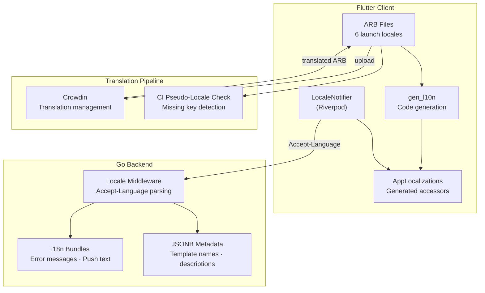
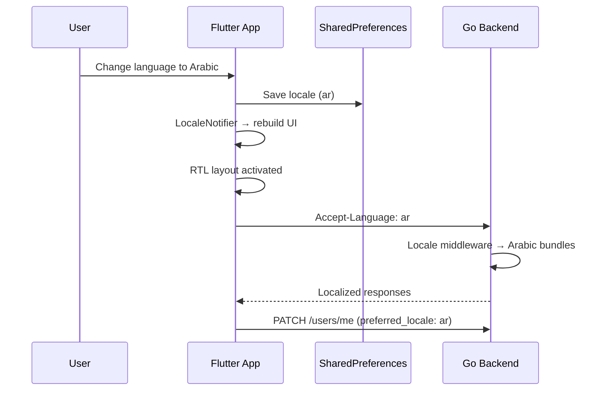
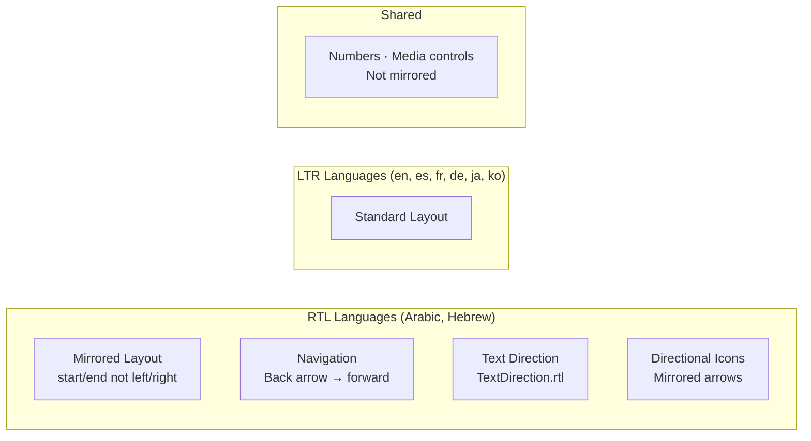

# Localization & Internationalization — Architecture Diagram

> Maps to [01-localization-architecture.md](01-localization-architecture.md)

---

## Localization Architecture

---

## Locale Data Flow

---

## RTL Support

