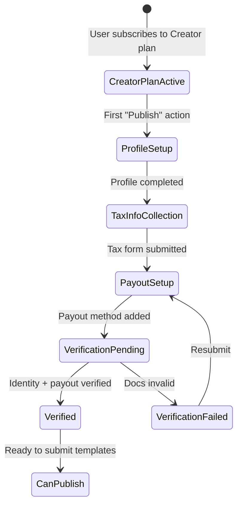
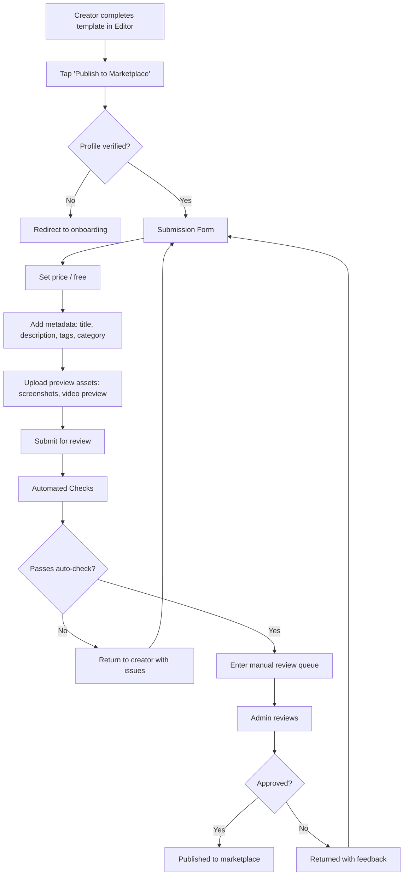
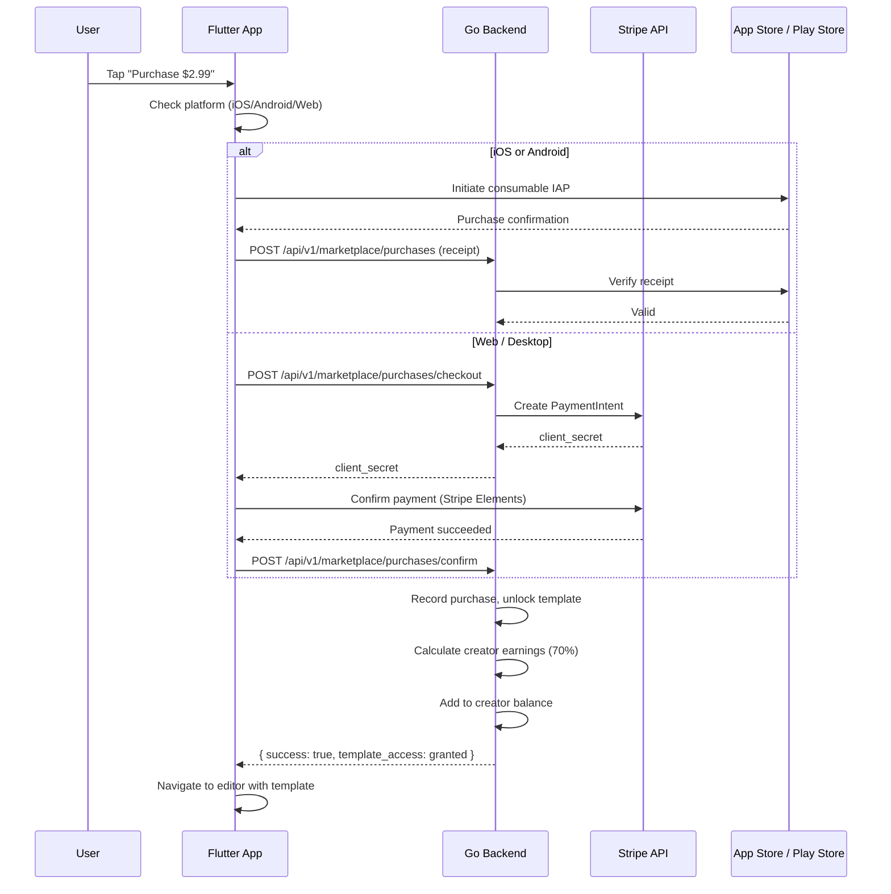
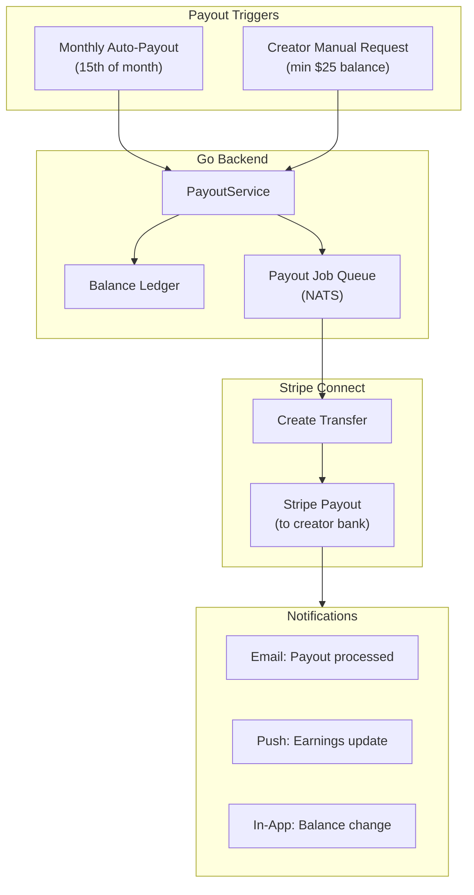

# Gopost — Creator Marketplace Architecture

> **Version:** 1.0.0
> **Date:** February 23, 2026
> **Classification:** Internal — Engineering + Business Reference
> **Audience:** Flutter Engineers, Backend Engineers, Product Manager, Finance

---

## Table of Contents

1. [Overview](#1-overview)
2. [Creator Onboarding and Profiles](#2-creator-onboarding-and-profiles)
3. [Template Submission Pipeline](#3-template-submission-pipeline)
4. [Marketplace Storefront](#4-marketplace-storefront)
5. [Pricing and Revenue Model](#5-pricing-and-revenue-model)
6. [Payout System](#6-payout-system)
7. [Creator Analytics Dashboard](#7-creator-analytics-dashboard)
8. [Fraud Prevention and Compliance](#8-fraud-prevention-and-compliance)
9. [Database Schema Extensions](#9-database-schema-extensions)
10. [Cross-System Integration](#9-cross-system-integration)
11. [Database Schema Extensions](#10-database-schema-extensions)
12. [API Endpoints](#11-api-endpoints)
13. [Sprint Stories](#12-sprint-stories)

---

## 1. Overview

The Creator Marketplace extends Gopost from a first-party template platform into a two-sided marketplace where third-party creators publish, sell, and earn revenue from templates consumed by the broader user base. This builds on the existing `creator` subscription tier (which already grants `CanPublishTemplates: true`) and the admin portal's template moderation workflow.

### 1.1 Goals

| Goal | Metric |
|------|--------|
| Grow template catalog 10× via community | >10,000 creator-published templates within 6 months |
| Create secondary revenue stream | Creator Revenue Share contributing ≥15% of total revenue by month 12 |
| Retain power users | Creator tier churn <5% monthly |
| Maintain quality bar | <2% of published templates flagged post-review |

### 1.2 Key Actors

| Actor | Description |
|-------|-------------|
| **Creator** | User on the Creator plan ($19.99/mo) who publishes templates for sale |
| **Buyer** | Any user (Free/Pro/Creator) who purchases individual premium templates or accesses them via subscription |
| **Reviewer** | Admin/super_admin who reviews submitted templates before publication |
| **System** | Automated checks: NSFW scanning, malware detection, format validation |

### 1.3 Dependencies on Existing Systems

| System | Dependency |
|--------|------------|
| Monetization (`01-monetization-system.md`) | Creator plan entitlements, IAP infrastructure, Stripe integration |
| Admin Portal (`01-admin-portal.md`) | Template moderation workflow (Section 5), audit logs |
| Secure Template System (`06-secure-template-system.md`) | .gpt format validation, encryption, asset extraction |
| CDN/Object Storage | Template asset delivery pipeline |

---

## 2. Creator Onboarding and Profiles

### 2.1 Onboarding Flow



### 2.2 Creator Profile Schema

| Field | Type | Required | Description |
|-------|------|----------|-------------|
| `display_name` | varchar(100) | Yes | Public-facing creator name |
| `bio` | text(500) | No | Short biography |
| `avatar_url` | varchar | Yes | Profile image (min 200×200) |
| `portfolio_url` | varchar | No | External portfolio link |
| `social_links` | jsonb | No | `{ "instagram": "...", "dribbble": "...", "behance": "..." }` |
| `country_code` | varchar(2) | Yes | ISO 3166-1 alpha-2 (for tax and payout routing) |
| `verification_status` | enum | System | `pending`, `verified`, `rejected`, `suspended` |
| `stripe_connect_account_id` | varchar | System | Stripe Connected Account ID |
| `tax_form_status` | enum | System | `not_submitted`, `pending_review`, `approved`, `expired` |

### 2.3 Verification Requirements

| Requirement | Method | Threshold |
|-------------|--------|-----------|
| Identity verification | Stripe Identity (KYC) | Government-issued ID |
| Tax information | W-9 (US) / W-8BEN (non-US) via Stripe | Must be on file before first payout |
| Payout method | Bank account or debit card via Stripe Connect | Verified through micro-deposits or instant verification |
| Content agreement | Digital signature | Accepted Creator Terms of Service v1.0 |

### 2.4 Creator Tiers (Future Expansion)

| Tier | Requirements | Benefits |
|------|-------------|----------|
| **New Creator** | 0 published templates | Standard 70/30 split, standard review queue |
| **Established** | ≥10 published, ≥500 total downloads, ≥4.0 avg rating | 75/25 split, faster review (24h SLA) |
| **Featured** | Curated by Gopost team | 80/20 split, homepage placement, priority support |

---

## 3. Template Submission Pipeline

### 3.1 Submission Flow



### 3.2 Automated Checks

| Check | Tool/Method | Fail Action |
|-------|-------------|-------------|
| **Format validation** | Parse .gpt header, verify version, validate layer structure | Reject with specific errors |
| **Asset integrity** | Verify all referenced assets are present and decodable | Reject with missing asset list |
| **NSFW content scan** | AWS Rekognition or Google Cloud Vision on preview images/thumbnails | Flag for manual review |
| **Malware scan** | ClamAV on uploaded binary assets | Hard reject + alert security team |
| **File size limits** | Template bundle ≤500MB, individual asset ≤100MB | Reject with size details |
| **Metadata validation** | Title 5–100 chars, description 20–500 chars, ≥1 tag, category required | Reject with field-level errors |
| **Duplicate detection** | Content hash comparison against existing templates | Flag for manual review |

### 3.3 Manual Review Criteria

| Criterion | Standard | Reviewer Action |
|-----------|----------|-----------------|
| Visual quality | Consistent styling, no placeholder content, renders correctly | Approve / Request changes |
| Editability | All declared editable fields actually work | Approve / Request changes |
| Originality | No copyrighted assets (stock photos need license proof) | Approve / Reject / Request license |
| Metadata accuracy | Title/description match actual template content | Approve / Request changes |
| Performance | Template renders in <3s on reference device | Approve / Flag for optimization |

### 3.4 Review SLA

| Creator Tier | Target Review Time | Escalation |
|-------------|-------------------|------------|
| New Creator | 72 hours | Auto-escalate to senior reviewer at 48h |
| Established | 24 hours | Auto-escalate at 18h |
| Featured | 12 hours | Direct assignment to dedicated reviewer |

### 3.5 Submission States

```
draft → submitted → auto_checking → in_review → approved → published
                                   ↘ changes_requested → resubmitted → in_review
                                   ↘ rejected (terminal for this version)
published → unpublished (creator-initiated)
published → suspended (admin-initiated, policy violation)
```

---

## 4. Marketplace Storefront

### 4.1 Discovery Surfaces

| Surface | Content | Algorithm |
|---------|---------|-----------|
| **Featured** | Hand-curated by Gopost team | Manual placement with rotation schedule |
| **Trending** | Templates with highest download velocity over 7 days | `downloads_7d / days_since_publish`, weighted by recency |
| **New Arrivals** | Recently published | `ORDER BY published_at DESC` |
| **Top Creators** | Creators ranked by total downloads + average rating | Composite score: `0.6 * norm(downloads) + 0.4 * norm(avg_rating)` |
| **Category Browse** | Grouped by category with sub-categories | Standard category tree with template counts |
| **Search** | Full-text search via Elasticsearch | Query on `title`, `description`, `tags`, `creator_name`; boosted by rating and downloads |
| **Personalized** | Based on user's past downloads and editing history | Collaborative filtering (V2: ML-based recommendations) |

### 4.2 Template Listing Card

```
┌───────────────────────────────┐
│  [Template Preview Image]     │
│                               │
│  ┌─────┐                      │
│  │ PRO │  (badge if premium)  │
│  └─────┘                      │
├───────────────────────────────┤
│  Social Media Story Pack      │  ← Title
│  by @CreatorName              │  ← Creator (tappable)
│  ★ 4.7 (342)  ↓ 1.2K        │  ← Rating + download count
│  $2.99  |  Free with Pro     │  ← Price or access info
└───────────────────────────────┘
```

### 4.3 Template Detail Screen

| Section | Content |
|---------|---------|
| **Hero** | Full-width preview image/video with swipe gallery (up to 5 screenshots + 1 video) |
| **Metadata** | Title, creator name + avatar (linked to profile), category, tags |
| **Stats** | Rating (stars + count), downloads, last updated |
| **Description** | Rich text description by creator |
| **Editable Fields** | Visual preview of what the buyer can customize |
| **Compatibility** | Supported platforms, minimum version |
| **Action** | "Use Template" (free), "Purchase $X.XX" (one-time), or "Included with Pro" |
| **More by Creator** | Horizontal scroll of same creator's other templates |
| **Similar Templates** | Recommendation row |

### 4.4 Purchase Flow



---

## 5. Pricing and Revenue Model

### 5.1 Template Pricing Options

| Option | Description | Platform Fee |
|--------|-------------|--------------|
| **Free** | Creator publishes at no cost (exposure strategy) | No fee |
| **One-time purchase** | Buyer pays once, owns forever | 30% Gopost fee (creator gets 70%) |
| **Included with subscription** | Pro/Creator subscribers get access; Gopost pays creator per-download pool | Pool-based (see 5.3) |

### 5.2 One-Time Purchase Pricing

| Constraint | Value |
|-----------|-------|
| Minimum price | $0.99 |
| Maximum price | $49.99 |
| Price increments | $0.01 |
| Currency | USD (V1); multi-currency via Stripe (V2) |
| Platform store cut | Apple/Google take 30% of IAP; Gopost takes 30% of net |

**Revenue waterfall for a $2.99 template on iOS:**

```
Buyer pays:          $2.99
Apple takes (30%):  -$0.90
Net to Gopost:       $2.09
Gopost fee (30%):   -$0.63
Creator earns:       $1.46 (≈49% of gross)
```

**Revenue waterfall for a $2.99 template on Web (Stripe):**

```
Buyer pays:          $2.99
Stripe fee (2.9%+30¢): -$0.39
Net to Gopost:       $2.60
Gopost fee (30%):   -$0.78
Creator earns:       $1.82 (≈61% of gross)
```

### 5.3 Subscription Pool Model

For templates marked "included with subscription," Gopost allocates a monthly pool based on subscription revenue:

| Parameter | Value |
|-----------|-------|
| Pool percentage | 20% of Pro + Creator subscription revenue |
| Distribution method | Pro-rata by download count |
| Minimum per-download payout | $0.01 |
| Calculation period | Monthly (1st–last day) |
| Payout timing | 15th of the following month |

**Calculation:**

```
creator_share = (creator_downloads / total_pool_downloads) × pool_amount
```

### 5.4 Creator-Set Pricing Rules

| Rule | Enforcement |
|------|-------------|
| Price changes take effect immediately for new purchases | Existing purchases unaffected |
| Creator can switch between free ↔ paid | Existing free downloads remain accessible |
| Flash sales (temporary price reduction) | Creator sets start/end dates; API validates time window |
| Bundle pricing (V2) | Multiple templates sold together at discount |

---

## 6. Payout System

### 6.1 Architecture



### 6.2 Stripe Connect Integration

| Component | Implementation |
|-----------|---------------|
| **Account type** | Stripe Connect Express (hosted onboarding, Stripe manages KYC/tax forms) |
| **Onboarding** | `POST /v1/account_links` → redirect creator to Stripe-hosted onboarding |
| **Transfer** | `POST /v1/transfers` with `destination: acct_xxx` for each payout |
| **Payout schedule** | Stripe handles bank payout after transfer (T+2 standard, T+0 for verified) |
| **Multi-currency** | Stripe handles currency conversion; creators receive in their local currency |
| **1099/tax reporting** | Stripe handles US 1099-K for creators earning >$600/year |

### 6.3 Balance Ledger

Every monetary event is recorded as a ledger entry for auditability:

| Entry Type | Effect on Balance | Trigger |
|-----------|------------------|---------|
| `earning` | +amount | Template purchased |
| `pool_earning` | +amount | Monthly subscription pool distribution |
| `payout` | -amount | Transfer to creator's bank |
| `refund_debit` | -amount | Buyer refund within 48h window |
| `adjustment` | ±amount | Admin manual adjustment (requires super_admin + reason) |
| `hold` | Freeze amount | Fraud review or dispute |
| `release` | Unfreeze amount | Hold resolved in creator's favor |

### 6.4 Payout Rules

| Rule | Value |
|------|-------|
| Minimum payout threshold | $25.00 |
| Automatic payout | 15th of each month (if balance ≥ $25) |
| Manual payout request | Any time when balance ≥ $25 |
| Payout hold period | New creators: 30-day hold on first earnings; Established: no hold |
| Refund window | 48 hours from purchase (deducted from creator balance if already credited) |
| Dispute handling | Balance held during dispute; resolved per Stripe dispute outcome |
| Inactive account | No payouts for 12 months → email warning → 18 months → account review |

### 6.5 Payout Failure Handling

| Failure | Action |
|---------|--------|
| Bank details invalid | Email creator, retry after update |
| Insufficient Gopost platform balance | Alert finance team, defer payout by 24h |
| Stripe API failure | Retry with exponential backoff (3 attempts), then manual intervention |
| Creator account suspended | Hold payout, notify admin |

---

## 7. Creator Analytics Dashboard

### 7.1 Dashboard Sections

| Section | Metrics |
|---------|---------|
| **Earnings Overview** | Total earnings (all-time, this month, last month), pending balance, next payout date |
| **Template Performance** | Per-template: downloads, revenue, rating, views, conversion rate |
| **Audience Insights** | Geographic distribution, device breakdown, referral sources |
| **Trends** | Daily/weekly/monthly download and revenue charts |
| **Ratings & Reviews** | Recent reviews, average rating trend, response rate |

### 7.2 Key Metrics Calculations

```go
// internal/service/creator_analytics_service.go

type TemplateMetrics struct {
    TemplateID      uuid.UUID
    Views           int64   // template detail page views
    Downloads       int64   // total downloads (free + purchased)
    Revenue         int64   // cents earned by creator
    ConversionRate  float64 // downloads / views
    AvgRating       float64
    RatingCount     int64
}

type EarningsSummary struct {
    TotalEarningsAllTime  int64 // cents
    EarningsThisMonth     int64
    EarningsLastMonth     int64
    PendingBalance        int64 // available but not yet paid out
    NextPayoutDate        time.Time
    NextPayoutAmount      int64 // estimated based on current balance
}
```

### 7.3 Real-Time Notifications for Creators

| Event | Channel | Content |
|-------|---------|---------|
| Template sold | Push + In-App | "Your template 'Social Pack' was purchased — +$2.09" |
| Review received | Push + In-App | "New 5★ review on 'Social Pack' by @user" |
| Template approved | Push + Email | "Your template 'New Pack' is now live on the marketplace" |
| Payout processed | Email + In-App | "Payout of $156.30 sent to your bank account" |
| Milestone reached | Push + In-App | "Congratulations! 'Social Pack' reached 1,000 downloads" |

---

## 8. Fraud Prevention and Compliance

### 8.1 Creator-Side Fraud

| Threat | Detection | Action |
|--------|-----------|--------|
| Fake downloads (self-purchasing) | Same IP/device as creator, burst pattern | Void transactions, warning |
| Stolen/plagiarized content | Community reports + content hash matching | Suspend template, investigate |
| Rating manipulation | New accounts leaving reviews, burst of 5★ | Suppress suspicious reviews, flag for review |
| Multi-account gaming | Shared device fingerprint, IP, payment method | Account linking, suspend duplicates |

### 8.2 Buyer-Side Fraud

| Threat | Detection | Action |
|--------|-----------|--------|
| Chargeback abuse | Repeat chargebacks from same account | Ban after 3 chargebacks, contest with evidence |
| Account sharing for purchases | Concurrent sessions from many IPs/devices | Rate-limit template downloads per session |
| Receipt replay | Server-side receipt validation, idempotency keys | Reject duplicate receipts |

### 8.3 Compliance

| Area | Requirement | Implementation |
|------|-------------|----------------|
| Tax reporting (US) | 1099-K for creators earning >$600/yr | Stripe Connect handles filing |
| Tax reporting (EU) | DAC7 reporting for EU marketplace sellers | Stripe Connect handles reporting |
| VAT/GST | Digital goods tax in buyer's jurisdiction | Stripe Tax or App Store handles |
| DMCA takedown | Process for copyright complaints | Takedown form → admin review → remove within 24h → counter-notice flow |
| Content policy | Prohibited content categories | Automated + manual enforcement, clear policy docs |
| Data privacy | Creator earnings data is PII | Encrypted at rest, access-controlled, GDPR delete upon request |

---

## 9. Cross-System Integration

### 9.1 Feature Flag Integration

The marketplace must be rolled out behind feature flags (see `docs/feature-flags/01-feature-flag-system.md`):

| Flag Key | Type | Purpose |
|----------|------|---------|
| `marketplace_enabled` | Boolean | Master toggle for marketplace visibility in navigation and storefront |
| `marketplace_purchases_enabled` | Boolean | Enable/disable purchase flow independently of browsing |
| `ks_marketplace_purchases` | Kill Switch | Emergency disable for all marketplace transactions |
| `creator_onboarding_v2` | Boolean | Gradual rollout of improved creator onboarding flow |

**Rollout strategy:**
1. Internal employees (email `@gopost.app`) — Sprint 17
2. Existing Creator plan subscribers (1%) — Sprint 18
3. All Creator plan subscribers (100%) — Sprint 19
4. Public storefront for all users — Sprint 19 end
5. Purchase flow enabled — Sprint 20

### 9.2 Analytics Events

The following events integrate with the analytics pipeline (`docs/analytics/01-analytics-event-tracking.md`):

| Event | Trigger | Properties |
|-------|---------|------------|
| `marketplace_listing_viewed` | User views a listing detail | `listing_id`, `creator_id`, `price`, `source` |
| `marketplace_purchase_started` | User taps "Purchase" | `listing_id`, `price`, `payment_provider` |
| `marketplace_purchase_completed` | Payment confirmed | `listing_id`, `price`, `creator_earning` |
| `marketplace_purchase_refunded` | Refund processed | `listing_id`, `reason` |
| `creator_template_submitted` | Creator submits for review | `template_id`, `price` |
| `creator_template_published` | Template approved and live | `template_id`, `review_duration_hours` |
| `creator_payout_completed` | Payout sent to creator | `amount`, `method` |

### 9.3 Disaster Recovery Dependencies

The marketplace payout system is financially critical. DR considerations (see `docs/architecture/16-disaster-recovery-business-continuity.md`):

| Component | DR Tier | Recovery Notes |
|-----------|---------|----------------|
| `creator_ledger` table | Tier 0 | Financial records; RPO must be near-zero; included in PostgreSQL backup/replication |
| `creator_payouts` table | Tier 0 | Payout records; immutable append-only for auditability |
| Stripe Connect integration | Tier 1 | If Stripe is unavailable: queue payouts, retry on recovery; display "payouts temporarily delayed" |
| Marketplace storefront | Tier 1 | Browse/search can degrade to cached results if Elasticsearch is down |

### 9.4 Webhook Idempotency

All inbound webhooks (Stripe, Apple, Google) must be idempotent:

| Mechanism | Implementation |
|-----------|---------------|
| **Idempotency key** | Store `provider_event_id` in `webhook_events` table; reject duplicates |
| **At-least-once delivery** | Webhooks may be delivered multiple times; handler must be safe to re-execute |
| **Ordering** | Events may arrive out of order; use `event.created` timestamp to detect stale events |
| **Retry window** | Acknowledge within 5s; provider retries for up to 72h |

### 9.5 Rate Limiting

| Endpoint Group | Rate Limit | Window |
|---------------|------------|--------|
| Marketplace browse/search | 60 req/min per user | Sliding window |
| Purchase endpoints | 10 req/min per user | Sliding window |
| Creator listing CRUD | 30 req/min per creator | Sliding window |
| Review submission | 5 req/min per user | Sliding window |
| Payout requests | 3 req/hour per creator | Fixed window |

### 9.6 Creator Review Replies

Creators can reply to reviews on their templates:

| Field | Type | Description |
|-------|------|-------------|
| `reply_body` | text | Creator's response (max 500 chars) |
| `replied_at` | timestamp | When the reply was posted |

**Rules:** One reply per review. Creator can edit their reply within 24h. Replies visible publicly below the review.

### 9.7 Marketplace Search Endpoint

| Method | Path | Description | Auth |
|--------|------|-------------|------|
| `GET` | `/api/v1/marketplace/search` | Full-text search via Elasticsearch | Any |

**Query parameters:** `q` (search text), `category`, `min_price`, `max_price`, `min_rating`, `sort` (relevance, newest, popular, rating), `page`, `page_size` (default 20, max 50).

### 9.8 Marketplace Audit Events

All marketplace-critical actions are logged to the existing `audit_logs` table:

| Action | Resource Type | Trigger |
|--------|--------------|---------|
| `listing_submitted` | `marketplace_listing` | Creator submits template |
| `listing_approved` | `marketplace_listing` | Admin approves |
| `listing_rejected` | `marketplace_listing` | Admin rejects |
| `listing_suspended` | `marketplace_listing` | Admin suspends (policy violation) |
| `purchase_completed` | `marketplace_purchase` | Payment confirmed |
| `refund_processed` | `marketplace_purchase` | Refund issued |
| `payout_initiated` | `creator_payout` | Auto or manual payout |
| `payout_failed` | `creator_payout` | Transfer failed |
| `balance_adjusted` | `creator_ledger` | Admin manual adjustment |

---

## 10. Database Schema Extensions

### 9.1 New Tables

```sql
-- Creator profiles
CREATE TABLE creator_profiles (
    id              UUID PRIMARY KEY DEFAULT gen_random_uuid(),
    user_id         UUID NOT NULL UNIQUE REFERENCES users(id),
    display_name    VARCHAR(100) NOT NULL,
    bio             TEXT,
    avatar_url      VARCHAR(512),
    portfolio_url   VARCHAR(512),
    social_links    JSONB DEFAULT '{}',
    country_code    VARCHAR(2) NOT NULL,
    verification_status VARCHAR(20) NOT NULL DEFAULT 'pending'
        CHECK (verification_status IN ('pending', 'verified', 'rejected', 'suspended')),
    stripe_connect_account_id VARCHAR(255),
    tax_form_status VARCHAR(20) NOT NULL DEFAULT 'not_submitted'
        CHECK (tax_form_status IN ('not_submitted', 'pending_review', 'approved', 'expired')),
    creator_tier    VARCHAR(20) NOT NULL DEFAULT 'new'
        CHECK (creator_tier IN ('new', 'established', 'featured')),
    terms_accepted_at TIMESTAMP,
    created_at      TIMESTAMP NOT NULL DEFAULT NOW(),
    updated_at      TIMESTAMP NOT NULL DEFAULT NOW()
);

-- Marketplace listings (extends templates table)
CREATE TABLE marketplace_listings (
    id              UUID PRIMARY KEY DEFAULT gen_random_uuid(),
    template_id     UUID NOT NULL UNIQUE REFERENCES templates(id),
    creator_id      UUID NOT NULL REFERENCES users(id),
    price_cents     INT NOT NULL DEFAULT 0,
    currency        VARCHAR(3) NOT NULL DEFAULT 'USD',
    pricing_model   VARCHAR(20) NOT NULL DEFAULT 'free'
        CHECK (pricing_model IN ('free', 'one_time', 'subscription_included')),
    submission_status VARCHAR(30) NOT NULL DEFAULT 'draft'
        CHECK (submission_status IN (
            'draft', 'submitted', 'auto_checking', 'in_review',
            'changes_requested', 'approved', 'published',
            'unpublished', 'suspended', 'rejected'
        )),
    review_notes    TEXT,
    reviewer_id     UUID REFERENCES users(id),
    reviewed_at     TIMESTAMP,
    published_at    TIMESTAMP,
    download_count  INT NOT NULL DEFAULT 0,
    revenue_cents   BIGINT NOT NULL DEFAULT 0,
    avg_rating      NUMERIC(3,2) DEFAULT 0,
    rating_count    INT NOT NULL DEFAULT 0,
    sale_start_at   TIMESTAMP,
    sale_end_at     TIMESTAMP,
    sale_price_cents INT,
    created_at      TIMESTAMP NOT NULL DEFAULT NOW(),
    updated_at      TIMESTAMP NOT NULL DEFAULT NOW()
);

-- Purchases
CREATE TABLE marketplace_purchases (
    id              UUID PRIMARY KEY DEFAULT gen_random_uuid(),
    listing_id      UUID NOT NULL REFERENCES marketplace_listings(id),
    buyer_id        UUID NOT NULL REFERENCES users(id),
    price_cents     INT NOT NULL,
    currency        VARCHAR(3) NOT NULL DEFAULT 'USD',
    payment_provider VARCHAR(20) NOT NULL,
    provider_transaction_id VARCHAR(255),
    platform_fee_cents INT NOT NULL,
    creator_earning_cents INT NOT NULL,
    status          VARCHAR(20) NOT NULL DEFAULT 'completed'
        CHECK (status IN ('pending', 'completed', 'refunded', 'disputed')),
    refunded_at     TIMESTAMP,
    created_at      TIMESTAMP NOT NULL DEFAULT NOW()
);

-- Creator earnings ledger
CREATE TABLE creator_ledger (
    id              UUID PRIMARY KEY DEFAULT gen_random_uuid(),
    creator_id      UUID NOT NULL REFERENCES users(id),
    entry_type      VARCHAR(20) NOT NULL
        CHECK (entry_type IN (
            'earning', 'pool_earning', 'payout', 'refund_debit',
            'adjustment', 'hold', 'release'
        )),
    amount_cents    INT NOT NULL,
    balance_after_cents BIGINT NOT NULL,
    reference_type  VARCHAR(30),
    reference_id    UUID,
    description     TEXT,
    created_at      TIMESTAMP NOT NULL DEFAULT NOW()
);

-- Payouts
CREATE TABLE creator_payouts (
    id              UUID PRIMARY KEY DEFAULT gen_random_uuid(),
    creator_id      UUID NOT NULL REFERENCES users(id),
    amount_cents    INT NOT NULL,
    currency        VARCHAR(3) NOT NULL DEFAULT 'USD',
    stripe_transfer_id VARCHAR(255),
    status          VARCHAR(20) NOT NULL DEFAULT 'pending'
        CHECK (status IN ('pending', 'processing', 'completed', 'failed', 'cancelled')),
    failure_reason  TEXT,
    initiated_at    TIMESTAMP NOT NULL DEFAULT NOW(),
    completed_at    TIMESTAMP
);

-- Ratings and reviews
CREATE TABLE template_reviews (
    id              UUID PRIMARY KEY DEFAULT gen_random_uuid(),
    listing_id      UUID NOT NULL REFERENCES marketplace_listings(id),
    reviewer_id     UUID NOT NULL REFERENCES users(id),
    rating          INT NOT NULL CHECK (rating BETWEEN 1 AND 5),
    title           VARCHAR(200),
    body            TEXT,
    is_verified_purchase BOOLEAN NOT NULL DEFAULT false,
    is_hidden       BOOLEAN NOT NULL DEFAULT false,
    created_at      TIMESTAMP NOT NULL DEFAULT NOW(),
    updated_at      TIMESTAMP NOT NULL DEFAULT NOW(),
    UNIQUE(listing_id, reviewer_id)
);

-- Subscription pool distributions (monthly)
CREATE TABLE pool_distributions (
    id              UUID PRIMARY KEY DEFAULT gen_random_uuid(),
    period_start    DATE NOT NULL,
    period_end      DATE NOT NULL,
    total_pool_cents BIGINT NOT NULL,
    total_downloads INT NOT NULL,
    status          VARCHAR(20) NOT NULL DEFAULT 'calculating'
        CHECK (status IN ('calculating', 'distributed', 'failed')),
    created_at      TIMESTAMP NOT NULL DEFAULT NOW(),
    UNIQUE(period_start, period_end)
);

CREATE TABLE pool_distribution_entries (
    id              UUID PRIMARY KEY DEFAULT gen_random_uuid(),
    distribution_id UUID NOT NULL REFERENCES pool_distributions(id),
    creator_id      UUID NOT NULL REFERENCES users(id),
    download_count  INT NOT NULL,
    earning_cents   INT NOT NULL,
    created_at      TIMESTAMP NOT NULL DEFAULT NOW()
);
```

### 9.2 Indexes

```sql
CREATE INDEX idx_creator_profiles_user ON creator_profiles(user_id);
CREATE INDEX idx_creator_profiles_status ON creator_profiles(verification_status);
CREATE INDEX idx_creator_profiles_tier ON creator_profiles(creator_tier);

CREATE INDEX idx_marketplace_listings_creator ON marketplace_listings(creator_id);
CREATE INDEX idx_marketplace_listings_status ON marketplace_listings(submission_status);
CREATE INDEX idx_marketplace_listings_published ON marketplace_listings(published_at DESC)
    WHERE submission_status = 'published';
CREATE INDEX idx_marketplace_listings_popular ON marketplace_listings(download_count DESC)
    WHERE submission_status = 'published';
CREATE INDEX idx_marketplace_listings_rating ON marketplace_listings(avg_rating DESC)
    WHERE submission_status = 'published' AND rating_count >= 5;

CREATE INDEX idx_marketplace_purchases_buyer ON marketplace_purchases(buyer_id);
CREATE INDEX idx_marketplace_purchases_listing ON marketplace_purchases(listing_id);
CREATE INDEX idx_marketplace_purchases_provider ON marketplace_purchases(payment_provider, provider_transaction_id);

CREATE INDEX idx_creator_ledger_creator ON creator_ledger(creator_id);
CREATE INDEX idx_creator_ledger_creator_time ON creator_ledger(creator_id, created_at DESC);
CREATE INDEX idx_creator_ledger_type ON creator_ledger(entry_type);

CREATE INDEX idx_creator_payouts_creator ON creator_payouts(creator_id);
CREATE INDEX idx_creator_payouts_status ON creator_payouts(status);

CREATE INDEX idx_template_reviews_listing ON template_reviews(listing_id);
CREATE INDEX idx_template_reviews_reviewer ON template_reviews(reviewer_id);
CREATE INDEX idx_template_reviews_rating ON template_reviews(listing_id, rating);
```

---

## 10. API Endpoints

### 10.1 Creator Profile

| Method | Path | Description | Auth |
|--------|------|-------------|------|
| `POST` | `/api/v1/creators/profile` | Create creator profile (onboarding) | Creator |
| `GET` | `/api/v1/creators/profile` | Get own creator profile | Creator |
| `PATCH` | `/api/v1/creators/profile` | Update creator profile | Creator |
| `GET` | `/api/v1/creators/{id}` | Get public creator profile | Any |
| `POST` | `/api/v1/creators/stripe-onboarding` | Generate Stripe Connect onboarding link | Creator |
| `GET` | `/api/v1/creators/stripe-onboarding/status` | Check Stripe onboarding completion | Creator |

### 10.2 Marketplace Listings

| Method | Path | Description | Auth |
|--------|------|-------------|------|
| `POST` | `/api/v1/marketplace/listings` | Create listing from template | Creator (verified) |
| `GET` | `/api/v1/marketplace/listings` | Browse listings (paginated, filterable) | Any |
| `GET` | `/api/v1/marketplace/listings/{id}` | Get listing detail | Any |
| `PATCH` | `/api/v1/marketplace/listings/{id}` | Update listing (price, metadata) | Owner |
| `POST` | `/api/v1/marketplace/listings/{id}/submit` | Submit for review | Owner |
| `POST` | `/api/v1/marketplace/listings/{id}/unpublish` | Unpublish listing | Owner |
| `GET` | `/api/v1/marketplace/listings/mine` | Get own listings | Creator |
| `GET` | `/api/v1/marketplace/featured` | Get featured listings | Any |
| `GET` | `/api/v1/marketplace/trending` | Get trending listings | Any |

### 10.3 Admin Review

| Method | Path | Description | Auth |
|--------|------|-------------|------|
| `GET` | `/api/v1/admin/marketplace/review-queue` | Get pending reviews | Admin |
| `POST` | `/api/v1/admin/marketplace/listings/{id}/approve` | Approve listing | Admin |
| `POST` | `/api/v1/admin/marketplace/listings/{id}/reject` | Reject with feedback | Admin |
| `POST` | `/api/v1/admin/marketplace/listings/{id}/request-changes` | Request changes | Admin |
| `POST` | `/api/v1/admin/marketplace/listings/{id}/suspend` | Suspend listing | Admin |

### 10.4 Purchases

| Method | Path | Description | Auth |
|--------|------|-------------|------|
| `POST` | `/api/v1/marketplace/purchases` | Record purchase (IAP receipt) | Authenticated |
| `POST` | `/api/v1/marketplace/purchases/checkout` | Create Stripe checkout for web | Authenticated |
| `POST` | `/api/v1/marketplace/purchases/confirm` | Confirm Stripe payment | Authenticated |
| `GET` | `/api/v1/marketplace/purchases` | Get own purchase history | Authenticated |
| `POST` | `/api/v1/marketplace/purchases/{id}/refund` | Request refund (within 48h) | Buyer |

### 10.5 Earnings & Payouts

| Method | Path | Description | Auth |
|--------|------|-------------|------|
| `GET` | `/api/v1/creators/earnings` | Get earnings summary | Creator |
| `GET` | `/api/v1/creators/earnings/history` | Get ledger entries (paginated) | Creator |
| `GET` | `/api/v1/creators/payouts` | Get payout history | Creator |
| `POST` | `/api/v1/creators/payouts/request` | Request manual payout | Creator (verified) |

### 10.6 Reviews

| Method | Path | Description | Auth |
|--------|------|-------------|------|
| `POST` | `/api/v1/marketplace/listings/{id}/reviews` | Submit review | Verified purchaser |
| `GET` | `/api/v1/marketplace/listings/{id}/reviews` | Get reviews for listing | Any |
| `PATCH` | `/api/v1/marketplace/reviews/{id}` | Update own review | Owner |
| `DELETE` | `/api/v1/marketplace/reviews/{id}` | Delete own review | Owner |

### 10.7 Creator Analytics

| Method | Path | Description | Auth |
|--------|------|-------------|------|
| `GET` | `/api/v1/creators/analytics/overview` | Dashboard overview metrics | Creator |
| `GET` | `/api/v1/creators/analytics/templates/{id}` | Per-template performance | Creator (owner) |
| `GET` | `/api/v1/creators/analytics/audience` | Audience demographics | Creator |
| `GET` | `/api/v1/creators/analytics/trends` | Time-series revenue/download data | Creator |

### 10.8 Webhooks (Inbound)

| Source | Event | Handler |
|--------|-------|---------|
| Stripe Connect | `account.updated` | Update verification_status |
| Stripe Connect | `transfer.paid` | Mark payout completed |
| Stripe Connect | `transfer.failed` | Mark payout failed, retry logic |
| Stripe | `charge.dispute.created` | Hold creator balance, alert admin |
| Stripe | `charge.dispute.closed` | Release or debit based on outcome |
| Apple | Server-to-server notification | Validate IAP transaction |
| Google | Real-time developer notification | Validate Play Billing transaction |

---

## 11. Sprint Stories

### Sprint Assignment

| Attribute | Value |
|---|---|
| **Phase** | Post-Launch / Parallel V2 |
| **Sprint(s)** | Sprint 17–20 (4 sprints, 8 weeks) |
| **Team** | 1 Flutter Engineer, 1 Go Backend Engineer, 1 DevOps Engineer (part-time) |
| **Predecessor** | Monetization System, Admin Portal |
| **Story Points Total** | 115 |

### Sprint 17: Creator Onboarding & Profile (29 pts)

| ID | Story | Acceptance Criteria | Points | Priority |
|---|---|---|---|---|
| MKT-001 | Creator profiles table migration and CRUD endpoints | - Migration up/down for `creator_profiles`<br/>- POST/GET/PATCH endpoints<br/>- Validation: display_name required, country_code ISO 3166-1 | 5 | P0 |
| MKT-002 | Stripe Connect Express onboarding integration | - Generate AccountLink for onboarding<br/>- Webhook handler for `account.updated`<br/>- Store `stripe_connect_account_id` and update verification_status | 8 | P0 |
| MKT-003 | Creator profile UI (Flutter) — setup wizard | - 3-step wizard: profile info → tax/payout (Stripe redirect) → confirmation<br/>- Validation on all fields<br/>- Handles Stripe redirect return | 8 | P0 |
| MKT-004 | Public creator profile page (Flutter) | - View creator profile, bio, social links<br/>- Template gallery by creator<br/>- Stats: total templates, total downloads, avg rating | 5 | P1 |
| MKT-005 | Creator tier calculation background job | - Cron job evaluates tier criteria monthly<br/>- Updates `creator_tier` based on thresholds<br/>- Notification on tier change | 3 | P2 |

### Sprint 18: Submission Pipeline & Review (31 pts)

| ID | Story | Acceptance Criteria | Points | Priority |
|---|---|---|---|---|
| MKT-006 | Marketplace listings table migration and CRUD | - Migration for `marketplace_listings`<br/>- Create/read/update endpoints<br/>- Status transitions enforced server-side | 5 | P0 |
| MKT-007 | Template submission form UI (Flutter) | - Price input, metadata fields, preview upload<br/>- Client-side validation<br/>- Submit action triggers status change to `submitted` | 8 | P0 |
| MKT-008 | Automated check pipeline (NATS worker) | - Format validation, NSFW scan, malware scan, size check<br/>- Results stored; auto-transition to `in_review` or return to creator<br/>- Configurable check thresholds | 8 | P0 |
| MKT-009 | Admin review queue extension | - Extend admin portal with marketplace review section<br/>- Approve/reject/request-changes actions<br/>- Review notes and SLA timer display | 5 | P0 |
| MKT-010 | Duplicate detection via content hashing | - SHA-256 hash of template content on submission<br/>- Compare against existing published templates<br/>- Flag matches >90% similarity for manual review | 5 | P1 |

### Sprint 19: Purchases & Storefront (30 pts)

| ID | Story | Acceptance Criteria | Points | Priority |
|---|---|---|---|---|
| MKT-011 | Marketplace purchases table migration and purchase flow | - Migration for `marketplace_purchases`<br/>- IAP receipt verification + Stripe checkout flow<br/>- Revenue split calculation (70/30)<br/>- Idempotency on receipt replay | 8 | P0 |
| MKT-012 | Marketplace storefront UI (Flutter) | - Featured, Trending, New Arrivals sections<br/>- Category browse and search<br/>- Template listing cards with price/rating | 8 | P0 |
| MKT-013 | Template detail + purchase screen (Flutter) | - Preview gallery, metadata, editable fields preview<br/>- Purchase button with platform-appropriate flow<br/>- "More by Creator" and "Similar" sections | 5 | P0 |
| MKT-014 | Ratings and reviews system | - Migration for `template_reviews`<br/>- POST/GET endpoints with verified-purchase badge<br/>- Aggregate rating recalculated on each review<br/>- Review UI on template detail screen | 5 | P1 |
| MKT-015 | Refund flow (48h window) | - POST refund endpoint with time validation<br/>- Creator balance debited if already credited<br/>- Stripe refund or App Store refund initiated | 4 | P1 |

### Sprint 20: Payouts & Analytics (25 pts)

| ID | Story | Acceptance Criteria | Points | Priority |
|---|---|---|---|---|
| MKT-016 | Creator ledger and balance tracking | - Migration for `creator_ledger`<br/>- Ledger entry creation on every monetary event<br/>- Running balance calculated and stored<br/>- Admin adjustment endpoint (super_admin only) | 5 | P0 |
| MKT-017 | Payout system (Stripe Connect transfers) | - Migration for `creator_payouts`<br/>- Auto-payout job on 15th of month<br/>- Manual payout request endpoint<br/>- Retry logic on failure (3 attempts) | 8 | P0 |
| MKT-018 | Subscription pool distribution job | - Migration for `pool_distributions` and entries<br/>- Monthly cron: calculate pool, distribute pro-rata<br/>- Ledger entries created for each creator | 5 | P1 |
| MKT-019 | Creator analytics dashboard (Flutter) | - Earnings overview, per-template metrics<br/>- Time-series charts (downloads, revenue)<br/>- Audience breakdown | 5 | P1 |
| MKT-020 | Payout failure alerting and retry | - Email creator on payout failure<br/>- Admin dashboard shows failed payouts<br/>- Manual retry from admin portal | 2 | P1 |

### Definition of Done

- [ ] All stories in this section marked complete
- [ ] Code reviewed and merged to `develop`
- [ ] Unit tests passing (≥ 90% coverage for new code)
- [ ] Integration tests with Stripe Connect test mode
- [ ] Creator onboarding flow tested end-to-end
- [ ] Payout system tested with Stripe test transfers
- [ ] Documentation updated
- [ ] No critical or high-severity bugs open
- [ ] Sprint review demo completed

---
