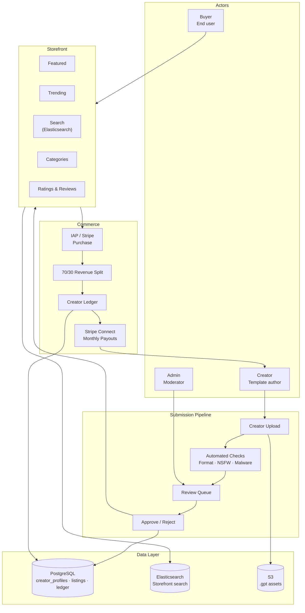
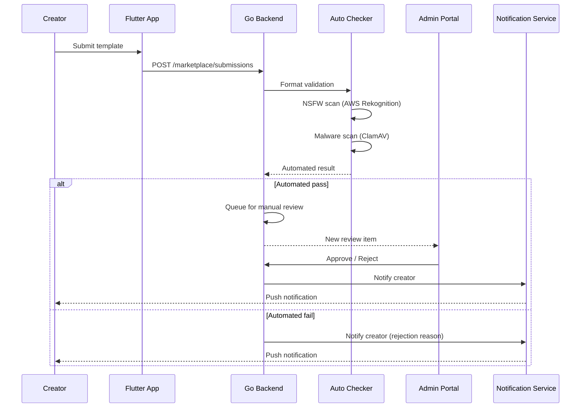
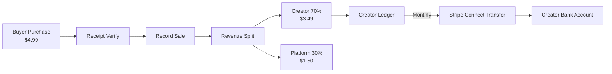

# Creator Marketplace — Architecture Diagram

> Maps to [01-creator-marketplace-architecture.md](01-creator-marketplace-architecture.md)

---

## Marketplace Architecture

---

## Submission & Review Flow

---

## Revenue Flow

