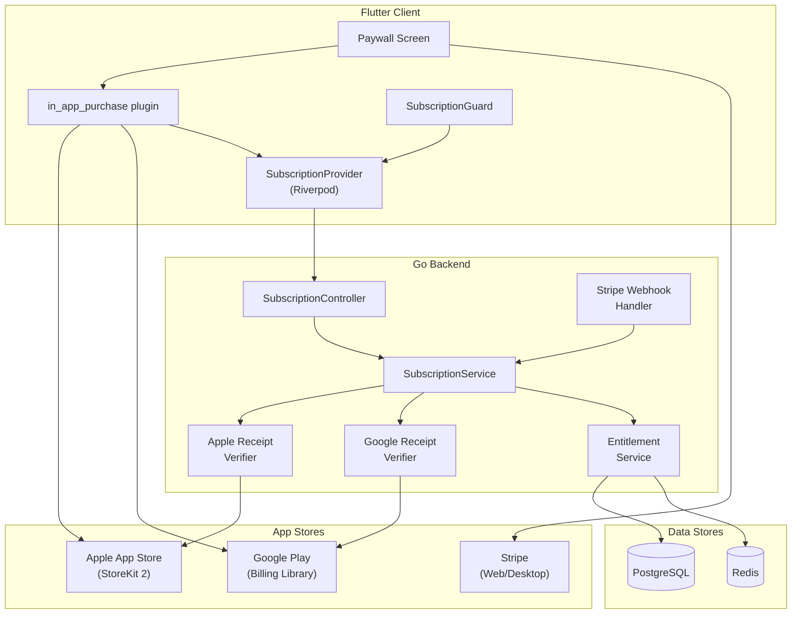
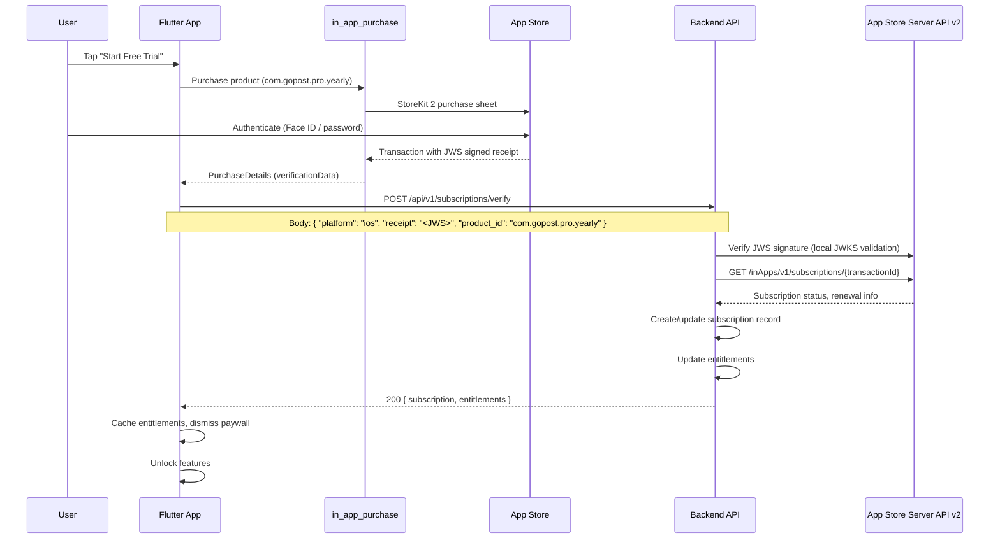
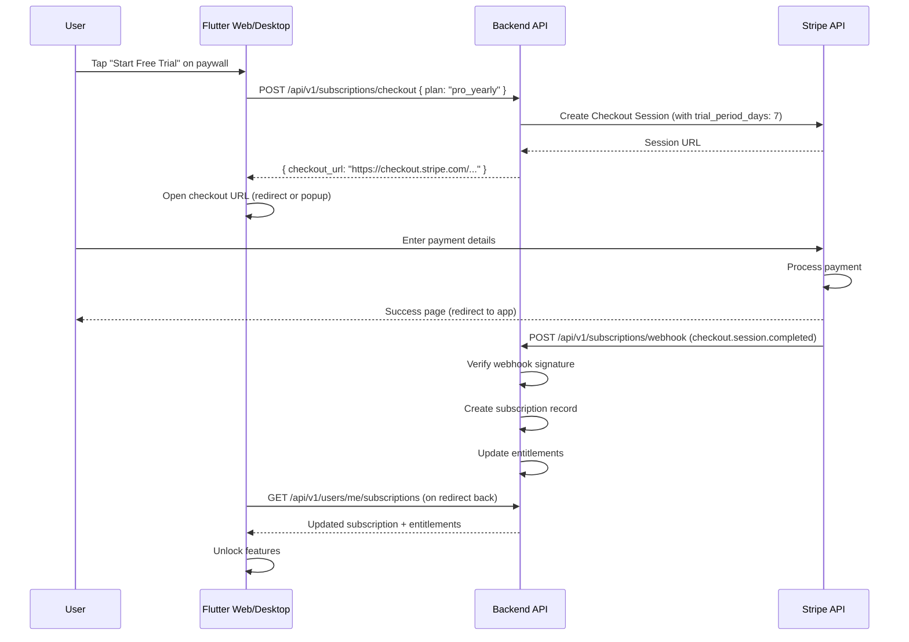
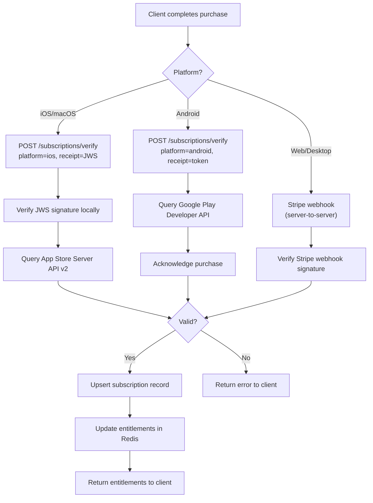
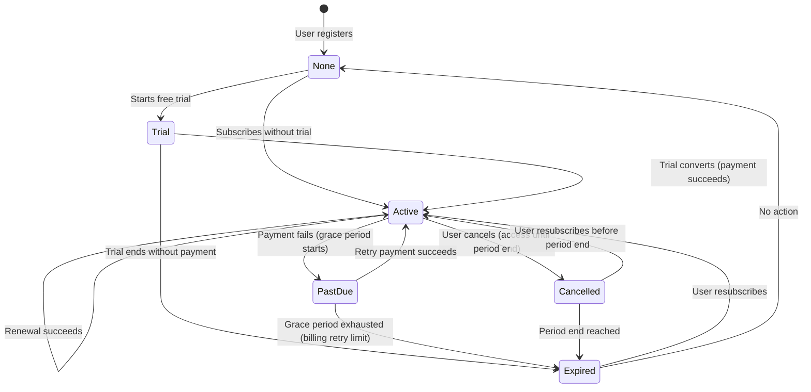
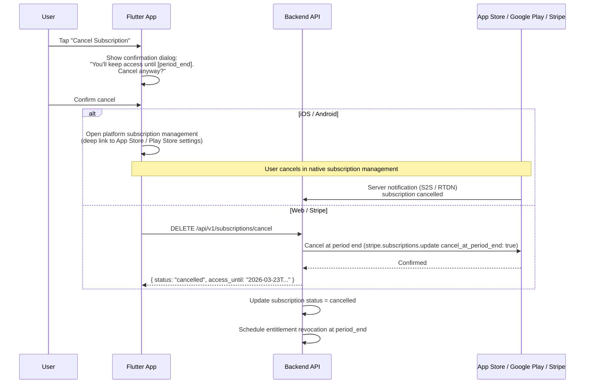

# Gopost — Monetization and Subscription System

> **Version:** 1.0.0
> **Date:** February 23, 2026
> **Classification:** Internal — Engineering + Business Reference
> **Audience:** Flutter Engineers, Backend Engineers, Product Manager

---

## Table of Contents

1. [Revenue Strategy](#1-revenue-strategy)
2. [Subscription Plans](#2-subscription-plans)
3. [Feature Gating Matrix](#3-feature-gating-matrix)
4. [Paywall Architecture (Flutter)](#4-paywall-architecture-flutter)
5. [In-App Purchase Integration](#5-in-app-purchase-integration)
6. [Receipt Validation and Server Verification](#6-receipt-validation-and-server-verification)
7. [Subscription Lifecycle](#7-subscription-lifecycle)
8. [Offer Management](#8-offer-management)
9. [Revenue Analytics](#9-revenue-analytics)
10. [Database Schema Additions](#10-database-schema-additions)
11. [API Endpoints (Detailed)](#11-api-endpoints-detailed)
12. [Sprint Stories](#12-sprint-stories)

---

## 1. Revenue Strategy

### 1.1 Model

Gopost uses a **freemium subscription model** with three tiers. All platforms share the same feature set, but payment processing varies by platform.

| Revenue Stream | Description | Priority |
|---------------|-------------|----------|
| **Subscriptions** | Monthly / yearly recurring plans (Free, Pro, Creator) | Primary |
| **Creator Revenue Share** | 70/30 split on premium templates sold by creators (future) | Secondary (V2) |
| **One-Time Purchases** | Individual premium template packs (future) | Tertiary (V2) |

### 1.2 Payment Providers by Platform

| Platform | Payment Provider | Integration |
|----------|-----------------|-------------|
| iOS / macOS | Apple App Store (StoreKit 2) | `in_app_purchase` Flutter plugin + App Store Server API v2 |
| Android | Google Play Billing Library 6+ | `in_app_purchase` Flutter plugin + Google Play Developer API |
| Web | Stripe Checkout | Stripe SDK + webhooks |
| Windows | Stripe Checkout | Same as web (Microsoft Store IAP optional for V2) |
| RevenueCat (optional) | Cross-platform abstraction | `purchases_flutter` plugin + RevenueCat webhooks |

---

## 2. Subscription Plans

### 2.1 Plan Definitions

| Attribute | Free | Pro | Creator |
|-----------|------|-----|---------|
| **Price (Monthly)** | $0 | $9.99 | $19.99 |
| **Price (Yearly)** | $0 | $79.99 ($6.67/mo, save 33%) | $159.99 ($13.33/mo, save 33%) |
| **Product ID (iOS)** | — | `com.gopost.pro.monthly` / `com.gopost.pro.yearly` | `com.gopost.creator.monthly` / `com.gopost.creator.yearly` |
| **Product ID (Android)** | — | `pro_monthly` / `pro_yearly` | `creator_monthly` / `creator_yearly` |
| **Stripe Price ID** | — | `price_pro_monthly` / `price_pro_yearly` | `price_creator_monthly` / `price_creator_yearly` |
| **Trial Period** | — | 7 days (first subscription only) | 7 days (first subscription only) |

### 2.2 Plan Features

| Feature | Free | Pro | Creator |
|---------|------|-----|---------|
| Template browsing | All (preview only for premium) | All | All |
| Template access (free templates) | Unlimited | Unlimited | Unlimited |
| Template access (premium templates) | None | Unlimited | Unlimited |
| Video editor | Basic (3 effects, 2 tracks) | Full (all effects, 32 tracks) | Full |
| Image editor | Basic (10 filters, 3 layers) | Full (all filters, 100 layers) | Full |
| Export quality | 720p, watermarked | Up to 4K, no watermark | Up to 4K, no watermark |
| Export formats | MP4 (H.264) only | MP4, MOV, WebM, GIF | MP4, MOV, WebM, GIF |
| Cloud storage | 500 MB | 10 GB | 50 GB |
| Template creation | None | Personal (not publishable) | Create + publish to marketplace |
| Analytics (own templates) | None | None | View count, usage stats |
| Priority export queue | No | Yes | Yes |
| Customer support | Community only | Email (48h) | Priority email (24h) |
| Ad-free experience | Occasional prompts | Yes | Yes |

---

## 3. Feature Gating Matrix

### 3.1 Server-Side Entitlement Map

The backend maintains a canonical map of features per plan. The client receives this on login and caches it.

```go
// internal/service/entitlement_service.go

var PlanEntitlements = map[string]Entitlements{
    "free": {
        PremiumTemplates:      false,
        MaxVideoTracks:        2,
        MaxVideoEffects:       3,
        MaxImageLayers:        3,
        MaxImageFilters:       10,
        MaxExportResolution:   720,
        ExportWatermark:       true,
        ExportFormats:         []string{"mp4"},
        CloudStorageMB:        500,
        CanPublishTemplates:   false,
        PriorityExport:        false,
        CreatorAnalytics:      false,
    },
    "pro": {
        PremiumTemplates:      true,
        MaxVideoTracks:        32,
        MaxVideoEffects:       -1, // unlimited
        MaxImageLayers:        100,
        MaxImageFilters:       -1,
        MaxExportResolution:   2160, // 4K
        ExportWatermark:       false,
        ExportFormats:         []string{"mp4", "mov", "webm", "gif"},
        CloudStorageMB:        10240,
        CanPublishTemplates:   false,
        PriorityExport:        true,
        CreatorAnalytics:      false,
    },
    "creator": {
        PremiumTemplates:      true,
        MaxVideoTracks:        32,
        MaxVideoEffects:       -1,
        MaxImageLayers:        100,
        MaxImageFilters:       -1,
        MaxExportResolution:   2160,
        ExportWatermark:       false,
        ExportFormats:         []string{"mp4", "mov", "webm", "gif"},
        CloudStorageMB:        51200,
        CanPublishTemplates:   true,
        PriorityExport:        true,
        CreatorAnalytics:      true,
    },
}
```

### 3.2 Client-Side Entitlement Cache

```dart
// lib/core/subscription/entitlement_cache.dart

class EntitlementCache {
  Entitlements? _cached;
  DateTime? _lastFetched;
  static const _ttl = Duration(hours: 1);

  Future<Entitlements> get(WidgetRef ref) async {
    if (_cached != null && _lastFetched != null &&
        DateTime.now().difference(_lastFetched!) < _ttl) {
      return _cached!;
    }
    _cached = await ref.read(subscriptionServiceProvider).getEntitlements();
    _lastFetched = DateTime.now();
    return _cached!;
  }

  void invalidate() {
    _cached = null;
    _lastFetched = null;
  }
}
```

---

## 4. Paywall Architecture (Flutter)

### 4.1 Paywall Triggers

| Trigger Point | Location | Behavior |
|--------------|----------|----------|
| Premium template access | Template detail screen, "Use Template" button | Show paywall if user is on Free plan |
| Export (quality/format gate) | Export dialog, quality/format selector | Disable 1080p+ and non-MP4 formats; show "Pro" badge with tap-to-upgrade |
| Advanced effects | Effect panel in video/image editor | Lock icon on premium effects; tap shows paywall |
| Additional tracks/layers | Track/layer add button when at limit | Show paywall with message "Upgrade to Pro for up to 32 tracks" |
| Template publishing | "Publish" action in editor save flow | Show paywall with Creator plan details |
| Cloud storage limit | Media upload when at quota | Show paywall with storage comparison |

### 4.2 Paywall Screen

```
┌─────────────────────────────────────────┐
│                    ✕                     │  <- Close button (top-right)
│                                         │
│       🚀 Unlock Gopost Pro              │  <- Headline
│                                         │
│  ✓ All premium templates                │
│  ✓ 4K export, no watermark              │
│  ✓ All effects and filters              │
│  ✓ 10 GB cloud storage                  │
│  ✓ Priority export queue                │
│                                         │
│  ┌─────────────────────────────────┐    │
│  │  Yearly — $79.99/year           │    │  <- Plan toggle (selected = primary bg)
│  │  $6.67/mo • Save 33%           │    │
│  └─────────────────────────────────┘    │
│  ┌─────────────────────────────────┐    │
│  │  Monthly — $9.99/month          │    │  <- Plan toggle (unselected = outline)
│  └─────────────────────────────────┘    │
│                                         │
│  [ Start 7-Day Free Trial ]             │  <- Primary CTA (full width)
│                                         │
│  Terms of Service • Privacy Policy      │  <- Legal links (label.small)
│  Recurring billing. Cancel anytime.     │
│                                         │
│  ── or upgrade to Creator ──            │
│  [See Creator Plan →]                   │  <- Text button
│                                         │
└─────────────────────────────────────────┘
```

### 4.3 SubscriptionGuard Widget

A reusable widget that wraps any feature-gated action:

```dart
// lib/core/subscription/subscription_guard.dart

class SubscriptionGuard extends ConsumerWidget {
  final String requiredPlan; // "pro" or "creator"
  final String featureDescription; // "4K export"
  final Widget child;
  final Widget? lockedChild; // shown when locked (e.g., greyed out button with lock icon)

  const SubscriptionGuard({
    super.key,
    required this.requiredPlan,
    required this.featureDescription,
    required this.child,
    this.lockedChild,
  });

  @override
  Widget build(BuildContext context, WidgetRef ref) {
    final subscription = ref.watch(activeSubscriptionProvider);
    final hasAccess = subscription.when(
      data: (sub) => _meetsRequirement(sub.planId, requiredPlan),
      loading: () => false,
      error: (_, __) => false,
    );

    if (hasAccess) return child;

    return GestureDetector(
      onTap: () => showPaywall(context, requiredPlan: requiredPlan, feature: featureDescription),
      child: lockedChild ?? Opacity(opacity: 0.5, child: AbsorbPointer(child: child)),
    );
  }

  bool _meetsRequirement(String currentPlan, String required) {
    const hierarchy = ['free', 'pro', 'creator'];
    return hierarchy.indexOf(currentPlan) >= hierarchy.indexOf(required);
  }
}
```

**Usage:**

```dart
SubscriptionGuard(
  requiredPlan: 'pro',
  featureDescription: '4K export',
  lockedChild: GpButton(
    label: '4K Export',
    icon: Icons.lock,
    variant: GpButtonVariant.tonal,
    onPressed: null,
  ),
  child: GpButton(
    label: '4K Export',
    onPressed: () => startExport(resolution: 2160),
  ),
)
```

---

## 5. In-App Purchase Integration

### 5.1 Architecture Overview



### 5.2 iOS / macOS — StoreKit 2

**Purchase flow:**



**Server-side verification (StoreKit 2 / App Store Server API v2):**

```go
func (s *SubscriptionService) VerifyAppleReceipt(ctx context.Context, receipt string, productID string, userID uuid.UUID) (*Subscription, error) {
    // 1. Decode and verify JWS (JSON Web Signature) locally
    //    using Apple's public JWKS endpoint
    claims, err := s.appleVerifier.VerifyJWS(receipt)
    if err != nil {
        return nil, ErrInvalidReceipt
    }

    // 2. Verify product ID matches
    if claims.ProductID != productID {
        return nil, ErrProductMismatch
    }

    // 3. Check transaction with App Store Server API v2
    status, err := s.appleClient.GetSubscriptionStatus(ctx, claims.OriginalTransactionID)
    if err != nil {
        return nil, fmt.Errorf("apple API: %w", err)
    }

    // 4. Map Apple status to internal plan
    plan := mapAppleProductToPlan(productID)
    sub := &entity.Subscription{
        UserID:                 userID,
        PlanID:                 plan,
        Status:                 mapAppleStatus(status),
        Provider:               "apple",
        ProviderSubscriptionID: claims.OriginalTransactionID,
        CurrentPeriodStart:     time.Unix(claims.PurchaseDate/1000, 0),
        CurrentPeriodEnd:       time.Unix(claims.ExpiresDate/1000, 0),
    }

    // 5. Upsert subscription
    if err := s.subscriptionRepo.Upsert(ctx, sub); err != nil {
        return nil, err
    }

    // 6. Update entitlements cache
    s.entitlementSvc.RefreshForUser(ctx, userID)

    return sub, nil
}
```

### 5.3 Android — Google Play Billing

**Purchase flow:** Identical to iOS from the user's perspective. The `in_app_purchase` plugin abstracts platform differences.

**Server-side verification:**

```go
func (s *SubscriptionService) VerifyGoogleReceipt(ctx context.Context, purchaseToken string, productID string, userID uuid.UUID) (*Subscription, error) {
    // 1. Verify with Google Play Developer API
    sub, err := s.googleClient.Subscriptions.Get(
        "com.gopost.app", productID, purchaseToken,
    ).Context(ctx).Do()
    if err != nil {
        return nil, fmt.Errorf("google API: %w", err)
    }

    // 2. Validate not cancelled/expired
    if sub.PaymentState == nil || *sub.PaymentState == 0 {
        return nil, ErrPaymentPending
    }

    // 3. Acknowledge purchase (required by Google)
    if sub.AcknowledgementState == 0 {
        _, err = s.googleClient.Subscriptions.Acknowledge(
            "com.gopost.app", productID, purchaseToken,
            &androidpublisher.SubscriptionPurchasesAcknowledgeRequest{},
        ).Context(ctx).Do()
        if err != nil {
            return nil, fmt.Errorf("acknowledge: %w", err)
        }
    }

    // 4. Map to internal subscription (similar to Apple)
    plan := mapGoogleProductToPlan(productID)
    result := &entity.Subscription{
        UserID:                 userID,
        PlanID:                 plan,
        Status:                 mapGoogleStatus(sub),
        Provider:               "google",
        ProviderSubscriptionID: purchaseToken,
        CurrentPeriodStart:     time.UnixMilli(sub.StartTimeMillis),
        CurrentPeriodEnd:       time.UnixMilli(sub.ExpiryTimeMillis),
    }

    if err := s.subscriptionRepo.Upsert(ctx, result); err != nil {
        return nil, err
    }
    s.entitlementSvc.RefreshForUser(ctx, userID)
    return result, nil
}
```

### 5.4 Web / Desktop — Stripe

**Purchase flow:**



**Stripe webhook handler:**

```go
func (c *SubscriptionController) HandleStripeWebhook(ctx *gin.Context) {
    payload, _ := io.ReadAll(ctx.Request.Body)
    sig := ctx.GetHeader("Stripe-Signature")

    event, err := webhook.ConstructEvent(payload, sig, c.stripeWebhookSecret)
    if err != nil {
        ctx.JSON(400, response.Error("INVALID_SIGNATURE", "Webhook signature invalid"))
        return
    }

    switch event.Type {
    case "checkout.session.completed":
        c.handleCheckoutComplete(ctx, event)
    case "customer.subscription.updated":
        c.handleSubscriptionUpdate(ctx, event)
    case "customer.subscription.deleted":
        c.handleSubscriptionCancel(ctx, event)
    case "invoice.payment_failed":
        c.handlePaymentFailed(ctx, event)
    case "invoice.paid":
        c.handleInvoicePaid(ctx, event)
    default:
        // Log unknown event type
    }

    ctx.JSON(200, gin.H{"received": true})
}
```

### 5.5 RevenueCat (Optional Abstraction)

If RevenueCat is adopted, it replaces direct StoreKit/Play Billing integration:

| Aspect | Direct Integration | With RevenueCat |
|--------|-------------------|-----------------|
| Client SDK | `in_app_purchase` (Flutter) | `purchases_flutter` (RevenueCat) |
| Server validation | Custom code per platform | RevenueCat handles automatically |
| Webhook | Apple S2S + Google RTDN + Stripe | Single RevenueCat webhook |
| Entitlement management | Custom server logic | RevenueCat Entitlements API |
| Analytics | Custom (see Section 9) | RevenueCat Charts dashboard |
| Cost | $0 (code effort) | Free up to $2.5K MTR; 1% above |
| Cross-platform sync | Custom (match by user ID) | Automatic via RevenueCat user ID |

**Decision:** Start with direct integration for full control; evaluate RevenueCat adoption at $10K MRR if operational overhead is high.

---

## 6. Receipt Validation and Server Verification

### 6.1 Validation Flow Summary



### 6.2 Security Considerations

| Concern | Mitigation |
|---------|-----------|
| Receipt replay | Store `original_transaction_id` / `purchase_token`; reject duplicates |
| Receipt sharing between accounts | Bind receipt to user ID on first verification; reject if already bound to different user |
| Fake receipts | Always validate server-side with Apple/Google APIs; never trust client-only validation |
| Webhook replay | Verify Stripe signature; Apple S2S notifications have JWS signature; Google RTDN has OAuth verification |
| Grace period abuse | Server checks `current_period_end`; client entitlement cache has 1-hour TTL |

---

## 7. Subscription Lifecycle

### 7.1 State Machine



### 7.2 State Definitions

| State | DB Value | Access Level | User Communication |
|-------|---------|-------------|-------------------|
| `none` | `none` | Free tier | — |
| `trialing` | `trialing` | Pro/Creator tier (full access) | "Trial ends in X days" banner |
| `active` | `active` | Pro/Creator tier (full access) | — |
| `past_due` | `past_due` | Pro/Creator tier (grace period, 7 days) | "Payment failed — update payment method" banner |
| `cancelled` | `cancelled` | Pro/Creator tier until period end | "Your plan ends on [date]" banner |
| `expired` | `expired` | Free tier | "Your Pro plan has expired — resubscribe" banner |

### 7.3 Grace Periods and Billing Retry

| Platform | Grace Period | Retry Schedule |
|----------|-------------|---------------|
| iOS | 16 days (Apple managed) | Apple retries at increasing intervals |
| Android | 7 days (configurable in Play Console) | Google retries 3 times over 7 days |
| Stripe | 7 days (configured via Smart Retries) | Stripe retries 4 times over 7 days |

### 7.4 Cancellation Flow



---

## 8. Offer Management

### 8.1 Introductory Offers

| Offer Type | Configuration | Platform Support |
|-----------|---------------|-----------------|
| Free trial | 7 days for first-time subscribers | iOS, Android, Stripe |
| Pay-up-front discount | First year at $59.99 (40% off) | iOS, Android, Stripe |
| Pay-as-you-go discount | First 3 months at $4.99/mo | iOS, Android |

### 8.2 Promotional Codes

| Attribute | Detail |
|-----------|--------|
| Format | 8-character alphanumeric (e.g., `GOPOST24`) |
| Types | Fixed discount ($), percentage discount (%), free months |
| Limits | Max redemptions, expiry date, one-per-user |
| Distribution | Email campaigns, social media, partnership deals |
| Redemption | Entered on paywall screen → validated server-side → applied to checkout |

**API:**

```
POST /api/v1/subscriptions/promo/validate
{ "code": "GOPOST24" }

Response (200):
{
  "success": true,
  "data": {
    "code": "GOPOST24",
    "discount_type": "percentage",
    "discount_value": 50,
    "applicable_plans": ["pro_yearly", "creator_yearly"],
    "expires_at": "2026-06-30T23:59:59Z"
  }
}

POST /api/v1/subscriptions/promo/redeem
{ "code": "GOPOST24", "plan_id": "pro_yearly" }
// Applies promo to next checkout
```

### 8.3 Upgrade / Downgrade

| Scenario | Behavior |
|----------|----------|
| Free → Pro | New subscription, trial if eligible |
| Free → Creator | New subscription, trial if eligible |
| Pro → Creator | Immediate upgrade; prorated charge for remaining period |
| Creator → Pro | Downgrade at period end (keep Creator access until then) |
| Any → Free (cancel) | Access until period end, then revert to Free |
| Yearly ↔ Monthly | Change takes effect at next renewal |

---

## 9. Revenue Analytics

### 9.1 Key Metrics

| Metric | Definition | Source |
|--------|-----------|--------|
| **MRR** (Monthly Recurring Revenue) | Sum of all active subscription monthly-equivalent amounts | `subscriptions` table |
| **ARR** (Annual Recurring Revenue) | MRR × 12 | Derived |
| **New MRR** | MRR from new subscriptions this period | New subscription events |
| **Churned MRR** | MRR lost from cancellations/expirations this period | Cancellation events |
| **Net MRR Growth** | New MRR - Churned MRR | Derived |
| **Churn Rate** | Churned subscribers / total subscribers at period start | Derived |
| **LTV** (Lifetime Value) | Average revenue per user / churn rate | Derived |
| **Conversion Rate** | Paid subscribers / total users | Derived |
| **Trial Conversion Rate** | Trials that convert to paid / total trials | Trial + payment events |
| **ARPU** (Average Revenue Per User) | Total revenue / total users | Derived |

### 9.2 Admin Dashboard Integration

These metrics feed into the admin analytics screen (see [Admin Portal Section 4.6](../admin-portal/01-admin-portal.md#46-analytics)):

```
GET /api/v1/admin/analytics/revenue?period=30d&granularity=daily

{
  "success": true,
  "data": {
    "mrr_cents": 1240000,
    "mrr_growth_percent": 12.4,
    "arr_cents": 14880000,
    "new_mrr_cents": 185000,
    "churned_mrr_cents": 32000,
    "churn_rate_percent": 3.2,
    "ltv_cents": 2850,
    "conversion_rate_percent": 8.4,
    "trial_conversion_rate_percent": 62.0,
    "timeseries": [
      { "date": "2026-02-01", "mrr_cents": 1120000, "new_subs": 45, "churned": 12 },
      { "date": "2026-02-02", "mrr_cents": 1125000, "new_subs": 38, "churned": 8 },
      ...
    ]
  }
}
```

---

## 10. Database Schema Additions

The existing `subscriptions` and `payments` tables (from [12-database-schema.md](../architecture/12-database-schema.md)) are extended with these additional tables:

### 10.1 New Tables

```sql
-- Subscription plan definitions (server-managed, not from app stores)
CREATE TABLE subscription_plans (
    id              VARCHAR(50) PRIMARY KEY,   -- "pro_monthly", "pro_yearly", "creator_monthly", "creator_yearly"
    name            VARCHAR(100) NOT NULL,
    tier            VARCHAR(20)  NOT NULL,     -- "pro", "creator"
    billing_cycle   VARCHAR(20)  NOT NULL,     -- "monthly", "yearly"
    price_cents     INTEGER      NOT NULL,
    currency        VARCHAR(3)   NOT NULL DEFAULT 'USD',
    trial_days      INTEGER      NOT NULL DEFAULT 0,
    is_active       BOOLEAN      NOT NULL DEFAULT true,
    features        JSONB        NOT NULL,     -- entitlement map
    apple_product_id   VARCHAR(100),
    google_product_id  VARCHAR(100),
    stripe_price_id    VARCHAR(100),
    created_at      TIMESTAMPTZ  NOT NULL DEFAULT NOW(),
    updated_at      TIMESTAMPTZ  NOT NULL DEFAULT NOW()
);

-- Entitlements per user (denormalized for fast lookup)
CREATE TABLE entitlements (
    user_id             UUID        PRIMARY KEY REFERENCES users(id) ON DELETE CASCADE,
    plan_id             VARCHAR(50) NOT NULL DEFAULT 'free',
    is_trial            BOOLEAN     NOT NULL DEFAULT false,
    premium_templates   BOOLEAN     NOT NULL DEFAULT false,
    max_video_tracks    INTEGER     NOT NULL DEFAULT 2,
    max_video_effects   INTEGER     NOT NULL DEFAULT 3,
    max_image_layers    INTEGER     NOT NULL DEFAULT 3,
    max_image_filters   INTEGER     NOT NULL DEFAULT 10,
    max_export_res      INTEGER     NOT NULL DEFAULT 720,
    export_watermark    BOOLEAN     NOT NULL DEFAULT true,
    export_formats      TEXT[]      NOT NULL DEFAULT ARRAY['mp4'],
    cloud_storage_mb    INTEGER     NOT NULL DEFAULT 500,
    can_publish         BOOLEAN     NOT NULL DEFAULT false,
    priority_export     BOOLEAN     NOT NULL DEFAULT false,
    creator_analytics   BOOLEAN     NOT NULL DEFAULT false,
    valid_until         TIMESTAMPTZ,
    updated_at          TIMESTAMPTZ NOT NULL DEFAULT NOW()
);

-- Promotional codes
CREATE TABLE promotional_codes (
    id              UUID        PRIMARY KEY DEFAULT gen_random_uuid(),
    code            VARCHAR(20) NOT NULL UNIQUE,
    discount_type   VARCHAR(20) NOT NULL,      -- "percentage", "fixed_amount", "free_months"
    discount_value  INTEGER     NOT NULL,      -- percentage (50) or cents (500) or months (3)
    applicable_plans TEXT[]     NOT NULL,       -- ["pro_yearly", "creator_yearly"]
    max_redemptions INTEGER,
    current_redemptions INTEGER NOT NULL DEFAULT 0,
    is_active       BOOLEAN     NOT NULL DEFAULT true,
    expires_at      TIMESTAMPTZ,
    created_at      TIMESTAMPTZ NOT NULL DEFAULT NOW()
);

-- Promo code redemptions
CREATE TABLE promo_redemptions (
    id              UUID        PRIMARY KEY DEFAULT gen_random_uuid(),
    code_id         UUID        NOT NULL REFERENCES promotional_codes(id),
    user_id         UUID        NOT NULL REFERENCES users(id),
    subscription_id UUID        REFERENCES subscriptions(id),
    redeemed_at     TIMESTAMPTZ NOT NULL DEFAULT NOW(),
    UNIQUE(code_id, user_id)   -- one redemption per user per code
);

-- Apple/Google receipts (for audit and replay protection)
CREATE TABLE receipts (
    id                      UUID        PRIMARY KEY DEFAULT gen_random_uuid(),
    user_id                 UUID        NOT NULL REFERENCES users(id),
    subscription_id         UUID        REFERENCES subscriptions(id),
    platform                VARCHAR(20) NOT NULL,  -- "apple", "google", "stripe"
    original_transaction_id VARCHAR(255) NOT NULL UNIQUE,
    product_id              VARCHAR(100) NOT NULL,
    receipt_data            TEXT,         -- encrypted or hashed
    verified_at             TIMESTAMPTZ  NOT NULL DEFAULT NOW(),
    expires_at              TIMESTAMPTZ
);
```

### 10.2 Indexes

```sql
CREATE INDEX idx_entitlements_plan ON entitlements(plan_id);
CREATE INDEX idx_entitlements_valid ON entitlements(valid_until) WHERE valid_until IS NOT NULL;
CREATE INDEX idx_promo_codes_code ON promotional_codes(code) WHERE is_active = true;
CREATE INDEX idx_promo_redemptions_user ON promo_redemptions(user_id);
CREATE INDEX idx_receipts_user ON receipts(user_id);
CREATE INDEX idx_receipts_txn ON receipts(original_transaction_id);
```

### 10.3 Modifications to Existing Tables

Add to `subscriptions` table:

```sql
ALTER TABLE subscriptions ADD COLUMN plan_id VARCHAR(50) REFERENCES subscription_plans(id);
ALTER TABLE subscriptions ADD COLUMN trial_start TIMESTAMPTZ;
ALTER TABLE subscriptions ADD COLUMN trial_end TIMESTAMPTZ;
ALTER TABLE subscriptions ADD COLUMN promo_code_id UUID REFERENCES promotional_codes(id);
```

---

## 11. API Endpoints (Detailed)

### 11.1 GET /api/v1/subscriptions/plans

List available subscription plans with pricing.

**Auth:** None required

**Response (200):**
```json
{
  "success": true,
  "data": [
    {
      "id": "pro_monthly",
      "name": "Pro Monthly",
      "tier": "pro",
      "billing_cycle": "monthly",
      "price_cents": 999,
      "currency": "USD",
      "trial_days": 7,
      "features": {
        "premium_templates": true,
        "max_export_resolution": 2160,
        "export_watermark": false,
        "cloud_storage_mb": 10240
      },
      "apple_product_id": "com.gopost.pro.monthly",
      "google_product_id": "pro_monthly",
      "stripe_price_id": "price_pro_monthly"
    }
  ]
}
```

### 11.2 POST /api/v1/subscriptions/verify

Verify a purchase receipt from iOS or Android.

**Auth:** Required

**Request:**
```json
{
  "platform": "ios",
  "receipt": "<JWS signed transaction or purchase token>",
  "product_id": "com.gopost.pro.yearly"
}
```

**Response (200):**
```json
{
  "success": true,
  "data": {
    "subscription": {
      "id": "...",
      "plan_id": "pro_yearly",
      "status": "active",
      "provider": "apple",
      "current_period_start": "2026-02-23T10:00:00Z",
      "current_period_end": "2027-02-23T10:00:00Z",
      "is_trial": true,
      "trial_end": "2026-03-02T10:00:00Z"
    },
    "entitlements": {
      "plan_id": "pro",
      "premium_templates": true,
      "max_video_tracks": 32,
      "max_export_res": 2160,
      "export_watermark": false,
      "export_formats": ["mp4", "mov", "webm", "gif"],
      "cloud_storage_mb": 10240,
      "can_publish": false,
      "priority_export": true,
      "valid_until": "2027-02-23T10:00:00Z"
    }
  }
}
```

**Errors:** `400 INVALID_RECEIPT`, `400 PRODUCT_MISMATCH`, `409 RECEIPT_ALREADY_USED`

### 11.3 POST /api/v1/subscriptions/checkout

Create a Stripe checkout session (web/desktop only).

**Auth:** Required

**Request:**
```json
{
  "plan_id": "pro_yearly",
  "promo_code": "GOPOST24",
  "success_url": "https://gopost.app/subscription/success",
  "cancel_url": "https://gopost.app/subscription/cancel"
}
```

**Response (200):**
```json
{
  "success": true,
  "data": {
    "checkout_url": "https://checkout.stripe.com/c/pay/...",
    "session_id": "cs_..."
  }
}
```

### 11.4 POST /api/v1/subscriptions/webhook

Stripe webhook endpoint. No auth header; verified via Stripe signature.

### 11.5 DELETE /api/v1/subscriptions/cancel

Cancel current subscription at period end.

**Auth:** Required

**Response (200):**
```json
{
  "success": true,
  "data": {
    "status": "cancelled",
    "access_until": "2027-02-23T10:00:00Z",
    "message": "Your Pro plan will remain active until Feb 23, 2027"
  }
}
```

### 11.6 GET /api/v1/users/me/entitlements

Get current user's entitlements (cached, fast).

**Auth:** Required

**Response (200):**
```json
{
  "success": true,
  "data": {
    "plan_id": "pro",
    "is_trial": false,
    "premium_templates": true,
    "max_video_tracks": 32,
    "max_video_effects": -1,
    "max_image_layers": 100,
    "max_image_filters": -1,
    "max_export_res": 2160,
    "export_watermark": false,
    "export_formats": ["mp4", "mov", "webm", "gif"],
    "cloud_storage_mb": 10240,
    "can_publish": false,
    "priority_export": true,
    "creator_analytics": false,
    "valid_until": "2027-02-23T10:00:00Z"
  }
}
```

### 11.7 POST /api/v1/subscriptions/promo/validate and /redeem

See Section 8.2.

---

## 12. Sprint Stories

### Sprint Assignment

| Attribute | Value |
|---|---|
| **Phase** | Phase 5: Admin Portal |
| **Sprint(s)** | Sprint 13 (Weeks 25-26) |
| **Team** | Flutter Engineers (2), Backend Engineers (1) |
| **Predecessor** | ADM-001 through ADM-010 (Sprint 12) |
| **Story Points Total** | 63 |

### User Stories

| ID | Story | Acceptance Criteria | Points | Priority |
|---|---|---|---|---|
| MON-001 | As a backend engineer, I want subscription_plans, entitlements, promotional_codes, promo_redemptions, and receipts tables migrated so that the monetization data model is ready. | - All 5 tables created with indexes<br/>- subscription_plans seeded with pro_monthly, pro_yearly, creator_monthly, creator_yearly<br/>- entitlements table populated for existing users (plan_id = 'free')<br/>- subscriptions table altered with new columns | 5 | P0 |
| MON-002 | As a backend engineer, I want the entitlement service that maps plans to feature flags so that feature gating is server-controlled. | - PlanEntitlements map defined<br/>- EntitlementService.RefreshForUser updates entitlements table + Redis cache<br/>- GET /users/me/entitlements endpoint returns cached entitlements (< 5ms) | 5 | P0 |
| MON-003 | As a backend engineer, I want POST /subscriptions/verify for iOS (App Store Server API v2) so that Apple purchases are validated server-side. | - JWS signature verified locally<br/>- Subscription status checked with Apple API<br/>- Receipt stored in receipts table<br/>- Subscription upserted, entitlements refreshed<br/>- Duplicate receipts rejected (409) | 8 | P0 |
| MON-004 | As a backend engineer, I want POST /subscriptions/verify for Android (Google Play Developer API) so that Google purchases are validated server-side. | - Purchase token verified with Google API<br/>- Purchase acknowledged<br/>- Receipt stored, subscription upserted, entitlements refreshed | 8 | P0 |
| MON-005 | As a backend engineer, I want Stripe checkout session creation and webhook handling so that web/desktop subscriptions work. | - POST /subscriptions/checkout creates Stripe session with correct price<br/>- Webhook handles: checkout.session.completed, subscription.updated/deleted, invoice events<br/>- Signature verification on all webhooks<br/>- Subscription and entitlements updated | 8 | P0 |
| MON-006 | As a Flutter engineer, I want the paywall screen with plan toggle, feature list, and purchase flow so that users can subscribe. | - Paywall shows Pro features, plan toggle (monthly/yearly), 7-day trial CTA<br/>- "See Creator Plan" link<br/>- Integrates with in_app_purchase plugin (iOS/Android) and Stripe (web)<br/>- Success dismisses paywall, failure shows error | 5 | P0 |
| MON-007 | As a Flutter engineer, I want the SubscriptionGuard widget so that premium features are gated throughout the app. | - SubscriptionGuard wraps premium actions<br/>- Shows locked state with lock icon<br/>- Tap opens paywall<br/>- Respects cached entitlements<br/>- Works for all gate points listed in Section 4.1 | 5 | P0 |
| MON-008 | As a Flutter engineer, I want subscription state management (Riverpod providers) so that subscription status and entitlements are available app-wide. | - activeSubscriptionProvider watches current subscription<br/>- entitlementsProvider provides cached entitlements<br/>- Auto-refreshes on app resume and after purchase<br/>- Handles offline gracefully (uses cached entitlements) | 5 | P0 |
| MON-009 | As a backend engineer, I want promotional code validation and redemption endpoints so that promo codes work. | - POST /subscriptions/promo/validate returns discount details<br/>- POST /subscriptions/promo/redeem links promo to user<br/>- Promo applied to Stripe checkout, iOS/Android via server config<br/>- Max redemptions and expiry enforced | 5 | P1 |
| MON-010 | As a Flutter engineer, I want promo code input on the paywall so that users can enter discount codes. | - Text input field on paywall for promo code<br/>- "Apply" validates via API, shows discount or error<br/>- Updated price shown before purchase | 3 | P1 |
| MON-011 | As a Flutter engineer, I want subscription management screen (cancel, change plan) so that users can manage their subscription. | - Shows current plan, renewal date, payment method<br/>- "Cancel Subscription" button with confirmation<br/>- iOS/Android: deep links to native subscription management<br/>- Web: links to Stripe Customer Portal | 3 | P0 |
| MON-012 | As a backend engineer, I want the revenue analytics endpoint so that the admin dashboard has subscription metrics. | - GET /admin/analytics/revenue returns MRR, churn, LTV, conversion, timeseries<br/>- Period and granularity parameters<br/>- Cached with 5-min TTL | 3 | P1 |

### Definition of Done

- [ ] All stories marked complete
- [ ] Code reviewed and merged to `develop`
- [ ] Unit tests passing (>= 90% coverage for backend, >= 85% for Flutter)
- [ ] Integration tests: purchase flow verified with sandbox/test environments (iOS Sandbox, Google test tracks, Stripe test mode)
- [ ] Entitlements correctly applied after purchase on all platforms
- [ ] Paywall renders correctly on iOS, Android, and Web
- [ ] Documentation updated
