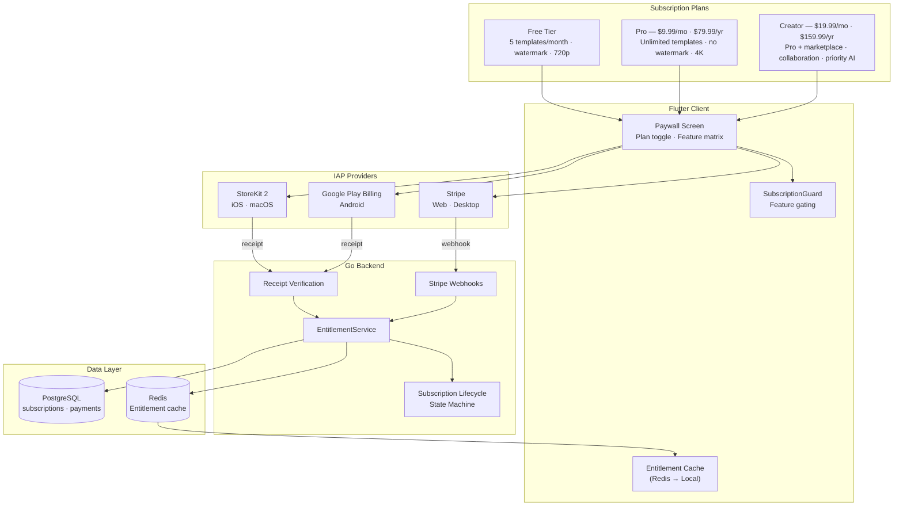
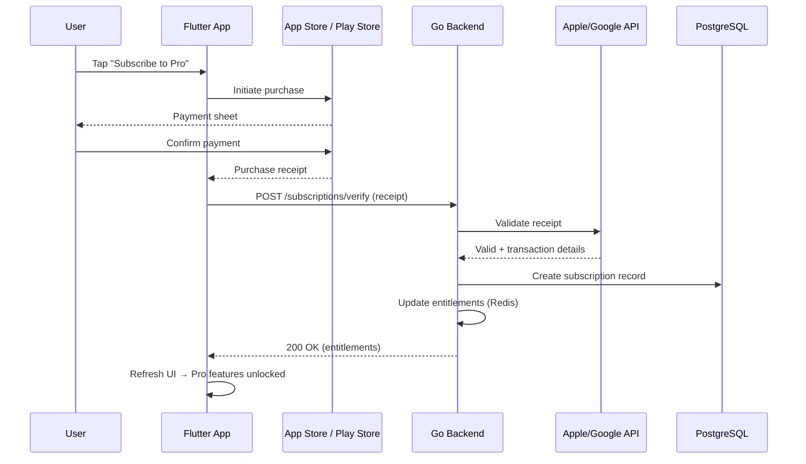
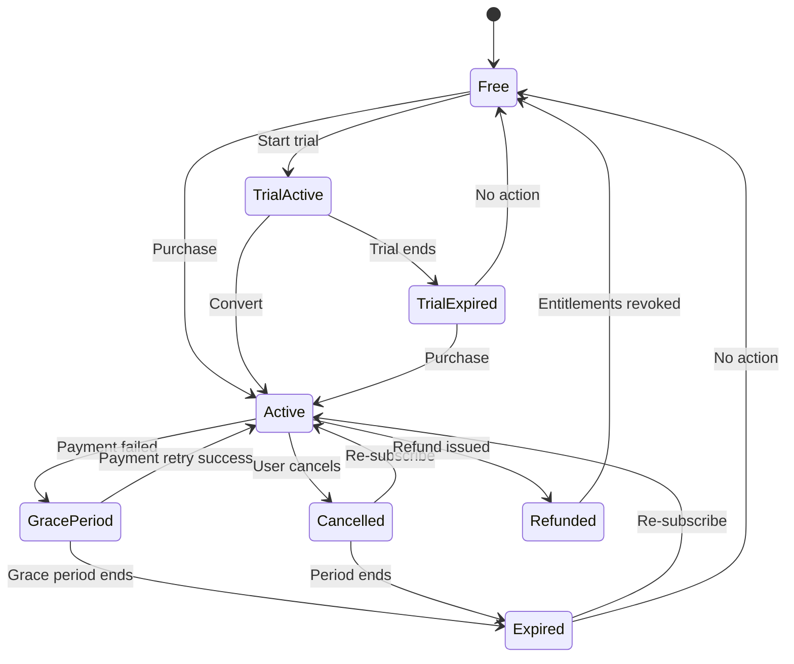

# Monetization System — Architecture Diagram

> Maps to [01-monetization-system.md](01-monetization-system.md)

---

## Subscription Architecture

---

## Purchase Flow

---

## Subscription Lifecycle State Machine

