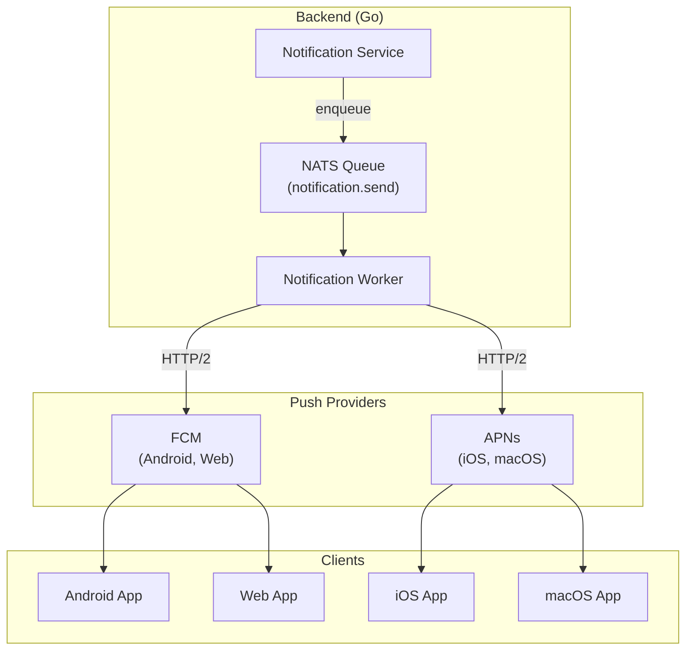

# Gopost — Push Notification Architecture

> **Version:** 1.0.0
> **Date:** February 23, 2026
> **Audience:** Backend Engineers, Flutter Engineers, DevOps
> **References:** [Backend Architecture](../architecture/04-backend-architecture.md), [Localization](../localization/01-localization-architecture.md)

---

## Table of Contents

1. [Overview](#1-overview)
2. [Provider Architecture](#2-provider-architecture)
3. [Notification Types](#3-notification-types)
4. [Payload Schema](#4-payload-schema)
5. [Backend Notification Service](#5-backend-notification-service)
6. [Client Integration (Flutter)](#6-client-integration-flutter)
7. [Notification Channels and Categories](#7-notification-channels-and-categories)
8. [Deep Linking](#8-deep-linking)
9. [Silent / Data Notifications](#9-silent--data-notifications)
10. [User Preferences](#10-user-preferences)
11. [Rate Limiting and Throttling](#11-rate-limiting-and-throttling)
12. [Analytics](#12-analytics)
13. [Testing Strategy](#13-testing-strategy)
14. [Implementation Guide](#14-implementation-guide)
15. [Sprint Stories](#15-sprint-stories)

---

## 1. Overview

Gopost uses push notifications to re-engage users, deliver system alerts, and communicate subscription lifecycle events. The system is provider-agnostic at the application layer, with platform-specific adapters for FCM (Android, Web) and APNs (iOS, macOS).

### 1.1 Design Principles

| Principle | Description |
|-----------|-------------|
| **User-first** | No notification without explicit opt-in; all categories independently toggleable |
| **Locale-aware** | Title and body rendered in the user's preferred locale |
| **Deep-link capable** | Every notification carries a route; tapping opens the relevant screen |
| **Deduplication** | Backend prevents duplicate sends (idempotency key per notification) |
| **Auditable** | Every sent notification is logged for support and analytics |

---

## 2. Provider Architecture



### 2.1 Provider Selection Logic

```go
func (w *NotificationWorker) selectProvider(device DeviceRegistration) PushProvider {
    switch device.Platform {
    case "ios", "macos":
        return w.apnsProvider
    case "android", "web":
        return w.fcmProvider
    default:
        return w.fcmProvider // fallback
    }
}
```

### 2.2 Multi-Device Support

A user can have multiple registered devices. When sending a notification, the backend iterates all active device tokens for the target user.

---

## 3. Notification Types

### 3.1 User-Facing Notifications

| Type | Trigger | Example Title | Example Body | Deep Link |
|------|---------|--------------|-------------|-----------|
| **New template** | New template published matching user's interests | "New template for you" | "Check out 'Cinematic Opener' — a trending travel template" | `/templates/{id}` |
| **Template approved** | Admin approves creator's template | "Template approved!" | "Your template 'Summer Vibes' is now live" | `/templates/{id}` |
| **Template rejected** | Admin rejects creator's template | "Template needs changes" | "Your template 'Summer Vibes' was not approved. Tap to see feedback" | `/templates/{id}/feedback` |
| **Subscription expiring** | 3 days before subscription renewal fails | "Subscription expiring soon" | "Your Pro plan expires in 3 days. Update payment to keep access" | `/settings/subscription` |
| **Subscription renewed** | Successful renewal | "Subscription renewed" | "Your Pro plan has been renewed. Enjoy unlimited templates!" | `/settings/subscription` |
| **Subscription cancelled** | User cancels or payment fails | "Subscription ended" | "Your Pro plan has ended. Upgrade to restore access" | `/subscription/upgrade` |
| **Welcome** | After first registration | "Welcome to Gopost!" | "Start creating with thousands of templates" | `/home` |
| **Inactivity re-engagement** | No app open in 7 days | "We miss you!" | "New templates added this week — come check them out" | `/home?tab=new` |
| **Export complete** | Server-side render/transcode done (if applicable) | "Export ready" | "Your video 'Travel Montage' is ready to download" | `/projects/{id}` |

### 3.2 Silent / Data Notifications

| Type | Trigger | Purpose | Data |
|------|---------|---------|------|
| **Entitlement refresh** | Subscription status change | Force client to re-fetch entitlements | `{ "action": "refresh_entitlements" }` |
| **Config update** | Feature flag or remote config change | Force client to re-fetch config | `{ "action": "refresh_config" }` |
| **Token rotation** | Security event (password change, suspicious activity) | Force re-authentication | `{ "action": "force_logout" }` |
| **Template cache invalidation** | Template updated/unpublished | Clear specific cached template | `{ "action": "invalidate_template", "template_id": "..." }` |

---

## 4. Payload Schema

### 4.1 FCM Payload

```json
{
  "message": {
    "token": "device_fcm_token",
    "notification": {
      "title": "New template for you",
      "body": "Check out 'Cinematic Opener' — a trending travel template",
      "image": "https://cdn.gopost.app/thumbs/tpl_001.webp"
    },
    "data": {
      "type": "new_template",
      "deep_link": "/templates/tpl_001",
      "notification_id": "ntf_abc123",
      "sent_at": "2026-02-23T10:00:00Z"
    },
    "android": {
      "notification": {
        "channel_id": "templates",
        "click_action": "FLUTTER_NOTIFICATION_CLICK",
        "icon": "ic_notification",
        "color": "#6C5CE7"
      }
    },
    "webpush": {
      "notification": {
        "icon": "https://cdn.gopost.app/icon-192.png",
        "badge": "https://cdn.gopost.app/badge-72.png"
      },
      "fcm_options": {
        "link": "https://app.gopost.app/templates/tpl_001"
      }
    }
  }
}
```

### 4.2 APNs Payload

```json
{
  "aps": {
    "alert": {
      "title": "New template for you",
      "body": "Check out 'Cinematic Opener' — a trending travel template"
    },
    "badge": 1,
    "sound": "default",
    "mutable-content": 1,
    "category": "TEMPLATE_NEW",
    "thread-id": "templates"
  },
  "type": "new_template",
  "deep_link": "/templates/tpl_001",
  "notification_id": "ntf_abc123",
  "image_url": "https://cdn.gopost.app/thumbs/tpl_001.webp"
}
```

### 4.3 Silent Notification Payload (APNs)

```json
{
  "aps": {
    "content-available": 1
  },
  "action": "refresh_entitlements"
}
```

---

## 5. Backend Notification Service

### 5.1 Domain Layer

```go
// internal/domain/notification.go

type Notification struct {
    ID          string
    UserID      string
    Type        string    // "new_template", "subscription_expiring", etc.
    Title       string
    Body        string
    ImageURL    string
    DeepLink    string
    Data        map[string]string
    Locale      string
    CreatedAt   time.Time
    SentAt      *time.Time
    ReadAt      *time.Time
    Status      string    // "pending", "sent", "failed", "read"
}

type DeviceRegistration struct {
    ID        string
    UserID    string
    Token     string
    Platform  string // "ios", "android", "web", "macos"
    AppVersion string
    CreatedAt time.Time
    UpdatedAt time.Time
    Active    bool
}
```

### 5.2 Service Layer

```go
// internal/service/notification_service.go

type NotificationService struct {
    repo       NotificationRepository
    deviceRepo DeviceRepository
    userRepo   UserRepository
    queue      MessageQueue
    i18n       *i18n.Translator
}

func (s *NotificationService) Send(ctx context.Context, req SendNotificationRequest) error {
    user, err := s.userRepo.GetByID(ctx, req.UserID)
    if err != nil {
        return err
    }

    if !user.NotificationPreferences.IsEnabled(req.Type) {
        return nil // user opted out of this category
    }

    title := s.i18n.Translate(user.Locale, req.Type+".title", req.Args...)
    body := s.i18n.Translate(user.Locale, req.Type+".body", req.Args...)

    notification := &Notification{
        ID:       generateID("ntf"),
        UserID:   req.UserID,
        Type:     req.Type,
        Title:    title,
        Body:     body,
        ImageURL: req.ImageURL,
        DeepLink: req.DeepLink,
        Data:     req.Data,
        Locale:   user.Locale,
        Status:   "pending",
    }

    if err := s.repo.Create(ctx, notification); err != nil {
        return err
    }

    return s.queue.Publish("notification.send", notification)
}
```

### 5.3 Worker (NATS Consumer)

```go
// internal/worker/notification_worker.go

func (w *NotificationWorker) HandleSend(msg *nats.Msg) {
    var notification Notification
    json.Unmarshal(msg.Data, &notification)

    devices, _ := w.deviceRepo.GetActiveByUserID(notification.UserID)

    for _, device := range devices {
        provider := w.selectProvider(device)
        err := provider.Send(PushMessage{
            Token:    device.Token,
            Title:    notification.Title,
            Body:     notification.Body,
            ImageURL: notification.ImageURL,
            Data:     notification.Data,
            DeepLink: notification.DeepLink,
        })

        if err != nil {
            if isInvalidToken(err) {
                w.deviceRepo.Deactivate(device.ID)
            }
            w.logger.Error("push send failed", "device", device.ID, "err", err)
            continue
        }
    }

    w.repo.MarkSent(notification.ID, time.Now())
    msg.Ack()
}
```

### 5.4 Database Schema

```sql
CREATE TABLE notifications (
    id              VARCHAR(36) PRIMARY KEY,
    user_id         UUID NOT NULL REFERENCES users(id),
    type            VARCHAR(50) NOT NULL,
    title           TEXT NOT NULL,
    body            TEXT NOT NULL,
    image_url       TEXT,
    deep_link       VARCHAR(255),
    data            JSONB DEFAULT '{}',
    locale          VARCHAR(10) DEFAULT 'en',
    status          VARCHAR(20) DEFAULT 'pending',
    created_at      TIMESTAMPTZ DEFAULT NOW(),
    sent_at         TIMESTAMPTZ,
    read_at         TIMESTAMPTZ
);

CREATE INDEX idx_notifications_user_status ON notifications(user_id, status);
CREATE INDEX idx_notifications_created ON notifications(created_at DESC);

CREATE TABLE device_registrations (
    id              VARCHAR(36) PRIMARY KEY,
    user_id         UUID NOT NULL REFERENCES users(id),
    token           TEXT NOT NULL,
    platform        VARCHAR(20) NOT NULL,
    app_version     VARCHAR(20),
    active          BOOLEAN DEFAULT TRUE,
    created_at      TIMESTAMPTZ DEFAULT NOW(),
    updated_at      TIMESTAMPTZ DEFAULT NOW(),
    UNIQUE(user_id, token)
);

CREATE INDEX idx_devices_user_active ON device_registrations(user_id, active);
```

---

## 6. Client Integration (Flutter)

### 6.1 Package Dependencies

| Package | Purpose |
|---------|---------|
| `firebase_messaging` | FCM integration (Android, Web) |
| `flutter_local_notifications` | Local notification display, channels, actions |

### 6.2 Initialization

```dart
// lib/core/notifications/notification_service.dart

class NotificationService {
  final FirebaseMessaging _messaging;
  final FlutterLocalNotificationsPlugin _local;
  final DeepLinkHandler _deepLinkHandler;

  Future<void> initialize() async {
    // Request permission (iOS shows dialog; Android auto-granted for API < 33)
    final settings = await _messaging.requestPermission(
      alert: true,
      badge: true,
      sound: true,
      provisional: false,
    );

    if (settings.authorizationStatus == AuthorizationStatus.authorized) {
      await _registerToken();
      _configureForegroundPresentation();
      _listenToMessages();
    }
  }

  Future<void> _registerToken() async {
    final token = await _messaging.getToken();
    if (token != null) {
      await _api.registerDevice(token: token, platform: _getPlatform());
    }

    _messaging.onTokenRefresh.listen((newToken) {
      _api.registerDevice(token: newToken, platform: _getPlatform());
    });
  }

  void _configureForegroundPresentation() {
    FirebaseMessaging.onMessage.listen((message) {
      _showLocalNotification(message);
    });
  }

  void _listenToMessages() {
    // App opened from terminated state via notification
    FirebaseMessaging.instance.getInitialMessage().then((message) {
      if (message != null) _handleNotificationTap(message);
    });

    // App brought to foreground via notification
    FirebaseMessaging.onMessageOpenedApp.listen(_handleNotificationTap);
  }

  void _handleNotificationTap(RemoteMessage message) {
    final deepLink = message.data['deep_link'];
    if (deepLink != null) {
      _deepLinkHandler.navigate(deepLink);
    }
    _markAsRead(message.data['notification_id']);
  }
}
```

### 6.3 APNs Configuration (iOS/macOS)

| Configuration | Value |
|---------------|-------|
| Entitlement | `aps-environment: production` |
| Background Modes | `remote-notification` for silent push |
| Notification Service Extension | For rich media (image attachment from `image_url`) |

### 6.4 Android Notification Channel Setup

```dart
const androidChannels = [
  AndroidNotificationChannel(
    'templates', 'Templates',
    description: 'New templates and template updates',
    importance: Importance.defaultImportance,
  ),
  AndroidNotificationChannel(
    'subscription', 'Subscription',
    description: 'Subscription renewals, expirations, and offers',
    importance: Importance.high,
  ),
  AndroidNotificationChannel(
    'system', 'System',
    description: 'Security alerts and account notifications',
    importance: Importance.high,
  ),
  AndroidNotificationChannel(
    'engagement', 'Recommendations',
    description: 'Personalized template recommendations',
    importance: Importance.low,
  ),
];
```

---

## 7. Notification Channels and Categories

### 7.1 Channel Mapping

| Channel ID | Notification Types | Default State | User Toggleable |
|-----------|-------------------|--------------|----------------|
| `templates` | new_template, template_approved, template_rejected | On | Yes |
| `subscription` | subscription_expiring, subscription_renewed, subscription_cancelled | On | Yes |
| `system` | force_logout, security_alert, welcome, export_complete | On | No (always on) |
| `engagement` | inactivity_re_engagement, weekly_digest | On | Yes |

### 7.2 iOS Categories (UNNotificationCategory)

```swift
// iOS Notification Service Extension

let templateCategory = UNNotificationCategory(
    identifier: "TEMPLATE_NEW",
    actions: [
        UNNotificationAction(identifier: "VIEW", title: "View", options: .foreground),
        UNNotificationAction(identifier: "DISMISS", title: "Dismiss", options: .destructive),
    ],
    intentIdentifiers: [],
    options: .customDismissAction
)
```

---

## 8. Deep Linking

### 8.1 Route Mapping

| Deep Link Path | GoRouter Route | Screen |
|---------------|---------------|--------|
| `/home` | `/` | Home / Browse |
| `/home?tab=new` | `/?tab=new` | Home with "New" tab selected |
| `/templates/{id}` | `/templates/:id` | Template Detail |
| `/templates/{id}/feedback` | `/templates/:id/feedback` | Template Review Feedback (creator) |
| `/projects/{id}` | `/projects/:id` | Editor with project loaded |
| `/settings/subscription` | `/settings/subscription` | Subscription Management |
| `/subscription/upgrade` | `/subscription/upgrade` | Paywall / Upgrade |

### 8.2 Deep Link Handler

```dart
// lib/core/navigation/deep_link_handler.dart

class DeepLinkHandler {
  final GoRouter _router;

  void navigate(String deepLink) {
    final uri = Uri.parse(deepLink);
    _router.go(uri.path, extra: uri.queryParameters);
  }
}
```

### 8.3 Cold Start Deep Link

When the app is launched from a notification (terminated state), the deep link is processed after initialization completes:

```dart
// lib/app.dart (inside initialization)

final initialMessage = await FirebaseMessaging.instance.getInitialMessage();
if (initialMessage != null) {
  final deepLink = initialMessage.data['deep_link'];
  if (deepLink != null) {
    // Stored and processed after router is initialized
    pendingDeepLink = deepLink;
  }
}
```

---

## 9. Silent / Data Notifications

### 9.1 Handling

```dart
// lib/core/notifications/silent_notification_handler.dart

class SilentNotificationHandler {
  final EntitlementService _entitlements;
  final RemoteConfigService _config;
  final AuthService _auth;
  final TemplateCacheService _templateCache;

  Future<void> handle(RemoteMessage message) async {
    final action = message.data['action'];
    switch (action) {
      case 'refresh_entitlements':
        await _entitlements.refreshFromServer();
      case 'refresh_config':
        await _config.fetch();
      case 'force_logout':
        await _auth.logout(reason: 'security');
      case 'invalidate_template':
        final templateId = message.data['template_id'];
        if (templateId != null) {
          await _templateCache.evict(templateId);
        }
    }
  }
}
```

### 9.2 Background Execution (iOS)

Silent notifications on iOS require `content-available: 1` and the app must complete work within ~30 seconds. The handler is registered via `FirebaseMessaging.onBackgroundMessage`.

---

## 10. User Preferences

### 10.1 Preferences Model

```go
// internal/domain/notification_preferences.go

type NotificationPreferences struct {
    Templates    bool `json:"templates"`
    Subscription bool `json:"subscription"`
    Engagement   bool `json:"engagement"`
    // 'system' is always on — not toggleable
}

func (p NotificationPreferences) IsEnabled(notificationType string) bool {
    switch notificationType {
    case "new_template", "template_approved", "template_rejected":
        return p.Templates
    case "subscription_expiring", "subscription_renewed", "subscription_cancelled":
        return p.Subscription
    case "inactivity_re_engagement", "weekly_digest":
        return p.Engagement
    default:
        return true // system notifications always sent
    }
}
```

### 10.2 Client Settings Screen

```dart
// Settings → Notifications screen

class NotificationSettingsScreen extends ConsumerWidget {
  @override
  Widget build(BuildContext context, WidgetRef ref) {
    final prefs = ref.watch(notificationPrefsProvider);
    final l10n = AppLocalizations.of(context);

    return ListView(
      children: [
        SwitchListTile(
          title: Text(l10n.notification_templates),
          subtitle: Text(l10n.notification_templatesDescription),
          value: prefs.templates,
          onChanged: (v) => ref.read(notificationPrefsProvider.notifier)
              .update(templates: v),
        ),
        SwitchListTile(
          title: Text(l10n.notification_subscription),
          subtitle: Text(l10n.notification_subscriptionDescription),
          value: prefs.subscription,
          onChanged: (v) => ref.read(notificationPrefsProvider.notifier)
              .update(subscription: v),
        ),
        SwitchListTile(
          title: Text(l10n.notification_engagement),
          subtitle: Text(l10n.notification_engagementDescription),
          value: prefs.engagement,
          onChanged: (v) => ref.read(notificationPrefsProvider.notifier)
              .update(engagement: v),
        ),
      ],
    );
  }
}
```

### 10.3 API Endpoints

| Method | Path | Description |
|--------|------|-------------|
| GET | `/users/me/notification-preferences` | Get current preferences |
| PUT | `/users/me/notification-preferences` | Update preferences |
| POST | `/users/me/devices` | Register device token |
| DELETE | `/users/me/devices/{token}` | Unregister device token |

---

## 11. Rate Limiting and Throttling

### 11.1 Per-User Limits

| Category | Max Frequency |
|----------|--------------|
| Templates (new, trending) | 2 per day |
| Subscription events | As they happen (real-time) |
| Engagement (re-engagement) | 1 per week |
| System (security) | As they happen (real-time, no limit) |

### 11.2 Global Limits

| Limit | Value |
|-------|-------|
| Max notifications per user per day | 5 |
| Quiet hours (user-configurable) | Default: none; option to set start/end time |
| Deduplication window | 1 hour (same type + user + deep_link = skip) |

### 11.3 Implementation

```go
func (s *NotificationService) shouldThrottle(ctx context.Context, userID, notifType string) bool {
    key := fmt.Sprintf("notif_throttle:%s:%s", userID, notifType)
    count, _ := s.redis.Get(ctx, key).Int()

    limits := map[string]int{
        "new_template":               2,
        "inactivity_re_engagement":   1,
    }

    limit, ok := limits[notifType]
    if !ok {
        return false
    }

    if count >= limit {
        return true
    }

    s.redis.Incr(ctx, key)
    s.redis.Expire(ctx, key, 24*time.Hour)
    return false
}
```

---

## 12. Analytics

### 12.1 Tracked Events

| Event | When | Data |
|-------|------|------|
| `notification_sent` | Backend sends push | notification_id, type, user_id, platform |
| `notification_delivered` | FCM/APNs confirms delivery | notification_id |
| `notification_opened` | User taps notification | notification_id, time_to_open |
| `notification_dismissed` | User swipes away | notification_id |
| `notification_preference_changed` | User toggles a category | category, new_value |
| `notification_permission_granted` | User grants OS permission | platform |
| `notification_permission_denied` | User denies OS permission | platform |

### 12.2 KPIs

| Metric | Formula |
|--------|---------|
| Delivery rate | delivered / sent × 100 |
| Open rate | opened / delivered × 100 |
| Opt-out rate | preferences_disabled / total_users × 100 |
| Re-engagement conversion | users_returned_within_24h_of_notification / notifications_sent |

---

## 13. Testing Strategy

### 13.1 Automated

| Test | Method |
|------|--------|
| Notification service unit tests | Mock FCM/APNs providers; verify payload format, locale, throttle logic |
| Device registration flow | Integration test: register → refresh → unregister |
| Deep link navigation | Widget test: simulate notification tap → verify router navigates correctly |
| Silent notification handling | Unit test: simulate data message → verify entitlement refresh / cache evict / logout |
| Throttle logic | Unit test: send N+1 notifications → verify Nth+1 is suppressed |

### 13.2 Manual

| Test | Device |
|------|--------|
| FCM foreground notification (Android) | Physical Android device |
| FCM background notification (Android) | Physical Android device (app killed) |
| APNs foreground notification (iOS) | Physical iPhone |
| APNs background notification (iOS) | Physical iPhone (app killed) |
| Rich media notification (image) | iOS (Notification Service Extension) |
| Deep link from terminated state | Both platforms |
| Silent push — entitlement refresh | Both platforms |
| Notification preferences toggle | Both platforms + verify server sync |
| Quiet hours | Set quiet hours → verify suppression |
| Web push (FCM) | Chrome |

---

## 14. Implementation Guide

### 14.1 Directory Structure

```
lib/core/
├── notifications/
│   ├── notification_service.dart       # FCM init, token registration, message handling
│   ├── silent_notification_handler.dart # Data-only message processing
│   ├── notification_prefs_provider.dart # Riverpod state for user preferences
│   └── notification_channel_setup.dart  # Android channel creation
├── navigation/
│   └── deep_link_handler.dart          # Universal deep link → GoRouter bridge

backend/internal/
├── domain/
│   ├── notification.go
│   └── notification_preferences.go
├── service/
│   └── notification_service.go
├── worker/
│   └── notification_worker.go
├── provider/
│   ├── fcm_provider.go
│   └── apns_provider.go
├── repository/
│   ├── notification_repo.go
│   └── device_repo.go

ios/
├── NotificationServiceExtension/       # Rich media processing
│   └── NotificationService.swift
```

### 14.2 Configuration

| Config | Source | Value |
|--------|--------|-------|
| FCM Server Key | HashiCorp Vault | Service account JSON |
| APNs Auth Key | HashiCorp Vault | .p8 key file |
| APNs Key ID | Environment variable | `APNS_KEY_ID` |
| APNs Team ID | Environment variable | `APNS_TEAM_ID` |
| APNs Bundle ID | Environment variable | `app.gopost.ios` |
| FCM Project ID | Environment variable | `gopost-prod` |

---

## 15. Sprint Stories

### Sprint Assignment

| Attribute | Value |
|---|---|
| **Phase** | Phase 5: Subscription & Admin (backend), Phase 6: Polish (client) |
| **Sprint(s)** | Sprint 13 (backend service + FCM/APNs), Sprint 14 (client integration) |
| **Team** | Backend Engineers, Flutter Engineers, DevOps |
| **Predecessor** | Auth system (Sprint 1), NATS queue (Sprint 3) |
| **Story Points Total** | 47 |

### Stories

| ID | Story | Acceptance Criteria | Points | Priority | Sprint |
|---|---|---|---|---|---|
| PUSH-001 | Create `notifications` and `device_registrations` DB tables + migration | Migration runs; tables created; indexes verified | 2 | P0 | 13 |
| PUSH-002 | Implement `NotificationService` (send, throttle, locale, dedup) | Notifications created in DB; published to NATS queue; throttle rules enforced; locale applied | 5 | P0 | 13 |
| PUSH-003 | Implement FCM provider (HTTP v1 API) | Sends to Android and Web tokens; handles invalid token cleanup; payload format correct | 5 | P0 | 13 |
| PUSH-004 | Implement APNs provider (HTTP/2 token-based auth) | Sends to iOS and macOS tokens; handles invalid token cleanup; rich notification headers set | 5 | P0 | 13 |
| PUSH-005 | Implement `NotificationWorker` (NATS consumer, multi-device fan-out) | Consumes from queue; sends to all active devices; marks sent; handles failures gracefully | 3 | P0 | 13 |
| PUSH-006 | Implement notification preferences API (GET/PUT /users/me/notification-preferences) | Preferences stored and returned; respected by send logic | 3 | P0 | 13 |
| PUSH-007 | Implement device registration API (POST/DELETE /users/me/devices) | Tokens registered/unregistered; duplicate token handling; old tokens cleaned up | 2 | P0 | 13 |
| PUSH-008 | Flutter: Initialize `firebase_messaging`, request permission, register token | Permission dialog shown on iOS; token sent to backend; token refresh handled | 3 | P0 | 14 |
| PUSH-009 | Flutter: Foreground notification display with `flutter_local_notifications` | Notifications appear when app is in foreground; channel assignment correct (Android) | 3 | P0 | 14 |
| PUSH-010 | Flutter: Deep link handling (foreground, background, terminated) | Tap navigates to correct screen in all 3 app states; cold-start deep link works | 5 | P0 | 14 |
| PUSH-011 | Flutter: Silent notification handler (entitlement refresh, config, logout, cache evict) | Each action type tested; background execution completes within 30s | 3 | P0 | 14 |
| PUSH-012 | Flutter: Notification preferences settings screen | Toggles sync to server; changes reflected immediately in backend | 2 | P0 | 14 |
| PUSH-013 | iOS: Notification Service Extension for rich media (image attachment) | Image downloads and displays in notification on iOS | 3 | P1 | 14 |
| PUSH-014 | End-to-end testing: all notification types on iOS + Android + Web | All 9 user-facing types tested; deep links work; silent push verified | 3 | P0 | 14 |

### Definition of Done

- [ ] All stories marked complete
- [ ] Notifications arrive on iOS, Android, and Web
- [ ] Deep links navigate to correct screens in all app states
- [ ] Silent push triggers entitlement refresh and cache eviction
- [ ] User preferences respected (opted-out categories suppressed)
- [ ] Throttle limits enforced
- [ ] Code reviewed and merged
