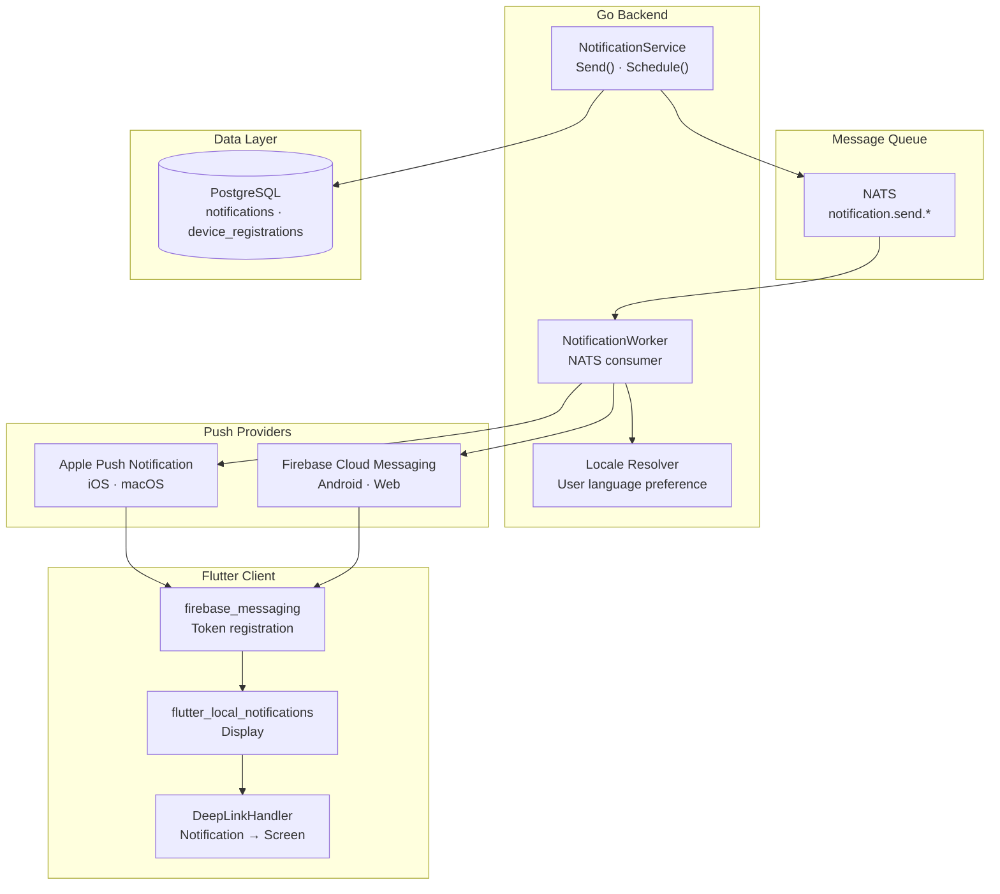
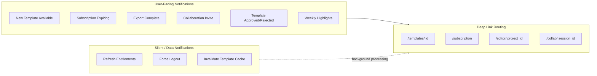

# Push Notification — Architecture Diagram

> Maps to [01-push-notification-architecture.md](01-push-notification-architecture.md)

---

## Notification Architecture

```mermaid
graph TB
    subgraph backend_notif ["Go Backend"]
        NS["NotificationService<br/>Send() · Schedule()"]
        NW["NotificationWorker<br/>NATS consumer"]
        LOCALE["Locale Resolver<br/>User language preference"]
    end

    subgraph queue ["Message Queue"]
        NATS_N["NATS<br/>notification.send.*"]
    end

    subgraph providers ["Push Providers"]
        FCM["Firebase Cloud Messaging<br/>Android · Web"]
        APNS["Apple Push Notification<br/>iOS · macOS"]
    end

    subgraph client_notif ["Flutter Client"]
        FM["firebase_messaging<br/>Token registration"]
        LN["flutter_local_notifications<br/>Display"]
        DL["DeepLinkHandler<br/>Notification → Screen"]
    end

    subgraph data_notif ["Data Layer"]
        PG_N[("PostgreSQL<br/>notifications · device_registrations")]
    end

    NS --> PG_N
    NS --> NATS_N --> NW
    NW --> LOCALE
    NW --> FCM & APNS
    FCM & APNS --> FM --> LN --> DL
```

---

## Notification Types

```mermaid
graph LR
    subgraph user_facing ["User-Facing Notifications"]
        N1["New Template Available"]
        N2["Subscription Expiring"]
        N3["Export Complete"]
        N4["Collaboration Invite"]
        N5["Template Approved/Rejected"]
        N6["Weekly Highlights"]
    end

    subgraph silent ["Silent / Data Notifications"]
        S1["Refresh Entitlements"]
        S2["Force Logout"]
        S3["Invalidate Template Cache"]
    end

    subgraph routing ["Deep Link Routing"]
        R1["/templates/:id"]
        R2["/subscription"]
        R3["/editor/:project_id"]
        R4["/collab/:session_id"]
    end

    user_facing --> routing
    silent -.->|background processing| routing
```
