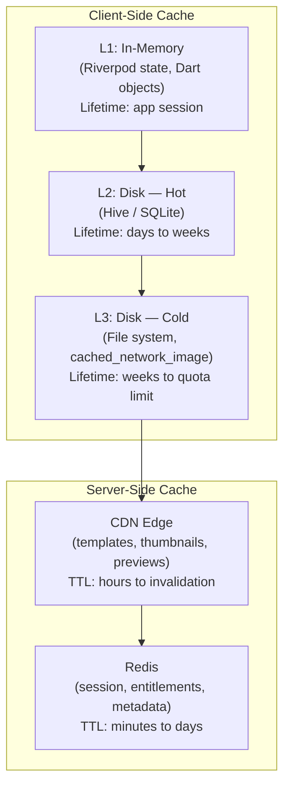
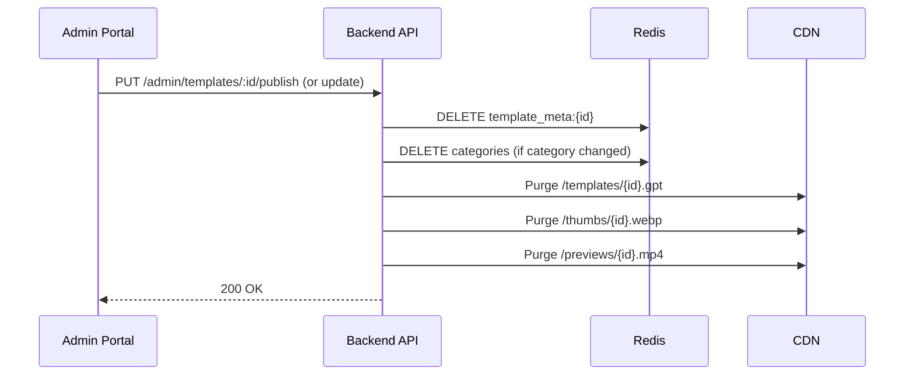

# Gopost — Offline and Caching Strategy

> **Version:** 1.0.0
> **Date:** February 23, 2026
> **Audience:** Flutter Engineers, Backend Engineers, QA

---

## Table of Contents

1. [Offline Philosophy](#1-offline-philosophy)
2. [Cache Tiers](#2-cache-tiers)
3. [Feature Availability Matrix](#3-feature-availability-matrix)
4. [Template Caching](#4-template-caching)
5. [Media Caching](#5-media-caching)
6. [Editor Offline Mode](#6-editor-offline-mode)
7. [Entitlement and Auth Cache](#7-entitlement-and-auth-cache)
8. [Backend Caching (Redis / CDN)](#8-backend-caching-redis--cdn)
9. [Sync-on-Reconnect](#9-sync-on-reconnect)
10. [Storage Budgets](#10-storage-budgets)
11. [Implementation Guide](#11-implementation-guide)
12. [Sprint Stories](#12-sprint-stories)

---

## 1. Offline Philosophy

Gopost is an **online-first** application — templates are fetched from the server, subscriptions are verified remotely, and publishing requires connectivity. However, the app must degrade gracefully when connectivity is lost:

| Principle | Meaning |
|-----------|---------|
| **Never crash on no network** | All network calls have timeout + fallback; UI shows meaningful offline state |
| **Protect work in progress** | Active editing sessions are never lost due to connectivity — auto-save is local-first |
| **Cache aggressively, invalidate smartly** | Downloaded data is reusable; stale data is tolerable for browsing, not for auth |
| **Transparently communicate state** | A non-intrusive banner indicates offline status; actions that require network are disabled with explanation |

---

## 2. Cache Tiers



### 2.1 L1 — In-Memory (Riverpod State)

| What | TTL | Invalidation |
|------|-----|-------------|
| Current user profile | Session | On logout or profile update |
| Active subscription + entitlements | 1 hour (see Section 7) | On purchase, refresh, or app resume |
| Template list (current page) | Until navigation away | On pull-to-refresh or filter change |
| Template detail | Session | On navigation away |
| Editor project state | Session | On project close |
| Category and tag lists | 15 minutes | On pull-to-refresh |

### 2.2 L2 — Disk Hot Cache (Hive / SQLite)

| What | Storage | TTL | Max Size |
|------|---------|-----|----------|
| Entitlements snapshot | Hive box (encrypted) | 24 hours | < 1 KB |
| Refresh token | flutter_secure_storage | 7 days | < 1 KB |
| Recent template metadata (last 100) | SQLite (sqlcipher) | 7 days | ~5 MB |
| User preferences (theme, language) | SharedPreferences | Indefinite | < 10 KB |
| Search history | Hive box | 30 days, max 50 entries | < 50 KB |
| Category list | Hive box | 24 hours | < 100 KB |
| Editor auto-save snapshots | SQLite | Until project closed or exported | ~50 MB max |

### 2.3 L3 — Disk Cold Cache (File System)

| What | Storage | TTL | Max Size |
|------|---------|-----|----------|
| Template thumbnails | `cached_network_image` | LRU eviction | 200 MB |
| Template preview videos/images | App cache directory | LRU eviction | 500 MB |
| Downloaded template .gpt files | App documents directory | LRU, max 10 templates | 1 GB |
| User media (imported for editing) | App documents directory | Until user deletes | Per entitlement tier |
| Font files (downloaded) | App support directory | Indefinite until update | 100 MB |

---

## 3. Feature Availability Matrix

| Feature | Online | Offline | Notes |
|---------|--------|---------|-------|
| **App launch** | Full | Cached home screen | Shows cached template grid; "Offline" banner |
| **Template browsing** | Full (API) | Cached results only | Last-loaded page + cached thumbnails; search disabled |
| **Template preview** | Full (stream/CDN) | Only if cached in L3 | Cached previews play; uncached show placeholder |
| **Template download** | Yes | No | Requires network + server access token |
| **Template rendering** | Yes (with render token) | Yes, if .gpt cached + render token unexpired | Render tokens are 5 min; must have been issued while online |
| **Video editor (existing project)** | Full | Full | All editing is local; project auto-saved to L2 |
| **Video editor (import new media)** | From gallery + cloud | Gallery only | Cloud import requires network |
| **Video export** | Full | Full | Export is entirely local (C++ engine) |
| **Image editor** | Same as video editor | Same as video editor | Local-first editing |
| **Login / Register** | Yes | No | Must be online to authenticate |
| **Token refresh** | Yes | No | Access token used until expiry; if expired offline, queue refresh |
| **Subscription purchase** | Yes | No | Requires store connectivity |
| **Entitlement check** | Server-verified | Cached entitlements (24h TTL) | Graceful: use cached tier; strict: block premium on stale cache |
| **Template publishing** | Yes | No | Requires upload to server |
| **Push notifications** | Yes | Queued by OS | FCM/APNs deliver when back online |
| **Admin portal** | Yes | No | Web-only, requires persistent connection |
| **Profile update** | Yes | Queued | Queued locally, synced on reconnect |

---

## 4. Template Caching

### 4.1 Thumbnail Cache

Managed by `cached_network_image` with configurable limits:

```dart
// lib/core/cache/image_cache_config.dart

abstract class ImageCacheConfig {
  static const maxDiskCacheMB = 200;
  static const maxMemoryCacheMB = 50;
  static const stalePeriod = Duration(days: 7);
}
```

### 4.2 Template Metadata Cache

Recently viewed template metadata is persisted to encrypted SQLite for offline browsing:

```dart
// lib/core/cache/template_cache.dart

abstract class TemplateMetadataCache {
  Future<List<TemplateSummary>> getCachedTemplates({String? type, String? category});
  Future<TemplateDetail?> getCachedDetail(String templateId);
  Future<void> cacheTemplates(List<TemplateSummary> templates);
  Future<void> cacheDetail(TemplateDetail detail);
  Future<void> evictOlderThan(Duration age);
  Future<int> getCachedCount();
}
```

### 4.3 Template Binary Cache (.gpt Files)

Downloaded `.gpt` files are retained for re-rendering without re-download:

| Policy | Value |
|--------|-------|
| Max cached templates | 10 (LRU eviction) |
| Max total size | 1 GB |
| Eviction strategy | Least-recently-used; also evicted if render token expired and no new token obtainable |
| Storage location | App documents directory (survives cache clear) |
| Encryption | Files are already AES-256-GCM encrypted; no additional encryption needed |

```dart
// lib/core/cache/template_binary_cache.dart

abstract class TemplateBinaryCache {
  Future<File?> getCachedTemplate(String templateId);
  Future<void> cacheTemplate(String templateId, Uint8List encryptedBlob);
  Future<void> evict(String templateId);
  Future<void> evictLRU();
  Future<CacheStats> getStats(); // count, totalSizeBytes
}
```

### 4.4 Preview Cache

Template preview videos/images are cached separately from thumbnails (larger files):

| Type | Cache Location | Max Size | Format |
|------|---------------|----------|--------|
| Video preview | App cache directory | 500 MB total | MP4 (H.264, 720p max) |
| Image preview | App cache directory | Part of 500 MB | WebP |

---

## 5. Media Caching

### 5.1 User-Imported Media

Media imported from the device gallery is copied into the app's documents directory so that editor projects can reference them reliably:

| Policy | Value |
|--------|-------|
| Storage | App documents directory / `user_media/` |
| Quota | Per subscription tier (Free: 500 MB, Pro: 10 GB, Creator: 50 GB) |
| Cleanup | User-initiated delete; auto-prompt when quota at 90% |

### 5.2 Cloud Media

Media uploaded to S3 for cloud backup is always downloadable when online. The local copy is the source of truth during editing.

---

## 6. Editor Offline Mode

### 6.1 Auto-Save

The editor uses local-first auto-save independent of network state:

| Setting | Value |
|---------|-------|
| Auto-save interval | Every 30 seconds during active editing |
| Storage | SQLite (project state as serialized JSON/binary) |
| Max auto-save snapshots per project | 5 (rolling, oldest evicted) |
| Recovery | On app crash or kill, offer to restore from last auto-save |

### 6.2 Project Persistence

```dart
// Domain model for local project storage

abstract class ProjectLocalStore {
  Future<void> saveProject(String projectId, ProjectSnapshot snapshot);
  Future<ProjectSnapshot?> loadProject(String projectId);
  Future<List<ProjectSummary>> listLocalProjects();
  Future<void> deleteProject(String projectId);
  Future<void> pruneOldAutoSaves(String projectId, {int keepCount = 5});
}
```

### 6.3 Export While Offline

Exporting video/images is entirely local (C++ engine) and works fully offline. The exported file is saved to the device gallery or a user-chosen location.

### 6.4 Template Editing While Offline

If a user opened a template while online (render token issued, .gpt cached, decrypted in engine), they can continue editing even if connectivity drops. The decrypted template data remains in engine memory until the session ends.

**Limitation:** If the app is killed and restarted offline, the render token may have expired and the template cannot be re-decrypted until the user goes online to obtain a fresh token.

---

## 7. Entitlement and Auth Cache

### 7.1 Access Token

| Aspect | Policy |
|--------|--------|
| Storage | In-memory only (never persisted) |
| TTL | 15 minutes (server-set) |
| Offline behavior | Used until expiry; API calls fail after expiry; queued refresh attempt on reconnect |

### 7.2 Refresh Token

| Aspect | Policy |
|--------|--------|
| Storage | flutter_secure_storage (Keychain / Keystore) |
| TTL | 7 days |
| Offline behavior | Persisted; used to obtain new access token on reconnect |

### 7.3 Entitlements Cache

| Aspect | Policy |
|--------|--------|
| Storage | Encrypted Hive box |
| TTL | 24 hours |
| Offline behavior | App uses cached entitlements for feature gating |
| Stale behavior | If cache > 24h and offline, degrade gracefully to free tier with warning banner |
| Refresh trigger | On app resume, on purchase, on token refresh |

```dart
// lib/core/subscription/offline_entitlements.dart

class OfflineEntitlementProvider {
  final HiveBox<Entitlements> _box;
  static const _key = 'cached_entitlements';
  static const _maxAge = Duration(hours: 24);

  Future<Entitlements> getEntitlements() async {
    final cached = _box.get(_key);
    if (cached != null && !_isStale(cached)) {
      return cached.entitlements;
    }
    // Stale or missing — return free-tier defaults
    return Entitlements.freeTier();
  }

  Future<void> cacheEntitlements(Entitlements entitlements) async {
    await _box.put(_key, CachedEntitlements(
      entitlements: entitlements,
      cachedAt: DateTime.now(),
    ));
  }

  bool _isStale(CachedEntitlements cached) {
    return DateTime.now().difference(cached.cachedAt) > _maxAge;
  }
}
```

---

## 8. Backend Caching (Redis / CDN)

### 8.1 Redis Cache Policies

| Key Pattern | Data | TTL | Invalidation |
|-------------|------|-----|-------------|
| `session:{session_id}` | Session data (refresh token hash, device) | 7 days | On logout, token rotation |
| `entitlements:{user_id}` | Serialized entitlements JSON | 1 hour | On subscription change |
| `template_meta:{template_id}` | Template metadata JSON | 5 minutes | On template update/publish |
| `categories` | All categories JSON | 15 minutes | On category add/edit |
| `tags:popular` | Popular tags JSON | 15 minutes | On tag usage change |
| `ratelimit:{ip}:{endpoint}` | Token bucket counter | 1 minute | Auto-expire |
| `dashboard_stats` | Admin dashboard KPIs | 1 minute | Auto-expire |

### 8.2 CDN Cache Policies

| Asset Type | CDN TTL | Cache-Control | Invalidation |
|-----------|---------|---------------|-------------|
| Template .gpt files | 24 hours | `private, max-age=86400` | Purge on template update |
| Thumbnails | 7 days | `public, max-age=604800` | Purge on template update |
| Preview videos/images | 7 days | `public, max-age=604800` | Purge on template update |
| Static assets (JS, CSS, fonts) | 1 year | `public, max-age=31536000, immutable` | Filename-hashed (never invalidated) |
| API responses | No CDN cache | `no-store` | N/A |

### 8.3 Cache Invalidation Strategy



---

## 9. Sync-on-Reconnect

### 9.1 Connectivity Detection

```dart
// lib/core/network/connectivity_monitor.dart

class ConnectivityMonitor {
  final Connectivity _connectivity;
  late final StreamSubscription _sub;
  final _controller = StreamController<ConnectivityState>.broadcast();

  Stream<ConnectivityState> get stateStream => _controller.stream;

  void start() {
    _sub = _connectivity.onConnectivityChanged.listen((result) {
      final state = result.contains(ConnectivityResult.none)
          ? ConnectivityState.offline
          : ConnectivityState.online;
      _controller.add(state);
    });
  }

  void dispose() {
    _sub.cancel();
    _controller.close();
  }
}

enum ConnectivityState { online, offline }
```

### 9.2 Reconnect Actions

When the app transitions from offline to online, execute this ordered sequence:

| Order | Action | Details |
|-------|--------|---------|
| 1 | Refresh access token | If expired, use stored refresh token |
| 2 | Refresh entitlements | GET /users/me/entitlements → update cache |
| 3 | Sync queued profile updates | If user changed name/avatar while offline |
| 4 | Refresh template metadata | Re-fetch current browse page to get updated data |
| 5 | Resume pending uploads | If a template publish or media upload was interrupted |

### 9.3 Offline Action Queue

Actions attempted while offline are queued and replayed on reconnect:

```dart
// lib/core/network/offline_queue.dart

abstract class OfflineActionQueue {
  Future<void> enqueue(OfflineAction action);
  Future<List<OfflineAction>> getPending();
  Future<void> markCompleted(String actionId);
  Future<void> replayAll();
}

@freezed
class OfflineAction with _$OfflineAction {
  const factory OfflineAction({
    required String id,
    required String type, // 'profile_update', 'media_upload', etc.
    required Map<String, dynamic> payload,
    required DateTime createdAt,
    @Default(0) int retryCount,
  }) = _OfflineAction;
}
```

---

## 10. Storage Budgets

### 10.1 Per-Platform Budgets

| Cache Tier | iOS/Android | Desktop | Web |
|-----------|-------------|---------|-----|
| L1 (in-memory) | ~50 MB | ~100 MB | ~30 MB |
| L2 (Hive/SQLite) | ~60 MB | ~100 MB | ~20 MB (IndexedDB) |
| L3 (image cache) | 200 MB | 500 MB | 100 MB (Cache API) |
| L3 (preview cache) | 500 MB | 1 GB | 200 MB |
| L3 (template .gpt) | 1 GB | 2 GB | 500 MB |
| User media | Per tier | Per tier | N/A (no local storage) |
| **Total max** | **~1.8 GB + media** | **~3.7 GB + media** | **~850 MB** |

### 10.2 Cache Cleanup

| Trigger | Action |
|---------|--------|
| App settings → "Clear Cache" | Evict L3 entirely (thumbnails, previews, .gpt files) |
| Device low storage warning | Evict L3 LRU down to 50% of budget |
| App update | Preserve L2 (preferences, auth); clear L3 if format changed |
| Account logout | Clear all caches (L1, L2, L3); wipe secure storage |
| Account deletion | Same as logout + server-side data deletion |

---

## 11. Implementation Guide

### 11.1 Package Dependencies

| Package | Purpose |
|---------|---------|
| `connectivity_plus` | Network state monitoring |
| `cached_network_image` | Image/thumbnail caching |
| `hive_flutter` + `hive` | Encrypted key-value store (L2) |
| `sqflite` / `drift` | SQLite for template metadata + auto-save (L2) |
| `path_provider` | Platform-specific cache/documents directories |
| `flutter_secure_storage` | Refresh token storage |

### 11.2 Directory Structure

```
lib/core/
├── cache/
│   ├── image_cache_config.dart
│   ├── template_metadata_cache.dart
│   ├── template_binary_cache.dart
│   └── cache_manager.dart          # Coordinates cleanup, budget enforcement
├── network/
│   ├── connectivity_monitor.dart
│   ├── offline_queue.dart
│   └── reconnect_handler.dart      # Executes sync-on-reconnect sequence
└── subscription/
    └── offline_entitlements.dart
```

---

## 12. Sprint Stories

### Sprint Assignment

| Attribute | Value |
|---|---|
| **Phase** | Phase 1: Foundation (cache infra), Phase 6: Polish (offline hardening) |
| **Sprint(s)** | Sprint 1 (cache setup), Sprint 15 (offline UX, sync) |
| **Team** | Flutter Engineers |
| **Story Points Total** | 32 |

### Stories

| ID | Story | Acceptance Criteria | Points | Priority | Sprint |
|---|---|---|---|---|---|
| OFF-001 | Set up `cached_network_image` with 200 MB disk / 50 MB memory budget | Config applied; thumbnails cached; LRU eviction verified | 2 | P0 | 1 |
| OFF-002 | Implement `TemplateMetadataCache` (SQLite, encrypted, 100 entries, 7-day TTL) | Cache CRUD works; stale entries evicted; encrypted at rest | 3 | P0 | 1 |
| OFF-003 | Implement `TemplateBinaryCache` (file system, LRU 10 templates, 1 GB max) | .gpt files cached after download; LRU eviction at limit; stats queryable | 3 | P0 | 4 |
| OFF-004 | Implement `ConnectivityMonitor` and offline banner UI | Banner appears within 2s of connectivity loss; dismisses on reconnect; non-intrusive | 2 | P0 | 1 |
| OFF-005 | Implement `OfflineEntitlementProvider` (Hive, encrypted, 24h TTL) | Entitlements cached on login/refresh; stale cache falls back to free tier; refresh on reconnect | 3 | P0 | 2 |
| OFF-006 | Implement `OfflineActionQueue` (profile updates, queued syncs) | Actions enqueued when offline; replayed in order on reconnect; max 3 retries per action | 3 | P1 | 15 |
| OFF-007 | Implement reconnect handler (token refresh → entitlements → metadata refresh) | Ordered sequence runs on online transition; no duplicate requests; errors handled gracefully | 3 | P0 | 15 |
| OFF-008 | Implement editor auto-save (SQLite, 30s interval, 5 snapshots, crash recovery) | Auto-save runs during editing; recovery prompt on crash restart; snapshots pruned | 5 | P0 | 5 |
| OFF-009 | Implement "Clear Cache" in settings with size display | Shows cache size per tier; "Clear" button evicts L3; confirmation dialog | 2 | P1 | 15 |
| OFF-010 | Verify full offline feature matrix and degrade gracefully | All features from Section 3 tested offline; no crashes; appropriate disabled states and messages | 3 | P0 | 15 |
| OFF-011 | Configure CDN cache headers and invalidation pipeline for templates | TTLs from Section 8.2 applied; purge works on template update; verified with curl | 3 | P0 | 3 |

### Definition of Done

- [ ] All stories marked complete
- [ ] Airplane mode testing on iOS and Android
- [ ] Cache budgets verified (no uncontrolled growth)
- [ ] Offline → online transition tested with queued actions
- [ ] Code reviewed and merged
