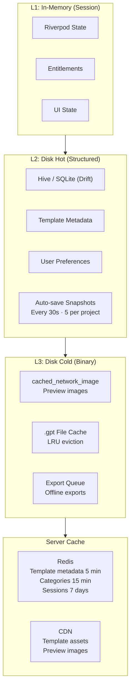
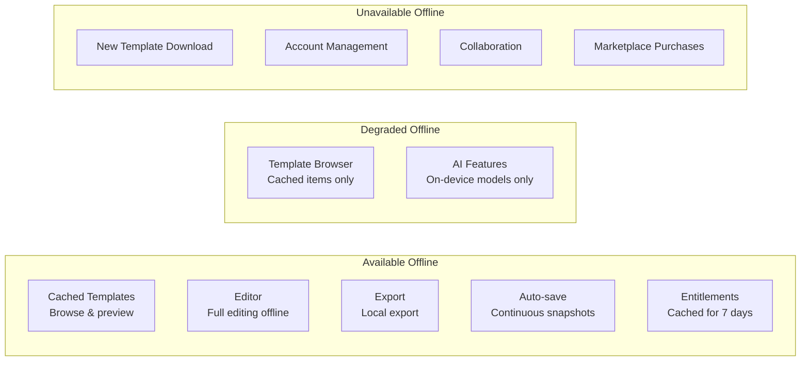
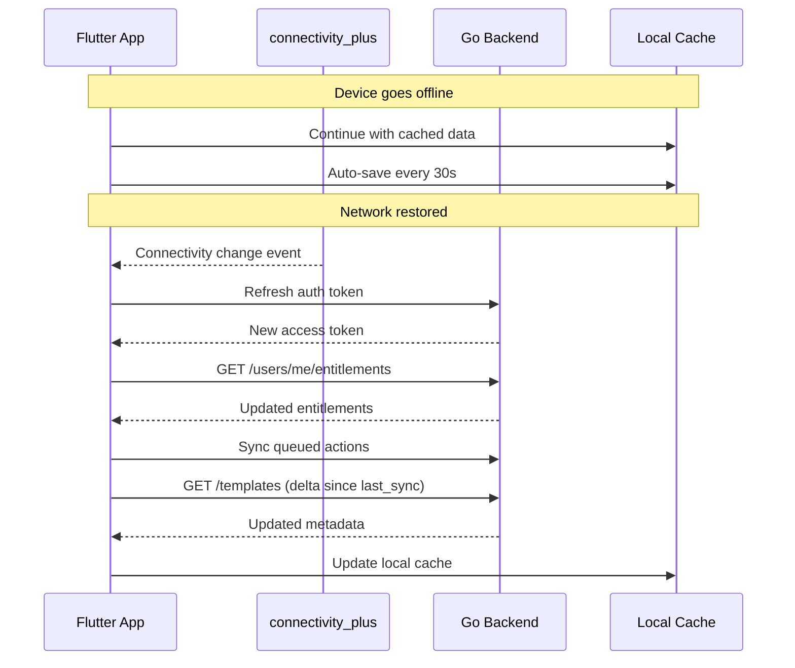
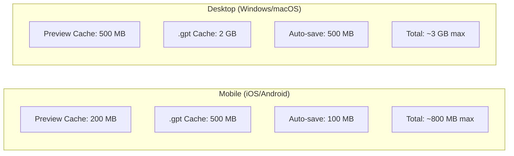

# Offline & Caching Strategy — Architecture Diagram

> Maps to [01-offline-caching-strategy.md](01-offline-caching-strategy.md)

---

## Multi-Tier Cache Architecture

---

## Offline Feature Availability

---

## Reconnect Protocol

---

## Storage Budgets

