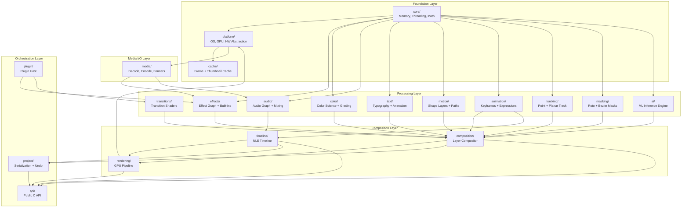

## VE-2. Engine Architecture Overview

### 2.1 High-Level Module Diagram

```
libgopost_ve/
├── core/                       # Foundation: memory, threading, math, logging
├── timeline/                   # NLE timeline engine (Premiere-class)
├── composition/                # Layer compositor (After Effects-class)
├── rendering/                  # GPU render pipeline + shader management
├── effects/                    # Effect graph, built-in effects, LUT engine
├── animation/                  # Keyframe engine, curves, expressions
├── motion/                     # Shape layers, motion graphics, path animation
├── text/                       # Advanced typography, text animations
├── audio/                      # Audio graph, mixing, effects, analysis
├── transitions/                # Transition engine with GPU shaders
├── ai/                         # ML inference: segmentation, detection, tracking
├── color/                      # Color science, grading, HDR, gamut mapping
├── media/                      # Codec layer: decode, encode, format I/O
├── tracking/                   # Point tracking, planar tracking, stabilization
├── masking/                    # Roto masks, bezier masks, feathering
├── project/                    # Project serialization, auto-save, undo/redo
├── plugin/                     # Plugin host, SDK, sandboxed execution
├── platform/                   # Platform abstraction (OS, GPU, HW accel)
├── cache/                      # Frame cache, thumbnail cache, waveform cache
└── api/                        # Public C API surface (FFI boundary)
```

### 2.2 Layer Dependency Diagram



### 2.3 Threading Architecture

```
┌─────────────────────────────────────────────────────────────┐
│                      Thread Architecture                     │
├─────────────────────────────────────────────────────────────┤
│                                                              │
│  [Main/UI Thread]  ◄─── FFI calls from Flutter/Dart         │
│       │                                                      │
│       ├──► [Command Queue] ──► [Engine Thread]               │
│       │         (lock-free SPSC ring buffer)                 │
│       │                           │                          │
│       │                           ├──► [Render Thread]       │
│       │                           │     (GPU submission)     │
│       │                           │                          │
│       │                           ├──► [Decode Thread Pool]  │
│       │                           │     (N = CPU cores / 2)  │
│       │                           │                          │
│       │                           ├──► [Audio Thread]        │
│       │                           │     (real-time priority) │
│       │                           │                          │
│       │                           ├──► [Export Thread]       │
│       │                           │     (encode pipeline)    │
│       │                           │                          │
│       │                           ├──► [AI Thread Pool]      │
│       │                           │     (ML inference)       │
│       │                           │                          │
│       │                           └──► [Cache Thread]        │
│       │                                 (async I/O)          │
│       │                                                      │
│       └──► [Result Queue] ◄── rendered frames, callbacks     │
│                 (lock-free SPMC ring buffer)                  │
│                                                              │
└─────────────────────────────────────────────────────────────┘
```

| Thread | Priority | Affinity | Purpose |
|---|---|---|---|
| Main/UI | Normal | Any | FFI entry, command dispatch |
| Engine | Above Normal | Big core | Timeline evaluation, composition graph |
| Render | High | Big core + GPU | GPU command buffer recording and submission |
| Decode Pool (N) | Normal | Any | Video/image decoding (HW or SW) |
| Audio | Real-time | Isolated core | Audio mixing, low-latency playback |
| Export | Below Normal | Any | Encode pipeline (background) |
| AI Pool | Low | Any | ML inference (background, interruptible) |
| Cache | Low | Any | Async disk I/O, thumbnail generation |

---

## Development Sprint Plan

### Sprint Assignment

| Attribute | Value |
|---|---|
| **Phase** | Phase 1: Core Foundation |
| **Sprint(s)** | VE-Sprint 1 (Weeks 1-2) |
| **Team** | C/C++ Engine Developer (2), Tech Lead |
| **Predecessor** | [01-vision-and-scope](01-vision-and-scope.md) |
| **Successor** | [03-core-foundation](03-core-foundation.md) |
| **Story Points Total** | 34 |

### User Stories

| ID | Story | Acceptance Criteria | Points | Priority | Dependencies |
|---|---|---|---|---|---|
| VE-006 | As a C++ engine developer, I want the module directory structure created so that we have a clear codebase organization | - All 18 modules (core, timeline, composition, etc.) created<br/>- CMakeLists.txt or build config per module<br/>- Include paths and namespace conventions documented | 2 | P0 | VE-001 |
| VE-007 | As a C++ engine developer, I want dependency graph enforcement in the build system so that modules cannot have circular dependencies | - Build fails on circular dependency<br/>- Dependency diagram validated against actual includes<br/>- CI enforces dependency rules | 3 | P0 | VE-006 |
| VE-008 | As a C++ engine developer, I want the threading architecture implemented so that we have main→engine→render→decode→audio threads | - All 5 thread types created with correct priorities<br/>- Thread affinity set per platform<br/>- Thread naming for debugging | 5 | P0 | VE-006 |
| VE-009 | As a C++ engine developer, I want an SPSC ring buffer for the command queue so that the main thread can submit commands lock-free | - Lock-free SPSC implementation with configurable capacity<br/>- try_push/try_pop with no blocking<br/>- Benchmark: >1M ops/sec single producer/consumer | 3 | P0 | VE-008 |
| VE-010 | As a C++ engine developer, I want an SPSC ring buffer for the result queue so that the engine can return rendered frames to the main thread | - Lock-free SPMC or SPSC result queue<br/>- Supports RenderFrame and callback payloads<br/>- No data races under TSan | 3 | P0 | VE-009 |
| VE-011 | As a C++ engine developer, I want engine thread lifecycle (start/stop/idle) so that we can control the engine state | - start(), stop(), is_running() API<br/>- Graceful shutdown with in-flight command drain<br/>- Idle state reduces CPU when no work | 3 | P0 | VE-008 |
| VE-012 | As a C++ engine developer, I want the render thread GPU submission loop so that frames are submitted to the GPU | - Loop processes command queue, submits to IGpuContext<br/>- Frame sync (vsync or target FPS) support<br/>- Handles empty queue without busy-wait | 5 | P0 | VE-010, VE-011 |
| VE-013 | As a C++ engine developer, I want a decode thread pool (N = cores/2) so that we can decode multiple frames in parallel | - Thread pool with configurable N<br/>- Work queue for decode tasks<br/>- HW decode integration point | 3 | P0 | VE-008 |
| VE-014 | As a C++ engine developer, I want a cache thread async I/O loop so that frame cache and thumbnails are loaded without blocking | - Dedicated cache thread with async I/O<br/>- Frame cache read/write integration<br/>- Thumbnail generation queue | 3 | P1 | VE-011 |

### Definition of Done

- [ ] All stories in this section marked complete
- [ ] Code reviewed and merged to `develop`
- [ ] Unit tests passing (≥ 90% coverage for new code)
- [ ] Google Test suite green
- [ ] Memory leak check (ASan) passing
- [ ] Performance benchmark recorded (no regression)
- [ ] C API header updated if public interface changed
- [ ] Sprint review demo completed
