## VE-4. Timeline Engine (Premiere Pro-class NLE)

### 4.1 Timeline Data Model

```cpp
namespace gp::timeline {

enum class TrackType {
    Video,
    Audio,
    Title,          // Text/title overlay track
    Effect,         // Adjustment layer track
    Subtitle,       // AI-generated subtitle track
};

enum class ClipType {
    MediaClip,      // Video/audio file reference
    StillImage,     // Image with configurable duration
    SolidColor,     // Colored rectangle
    Composition,    // Nested composition (After Effects pre-comp)
    Generator,      // Procedural content (bars, tone, countdown)
    Title,          // Text clip
    AdjustmentLayer // Transparent clip carrying effects
};

// Time representation: rational numbers for frame-accurate math
struct Rational {
    int64_t num;
    int64_t den;

    double to_seconds() const;
    int64_t to_microseconds() const;
    int64_t to_frame(const Rational& fps) const;
    static Rational from_frames(int64_t frame, const Rational& fps);
};

struct TimeRange {
    Rational start;
    Rational duration;

    Rational end() const { return {start.num * duration.den + duration.num * start.den, start.den * duration.den}; }
    bool contains(Rational time) const;
    bool overlaps(const TimeRange& other) const;
    TimeRange intersect(const TimeRange& other) const;
};

struct Track {
    int32_t id;
    TrackType type;
    std::string name;
    bool locked;
    bool visible;
    bool solo;
    bool muted;
    float volume;          // Audio tracks: 0.0 - 2.0
    float opacity;         // Video tracks: 0.0 - 1.0
    BlendMode blend_mode;  // Video tracks
    std::vector<std::unique_ptr<Clip>> clips;  // Sorted by start time

    int32_t insert_clip(std::unique_ptr<Clip> clip);
    void remove_clip(int32_t clip_id);
    Clip* clip_at_time(Rational time) const;
    std::vector<Clip*> clips_in_range(TimeRange range) const;
};

struct Clip {
    int32_t id;
    ClipType type;
    std::string name;

    // Timeline placement
    TimeRange timeline_range;     // Position and duration on timeline

    // Source reference
    int32_t media_ref_id;         // Reference to imported media asset
    Rational source_in;           // In-point in source media
    Rational source_out;          // Out-point in source media

    // Speed/time remapping
    float speed;                  // 0.01 - 100.0 (1.0 = normal)
    bool reverse;
    std::vector<TimeRemapKeyframe> time_remap;  // For variable speed / freeze frames

    // Properties
    float opacity;
    BlendMode blend_mode;
    Transform2D transform;
    bool enabled;

    // Attached data
    std::vector<EffectInstance> effects;
    std::vector<TransitionRef> transitions;  // In/out transitions
    std::vector<KeyframeTrack> keyframe_tracks;
    MaskGroup* mask;

    // Audio properties (if has audio)
    float volume;
    float pan;             // -1.0 (left) to 1.0 (right)
    bool audio_enabled;
    std::vector<AudioEffectInstance> audio_effects;

    // Computed
    Rational source_duration() const;
    Rational effective_duration() const;  // After speed change
};

struct TimeRemapKeyframe {
    Rational timeline_time;
    Rational source_time;
    CubicBezier interpolation;
    bool hold;              // Freeze frame
};

struct Timeline {
    int32_t id;
    std::string name;

    // Settings
    Rational frame_rate;          // e.g., {30000, 1001} for 29.97
    int32_t width;
    int32_t height;
    Rational pixel_aspect_ratio;  // 1:1 for square pixels
    ColorSpace color_space;       // Rec709, Rec2020, DCI-P3
    int32_t sample_rate;          // 44100 or 48000
    int32_t audio_channels;       // 1 (mono), 2 (stereo), 6 (5.1)

    // Tracks (ordered bottom-to-top for compositing)
    std::vector<std::unique_ptr<Track>> video_tracks;
    std::vector<std::unique_ptr<Track>> audio_tracks;

    // Markers
    std::vector<Marker> markers;

    // Duration computed from rightmost clip endpoint
    Rational duration() const;

    // Operations
    int32_t add_track(TrackType type, const std::string& name);
    void remove_track(int32_t track_id);
    void reorder_tracks(const std::vector<int32_t>& new_order);

    int32_t add_clip(int32_t track_id, std::unique_ptr<Clip> clip);
    void remove_clip(int32_t track_id, int32_t clip_id);
    void move_clip(int32_t clip_id, int32_t target_track_id, Rational target_time);
    void trim_clip_in(int32_t clip_id, Rational delta);
    void trim_clip_out(int32_t clip_id, Rational delta);
    void split_clip(int32_t clip_id, Rational split_point);
    void ripple_delete(int32_t track_id, TimeRange range);
    void insert_edit(int32_t track_id, Rational time, std::unique_ptr<Clip> clip);
    void overwrite_edit(int32_t track_id, Rational time, std::unique_ptr<Clip> clip);

    // Snapping
    std::vector<Rational> snap_points(Rational around, Rational threshold) const;
};

struct Marker {
    Rational time;
    std::string name;
    std::string comment;
    Color4f color;
    MarkerType type;   // Standard, Chapter, ToDo, Sync
};

} // namespace gp::timeline
```

### 4.2 Timeline Evaluation Pipeline

```mermaid
graph LR
    subgraph input ["Input"]
        Playhead["Playhead Position<br/>(Rational time)"]
    end

    subgraph gather ["Gather Phase"]
        ActiveClips["Find Active Clips<br/>(per track, at time)"]
        SourceMap["Map Timeline Time<br/>→ Source Time<br/>(speed, remap)"]
        FrameReq["Generate Frame<br/>Requests"]
    end

    subgraph decode ["Decode Phase"]
        CacheCheck["Check Frame Cache"]
        HWDecode["HW Decode<br/>(VideoToolbox / MediaCodec)"]
        SWDecode["SW Decode<br/>(FFmpeg libavcodec)"]
    end

    subgraph process ["Process Phase"]
        ClipFX["Apply Clip Effects<br/>(per-clip effect chain)"]
        TrackComp["Track Compositing<br/>(bottom → top)"]
        TrackFX["Apply Track Effects<br/>(adjustment layers)"]
        MasterFX["Apply Master Effects<br/>(timeline-level)"]
    end

    subgraph output ["Output"]
        Preview["Preview Texture<br/>(Flutter Texture)"]
        Export["Encode Pipeline"]
    end

    Playhead --> ActiveClips
    ActiveClips --> SourceMap
    SourceMap --> FrameReq
    FrameReq --> CacheCheck
    CacheCheck -->|miss| HWDecode
    CacheCheck -->|miss fallback| SWDecode
    CacheCheck -->|hit| ClipFX
    HWDecode --> ClipFX
    SWDecode --> ClipFX
    ClipFX --> TrackComp
    TrackComp --> TrackFX
    TrackFX --> MasterFX
    MasterFX --> Preview
    MasterFX --> Export
```



### 4.3 Edit Operations

| Operation | Behavior | Ripple Mode |
|---|---|---|
| **Insert** | Pushes all subsequent clips right to make room | Yes |
| **Overwrite** | Replaces content at target position, splits existing clips | No |
| **Ripple Delete** | Removes range and closes gap | Yes |
| **Lift** | Removes clips in range, leaves gap | No |
| **Razor/Split** | Cuts clip into two at playhead | N/A |
| **Trim In** | Adjust clip in-point (may ripple) | Configurable |
| **Trim Out** | Adjust clip out-point (may ripple) | Configurable |
| **Roll Edit** | Adjust shared edit point between two clips | No |
| **Slip** | Change source in/out without moving clip on timeline | No |
| **Slide** | Move clip between neighbors, adjusting their in/out | No |
| **Rate Stretch** | Change clip speed by trimming its timeline duration | No |
| **Duplicate** | Deep-copy clip to new position | Configurable |
| **Group** | Group multiple clips for synchronized operations | N/A |
| **Nest/Pre-comp** | Create a composition from selected clips | N/A |

### 4.4 Multi-Cam Support (Phase 2)

```cpp
struct MultiCamClip {
    int32_t id;
    std::string name;
    std::vector<CameraAngle> angles;   // Source clips synced by timecode/audio
    int32_t active_angle;               // Currently switched angle
    std::vector<CutPoint> cut_list;     // Timeline of angle switches

    void switch_angle(int32_t angle_id, Rational time);
    void flatten();   // Convert to regular clips on a track
};

struct CameraAngle {
    int32_t id;
    std::string name;
    int32_t media_ref_id;
    Rational sync_offset;   // Timecode or audio-sync derived offset
    Color4f label_color;
};
```

---

## Development Sprint Plan

### Sprint Assignment

| Attribute | Value |
|---|---|
| **Phase** | Phase 2: Timeline Engine |
| **Sprint(s)** | VE-Sprint 4-6 (Weeks 7-12) |
| **Team** | C/C++ Engine Developer (2), Tech Lead |
| **Predecessor** | [06-gpu-rendering-pipeline](06-gpu-rendering-pipeline.md) |
| **Successor** | [05-composition-engine](05-composition-engine.md) |
| **Story Points Total** | 89 |

### User Stories

| ID | Story | Acceptance Criteria | Points | Priority | Dependencies |
|---|---|---|---|---|---|
| VE-031 | As a C++ engine developer, I want a Rational time type with frame-accurate math so that we avoid floating-point drift in timeline operations | - Rational struct with num/den<br/>- to_seconds, to_microseconds, to_frame, from_frames<br/>- Arithmetic ops without overflow | 3 | P0 | VE-020 |
| VE-032 | As a C++ engine developer, I want TimeRange with contains/overlaps/intersect so that we can reason about clip placement | - contains(Rational), overlaps(TimeRange), intersect(TimeRange)<br/>- end() computed correctly<br/>- Unit tests for edge cases | 2 | P0 | VE-031 |
| VE-033 | As a C++ engine developer, I want Track data model (video/audio/title/effect/subtitle types) so that we support all track types | - TrackType enum, Track struct with clips<br/>- volume, opacity, blend_mode, locked, visible, solo, muted<br/>- insert_clip, remove_clip, clip_at_time, clips_in_range | 5 | P0 | VE-032 |
| VE-034 | As a C++ engine developer, I want Clip data model (all clip types, properties, effects) so that we represent all clip kinds | - ClipType enum, Clip struct with timeline_range, source_in/out<br/>- speed, reverse, time_remap, opacity, blend_mode, transform<br/>- effects, transitions, keyframe_tracks, mask | 8 | P0 | VE-033 |
| VE-035 | As a C++ engine developer, I want TimeRemapKeyframe for variable speed so that we support speed ramping and freeze frames | - TimeRemapKeyframe struct with timeline_time, source_time<br/>- CubicBezier interpolation, hold flag<br/>- evaluate(timeline_time) → source_time | 5 | P0 | VE-034, VE-025 |
| VE-036 | As a C++ engine developer, I want Timeline create with settings (fps, resolution, sample rate) so that we can create timelines with correct config | - Timeline struct with frame_rate, width, height, pixel_aspect_ratio<br/>- color_space, sample_rate, audio_channels<br/>- duration() computed from clips | 3 | P0 | VE-033 |
| VE-037 | As a C++ engine developer, I want add_track/remove_track/reorder_tracks so that we can manage timeline tracks | - add_track returns track_id<br/>- remove_track cleans up clips<br/>- reorder_tracks updates compositing order | 3 | P0 | VE-036 |
| VE-038 | As a C++ engine developer, I want add_clip/remove_clip to track so that we can place clips on tracks | - add_clip inserts, maintains sort by start time<br/>- remove_clip frees resources<br/>- Clips cannot overlap on same track (or allow with rules) | 3 | P0 | VE-037 |
| VE-039 | As a C++ engine developer, I want move_clip between tracks so that we can reorganize the timeline | - move_clip(clip_id, target_track_id, target_time)<br/>- Validates track type compatibility<br/>- Preserves clip properties | 3 | P0 | VE-038 |
| VE-040 | As a C++ engine developer, I want trim_clip_in/trim_clip_out so that we can adjust clip boundaries | - trim_clip_in/out with Rational delta<br/>- Validates source range<br/>- Ripple mode configurable | 3 | P0 | VE-038 |
| VE-041 | As a C++ engine developer, I want split_clip at playhead so that we can cut clips | - split_clip(clip_id, split_point) creates two clips<br/>- Source in/out split proportionally<br/>- Both clips retain effects | 3 | P0 | VE-038 |
| VE-042 | As a C++ engine developer, I want ripple_delete so that we can remove a range and close the gap | - ripple_delete(track_id, range) removes clips in range<br/>- Shifts subsequent clips left<br/>- Multi-track ripple option | 5 | P0 | VE-038 |
| VE-043 | As a C++ engine developer, I want insert_edit and overwrite_edit so that we support standard NLE editing | - insert_edit pushes clips right<br/>- overwrite_edit replaces/splits at position<br/>- Both handle multi-track | 5 | P0 | VE-038 |
| VE-044 | As a C++ engine developer, I want roll_edit/slip_edit/slide_edit so that we support advanced trim operations | - roll_edit adjusts shared edit point<br/>- slip_edit changes source in/out without moving clip<br/>- slide_edit moves clip between neighbors | 5 | P1 | VE-040 |
| VE-045 | As a C++ engine developer, I want rate_stretch so that we can change clip speed by trimming | - rate_stretch adjusts speed to fit new duration<br/>- Preserves source in/out<br/>- Updates effective_duration | 3 | P1 | VE-034 |
| VE-046 | As a C++ engine developer, I want snap_points calculation so that clips snap to edit points and markers | - snap_points(around, threshold) returns candidate positions<br/>- Includes clip edges, markers, playhead<br/>- Threshold in frames or time | 3 | P0 | VE-036 |
| VE-047 | As a C++ engine developer, I want Timeline evaluation pipeline (gather→decode→process→output) so that we can render frames | - Gather: active clips at time, source map, frame requests<br/>- Decode: cache check, HW/SW decode<br/>- Process: clip FX, track comp, master FX | 8 | P0 | VE-034, VE-013 |
| VE-048 | As a C++ engine developer, I want clip speed/reverse playback so that variable speed works in evaluation | - source_time = f(timeline_time) from speed and time_remap<br/>- reverse flips source direction<br/>- Frame requests use correct source time | 5 | P0 | VE-047, VE-035 |
| VE-049 | As a C++ engine developer, I want Marker system (add/remove/navigate) so that we can mark important points | - Marker struct: time, name, comment, color, type<br/>- add_marker, remove_marker, markers_at(time)<br/>- Chapter, ToDo, Sync types | 3 | P1 | VE-036 |
| VE-050 | As a C++ engine developer, I want multi-cam clip data model (Phase 2 stub) so that we have the structure for future multi-cam | - MultiCamClip struct with angles, cut_list<br/>- switch_angle, flatten stubs<br/>- Documented for Phase 2 | 2 | P2 | VE-034 |
| VE-051 | As a C++ engine developer, I want timeline duration computation from clips so that duration is always correct | - duration() = max(clip.end()) over all tracks<br/>- Updates on add/remove/trim/move<br/>- Rational result | 2 | P0 | VE-036 |
| VE-052 | As a C++ engine developer, I want clip grouping so that we can operate on multiple clips together | - Group clips with group_id<br/>- move/delete group operations<br/>- Group metadata | 3 | P1 | VE-038 |
| VE-053 | As a C++ engine developer, I want nest/pre-comp into composition so that we can create compositions from clips | - nest creates Composition from selected clips<br/>- pre-comp reference in timeline<br/>- Nested evaluation | 5 | P1 | VE-047 |
| VE-054 | As a C++ engine developer, I want forward playback engine so that we can play the timeline in real time | - Playback loop advances playhead by frame time<br/>- Emits frames at target FPS<br/>- Handles frame drops | 5 | P0 | VE-047 |
| VE-055 | As a C++ engine developer, I want seek (keyframe-accurate random access) so that we can jump to any frame | - seek(Rational time) sets playhead<br/>- Decode and render frame at time<br/>- Latency < 50ms per NFR | 5 | P0 | VE-047 |

### Definition of Done

- [ ] All stories in this section marked complete
- [ ] Code reviewed and merged to `develop`
- [ ] Unit tests passing (≥ 90% coverage for new code)
- [ ] Google Test suite green
- [ ] Memory leak check (ASan) passing
- [ ] Performance benchmark recorded (no regression)
- [ ] C API header updated if public interface changed
- [ ] Sprint review demo completed
