## VE-5. Composition Engine (After Effects-class Compositor)

### 5.1 Composition Data Model

```cpp
namespace gp::composition {

// A Composition is a self-contained scene with its own timeline and layers.
// Compositions can be nested (like AE pre-comps).
struct Composition {
    int32_t id;
    std::string name;

    int32_t width, height;
    Rational frame_rate;
    Rational duration;
    Color4f background_color;
    bool is_root;              // Top-level comp vs nested pre-comp

    std::vector<std::unique_ptr<Layer>> layers;  // Ordered bottom-to-top

    // Operations
    int32_t add_layer(std::unique_ptr<Layer> layer, int32_t index = -1);
    void remove_layer(int32_t layer_id);
    void reorder_layer(int32_t layer_id, int32_t new_index);
    Layer* find_layer(int32_t id) const;
    std::vector<Layer*> active_layers_at(Rational time) const;
};

enum class LayerType {
    Video,          // Video file or clip
    StillImage,     // Image
    SolidColor,     // Colored rectangle
    Text,           // Text layer with rich formatting
    Shape,          // Vector shape layer (After Effects shape layer)
    Null,           // Invisible parent for parenting hierarchy
    Camera,         // 3D camera (Phase 2)
    Light,          // 3D light (Phase 2)
    Adjustment,     // Transparent layer that applies effects to all below
    Audio,          // Audio-only layer
    Composition,    // Nested pre-comp reference
    Particle,       // Particle system (Phase 2)
};

struct Layer {
    int32_t id;
    int32_t parent_id;        // Parent layer for parenting hierarchy (-1 = none)
    LayerType type;
    std::string name;
    std::string label_color;

    // Timing
    Rational in_point;        // Layer start time in composition
    Rational out_point;       // Layer end time
    Rational start_time;      // Offset of source relative to comp start

    // Transform (all keyframeable)
    Transform2D transform_2d;
    Transform3D transform_3d;   // When 3D layer is enabled
    bool is_3d;

    // Properties
    float opacity;              // 0-100
    BlendMode blend_mode;
    bool visible;
    bool locked;
    bool shy;                   // Hidden from UI when shy mode active
    bool solo;
    bool collapse_transformations;  // Continuously rasterize / collapse
    bool motion_blur;

    // Content
    int32_t media_ref_id;       // For video/image layers
    int32_t comp_ref_id;        // For nested composition layers
    ShapeGroupData* shape_data; // For shape layers
    TextData* text_data;        // For text layers
    Color4f solid_color;        // For solid layers

    // Effects, masks, keyframes
    std::vector<EffectInstance> effects;
    MaskGroup masks;
    std::vector<KeyframeTrack> keyframe_tracks;

    // Track matte
    TrackMatteType matte_type;  // None, Alpha, InvertedAlpha, Luma, InvertedLuma
    int32_t matte_layer_id;     // Layer to use as matte (-1 = layer above)

    // Audio
    AudioProperties audio;
};

enum class BlendMode {
    Normal, Dissolve,
    // Darken group
    Darken, Multiply, ColorBurn, LinearBurn, DarkerColor,
    // Lighten group
    Lighten, Screen, ColorDodge, LinearDodge, LighterColor,
    // Contrast group
    Overlay, SoftLight, HardLight, VividLight, LinearLight, PinLight, HardMix,
    // Inversion group
    Difference, Exclusion, Subtract, Divide,
    // Component group
    Hue, Saturation, Color, Luminosity,
    // Additional
    Add, ClassicDifference, StencilAlpha, StencilLuma, SilhouetteAlpha, SilhouetteLuma,
    Count_  // sentinel
};

} // namespace gp::composition
```

### 5.2 Compositor Pipeline

```mermaid
graph TB
    subgraph evaluation ["Layer Evaluation (per frame)"]
        SortLayers["Sort Active Layers<br/>(bottom → top)"]
        ResolveParent["Resolve Parenting<br/>Hierarchy"]
        EvalKeyframes["Evaluate All<br/>Keyframe Tracks"]
        EvalExpressions["Evaluate<br/>Expressions"]
    end

    subgraph per_layer ["Per-Layer Processing"]
        DecodeContent["Decode Layer<br/>Content"]
        ApplyMasks["Apply Masks<br/>(bezier, roto)"]
        ApplyEffects["Apply Effect<br/>Chain"]
        ApplyTransform["Apply Transform<br/>(affine/3D)"]
        MotionBlur["Motion Blur<br/>(temporal sampling)"]
    end

    subgraph compositing ["Compositing"]
        BlendLayer["Blend onto Canvas<br/>(blend mode + opacity)"]
        TrackMatte["Apply Track Matte<br/>(alpha/luma)"]
        AdjustmentFX["Apply Adjustment<br/>Layer Effects"]
        Collapse["Collapse<br/>Transformations"]
    end

    subgraph final ["Final Output"]
        MasterEffects["Master Effects"]
        OutputFrame["Output Frame<br/>(GPU Texture)"]
    end

    SortLayers --> ResolveParent
    ResolveParent --> EvalKeyframes
    EvalKeyframes --> EvalExpressions

    EvalExpressions --> DecodeContent
    DecodeContent --> ApplyMasks
    ApplyMasks --> ApplyEffects
    ApplyEffects --> ApplyTransform
    ApplyTransform --> MotionBlur

    MotionBlur --> BlendLayer
    BlendLayer --> TrackMatte
    TrackMatte --> AdjustmentFX
    AdjustmentFX --> Collapse

    Collapse --> MasterEffects
    MasterEffects --> OutputFrame
```



### 5.3 Parenting and Hierarchy

The layer parenting system mirrors After Effects: child layers inherit the transform of their parent, evaluated recursively. A Null layer is commonly used as an invisible parent controller.

```cpp
// World matrix computation with parent chain
Mat4 compute_world_matrix(const Layer& layer, const Composition& comp, Rational time) {
    Mat4 local = evaluate_transform(layer, time);
    if (layer.parent_id >= 0) {
        const Layer* parent = comp.find_layer(layer.parent_id);
        if (parent) {
            Mat4 parent_world = compute_world_matrix(*parent, comp, time);
            return parent_world * local;
        }
    }
    return local;
}
```

### 5.4 Track Matte System

| Matte Type | Behavior |
|---|---|
| Alpha Matte | Use alpha channel of matte layer as visibility mask |
| Inverted Alpha Matte | Invert the alpha channel |
| Luma Matte | Use luminance of matte layer as mask |
| Inverted Luma Matte | Invert the luminance |

The matte layer is rendered to a temporary texture, then used as a mask during compositing. The matte layer itself is not visible in the final output.

---

## Development Sprint Plan

### Sprint Assignment

| Attribute | Value |
|---|---|
| **Phase** | Phase 2: Timeline Engine |
| **Sprint(s)** | VE-Sprint 4-5 (Weeks 7-10) |
| **Team** | C/C++ Engine Developer (2), Tech Lead |
| **Predecessor** | [04-timeline-engine](04-timeline-engine.md) |
| **Successor** | [07-effects-filter-system](07-effects-filter-system.md) |
| **Story Points Total** | 68 |

### User Stories

| ID | Story | Acceptance Criteria | Points | Priority | Dependencies |
|---|---|---|---|---|---|
| VE-056 | As a C++ engine developer, I want Composition data model (layers, settings, nesting) so that we have the core compositor structure | - Composition struct with id, name, width, height, frame_rate, duration<br/>- background_color, is_root, layers vector<br/>- add_layer, remove_layer, reorder_layer, find_layer | 5 | P0 | VE-031 |
| VE-057 | As a C++ engine developer, I want all LayerType implementations (Video, StillImage, SolidColor, Text, Shape, Null, Adjustment, Audio, Composition) so that we support all layer kinds | - Layer struct with type, media_ref_id, comp_ref_id, etc.<br/>- Content pointers per type<br/>- Phase 2 stubs for Camera, Light, Particle | 8 | P0 | VE-056 |
| VE-058 | As a C++ engine developer, I want Layer properties (opacity, blend mode, visibility, lock, shy, solo) so that we can control layer appearance | - opacity 0-100, blend_mode, visible, locked, shy, solo<br/>- All keyframeable<br/>- Applied during compositing | 3 | P0 | VE-057 |
| VE-059 | As a C++ engine developer, I want Layer parenting hierarchy (parent_id chain, world matrix) so that we support parent-child transforms | - parent_id in Layer, -1 = none<br/>- compute_world_matrix recursive<br/>- Child inherits parent transform | 5 | P0 | VE-057 |
| VE-060 | As a C++ engine developer, I want Null layer as invisible parent so that we can use it as a transform controller | - Null layer type, no visible content<br/>- Participates in parenting<br/>- World matrix computed | 2 | P0 | VE-059 |
| VE-061 | As a C++ engine developer, I want BlendMode enum (all 30+ modes) so that we support professional compositing | - All modes from Normal to SilhouetteLuma<br/>- Blend shader implementations<br/>- Correct premultiplied alpha handling | 8 | P0 | VE-022 |
| VE-062 | As a C++ engine developer, I want Compositor pipeline (sort→evaluate→process per layer) so that we have the evaluation flow | - Sort layers bottom-to-top<br/>- Evaluate keyframes and expressions per layer<br/>- Process per layer in order | 5 | P0 | VE-056 |
| VE-063 | As a C++ engine developer, I want per-layer processing (decode→masks→effects→transform) so that each layer is processed correctly | - Decode layer content (video/image/solid/text/shape)<br/>- Apply masks, effects, transform<br/>- Motion blur temporal sampling | 8 | P0 | VE-062 |
| VE-064 | As a C++ engine developer, I want compositing pass (blend→track matte→adjustment→collapse) so that layers are composited correctly | - Blend onto canvas with blend mode + opacity<br/>- Track matte (alpha/luma) application<br/>- Adjustment layer affects all below | 8 | P0 | VE-061, VE-063 |
| VE-065 | As a C++ engine developer, I want Track matte system (Alpha/Luma/Inverted) so that we support matte layers | - TrackMatteType: None, Alpha, InvertedAlpha, Luma, InvertedLuma<br/>- matte_layer_id, render matte to temp texture<br/>- Apply during blend | 5 | P0 | VE-064 |
| VE-066 | As a C++ engine developer, I want Adjustment layer that affects all below so that we support effect layers | - Adjustment layer type<br/>- Effects apply to composited result of layers below<br/>- Does not contribute its own content | 3 | P0 | VE-064 |
| VE-067 | As a C++ engine developer, I want collapse transformations so that we support continuously rasterize | - collapse_transformations flag on layer<br/>- Rasterize at comp resolution<br/>- Correct quality for scaled layers | 5 | P1 | VE-063 |
| VE-068 | As a C++ engine developer, I want motion blur (temporal sampling) so that we support motion blur on layers | - motion_blur flag, temporal samples per frame<br/>- Sample count configurable<br/>- Blur amount from velocity | 5 | P1 | VE-063 |
| VE-069 | As a C++ engine developer, I want layer add/remove/reorder operations so that we can edit the composition | - add_layer, remove_layer, reorder_layer<br/>- Index or layer_id based<br/>- Updates parenting refs | 3 | P0 | VE-056 |
| VE-070 | As a C++ engine developer, I want active_layers_at(time) query so that we get visible layers at a given time | - Returns layers where time in [in_point, out_point]<br/>- Sorted bottom-to-top<br/>- Excludes hidden/shy | 3 | P0 | VE-062 |
| VE-071 | As a C++ engine developer, I want nested composition rendering (recursive) so that we support pre-comps | - Composition layer references comp_ref_id<br/>- Recursive render with depth limit<br/>- Correct resolution handling | 5 | P0 | VE-056 |
| VE-072 | As a C++ engine developer, I want find_layer traversal so that we can look up layers by id | - find_layer(id) recursive in composition<br/>- Handles nested comps<br/>- Returns nullptr if not found | 2 | P0 | VE-056 |

### Definition of Done

- [ ] All stories in this section marked complete
- [ ] Code reviewed and merged to `develop`
- [ ] Unit tests passing (≥ 90% coverage for new code)
- [ ] Google Test suite green
- [ ] Memory leak check (ASan) passing
- [ ] Performance benchmark recorded (no regression)
- [ ] C API header updated if public interface changed
- [ ] Sprint review demo completed
