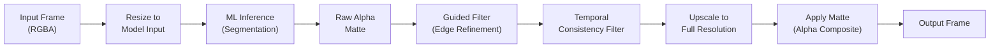
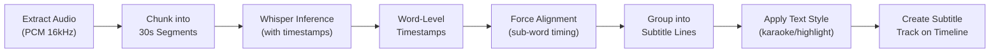

## VE-13. AI-Powered Features (CapCut-class)

### 13.1 ML Inference Engine

```cpp
namespace gp::ai {

enum class InferenceBackend {
    CoreML,          // iOS / macOS (ANE acceleration)
    NNAPI,           // Android (NPU / GPU delegate)
    TensorRT,        // Windows / NVIDIA (CUDA)
    DirectML,        // Windows (any GPU via DirectX)
    OnnxRuntime,     // Cross-platform fallback
};

class InferenceEngine {
public:
    static std::unique_ptr<InferenceEngine> create_for_platform();

    bool load_model(const std::string& model_id, const uint8_t* data, size_t size);
    void unload_model(const std::string& model_id);

    // Synchronous inference (blocking)
    InferenceResult run(const std::string& model_id,
                        const std::vector<Tensor>& inputs);

    // Async inference (for video processing)
    TaskHandle run_async(const std::string& model_id,
                         const std::vector<Tensor>& inputs,
                         std::function<void(InferenceResult)> callback);

    InferenceBackend backend() const;
    std::vector<std::string> loaded_models() const;
    size_t model_memory_usage(const std::string& model_id) const;
};

struct Tensor {
    std::vector<int64_t> shape;
    TensorDataType dtype;     // Float32, Float16, Int8, UInt8
    void* data;
    size_t data_size;
};

} // namespace gp::ai
```

### 13.2 AI Features Catalog

| Feature | Model | Input | Output | Performance Target |
|---|---|---|---|---|
| **Background Removal** | Segment Anything variant / MODNet | Single frame RGBA | Alpha matte | < 30 ms per frame (mobile) |
| **Portrait Segmentation** | MediaPipe / custom | Single frame | Person mask (hair, body, background) | Real-time (60fps on mobile) |
| **Scene Detection** | TransNet V2 | Sequence of frames | List of cut timestamps | < 1s for 1 min of video |
| **Auto Captions (ASR)** | Whisper (small/medium) | Audio PCM | SRT/VTT subtitle data | Real-time factor < 0.5 |
| **Object Tracking** | SORT / DeepSORT | Bounding box + frames | Per-frame bounding boxes | Real-time |
| **Face Detection** | BlazeFace / RetinaFace | Single frame | Face bounding boxes + landmarks | < 10 ms |
| **Face Mesh** | MediaPipe Face Mesh | Cropped face | 468 landmark points | Real-time |
| **Body Pose** | MediaPipe Pose / MoveNet | Single frame | 33 body keypoints | Real-time |
| **Hand Tracking** | MediaPipe Hands | Single frame | 21 hand landmarks | Real-time |
| **Style Transfer** | AdaIN / arbitrary style | Content + style image | Stylized frame | < 100 ms (mobile) |
| **Super Resolution** | Real-ESRGAN (mobile-optimized) | Low-res frame | 2x/4x upscaled frame | < 200 ms per frame |
| **Noise Reduction** | NAFNet variant | Noisy frame | Denoised frame | < 50 ms per frame |
| **Sky Replacement** | Custom segmentation | Frame + sky image | Composited frame | < 50 ms |
| **Color Match** | Custom color histogram matching | Reference + target | Color-matched target | < 20 ms |
| **Auto Reframe** | Saliency + face detection | Full frame | Crop region for target aspect ratio | < 30 ms |
| **Smart Trim** | Scene detection + audio energy | Video file | Highlight timestamps | < 2s for 1 min |
| **Audio Noise Reduction** | RNNoise / DeepFilterNet | Audio PCM | Cleaned audio PCM | Real-time |
| **Voice Isolation** | Demucs variant | Mixed audio | Isolated voice track | Near-real-time |
| **Music Detection** | YAMNet / VGGish | Audio | Music vs speech segments | Real-time |

### 13.3 Background Removal Pipeline



### 13.4 Auto-Caption Pipeline



### 13.5 Model Distribution

| Strategy | Description |
|---|---|
| **Bundled** | Small models (< 5 MB) bundled with app binary: face detection, body pose |
| **On-Demand Download** | Medium models (5–100 MB) downloaded on first use: background removal, ASR |
| **Cloud Inference** | Large models (> 100 MB) run on server: style transfer (high-quality), voice isolation |
| **Model Cache** | Downloaded models cached with LRU eviction; total cache budget 200 MB on mobile, 500 MB on desktop |
| **Quantization** | All on-device models quantized to INT8 or FP16 for mobile inference speed |
| **Platform-Optimized** | Separate model variants: CoreML (iOS/macOS), TFLite (Android), ONNX (Windows) |

---

## Development Sprint Plan

### Sprint Assignment

| Attribute | Value |
|---|---|
| **Phase** | Phase 6: AI Features |
| **Sprint(s)** | VE-Sprint 16-18 (Weeks 31-36) |
| **Team** | C/C++ Engine Developer (2), Tech Lead |
| **Predecessor** | [12-transitions-text-audio](12-transitions-text-audio.md) |
| **Successor** | [17-plugin-architecture](17-plugin-architecture.md) |
| **Story Points Total** | 98 |

### User Stories

| ID | Story | Acceptance Criteria | Points | Priority | Dependencies |
|---|---|---|---|---|---|
| VE-201 | As a C++ engine developer, I want an InferenceEngine factory that selects CoreML/NNAPI/ONNX per platform so that AI features run optimally on each OS | - Factory returns platform-appropriate backend<br/>- CoreML on iOS/macOS, NNAPI on Android, ONNX on Windows<br/>- Fallback to software when HW unavailable | 5 | P0 | — |
| VE-202 | As a C++ engine developer, I want model load/unload lifecycle management so that memory is released when models are no longer needed | - load_model accepts model_id and binary data<br/>- unload_model frees all associated memory<br/>- No leaks under repeated load/unload cycles | 3 | P0 | VE-201 |
| VE-203 | As a C++ engine developer, I want synchronous inference for blocking use cases so that simple workflows can run inline | - run() blocks until inference completes<br/>- Returns InferenceResult with output tensors<br/>- Handles errors gracefully | 2 | P0 | VE-201 |
| VE-204 | As a C++ engine developer, I want async inference for video processing so that the UI remains responsive during batch processing | - run_async returns TaskHandle immediately<br/>- Callback invoked on completion<br/>- Supports cancellation | 5 | P0 | VE-201 |
| VE-205 | As a C++ engine developer, I want a Tensor I/O abstraction so that models can exchange data regardless of backend | - Tensor struct with shape, dtype, data pointer<br/>- Conversion utilities for common formats (RGBA, NV12)<br/>- Zero-copy where possible | 3 | P0 | VE-201 |
| VE-206 | As a C++ engine developer, I want background removal using segmentation + guided filter + temporal consistency so that subjects are cleanly isolated | - Segmentation model inference per frame<br/>- Guided filter for edge refinement<br/>- Temporal consistency across frames | 8 | P0 | VE-202, VE-204 |
| VE-207 | As a C++ engine developer, I want portrait segmentation (hair/body/background) so that selective editing is possible | - MediaPipe or custom model integration<br/>- Outputs person mask with hair/body/background<br/>- Real-time on mobile (60fps target) | 5 | P1 | VE-206 |
| VE-208 | As a C++ engine developer, I want scene detection (TransNet V2) so that cuts can be auto-detected for smart editing | - TransNet V2 model integration<br/>- Returns list of cut timestamps<br/>- < 1s for 1 min of video | 5 | P1 | VE-202 |
| VE-209 | As a C++ engine developer, I want an auto-captions pipeline (audio→Whisper→align→subtitle track) so that videos get accurate captions automatically | - Audio extract to PCM 16kHz<br/>- Chunk into 30s segments, Whisper inference<br/>- Force alignment, group into lines, create subtitle track | 8 | P0 | VE-202, VE-204 |
| VE-210 | As a C++ engine developer, I want object tracking (SORT/DeepSORT) so that bounding boxes persist across frames | - SORT or DeepSORT integration<br/>- Input: initial bbox + frame sequence<br/>- Output: per-frame bounding boxes | 5 | P1 | VE-202 |
| VE-211 | As a C++ engine developer, I want face detection (BlazeFace/RetinaFace) so that faces can be located for effects | - BlazeFace or RetinaFace model<br/>- Outputs face bboxes + landmarks<br/>- < 10 ms per frame | 3 | P1 | VE-202 |
| VE-212 | As a C++ engine developer, I want face mesh (468 landmarks) so that face effects and AR features work | - MediaPipe Face Mesh integration<br/>- 468 landmark points per face<br/>- Real-time performance | 5 | P1 | VE-211 |
| VE-213 | As a C++ engine developer, I want body pose (33 keypoints) so that motion graphics can attach to body parts | - MediaPipe Pose or MoveNet<br/>- 33 body keypoints output<br/>- Real-time on mobile | 5 | P1 | VE-202 |
| VE-214 | As a C++ engine developer, I want hand tracking (21 landmarks) so that hand gestures can drive effects | - MediaPipe Hands integration<br/>- 21 hand landmarks per hand<br/>- Real-time performance | 3 | P2 | VE-202 |
| VE-215 | As a C++ engine developer, I want style transfer (AdaIN) so that artistic filters can be applied | - AdaIN or arbitrary style model<br/>- Content + style image input<br/>- < 100 ms on mobile | 5 | P2 | VE-202 |
| VE-216 | As a C++ engine developer, I want super resolution (Real-ESRGAN 2x/4x) so that low-res footage can be upscaled | - Real-ESRGAN mobile-optimized<br/>- 2x and 4x upscale options<br/>- < 200 ms per frame | 5 | P2 | VE-202 |
| VE-217 | As a C++ engine developer, I want AI video noise reduction so that noisy footage is cleaned | - NAFNet or similar denoising model<br/>- Noisy frame → denoised frame<br/>- < 50 ms per frame | 5 | P2 | VE-202 |
| VE-218 | As a C++ engine developer, I want sky replacement (segmentation + composite) so that skies can be swapped | - Sky segmentation model<br/>- Composite with replacement sky image<br/>- < 50 ms per frame | 5 | P2 | VE-206 |
| VE-219 | As a C++ engine developer, I want color match (histogram matching) so that clips can match a reference look | - Reference + target frame input<br/>- Histogram matching algorithm<br/>- < 20 ms | 2 | P2 | — |
| VE-220 | As a C++ engine developer, I want auto-reframe (saliency + face crop) so that content fits target aspect ratios | - Saliency map + face detection<br/>- Output crop region for target ratio<br/>- < 30 ms | 5 | P1 | VE-211 |
| VE-221 | As a C++ engine developer, I want smart trim (scene detect + audio energy) so that highlights can be auto-selected | - Scene detection + audio energy analysis<br/>- Returns highlight timestamps<br/>- < 2s for 1 min video | 5 | P2 | VE-208 |
| VE-222 | As a C++ engine developer, I want audio noise reduction (RNNoise/DeepFilterNet) so that dialogue is cleaner | - RNNoise or DeepFilterNet integration<br/>- PCM in → cleaned PCM out<br/>- Real-time capable | 5 | P1 | VE-202 |
| VE-223 | As a C++ engine developer, I want voice isolation (Demucs variant) so that voice can be separated from music | - Demucs or similar model<br/>- Mixed audio → isolated voice<br/>- Near-real-time | 8 | P2 | VE-202 |
| VE-224 | As a C++ engine developer, I want model distribution (bundled/download/cloud) so that models are available per strategy | - Bundled: small models in app binary<br/>- On-demand download for medium models<br/>- Cloud inference for large models | 5 | P0 | VE-201 |
| VE-225 | As a C++ engine developer, I want model cache with LRU eviction so that downloaded models are managed efficiently | - LRU eviction when over budget<br/>- 200 MB mobile, 500 MB desktop budget<br/>- Persist cache across sessions | 3 | P0 | VE-224 |

### Definition of Done

- [ ] All stories in this section marked complete
- [ ] Code reviewed and merged to `develop`
- [ ] Unit tests passing (≥ 90% coverage for new code)
- [ ] Google Test suite green
- [ ] Memory leak check (ASan) passing
- [ ] Performance benchmark recorded (no regression)
- [ ] C API header updated if public interface changed
- [ ] Sprint review demo completed
