# Video Editor Engine — Architecture Diagrams

> Architecture diagrams for `libgopost_ve`, the shared C/C++ video editor engine.
> Maps to implementation documents in `docs/video-editor-engine/`.

---

## 1. Module Layout & Dependency Graph

> Ref: [02-engine-architecture.md](02-engine-architecture.md)

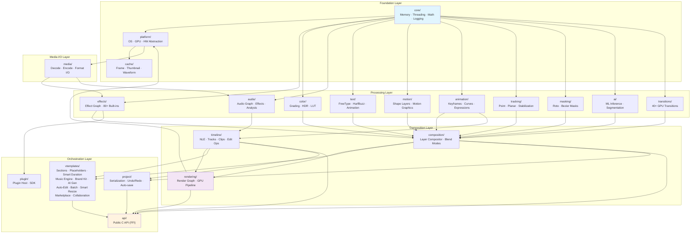

---

## 2. Threading Architecture

> Ref: [02-engine-architecture.md](02-engine-architecture.md), [03-core-foundation.md](03-core-foundation.md)

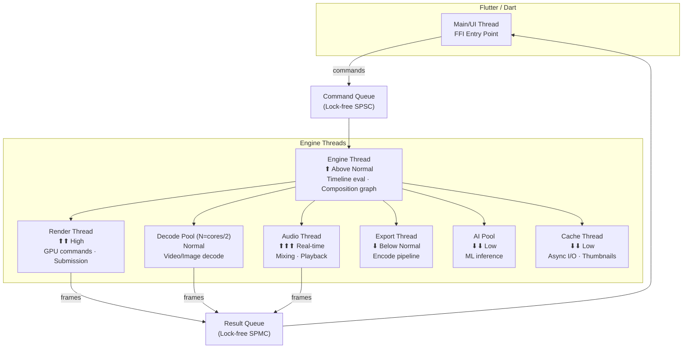

---

## 3. Timeline Data Model

> Ref: [04-timeline-engine.md](04-timeline-engine.md)

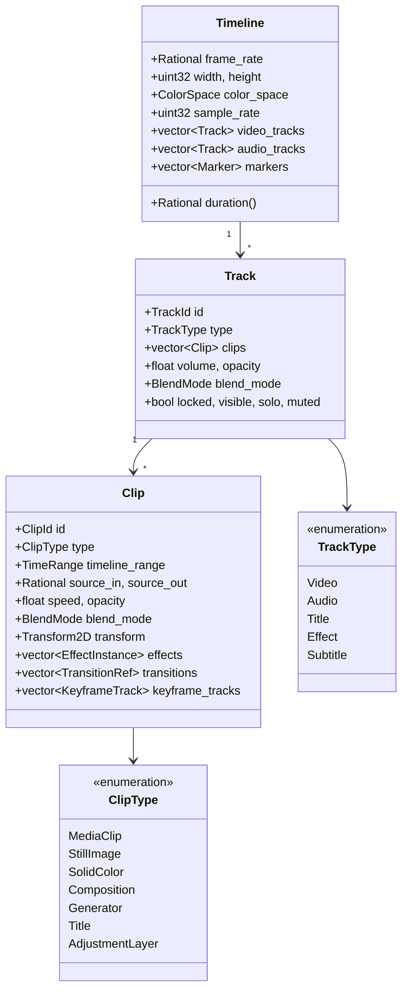

---

## 4. Timeline Evaluation Pipeline

> Ref: [04-timeline-engine.md](04-timeline-engine.md)

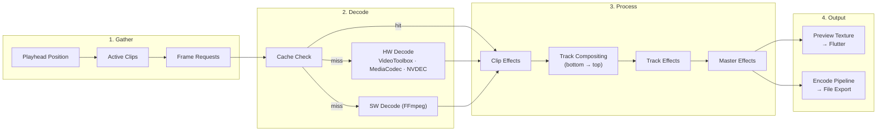

---

## 5. Composition Engine

> Ref: [05-composition-engine.md](05-composition-engine.md)

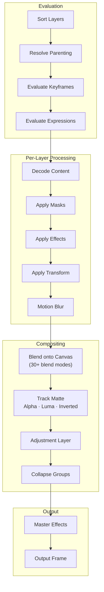

---

## 6. GPU Rendering Pipeline

> Ref: [06-gpu-rendering-pipeline.md](06-gpu-rendering-pipeline.md)

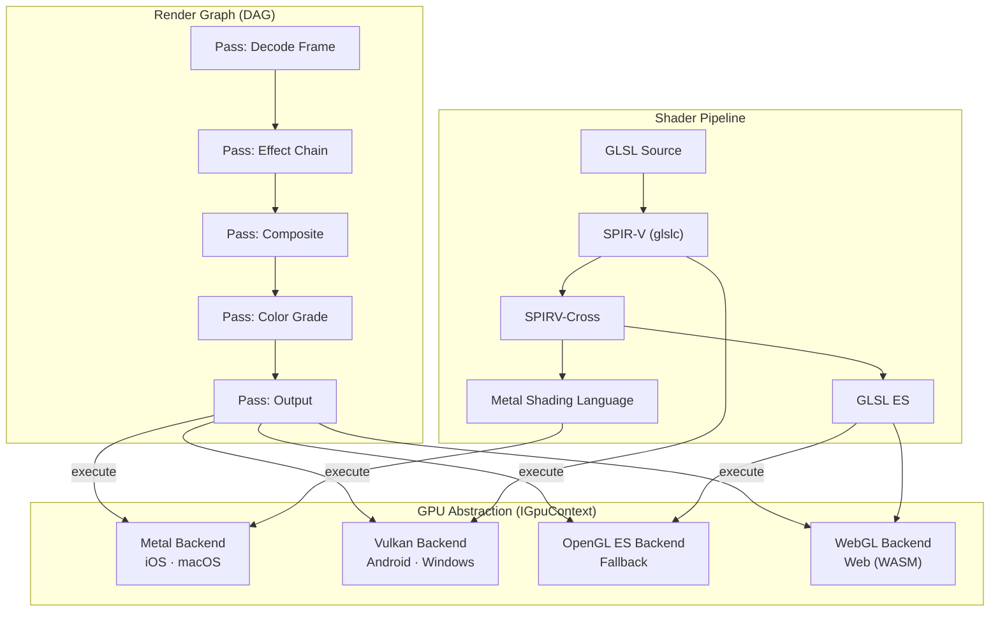

---

## 7. Effects & Filter System

> Ref: [07-effects-filter-system.md](07-effects-filter-system.md)

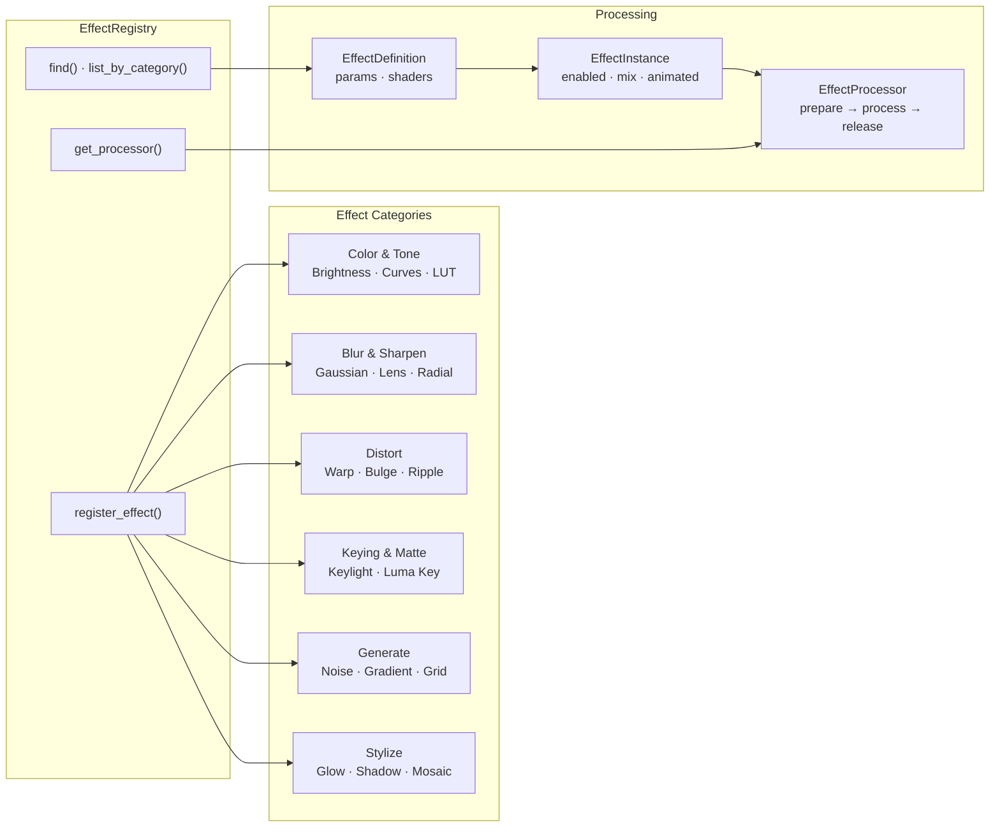

---

## 8. Audio Engine

> Ref: [11-audio-engine.md](11-audio-engine.md)

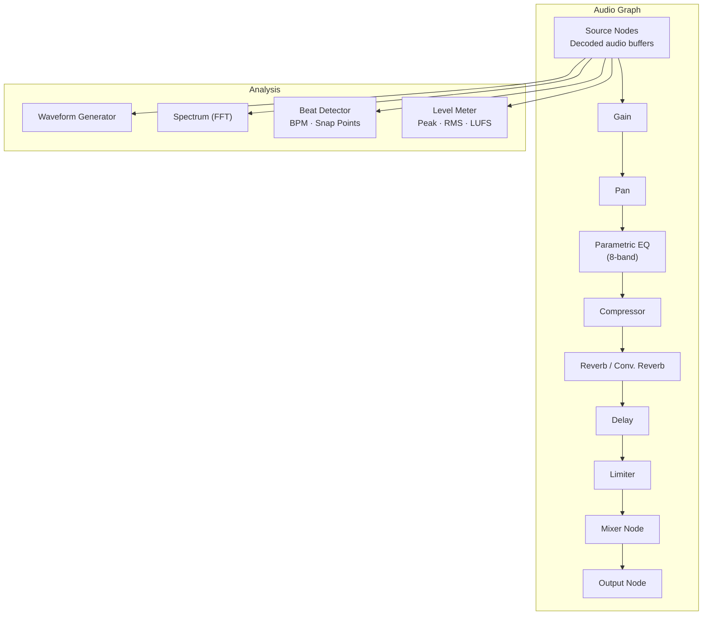

---

## 9. Media I/O & Codec Pipeline

> Ref: [15-media-io-codec.md](15-media-io-codec.md)

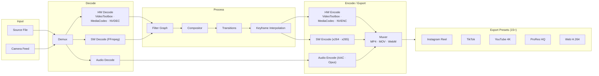

---

## 10. Video Template System

> Ref: [25-template-system.md](25-template-system.md)

```mermaid
graph TB
    subgraph core_tmpl ["Core Template"]
        VT["VideoTemplate<br/>Timeline · Sections · Placeholders"]
        SEC["Template Sections<br/>Intro · Content · CTA · Outro"]
        PH["Placeholder System<br/>Media · Text · Audio · Logo · Grade"]
    end

    subgraph style ["Style & Audio"]
        SC["Style Controls<br/>Grade · Font · Transitions · Pacing"]
        MUS["Music Engine<br/>Beat Sync · Auto-Duck · Library"]
        PAL["Palette + Grade<br/>80+ LUT Presets · Custom Grading"]
    end

    subgraph smart ["Smart Engines"]
        DUR["Smart Duration<br/>Auto-Adapt · Beat-Aligned Cuts"]
        RSZ["Smart Resize<br/>Multi-Platform · Auto-Reframe"]
        AE["Auto-Edit Engine<br/>Scene Detect · Highlight · Beat Match"]
    end

    subgraph ai_tmpl ["AI Features"]
        AIGEN["AI Generator<br/>Text-to-Video-Template"]
        AISC["AI Scene Analysis<br/>Moment Detection · Ranking"]
        AITX["AI Text/Music<br/>Captions · Music Match"]
    end

    subgraph authoring ["Authoring & Distribution"]
        STUDIO["Creator Studio<br/>Author · Preview · Validate · Package"]
        BRAND["Video Brand Kit<br/>Intro · Outro · Lower Thirds · Grade"]
        ANIM["Animation Library<br/>80+ Text Reveals · 30+ Kinetic"]
        BATCH["Data-Driven Batch<br/>CSV/JSON → Personalized Videos"]
        MKTPL["Marketplace<br/>Publish · Search · Rate · Collections"]
        COLLAB["Collaboration<br/>Version · Share · Comment · Library"]
    end

    VT --> SEC & PH
    VT --> SC & MUS & PAL
    VT --> DUR & RSZ & AE
    VT --> AIGEN & STUDIO & BRAND & ANIM & BATCH & MKTPL & COLLAB
    AISC --> AE
    AITX --> AIGEN
    MUS --> DUR
    STUDIO --> MKTPL
    COLLAB --> MKTPL

    style VT fill:#e8f5e9
    style AIGEN fill:#e1f5fe
    style MKTPL fill:#fff3e0
    style AE fill:#f3e5f5
```

---

## 11. Public C API (FFI Boundary)

> Ref: [21-public-c-api.md](21-public-c-api.md)

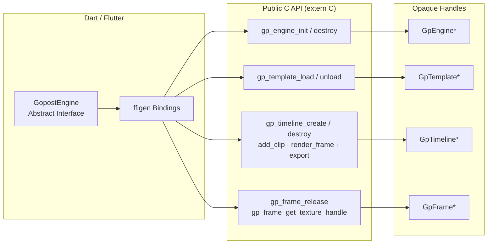

---

## 12. Development Roadmap (48 Weeks)

> Ref: [23-development-roadmap.md](23-development-roadmap.md)

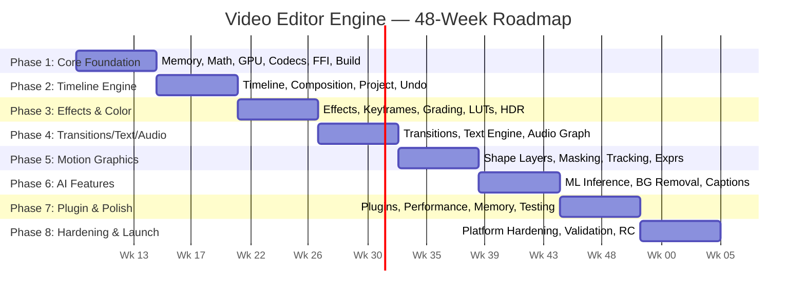

---

## Module Cross-Reference

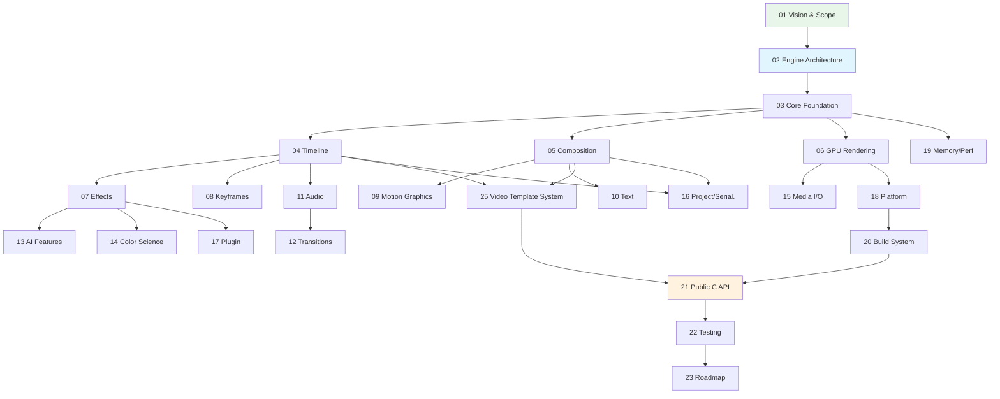
